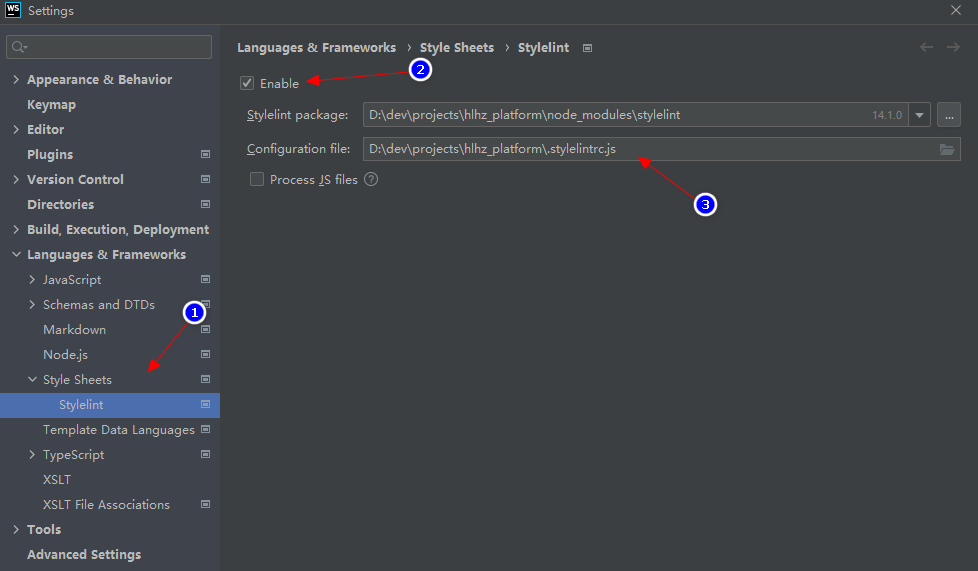

# StyleLint

>使用 SCSS

## 1. 依赖

```shell
npm i -D stylelint stylelint-config-standard-scss

npm i -D stylelint-config-recess-order
```

## 2. 配置

创建 `${root}/.stylelintrc.js` 文件：

```javascript
module.exports = {
  "extends": [
    'stylelint-config-recess-order',
    "stylelint-config-standard-scss",
  ]
};
```

## 3. 忽略

### 3.1. 文件/目录

创建 `${root}/.stylelintignore` 文件：

```text
#region 只校验 SCSS 和 CSS 文件

*.*
!*.css
!*.scss

#endregion


**/*.min.css
**/dist/
/node_modules/
/src/commons/styles/theme/
```

### 3.2. 某些代码

```scss
// 当前文件，禁用所有
/* stylelint-disable */

// 当前文件，禁用某些规则
/* stylelint-disable selector-no-id, declaration-no-important */


// 下一行
/* stylelint-disable-next-line declaration-no-important */
```

## 4. 在 webstorm 中启用



## 5. 参考

* [官网](https://stylelint.io/)