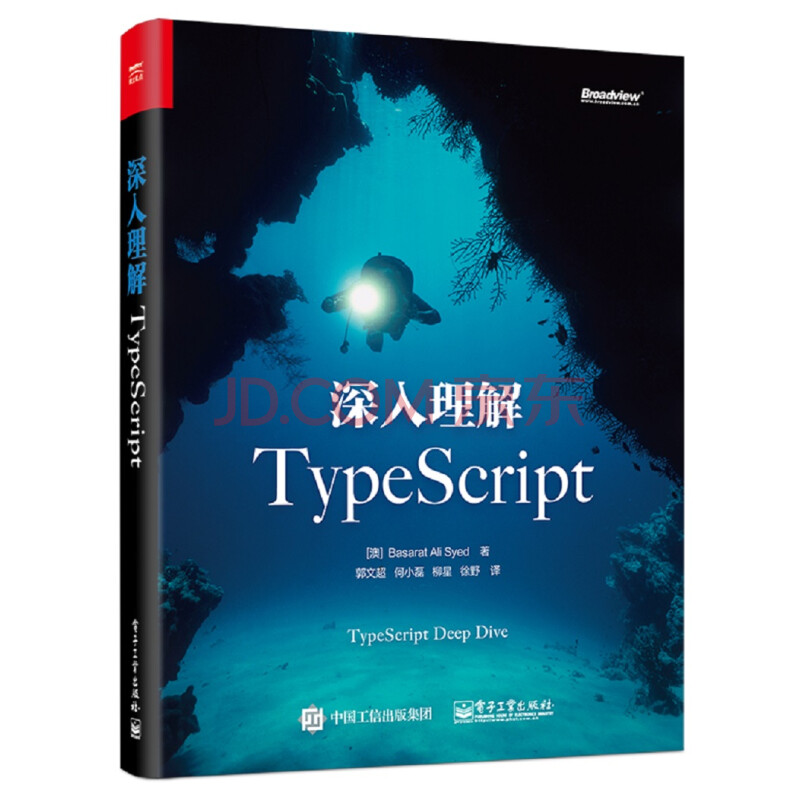
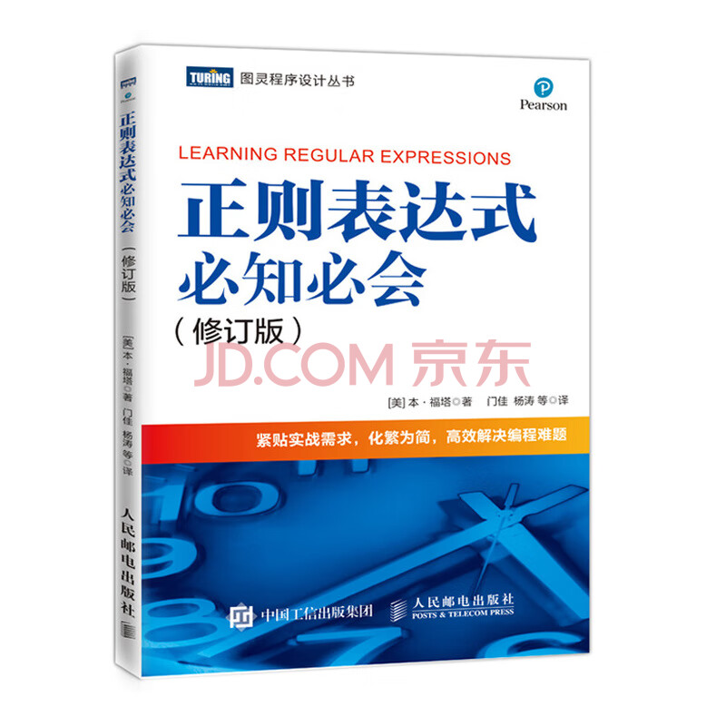
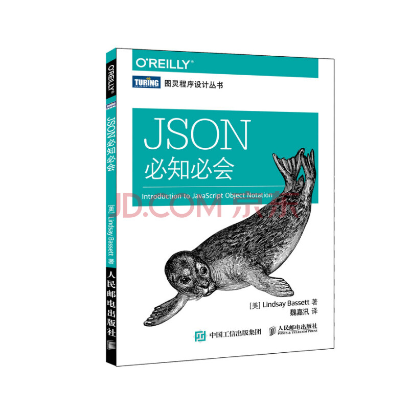
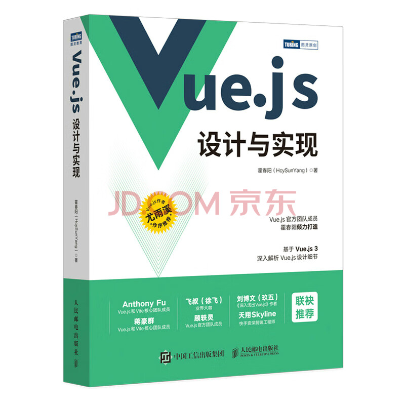

<!--#region
@author 吴钦飞
@email wuqinfei@qq.com
@create date 2023-11-18 15:04:12
@modify date 2025-08-28 18:22:53
@desc [description]
#endregion-->

# 介绍

## 1. 说明

用于存放开发相关的资料

项目仓库地址： [https://github.com/forwardNow/blog](https://github.com/forwardNow/blog)

## 2. 【进行中】学习计划

### 2.1. shiro

说明：

* 视频地址：[尚硅谷Shiro安全框架实例教程（4h深入掌握shiro）](https://www.bilibili.com/video/BV11e4y1n7BH)

计划：

* [./others/plan/06.shiro-计划.md](./others/plan/06.shiro-计划.md)

笔记：

* [back-end/java/shiro/sgg/00.shiro.md](./back-end/java/shiro/sgg/00.shiro.md)

## 3. 【待规划】学习计划

* MyBatis
* MyBatis Plus
* Spring
* Vue3
* Java 并发
* Java 多线程

### 3.1. Redis

说明：

* 视频地址：[黑马程序员Redis入门到实战教程，深度透析redis底层原理+redis分布式锁+企业解决方案+黑马点评实战项目](https://www.bilibili.com/video/BV1cr4y1671t)

计划：

* [./others/plan/06.redis-计划.md](./others/plan/06.redis-计划.md)

笔记：

* [back-end/java/redis/heima/00.redis.md](./back-end/java/redis/heima/00.redis.md)

### 3.2. Java 并发

说明：

* 视频地址：[【Java并发】CompletableFuture](https://www.bilibili.com/video/BV1nA411g7d2)

### 3.3. Java 多线程

说明：

* 视频地址：[黑马程序员深入学习Java并发编程，JUC并发编程全套教程](https://www.bilibili.com/video/BV16J411h7Rd)

## 4. 【已完成】学习计划

### 4.1. Java 新特性

说明：

* 视频地址：[JavaJDK新特性详解系列教程](https://www.bilibili.com/video/BV1zJ411R7uQ)

计划：

* [./others/plan/05.jdk-features-计划.md](./others/plan/05.jdk-features-计划.md)

笔记：

* [back-end/java/jdk/heima/00.jdk-features](./back-end/java/jdk/heima/00.jdk-features)

### 4.2. MinIO

说明：

* 视频地址：[MinIO分布式文件存储,Spring Boot整合MinIO,MinIO集群,MinIO上传,MinIO下载](https://www.bilibili.com/video/BV1Gx4y1Y7Rg)

计划：

* [./others/plan/04.minio-计划.md](./others/plan/04.minio-计划.md)

笔记：

* [back-end/java/minio/power-node/00.minio.md](./back-end/java/minio/power-node/00.minio.md)

### 4.3. SSM 框架

说明：

* 视频地址：[黑马程序员SSM框架教程_Spring+SpringMVC+Maven高级+SpringBoot+MyBatisPlus企业实用开发技术
](https://www.bilibili.com/video/BV1Fi4y1S7ix)

计划：

* [./others/plan/03.SSM-计划.md](./others/plan/03.SSM-计划.md)

笔记：

* [back-end/java/ssm/heima/00.ssm.md](./back-end/java/ssm/heima/00.ssm.md)

### 4.4. MySQL

说明：

* 视频地址：[黑马程序员 MySQL数据库入门到精通，从mysql安装到mysql高级、mysql优化全囊括](https://www.bilibili.com/video/BV1Kr4y1i7ru)

计划：

* [./others/plan/02.MySQL-计划.md](./others/plan/02.MySQL-计划.md)

笔记：

* [back-end/database/mysql/heima/01.MySQL-基础.md](./back-end/database/mysql/heima/01.MySQL-基础.md)

### 4.5. 微信小程序 √

说明：

* 视频地址：[黑马程序员前端微信小程序开发教程](https://www.bilibili.com/video/BV1834y1676P)

计划：

* [./others/plan/01.微信小程序-计划.md](./others/plan/01.微信小程序-计划.md)

笔记：

* [front-end/wechart/min-program/guide](./front-end/wechart/min-program/guide/01.微信小程序-起步.md)

总结：

* 非常详细、完整
* 适合新手

### 4.6. 《深入理解TypeScript》√

说明：

| 类别 | 说明 |
| :- | :- |
| 书名 | 《深入理解 TypeScript》 |
| 作者 | Basarat Ali Syed |
| 翻译 | 郭文超、何小磊 等 |
| 出版社 | 电子工业出版社 |
| 版次 | 2020年 1 月 第 1 版 |
| 印次 | 2021 年 1 月 第 4 次印刷 |

笔记：

* [front-end/typescript/深入理解TypeScript](./front-end/typescript/深入理解TypeScript/01.为什么要使用TypeScript.md)

总结：

* 不建议购买与阅读
* 很多地方讲得不清不楚，有一定 TS 基础的都看得非常烦躁

### 4.7. 《正则表达式必知必会》√

说明：

| 类别 | 说明 |
| :- | :- |
| 书名 | 《正则表达式必知必会》 |
| 作者 | 本·福塔 |
| 翻译 | 门佳、杨涛等 |
| 出版社 | 人民邮电出版社 |
| 版次 | 2019 年 7 月 第 1 版 |
| 印次 | 2022 年 3 月 河北 第 11 次印刷 |

笔记：

* [books/正则表达式必知必会](./books/02.正则表达式必知必会.md)

总结：

* 言简意赅，适合初学者

### 4.8. 《JSON 必知必会》√

说明：

| 类别 | 说明 |
| :- | :- |
| 书名 | 《JSON 必知必会》 |
| 作者 | Lindsay Bassett |
| 翻译 | 魏嘉汛 |
| 出版社 | 人民邮电出版社 |
| 版次 | 2016 年 5 月 第 1 版 |
| 印次 | 2021 年 12 月 北京 第 15 次印刷 |

笔记：

* [books/JSON必知必会](./books/03.JSON必知必会.md)

总结：

* 作为凑单的书籍，读完后比想象中有收获，前半部分（前五章）不错，后半部分感觉有点水

## 5. 已暂停

### 5.1. 《Vue.js 设计与实现》

说明：

| 类别 | 说明 |
| :- | :- |
| 书名 | 《Vue.js 设计与实现》 |
| 作者 | 霍春阳 |
| 出版社 | 人民邮电出版社 |
| 版次 | 2022 年 1 月 第 1 版 |
| 印次 | 2022 年 3 月 河北 第 4 次印刷 |

笔记：

* [front-end/vue/vue3/vue.js设计与实现](./front-end/vue/vue3/vue.js设计与实现/第01章.权衡的艺术.md)

### 5.2. egg.js

说明：

* 视频地址：[Egg.js入门视频教程 - 200分钟学会Egg.js框架 掌握全栈开发( 完结)](https://www.bilibili.com/video/BV1s3411C71V/)
* [Egg.js快速入门 200分钟掌握企业级框架开发和应用](https://jspang.com/article/79)

笔记：

* [back-end/nodejs/egg/guide](./back-end/nodejs/egg/guide/01.egg.js快速开始.md)

总结：

* 非常详细、完整
* 适合新手

### 5.3. 《前端工程化 体系设计与实践》

说明：

| 类别 | 说明 |
| :- | :- |
| 书名 | 《前端工程化 体系设计与实践》 |
| 作者 | 周俊鹏 |
| 出版社 | 电子工业出版社 |
| 版次 | 2018 年 1 月 第 1 版 |
| 印次 | 2021 年 11 月 第 13 次印刷 |

笔记：

* [books/前端工程化-体系设计与实践](./books/05.前端工程化-体系设计与实践)

