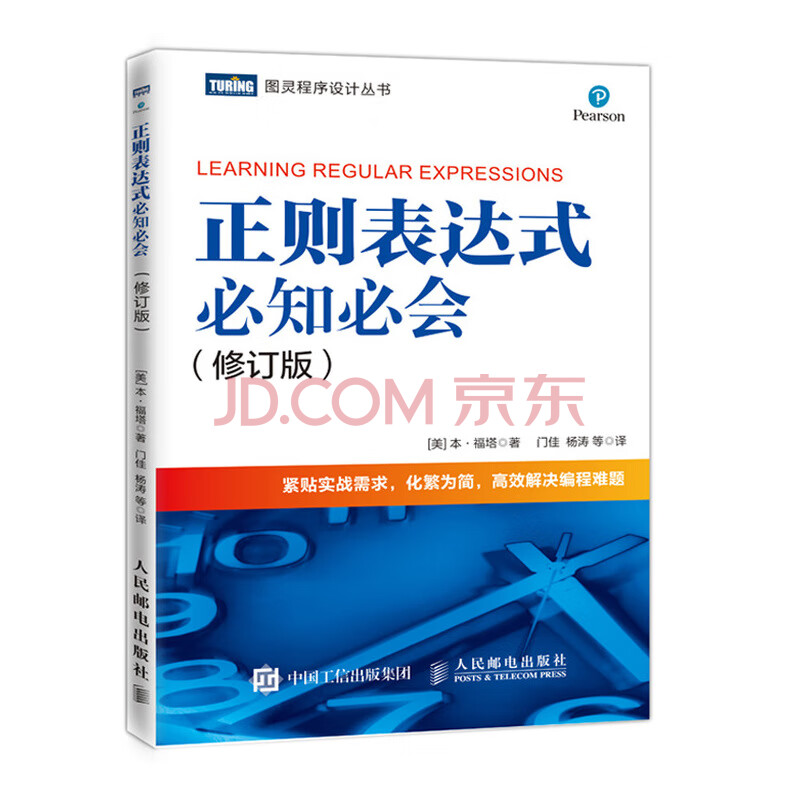
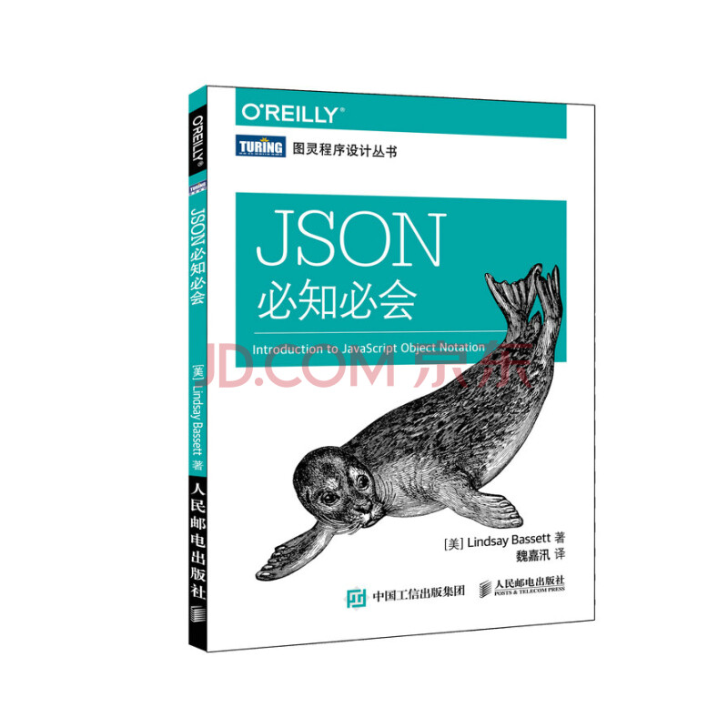

# 介绍

## 1. 说明

用于存放开发相关的资料

项目仓库地址： [https://github.com/forwardNow/blog](https://github.com/forwardNow/blog)

## 2. 学习计划

### 2.1. 微信小程序 √

说明：

* 视频地址：[黑马程序员前端微信小程序开发教程](https://www.bilibili.com/video/BV1834y1676P)

计划：

* [./others/plan/01.微信小程序-计划.md](./others/plan/01.微信小程序-计划.md)

笔记：

* [front-end/wechart/min-program/guide](./front-end/wechart/min-program/guide/01.微信小程序-起步.md)

总结：

* 非常详细、完整
* 适合新手

### 2.2. 《深入理解TypeScript》√

说明：

| 类别 | 说明 |
| :- | :- |
| 书名 | 《深入理解 TypeScript》 |
| 作者 | Basarat Ali Syed |
| 翻译 | 郭文超、何小磊 等 |
| 出版社 | 电子工业出版社 |
| 版次 | 2020年 1 月 第 1 版 |
| 印次 | 2021 年 1 月 第 4 次印刷 |

计划：

| 章节 | 章节页码 | 计划完成日期 | 实际完成日期 | 说明 |
| ---- | -------- | --------- | ----------- | ---- |
| 第 1 章 为什么要使用 TypeScript | 1 ~ 6 | 2023-07-12 | 2023-07-12 | √ | 
| 第 2 章 JavaScript 常见语法 | 7 ~ 23 | 2023-07-13 | 2023-07-12  |  √  |
| 第 3 章 JavaScript 新语法特性 | 24 ~ 88 | 2023-07-14 | 2023-07-12  |  √  |
| 第 4 章 TypeScript 项目构成 | 89 ~ 107 | 2023-07-15 | 2023-07-12  |  √  |
| 第 5 章 快速创建 TypeScript 项目 | 108 ~ 116 | 2023-07-16 | 2023-07-13  |  √  |
| 第 6 章 TypeScript 类型系统 | 117 ~ 230 | 2023-07-17 | 2023-07-15  |  √  |
| 第 7 章 关于 JSX | 231 ~ 240 | 2023-07-18 | 2023-07-15  |  √  |
| 第 8 章 TypeScript 编译选项设置 | 241 ~ 246 | 2023-07-19 | 2023-07-15  |  √  |
| 第 9 章 TypeScript 错误处理 | 247 ~ 251 | 2023-07-20 | 2023-07-15  |  √  |
| 第 10 章 开发与测试工具 | 252 ~ 265 | 2023-07-21 | 2023-07-15  |  √  |
| 第 11 章 提示与建议 | 266 ~ 299 | 2023-07-22 | 2023-07-16  |  √  |
| 第 12 章 TypeScript 代码风格指南与代码约定 | 300 ~ 307 | 2023-07-23 | 2023-07-16  |  √  |
| 第 13 章 TypeScript 编译原理 | 308 ~ 348 | 2023-07-24 | 2023-07-16  |  √  |

笔记：

* [front-end/typescript/深入理解TypeScript](./front-end/typescript/深入理解TypeScript/01.为什么要使用TypeScript.md)

总结：

* 不建议购买与阅读
* 很多地方讲得不清不楚，有一定 TS 基础的都看得非常烦躁

### 2.3. 《正则表达式必知必会》√

说明：

| 类别 | 说明 |
| :- | :- |
| 书名 | 《正则表达式必知必会》 |
| 作者 | 本·福塔 |
| 翻译 | 门佳、杨涛等 |
| 出版社 | 人名邮电出版社 |
| 版次 | 2019 年 7 月 第 1 版 |
| 印次 | 2022 年 3 月 河北 第 11 次印刷 |

计划：

| 章节 | 章节页码 | 计划完成日期 | 实际完成日期 | 说明 |
| ---- | -------- | --------- | ----------- | ---- |
| 第 1 章 正则表达式入门 | 1 ~ 6 | 2023-07-17 | 2023-07-17 | √ | 
| 第 2 章 匹配单个字符 | 7 ~ 15 | 2023-07-17 | 2023-07-17 | √ | 
| 第 3 章 匹配一组字符 | 16 ~ 24 | 2023-07-17 | 2023-07-17 | √ | 
| 第 4 章 使用元字符 | 25 ~ 36 | 2023-07-18 | 2023-07-17  |  √  |
| 第 5 章 重复匹配 | 37 ~ 51 | 2023-07-18 | 2023-07-18 | √ | 
| 第 6 章 位置匹配 | 52 ~ 60 | 2023-07-19 | 2023-07-18  |  √  |
| 第 7 章 使用子表达式 | 61 ~ 68 | 2023-07-19 | 2023-07-18  |  √  |
| 第 8 章 反向引用 | 69 ~ 79 | 2023-07-19 | 2023-07-18  |  √  |
| 第 9 章 环视 | 80 ~ 89 | 2023-07-20 | 2023-07-19  |  √  |
| 第 10 章 嵌入式条件 | 90 ~ 96 | 2023-07-20 | 2023-07-19  |  √  |
| 第 11 章 常见正则 | 97 ~ 113 | 2023-07-20 | 2023-07-19  |  √  |

笔记：

* [books/正则表达式必知必会](./books/02.正则表达式必知必会.md)

总结：

* 言简意赅，适合初学者

### 2.4. 《JSON 必知必会》

说明：

| 类别 | 说明 |
| :- | :- |
| 书名 | 《JSON 必知必会》 |
| 作者 | Lindsay Bassett |
| 翻译 | 魏嘉汛 |
| 出版社 | 人名邮电出版社 |
| 版次 | 2016 年 5 月 第 1 版 |
| 印次 | 2021 年 12 月 北京 第 15 次印刷 |

计划：

| 章节 | 章节页码 | 计划完成日期 | 实际完成日期 | 说明 |
| ---- | -------- | --------- | ----------- | ---- |
| 第 1 章 什么是 JSON | 1 ~ 6 | 2023-07-20 | - | - | 
| 第 2 章 JSON 语法 | 7 ~ 16 | 2023-07-20 | - | - | 
| 第 3 章 JSON 的数据类型 | 17 ~ 32 | 2023-07-20 | - | - | 
| 第 4 章 JSON Schema | 33 ~ 42 | 2023-07-21 | - | - | 
| 第 5 章 JSON 中的安全问题 | 43 ~ 52 | 2023-07-21 | - | - | 
| 第 6 章 JavaScript 中的 XMLHttpRequest 与 Web API | 53 ~ 66 | 2023-07-21 | - | - | 
| 第 7 章 JSON 与客户端框架 | 67 ~ 76 | 2023-07-22 | - | - | 
| 第 8 章 JSON 与 NoSQL | 77 ~ 90 | 2023-07-22 | - | - | 
| 第 9 章 服务端的 JSON  | 91 ~ 104 | 2023-07-23 | - | - | 
| 第 10 章 总结  | 105 ~ 109 | 2023-07-23 | - | - | 

笔记：

* [books/JSON必知必会](./books/03.JSON必知必会.md)