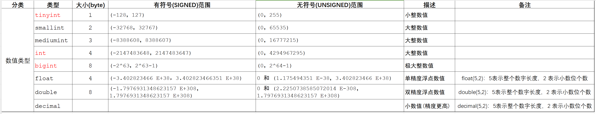
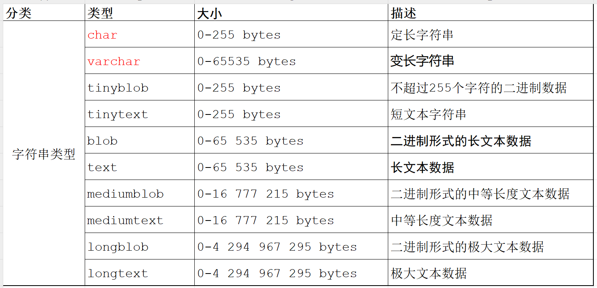
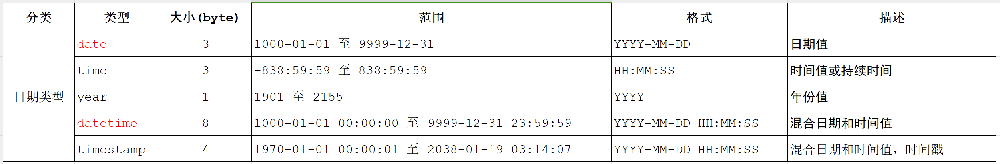
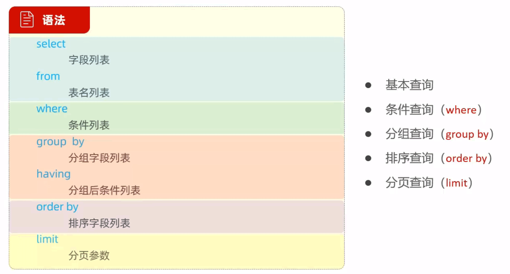

<!--#region
@author 吴钦飞
@email wuqinfei@qq.com
@create date 2023-10-21 17:05:23
@modify date 2023-11-06 18:44:12
@desc [description]
#endregion-->


# MySQL 快速入门

## 1. 介绍

什么是数据库?

* 数据库: DataBase (DB)，是存储和管理数据的仓库。
* 数据库管理系统: DataBase Management System (DBMS)，操纵和管理数据库的大型软件。
* SQL: Structured Query Language，操作关系型数据库的编程语言，定义了一套操作关系型数据库统一标准。

数据库产品:

* Oracle: 收费的大型数据库，Oracle 公司的产品。
* MysQL: 开源免费的中小型数据库。Sun 公司收购了 MySQL，Oracle 收购 Sun 公司
* SOL Server: MicroSoft 公司收费的中型的数据库。C#、.net 等语言常使用。
* PostgresQL: 开源免费中小型的数据库
* DB2: IBM 公司的大型收费数据库产品
* SQLite: 嵌入式的微型数据库。如:作为 Android 内置数据库
* MariaDB: 开源免费的中小型的数据库

## 2. 内容目录

1. 数据库设计

    1. MySQL概述
    2. 数据库设计-DDL
    3. 多表设计

2. 数据库操作

    1. 数据库操作-DML
    2. 数据库操作-DQL
    3. 事务
    4. 多表查询

3. 数据库优化

    1. 索引
    2. SQL优化

## 3. MySQL 概述

概要：

* 安装、配置
* 数据模型
* SQL 简介

### 3.1. 安装、配置

1. 下载

    * 下载地址： [https://dev.mysql.com/downloads/mysql/](https://dev.mysql.com/downloads/mysql/)
    * 下载文件： [mysql-8.0.34-winx64.zip](https://dev.mysql.com/get/Downloads/MySQL-8.0/mysql-8.0.34-winx64.zip)

2. 解压

    * `W:\res\mysql\mysql-8.0.34-winx64`

3. 配置

    1. 添加环境变量

        * MYSQL_HOME=W:\res\mysql\mysql-8.0.34-winx64
        * path=%MYSQL_HOME%\bin
        * 验证

            ```shell
            mysql
            # ERROR 2003 (HY000): Can't connect to MySQL server on 'localhost' (10061)
            ```

    2. 初始化 MySQL

        * 管理员身份运行 CMD
        
            ```shell
            # 生成 %MYSQL_HOME%\data 目录
            mysqld --initialize-insecure
            ```

    3. 注册 MySQL 服务

        * 管理员身份运行 CMD
        
            ```shell
            # 生成 %MYSQL_HOME%\data 目录
            mysqld -install
            
            # Service successfully installed.
            ```

        * 在 windows 搜索中可搜索“服务”配置，查看 MySQL 的服务


    4. 启动 MySQL 服务

        * 管理员身份运行 CMD
        
            ```shell
            # 启动 mysql 服务
            net start mysql

            # MySQL 服务正在启动 .
            # MySQL 服务已经启动成功。

            
            # 停止 mysql 服务
            net stop mysql
            ```

    5. 修改默认账号密码

        * 管理员身份运行 CMD
        
            ```shell
            mysqladmin -u root password 1234

            # mysqladmin: [Warning] Using a password on the command line interface can be insecure.
            # Warning: Since password will be sent to server in plain text, use ssl connection to ensure password safety.
            ```

4. 登录 MySQL

    * 语法： `mysql -u用户名 -p密码 [-h服务器地址 -P端口号]`
        
        ```shell
        # 登录
        mysql -uroot -p1234

        # 退出
        exit
        ```

5. 卸载 MySQL

    * 管理员身份运行 CMD
    
        ```shell
        # 停止服务
        net stop mysql

        # 删除服务
        mysqld -remove mysql

        # 删除目录及环境变量
        ```

### 3.2. 数据模型

关系型数据库(RDBMS):

* 建立在关系模型基础上，由多张相互连接的二维表组成的数据库
* 也就是说，由二维表组成的数据库

特点：

* 使用表存储数据，格式统一，便于维护
* 使用 SQL 语言操作，标准统一，使用方便，可用于复杂查询

### 3.3. SQL 简介

SQL:

* 一门操作关系型数据库的编程语言，定义操作所有关系型数据库的统一标准。

通用语法:

* SOL 语句可以单行或多行书写，以分号结尾
* SQL 语句可以使用空格或缩进来增强语句的可读性
* MySQL 数据库的 SQL 语句不区分大小写
* 注释：

    * 单行注释: 

        * `-- 注释内容`
        * `# 注释内容`, MySQL 特有

    * 多行注释:

        * `/* 注释内容 */`

SQL语句通常被分为四大类:

* DDL

    * Data Definition Language
    * 数据定义语言，用来定义数据库对象(数据库，表，字段)

* DML

    * Data Manipulation Language
    * 数据定义语言，用来定义数据库对象(数据库，表，字段)

* DQL

    * Data Query Language
    * 数据查询语言，用来查询数据库中表的记录

* DCL

    * Data Control Language
    * 数据控制语言，用来创建数据库用户、控制数据库的访问权限

## 4. 数据库设计-DDL

内容：

* 数据库
* 表 (创建、查询、修改、删除)

### 4.1. 数据库

DDL (数据库操作)：

* 查询

    * 查询所有数据库: `show databases;`
    * 查询当前数据库: `select database();`

* 使用

    * 使用数据库: `use 数据库名;`

* 创建

    * 创建数据库: `create database [ if not exists ] 数据库名;`

* 删除

    * 删除数据库: `drop database [ if exists ] 数据库名;`

* 注意：

    * 关键词 `database` 可以替换为 `schema`
    * 关键词 `databases` 可以替换为 `schemas`

示例:

```text
C:\Users\wuqinfei>mysql -uroot -p1234

mysql> create database db01;

mysql> show databases;
+--------------------+
| Database           |
+--------------------+
| db01               |
| information_schema |
| mysql              |
| performance_schema |
| sys                |
+--------------------+
5 rows in set (0.01 sec)

mysql> use db01;
Database changed

mysql> select database();
+------------+
| database() |
+------------+
| db01       |
+------------+
1 row in set (0.00 sec)

mysql> drop database db01;
Query OK, 0 rows affected (0.01 sec)
```

MySQL 客户端工具：

* SQLyog
* Navicat
* DataGrip
* IDEA（已集成 DataGrip）


### 4.2. 表

DDL (表操作)：

* 创建

    ```text
    create table 表名 (

        字段1   字段类型    [约束]   [comment 字段1注释],

        字段2   字段类型    [约束]   [comment 字段2注释],

        ...

        字段n   字段类型    [约束]   [comment 字段n注释]

    ) [comment 表注释] ;
    ```

* 查询

    * 查询当前数据库所有表: `show tables;`
    * 查询表结构: `desc 表名;`
    * 查询建表语句: `show create table 表名;`

* 修改

    * 添加字段: `alter table 表名 add 字段名 类型(长度) [comment 注释] [约束];`
    * 修改字段类型: `alter table 表名 modify 字段名 新数据类型(长度);`
    * 修改字段名和字段类型: `alter table 表名 change 旧字段名 新字段名 类型(长度) [comment 注释] [约束];`
    * 删除字段: `alter table 表名 drop column 字段名;`
    * 修改表名: `rename table 表名 to 新表名`

* 删除

    * 删除表: `drop table [if exists] 表名`

### 4.3. 约束

说明

* 概念: 约束是作用于表中字段上的规则，用于限制存储在表中的数据。
* 目的: 保证数据库中数据的正确性、有效性和完整性。

类别：

* 非空约束

    * `not null`
    * 限制该字段值不能为 null

* 唯一约束

    * `unique`
    * 保证字段的所有数据都是唯一、不重复的

* 主键约束

    * `primary key [auto_increment]`
    * 主键是一行数据的唯一标识，要求非空且唯一

* 默认约束

    * `default`
    * 保存数据时，如果未指定该字段值，则采用默认值

* 外键约束

    * `foreign key`
    * 让两张表的数据建立连接，保证数据的一致性和完整性

示例：

```sql
create table tb_user (
    id int primary key auto_increment comment '主键',
    username varchar(20) unique not null comment '用户名',
    name varchar(10) not null comment '姓名',
    age int comment '年龄',
    gender char(1) default '男' comment '性别'
) comment '用户表';
```

### 4.4. 数据类型

主要分为三类:

* 数值类型
* 字符串类型
* 日期时间类型

#### 4.4.1. 数值类型

类型：



说明：

* decimal, 类比 Java 中的 BigDecimal, 不会损失小数位精度

示例：

* age tinyint unsigned
* score double(4,1)

#### 4.4.2. 字符串类型

类型：



说明：

* char(10): 最多只能存10个字符,不足10个字符,占用10个字符空间。性能高	浪费空间
* varchar(10): 最多只能存10个字符,不足10个字符, 按照实际长度存储。性能低	节省空间

#### 4.4.3. 日期类型

类型：



#### 4.4.4. 案例

数据库设计：

* 原形字段

    * 原型上涉及的字段

* 基础字段

    * id
    * create_time
    * update_time

员工表：

```sql
create table tb_employer (
    id int primary key auto_increment comment '主键ID',
    username varchar(20) unique not null comment '用户名',
    password varchar(32) not null default '123456' comment '密码',
    name varchar(10) not null comment '姓名',
    gender tinyint unsigned comment '性别：1-男; 2-女',
    image varchar(300) comment '图像',
    job tinyint unsigned comment '职位',
    entry_date date not null comment '入职日期',
    create_time datetime not null comment '创建时间',
    update_time datetime not null comment '修改时间'
) comment '员工表';
```

## 5. 数据库操作-DML

### 5.1. 介绍

DML

* Data Manipulation Language, 数据操作语言
* 用来对数据库中表的数据记录进行增、删、改操作

常用操作：

* 添加数据 (INSERT)
* 修改数据 (UPDATE)
* 删除数据 (DELETE)

### 5.2. DML(INSERT)

语法：

* 指定字段添加数据: `insert into 表名(字段名1,字段名2) values (值1,值2);`
* 全部字段添加数据: `insert into 表名 values (值1,值2,...);`
* 批量添加数据(指定字段): `insert into 表名(字段名1,字段名2) values (值1,值2),(值1,值2);`
* 批量添加数据(全部字段): `insert into 表名 values (值1, 值2,...),(值1,值2,...);`

示例：

```sql
insert into tb_employer(id, username, password, name, gender, image, job, entry_date, create_time, update_time)
values (null, 'zhangsan', '123456', '张三', 1, '1.jpg', 1, '2023-08-01', now(), now());
```

### 5.3. DML(UPDATE)

语法：

* 修改数据: `update 表名 set 字段名1=值1, 字段名2=值2, ... [where 条件];`

实例：

```sql
update tb_employer
set
    name = '张三三',
    update_time = now()
where
    id = 1
;
```

### 5.4. DML(DELETE)

语法：

* 删除数据: `delete from 表名 [where 条件];`

## 6. 数据库操作-DQL

DQL:

* DQL 英文全称是 Data Query Language(数据查询语言)，用来查询数据库表中的记录
* 关键字: SELECT

语法：



### 6.1. 基本查询

语法：

* 查询多个字段:` select 字段1, 字段2, 字段3 from 表名`
* 查询所有字段(通配符): `select * from 表名`
* 设置别名: `select 字段1[as 别名1], 字段2[as 别名2] from 表名`
* 去除重复记录: `select distinct 字段列表 from 表名`

示例：

```sql
select name, gender
from tb_emp;

select name as '姓 名', gender as 性别
from tb_emp;

select *
from tb_emp;

select distinct job
from tb_emp;
```

### 6.2. 条件查询(where)

语法：

* 条件查询: `select 字段列表 from 表名 where 条件列表`

学习条件查询就是学习条件的构建方式，而在SQL语句当中构造条件的运算符分为两类：

* 比较运算符
* 逻辑运算符

常用的比较运算符如下: 

| **比较运算符**       | **功能**                                 |
| -------------------- | ---------------------------------------- |
| `>`                    | 大于                                     |
| `>=`                   | 大于等于                                 |
| `<`                    | 小于                                     |
| `<=`                   | 小于等于                                 |
| `=`                    | 等于                                     |
| `<>` 或 `!=`             | 不等于                                   |
| `between ...  and ...` | 在某个范围之内(含最小、最大值)           |
| `in(...)`              | 在in之后的列表中的值，多选一             |
| `like 占位符`          | 模糊匹配(_匹配单个字符, %匹配任意个字符) |
| `is null`              | 是null                                   |

常用的逻辑运算符如下:

| **逻辑运算符** | **功能**                    |
| -------------- | --------------------------- |
| `and` 或 `&&`      | 并且 (多个条件同时成立)     |
| `or` 或 `\|\|`     | 或者 (多个条件任意一个成立) |
| `not` 或 `!`       | 非 , 不是                   |

示例：

```sql
-- 案例1：查询 姓名 为 杨逍 的员工
select * from tb_emp where name = '杨逍';

-- 案例2：查询 id小于等于5 的员工信息
select * from tb_emp where id <= 5;

-- 案例3：查询 没有分配职位 的员工信息
select * from tb_emp where job is null;

-- 案例4：查询 有职位 的员工信息
select * from tb_emp where job is not null;

-- 案例5：查询 密码不等于 '123456' 的员工信息
select * from tb_emp where password != '123456';

-- 案例6：查询 入职日期 在 '2000-01-01' (包含) 到 '2010-01-01'(包含) 之间的员工信息
select * from tb_emp where entrydate >= '2000-01-01' and entrydate <= '2010-01-01';

select * from tb_emp where entrydate between '2000-01-01' and '2010-01-01';

-- 案例7：查询 入职时间 在 '2000-01-01' (包含) 到 '2010-01-01'(包含) 之间 且 性别为女 的员工信息
select * from tb_emp where (entrydate between '2000-01-01' and '2010-01-01') and gender = 2;

-- 案例8：查询 职位是 2 (讲师), 3 (学工主管), 4 (教研主管) 的员工信息
select * from tb_emp where job = 2 or job = 3 or job = 4;

select * from tb_emp where job in (2, 3, 4);

-- 案例9：查询 姓名 为两个字的员工信息
select * from tb_emp where name like '__';

-- 案例10：查询 姓 '张' 的员工信息
select * from tb_emp where name like '张%';
```

### 6.3. 聚合函数

说明：

* 之前我们做的查询都是横向查询，就是根据条件一行一行的进行判断，
* 而使用聚合函数查询就是纵向查询，它是对一列的值进行计算，然后返回一个结果值。（将一列数据作为一个整体，进行纵向计算）

语法：

```sql
select 聚合函数(字段列表)
from 表名 ;
```

常用聚合函数：

| **函数** | **功能** |
| -------- | -------- |
| count    | 统计数量 |
| max      | 最大值   |
| min      | 最小值   |
| avg      | 平均值   |
| sum      | 求和     |

count:

* `count(字段)`: 统计非 NULL 值的数量
* `count(常量)`：统计所有, 常量如 `1`, `'A'`等都可以
* `count(*)`： 统计所有，推荐，数据库会对通配符 `*` 进行优化处理

注意：

* 聚合函数会忽略空值，NULL 值不参与所有聚合函数运算。

### 6.4. 分组查询(group by)

说明：

* 按照某一列或者某几列，把相同的数据进行合并输出。
* 分组其实就是按列进行分类(指定列下相同的数据归为一类)，然后可以对分类完的数据进行合并计算。
* 分组查询通常会使用聚合函数进行计算。

语法：

```sql
select 分组字段 或 聚合函数  
from  表名  
where 条件
group by 分组字段名  
having 分组后过滤条件;
```

where 与 having 区别：

* 执行时机不同：where是分组之前进行过滤，不满足where条件，不参与分组；而having是分组之后对结果进行过滤。
* 判断条件不同：where不能对聚合函数进行判断，而having可以。

注意事项:

* 分组之后，查询的字段一般为聚合函数和分组字段，查询其他字段无任何意义
* 执行顺序：where > 聚合函数 > having 

示例：

```sql
select gender, count(*)
from tb_emp
group by gender


-- 查询入职时间在 '2015-01-01' (包含) 以前的员工 , 并对结果根据职位分组 , 获取员工数量大于等于2的职位
select job, count(*)
from tb_emp
where entrydate < '2015-01-01' -- 分组前过滤
group by job
having count(*) > 1 -- 对分组后的记录进行过滤
```
