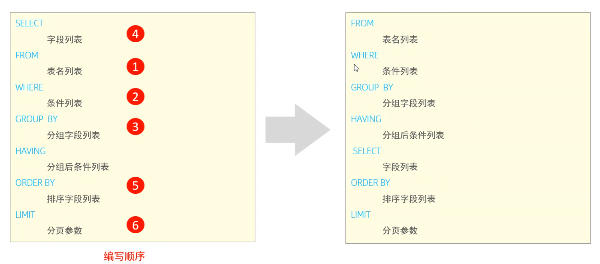

<!--#region
@author 吴钦飞
@email wuqinfei@qq.com
@create date 2025-05-07 22:06:33
@modify date 2025-06-05 15:20:45
@desc [description]
#endregion-->

# MySQL - 基础

大纲: 

* MySQL 概述
* SQL
* 函数
* 约束
* 多表查询
* 事务

## 1. MySQL 概述

### 1.1. 安装

#### 1.1.1. 版本

* 社区版（MySQL Community Server）
* 商业版（MySQL Enterprise Edition）

当前教程使用的是 MySQL Community Server 8.0.26

#### 1.1.2. 下载

地址: https://dev.mysql.com/downloads/windows/installer/8.0.html

#### 1.1.3. 安装

选择完整版的安装。

默认安装目录: C:\Program Files\MySQL

账户: root / 123456

### 1.2. 启动与停止

界面操作步骤:

1. win + R 
2. 输入 services.msc 后按回车
3. 找到 MySQL80 服务

命令行操作步骤:

```shell
# 启动
net start mysql80

# 停止
net stop mysql80
```

### 1.3. 客户端连接

使用 Navicat 连接即可

### 1.4. 数据模型

关系型数据库:

* 概念: 建立在关系模型基础上，由多张相互连接的二维表组成的数据库

## 2. SQL

目录:

* SQL通用语法
* SQL分类
* DDL
* DML
* DQL
* DCL

### 2.1. SQL通用语法

1. 单行或多行书写，分号结尾
2. 不区分大小写，关键字建议大写
3. 单行注释
   * `-- 注释内容`
   * `# 注释内容` （MySQL 特有）
4. 多行注释
   * `/* 注释内容 */`

### 2.2. DDL

#### 2.2.1. 数据库操作

##### 2.2.1.1. 查询

查询所有数据库

```sql
show databases;
```

查询当前数据库:

```sql
select database() ;
```

##### 2.2.1.2. 创建

语法:

```text
create database [ if not exists ] 数据库名 [ default charset 字符集 ] [ collate 排序 规则 ] ;
```

示例:

```sql
-- utf8 使用三个字节
-- utf8mb4 使用四个字节，可以标识更多字符
create database itheima default charset utf8mb4;
```

##### 2.2.1.3. 删除

语法:

```sql
drop database [ if exists ] 数据库名 ;
```

##### 2.2.1.4. 切换

```sql
-- 语法
use 数据库名 ;
```

#### 2.2.2. 表操作

##### 2.2.2.1. 查询

查询当前数据库所有表:

```sql
-- 语法
show tables;
```

查看指定表结构:

```sql
-- 语法
desc 表名 ;
```

查询指定表的建表语句:

```sql
-- 语法
show create table 表名 ;
```

##### 2.2.2.2. 创建

语法:

```sql
CREATE TABLE 表名(
  字段1 字段1类型 [ COMMENT 字段1注释 ],
  字段2 字段2类型 [COMMENT 字段2注释 ],
  字段3 字段3类型 [COMMENT 字段3注释 ],
  ......
  字段n 字段n类型 [COMMENT 字段n注释 ]
) [ COMMENT 表注释 ] ;
```

##### 2.2.2.3. 数据类型

* 
* 
* 

##### 2.2.2.4. 修改

添加字段：

```sql
-- 语法
ALTER TABLE 表名 ADD 字段名 类型 (长度) [ COMMENT 注释 ] [ 约束 ];

-- 示例：为emp表增加一个新的字段”昵称”为nickname，类型为varchar(20)
ALTER TABLE emp ADD nickname varchar(20) COMMENT '昵称';
```

修改数据类型：

```sql
-- 语法
ALTER TABLE 表名 MODIFY 字段名 新数据类型 (长度);
```

修改字段名和字段类型：

```sql
-- 语法
ALTER TABLE 表名 CHANGE 旧字段名 新字段名 类型 (长度) [ COMMENT 注释 ] [ 约束 ];

-- 示例：将emp表的nickname字段修改为username，类型为varchar(30)
ALTER TABLE emp CHANGE nickname username varchar(30) COMMENT '昵称';
```

删除字段：

```sql
-- 语法
ALTER TABLE 表名 DROP 字段名;

-- 示例：将emp表的字段username删除
ALTER TABLE emp DROP username;
```

修改表名：

```sql
-- 语法
ALTER TABLE 表名 RENAME TO 新表名;

-- 示例：将emp表的表名修改为 employee
ALTER TABLE emp RENAME TO employee;
```

##### 2.2.2.5. 删除

删除表：

```sql
-- 语法
DROP TABLE [ IF EXISTS ] 表名;

-- 示例：如果tb_user表存在，则删除tb_user表
DROP TABLE IF EXISTS tb_user;
```

删除指定表, 并重新创建表：

```sql
-- 语法
TRUNCATE TABLE 表名;

-- 在删除表的时候，表中的全部数据也都会被删除。
```

### 2.3. 图形化界面工具

DataGrip

### 2.4. DML

* 添加数据（INSERT）
* 修改数据（UPDATE）
* 删除数据（DELETE）

#### 2.4.1. 添加数据

给指定字段添加数据:

```sql
-- 语法
INSERT INTO 表名 (字段名1, 字段名2, ...) VALUES (值1, 值2, ...);

-- 示例：给employee表所有的字段添加数据
insert into employee(id,workno,name,gender,age,idcard,entrydate)
values(1,'1','Itcast','男',10,'123456789012345678','2000-01-01');
```

给全部字段添加数据:

```sql
-- 语法
INSERT INTO 表名 VALUES (值1, 值2, ...);

-- 示例：插入数据到employee表
insert into employee values(2,'2','张无忌','男',18,'123456789012345670','2005-01-
01');
```

批量添加数据:

```sql
-- 语法1
INSERT INTO 表名 (字段名1, 字段名2, ...) VALUES (值1, 值2, ...), (值1, 值2, ...), (值
1, 值2, ...) ;

-- 语法2
INSERT INTO 表名 VALUES (值1, 值2, ...), (值1, 值2, ...), (值1, 值2, ...) ;
```

注意事项:

* 插入数据时，指定的字段顺序需要与值的顺序是一一对应的。
* 字符串和日期型数据应该包含在引号中。
* 插入的数据大小，应该在字段的规定范围内。

#### 2.4.2. 修改数据

```sql
-- 语法
UPDATE 表名 SET 字段名1 = 值1 , 字段名2 = 值2 , .... [ WHERE 条件 ] ;

-- 示例：修改id为1的数据, 将name修改为小昭, gender修改为 女
update employee set name = '小昭' , gender = '女' where id = 1;
```

#### 2.4.3. 删除数据

```sql
-- 语法
DELETE FROM 表名 [ WHERE 条件 ] ;

-- 示例：删除gender为女的员工
delete from employee where gender = '女';
```

### 2.5. DQL

#### 2.5.1. 基本语法

```sql
SELECT
   字段列表
FROM
   表名列表
WHERE
   条件列表
GROUP BY
   分组字段列表
HAVING
   分组后条件列表
ORDER BY
   排序字段列表
LIMIT
   分页参数
```

语法拆分:

* 基本查询（不带任何条件）
* 条件查询（WHERE）
* 聚合函数（count、max、min、avg、sum）
* 分组查询（group by）
* 排序查询（order by）
* 分页查询（limit）

#### 2.5.2. 基础查询

查询多个字段：

```sql
-- 语法
SELECT 字段1, 字段2, 字段3 ... FROM 表名 ;

-- 语法：查询所有字段
SELECT * FROM 表名 ;
```

字段设置别名:

```sql
-- 语法1
SELECT 字段1 [ AS 别名1 ] , 字段2 [ AS 别名2 ] ... FROM 表名;

-- 语法2
SELECT 字段1 [ 别名1 ] , 字段2 [ 别名2 ] ... FROM 表名;
```

去除重复记录:

```sql
-- 语法
SELECT DISTINCT 字段列表 FROM 表名;
```

#### 2.5.3. 条件查询

语法:

```sql
SELECT 字段列表 FROM 表名 WHERE 条件列表 ;
```

比较运算符:

| operator              | desc                          |
|-----------------------|-------------------------------|
| `>`                   | 大于                            |
| `>=`                  | 大于等于                          |
| `<`                   | 小于                            |
| `<=`                  | 小于等于                          |
| `=`                   | 等于                            |
| `<>` or `!=`          | 不等于                           |
| `BETWEEN min AND max` | 在某个范围之内(含 最小、最大值)             |
| `IN(val1, val2, ...)` | 在 `in` 之后的列表中的值，多选一           |
| `LIKE 'keyword'`      | 模糊匹配(`_` 匹配单个字符, `%` 匹配任意个字符) |
| `IS NULL`             | 是 NULL                        |

逻辑运算符:

| operator       | desc            |
|----------------|-----------------|
| `AND` or `&&`  | 并且 (多个条件同时成立)   |
| `OR` or `\|\|` | 或者 (多个条件任意一个成立) |
| `NOT` or `!`   | 非 , 不是          |

示例:

```sql
-- 查询 没有身份证号 的员工
select * from emp where idcard is null;

-- 查询 有身份证号 的员工
select * from emp where idcard is not null;

-- 查询 身份证号以 421122 打头的员工
select * from emp where idcard like '421122%';

-- 查询 身份证号 不以 421122 打头的员工
select * from emp where idcard not like '421122%';
```

#### 2.5.4. 聚合函数

说明:

* 将一列数据作为一个整体，进行纵向计算 

常见的聚合函数:

| 函数  | 功能 |
| -     | -       |
| count | 统计数量 |
| max   | 最大值   |
| min   | 最小值   |
| avg   | 平均值   |
| sum   | 求和     |

语法:

```sql
SELECT 聚合函数(字段列表) FROM 表名 ;
```

注意: 

* NULL 值是不参与所有聚合函数运算的。

示例:

```sql
-- 统计的是总记录数
select count(*) from emp; 

-- 统计的是idcard字段不为null的记录数
select count(idcard) from emp; 
```

#### 2.5.5. 分组查询

语法：

```sql
SELECT 字段列表 
FROM 表名 
[ WHERE 条件 ] 
GROUP BY 分组字段名 
[ HAVING 分组 后过滤条件 ];
```

where 与 having 区别:

* 执行时机不同：where 是分组之前进行过滤，不满足 where 条件，不参与分组；而 having 是分组之后对结果进行过滤。
* 判断条件不同：where 不能对聚合函数进行判断，而 having 可以。

注意事项:

* 分组之后，查询的字段一般为聚合函数和分组字段，查询其他字段无任何意义。
* 执行顺序: where > 聚合函数 > having 。
* 支持多字段分组, 具体语法为 : group by columnA,columnB

示例：

```sql
-- 根据性别分组 , 统计男性员工 和 女性员工的数量
select gender, count(*) from emp group by gender ;

-- 根据性别分组 , 统计男性员工 和 女性员工的平均年龄
select gender, avg(age) from emp group by gender ;

-- 查询年龄小于45的员工 , 并根据工作地址分组 , 获取员工数量大于等于3的工作地址
select workaddress, count(*) address_count from emp where age < 45 
group by workaddress having address_count >= 3;

-- 统计各个工作地址上班的男性及女性员工的数量
select workaddress, gender, count(*) '数量' from emp group by gender , workaddress;
```

#### 2.5.6. 排序查询

语法:

```sql
SELECT 字段列表 
FROM 表名 
ORDER BY 字段1 排序方式1 , 字段2 排序方式2 ;
```

排序方式:

* ASC : 升序(默认值)，从小到大
* DESC: 降序，从大到小

注意:

* 如果是多字段排序，当第一个字段值相同时，才会根据第二个字段进行排序

示例:

```sql
-- 根据年龄对公司的员工进行升序排序 , 年龄相同 , 再按照入职时间进行降序排序
select * from emp order by age asc , entrydate desc;
```

#### 2.5.7. 分页查询

语法:

```sql
SELECT 字段列表 
FROM 表名 
LIMIT 起始索引, 查询记录数 ;
```

注意:

* 起始索引从 0 开始，起始索引 = （查询页码 - 1）* 每页显示记录数。
* 分页查询是数据库的方言，不同的数据库有不同的实现，MySQL 中是 LIMIT 。
* 如果查询的是第一页数据，起始索引可以省略，直接简写为 limit 10 。

示例:

```sql
-- 查询第2页员工数据, 每页展示10条记录 --------> (页码-1)*页展示记录数
select * from emp limit 10,10;
```

#### 2.5.8. 案例

```sql
-- 统计员工表中, 年龄小于60岁的 , 男性员工和女性员工的人数。
select gender, count(*) from emp where age < 60 group by gender;

-- 查询性别为男，且年龄在20-40 岁(含)以内的前5个员工信息，对查询的结果按年龄升序排序，年龄相同按入职时间升序排序
select * from emp where gender = '男' and age between 20 and 40 order by age asc , entrydate asc limit 5 ;
```

#### 2.5.9. 执行顺序



只有 order by 字句才可以使用 where 字句中的别名