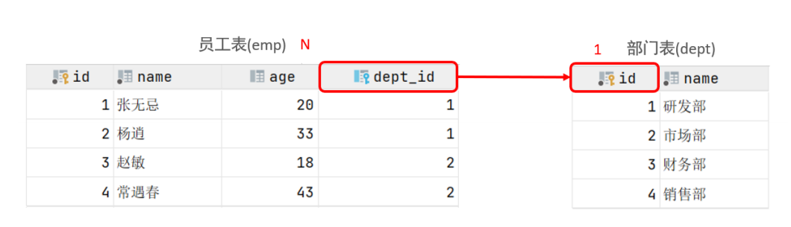
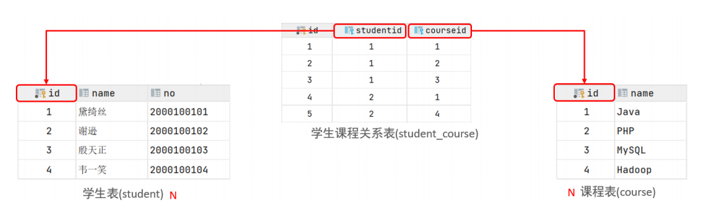
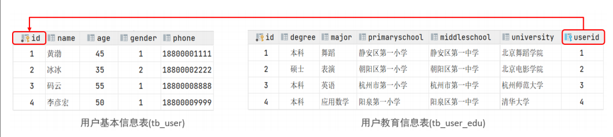
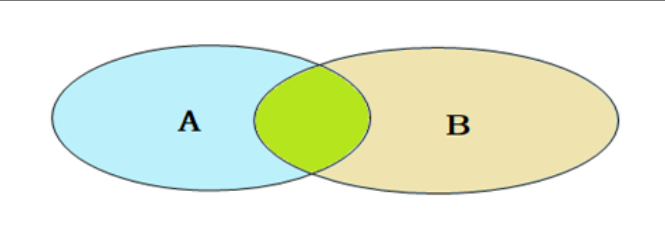

<!--#region
@author 吴钦飞
@email wuqinfei@qq.com
@create date 2025-05-07 22:06:33
@modify date 2025-06-14 17:13:44
@desc [description]
#endregion-->

# MySQL - 基础

大纲: 

* MySQL 概述
* SQL
* 函数
* 约束
* 多表查询
* 事务

## 1. MySQL 概述

### 1.1. 安装

#### 1.1.1. 版本

* 社区版（MySQL Community Server）
* 商业版（MySQL Enterprise Edition）

当前教程使用的是 MySQL Community Server 8.0.26

#### 1.1.2. 下载

地址: https://dev.mysql.com/downloads/windows/installer/8.0.html

#### 1.1.3. 安装

选择完整版的安装。

默认安装目录: C:\Program Files\MySQL

账户: root / 123456

### 1.2. 启动与停止

界面操作步骤:

1. win + R 
2. 输入 services.msc 后按回车
3. 找到 MySQL80 服务

命令行操作步骤:

```shell
# 启动
net start mysql80

# 停止
net stop mysql80
```

### 1.3. 客户端连接

使用 Navicat 连接即可

### 1.4. 数据模型

关系型数据库:

* 概念: 建立在关系模型基础上，由多张相互连接的二维表组成的数据库

## 2. SQL

目录:

* SQL通用语法
* SQL分类
* DDL
* DML
* DQL
* DCL

### 2.1. SQL通用语法

1. 单行或多行书写，分号结尾
2. 不区分大小写，关键字建议大写
3. 单行注释
   * `-- 注释内容`
   * `# 注释内容` （MySQL 特有）
4. 多行注释
   * `/* 注释内容 */`

### 2.2. DDL

#### 2.2.1. 数据库操作

##### 2.2.1.1. 查询

查询所有数据库

```sql
show databases;
```

查询当前数据库:

```sql
select database() ;
```

##### 2.2.1.2. 创建

语法:

```text
create database [ if not exists ] 数据库名 [ default charset 字符集 ] [ collate 排序 规则 ] ;
```

示例:

```sql
-- utf8 使用三个字节
-- utf8mb4 使用四个字节，可以标识更多字符
create database itheima default charset utf8mb4;
```

##### 2.2.1.3. 删除

语法:

```sql
drop database [ if exists ] 数据库名 ;
```

##### 2.2.1.4. 切换

```sql
-- 语法
use 数据库名 ;
```

#### 2.2.2. 表操作

##### 2.2.2.1. 查询

查询当前数据库所有表:

```sql
-- 语法
show tables;
```

查看指定表结构:

```sql
-- 语法
desc 表名 ;
```

查询指定表的建表语句:

```sql
-- 语法
show create table 表名 ;
```

##### 2.2.2.2. 创建

语法:

```sql
CREATE TABLE 表名(
  字段1 字段1类型 [ COMMENT 字段1注释 ],
  字段2 字段2类型 [COMMENT 字段2注释 ],
  字段3 字段3类型 [COMMENT 字段3注释 ],
  ......
  字段n 字段n类型 [COMMENT 字段n注释 ]
) [ COMMENT 表注释 ] ;
```

##### 2.2.2.3. 数据类型

* 
* 
* 

##### 2.2.2.4. 修改

添加字段：

```sql
-- 语法
ALTER TABLE 表名 ADD 字段名 类型 (长度) [ COMMENT 注释 ] [ 约束 ];

-- 示例：为emp表增加一个新的字段”昵称”为nickname，类型为varchar(20)
ALTER TABLE emp ADD nickname varchar(20) COMMENT '昵称';
```

修改数据类型：

```sql
-- 语法
ALTER TABLE 表名 MODIFY 字段名 新数据类型 (长度);
```

修改字段名和字段类型：

```sql
-- 语法
ALTER TABLE 表名 CHANGE 旧字段名 新字段名 类型 (长度) [ COMMENT 注释 ] [ 约束 ];

-- 示例：将emp表的nickname字段修改为username，类型为varchar(30)
ALTER TABLE emp CHANGE nickname username varchar(30) COMMENT '昵称';
```

删除字段：

```sql
-- 语法
ALTER TABLE 表名 DROP 字段名;

-- 示例：将emp表的字段username删除
ALTER TABLE emp DROP username;
```

修改表名：

```sql
-- 语法
ALTER TABLE 表名 RENAME TO 新表名;

-- 示例：将emp表的表名修改为 employee
ALTER TABLE emp RENAME TO employee;
```

##### 2.2.2.5. 删除

删除表：

```sql
-- 语法
DROP TABLE [ IF EXISTS ] 表名;

-- 示例：如果tb_user表存在，则删除tb_user表
DROP TABLE IF EXISTS tb_user;
```

删除指定表, 并重新创建表：

```sql
-- 语法
TRUNCATE TABLE 表名;

-- 在删除表的时候，表中的全部数据也都会被删除。
```

### 2.3. 图形化界面工具

DataGrip

### 2.4. DML

* 添加数据（INSERT）
* 修改数据（UPDATE）
* 删除数据（DELETE）

#### 2.4.1. 添加数据

给指定字段添加数据:

```sql
-- 语法
INSERT INTO 表名 (字段名1, 字段名2, ...) VALUES (值1, 值2, ...);

-- 示例：给employee表所有的字段添加数据
insert into employee(id,workno,name,gender,age,idcard,entrydate)
values(1,'1','Itcast','男',10,'123456789012345678','2000-01-01');
```

给全部字段添加数据:

```sql
-- 语法
INSERT INTO 表名 VALUES (值1, 值2, ...);

-- 示例：插入数据到employee表
insert into employee values(2,'2','张无忌','男',18,'123456789012345670','2005-01-
01');
```

批量添加数据:

```sql
-- 语法1
INSERT INTO 表名 (字段名1, 字段名2, ...) VALUES (值1, 值2, ...), (值1, 值2, ...), (值
1, 值2, ...) ;

-- 语法2
INSERT INTO 表名 VALUES (值1, 值2, ...), (值1, 值2, ...), (值1, 值2, ...) ;
```

注意事项:

* 插入数据时，指定的字段顺序需要与值的顺序是一一对应的。
* 字符串和日期型数据应该包含在引号中。
* 插入的数据大小，应该在字段的规定范围内。

#### 2.4.2. 修改数据

```sql
-- 语法
UPDATE 表名 SET 字段名1 = 值1 , 字段名2 = 值2 , .... [ WHERE 条件 ] ;

-- 示例：修改id为1的数据, 将name修改为小昭, gender修改为 女
update employee set name = '小昭' , gender = '女' where id = 1;
```

#### 2.4.3. 删除数据

```sql
-- 语法
DELETE FROM 表名 [ WHERE 条件 ] ;

-- 示例：删除gender为女的员工
delete from employee where gender = '女';
```

### 2.5. DQL

#### 2.5.1. 基本语法

```sql
SELECT
   字段列表
FROM
   表名列表
WHERE
   条件列表
GROUP BY
   分组字段列表
HAVING
   分组后条件列表
ORDER BY
   排序字段列表
LIMIT
   分页参数
```

语法拆分:

* 基本查询（不带任何条件）
* 条件查询（WHERE）
* 聚合函数（count、max、min、avg、sum）
* 分组查询（group by）
* 排序查询（order by）
* 分页查询（limit）

#### 2.5.2. 基础查询

查询多个字段：

```sql
-- 语法
SELECT 字段1, 字段2, 字段3 ... FROM 表名 ;

-- 语法：查询所有字段
SELECT * FROM 表名 ;
```

字段设置别名:

```sql
-- 语法1
SELECT 字段1 [ AS 别名1 ] , 字段2 [ AS 别名2 ] ... FROM 表名;

-- 语法2
SELECT 字段1 [ 别名1 ] , 字段2 [ 别名2 ] ... FROM 表名;
```

去除重复记录:

```sql
-- 语法
SELECT DISTINCT 字段列表 FROM 表名;
```

#### 2.5.3. 条件查询

语法:

```sql
SELECT 字段列表 FROM 表名 WHERE 条件列表 ;
```

比较运算符:

| operator              | desc                          |
|-----------------------|-------------------------------|
| `>`                   | 大于                            |
| `>=`                  | 大于等于                          |
| `<`                   | 小于                            |
| `<=`                  | 小于等于                          |
| `=`                   | 等于                            |
| `<>` or `!=`          | 不等于                           |
| `BETWEEN min AND max` | 在某个范围之内(含 最小、最大值)             |
| `IN(val1, val2, ...)` | 在 `in` 之后的列表中的值，多选一           |
| `LIKE 'keyword'`      | 模糊匹配(`_` 匹配单个字符, `%` 匹配任意个字符) |
| `IS NULL`             | 是 NULL                        |

逻辑运算符:

| operator       | desc            |
|----------------|-----------------|
| `AND` or `&&`  | 并且 (多个条件同时成立)   |
| `OR` or `\|\|` | 或者 (多个条件任意一个成立) |
| `NOT` or `!`   | 非 , 不是          |

示例:

```sql
-- 查询 没有身份证号 的员工
select * from emp where idcard is null;

-- 查询 有身份证号 的员工
select * from emp where idcard is not null;

-- 查询 身份证号以 421122 打头的员工
select * from emp where idcard like '421122%';

-- 查询 身份证号 不以 421122 打头的员工
select * from emp where idcard not like '421122%';
```

#### 2.5.4. 聚合函数

说明:

* 将一列数据作为一个整体，进行纵向计算 

常见的聚合函数:

| 函数  | 功能 |
| -     | -       |
| count | 统计数量 |
| max   | 最大值   |
| min   | 最小值   |
| avg   | 平均值   |
| sum   | 求和     |

语法:

```sql
SELECT 聚合函数(字段列表) FROM 表名 ;
```

注意: 

* NULL 值是不参与所有聚合函数运算的。

示例:

```sql
-- 统计的是总记录数
select count(*) from emp; 

-- 统计的是idcard字段不为null的记录数
select count(idcard) from emp; 
```

#### 2.5.5. 分组查询

语法：

```sql
SELECT 字段列表 
FROM 表名 
[ WHERE 条件 ] 
GROUP BY 分组字段名 
[ HAVING 分组 后过滤条件 ];
```

where 与 having 区别:

* 执行时机不同：where 是分组之前进行过滤，不满足 where 条件，不参与分组；而 having 是分组之后对结果进行过滤。
* 判断条件不同：where 不能对聚合函数进行判断，而 having 可以。

注意事项:

* 分组之后，查询的字段一般为聚合函数和分组字段，查询其他字段无任何意义。
* 执行顺序: where > 聚合函数 > having 。
* 支持多字段分组, 具体语法为 : group by columnA,columnB

示例：

```sql
-- 根据性别分组 , 统计男性员工 和 女性员工的数量
select gender, count(*) from emp group by gender ;

-- 根据性别分组 , 统计男性员工 和 女性员工的平均年龄
select gender, avg(age) from emp group by gender ;

-- 查询年龄小于45的员工 , 并根据工作地址分组 , 获取员工数量大于等于3的工作地址
select workaddress, count(*) address_count from emp where age < 45 
group by workaddress having address_count >= 3;

-- 统计各个工作地址上班的男性及女性员工的数量
select workaddress, gender, count(*) '数量' from emp group by gender , workaddress;
```

#### 2.5.6. 排序查询

语法:

```sql
SELECT 字段列表 
FROM 表名 
ORDER BY 字段1 排序方式1 , 字段2 排序方式2 ;
```

排序方式:

* ASC : 升序(默认值)，从小到大
* DESC: 降序，从大到小

注意:

* 如果是多字段排序，当第一个字段值相同时，才会根据第二个字段进行排序

示例:

```sql
-- 根据年龄对公司的员工进行升序排序 , 年龄相同 , 再按照入职时间进行降序排序
select * from emp order by age asc , entrydate desc;
```

#### 2.5.7. 分页查询

语法:

```sql
SELECT 字段列表 
FROM 表名 
LIMIT 起始索引, 查询记录数 ;
```

注意:

* 起始索引从 0 开始，起始索引 = （查询页码 - 1）* 每页显示记录数。
* 分页查询是数据库的方言，不同的数据库有不同的实现，MySQL 中是 LIMIT 。
* 如果查询的是第一页数据，起始索引可以省略，直接简写为 limit 10 。

示例:

```sql
-- 查询第2页员工数据, 每页展示10条记录 --------> (页码-1)*页展示记录数
select * from emp limit 10,10;
```

#### 2.5.8. 案例

```sql
-- 统计员工表中, 年龄小于60岁的 , 男性员工和女性员工的人数。
select gender, count(*) from emp where age < 60 group by gender;

-- 查询性别为男，且年龄在20-40 岁(含)以内的前5个员工信息，对查询的结果按年龄升序排序，年龄相同按入职时间升序排序
select * from emp where gender = '男' and age between 20 and 40 order by age asc , entrydate asc limit 5 ;
```

#### 2.5.9. 执行顺序


只有 order by 字句才可以使用 where 字句中的别名

### 2.6. DCL

#### 2.6.1. 管理用户

查询用户:

```sql
-- 语法
select * from mysql.user;

/*
其中 Host 代表当前用户访问的主机, 
如果为 localhost, 仅代表只能够在当前本机访问，是不可以远程访问的。 
User 代表的是访问该数据库的用户名。
在 MySQL 中需要通过 Host 和 User来唯一标识一个用户。
*/
```

创建用户:

```sql
-- 语法
CREATE USER '用户名'@'主机名' IDENTIFIED BY '密码';

-- 示例：创建用户itcast, 只能够在当前主机localhost访问, 密码123456;
create user 'itcast'@'localhost' identified by '123456';

-- 示例：创建用户heima, 可以在任意主机访问该数据库, 密码123456;
create user 'heima'@'%' identified by '123456';
```

修改用户密码:

```sql
-- 语法
ALTER USER '用户名'@'主机名' IDENTIFIED WITH mysql_native_password BY '新密码' ;

-- 示例：修改用户heima的访问密码为1234;
alter user 'heima'@'%' identified with mysql_native_password by '1234';
```

删除用户:

```sql
-- 语法
DROP USER '用户名'@'主机名' ;

-- 示例：删除 itcast@localhost 用户
drop user 'itcast'@'localhost';
```

#### 2.6.2. 权限控制

MySQL中定义了很多种权限，但是常用的就以下几种：

| 权限 | 说明 |
| - | - |
| ALL, ALL PRIVILEGES | 所有权限 |
| SELECT | 查询数据 |
| INSERT | 插入数据 |
| UPDATE | 修改数据 |
| DELETE | 删除数据 |
| ALTER | 修改表 |
| DROP | 删除数据库/表/视图 |
| CREATE | 创建数据库/表 |

查询权限:

```sql
-- 语法
SHOW GRANTS FOR '用户名'@'主机名' ;

-- 示例: 查询 'heima'@'%' 用户的权限
show grants for 'heima'@'%';
```

授予权限:

```sql
-- 语法
-- 多个权限之间，使用逗号分隔
-- 授权时， 数据库名和表名可以使用 * 进行通配，代表所有
GRANT 权限列表 ON 数据库名.表名 TO '用户名'@'主机名';

-- 示例: 授予 'heima'@'%' 用户itcast数据库所有表的所有操作权限
grant all on itcast.* to 'heima'@'%';
```

撤销权限:

```sql
-- 语法
REVOKE 权限列表 ON 数据库名.表名 FROM '用户名'@'主机名';

-- 示例: 撤销 'heima'@'%' 用户的itcast数据库的所有权限
revoke all on itcast.* from 'heima'@'%';
```

## 3. 函数

### 3.1. 字符串函数

MySQL 中内置了很多字符串函数，常用的几个如下：

| 函数 | 功能 |
| - | - |
| `CONCAT(S1,S2,...Sn)` | 字符串拼接，将S1，S2，... Sn拼接成一个字符串 |
| `LOWER(str)` | 将字符串str全部转为小写 |
| `UPPER(str)` | 将字符串str全部转为大写 |
| `LPAD(str,n,pad)` | 左填充，用字符串pad对str的左边进行填充，达到n个字符 串长度 |
| `RPAD(str,n,pad)` | 右填充，用字符串pad对str的右边进行填充，达到n个字符 串长度 |
| `TRIM(str)` | 去掉字符串头部和尾部的空格 |
| `SUBSTRING(str,start,len)` | 返回从字符串str从start位置起的len个长度的字符串 |

示例:

```sql
-- 字符串拼接
select concat('Hello' , ' MySQL'); -- => 'Hello MySQL'

-- 全部转小写
select lower('Hello'); -- => 'hello'

-- 全部转大写
select upper('Hello');

-- 左填充
select lpad('01', 5, '-'); -- => '---01'

-- 右填充
select rpad('01', 5, '-');

-- 去除前后空格
select trim(' Hello MySQL ');

-- 截取子字符串
select substring('Hello MySQL',1,5); -- => 'HelloHello'

-- 更新 emp.workno 字段，用 '0' 补足到 5 位，比如 '01' -> '00001'
update emp set workno = lpad(workno, 5, '0');
```

### 3.2. 数值函数

常见的数值函数如下：

| 函数 | 功能 |
| - | - |
| `CEIL(x)` | 向上取整 |
| `FLOOR(x)` | 向下取整 |
| `MOD(x,y)` | 返回x/y的模 |
| `RAND()` | 返回0~1内的随机数 |
| `ROUND(x,y)` | 求参数x的四舍五入的值，保留y位小数 |

示例:

```sql
-- 向上取整
select ceil(1.1);

-- 向下取整
select floor(1.9);

-- 取模
select mod(7,4);

-- 获取随机数
select rand();

-- 四舍五入
select round(2.344,2);

-- 生成一个六位数的随机验证码。
select lpad( round( rand() * 1000000 , 0 ), 6, '0' );
```

### 3.3. 日期函数

常见的日期函数如下：

| 函数 | 功能 |
| - | - |
| `CURDATE()` | 返回当前日期 |
| `CURTIME()` | 返回当前时间 |
| `NOW()` | 返回当前日期和时间 |
| `YEAR(date)` | 获取指定date的年份 |
| `MONTH(date)` | 获取指定date的月份 |
| `DAY(date)` | 获取指定date的日期 |
| `DATE_ADD(date, INTERVAL expr type)` | 返回一个日期/时间值加上一个时间间隔expr后的时间值 |
| `DATEDIFF(date1,date2)` | 返回起始时间date1 和 结束时间date2之间的天数 |


示例:

```sql
-- 当前日期
SELECT CURDATE(); -- => 2025-06-12

-- 当前时间
SELECT CURTIME(); -- => 12:40:58

-- 当前日期和时间
SELECT NOW(); -- => 2025-06-12 12:41:25

-- 当前年、月、日
SELECT YEAR(NOW()); -- => 2025
SELECT MONTH(NOW()); -- => 6
SELECT DAY(NOW()); -- => 12

-- 增加指定的时间间隔
SELECT DATE_ADD(NOW(),INTERVAL 3 DAY); -- => 2025-06-15 12:44:16
SELECT DATE_ADD(NOW(),INTERVAL 3 MONTH); -- => 2025-09-12 12:45:33
SELECT DATE_ADD(NOW(),INTERVAL 3 YEAR); -- => 2028-06-12 12:45:40

-- 获取两个日期相差的天数
SELECT DATEDIFF('2010-01-01', '2010-02-01'); -- => -31

-- 查询所有员工的入职天数，并根据入职天数倒序排序
select name, datediff(curdate(), entrydate) as 'entrydays' 
from emp 
order by entrydays desc;
```

### 3.4. 流程函数

常用:

| 函数 | 功能 |
| - | - |
| `IF(value , t , f)` | 如果value为true，则返回t，否则返回 f |
| `IFNULL(value1 , value2)` | 如果value1不为空，返回value1，否则返回value2 |
| `CASE WHEN [ val1 ] THEN [res1] ... ELSE [ default ] END` | 如果val1为true，返回res1，... 否则返回default默认值 |
| `CASE [ expr ] WHEN [ val1 ] THEN [res1] ... ELSE [ default ] END` | 如果expr的值等于val1，返回 res1，... 否则返回default默认值 |

示例:

```sql
-- if
SELECT IF(FALSE, 'Ok', 'Error'); -- => Error

-- ifnull
SELECT IFNULL('', 'Default'); -- => ''
SELECT IFNULL(NULL, 'Default'); -- => 'Default'

-- case 列 when 值 then 结果1 else 结果 end
-- 如果工作地址是 北京或上海 则显示一线城市，否则显示 二线城市
SELECT
  `name`,
  workaddress,
  (
    CASE 
      workaddress
    WHEN '北京' THEN
      '一线城市'
    WHEN '上海' THEN
      '一线城市'
    ELSE
      '二线城市'
    END
  ) as '工作地址'
FROM emp
ORDER BY workaddress;


-- case when 表达式1 then 结果1 else 结果 end
-- 如果年龄大于 60 的显示 老年人，大于 30 显示 中年人, 否则显示 年轻人
SELECT
  `name`,
  age,
  (
    CASE
    WHEN age > 60 THEN
      '老年人'
    WHEN age > 30 THEN
      '中年人'
    ELSE
      '年轻人'
    END
  ) as '年龄级别'
FROM emp
ORDER BY age;
```

## 4. 约束

### 4.1. 概述

| 约束 | 描述 | 关键字 |
| - | - | - |
| 非空约束 | 限制该字段的数据不能为null | NOT NULL |
| 唯一约束 | 保证该字段的所有数据都是唯一、不重复的 | UNIQUE |
| 主键约束 | 主键是一行数据的唯一标识，要求非空且唯一 | PRIMARY KEY |
| 默认约束 | 保存数据时，如果未指定该字段的值，则采用默认值 | DEFAULT |
| 检查约束 | (8.0.16版本 之后) 保证字段值满足某一个条件 | CHECK |
| 外键约束 | 用来让两张表的数据之间建立连接，保证数据的一致性和完整性 | FOREIGN KEY |

示例:

```sql
CREATE TABLE tb_user(
   id int AUTO_INCREMENT PRIMARY KEY COMMENT 'ID唯一标识',
   name varchar(10) NOT NULL UNIQUE COMMENT '姓名' ,
   age int check (age > 0 && age <= 120) COMMENT '年龄' ,
   status char(1) default '1' COMMENT '状态',
   gender char(1) COMMENT '性别'
);
```

### 4.2. 外键约束

添加外键:

```sql
-- 建表时设置外键

-- 语法
CREATE TABLE 表名(
    [CONSTRAINT] [外键名称] FOREIGN KEY (外键字段名) REFERENCES 主表 (主表列名)
);


-- 建完表后设置外键

-- 语法
ALTER TABLE 表名 ADD CONSTRAINT 外键名称 FOREIGN KEY (外键字段名) REFERENCES 主表 (主表列名) ;

-- 示例
alter table emp add constraint fk_emp_dept_id foreign key (dept_id) references dept(id);
```


删除外键：

```sql
-- 语法
ALTER TABLE 表名 DROP FOREIGN KEY 外键名称;

-- 示例: 删除emp表的外键 fk_emp_dept_id
alter table emp drop foreign key fk_emp_dept_id;
```

### 4.3. 删除/更新 行为

添加了外键之后，再删除父表数据时产生的约束行为，我们就称为删除/更新行为。
具体的删除/更新行为有以下几种


| 行为 | 说明 |
| - | - |
| `NO ACTION` | 当在父表中删除/更新对应记录时，首先检查该记录是否有对应外键，如果有则不允许删除/更新。 (与 RESTRICT 一致) 默认行为  |
| `RESTRICT` | 当在父表中删除/更新对应记录时，首先检查该记录是否有对应外键，如果有则不允许删除/更新。 (与 NO ACTION 一致) 默认行为  |
| `CASCADE` | 当在父表中删除/更新对应记录时，首先检查该记录是否有对应外键，如果有，则也删除/更新外键在子表中的记录。 |
| `SET NULL` | 当在父表中删除对应记录时，首先检查该记录是否有对应外键，如果有则设置子表中该外键值为null（这就要求该外键允许取null）。 |
| `SET DEFAULT` | 父表有变更时，子表将外键列设置成一个默认的值 (Innodb不支持) |

```sql
-- 语法
ALTER TABLE 表名 ADD CONSTRAINT 外键名称 FOREIGN KEY (外键字段) REFERENCES 主表名 (主表字段名) ON UPDATE CASCADE ON DELETE CASCADE;

-- 示例: CASCADE
-- 更新主表的 id 字段的值，从表的 dept_id 也跟着变化
-- 删除主表的记录，从表的记录也跟着删除
alter table emp add constraint fk_emp_dept_id foreign key (dept_id) references dept(id) on update cascade on delete cascade ;

-- 示例: SET NULL
-- 更新/删除主表的记录，从表对应的外键设置为 null
alter table emp add constraint fk_emp_dept_id foreign key (dept_id) references dept(id) on update set null on delete set null ;
```

## 5. 多表关系

### 5.1. 多表关系

* 一对多(多对一)
* 多对多
* 一对一

#### 5.1.1. 一对多

* 案例: 部门 与 员工的关系
* 关系: 一个部门对应多个员工，一个员工对应一个部门
* 实现: 在多的一方建立外键，指向一的一方的主键



#### 5.1.2. 多对多

* 案例: 学生 与 课程的关系
* 关系: 一个学生可以选修多门课程，一门课程也可以供多个学生选择
* 实现: 建立第三张中间表，中间表至少包含两个外键，分别关联两方主键




#### 5.1.3. 一对一

* 案例: 用户 与 用户详情的关系
* 关系: 一对一关系，多用于单表拆分，将一张表的基础字段放在一张表中，其他详情字段放在另一张表中，以提升操作效率
* 实现: 在任意一方加入外键，关联另外一方的主键，并且设置外键为唯一的(UNIQUE)



### 5.2. 多表查询概述

分类:

* 连接查询:
  * 内连接：相当于查询 A、B 交集部分数据
  * 外连接：
    * 左外连接：查询左表所有数据，以及两张表交集部分数据
    * 右外连接：查询右表所有数据，以及两张表交集部分数据
  * 自连接：当前表与自身的连接查询，自连接必须使用表别名
* 子查询



### 5.3. 内连接

内连接查询的是两张表交集部分的数据。(也就是绿色部分的数据)

内连接的语法分为两种: 

* 隐式内连接
* 显式内连接。

隐式内连接:

```sql
-- 语法
SELECT 字段列表 FROM 表1 , 表2 WHERE 条件 ... ;

-- 示例: 查询每一个员工的姓名 , 及关联的部门的名称 (隐式内连接实现)
select emp.name , dept.name from emp , dept where emp.dept_id = dept.id ;
```

显式内连接:

```sql
-- 语法
SELECT 字段列表 FROM 表1 [ INNER ] JOIN 表2 ON 条件 ... ;

-- 示例: 查询每一个员工的姓名 , 及关联的部门的名称 (显式内连接实现)
select e.name, d.name from emp e inner join dept d on e.dept_id = d.id;
```

注意:

* 一旦为表起了别名，就不能再使用表名来指定对应的字段了，此时只能够使用别名来指定字段

### 5.4. 外连接

外连接分为两种，分别是：

* 左外连接
* 右外连接

左外连接:

```sql
-- 语法
SELECT 字段列表 FROM 表1 LEFT [ OUTER ] JOIN 表2 ON 条件 ... ;

-- 示例: 查询emp表的所有数据, 和对应的部门信息
select e.*, d.name from emp e left outer join dept d on e.dept_id = d.id;
```

右外连接:

```sql
-- 语法
SELECT 字段列表 FROM 表1 RIGHT [ OUTER ] JOIN 表2 ON 条件 ... ;

-- 示例: 查询dept表的所有数据, 和对应的员工信息(右外连接)
select d.*, e.* from emp e right outer join dept d on e.dept_id = d.id;
```

### 5.5. 自连接

#### 5.5.1. 自连接查询

自连接查询，顾名思义，就是自己连接自己，也就是把一张表连接查询多次

对于自连接查询，可以是内连接查询，也可以是外连接查询

```sql
-- 内连接
-- 示例: 查询员工 及其 所属领导的名字，如果员工没有领导 则不会查询出来
select a.name , b.name from emp a , emp b where a.managerid = b.id;

-- 外连接
-- 示例: 查询所有员工 emp 及其领导的名字 emp , 如果员工没有领导, 也需要查询出来
select a.name '员工', b.name '领导' from emp a left join emp b on a.managerid = b.id;
```

#### 5.5.2. 联合查询

对于 union 查询，就是把多次查询的结果合并起来，形成一个新的查询结果集。

```sql
SELECT 字段列表 FROM 表A ...
UNION [ ALL ]
SELECT 字段列表 FROM 表B ....;
```

说明:

* 对于联合查询的多张表的列数必须保持一致，字段类型也需要保持一致。
* union all 会将全部的数据直接合并在一起，union 会对合并之后的数据去重。

```sql
-- 示例: 将薪资低于 5000 的员工 , 和 年龄大于 50 岁的员工全部查询出来.
select * from emp where salary < 5000
union all
select * from emp where age > 50;

-- union all 查询出来的结果，仅仅进行简单的合并，并未去重
-- union 联合查询，会对查询出来的结果进行去重处理
select * from emp where salary < 5000
union
select * from emp where age > 50;
```

### 5.6. 子查询

#### 5.6.1. 概述

SQL 语句中嵌套 SELECT 语句，称为嵌套查询，又称子查询

```sql
SELECT * FROM t1 WHERE column1 = ( SELECT column1 FROM t2 );
```

子查询外部的语句可以是 INSERT / UPDATE / DELETE / SELECT 的任何一个

根据子查询结果不同，分为：

* 标量 子查询（子查询结果为单个值，即 1行1列）
* 列 子查询(子查询结果为一列， 即 N行1列)
* 行 子查询(子查询结果为一行， 即 1行N列)
* 表 子查询(子查询结果为多行多列, 即 N行N列)

根据子查询位置，分为：

* WHERE 之后
* FROM 之后
* SELECT 之后

#### 5.6.2. 标量 子查询

子查询返回的结果是单个值（数字、字符串、日期等），这种子查询称为标量子查询。

常用的操作符：

* `=`  
* `<>` 
* `>` 
* `>=` 
* `<` 
* `<=`

语法:

```sql
select ...
from ...
where 字段1 操作符 ( select ... from 表2 where ... )
```

示例:

```sql
-- 需求: 查询 "销售部" 的所有员工信息

-- 1. 查询 "销售部" 部门ID
select id from dept where name = '销售部'; -- => 4

-- 2. 根据 "销售部" 部门ID, 查询员工信息
select * from emp where dept_id = 4

-- 3. 合并两个SQL
select * from emp where dept_id = (select id from dept where name = '销售部');
```

#### 5.6.3. 列 子查询

子查询返回的结果是一列（可以是多行），这种子查询称为列子查询。

常用的操作符：

* `IN`
* `NOT IN`
* `ANY`
* `SOME`
* `ALL`

| 操作符 | 描述 |
| - | - |
| `IN` | 在指定的集合范围之内，多选一 |
| `NOT IN` | 不在指定的集合范围之内 |
| `ANY` | 子查询返回列表中，有任意一个满足即可 |
| `SOME` | 与`ANY`等同，使用SOME的地方都可以使用ANY |
| `ALL` | 子查询返回列表的所有值都必须满足 |

示例:

```sql
-- 需求: 查询 "销售部" 和 "市场部" 的所有员工信息

-- 1. 查询 "销售部" 和 "市场部" 的部门ID
select id from dept where name = '销售部' or name = '市场部';

-- 2. 根据部门ID, 查询员工信息
select * from emp where dept_id in (select id from dept where name = '销售部' or name = '市场部');


-- 需求: 查询比 财务部 所有人工资都高的员工信息

-- 1. 查询所有 财务部 人员工资
select id from dept where name = '财务部';
select salary from emp where dept_id = (select id from dept where name = '财务部');

-- 2. 比 财务部 所有人工资都高的员工信息
select * from emp
where salary > all (select salary from emp where dept_id = (select id from dept where name = '财务部'));


-- 需求: 查询比研发部其中任意一人工资高的员工信息

-- 1. 查询研发部所有人工资
select salary from emp where dept_id = (select id from dept where name = '研发部');

-- 2. 比研发部其中任意一人工资高的员工信息
select * from emp
where salary > any ( select salary from emp where dept_id = (select id from dept where name = '研发部') );
```

#### 5.6.4. 行 子查询

子查询返回的结果是一行（可以是多列），这种子查询称为行子查询。

常用的操作符：

* `=`
* `<>`
* `IN`
* `NOT IN`

演示:

```sql
-- 需求: 查询 与 "张无忌" 的薪资及直属领导 相同的员工信息 ;

-- 1. 查询 "张无忌" 的薪资及直属领导
select salary, managerid from emp where name = '张无忌'; -- => 12500  1

-- 2. 查询与 薪资为 12500 并且 直属领导为 1 的员工信息 ;
select * from emp where salary = 12500 and managerid = 1;

-- 3. 换一种写法
select * from emp where (salary, managerid) = (12500, 1);

-- 4. 使用子查询
select * from emp where (salary, managerid) = (select salary, managerid from emp where name = '张无忌');
```

#### 5.6.5. 表 子查询

子查询返回的结果是多行多列，这种子查询称为表子查询。

常用的操作符：

* `IN`
* 作为临时表

演示:

```sql
-- 需求: 查询与 "鹿杖客" , "宋远桥" 的职位和薪资相同的员工信息

-- 1. 查询 "鹿杖客" , "宋远桥" 的职位和薪资
select job, salary from emp where name = '鹿杖客' or name = '宋远桥'; -- => ('职员', 3750), ('销售', 4600)

-- 2. 查询 职位和薪资为 ('职员', 3750), ('销售', 4600) 的员工
select name, job, salary from emp where (job, salary) in ( ('职员', 3750), ('销售', 4600) );

-- 3. 合并
select name, job, salary from emp where (job, salary) in (
    select job, salary from emp where name = '鹿杖客' or name = '宋远桥'
);


-- 需求: 查询入职日期是 "2006-01-01" 之后的员工信息 , 及其部门信息

-- 1. 入职日期是 "2006-01-01" 之后的员工信息
select * from emp where entrydate > '2006-01-01';

-- 2. 查询这部分员工, 对应的部门信息;
select tmp_emp.name, tmp_emp.entrydate, dept.name
from (select * from emp where entrydate > '2006-01-01') as tmp_emp -- 子查询作为临时表
left join dept on tmp_emp.dept_id = dept.id;
```