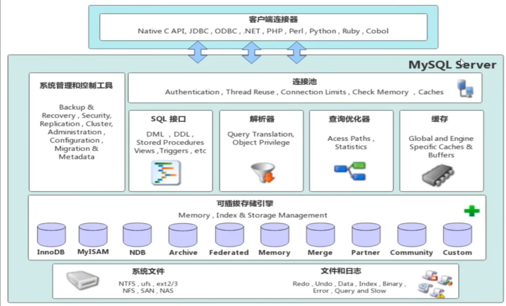

<!--#region
@author 吴钦飞
@email wuqinfei@qq.com
@create date 2025-05-07 22:06:42
@modify date 2025-06-17 15:50:44
@desc [description]
#endregion-->

# MySQL - 进阶

大纲: 

* 存储引擎
* 索引
* SQL 优化
* 视图/存储过程/触发器
* 锁
* InnoDB 核心
* MySQL 管理

## 1. 存储引擎

### 1.1. MySQL 体系结构



(1) 连接层:

最上层是一些客户端和链接服务，包含本地sock 通信和大多数基于客户端/服务端工具实现的类似于 TCP/IP 的通信。
主要完成一些类似于连接处理、授权认证、及相关的安全方案。在该层上引入了线程池的概念，为通过认证安全接入的客户端提供线程。
同样在该层上可以实现基于 SSL 的安全链接。
服务器也会为安全接入的每个客户端验证它所具有的操作权限。

(2) 服务层:

第二层架构主要完成大多数的核心服务功能，如 SQL 接口，并完成缓存的查询，SQL的分析和优化，部分内置函数的执行。
所有跨存储引擎的功能也在这一层实现，如 过程、函数等。在该层，服务器会解析查询并创建相应的内部解析树，并对其完成相应的优化如确定表的查询的顺序，是否利用索引等， 最后生成相应的执行操作。
如果是 select 语句，服务器还会查询内部的缓存，如果缓存空间足够大，这样在解决大量读操作的环境中能够很好的提升系统的性能。

(3) 引擎层:

存储引擎层， 存储引擎真正的负责了MySQL中数据的存储和提取，服务器通过API和存储引擎进行通信。
不同的存储引擎具有不同的功能，这样我们可以根据自己的需要，来选取合适的存储引擎。
数据库中的索引是在存储引擎层实现的。

(4) 存储层:

数据存储层， 主要是将数据(如: redolog、undolog、数据、索引、二进制日志、错误日志、查询 日志、慢查询日志等)存储在文件系统之上，并完成与存储引擎的交互。


其他数据库相比，MySQL 有点与众不同，它的架构可以在多种不同场景中应用并发挥良好作用。
主要体现在存储引擎上，插件式的存储引擎架构，将查询处理和其他的系统任务以及数据的存储提取分离。
这种架构可以根据业务的需求和实际需要选择合适的存储引擎。

### 1.2. 存储引擎介绍

存储引擎就是存储数据、建立索引、更新/查询数据等技术的实现方式 。
存储引擎是基于表的，而不是基于库的，所以存储引擎也可被称为表类型。
我们可以在创建表的时候，来指定选择的存储引擎，如果没有指定将自动选择默认的存储引擎。

(1) 建表时指定存储引擎:

```sql
CREATE TABLE 表名 (
  字段1 字段1类型 [ COMMENT 字段1注释 ] ,
  ......
  字段n 字段n类型 [COMMENT 字段n注释 ]
) ENGINE = INNODB [ COMMENT 表注释 ] ;
```

(2) 查询当前数据库支持的存储引擎:

```sql
show engines;

/*
+--------------------+---------+----------------------------------------------------------------+--------------+------+------------+
| Engine             | Support | Comment                                                        | Transactions | XA   | Savepoints |
+--------------------+---------+----------------------------------------------------------------+--------------+------+------------+
| MEMORY             | YES     | Hash based, stored in memory, useful for temporary tables      | NO           | NO   | NO         |
| MRG_MYISAM         | YES     | Collection of identical MyISAM tables                          | NO           | NO   | NO         |
| CSV                | YES     | CSV storage engine                                             | NO           | NO   | NO         |
| FEDERATED          | NO      | Federated MySQL storage engine                                 | NULL         | NULL | NULL       |
| PERFORMANCE_SCHEMA | YES     | Performance Schema                                             | NO           | NO   | NO         |
| MyISAM             | YES     | MyISAM storage engine                                          | NO           | NO   | NO         |
| InnoDB             | DEFAULT | Supports transactions, row-level locking, and foreign keys     | YES          | YES  | YES        |
| ndbinfo            | NO      | MySQL Cluster system information storage engine                | NULL         | NULL | NULL       |
| BLACKHOLE          | YES     | /dev/null storage engine (anything you write to it disappears) | NO           | NO   | NO         |
| ARCHIVE            | YES     | Archive storage engine                                         | NO           | NO   | NO         |
| ndbcluster         | NO      | Clustered, fault-tolerant tables                               | NULL         | NULL | NULL       |
+--------------------+---------+----------------------------------------------------------------+--------------+------+------------+
11 rows in set (0.00 sec)
*/
```

演示:

```sql
-- 查询建表语句 --- 默认存储引擎: InnoDB
show create table account;

/*
CREATE TABLE `account` (
  `id` int NOT NULL AUTO_INCREMENT COMMENT 'ID',
  `name` varchar(10) DEFAULT NULL COMMENT '姓名',
  `money` double(10,2) DEFAULT NULL COMMENT '余额',
  PRIMARY KEY (`id`)
) ENGINE=InnoDB AUTO_INCREMENT=3 DEFAULT CHARSET=utf8mb4 COLLATE=utf8mb4_0900_ai_ci COMMENT='账户表'
*/


-- 创建表 my_myisam , 并指定 MyISAM 存储引擎 (早起默认引擎)
create table my_myisam(
  id int,
  name varchar(10)
) engine = MyISAM ;


-- 创建表 my_memory , 指定 Memory 存储引擎
create table my_memory(
  id int,
  name varchar(10)
) engine = Memory ;
```