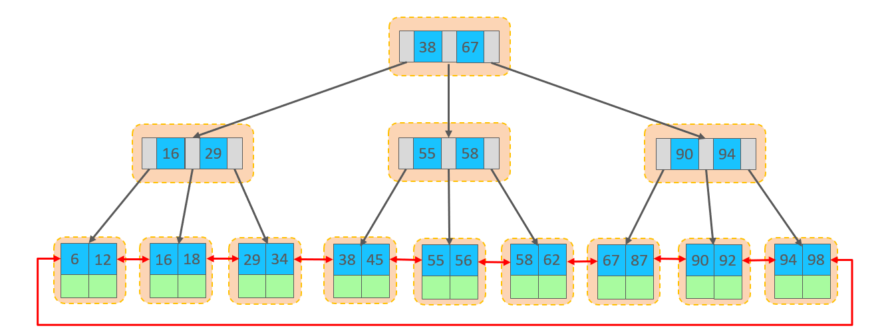

<!--#region
@author 吴钦飞
@email wuqinfei@qq.com
@create date 2025-05-07 22:06:42
@modify date 2025-07-03 19:35:10
@desc [description]
#endregion-->

# MySQL - 进阶

大纲: 

* 存储引擎
* 索引
* SQL 优化
* 视图/存储过程/触发器
* 锁
* InnoDB 核心
* MySQL 管理

## 1. 存储引擎

### 1.1. MySQL 体系结构


(1) 连接层:

最上层是一些客户端和链接服务，包含本地sock 通信和大多数基于客户端/服务端工具实现的类似于 TCP/IP 的通信。
主要完成一些类似于连接处理、授权认证、及相关的安全方案。在该层上引入了线程池的概念，为通过认证安全接入的客户端提供线程。
同样在该层上可以实现基于 SSL 的安全链接。
服务器也会为安全接入的每个客户端验证它所具有的操作权限。

(2) 服务层:

第二层架构主要完成大多数的核心服务功能，如 SQL 接口，并完成缓存的查询，SQL的分析和优化，部分内置函数的执行。
所有跨存储引擎的功能也在这一层实现，如 过程、函数等。在该层，服务器会解析查询并创建相应的内部解析树，并对其完成相应的优化如确定表的查询的顺序，是否利用索引等， 最后生成相应的执行操作。
如果是 select 语句，服务器还会查询内部的缓存，如果缓存空间足够大，这样在解决大量读操作的环境中能够很好的提升系统的性能。

(3) 引擎层:

存储引擎层， 存储引擎真正的负责了MySQL中数据的存储和提取，服务器通过API和存储引擎进行通信。
不同的存储引擎具有不同的功能，这样我们可以根据自己的需要，来选取合适的存储引擎。
数据库中的索引是在存储引擎层实现的。

(4) 存储层:

数据存储层， 主要是将数据(如: redolog、undolog、数据、索引、二进制日志、错误日志、查询 日志、慢查询日志等)存储在文件系统之上，并完成与存储引擎的交互。


其他数据库相比，MySQL 有点与众不同，它的架构可以在多种不同场景中应用并发挥良好作用。
主要体现在存储引擎上，插件式的存储引擎架构，将查询处理和其他的系统任务以及数据的存储提取分离。
这种架构可以根据业务的需求和实际需要选择合适的存储引擎。

### 1.2. 存储引擎介绍

存储引擎就是存储数据、建立索引、更新/查询数据等技术的实现方式 。
存储引擎是基于表的，而不是基于库的，所以存储引擎也可被称为表类型。
我们可以在创建表的时候，来指定选择的存储引擎，如果没有指定将自动选择默认的存储引擎。

(1) 建表时指定存储引擎:

```sql
CREATE TABLE 表名 (
  字段1 字段1类型 [ COMMENT 字段1注释 ] ,
  ......
  字段n 字段n类型 [COMMENT 字段n注释 ]
) ENGINE = INNODB [ COMMENT 表注释 ] ;
```

(2) 查询当前数据库支持的存储引擎:

```sql
show engines;

/*
+--------------------+---------+----------------------------------------------------------------+--------------+------+------------+
| Engine             | Support | Comment                                                        | Transactions | XA   | Savepoints |
+--------------------+---------+----------------------------------------------------------------+--------------+------+------------+
| MEMORY             | YES     | Hash based, stored in memory, useful for temporary tables      | NO           | NO   | NO         |
| MRG_MYISAM         | YES     | Collection of identical MyISAM tables                          | NO           | NO   | NO         |
| CSV                | YES     | CSV storage engine                                             | NO           | NO   | NO         |
| FEDERATED          | NO      | Federated MySQL storage engine                                 | NULL         | NULL | NULL       |
| PERFORMANCE_SCHEMA | YES     | Performance Schema                                             | NO           | NO   | NO         |
| MyISAM             | YES     | MyISAM storage engine                                          | NO           | NO   | NO         |
| InnoDB             | DEFAULT | Supports transactions, row-level locking, and foreign keys     | YES          | YES  | YES        |
| ndbinfo            | NO      | MySQL Cluster system information storage engine                | NULL         | NULL | NULL       |
| BLACKHOLE          | YES     | /dev/null storage engine (anything you write to it disappears) | NO           | NO   | NO         |
| ARCHIVE            | YES     | Archive storage engine                                         | NO           | NO   | NO         |
| ndbcluster         | NO      | Clustered, fault-tolerant tables                               | NULL         | NULL | NULL       |
+--------------------+---------+----------------------------------------------------------------+--------------+------+------------+
11 rows in set (0.00 sec)
*/
```

演示:

```sql
-- 查询建表语句 --- 默认存储引擎: InnoDB
show create table account;

/*
CREATE TABLE `account` (
  `id` int NOT NULL AUTO_INCREMENT COMMENT 'ID',
  `name` varchar(10) DEFAULT NULL COMMENT '姓名',
  `money` double(10,2) DEFAULT NULL COMMENT '余额',
  PRIMARY KEY (`id`)
) ENGINE=InnoDB AUTO_INCREMENT=3 DEFAULT CHARSET=utf8mb4 COLLATE=utf8mb4_0900_ai_ci COMMENT='账户表'
*/


-- 创建表 my_myisam , 并指定 MyISAM 存储引擎 (早起默认引擎)
create table my_myisam(
  id int,
  name varchar(10)
) engine = MyISAM ;


-- 创建表 my_memory , 指定 Memory 存储引擎
create table my_memory(
  id int,
  name varchar(10)
) engine = Memory ;
```

### 1.3. 存储引擎特点

#### 1.3.1. InnoDB

(1) 介绍:

InnoDB 是一种兼顾高可靠性和高性能的通用存储引擎，在 MySQL 5.5 之后，InnoDB是默认的 MySQL 存储引擎。

(2) 特点: 

* DML 操作遵循 ACID 模型，支持**事务**；
* **行级锁**，提高并发访问性能；
* 支持**外键** FOREIGN KEY 约束，保证数据的完整性和正确性

(3) 文件: 

xxx.ibd：

* xxx 代表的是表名
* innoDB引擎的每张表都会对应这样一个表空间文件，存储该表的表结构（frm-早期的 、sdi-新版的）、数据和索引

参数：innodb_file_per_table

```sql
-- 查看 innodb_file_per_table 参数（是否一个表一个文件）
show variables like 'innodb_file_per_table';

/*
+-----------------------+-------+
| Variable_name         | Value |
+-----------------------+-------+
| innodb_file_per_table | ON    |
+-----------------------+-------+
*/
```

如果该参数开启，代表对于 InnoDB 引擎的表，每一张表都对应一个ibd文件。

MySQL的数据存放目录： C:\ProgramData\MySQL\MySQL Server 8.0\Data

```text
C:\ProgramData\MySQL\MySQL Server 8.0\Data
    heima_db2       # 数据库名称
        account.ibd     # 表空间文件
```

ibd文件中不仅存放表结构、数据，还会存放该表对应的索引信息，
该文件是基于二进制存储的，不能直接基于记事本打开，
以使用 mysql 提供的一个指令 ibd2sdi ，通过该指令就可以从 ibd 文件中提取 sdi 信息，
而 sdi 数据字典信息中就包含该表的表结构。

```text
C:\ProgramData\MySQL\MySQL Server 8.0\Data\heima_db2>"C:\Program Files\MySQL\MySQL Server 8.0\bin\ibd2sdi" account.ibd


{
  "type": 1,
  "id": 513,
  "object": {
    "dd_object_type": "Table",
    "dd_object": {
        "name": "account",
        "columns": [
            {
                "name": "id",
                "type": 4,
                "is_nullable": false,
                "is_zerofill": false,
                "is_unsigned": false,
                "is_auto_increment": true,
                "is_virtual": false,
                "hidden": 1,
                "ordinal_position": 1,
                ......
            },
            ......
```

(4) 逻辑存储结构:


表空间: InnoDB 存储引擎逻辑结构的最高层，ibd 文件其实就是表空间文件，在表空间中可以包含多个 Segment 段。

段: 表空间是由各个段组成的， 常见的段有数据段、索引段、回滚段等。 InnoDB 中对于段的管理，都是引擎自身完成，不需要人为对其控制，一个段中包含多个区。

区: 区是表空间的单元结构，每个区的大小为 1M 。 默认情况下， InnoDB 存储引擎页大小为 16K， 即一个区中一共有 64 个连续的页。

页: 页是组成区的最小单元，页也是 InnoDB 存储引擎磁盘管理的最小单元，每个页的大小默认为 16KB 。为了保证页的连续性，InnoDB 存储引擎每次从磁盘申请 4-5 个区。

行: InnoDB 存储引擎是面向行的，也就是说数据是按行进行存放的，在每一行中除了定义表时所指定的字段以外，还包含两个隐藏字段(后面会详细介绍)。

#### 1.3.2. MyISAM

(1) 介绍:

MyISAM 是 MySQL 早期的默认存储引擎

(2) 特点:

* 不支持事务，不支持外键
* 支持表锁，不支持行锁
* 访问速度快

(3) 文件:

* 表名.sdi：存储表结构信息
* 表名.MYD: 存储数据
* 表名.MYI: 存储索引

#### 1.3.3. Memory

(1) 介绍:

Memory 引擎的表数据时存储在内存中的，由于受到硬件问题、或断电问题的影响，只能将这些表作为临时表或缓存使用。

(2) 特点:

* 内存存放
* hash 索引（默认）

(3) 文件:

表名.sdi：存储表结构信息

#### 1.3.4. 区别及特点

| 特点 | InnoDB | MyISAM | Memory |
| - | - | - | - |
| 存储限制 | 64TB | 有 | 有 |
| 事务安全 | 支持 | - | - |
| 锁机制 | 行锁 | 表锁 | 表锁 |
| B+ tree 索引 | 支持 | 支持 | 支持 |
| Hash 索引 | - | - | 支持 |
| 全文索引 | 支持(5.6版本之后) | 支持 | - |
| 空间使用 | 高 | 低 | N/A |
| 内存使用 | 高 | 低 | 中等 |
| 批量插入速度 | 低 | 高 | 高 |
| 支持外键 | 支持 | - | - |

面试题: InnoDB引擎与MyISAM引擎的区别 ?
1. InnoDB 引擎, 支持事务, 而 MyISAM 不支持。
2. InnoDB 引擎, 支持行锁和表锁, 而 MyISAM 仅支持表锁, 不支持行锁。
3. InnoDB 引擎, 支持外键, 而 MyISAM 是不支持的。

主要是上述三点区别，当然也可以从索引结构、存储限制等方面，更加深入的回答，具体参考如下官方文档：
* https://dev.mysql.com/doc/refman/8.0/en/innodb-introduction.html
* https://dev.mysql.com/doc/refman/8.0/en/myisam-storage-engine.html

### 1.4. 存储引擎选择

在选择存储引擎时，应该根据应用系统的特点选择合适的存储引擎。对于复杂的应用系统，还可以根据实际情况选择多种存储引擎进行组合。

InnoDB: 是 Mysql 的默认存储引擎，支持事务、外键。如果应用对事务的完整性有比较高的要求，在并发条件下要求数据的一致性，数据操作除了插入和查询之外，还包含很多的更新、删除操作，那么 InnoDB 存储引擎是比较合适的选择。

MyISAM：如果应用是以读操作和插入操作为主，只有很少的更新和删除操作，并且对事务的完整性、并发性要求不是很高，那么选择这个存储引擎是非常合适的。（被 NoSQL 数据库 MongoDB 替代）

MEMORY：将所有数据保存在内存中，访问速度快，通常用于临时表及缓存。 MEMORY 的缺陷就是对表的大小有限制，太大的表无法缓存在内存中，而且无法保障数据的安全性。（被 Redis 替代）

## 2. 索引

### 2.1. 索引概述

#### 2.1.1. 介绍

索引（index）是帮助MySQL高效获取数据的数据结构(有序)。
在数据之外，数据库系统还维护着满足特定查找算法的数据结构，
这些数据结构以某种方式引用（指向）数据，这样就可以在这些数据结构上实现高级查找算法，这种数据结构就是索引。

#### 2.1.2. 演示

假如我们要执行的 SQL 语句为：`select * from user where age = 45;`

(1) 无索引情况：


在无索引情况下，就需要从第一行开始扫描，一直扫描到最后一行，我们称之为全表扫描，性能很低。

(2) 有索引情况:


如果我们针对于这张表建立了索引，假设索引结构就是二叉树，那么也就意味着，会对 age 这个字段建立一个二叉树的索引结构。

此时我们在进行查询时，只需要扫描三次就可以找到数据了，极大的提高的查询的效率。

备注：这里我们只是假设索引的结构是二叉树，介绍一下索引的大概原理，只是一个示意图，并不是索引的真实结构，索引的真实结构，后面会详细介绍。

#### 2.1.3. 特点

| 优势 | 劣势 |
| - | - |
| 提高数据检索的效率，降低数据库的 IO 成本 | 索引列也是要占用空间的。|
| 通过索引列对数据进行排序，降低数据排序的成本，降低CPU的消耗。|  索引大大提高了查询效率，同时却也降低更新表的速度， 如对表进行 INSERT、UPDATE、DELETE 时，效率降低。|

### 2.2. 索引结构

#### 2.2.1. 概述

MySQL 的索引是在存储引擎层实现的，不同的存储引擎有不同的索引结构，主要包含以下几种：

| 引结构 | 描述 |
| - | - |
| B+Tree索引 | 最常见的索引类型，大部分引擎都支持 B+ 树索引  |
| Hash索引 | 底层数据结构是用哈希表实现的, 只有精确匹配索引列的查询才有效, 不 支持范围查询 |
| R-tree（空间索引）| 空间索引是MyISAM引擎的一个特殊索引类型，主要用于地理空间数据类型，通常使用较少 |
| Full-text(全文索引) | 是一种通过建立倒排索引,快速匹配文档的方式。类似于 Lucene,Solr,ES |

上述是 MySQL 中所支持的所有的索引结构，接下来，我们再来看看不同的存储引擎对于索引结构的支持情况

| 索引 | InnoDB | MyISAM | Memory |
| - | - | - | - |
| B+tree 索引 | 支持 | 支持 | 支持 |
| Hash 索引 | 不支持 | 不支持 | 支持 |
| R-tree 索引 | 不支持 | 支持 | 不支持 |
| Full-text | 5.6版本之后支持 | 支持 | 不支持 |

注意：我们平常所说的索引，如果没有特别指明，都是指 B+ 树结构组织的索引

#### 2.2.2. 二叉树

假如说 MySQL 的索引结构采用二叉树的数据结构，比较理想的结构如下：


如果主键是顺序插入的，则会形成一个单向链表，结构如下：


所以，如果选择二叉树作为索引结构，会存在以下缺点：
* 顺序插入时，会形成一个链表，查询性能大大降低。
* 大数据量情况下，层级较深，检索速度慢。

此时大家可能会想到，我们可以选择红黑树，红黑树是一颗自平衡二叉树，那这样即使是顺序插入数据，最终形成的数据结构也是一颗平衡的二叉树,结构如下:


但是，即使如此，由于红黑树也是一颗二叉树，所以也会存在一个缺点：
* 大数据量情况下，层级较深，检索速度慢。

所以，在 MySQL 的索引结构中，并没有选择二叉树或者红黑树，而选择的是 B+Tree，那么什么是 B+Tree 呢？
在详解 B+Tree 之前，先来介绍一个 B-Tree 。

#### 2.2.3. B-Tree

B-Tree，B树是一种多叉路衡查找树，相对于二叉树，B树每个节点可以有多个分支，即多叉。
以一颗最大度数（max-degree）为5(5阶)的 b-tree 为例，那这个 B树 每个节点最多存储 4 个 key，5 个指针：


树的度数指的是一个节点的子节点个数。

我们可以通过一个数据结构可视化的网站来简单演示一下。 
* https://www.cs.usfca.edu/~galles/visualization/BTree.html

特点：
* 5 阶的 B树，每一个节点最多存储 4 个key，对应 5 个指针。
* 一旦节点存储的 key 数量到达 5，就会裂变，中间元素向上分裂。
* 在 B树 中，非叶子节点和叶子节点都会存放数据

#### 2.2.4. B+Tree

B+Tree 是 B-Tree 的变种

B+Tree 与 B-Tree 相比，主要有以下三点区别：
* 所有的数据都会出现在叶子节点。
* 叶子节点形成一个单向链表。
* 非叶子节点仅仅起到索引数据作用，具体的数据都是在叶子节点存放的

MySQL索引数据结构对经典的 B+Tree 进行了优化。在原 B+Tree 的基础上，增加一个指向相邻叶子节点的链表指针，就形成了带有顺序指针的 B+Tree，提高区间访问的性能，利于排序。

#### 2.2.5. Hash

MySQL 中除了支持 B+Tree 索引，还支持一种索引类型 --- Hash 索引。

(1) 结构

哈希索引就是采用一定的 hash 算法，将键值换算成新的 hash 值，映射到对应的槽位上，然后存储在 hash 表中。

如果两个(或多个)键值，映射到一个相同的槽位上，他们就产生了 hash 冲突（也称为 hash 碰撞），可以通过链表来解决。


(2) 特点

* Hash 索引只能用于对等比较(`=`，`in`)，不支持范围查询（`between`，`>`，`<` ，...）
* 无法利用索引完成排序操作
* 查询效率高，通常(不存在 hash 冲突的情况)只需要一次检索就可以了，效率通常要高于 B+tree 索引

(3) 存储引擎支持

在 MySQL 中，支持 hash 索引的是 Memory 存储引擎。 
而 InnoDB 中具有自适应 hash 功能，hash 索引是 InnoDB 存储引擎根据 B+Tree 索引在指定条件下自动构建的。

#### 2.2.6. 思考

思考题： 为什么 InnoDB 存储引擎选择使用 B+tree 索引结构?

* 相对于二叉树，层级更少，搜索效率高；
* 对于 B-tree，无论是叶子节点还是非叶子节点，都会保存数据，这样导致一页中存储的键值减少，指针跟着减少，要同样保存大量数据，只能增加树的高度，导致性能降低
* 相对 Hash 索引，B+tree 支持范围匹配及排序操作

### 2.3. 索引分类

#### 2.3.1. 索引分类

在 MySQL 数据库，将索引的具体类型主要分为以下几类：主键索引、唯一索引、常规索引、全文索引。

| 分类 | 含义 | 特点 | 关键字 |
| - | - | - | - |
| 主键索引 | 针对于表中主键创建的索引 | 默认自动创建, 只能有一个 | PRIMARY |
| 唯一索引 | 避免同一个表中某数据列中的值重复 | 可以有多个 | UNIQUE  |
| 常规索引 | 快速定位特定数据 | 可以有多个 | - |
| 全文索引 | 全文索引查找的是文本中的关键词，而不是比较索引中的值 | 可以有多个 | FULLTEXT |

#### 2.3.2. 聚集索引 & 二级索引

而在在 InnoDB 存储引擎中，根据索引的存储形式，又可以分为以下两种:

| 分类 | 含义 | 特点 |
| - | - | - |
| 聚集索引 (Clustered Index) | 将数据存储与索引放到了一块，索引结构的叶子节点保存了行数据 | 必须有,而且只有一个 |
| 二级索引 (Secondary Index) | 将数据与索引分开存储，索引结构的叶子节点关联的是对应的主键 | 可以存在多个 |


聚集索引选取规则:

* 如果存在主键，主键索引就是聚集索引
* 如果不存在主键，将使用第一个唯一（UNIQUE）索引作为聚集索引
* 如果表没有主键，或没有合适的唯一索引，则 InnoDB 会自动生成一个 rowid 作为隐藏的聚集索引。

聚集索引和二级索引的具体结构如下：


* 聚集索引的叶子节点下挂的是这一行的数据
* 二级索引的叶子节点下挂的是该字段值对应的主键值

当我们执行如下的 SQL 语句时，具体的查找过程如下图


具体过程如下:

1. 由于是根据 `name` 字段进行查询，所以先根据 `name='Arm'` 到 `name` 字段的二级索引中进行匹配查找。但是在二级索引中只能查找到 `Arm` 对应的主键值 `10`。
2. 由于查询返回的数据是 `*`，所以此时，还需要根据主键值 `10`，到聚集索引中查找 `10` 对应的记录，最终找到 `10` 对应的行 row。
3. 最终拿到这一行的数据，直接返回即可

回表查询： 

* 这种先到二级索引中查找数据，找到主键值，然后再到聚集索引中根据主键值，获取数据的方式，就称之为回表查询。

#### 2.3.3. 思考

(1) 以下两条 SQL 语句，那个执行效率高? 为什么?

A. `select * from user where id = 10 ;`
B. `select * from user where name = 'Arm' ;`

备注: id 为主键，name 字段创建的有索引；

解答：

* A 语句的执行性能要高于 B 语句。
* 因为 A 语句直接走聚集索引，直接返回数据。 而 B 语句需要先查询 name 字段的二级索引，然后再查询聚集索引，也就是需要进行回表查询

(2) InnoDB 主键索引的 B+tree 高度为多高呢?

假设:

一行数据大小为 1k，一页中可以存储 16 行这样的数据。InnoDB 的指针占用 6 个字节的空间，主键即使为 bigint，占用字节数为 8。

高度为 2：

```text
一个非节点的组成：

  n 个主键，主键为 bigint 类型，占 8 个字节
  n+1 个指针，指针占 6 个字节


一个非叶子节点 占一个页大小（16K）：

  n * 8 + (n + 1) * 6 = 16 * 1024 , 算出可以存储主键个数(n) 约为 1170
  
叶子节点 占一个页大大小，
（一行数据大小为 1k，一页中可以存储 16 行这样的数据），
则一个叶子节点可以存储 16 条数据，
则该树最多存储的记录数为：
  
  (1170 + 1) * 16 = 18736

也就是说，如果树的高度为 2，则可以存储 18000 多条记录。
```


高度为 3：

```text
第一行为根节点，最多有 (1170 + 1) 个二级节点

每个二级节点，最多有 (1170 + 1) 个叶子节点

一个叶子节点占用一页（16K），每条数据占用 1K 的话，则

(1170 + 1) * (1170 + 1) * 16 = 21939856

也就是说，如果树的高度为 3，则可以存储 2200w 左右的记录。
```

### 2.4. 索引语法

(1) 创建索引

```sql
CREATE [ UNIQUE | FULLTEXT ] INDEX index_name ON table_name (index_col_name, ... ) ;
```

(2) 查看索引

```sql
SHOW INDEX FROM table_name ;
```

(3) 删除索引

```sql
DROP INDEX index_name ON table_name ;
```

案例:

```sql
-- name 字段为姓名字段，该字段的值可能会重复，为该字段创建索引。
CREATE INDEX idx_user_name ON tb_user(name);

-- phone 手机号字段的值，是非空，且唯一的，为该字段创建唯一索引。
CREATE UNIQUE INDEX idx_user_phone ON tb_user(phone);

-- 为 profession、age、status 创建联合索引
CREATE INDEX idx_user_pro_age_sta ON tb_user(profession,age,status);

-- 为 email 建立合适的索引来提升查询效率
CREATE INDEX idx_email ON tb_user(email);

-- 查看 
show index from tb_user;

/*
+---------+------------+----------------------+--------------+-------------+------+------------+
| Table   | Non_unique | Key_name             | Seq_in_index | Column_name | Null | Index_type |
+---------+------------+----------------------+--------------+-------------+------+------------+
| tb_user |          0 | PRIMARY              |            1 | id          |      | BTREE      |
| tb_user |          0 | idx_user_phone       |            1 | phone       |      | BTREE      |
| tb_user |          1 | idx_user_name        |            1 | name        |      | BTREE      |
| tb_user |          1 | idx_user_pro_age_sta |            1 | profession  | YES  | BTREE      |
| tb_user |          1 | idx_user_pro_age_sta |            2 | age         | YES  | BTREE      |
| tb_user |          1 | idx_user_pro_age_sta |            3 | status      | YES  | BTREE      |
| tb_user |          1 | idx_email            |            1 | email       | YES  | BTREE      |
+---------+------------+----------------------+--------------+-------------+------+------------+
*/
```

### 2.5. SQL 性能分析

#### 2.5.1. SQL 执行频率

MySQL 客户端连接成功后，通过 `show [session|global] status` 命令可以提供服务器状态信息。
通过如下指令，可以查看当前数据库的 INSERT、UPDATE、DELETE、SELECT 的访问频次：

```sql
-- session 是查看当前会话 ;
-- global 是查询全局数据 ;
SHOW GLOBAL STATUS LIKE 'Com_______'; -- 7 个下划线


/*
+---------------+-------+
| Variable_name | Value |
+---------------+-------+
| Com_binlog    | 0     |
| Com_commit    | 0     |
| Com_delete    | 0     |
| Com_import    | 0     |
| Com_insert    | 24    |
| Com_repair    | 0     |
| Com_revoke    | 0     |
| Com_select    | 338   |
| Com_signal    | 0     |
| Com_update    | 0     |
| Com_xa_end    | 0     |
+---------------+-------+
*/
```

通过上述指令，我们可以查看到当前数据库到底是以查询为主，还是以增删改为主，从而为数据库优化提供参考依据。
如果是以增删改为主，我们可以考虑不对其进行索引的优化。 
如果是以查询为主，那么就要考虑对数据库的索引进行优化了。

那么通过查询 SQL 的执行频次，我们就能够知道当前数据库到底是增删改为主，还是查询为主。 
那假如说是以查询为主，我们又该如何定位针对于那些查询语句进行优化呢？ 
次数我们可以借助于慢查询日志。

接下来，我们就来介绍一下 MySQL 中的慢查询日志。

#### 2.5.2. 慢查询日志

慢查询日志记录了所有执行时间超过指定参数（`long_query_time`，单位：秒，默认 10 秒）的所有 SQL 语句的日志。

MySQL 的慢查询日志默认没有开启，我们可以查看一下系统变量 `slow_query_log`

```sql
show variables like 'slow_query_log';

/*
+----------------+-------+
| Variable_name  | Value |
+----------------+-------+
| slow_query_log | ON    |
+----------------+-------+
*/
```

如果要开启慢查询日志，需要在MySQL的配置文件（`/etc/my.cnf`）中配置如下信息：

```shell
# 开启MySQL慢日志查询开关
slow_query_log=1

# 设置慢日志的时间为2秒，SQL语句执行时间超过2秒，就会视为慢查询，记录慢查询日志
long_query_time=2
```

配置完毕之后，通过以下指令重新启动 MySQL 服务器进行测试，查看慢日志文件中记录的信息 `/var/lib/mysql/localhost-slow.log`

在慢查询日志中，只会记录执行时间超多我们预设时间（2s）的SQL，执行较快的SQL 是不会记录的

#### 2.5.3. profile 详情

`show profiles` 能够在做 SQL 优化时帮助我们了解时间都耗费到哪里去了。

通过 `have_profiling` 参数，能够看到当前 MySQL 是否支持 profile 操作

可以通过 `set` 语句在 session / global 级别开启 profiling

```sql
-- 查看是否支持 
SELECT @@have_profiling ;

/*
+------------------+
| @@have_profiling |
+------------------+
| YES              |
+------------------+
*/


-- 查看是否开启
SELECT @@profiling;

/*
+-------------+
| @@profiling |
+-------------+
|           0 |
+-------------+
*/


-- 开启
SET profiling = 1;
```

执行 SQL 语句，都会记录耗时:

```sql
select * from tb_user;
select * from tb_user where id = 1;
select * from tb_user where name = '白起';

-- 查看每一条SQL的耗时基本情况
show profiles;

/*
+----------+------------+-------------------------------------------+
| Query_ID | Duration   | Query                                     |
+----------+------------+-------------------------------------------+
|        1 | 0.00071175 | select * from tb_user                     |
|        2 | 0.00019375 | select * from tb_user where id = 1        |
|        3 | 0.00045175 | select * from tb_user where name = '????' |
+----------+------------+-------------------------------------------+
*/

-- 查看指定query_id的SQL语句各个阶段的耗时情况
show profile for query query_id;

-- 查看指定query_id的SQL语句CPU的使用情况
show profile cpu for query query_id;
```

#### 2.5.4. explain

`EXPLAIN` 或者 `DESC` 命令获取 MySQL 如何执行 SELECT 语句的信息，
包括在 SELECT 语句执行过程中表如何连接和连接的顺序。

语法:

```sql
-- 直接在select语句之前加上关键字 explain / desc
EXPLAIN SELECT 字段列表 FROM 表名 WHERE 条件 ;

-- 示例
explain select * from student where id=1;

/*
+----+-------------+---------+------------+-------+---------------+---------+---------+-------+------+----------+-------+
| id | select_type | table   | partitions | type  | possible_keys | key     | key_len | ref   | rows | filtered | Extra |
+----+-------------+---------+------------+-------+---------------+---------+---------+-------+------+----------+-------+
|  1 | SIMPLE      | student | NULL       | const | PRIMARY       | PRIMARY | 4       | const |    1 |   100.00 | NULL  |
+----+-------------+---------+------------+-------+---------------+---------+---------+-------+------+----------+-------+
*/
```

Explain 执行计划中各个字段的含义:

| 字段 | 含义| 
| - | -| 
| `id` | select 查询的序列号，表示查询中执行 select 子句或者是操作表的顺序 (id相同，执行顺序从上到下；id不同，值越大，越先执行)。|
| `select_type` | 表示 SELECT 的类型，常见的取值有 SIMPLE（简单表，即不使用表连接或者子查询）、PRIMARY（主查询，即外层的查询）、 UNION（UNION 中的第二个或者后面的查询语句）、 SUBQUERY（SELECT/WHERE之后包含了子查询）等 |
| `type` | 表示连接类型，性能由好到差的连接类型为 NULL、system、const、eq_ref、ref、range、 index、all 。 |
| `possible_key` | 显示可能应用在这张表上的索引，一个或多个。|
| `key` | 实际使用的索引，如果为 NULL，则没有使用索引。|
| `key_len` | 表示索引中使用的字节数， 该值为索引字段最大可能长度，并非实际使用长度，在不损失精确性的前提下， 长度越短越好 。|
| `rows` | MySQL 认为必须要执行查询的行数，在 innodb 引擎的表中，是一个估计值，可能并不总是准确的。 |
| `filtered` | 表示返回结果的行数占需读取行数的百分比， filtered 的值越大越好。|

### 2.6. 索引使用

#### 2.6.1. 验证索引效率

没有索引时的查询：(需要 6 秒)

```sql
SELECT * FROM tb_sku WHERE sn = '100000003145001'\G;
/*
*************************** 1. row ***************************
           id: 1
           sn: 100000003145001
         name: 华为Meta1
        price: 87901
          num: 9961
    alert_num: 100
        image: https://m.360buyimg.com/mobilecms/s720x720_jfs/t5590/64/5811657380/234462/5398e856/5965e173N34179777.jpg!q70.jpg.webp
       images: https://m.360buyimg.com/mobilecms/s720x720_jfs/t5590/64/5811657380/234462/5398e856/5965e173N34179777.jpg!q70.jpg.webp
       weight: 10
  create_time: 2019-05-01 00:00:00
  update_time: 2019-05-01 00:00:00
category_name: 真皮包
   brand_name: viney
         spec: 白色1
     sale_num: 39
  comment_num: 0
       status: 1
1 row in set (6.74 sec)
*/
```

建立索引:

```sql
create index idx_sku_sn on tb_sku(sn) ;
-- Query OK, 0 rows affected (15.38 sec)

show index from tb_sku;
/*
+--------+------------+------------+--------------+-------------+------------+
| Table  | Non_unique | Key_name   | Seq_in_index | Column_name | Index_type |
+--------+------------+------------+--------------+-------------+------------+
| tb_sku |          0 | PRIMARY    |            1 | id          | BTREE      |
| tb_sku |          1 | idx_sku_sn |            1 | sn          | BTREE      |
+--------+------------+------------+--------------+-------------+------------+
 */
```

再次查询: (约等于 0 秒)

```sql
SELECT * FROM tb_sku WHERE sn = '100000003145002'\G;
/*
*************************** 1. row ***************************
           id: 2
           sn: 100000003145002
         name: 华为Meta2
        price: 3
          num: 9946
    alert_num: 100
        image: https://m.360buyimg.com/mobilecms/s720x720_jfs/t23998/350/2363990466/222391/a6e9581d/5b7cba5bN0c18fb4f.jpg!q70.jpg.webp
       images: https://m.360buyimg.com/mobilecms/s720x720_jfs/t23998/350/2363990466/222391/a6e9581d/5b7cba5bN0c18fb4f.jpg!q70.jpg.webp
       weight: 10
  create_time: 2019-05-01 00:00:00
  update_time: 2019-05-01 00:00:00
category_name: 拉拉裤
   brand_name: 巴布豆
         spec: 白色2
     sale_num: 54
  comment_num: 0
       status: 1
1 row in set (0.00 sec)
*/
```

sn 字段建立了索引之后，查询性能大大提升。建立索引前后，查询耗时都不是一个数量级的。

#### 2.6.2. 最左前缀法则

如果索引了多列（联合索引），要遵守最左前缀法则。
最左前缀法则指的是查询从索引的最左列开始，并且不跳过索引中的列。
如果跳跃某一列，索引将会部分失效(后面的字段索引失效)。

```sql
-- 查看表的索引
show index from tb_user;

/*
+---------+------------+----------------------+--------------+-------------+
| Table   | Non_unique | Key_name             | Seq_in_index | Column_name |
+---------+------------+----------------------+--------------+-------------+
| tb_user |          0 | PRIMARY              |            1 | id          |
| tb_user |          0 | idx_user_phone       |            1 | phone       |
| tb_user |          1 | idx_user_name        |            1 | name        |
| tb_user |          1 | idx_user_pro_age_sta |            1 | profession  |
| tb_user |          1 | idx_user_pro_age_sta |            2 | age         |
| tb_user |          1 | idx_user_pro_age_sta |            3 | status      |
| tb_user |          1 | idx_email            |            1 | email       |
+---------+------------+----------------------+--------------+-------------+
*/
```

对于最左前缀法则指的是，查询时，最左边的列，也就是 profession 必须存在，否则索引全部失效。
而且中间不能跳过某一列，否则该列后面的字段索引将失效。

```sql
-- 三个字段的索引都是用到了
explain select * from tb_user where profession = '软件工程' and age = 31 and status = '0';
/*
+----+-------------+---------+------------+------+----------------------+----------------------+---------+-------------------+------+----------+-----------------------+
| id | select_type | table   | partitions | type | possible_keys        | key                  | key_len | ref               | rows | filtered | Extra                 |
+----+-------------+---------+------------+------+----------------------+----------------------+---------+-------------------+------+----------+-----------------------+
|  1 | SIMPLE      | tb_user | NULL       | ref  | idx_user_pro_age_sta | idx_user_pro_age_sta | 54      | const,const,const |    1 |   100.00 | Using index condition |
+----+-------------+---------+------------+------+----------------------+----------------------+---------+-------------------+------+----------+-----------------------+
*/


-- 省略第三个字段。则只用到了两个字段的索引，status 的索引没有使用到，推断出 status 的索引长度为 5
explain select * from tb_user where profession = '软件工程' and age = 31;
/*
+----+-------------+---------+------------+------+----------------------+----------------------+---------+-------------+------+----------+-------+
| id | select_type | table   | partitions | type | possible_keys        | key                  | key_len | ref         | rows | filtered | Extra |
+----+-------------+---------+------------+------+----------------------+----------------------+---------+-------------+------+----------+-------+
|  1 | SIMPLE      | tb_user | NULL       | ref  | idx_user_pro_age_sta | idx_user_pro_age_sta | 49      | const,const |    1 |   100.00 | NULL  |
+----+-------------+---------+------------+------+----------------------+----------------------+---------+-------------+------+----------+-------+
*/


-- 省略后两个字段。则使用到一个字段索引，推断出 age 的索引长度为 2。
explain select * from tb_user where profession = '软件工程';
/*
+----+-------------+---------+------------+------+----------------------+----------------------+---------+-------+------+----------+-------+
| id | select_type | table   | partitions | type | possible_keys        | key                  | key_len | ref   | rows | filtered | Extra |
+----+-------------+---------+------------+------+----------------------+----------------------+---------+-------+------+----------+-------+
|  1 | SIMPLE      | tb_user | NULL       | ref  | idx_user_pro_age_sta | idx_user_pro_age_sta | 47      | const |    4 |   100.00 | NULL  |
+----+-------------+---------+------------+------+----------------------+----------------------+---------+-------+------+----------+-------+
*/


-- 省略首个字段，则索引失效，全表扫描
explain select * from tb_user where age = 31 and status = '0';
/*
+----+-------------+---------+------------+------+---------------+------+---------+------+------+----------+-------------+
| id | select_type | table   | partitions | type | possible_keys | key  | key_len | ref  | rows | filtered | Extra       |
+----+-------------+---------+------------+------+---------------+------+---------+------+------+----------+-------------+
|  1 | SIMPLE      | tb_user | NULL       | ALL  | NULL          | NULL | NULL    | NULL |   24 |     4.17 | Using where |
+----+-------------+---------+------------+------+---------------+------+---------+------+------+----------+-------------+
*/


-- 省略第二个字段。则只有第一个字段的索引生效
explain select * from tb_user where profession = '软件工程' and status = '0';
/*
+----+-------------+---------+------------+------+----------------------+----------------------+---------+-------+------+----------+-----------------------+
| id | select_type | table   | partitions | type | possible_keys        | key                  | key_len | ref   | rows | filtered | Extra                 |
+----+-------------+---------+------------+------+----------------------+----------------------+---------+-------+------+----------+-----------------------+
|  1 | SIMPLE      | tb_user | NULL       | ref  | idx_user_pro_age_sta | idx_user_pro_age_sta | 47      | const |    4 |    10.00 | Using index condition |
+----+-------------+---------+------------+------+----------------------+----------------------+---------+-------+------+----------+-----------------------+
*/

-- 将首个字段放在最后，仍旧使用三个索引
-- 左前缀法则中指的最左边的列，是指在查询时，联合索引的最左边的字段(即是 第一个字段)必须存在，与我们编写SQL时，条件编写的先后顺序无关
explain select * from tb_user where age = 31 and status = '0' and profession = '软件工程';
/*
+----+-------------+---------+------------+------+----------------------+----------------------+---------+-------------------+------+----------+-----------------------+
| id | select_type | table   | partitions | type | possible_keys        | key                  | key_len | ref               | rows | filtered | Extra                 |
+----+-------------+---------+------------+------+----------------------+----------------------+---------+-------------------+------+----------+-----------------------+
|  1 | SIMPLE      | tb_user | NULL       | ref  | idx_user_pro_age_sta | idx_user_pro_age_sta | 54      | const,const,const |    1 |   100.00 | Using index condition |
+----+-------------+---------+------------+------+----------------------+----------------------+---------+-------------------+------+----------+-----------------------+
*/
```

#### 2.6.3. 范围查询

联合索引中，出现范围查询(`>`,`<`)，范围查询右侧的列索引失效。

```sql
-- 当范围查询使用 > 或 < 时，走联合索引了，但是索引的长度为 49，就说明范围查询右边的 status 字段是没有走索引的。
explain select * from tb_user where profession = '软件工程' and age > 30 and status = '0';
/*
+----+-------------+---------+------------+-------+----------------------+----------------------+---------+------+------+----------+-----------------------+
| id | select_type | table   | partitions | type  | possible_keys        | key                  | key_len | ref  | rows | filtered | Extra                 |
+----+-------------+---------+------------+-------+----------------------+----------------------+---------+------+------+----------+-----------------------+
|  1 | SIMPLE      | tb_user | NULL       | range | idx_user_pro_age_sta | idx_user_pro_age_sta | 49      | NULL |    2 |    10.00 | Using index condition |
+----+-------------+---------+------------+-------+----------------------+----------------------+---------+------+------+----------+-----------------------+
*/
```

当范围查询使用 `>=` 或 `<=` 时，走联合索引了，但是索引的长度为 54，就说明所有的字段都是走索引的。

```sql
explain select * from tb_user where profession = '软件工程' and age >= 30 and status = '0';
/*
+----+-------------+---------+------------+-------+----------------------+----------------------+---------+------+------+----------+-----------------------+
| id | select_type | table   | partitions | type  | possible_keys        | key                  | key_len | ref  | rows | filtered | Extra                 |
+----+-------------+---------+------------+-------+----------------------+----------------------+---------+------+------+----------+-----------------------+
|  1 | SIMPLE      | tb_user | NULL       | range | idx_user_pro_age_sta | idx_user_pro_age_sta | 54      | NULL |    2 |    10.00 | Using index condition |
+----+-------------+---------+------------+-------+----------------------+----------------------+---------+------+------+----------+-----------------------+
*/
```

所以，在业务允许的情况下，尽可能的使用类似于 `>=` 或 `<=` 这类的范围查询，而避免使用 `>` 或 `<` 。

#### 2.6.4. 索引失效情况

##### 2.6.4.1. 索引列运算

不要在索引列上进行运算操作， 索引将失效。

```sql
-- 当根据phone字段进行等值匹配查询时, 索引生效
explain select * from tb_user where phone = '17799990015';
/*
+----+-------------+---------+------------+-------+----------------+----------------+---------+-------+------+----------+-------+
| id | select_type | table   | partitions | type  | possible_keys  | key            | key_len | ref   | rows | filtered | Extra |
+----+-------------+---------+------------+-------+----------------+----------------+---------+-------+------+----------+-------+
|  1 | SIMPLE      | tb_user | NULL       | const | idx_user_phone | idx_user_phone | 46      | const |    1 |   100.00 | NULL  |
+----+-------------+---------+------------+-------+----------------+----------------+---------+-------+------+----------+-------+
*/


-- 当根据phone字段进行函数运算操作之后，索引失效。
explain select * from tb_user where substring(phone,10,2) = '15';
/*
+----+-------------+---------+------------+------+---------------+------+---------+------+------+----------+-------------+
| id | select_type | table   | partitions | type | possible_keys | key  | key_len | ref  | rows | filtered | Extra       |
+----+-------------+---------+------------+------+---------------+------+---------+------+------+----------+-------------+
|  1 | SIMPLE      | tb_user | NULL       | ALL  | NULL          | NULL | NULL    | NULL |   24 |   100.00 | Using where |
+----+-------------+---------+------------+------+---------------+------+---------+------+------+----------+-------------+
*/
```

##### 2.6.4.2. 字符串不加引号

字符串类型字段使用时，不加引号，索引将失效

```sql
-- 字符串加引号，索引生效
explain select * from tb_user where phone = '17799990015';
/*
+----+-------------+---------+------------+-------+----------------+----------------+---------+-------+------+----------+-------+
| id | select_type | table   | partitions | type  | possible_keys  | key            | key_len | ref   | rows | filtered | Extra |
+----+-------------+---------+------------+-------+----------------+----------------+---------+-------+------+----------+-------+
|  1 | SIMPLE      | tb_user | NULL       | const | idx_user_phone | idx_user_phone | 46      | const |    1 |   100.00 | NULL  |
+----+-------------+---------+------------+-------+----------------+----------------+---------+-------+------+----------+-------+
*/

-- 字符串加引号，索引失效。
explain select * from tb_user where phone = 17799990015;
/*
+----+-------------+---------+------------+------+----------------+------+---------+------+------+----------+-------------+
| id | select_type | table   | partitions | type | possible_keys  | key  | key_len | ref  | rows | filtered | Extra       |
+----+-------------+---------+------------+------+----------------+------+---------+------+------+----------+-------------+
|  1 | SIMPLE      | tb_user | NULL       | ALL  | idx_user_phone | NULL | NULL    | NULL |   24 |    10.00 | Using where |
+----+-------------+---------+------------+------+----------------+------+---------+------+------+----------+-------------+
*/
```

如果字符串不加单引号，对于查询结果，没什么影响，但是数据库存在隐式类型转换，索引将失效。

##### 2.6.4.3. 模糊查询

头部存在模糊匹配，则索引失效

```sql
-- 生效
explain select * from tb_user where profession like '软件%';

-- 失效
explain select * from tb_user where profession like '%工程';

-- 失效
explain select * from tb_user where profession like '%工%';
```

在 like 模糊查询中，在关键字后面加 `%`，索引可以生效。而如果在关键字前面加了 `%`，索引将会失效。


##### 2.6.4.4. or 连接条件

当 or 连接的条件，左右两侧字段都有索引时，索引才会生效。

用 or 分割开的条件， 如果 or 前的条件中的列有索引，而后面的列中没有索引，那么涉及的索引都不会被用到。

```sql
explain select * from tb_user where id = 10 or age = 23;
/*
+----+-------------+---------+------------+------+---------------+------+---------+------+------+----------+-------------+
| id | select_type | table   | partitions | type | possible_keys | key  | key_len | ref  | rows | filtered | Extra       |
+----+-------------+---------+------------+------+---------------+------+---------+------+------+----------+-------------+
|  1 | SIMPLE      | tb_user | NULL       | ALL  | PRIMARY       | NULL | NULL    | NULL |   24 |    13.75 | Using where |
+----+-------------+---------+------------+------+---------------+------+---------+------+------+----------+-------------+
*/
```

##### 2.6.4.5. 数据分布影响

如果 MySQL 评估使用索引比全表更慢，则不使用索引。

```sql
explain select * from tb_user where phone >= '17799990005';
/*
+----+-------------+---------+------------+------+----------------+------+---------+------+------+----------+-------------+
| id | select_type | table   | partitions | type | possible_keys  | key  | key_len | ref  | rows | filtered | Extra       |
+----+-------------+---------+------------+------+----------------+------+---------+------+------+----------+-------------+
|  1 | SIMPLE      | tb_user | NULL       | ALL  | idx_user_phone | NULL | NULL    | NULL |   24 |    79.17 | Using where |
+----+-------------+---------+------------+------+----------------+------+---------+------+------+----------+-------------+
*/


explain select * from tb_user where phone >= '17799990015';
/*
+----+-------------+---------+------------+-------+----------------+----------------+---------+------+------+----------+-----------------------+
| id | select_type | table   | partitions | type  | possible_keys  | key            | key_len | ref  | rows | filtered | Extra                 |
+----+-------------+---------+------------+-------+----------------+----------------+---------+------+------+----------+-----------------------+
|  1 | SIMPLE      | tb_user | NULL       | range | idx_user_phone | idx_user_phone | 46      | NULL |    9 |   100.00 | Using index condition |
+----+-------------+---------+------------+-------+----------------+----------------+---------+------+------+----------+-----------------------+
*/
```

相同的 SQL 语句，只是传入的字段值不同，最终的执行计划也完全不一样

因为 MySQL 在查询时，会评估使用索引的效率与走全表扫描的效率，如果走全表扫描更快，则放弃索引，走全表扫描。 
因为索引是用来索引少量数据的，如果通过索引查询返回大批量的数据，则还不如走全表扫描来的快，此时索引就会失效


`is null` 与 `is not null` 操作是否走索引

```sql
explain select * from tb_user where profession is null;
/*
+----+-------------+---------+------------+------+----------------------+----------------------+---------+-------+------+----------+-----------------------+
| id | select_type | table   | partitions | type | possible_keys        | key                  | key_len | ref   | rows | filtered | Extra                 |
+----+-------------+---------+------------+------+----------------------+----------------------+---------+-------+------+----------+-----------------------+
|  1 | SIMPLE      | tb_user | NULL       | ref  | idx_user_pro_age_sta | idx_user_pro_age_sta | 47      | const |    1 |   100.00 | Using index condition |
+----+-------------+---------+------------+------+----------------------+----------------------+---------+-------+------+----------+-----------------------+
*/


explain select * from tb_user where profession is not null;
/*
+----+-------------+---------+------------+------+----------------------+------+---------+------+------+----------+-------------+
| id | select_type | table   | partitions | type | possible_keys        | key  | key_len | ref  | rows | filtered | Extra       |
+----+-------------+---------+------------+------+----------------------+------+---------+------+------+----------+-------------+
|  1 | SIMPLE      | tb_user | NULL       | ALL  | idx_user_pro_age_sta | NULL | NULL    | NULL |   24 |   100.00 | Using where |
+----+-------------+---------+------------+------+----------------------+------+---------+------+------+----------+-------------+
*/
```

这是和数据库的数据分布有关系。查询时 MySQL 会评估，走索引快，还是全表扫描快，如果全表扫描更快，则放弃索引走全表扫描。
因此，`is null` 、`is not null` 是否走索引，得具体情况具体分析，并不是固定的。

#### 2.6.5. SQL 提示

SQL 提示，是优化数据库的一个重要手段，简单来说，就是在 SQL 语句中加入一些人为的提示来达到优化操作的目的。

(1) use index ： 建议 MySQL 使用哪一个索引完成此次查询（仅仅是建议，mysql 内部还会再次进行评估）。

```sql
explain select * from tb_user use index(idx_user_pro) where profession = '软件工程';
```

(2) ignore index ： 忽略指定的索引。

```sql
explain select * from tb_user ignore index(idx_user_pro) where profession = '软件工程';
```

(3) force index ： 强制使用索引。

```sql
explain select * from tb_user force index(idx_user_pro) where profession = '软件工程';
```

#### 2.6.6. 覆盖索引

覆盖索引 是指查询使用了索引，并且需要返回的列，在该索引中已经全部能够找到 。

尽量使用覆盖索引，减少 `select *`

```sql
explain select id, profession from tb_user where profession = '软件工程' and age = 31 and status = '0' ;
/*
+----+-------------+---------+------------+------+----------------------+----------------------+---------+-------------------+------+----------+--------------------------+
| id | select_type | table   | partitions | type | possible_keys        | key                  | key_len | ref               | rows | filtered | Extra                    |
+----+-------------+---------+------------+------+----------------------+----------------------+---------+-------------------+------+----------+--------------------------+
|  1 | SIMPLE      | tb_user | NULL       | ref  | idx_user_pro_age_sta | idx_user_pro_age_sta | 54      | const,const,const |    1 |   100.00 | Using where; Using index |
+----+-------------+---------+------------+------+----------------------+----------------------+---------+-------------------+------+----------+--------------------------+
*/


explain select id,profession,age, status, name from tb_user where profession = '软件工程' and age = 31 and status = '0' ;
/*
+----+-------------+---------+------------+------+----------------------+----------------------+---------+-------------------+------+----------+-----------------------+
| id | select_type | table   | partitions | type | possible_keys        | key                  | key_len | ref               | rows | filtered | Extra                 |
+----+-------------+---------+------------+------+----------------------+----------------------+---------+-------------------+------+----------+-----------------------+
|  1 | SIMPLE      | tb_user | NULL       | ref  | idx_user_pro_age_sta | idx_user_pro_age_sta | 54      | const,const,const |    1 |   100.00 | Using index condition |
+----+-------------+---------+------------+------+----------------------+----------------------+---------+-------------------+------+----------+-----------------------+
*/
```

| Extra | 含义 |
| - | - |
| `Using where; Using Index` | 查找使用了索引，但是需要的数据都在索引列中能找到，所以不需要回表查询数据 |
| `Using index condition` | 查找使用了索引，但是需要回表查询数据 |

因为，在 tb_user 表中有一个联合索引 `idx_user_pro_age_sta` ，该索引关联了三个字段 `profession`、`age`、`status`，而这个索引也是一个二级索引，所以叶子节点下面挂的是这一行的主键 `id`。 
所以当我们查询返回的数据在 `id`、`profession`、`age`、`status` 之中，则直接走二级索引直接返回数据了。 
如果超出这个范围，就需要拿到主键 `id`，再去扫描聚集索引，再获取额外的数据了，这个过程就是回表。 
而我们如果一直使用 `select *` 查询返回所有字段值，很容易就会造成回表查询（除非是根据主键查询，此时只会扫描聚集索引）。

看下面的这组 SQL 的执行过程。

(1) 表结构及索引示意图:


`id` 是主键，是一个聚集索引。 `name` 字段建立了普通索引，是一个二级索引（辅助索引）。


(2) 执行 SQL : `select * from tb_user where id = 2;`


根据 `id` 查询，直接走聚集索引查询，一次索引扫描，直接返回数据，性能高。


(3) 执行 SQL：`select id,name from tb_user where name = 'Arm';`


虽然是根据 `name` 字段查询，查询二级索引，但是由于查询返回在字段为 `id`，`name`，
在 `name` 的二级索引中，这两个值都是可以直接获取到的，因为覆盖索引，所以不需要回表查询，性能高。


(4) 执行 SQL：`select id,name,gender from tb_user where name = 'Arm';`


由于在 `name` 的二级索引中，不包含 `gender`，所以，需要两次索引扫描，也就是需要回表查询，性能相对较差一点。


思考题：

```text
一张表, 有四个字段(id, username, password, status), 
由于数据量大, 需要对以下 SQL 语句进行优化:

  select id,username,password from tb_user where username = 'itcast';

答案: 

  针对于 username, password 建立联合索引, sql 为: 

    create index idx_user_name_pass on tb_user(username,password);

  这样可以避免上述的 SQL 语句，在查询的过程中，出现回表查询。
```

#### 2.6.7. 前缀索引

当字段类型为字符串（`varchar`，`text`，`longtext`等）时，
有时候需要索引很长的字符串，这会让索引变得很大，查询时，浪费大量的磁盘IO， 影响查询效率。
此时可以只将字符串的一部分前缀，建立索引，这样可以大大节约索引空间，从而提高索引效率。

(1) 语法

```sql
create index idx_xxxx on table_name(column(n)) ;
```

示例:

```sql
-- 为 tb_user 表的 email 字段，建立长度为 5 的前缀索引。
create index idx_email_5 on tb_user(email(5));

show index from tb_user;
/*
+---------+----------------------+--------------+-------------+----------+
| Table   | Key_name             | Seq_in_index | Column_name | Sub_part |
+---------+----------------------+--------------+-------------+----------+
| tb_user | PRIMARY              |            1 | id          |     NULL |
| tb_user | idx_user_phone       |            1 | phone       |     NULL |
| tb_user | idx_user_name        |            1 | name        |     NULL |
| tb_user | idx_user_pro_age_sta |            1 | profession  |     NULL |
| tb_user | idx_user_pro_age_sta |            2 | age         |     NULL |
| tb_user | idx_user_pro_age_sta |            3 | status      |     NULL |
| tb_user | idx_email_5          |            1 | email       |        5 |
+---------+----------------------+--------------+-------------+----------+
*/
```

(2) 前缀长度

可以根据索引的选择性来决定，而选择性是指不重复的索引值（基数）和数据表的记录总数的比值，
索引选择性越高则查询效率越高， 唯一索引的选择性是 1，这是最好的索引选择性，性能也是最好的。

```sql
select count(distinct email) / count(*) from tb_user ;

select count(distinct substring(email,1,5)) / count(*) from tb_user ;
```

(3) 前缀索引的查询流程


#### 2.6.8. 单列索引与联合索引

单列索引：即一个索引只包含单个列。

联合索引：即一个索引包含了多个列。

```sql
-- tb_user 表中目前的索引情况
mysql> show index from tb_user;
/*
+---------+------------+----------------------+--------------+-------------+----------+
| Table   | Non_unique | Key_name             | Seq_in_index | Column_name | Sub_part |
+---------+------------+----------------------+--------------+-------------+----------+
| tb_user |          0 | PRIMARY              |            1 | id          |     NULL |
| tb_user |          0 | idx_user_phone       |            1 | phone       |     NULL |
| tb_user |          1 | idx_user_name        |            1 | name        |     NULL |
| tb_user |          1 | idx_user_pro_age_sta |            1 | profession  |     NULL |
| tb_user |          1 | idx_user_pro_age_sta |            2 | age         |     NULL |
| tb_user |          1 | idx_user_pro_age_sta |            3 | status      |     NULL |
| tb_user |          1 | idx_email_5          |            1 | email       |        5 |
+---------+------------+----------------------+--------------+-------------+----------+
*/

-- 在查询出来的索引中，既有单列索引，又有联合索引。


-- 执行一条SQL语句，看看其执行计划：
explain select id, name, phone from tb_user where name='貂蝉' and phone='17799990014';
/*
+----+-------------+---------+------------+-------+------------------------------+----------------+---------+-------+------+----------+-------+
| id | select_type | table   | partitions | type  | possible_keys                | key            | key_len | ref   | rows | filtered | Extra |
+----+-------------+---------+------------+-------+------------------------------+----------------+---------+-------+------+----------+-------+
|  1 | SIMPLE      | tb_user | NULL       | const | idx_user_phone,idx_user_name | idx_user_phone | 46      | const |    1 |   100.00 | NULL  |
+----+-------------+---------+------------+-------+------------------------------+----------------+---------+-------+------+----------+-------+
*/

-- 通过上述执行计划我们可以看出来，在 and 连接的两个字段 phone、name 上都是有单列索引的，
-- 但是 最终 mysql 只会选择一个索引，也就是说，只能走一个字段的索引，此时是会回表查询的。

-- 紧接着，我们再来创建一个phone和name字段的联合索引来查询一下执行计划。
create unique index idx_user_phone_name on tb_user(phone,name);

explain select id, name, phone from tb_user use index(idx_user_phone_name) where name='貂蝉' and phone='17799990014';
-- 此时，查询时，就走了联合索引，而在联合索引中包含 phone、name的信息，
-- 在叶子节点下挂的是对应的主键 id，所以查询是无需回表查询的。
```

在业务场景中，如果存在多个查询条件，考虑针对于查询字段建立索引时，建议建立联合索引， 而非单列索引。

如果查询使用的是联合索引，具体的结构示意图如下：


### 2.7. 索引设计原则

1. 针对于数据量较大，且查询比较频繁的表建立索引。
   * 百万级别的表

2. 针对于常作为查询条件（where）、排序（order by）、分组（group by）操作的字段建立索引。

3. 尽量选择区分度高的列作为索引，尽量建立唯一索引，区分度越高，使用索引的效率越高。）
   * 状态字段（如性别、删除标志），这种区分度低的字段不要建立索引

4. 如果是字符串类型的字段，字段的长度较长，可以针对于字段的特点，建立前缀索引。

5. 尽量使用联合索引，减少单列索引，查询时，联合索引很多时候可以覆盖索引，节省存储空间，避免回表，提高查询效率。

6. 要控制索引的数量，索引并不是多多益善，索引越多，维护索引结构的代价也就越大，会影响增删改的效率。

7. 如果索引列不能存储 `NULL` 值，请在创建表时使用 `NOT NULL` 约束它。当优化器知道每列是否包含 `NULL` 值时，它可以更好地确定哪个索引最有效地用于查询。


## 3. SQL 优化

### 3.1. 插入数据

#### 3.1.1. insert

一次性往数据库表中插入多条记录，可以从以下三个方面进行优化。

(1) 优化方案一

批量插入数据

```sql
-- 每次建议最多插入 500 - 1000 条数据
insert into tb_test values 
  (1,'Tom'),
  (2,'Cat'),
  (3,'Jerry')
;
```

(2) 优化方案二

手动控制事务

```sql
start transaction;
insert into tb_test values(1,'Tom'),(2,'Cat'),(3,'Jerry');
insert into tb_test values(4,'Tom'),(5,'Cat'),(6,'Jerry');
insert into tb_test values(7,'Tom'),(8,'Cat'),(9,'Jerry');
commit;
```

(3) 优化方案三

主键顺序插入，性能要高于乱序插入

```text
主键乱序插入 : 8 1 9 21 88 2 4 15 89 5 7 3
主键顺序插入 : 1 2 3 4 5 7 8 9 15 21 88 89
```

#### 3.1.2. 大批量插入数据

如果一次性需要插入大批量数据(比如: 几百万的记录)，
使用 insert 语句插入性能较低，此时可以使用 MySQL 数据库提供的 `load` 指令进行插入

可以执行如下指令，将数据脚本文件中的数据加载到表结构中：

```sql
-- 客户端连接服务端时，加上参数 -–local-infile
mysql –-local-infile -u root -p

-- 设置全局参数 local_infile 为 1，开启从本地加载文件导入数据的开关
set global local_infile = 1;

-- 查看参数
select @@local_infile;
/*
+----------------+
| @@local_infile |
+----------------+
|              0 |
+----------------+
*/

-- 执行 load 指令将准备好的数据，加载到表结构中
load data local infile '/root/sql1.log' into table tb_user 
fields terminated by ',' 
lines terminated by '\n' 
;
```

>主键顺序插入性能高于乱序插入

演示:

A. 创建表结构

```sql
create table test_load_data_file (
    id int,
    name varchar(100),
    gender char,
    age int
);
```

B. 准备数据文件 `D:\\1.txt`

```text
1,张三,男,18
2,小红,女,17
3,小明,男,20

```

C. 设置参数并导入数据文件到表

```text
C:\Program Files\MySQL\MySQL Server 8.0\bin>mysql -u root -p --local-infile
Enter password: ******


mysql> show tables;
+---------------------+
| Tables_in_my_db_xxx |
+---------------------+
| test_load_data_file |
+---------------------+


mysql> set global local_infile = 1;


mysql> load data local infile 'D:\\1.txt' into table `test_load_data_file` fields terminated by ',' lines terminated by '\n';
Query OK, 3 rows affected (0.00 sec)
Records: 3  Deleted: 0  Skipped: 0  Warnings: 0


mysql> select * from test_load_data_file;
+------+------+--------+------+
| id   | name | gender | age  |
+------+------+--------+------+
|    1 | 张三 | 男     |   18 |
|    2 | 小红 | 女     |   17 |
|    3 | 小明 | 男     |   20 |
+------+------+--------+------+
3 rows in set (0.00 sec)
```

100万的数据，十几秒就能插入完成。

>在 load 时，主键顺序插入性能高于乱序插入

### 3.2. 主键优化

主键顺序插入的性能是要高于乱序插入的

(1) 数据组织方式

在 InnoDB 存储引擎中，表数据都是根据主键顺序组织存放的，这种存储方式的表称为索引组织表 (index organized table IOT)。



行数据，都是存储在聚集索引的叶子节点上的。InnoDB 的逻辑结构图：


在 InnoDB 引擎中，数据行是记录在逻辑结构 page 页中的，而每一个页的大小是固定的，默认 16K。
那也就意味着， 一个页中所存储的行也是有限的，如果插入的数据行 row 在该页存储不小，将会存储到下一个页中，页与页之间会通过指针连接。

(2) 页分裂

页可以为空，也可以填充一半，也可以填充 100%。每个页包含了 2-N 行数据(如果一行数据过大，会行溢出)，根据主键排列。

A. 主键顺序插入效果
1. 从磁盘中申请页， 主键顺序插入
2. 第一个页没有满，继续往第一页插入
3. 当第一个也写满之后，再写入第二个页，页与页之间会通过指针连接
4. 当第二页写满了，再往第三页写入

B. 主键乱序插入效果

上述的这种现象，称之为 "页分裂"，是比较耗费性能的操作。

(3) 页合并

当删除一行记录时，实际上记录并没有被物理删除，只是记录被标记（flaged）为删除并且它的空间变得允许被其他记录声明使用。

当页中删除的记录达到 MERGE_THRESHOLD（默认为页的 50%），InnoDB 会开始寻找最靠近的页（前或后）看看是否可以将两个页合并以优化空间使用。

这个里面所发生的合并页的这个现象，就称之为 "页合并"。

>MERGE_THRESHOLD：合并页的阈值，可以自己设置，在创建表或者创建索引时指定。

(4) 索引设计原则

* 满足业务需求的情况下，尽量降低主键的长度
* 插入数据时，尽量选择顺序插入，选择使用 AUTO_INCREMENT 自增主键
* 尽量不要使用 UUID 做主键或者是其他自然主键（如身份证号）。（不是顺序的数字）
* 业务操作时，避免对主键的修改。

### 3.3. order by 优化

MySQL 的排序，有两种方式：

1. Using filesort : 通过表的索引或全表扫描，读取满足条件的数据行，然后在排序缓冲区 sort buffer 中完成排序操作，所有不是通过索引直接返回排序结果的排序都叫 FileSort 排序。
2. Using index : 通过有序索引顺序扫描直接返回有序数据，这种情况即为 using index，不需要额外排序，操作效率高。

在优化排序操作时，尽量要优化为 Using index。

测试:

A. 执行排序 SQL

```sql
explain select id,age,phone from tb_user order by age ;
/*
+----+-------------+---------+------------+------+---------------+------+---------+------+------+----------+----------------+
| id | select_type | table   | partitions | type | possible_keys | key  | key_len | ref  | rows | filtered | Extra          |
+----+-------------+---------+------------+------+---------------+------+---------+------+------+----------+----------------+
|  1 | SIMPLE      | tb_user | NULL       | ALL  | NULL          | NULL | NULL    | NULL |   24 |   100.00 | Using filesort |
+----+-------------+---------+------------+------+---------------+------+---------+------+------+----------+----------------+
*/

explain select id,age,phone from tb_user order by age, phone ;
/*
+----+-------------+---------+------------+------+---------------+------+---------+------+------+----------+----------------+
| id | select_type | table   | partitions | type | possible_keys | key  | key_len | ref  | rows | filtered | Extra          |
+----+-------------+---------+------------+------+---------------+------+---------+------+------+----------+----------------+
|  1 | SIMPLE      | tb_user | NULL       | ALL  | NULL          | NULL | NULL    | NULL |   24 |   100.00 | Using filesort |
+----+-------------+---------+------------+------+---------------+------+---------+------+------+----------+----------------+
*/
```

由于 age, phone 都没有索引，所以此时再排序时，出现 Using filesort， 排序性能较低。

B. 创建索引

```sql
create index idx_user_age_phone_aa on tb_user(age,phone);
```

C. 创建索引后，根据 age, phone 进行升序排序

```sql
explain select id,age,phone from tb_user order by age;
explain select id,age,phone from tb_user order by age , phone;

/*
+----+-------------+---------+------------+-------+---------------+-----------------------+---------+------+------+----------+-------------+
| id | select_type | table   | partitions | type  | possible_keys | key                   | key_len | ref  | rows | filtered | Extra       |
+----+-------------+---------+------------+-------+---------------+-----------------------+---------+------+------+----------+-------------+
|  1 | SIMPLE      | tb_user | NULL       | index | NULL          | idx_user_age_phone_aa | 48      | NULL |   24 |   100.00 | Using index |
+----+-------------+---------+------------+-------+---------------+-----------------------+---------+------+------+----------+-------------+
*/
```

建立索引之后，再次进行排序查询，就由原来的 Using filesort， 变为了 Using index，性能就是比较高的了。

D. 创建索引后，根据 age, phone 进行降序排序

```sql
explain select id,age,phone from tb_user order by age desc , phone desc ;
/*
+----+-------------+---------+------------+-------+---------------+-----------------------+---------+------+------+----------+----------------------------------+
| id | select_type | table   | partitions | type  | possible_keys | key                   | key_len | ref  | rows | filtered | Extra                            |
+----+-------------+---------+------------+-------+---------------+-----------------------+---------+------+------+----------+----------------------------------+
|  1 | SIMPLE      | tb_user | NULL       | index | NULL          | idx_user_age_phone_aa | 48      | NULL |   24 |   100.00 | Backward index scan; Using index |
+----+-------------+---------+------------+-------+---------------+-----------------------+---------+------+------+----------+----------------------------------+
*/
```

也出现 Using index， 但是此时 Extra 中出现了 `Backward index scan`，
这个代表反向扫描索引，因为在 MySQL 中我们创建的索引，默认索引的叶子节点是从小到大排序的，
而此时我们查询排序时，是从大到小，所以，在扫描时，就是反向扫描，就会出现 Backward index scan。 
在 MySQL8 版本中，支持降序索引，我们也可以创建降序索引。

E. 根据 phone，age 进行升序排序，phone 在前，age 在后。

```sql
explain select id,age,phone from tb_user order by phone , age;
/*
+----+-------------+---------+------------+-------+---------------+-----------------------+---------+------+------+----------+-----------------------------+
| id | select_type | table   | partitions | type  | possible_keys | key                   | key_len | ref  | rows | filtered | Extra                       |
+----+-------------+---------+------------+-------+---------------+-----------------------+---------+------+------+----------+-----------------------------+
|  1 | SIMPLE      | tb_user | NULL       | index | NULL          | idx_user_age_phone_aa | 48      | NULL |   24 |   100.00 | Using index; Using filesort |
+----+-------------+---------+------------+-------+---------------+-----------------------+---------+------+------+----------+-----------------------------+
*/
```

排序时,也需要满足最左前缀法则,否则也会出现 filesort。
因为在创建索引的时候， age 是第一个 字段，phone 是第二个字段，
所以排序时，也就该按照这个顺序来， 否则就会出现 Using filesort。

F. 根据 age, phone 进行降序一个升序，一个降序

```sql
explain select id,age,phone from tb_user order by age asc , phone desc ;
/*
+----+-------------+---------+------------+-------+---------------+-----------------------+---------+------+------+----------+-----------------------------+
| id | select_type | table   | partitions | type  | possible_keys | key                   | key_len | ref  | rows | filtered | Extra                       |
+----+-------------+---------+------------+-------+---------------+-----------------------+---------+------+------+----------+-----------------------------+
|  1 | SIMPLE      | tb_user | NULL       | index | NULL          | idx_user_age_phone_aa | 48      | NULL |   24 |   100.00 | Using index; Using filesort |
+----+-------------+---------+------------+-------+---------------+-----------------------+---------+------+------+----------+-----------------------------+
*/
```

因为创建索引时，如果未指定顺序，默认都是按照升序排序的，
而查询时，一个升序，一个降序，此时就会出现 Using filesort。

为了解决上述的问题，我们可以创建一个索引，这个联合索引中 age 升序排序，phone 倒序排序。

G. 创建联合索引(age 升序排序，phone 倒序排序)

```sql
create index idx_user_age_phone_ad on tb_user(age asc ,phone desc);

show index from tb_user;
/*
+---------+------------+-----------------------+--------------+-------------+-----------+
| Table   | Non_unique | Key_name              | Seq_in_index | Column_name | Collation |
+---------+------------+-----------------------+--------------+-------------+-----------+
| tb_user |          0 | PRIMARY               |            1 | id          | A         |
| tb_user |          1 | idx_user_pro_age_sta  |            1 | profession  | A         |
| tb_user |          1 | idx_user_pro_age_sta  |            2 | age         | A         |
| tb_user |          1 | idx_user_pro_age_sta  |            3 | status      | A         |
| tb_user |          1 | idx_email_5           |            1 | email       | A         |
| tb_user |          1 | idx_user_age_phone_aa |            1 | age         | A         |
| tb_user |          1 | idx_user_age_phone_aa |            2 | phone       | A         |
| tb_user |          1 | idx_user_age_phone_ad |            1 | age         | A         |
| tb_user |          1 | idx_user_age_phone_ad |            2 | phone       | D         |
+---------+------------+-----------------------+--------------+-------------+-----------+
*/
```

H. 然后再次执行如下 SQL

```sql
explain select id,age,phone from tb_user order by age asc , phone desc ;
/*
+----+-------------+---------+------------+-------+---------------+-----------------------+---------+------+------+----------+-------------+
| id | select_type | table   | partitions | type  | possible_keys | key                   | key_len | ref  | rows | filtered | Extra       |
+----+-------------+---------+------------+-------+---------------+-----------------------+---------+------+------+----------+-------------+
|  1 | SIMPLE      | tb_user | NULL       | index | NULL          | idx_user_age_phone_ad | 48      | NULL |   24 |   100.00 | Using index |
+----+-------------+---------+------------+-------+---------------+-----------------------+---------+------+------+----------+-------------+
*/
```

升序/降序联合索引结构图示:


由上述的测试,我们得出 order by 优化原则:
1. 根据排序字段建立合适的索引，多字段排序时，也遵循最左前缀法则。
2. 尽量使用覆盖索引。
3. 多字段排序, 一个升序一个降序，此时需要注意联合索引在创建时的规则（ASC/DESC）。
4. 如果不可避免的出现 filesort，大数据量排序时，可以适当增大排序缓冲区大小 sort_buffer_size (默认256k)。

```sql
select @@sort_buffer_size;
/*
+--------------------+
| @@sort_buffer_size |
+--------------------+
|             262144 |
+--------------------+
*/
```

### 3.4. group by 优化

分组操作，我们主要来看看索引对于分组操作的影响。

在没有索引的情况下，执行如下SQL，查询执行计划：

```sql
explain select profession , count(*) from tb_user group by profession ;
/*
+----+-------------+---------+------------+------+---------------+------+---------+------+------+----------+-----------------+
| id | select_type | table   | partitions | type | possible_keys | key  | key_len | ref  | rows | filtered | Extra           |
+----+-------------+---------+------------+------+---------------+------+---------+------+------+----------+-----------------+
|  1 | SIMPLE      | tb_user | NULL       | ALL  | NULL          | NULL | NULL    | NULL |   24 |   100.00 | Using temporary |
+----+-------------+---------+------------+------+---------------+------+---------+------+------+----------+-----------------+
*/
```

针对于 profession ， age， status 创建一个联合索引:

```sql
create index idx_user_pro_age_sta on tb_user(profession , age , status);
```

再执行前面相同的SQL查看执行计划:

```sql
explain select profession , count(*) from tb_user group by profession ;
/*
+----+-------------+---------+------------+-------+----------------------+----------------------+---------+------+------+----------+-------------+
| id | select_type | table   | partitions | type  | possible_keys        | key                  | key_len | ref  | rows | filtered | Extra       |
+----+-------------+---------+------------+-------+----------------------+----------------------+---------+------+------+----------+-------------+
|  1 | SIMPLE      | tb_user | NULL       | index | idx_user_pro_age_sta | idx_user_pro_age_sta | 54      | NULL |   24 |   100.00 | Using index |
+----+-------------+---------+------------+-------+----------------------+----------------------+---------+------+------+----------+-------------+
*/
```

如果仅仅根据 age 分组，就会出现 Using temporary ；
而如果是根据 profession,age 两个字段同时分组，则不会出现 Using temporary。
原因是因为对于分组操作，在联合索引中，也是符合最左前缀法则的。

所以，在分组操作中，我们需要通过以下两点进行优化，以提升性能：
A. 在分组操作时，可以通过索引来提高效率。
B. 分组操作时，索引的使用也是满足最左前缀法则的

### 3.5. limit 优化

在数据量比较大时，如果进行 limit 分页查询，在查询时，越往后，分页查询效率越低。

我们一起来看看执行limit分页查询耗时对比：

```sql
select * from tb_sku limit 0, 10;
-- 10 rows in set (0.00 sec)

select * from tb_sku limit 1000000, 10;
-- 10 rows in set (0.61 sec)

select * from tb_sku limit 5000000, 10;
-- 10 rows in set (3.29 sec)

select * from tb_sku limit 9000000, 10;
-- 10 rows in set (5.73 sec)
```

通过测试我们会看到，越往后，分页查询效率越低，这就是分页查询的问题所在。
因为，当在进行分页查询时，如果执行 `limit 2000000,10` ，
此时需要 MySQL 排序前 2000010 记 录，仅仅返回 2000000 - 2000010 的记录，其他记录丢弃，查询排序的代价非常大 。

优化思路: 一般分页查询时，通过创建 覆盖索引 能够比较好地提高性能，可以通过覆盖索引加子查询形式进行优化。

```sql
select id from tb_sku order by id limit 9000000, 10;
/*
+---------+
| id      |
+---------+
| 9000001 |
| 9000002 |
| 9000003 |
| 9000004 |
| 9000005 |
| 9000006 |
| 9000007 |
| 9000008 |
| 9000009 |
| 9000010 |
+---------+
10 rows in set (4.43 sec)
*/

select tb_sku.* 
from tb_sku,
     (select id from tb_sku order by id limit 9000000, 10) as  tmp
where tb_sku.id = tmp.id;
-- 10 rows in set (4.12 sec)

explain select tb_sku.* from tb_sku, (select id from tb_sku order by id limit 9000000, 10) as  tmp where tb_sku.id = tmp.id;
/*
+----+-------------+------------+------------+--------+---------------+---------+---------+--------+---------+----------+-------------+
| id | select_type | table      | partitions | type   | possible_keys | key     | key_len | ref    | rows    | filtered | Extra       |
+----+-------------+------------+------------+--------+---------------+---------+---------+--------+---------+----------+-------------+
|  1 | PRIMARY     | <derived2> | NULL       | ALL    | NULL          | NULL    | NULL    | NULL   | 9000010 |   100.00 | NULL        |
|  1 | PRIMARY     | tb_sku     | NULL       | eq_ref | PRIMARY       | PRIMARY | 4       | tmp.id |       1 |   100.00 | NULL        |
|  2 | DERIVED     | tb_sku     | NULL       | index  | NULL          | PRIMARY | 4       | NULL   | 9000010 |   100.00 | Using index |
+----+-------------+------------+------------+--------+---------------+---------+---------+--------+---------+----------+-------------+
*/
```

### 3.6. count 优化

#### 3.6.1. 概述

```sql
select count(*) from tb_user ;
```

如果数据量很大，在执行 count 操作时，是非常耗时的。

* MyISAM 引擎把一个表的总行数存在了磁盘上，因此执行 `count(*)` 的时候会直接返回这个数，效率很高； 但是如果是带条件的 count，MyISAM 也慢。
* InnoDB 引擎就麻烦了，它执行 `count(*)` 的时候，需要把数据一行一行地从引擎里面读出来，然后累积计数

如果说要大幅度提升 InnoDB 表的 count 效率，主要的优化思路：自己计数(可以借助于 redis 这样的数据库进行,但是如果是带条件的 count 又比较麻烦了)。

#### 3.6.2. count 用法

`count()` 是一个聚合函数，对于返回的结果集，一行行地判断，如果 count 函数的参数不是 `NULL`，累计值就加 1，否则不加，最后返回累计值。

用法：`count(*)`、`count(主键)`、`count(字段)`、`count(数字)`

| count 用法 | 含义 |
| - | - |
| count(主键) | InnoDB 引擎会遍历整张表，把每一行的主键 id 值都取出来，返回给服务层。 服务层拿到主键后，直接按行进行累加(主键不可能为 null) |
| count(字段) | 没有 not null 约束 : InnoDB 引擎会遍历整张表把每一行的字段值都取出来，返回给服务层，服务层判断是否为 null，不为 null，计数累加。 有 not null 约束：InnoDB 引擎会遍历整张表把每一行的字段值都取出来，返回给服务层，直接按行进行累加。|
| count(数字) | InnoDB 引擎遍历整张表，但不取值。服务层对于返回的每一行，放一个数字 “1” 进去，直接按行进行累加。|
| count(*) | InnoDB 引擎并不会把全部字段取出来，而是专门做了优化，不取值，服务层直接按行进行累加。 |

>按照效率排序的话，count(字段) < count(主键 id) < count(1) ≈ count(*)，所以尽量使用 count(*)。

#### 3.6.3. update 优化

```sql
update course set name = 'javaEE' where id = 1 ;
```

当我们在执行删除的 SQL 语句时，会锁定 id 为 1 这一行的数据，然后事务提交之后，行锁释放。

```sql
update course set name = 'SpringBoot' where name = 'PHP' ;
```

当我们开启多个事务，在执行上述的 SQL 时，我们发现行锁升级为了表锁。 
导致该 update 语句的性能大大降低。

>InnoDB 的行锁是针对索引加的锁，不是针对记录加的锁, 并且该索引不能失效，否则会从行锁升级为表锁。

## 4. 视图/存储过程/触发器

### 4.1. 视图

#### 4.1.1. 介绍

视图（View）是一种虚拟存在的表。
视图中的数据并不在数据库中实际存在，行和列数据来自定义视图的查询中使用的表，并且是在使用视图时动态生成的。

通俗的讲，视图只保存了查询的 SQL 逻辑，不保存查询结果。
所以我们在创建视图的时候，主要的工作就落在创建这条 SQL 查询语句上。

#### 4.1.2. 语法

(1) 创建

```sql
CREATE [OR REPLACE] VIEW 视图名称[(列名列表)] 
AS SELECT语句 
[ WITH [ CASCADED | LOCAL ] CHECK OPTION ]
```

(2) 查询

```sql
-- 查看创建视图语句：
SHOW CREATE VIEW 视图名称;

-- 查看视图数据：
SELECT * 
FROM 视图名称 
...... ;
```

(3) 修改

```sql
-- 方式一：
CREATE [OR REPLACE] VIEW 视图名称[(列名列表)] 
AS SELECT语句 
[ WITH [ CASCADED | LOCAL ] CHECK OPTION ]


-- 方式二：
ALTER VIEW 视图名称[(列名列表)] 
AS SELECT语句
[ WITH [ CASCADED | LOCAL ] CHECK OPTION ]
```

(4) 删除

```sql
DROP VIEW [IF EXISTS] 视图名称 [,视图名称] ...
```

演示示例：

```sql
-- 创建视图
create or replace view stu_v_1
as
select id,name from student where id <= 10;


-- 查询视图
show create view stu_v_1;

select * from stu_v_1;
select * from stu_v_1 where id < 3;


-- 修改视图
create or replace view stu_v_1 as select id,name,no from student where id <= 10;

alter view stu_v_1 as select id,name from student where id <= 10;


-- 删除视图
drop view if exists stu_v_1;
```

往视图插入数据:

```sql
create or replace view stu_v_1 as select id,name from student where id <= 10 ;

select * from stu_v_1;

insert into stu_v_1 values(6,'Tom');
insert into stu_v_1 values(17,'Tom22');
```

执行上述的 SQL，我们会发现，id 为 6 和 17 的数据都是可以成功插入的。 
但是我们执行查询，查询出来的数据，却没有 id 为 17 的记录。

因为我们在创建视图的时候，指定的条件为 id<=10, id 为 17 的数据，是不符合条件的，所以没有查询出来，但是这条数据确实是已经成功的插入到了基表中。 

如果我们定义视图时，如果指定了条件，然后我们在插入、修改、删除数据时，是否可以做到必须满足条件才能操作，否则不能够操作呢？ 答案是可以的，这就需要借助于视图的检查选项了。

#### 4.1.3. 检查选项

当使用 `WITH CHECK OPTION` 子句创建视图时，MySQL 会通过视图检查正在更改的每个行，
例如 插入，更新，删除，以使其符合视图的定义。
MySQL 允许基于另一个视图创建视图，它还会检查依赖视图中的规则以保持一致性。
为了确定检查的范围，mysql 提供了两个选项： CASCADED 和 LOCAL ，默认值为 CASCADED 。

(1) CASCADED

级联。

比如，v2 视图是基于 v1 视图的，
如果在 v2 视图创建的时候指定了检查选项为 cascaded，
但是 v1 视图创建时未指定检查选项。 
则在执行检查时，不仅会检查 v2，还会级联检查v2的关联视图 v1。


(2) LOCAL

本地。

比如，v2 视图是基于 v1 视图的，
如果在 v2 视图创建的时候指定了检查选项为 local ，
但是 v1 视图创建时未指定检查选项。 
则在执行检查时，只会检查 v2，不会检查 v2 的关联视图 v1。


#### 4.1.4. 视图的更新

要使视图可更新，视图中的行与基础表中的行之间必须存在一对一的关系。
如果视图包含以下任何一项，则该视图不可更新：

* 聚合函数或窗口函数（`SUM()`、 `MIN()`、 `MAX()`、 `COUNT()`等）
* DISTINCT
* GROUP BY
* HAVING
* UNION 或者 UNION ALL

示例演示:

```sql
create view stu_v_count as select count(*) from student;

-- 上述的视图中，就只有一个单行单列的数据，如果我们对这个视图进行更新或插入的，将会报错。
insert into stu_v_count values(10);
```

#### 4.1.5. 视图作用

(1) 简单

视图不仅可以简化用户对数据的理解，也可以简化他们的操作。
那些被经常使用的查询可以被定义为视图，从而使得用户不必为以后的操作每次指定全部的条件。


(2) 安全

数据库可以授权，但不能授权到数据库特定行和特定的列上。
通过视图用户只能查询和修改他们所能见到的数据


(3) 数据独立

视图可帮助用户屏蔽真实表结构变化带来的影响。

#### 4.1.6. 案例

(1) 为了保证数据库表的安全性，开发人员在操作 tb_user 表时，只能看到的用户的基本字段，屏蔽手机号和邮箱两个字段。

```sql
create view tb_user_view 
as 
select id,name,profession,age,gender,status,createtime
from tb_user;


select * from tb_user_view;
```

(2) 查询每个学生所选修的课程（三张表联查），这个功能在很多的业务中都有使用到，为了简化操作，定义一个视图。

```sql
create view tb_stu_course_view 
as 
select s.name student_name , s.no student_no , c.name course_name 
from student s, student_course sc , course c 
where s.id = sc.studentid and sc.courseid = c.id;


select * from tb_stu_course_view;
```

### 4.2. 存储过程

#### 4.2.1. 介绍

存储过程是事先经过编译并存储在数据库中的一段 SQL 语句的集合，
调用存储过程可以简化应用开发人员的很多工作，
减少数据在数据库和应用服务器之间的传输，
对于提高数据处理的效率是有好处的。
存储过程思想上很简单，就是数据库 SQL 语言层面的代码封装与重用。

特点:

* 封装，复用
   * 可以把某一业务 SQL 封装在存储过程中，需要用到的时候直接调用即可。
* 可以接收参数，也可以返回数据: 
   * 在存储过程中，可以传递参数，也可以接收返回值
* 减少网络交互，效率提升
   * 如果涉及到多条SQL，每执行一次都是一次网络传输。 
   * 而如果封装在存储过程中，我们只需要网络交互一次可能就可以了。

#### 4.2.2. 基本语法

(1) 创建

```sql
CREATE PROCEDURE 存储过程名称 ([ 参数列表 ])
BEGIN

-- SQL语句

END ;
```

(2) 调用

```sql
CALL 名称 ([ 参数 ]);
```

(3) 查看

```sql
-- 查询指定数据库的存储过程及状态信息
SELECT * 
FROM INFORMATION_SCHEMA.ROUTINES
WHERE ROUTINE_SCHEMA = '数据库的名称'; 


-- 查询某个存储过程的定义
SHOW CREATE PROCEDURE 存储过程名称 ;
```

(4) 删除

```sql
DROP PROCEDURE [ IF EXISTS ] 存储过程名称 ；
```

>注意: 在命令行中，执行创建存储过程的 SQL 时，需要通过关键字 delimiter 指定 SQL 语句的结束符。

演示示例:

```sql
-- 存储过程基本语法

-- 创建
create procedure p1()
begin
    select count(*) from student;
end;


-- 调用
call p1();


-- 查看
select * from information_schema.ROUTINES where ROUTINE_SCHEMA = 'heima_db2';
show create procedure p1;


-- 删除
drop procedure if exists p1;
```

#### 4.2.3. 变量

在 MySQL 中变量分为三种类型: 

* 系统变量
* 用户定义变量
* 局部变量

##### 4.2.3.1. 系统变量

系统变量 是 MySQL 服务器提供，不是用户定义的，属于服务器层面。
分为 全局变量（GLOBAL）、会话变量（SESSION）。

(1) 查看系统变量

```sql
-- 查看所有系统变量
SHOW [ SESSION | GLOBAL ] VARIABLES ; 

-- 可以通过 LIKE 模糊匹配方式查找变量
SHOW [ SESSION | GLOBAL ] VARIABLES LIKE '......'; 

-- 查看指定变量的值
SELECT @@[SESSION | GLOBAL] 系统变量名; 
```

(2) 设置系统变量

```sql
SET [ SESSION | GLOBAL ] 系统变量名 = 值 ;

SET @@[SESSION | GLOBAL]系统变量名 = 值 ;
```

注意:

* 全局变量(GLOBAL): 全局变量针对于所有的会话。
* 会话变量(SESSION): 会话变量针对于单个会话，在另外一个会话窗口就不生效了。
* 如果没有指定 SESSION/GLOBAL，默认是 SESSION，会话变量。
* mysql 服务重新启动之后，所设置的全局参数会失效，要想不失效，可以在 `/etc/my.cnf` 中配置。

演示示例:

```sql
-- 查看系统变量
show session variables ;

show session variables like 'auto%';

show global variables like 'auto%';

select @@global.autocommit;

select @@session.autocommit;


-- 设置系统变量
set session autocommit = 1;

select @@global.autocommit;
```

##### 4.2.3.2. 用户定义变量

用户定义变量 是用户根据需要自己定义的变量，用户变量不用提前声明，
在用的时候直接用 "@变量名" 使用就可以。其作用域为当前连接。

(1) 赋值

```sql
-- 方式一:
SET @var_name = expr [, @var_name = expr] ... ;
SET @var_name := expr [, @var_name := expr] ... ;

-- 赋值时，可以使用 = ，也可以使用 := 。
-- 推荐使用 := , 与赋值进行区分


-- 方式二:
SELECT @var_name := expr [, @var_name := expr] ... ;
SELECT 字段名 INTO @var_name FROM 表名;
```

(2) 使用

```sql
SELECT @var_name ;
```

演示示例:

```sql
-- 赋值
set @myname = 'zhangsan';

set @myage := 10;

set @mygender := '男',@myhobby := 'java';


select @mycolor := 'red';

select count(*) into @mycount from tb_user;

-- 使用
select @myname,@myage,@mygender,@myhobby;
select @mycolor , @mycount;

-- 未赋值或未定义的变量，返回 NULL
select @abc;
```

##### 4.2.3.3. 局部变量

局部变量 是根据需要定义的在局部生效的变量，访问之前，需要 `DECLARE` 声明。
可用作存储过程内的局部变量和输入参数，局部变量的范围是在其内声明的 `BEGIN ... END` 块。

(1) 声明

```sql
DECLARE 变量名 变量类型 [DEFAULT ... ] ;
```

变量类型就是数据库字段类型：INT、BIGINT、CHAR、VARCHAR、DATE、TIME 等。

(2) 赋值

```sql
SET 变量名 = 值 ;
SET 变量名 := 值 ;
SELECT 字段名 INTO 变量名 FROM 表名 ... ;
```

演示示例:

```sql
create procedure p2()
begin
    -- 声明 局部变量
    declare stu_count int default 0;

    -- 赋值
    select count(*) into stu_count from student;

    -- 查看
    select stu_count;
end;

call p2();
```

#### 4.2.4. if

(1) 介绍

if 用于做条件判断，具体的语法结构为：

```sql
IF 条件1 THEN
  .....
ELSEIF 条件2 THEN   -- 可选
  .....
ELSE                -- 可选
  .....
END IF;
```

在 if 条件判断的结构中，`ELSE IF` 结构可以有多个，也可以没有。 ELSE 结构可以有，也可以没有。

(2) 案例

根据定义的分数 score 变量，判定当前分数对应的分数等级:

* score >= 85分，等级为优秀。
* score >= 60分 且 score < 85分，等级为及格。
* score < 60分，等级为不及格。

```sql
create procedure p3()
begin
    declare score int default 58;
    declare result varchar(10);

    if score >= 85 then
        set result := '优秀';
    elseif score >= 60 then
        set result := '及格';
    else
        set result := '不及格';
    end if;

    select result;
end;

call p3();
```

上述的需求我们虽然已经实现了，但是也存在一些问题，
比如：score 分数我们是在存储过程中定义死的，而且最终计算出来的分数等级，我们也仅仅是最终查询展示出来而已。

那么我们能不能，把 score 分数动态的传递进来，计算出来的分数等级是否可以作为返回值返回呢？

答案是肯定的，我们可以通过接下来所讲解的 参数 来解决上述的问题。

#### 4.2.5. 参数

(1) 介绍

参数的类型，主要分为以下三种：IN、OUT、INOUT。 具体的含义如下：

| 类型 | 含义 | 备注 |
| - | - | - |
| IN | 该类参数作为输入，也就是需要调用时传入值 | 默认 |
| OUT | 该类参数作为输出，也就是该参数可以作为返回值 | - |
| INOUT | 既可以作为输入参数，也可以作为输出参数 | - |

用法：

```sql
CREATE PROCEDURE 存储过程名称 ([ IN|OUT|INOUT 参数名 参数类型 ])
BEGIN

-- SQL语句

END ;
```

(2) 案例一

根据传入参数 score，判定当前分数对应的分数等级，并返回。

* score >= 85分，等级为优秀。
* score >= 60分 且 score < 85分，等级为及格。
* score < 60分，等级为不及格。

```sql
create procedure p4(in score int, out result varchar(10))
begin
    if score >= 85 then
        set result := '优秀';
    elseif score >= 60 then
        set result := '及格';
    else
        set result := '不及格';
    end if;
end;

-- 定义用户变量 @result 来接收返回的数据, 用户变量可以不用声明
call p4(98, @result);

select @result;
```

(3) 案例二

将传入的 200 分制的分数，进行换算，换算成百分制，然后返回。

```sql
create procedure p5(inout score double)
begin
    set score := score * 0.5;
end;

set @score = 198;
call p5(@score);
select @score;
```

#### 4.2.6. case

(1) 介绍

语法 1：

```sql
-- 含义： 
-- 当 case_value 的值为 when_value1 时，执行statement_list1，
-- 当 case_value 的值为 when_value2 时，执行statement_list2， 
-- 否则就执行 statement_list


CASE case_value

WHEN when_value1 THEN statement_list1

[ WHEN when_value2 THEN statement_list2] ...

[ ELSE statement_list ]

END CASE;
```

语法 2：

```sql
-- 含义： 
-- 当条件 search_condition1 成立时，执行 statement_list1，
-- 当条件 search_condition2 成立时，执行 statement_list2， 
-- 否则就执行 statement_list


CASE

WHEN search_condition1 THEN statement_list1

[WHEN search_condition2 THEN statement_list2] ...

[ELSE statement_list]

END CASE;
```

(2) 案例

根据传入的月份，判定月份所属的季节（要求采用 case 结构）。
* 1-3月份，为第一季度
* 4-6月份，为第二季度
* 7-9月份，为第三季度
* 10-12月份，为第四季度

```sql
create procedure p6(in month int)
begin
    declare result varchar(10);
    case
        when month >= 1 and month <= 3 then
            set result := '第一季度';
        when month >= 4 and month <= 6 then
            set result := '第二季度';
        when month >= 7 and month <= 9 then
            set result := '第三季度';
        when month >= 10 and month <= 12 then
            set result := '第四季度';
        else
            set result := '非法参数';
        end case ;
    select concat('您输入的月份为: ',month, ', 所属的季度为: ',result);
end;

call p6(6);
call p6(16);
```

注意：如果判定条件有多个，多个条件之间，可以使用 and 或 or 进行连接。

#### 4.2.7. while

(1) 介绍

while 循环是有条件的循环控制语句。满足条件后，再执行循环体中的 SQL 语句。具体语法为：

```sql
-- 先判定条件，如果条件为true，则执行逻辑，否则，不执行逻辑
WHILE 条件 DO

SQL逻辑...

END WHILE;
```

(2) 案例

计算从 1 累加到 n 的值，n 为传入的参数值。

```sql
-- A. 定义局部变量, 记录累加之后的值;
-- B. 每循环一次, 就会对n进行减1 , 如果n减到0, 则退出循环
create procedure p7(in n int)
begin
    declare total int default 0;

    while n>0 do
        set total := total + n;
        set n := n - 1;
    end while;

    select total;
end;

call p7(10);
```

#### 4.2.8. repeat

(1) 介绍

repeat 是有条件的循环控制语句, 当满足 until 声明的条件的时候，则退出循环 。

类比 Java 中的 `do ... while`

具体语法为：

```sql
-- 先执行一次逻辑，然后判定 UNTIL 条件是否满足，
-- 如果满足，则退出
-- 如果不满足，则继续下一次循环

REPEAT
  SQL逻辑...

  UNTIL 条件
END REPEAT;
```

(2) 案例

计算从 1 累加到 n 的值，n 为传入的参数值。(使用 repeat 实现)

```sql
-- A. 定义局部变量, 记录累加之后的值;
-- B. 每循环一次, 就会对 n 进行 -1 , 如果 n 减到 0, 则退出循环
create procedure p8(in n int)
begin
    declare total int default 0;

    repeat
        set total := total + n;
        set n := n - 1;

        until n <= 0

    end repeat;

    select total;
end;

call p8(10);
call p8(100);
```

#### 4.2.9. loop

(1) 介绍

LOOP 实现简单的循环，如果不在 SQL 逻辑中增加退出循环的条件，可以用其来实现简单的死循环。

LOOP 可以配合一下两个语句使用：
* LEAVE ：配合循环使用，退出循环。
* ITERATE：必须用在循环中，作用是跳过当前循环剩下的语句，直接进入下一次循环。

```sql
[label:] LOOP

  SQL逻辑...

  LEAVE label; -- 退出指定标记的循环体

  ITERATE label; -- 直接进入下一次循环

END LOOP [label];
```

上述语法中出现的 begin_label，end_label，label 指的都是我们所自定义的标记。

(2) 案例

计算从 1 到 n 之间的偶数累加的值，n 为传入的参数值。

```sql
-- A. 定义局部变量, 记录累加之后的值;
-- B. 每循环一次, 就会对n进行-1 , 如果n减到0, 则退出循环 ----> leave xx
-- C. 如果当次累加的数据是奇数, 则直接进入下一次循环. --------> iterate xx
create procedure p10(in n int)
begin
    declare total int default 0;

    sum:loop
        if n<=0 then
            leave sum;
        end if;

        if n%2 = 1 then
            set n := n - 1;
            iterate sum;
        end if;

        set total := total + n;
        set n := n - 1;

    end loop sum;

    select total;
end;


call p10(10);
```

#### 4.2.10. 游标

(1) 介绍

游标（CURSOR）是用来存储查询结果集的数据类型 , 
在存储过程和函数中可以使用游标对结果集进行循环的处理。
游标的使用包括游标的 声明、OPEN、FETCH 和 CLOSE，其语法分别如下。

A. 声明游标

```sql
DECLARE 游标名称 CURSOR FOR 查询语句 ;
```

B. 打开游标

```sql
OPEN 游标名称 ;
```

C. 获取游标记录

```sql
FETCH 游标名称 INTO 变量 [, 变量 ] ;
```

D. 关闭游标

```sql
CLOSE 游标名称 ;
```

(2) 案例

根据传入的参数 uage，来查询用户表 tb_user 中，
所有的用户年龄小于等于 uage 的用户姓名 （name）和专业（profession），
并将用户的姓名和专业插入到所创建的一张新表 (id,name,profession)中。

```sql
-- 逻辑:
-- A. 声明游标, 存储查询结果集
-- B. 准备: 创建表结构
-- C. 开启游标
-- D. 获取游标中的记录
-- E. 插入数据到新表中
-- F. 关闭游标

create procedure p11(in uage int)
begin

  declare uname varchar(100);
  declare upro varchar(100);

  declare u_cursor cursor for (
    select name,profession 
    from tb_user 
    where age <= uage
  );

  drop table if exists tb_user_pro;
  create table if not exists tb_user_pro(
    id int primary key auto_increment,
    name varchar(100),
    profession varchar(100)
  );

  open u_cursor;

  while true do
    fetch u_cursor into uname,upro;
    insert into tb_user_pro values (null, uname, upro);
  end while;

  close u_cursor;

end;

call p11(30);
```

当游标的数据集获取完毕之后，再次获取数据，就会报错，从而终止了程序的执行。

但是此时，tb_user_pro 表结构及其数据都已经插入成功了，我们可以直接刷新表结构，检查表结构中的数据。

上述的功能，虽然我们实现了，但是逻辑并不完善，而且程序执行完毕，获取不到数据，数据库还报错。 

接下来，我们就需要来完成这个存储过程，并且解决这个问题。

要想解决这个问题，就需要通过 MySQL 中提供的 条件处理程序 Handler 来解决。

#### 4.2.11. 条件处理程序

(1) 介绍

条件处理程序（Handler）可以用来定义在流程控制结构执行过程中遇到问题时相应的处理步骤。

具体语法为：

```sql
DECLARE handler_action HANDLER 
FOR condition_value [, condition_value] ... 语句;

/*
handler_action 的取值：

  CONTINUE: 继续执行当前程序
  EXIT: 终止执行当前程序

condition_value 的取值：

  SQLSTATE sqlstate_value: 状态码，如 02000
  SQLWARNING: 所有以01开头的SQLSTATE代码的简写
  NOT FOUND: 所有以02开头的SQLSTATE代码的简写
  SQLEXCEPTION: 所有没有被 SQLWARNING 或 NOT FOUND捕获的SQLSTATE代码的简写
*/
```

(2) 案例

```sql
-- 声明游标
declare u_cursor cursor for (
  select name,profession 
  from tb_user 
  where age <= uage
);

-- 声明条件处理程序： 当 SQL 语句执行抛出的状态码为 02000 时，将关闭游标 u_cursor，并退出
declare exit handler for SQLSTATE '02000' close u_cursor;


-- 声明条件处理程序 ： 当 SQL 语句执行抛出的状态码为 02 开头时，将关闭游标 u_cursor，并退出
declare exit handler for not found close u_cursor;
```

具体的错误状态码，可以参考官方文档：

* https://dev.mysql.com/doc/refman/8.0/en/declare-handler.html
* https://dev.mysql.com/doc/mysql-errors/8.0/en/server-error-reference.html

### 4.3. 存储函数

(1) 介绍

存储函数是有返回值的存储过程，存储函数的参数只能是 IN 类型的。具体语法如下：

```sql
CREATE FUNCTION 存储函数名称 ([ 参数列表 ])
RETURNS type [characteristic ...]
BEGIN

  -- SQL语句

  RETURN ...;

END ;
```

characteristic 说明：

* DETERMINISTIC : 相同的输入参数总是产生相同的结果
* NO SQL : 不包含 SQL 语句。
* READS SQL DATA : 包含读取数据的语句，但不包含写入数据的语句。

(2) 案例

计算从 1 累加到 n 的值，n 为传入的参数值。

```sql
create function fun1(n int)
returns int deterministic
begin
    declare total int default 0;

    while n>0 do
        set total := total + n;
        set n := n - 1;
    end while;

    return total;
end;

select fun1(100);
```

在 mysql8.0 版本中 binlog 默认是开启的，一旦开启了，mysql 就要求在定义存储过程时，需要指定 characteristic特 性，否则就会报错

### 4.4. 触发器

#### 4.4.1. 介绍

触发器是与表有关的数据库对象，
指在 insert/update/delete 之前(BEFORE)或之后(AFTER)，触发并执行触发器中定义的SQL语句集合。
触发器的这种特性可以协助应用在数据库端确保数据的完整性 , 日志记录 , 数据校验等操作 。

使用别名 OLD 和 NEW 来引用触发器中发生变化的记录内容，这与其他的数据库是相似的。
现在触发器还只支持行级触发，不支持语句级触发。
即执行 1 条语句，影响了 5 行，则触发 5 次，而不是触发 1 次。

| 触发器类型 | NEW 和 OLD | 
| - | - | 
| INSERT 型触发器 | NEW 表示将要或者已经新增的数据 | 
| UPDATE 型触发器 | OLD 表示修改之前的数据 , NEW 表示将要或已经修改后的数据 | 
| DELETE 型触发器 | OLD 表示将要或者已经删除的数据 | 

#### 4.4.2. 语法

(1) 创建

```sql
CREATE TRIGGER trigger_name
  BEFORE|AFTER INSERT|UPDATE|DELETE
  ON tbl_name FOR EACH ROW -- 行级触发器

BEGIN

trigger_stmt ;

END;
```

(2) 查看

```sql
SHOW TRIGGERS ;
```

(3) 删除

```sql
-- 如果没有指定 schema_name，默认为当前数据库 。
DROP TRIGGER [schema_name.]trigger_name ; 
```

#### 4.4.3. 案例

通过触发器记录 tb_user 表的数据变更日志，将变更日志插入到日志表 user_logs 中, 包含增加, 修改 , 删除 

表结构:

```sql
-- 日志表 user_logs
create table user_logs(
  id int(11) not null auto_increment,
  operation varchar(20) not null comment '操作类型, insert/update/delete',
  operate_time datetime not null comment '操作时间',
  operate_id int(11) not null comment '操作的ID',
  operate_params varchar(500) comment '操作参数',
  primary key(`id`)
);
```

A. 插入数据触发器

```sql
create trigger tb_user_insert_trigger
    after insert on tb_user for each row
begin
    insert into user_logs(id, operation, operate_time, operate_id, operate_params)
    VALUES (null, 'insert', now(), new.id, concat('插入的数据内容为:id=',new.id,',name=',new.name, ', phone=', NEW.phone, ', email=', NEW.email, ',profession=', NEW.profession));
end;

-- 查看
show triggers ;

-- 插入数据到 tb_user
insert into tb_user(id, name, phone, email, profession, age, gender, status,createtime)
VALUES (26,'三皇子','18809091212','erhuangzi@163.com','软件工程',23,'1','1',now());
```

B. 修改数据触发器

```sql
create trigger tb_user_update_trigger
    after update on tb_user for each row
begin
    insert into user_logs(id, operation, operate_time, operate_id, operate_params)
    VALUES
        (null, 'update', now(), new.id,
         concat(
                 '更新之前的数据: id=',old.id,',name=',old.name, ', phone=', old.phone, ', email=', old.email, ', profession=', old.profession,
              ' | 更新之后的数据: id=',new.id,',name=',new.name, ', phone=', NEW.phone, ', email=', NEW.email, ', profession=', NEW.profession)
        );
end;

-- 更新
update tb_user set profession = '会计' where id = 23;
```

C. 删除数据触发器

```sql
create trigger tb_user_delete_trigger
    after delete on tb_user for each row
begin
    insert into user_logs(id, operation, operate_time, operate_id, operate_params)
    VALUES
        (null, 'delete', now(), old.id,
         concat('删除之前的数据: id=',old.id,',name=',old.name, ', phone=',old.phone, ', email=', old.email, ', profession=', old.profession));
end;

-- 删除数据
delete from tb_user where id = 26;
```

## 5. 锁

### 5.1. 概述

锁是计算机协调多个进程或线程并发访问某一资源的机制。
在数据库中，除传统的计算资源（CPU、RAM、I/O）的争用以外，数据也是一种供许多用户共享的资源。
如何保证数据并发访问的一致性、有效性是所有数据库必须解决的一个问题，锁冲突也是影响数据库并发访问性能的一个重要因素。
从这个角度来说，锁对数据库而言显得尤其重要，也更加复杂。

MySQL中的锁，按照锁的粒度分，分为以下三类：
* 全局锁：锁定数据库中的所有表。
* 表级锁：每次操作 锁住整张表。
* 行级锁：每次操作 锁住对应的行数据。

### 5.2. 全局锁

#### 5.2.1. 介绍

全局锁就是对整个数据库实例加锁，加锁后整个实例就处于只读状态，后续的 DML 的写语句，DDL 语句，已经更新操作的事务提交语句都将被阻塞。

其典型的使用场景是做全库的逻辑备份，对所有的表进行锁定，从而获取一致性视图，保证数据的完整性。


对数据库进行进行逻辑备份之前，先对整个数据库加上全局锁，
一旦加了全局锁之后，其他的DDL、DML全部都处于阻塞状态，
但是可以执行 DQL 语句，也就是处于只读状态，而数据备份就是查询操作。
那么数据在进行逻辑备份的过程中，数据库中的数据就是不会发生变化的，这样就保证了数据的一致性和完整性。

#### 5.2.2. 语法

(1) 加全局锁

```sql
flush tables with read lock ;
```

(2) 数据备份

```sql
mysqldump -uroot –p123456 数据库名称 > 备份文件名称.sql
```

(3) 释放锁

```sql
unlock tables ;
```

#### 5.2.3. 特点

数据库中加全局锁，是一个比较重的操作，存在以下问题：

* 如果在主库上备份，那么在备份期间都不能执行更新，业务基本上就得停摆。
* 如果在从库上备份，那么在备份期间从库不能执行主库同步过来的二进制日志（binlog），会导致主从延迟。

在 InnoDB 引擎中，我们可以在备份时加上参数 `--single-transaction` 参数来完成不加锁的一致性数据备份。

```sql
mysqldump --single-transaction -uroot –p123456 数据库名称 > 备份文件名称.sql
```

### 5.3. 表级锁

#### 5.3.1. 介绍

表级锁，每次操作锁住整张表。锁定粒度大，发生锁冲突的概率最高，并发度最低。
应用在 MyISAM、 InnoDB、BDB等存储引擎中。

对于表级锁，主要分为以下三类：

* 表锁
* 元数据锁（meta data lock，MDL）
* 意向锁

#### 5.3.2. 表锁

对于表锁，分为两类：

* 表共享读锁（read lock）
* 表独占写锁（write lock）


语法：

* 加锁：`lock tables 表名... read/write`。
* 释放锁：`unlock tables` / 客户端断开连接 。


特点:

A. 读锁


左侧为客户端一，对指定表加了读锁，不会影响右侧客户端二的读，但是会阻塞右侧客户端的写。

B. 写锁


左侧为客户端一，对指定表加了写锁，会阻塞右侧客户端的读和写。


结论: 读锁不会阻塞其他客户端的读，但是会阻塞写。写锁既会阻塞其他客户端的读，又会阻塞其他客户端的写。

#### 5.3.3. 元数据锁

meta data lock , 元数据锁，简写 MDL 。

MDL 加锁过程是系统自动控制，无需显式使用，在访问一张表的时候会自动加上。
MDL 锁主要作用是维护表元数据的数据一致性，在表上有活动事务的时候，不可以对元数据进行写入操作。
为了避免 DML 与 DDL 冲突，保证读写的正确性。

这里的元数据，大家可以简单理解为就是一张表的表结构。 
也就是说，某一张表涉及到未提交的事务时，是不能够修改这张表的表结构的。

在 MySQL5.5 中引入了 MDL，当对一张表进行增删改查的时候，加 MDL读锁(共享)；
当对表结构进行变更操作的时候，加 MDL写锁(排他)。

常见的SQL操作时，所添加的元数据锁：


| 对应 SQL | 锁类型 | 说明 |
| - | - | - |
| lock tables xxx read / write | SHARED_READ_ONLY / SHARED_NO_READ_WRITE | - |
| select 、select ... lock in share mode | SHARED_READ | 与 SHARED_READ、 SHARED_WRITE兼容，与 EXCLUSIVE 互斥 |
| insert 、update、 delete、select ... for update | SHARED_WRITE | 与 SHARED_READ、 SHARED_WRITE 兼容，与 EXCLUSIVE 互斥 |
| alter table ... | EXCLUSIVE | 与其他的 MDL 都互斥 |


当执行 SELECT、INSERT、UPDATE、DELETE 等语句时，添加的是元数据共享锁（SHARED_READ / SHARED_WRITE），之间是兼容的。

当执行 SELECT 语句时，添加的是元数据共享锁（SHARED_READ），会阻塞元数据排他锁 （EXCLUSIVE），之间是互斥的。

我们可以通过下面的SQL，来查看数据库中的元数据锁的情况：

```sql
select object_type,object_schema,object_name,lock_type,lock_duration 
from performance_schema.metadata_locks ;
```

#### 5.3.4. 意向锁

(1) 介绍

为了避免 DML 在执行时，加的行锁与表锁的冲突，
在 InnoDB 中引入了意向锁，使得表锁不用检查每行数据是否加锁，使用意向锁来减少表锁的检查。

假如没有意向锁，客户端一对表加了行锁后，客户端二如何给表加表锁呢，来简单分析一下：

首先客户端一，开启一个事务，然后执行 DML 操作，在执行 DML 语句时，会对涉及到的行加行锁。

当客户端二，想对这张表加表锁时，会检查当前表是否有对应的行锁，如果没有，则添加表锁，此时就会从第一行数据，检查到最后一行数据，效率较低。

有了意向锁之后 :

客户端一，在执行 DML 操作时，会对涉及的行加行锁，同时也会对该表加上意向锁。

而其他客户端，在对这张表加表锁的时候，会根据该表上所加的意向锁来判定是否可以成功加表锁，而不用逐行判断行锁情况了。


(2) 分类

意向共享锁(IS): 

* 由语句 `select ... lock in share mode` 添加 。 
* 与 表锁共享锁(read)兼容，与表锁排他锁(write)互斥。


意向排他锁(IX): 

* 由 insert、update、delete、select...for update 添加 。
* 与表锁共享锁(read)及排他锁(write)都互斥，意向锁之间不会互斥。

一旦事务提交了，意向共享锁、意向排他锁，都会自动释放。

可以通过以下 SQL，查看意向锁及行锁的加锁情况：

```sql
select object_schema,object_name,index_name,lock_type,lock_mode,lock_data 
from performance_schema.data_locks;
```

### 5.4. 行级锁

#### 5.4.1. 介绍

行级锁，每次操作锁住对应的行数据。
锁定粒度最小，发生锁冲突的概率最低，并发度最高。应用在 InnoDB 存储引擎中。

InnoDB 的数据是基于索引组织的，行锁是通过对索引上的索引项加锁来实现的，而不是对记录加的锁。
对于行级锁，主要分为以下三类：

* 行锁（Record Lock）：锁定单个行记录的锁，防止其他事务对此行进行 update 和 delete。在 RC、RR 隔离级别下都支持。

* 间隙锁（Gap Lock）：锁定索引记录间隙（不含该记录），确保索引记录间隙不变，防止其他事务在这个间隙进行 insert，产生幻读。在 RR 隔离级别下都支持。

* 临键锁（Next-Key Lock）：行锁和间隙锁组合，同时锁住数据，并锁住数据前面的间隙 Gap。在 RR 隔离级别下支持。

#### 5.4.2. 行锁

(1) 介绍

InnoDB 实现了以下两种类型的行锁：

* 共享锁（S）：允许一个事务去读一行，阻止其他事务获得相同数据集的排它锁。
* 排他锁（X）：允许获取排他锁的事务更新数据，阻止其他事务获得相同数据集的共享锁和排他锁。

两种行锁的兼容情况如下:

| 锁类型 | S (共享锁) | X (排他锁) |
| - | - | - |
| S (共享锁) | 兼容 | 冲突 |
| X (排他锁) | 冲突 | 冲突 |

常见的 SQL 语句，在执行时，所加的行锁如下：

| SQL | 行锁类型 | 说明 |
| - | - | - |
| INSERT ... | 排他锁 | 自动加锁 |
| UPDATE ... | 排他锁 | 自动加锁 |
| DELETE ... | 排他锁 | 自动加锁 |
| SELECT（正常）| 不加任何锁 | - |
| SELECT ... LOCK IN SHARE MODE | 共享锁 | 需要手动在 SELECT 之后加 LOCK IN SHARE MODE |
| SELECT ... FOR UPDATE | 排他锁 | 需要手动在 SELECT 之后加 FOR UPDATE |


(2) 演示

默认情况下，InnoDB 在 REPEATABLE READ 事务隔离级别运行，InnoDB 使用 next-key 锁进行搜索和索引扫描，以防止幻读。

* 针对唯一索引进行检索时，对已存在的记录进行等值匹配时，将会自动优化为行锁。
* InnoDB 的行锁是针对于索引加的锁，不通过索引条件检索数据，那么 InnoDB 将对表中的所有记录加锁，此时 就会升级为表锁。

可以通过以下 SQL，查看意向锁及行锁的加锁情况：

```sql
select object_schema,object_name,index_name,lock_type,lock_mode,lock_data 
from performance_schema.data_locks;
```

#### 5.4.3. 间隙锁&临键锁

默认情况下，InnoDB 在 REPEATABLE READ 事务隔离级别运行，InnoDB 使用 next-key 锁进行搜索和索引扫描，以防止幻读。

* 索引上的等值查询(唯一索引)，给不存在的记录加锁时, 优化为间隙锁 。
* 索引上的等值查询(非唯一普通索引)，向右遍历时最后一个值不满足查询需求时，next-key lock 退化为间隙锁。
* 索引上的范围查询(唯一索引) -- 会访问到不满足条件的第一个值为止。

注意：间隙锁唯一目的是防止其他事务插入间隙。间隙锁可以共存，一个事务采用的间隙锁不会阻止另一个事务在同一间隙上采用间隙锁。

## 6. InnoDB 引擎

### 6.1. 逻辑存储结构

InnoDB 的逻辑存储结构如下图所示:


(1) 表空间

表空间是 InnoDB 存储引擎逻辑结构的最高层， 
如果用户启用了参数 innodb_file_per_table(在 8.0版本中默认开启) ，
则每张表都会有一个表空间（xxx.ibd），
一个 mysql 实例可以对应多个表空间，用于存储记录、索引等数据。

(2) 段

段，分为数据段（Leaf node segment）、索引段（Non-leaf node segment）、回滚段（Rollback segment），
InnoDB 是索引组织表，数据段就是 B+树 的叶子节点， 索引段即为 B+树 的非叶子节点。
段用来管理多个 Extent（区）。

(3) 区

区，表空间的单元结构，每个区的大小为 1M。 
默认情况下， InnoDB 存储引擎页大小为16K， 即一个区中一共有 64 个连续的页

(4) 页

页，是 InnoDB 存储引擎磁盘管理的最小单元，每个页的大小默认为 16KB。
为了保证页的连续性， InnoDB 存储引擎每次从磁盘申请 4-5 个区。

(5) 行

行，InnoDB 存储引擎数据是按行进行存放的。

在行中，默认有两个隐藏字段：

* trx_id：每次对某条记录进行改动时，都会把对应的事务 id 赋值给 trx_id 隐藏列。
* roll_pointer：每次对某条引记录进行改动时，都会把旧的版本写入到 undo 日志中，然后这个隐藏列就相当于一个指针，可以通过它来找到该记录修改前的信息。

### 6.2. 架构

#### 6.2.1. 概述

MySQL5.5 版本开始，默认使用 InnoDB 存储引擎，它擅长事务处理，具有崩溃恢复特性，在日常开发中使用非常广泛。
下面是 InnoDB 架构图，左侧为内存结构，右侧为磁盘结构。


#### 6.2.2. 内存结构

在左侧的内存结构中，主要分为这么四大块儿： 
* Buffer Pool
* Change Buffer
* Adaptive Hash Index
* Log Buffer

(1) Buffer Pool

InnoDB 存储引擎基于磁盘文件存储，访问物理硬盘和在内存中进行访问，速度相差很大，
为了尽可能弥补这两者之间的 I/O 效率的差值，就需要把经常使用的数据加载到缓冲池中，避免每次访问都进行磁盘I/O。
在 InnoDB 的缓冲池中不仅缓存了索引页和数据页，还包含了 undo 页、插入缓存、自适应哈希索引以及 InnoDB 的锁信息等等。

缓冲池 Buffer Pool，是主内存中的一个区域，里面可以缓存磁盘上经常操作的真实数据，
在执行增删改查操作时，先操作缓冲池中的数据（若缓冲池没有数据，则从磁盘加载并缓存），
然后再以一定频率刷新到磁盘，从而减少磁盘 IO，加快处理速度。

缓冲池以 Page 页为单位，底层采用链表数据结构管理 Page。根据状态，将 Page 分为三种类型：

* free page：空闲 page，未被使用。
* clean page：被使用 page，数据没有被修改过。
* dirty page：脏页，被使用 page，数据被修改过，内存数据 与 磁盘数据 产生了不一致。

在专用服务器上，通常将多达 80％ 的物理内存分配给缓冲池 。
参数设置： `show variables like 'innodb_buffer_pool_size';`

(2) Change Buffer

Change Buffer，更改缓冲区（针对于非唯一二级索引页），
在执行 DML 语句时，如果这些数据 Page 没有在 Buffer Pool 中，
不会直接操作磁盘，而会将数据变更存在更改缓冲区 Change Buffer 中，
在未来数据被读取时，再将数据合并恢复到 Buffer Pool 中，再将合并后的数据刷新到磁盘中。

Change Buffer的意义是什么呢?

与聚集索引不同，二级索引通常是非唯一的，并且以相对随机的顺序插入二级索引。
同样，删除和更新可能会影响索引树中不相邻的二级索引页，如果每一次都操作磁盘，会造成大量的磁盘IO。
有了 ChangeBuffer 之后，我们可以在缓冲池中进行合并处理，减少磁盘 IO。

(3) Adaptive Hash Index

自适应 hash 索引，用于优化对 Buffer Pool 数据的查询。
MySQL 的 innoDB 引擎中虽然没有直接支持 hash 索引，但是给我们提供了一个功能就是这个自适应 hash 索引。
因为前面我们讲到过，hash 索引在进行等值匹配时，一般性能是要高于 B+ 树的，
因为 hash 索引一般只需要一次 IO 即可，而 B+ 树，可能需要几次匹配，
所以 hash 索引的效率要高，但是 hash 索引又不适合做范围查询、模糊匹配等。

InnoDB 存储引擎会监控对表上各索引页的查询，如果观察到在特定的条件下 hash 索引可以提升速度，则建立 hash 索引，称之为自适应 hash 索引。

自适应哈希索引，无需人工干预，是系统根据情况自动完成。

参数： `adaptive_hash_index`

(4) Log Buffer

Log Buffer：日志缓冲区，用来保存要写入到磁盘中的 log 日志数据（redo log 、undo log），默认大小为 16MB，日志缓冲区的日志会定期刷新到磁盘中。如果需要更新、插入或删除许多行的事务，增加日志缓冲区的大小可以节省磁盘 I/O。

参数:

* innodb_log_buffer_size：缓冲区大小
* innodb_flush_log_at_trx_commit：日志刷新到磁盘时机，取值主要包含以下三个
   * 1: 日志在每次事务提交时写入并刷新到磁盘，默认值。
   * 0: 每秒将日志写入并刷新到磁盘一次。
   * 2: 日志在每次事务提交后写入，并每秒刷新到磁盘一次。

#### 6.2.3. 磁盘结构

(1) System Tablespace

系统表空间是更改缓冲区的存储区域。
如果表是在系统表空间而不是每个表文件或通用表空间中创建的，它也可能包含表和索引数据。(在 MySQL 5.x 版本中还包含 InnoDB 数据字典、undolog 等)

参数：innodb_data_file_path

系统表空间，默认的文件名叫 ibdata1。


(2) File-Per-Table Tablespaces

如果开启了 innodb_file_per_table 开关 ，
则每个表的文件表空间包含单个InnoDB表的数据和索引 ，并存储在文件系统上的单个数据文件中。

开关参数：innodb_file_per_table ，该参数默认开启。

那也就是说，我们每创建一个表，都会产生一个表空间文件


(3) General Tablespaces

通用表空间，需要通过 CREATE TABLESPACE 语法创建通用表空间，在创建表时，可以指定该表空间。

A. 创建表空间

```sql
CREATE TABLESPACE ts_name ADD DATAFILE 'file_name' ENGINE = engine_name;
```

B. 创建表时指定表空间

```sql
CREATE TABLE xxx ... TABLESPACE ts_name;
```


(4) Undo Tablespaces

撤销表空间，MySQL 实例在初始化时会自动创建两个默认的 undo 表空间（初始大小 16M），用于存储 undo log 日志。


(5) Temporary Tablespaces

InnoDB 使用会话临时表空间和全局临时表空间。存储用户创建的临时表等数据。


(6) Doublewrite Buffer Files

双写缓冲区，innoDB 引擎将数据页从 Buffer Pool 刷新到磁盘前，先将数据页写入双写缓冲区文件中，便于系统异常时恢复数据。


(7) Redo Log

重做日志，是用来实现事务的持久性。

该日志文件由两部分组成：重做日志缓冲（redo log buffer）以及重做日志文件（redo log）,前者是在内存中，后者在磁盘中。

当事务提交之后会把所有修改信息都会存到该日志中, 用于在刷新脏页到磁盘时,发生错误时, 进行数据恢复使用。

#### 6.2.4. 后台线程

在 InnoDB 的后台线程中，分为4类，分别是：

* Master Thread
* IO Thread
* Purge Thread
* Page Cleaner Thread

(1) Master Thread

核心后台线程，负责调度其他线程，还负责将缓冲池中的数据异步刷新到磁盘中, 保持数据的一致性，还包括脏页的刷新、合并插入缓存、undo 页的回收 。


(2) IO Thread

在 InnoDB 存储引擎中大量使用了 AIO 来处理 IO 请求, 这样可以极大地提高数据库的性能，而 IO Thread 主要负责这些 IO 请求的回调。


(3) Purge Thread

主要用于回收事务已经提交了的 undo log，在事务提交之后，undo log 可能不用了，就用它来回收。


(4) Page Cleaner Thread

协助 Master Thread 刷新脏页到磁盘的线程，它可以减轻 Master Thread 的工作压力，减少阻塞。

### 6.3. 事务原理

#### 6.3.1. 事务基础

(1) 事务

事务 是一组操作的集合，它是一个不可分割的工作单位，事务会把所有的操作作为一个整体一起向系统提交或撤销操作请求，即这些操作要么同时成功，要么同时失败。


(2) 特性

* 原子性（Atomicity）：事务是不可分割的最小操作单元，要么全部成功，要么全部失败。
* 一致性（Consistency）：事务完成时，必须使所有的数据都保持一致状态。
* 隔离性（Isolation）：数据库系统提供的隔离机制，保证事务在不受外部并发操作影响的独立环境下运行。
* 持久性（Durability）：事务一旦提交或回滚，它对数据库中的数据的改变就是永久的。

那实际上，我们研究事务的原理，就是研究 MySQL 的 InnoDB 引擎是如何保证事务的这四大特性的。

而对于这四大特性，实际上分为两个部分。 
其中的原子性、一致性、持久化，实际上是由InnoDB中的两份日志来保证的，一份是 redo log 日志，一份是 undo log 日志。 
而持久性是通过数据库的锁，加上 MVCC 来保证的。

#### 6.3.2. redo log

重做日志，记录的是事务提交时数据页的物理修改，是用来实现事务的持久性。

该日志文件由两部分组成：重做日志缓冲（redo log buffer）以及重做日志文件（redo log file）,前者是在内存中，后者在磁盘中。
当事务提交之后会把所有修改信息都存到该日志文件中, 用于在刷新脏页到磁盘,发生错误时, 进行数据恢复使用。

#### 6.3.3. undo log

回滚日志，用于记录数据被修改前的信息 , 作用包含两个 : 提供回滚(保证事务的原子性) 和 MVCC(多版本并发控制) 。

undo log 和redo log 记录物理日志不一样，它是逻辑日志。
可以认为当 delete 一条记录时，undo log 中会记录一条对应的 insert 记录，反之亦然，当 update 一条记录时，它记录一条对应相反的 update 记录。
当执行 rollback 时，就可以从 undo log 中的逻辑记录读取到相应的内容并进行回滚。

Undo log 销毁：undo log 在事务执行时产生，事务提交时，并不会立即删除 undo log，因为这些日志可能还用于 MVCC。

Undo log 存储：undo log 采用段的方式进行管理和记录，存放在前面介绍的 rollback segment 回滚段中，内部包含 1024 个 undo log segment。

### 6.4. MVCC

#### 6.4.1. 基本概念

(1) 当前读

读取的是记录的最新版本，读取时还要保证其他并发事务不能修改当前记录，会对读取的记录进行加锁。

对于我们日常的操作，如：

* select ... lock in share mode(共享锁)
* select ... for update
* update
* insert
* delete(排他锁)

都是一种当前读。


(2) 快照读

简单的 select（不加锁）就是快照读，快照读，读取的是记录数据的可见版本，有可能是历史数据，不加锁，是非阻塞读。

* Read Committed：每次 select，都生成一个快照读。
* Repeatable Read：开启事务后第一个 select 语句才是快照读的地方。
* Serializable：快照读会退化为当前读。


(3) MVCC

全称 Multi-Version Concurrency Control，多版本并发控制。
指维护一个数据的多个版本， 使得读写操作没有冲突，快照读为 MySQ L实现 MVCC 提供了一个非阻塞读功能。
MVCC 的具体实现，还需要依赖于数据库记录中的三个隐式字段、undo log日志、readView。

接下来，我们再来介绍一下 InnoDB 引擎的表中涉及到的隐藏字段 、undolog 以及 readview，从而来介绍一下 MVCC 的原理。

#### 6.4.2. 隐藏字段

InnoDB 会自动的给我们创建的表添加三个隐藏字段

| 隐藏字段 | 含义 |
| - | - |
| DB_TRX_ID | 最近修改事务 ID，记录插入这条记录或最后一次修改该记录的事务 ID。|
| DB_ROLL_PTR | 回滚指针，指向这条记录的上一个版本，用于配合 undo log，指向上一个版本。|
| DB_ROW_ID | 隐藏主键，如果表结构没有指定主键，将会生成该隐藏字段。|

前两个字段是肯定会添加的， 是否添加最后一个字段 DB_ROW_ID，得看当前表有没有主键，如果有主键，则不会添加该隐藏字段。

#### 6.4.3. undolog

回滚日志，在 insert、update、delete 的时候产生的便于数据回滚的日志。

当 insert 的时候，产生的 undo log 日志只在回滚时需要，在事务提交后，可被立即删除。

而 update、delete 的时候，产生的 undo log 日志不仅在回滚时需要，在快照读时也需要，不会立即被删除。

不同事务或相同事务对同一条记录进行修改，会导致该记录的 undolog 生成一条记录版本链表，链表的头部是最新的旧记录，链表尾部是最早的旧记录。

#### 6.4.4. readview

略

#### 6.4.5. 原理分析

略

## MySQL 管理

### 系统数据库

