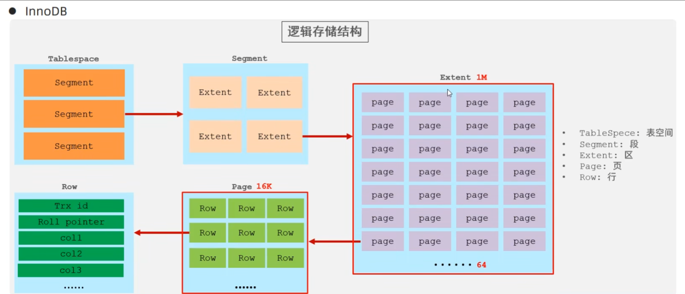

<!--#region
@author 吴钦飞
@email wuqinfei@qq.com
@create date 2025-05-07 22:06:42
@modify date 2025-06-19 21:30:13
@desc [description]
#endregion-->

# MySQL - 进阶

大纲: 

* 存储引擎
* 索引
* SQL 优化
* 视图/存储过程/触发器
* 锁
* InnoDB 核心
* MySQL 管理

## 1. 存储引擎

### 1.1. MySQL 体系结构


(1) 连接层:

最上层是一些客户端和链接服务，包含本地sock 通信和大多数基于客户端/服务端工具实现的类似于 TCP/IP 的通信。
主要完成一些类似于连接处理、授权认证、及相关的安全方案。在该层上引入了线程池的概念，为通过认证安全接入的客户端提供线程。
同样在该层上可以实现基于 SSL 的安全链接。
服务器也会为安全接入的每个客户端验证它所具有的操作权限。

(2) 服务层:

第二层架构主要完成大多数的核心服务功能，如 SQL 接口，并完成缓存的查询，SQL的分析和优化，部分内置函数的执行。
所有跨存储引擎的功能也在这一层实现，如 过程、函数等。在该层，服务器会解析查询并创建相应的内部解析树，并对其完成相应的优化如确定表的查询的顺序，是否利用索引等， 最后生成相应的执行操作。
如果是 select 语句，服务器还会查询内部的缓存，如果缓存空间足够大，这样在解决大量读操作的环境中能够很好的提升系统的性能。

(3) 引擎层:

存储引擎层， 存储引擎真正的负责了MySQL中数据的存储和提取，服务器通过API和存储引擎进行通信。
不同的存储引擎具有不同的功能，这样我们可以根据自己的需要，来选取合适的存储引擎。
数据库中的索引是在存储引擎层实现的。

(4) 存储层:

数据存储层， 主要是将数据(如: redolog、undolog、数据、索引、二进制日志、错误日志、查询 日志、慢查询日志等)存储在文件系统之上，并完成与存储引擎的交互。


其他数据库相比，MySQL 有点与众不同，它的架构可以在多种不同场景中应用并发挥良好作用。
主要体现在存储引擎上，插件式的存储引擎架构，将查询处理和其他的系统任务以及数据的存储提取分离。
这种架构可以根据业务的需求和实际需要选择合适的存储引擎。

### 1.2. 存储引擎介绍

存储引擎就是存储数据、建立索引、更新/查询数据等技术的实现方式 。
存储引擎是基于表的，而不是基于库的，所以存储引擎也可被称为表类型。
我们可以在创建表的时候，来指定选择的存储引擎，如果没有指定将自动选择默认的存储引擎。

(1) 建表时指定存储引擎:

```sql
CREATE TABLE 表名 (
  字段1 字段1类型 [ COMMENT 字段1注释 ] ,
  ......
  字段n 字段n类型 [COMMENT 字段n注释 ]
) ENGINE = INNODB [ COMMENT 表注释 ] ;
```

(2) 查询当前数据库支持的存储引擎:

```sql
show engines;

/*
+--------------------+---------+----------------------------------------------------------------+--------------+------+------------+
| Engine             | Support | Comment                                                        | Transactions | XA   | Savepoints |
+--------------------+---------+----------------------------------------------------------------+--------------+------+------------+
| MEMORY             | YES     | Hash based, stored in memory, useful for temporary tables      | NO           | NO   | NO         |
| MRG_MYISAM         | YES     | Collection of identical MyISAM tables                          | NO           | NO   | NO         |
| CSV                | YES     | CSV storage engine                                             | NO           | NO   | NO         |
| FEDERATED          | NO      | Federated MySQL storage engine                                 | NULL         | NULL | NULL       |
| PERFORMANCE_SCHEMA | YES     | Performance Schema                                             | NO           | NO   | NO         |
| MyISAM             | YES     | MyISAM storage engine                                          | NO           | NO   | NO         |
| InnoDB             | DEFAULT | Supports transactions, row-level locking, and foreign keys     | YES          | YES  | YES        |
| ndbinfo            | NO      | MySQL Cluster system information storage engine                | NULL         | NULL | NULL       |
| BLACKHOLE          | YES     | /dev/null storage engine (anything you write to it disappears) | NO           | NO   | NO         |
| ARCHIVE            | YES     | Archive storage engine                                         | NO           | NO   | NO         |
| ndbcluster         | NO      | Clustered, fault-tolerant tables                               | NULL         | NULL | NULL       |
+--------------------+---------+----------------------------------------------------------------+--------------+------+------------+
11 rows in set (0.00 sec)
*/
```

演示:

```sql
-- 查询建表语句 --- 默认存储引擎: InnoDB
show create table account;

/*
CREATE TABLE `account` (
  `id` int NOT NULL AUTO_INCREMENT COMMENT 'ID',
  `name` varchar(10) DEFAULT NULL COMMENT '姓名',
  `money` double(10,2) DEFAULT NULL COMMENT '余额',
  PRIMARY KEY (`id`)
) ENGINE=InnoDB AUTO_INCREMENT=3 DEFAULT CHARSET=utf8mb4 COLLATE=utf8mb4_0900_ai_ci COMMENT='账户表'
*/


-- 创建表 my_myisam , 并指定 MyISAM 存储引擎 (早起默认引擎)
create table my_myisam(
  id int,
  name varchar(10)
) engine = MyISAM ;


-- 创建表 my_memory , 指定 Memory 存储引擎
create table my_memory(
  id int,
  name varchar(10)
) engine = Memory ;
```

### 1.3. 存储引擎特点

#### 1.3.1. InnoDB

(1) 介绍:

InnoDB 是一种兼顾高可靠性和高性能的通用存储引擎，在 MySQL 5.5 之后，InnoDB是默认的 MySQL 存储引擎。

(2) 特点: 

* DML 操作遵循 ACID 模型，支持**事务**；
* **行级锁**，提高并发访问性能；
* 支持**外键** FOREIGN KEY 约束，保证数据的完整性和正确性

(3) 文件: 

xxx.ibd：

* xxx 代表的是表名
* innoDB引擎的每张表都会对应这样一个表空间文件，存储该表的表结构（frm-早期的 、sdi-新版的）、数据和索引

参数：innodb_file_per_table

```sql
-- 查看 innodb_file_per_table 参数（是否一个表一个文件）
show variables like 'innodb_file_per_table';

/*
+-----------------------+-------+
| Variable_name         | Value |
+-----------------------+-------+
| innodb_file_per_table | ON    |
+-----------------------+-------+
*/
```

如果该参数开启，代表对于 InnoDB 引擎的表，每一张表都对应一个ibd文件。

MySQL的数据存放目录： C:\ProgramData\MySQL\MySQL Server 8.0\Data

```text
C:\ProgramData\MySQL\MySQL Server 8.0\Data
    heima_db2       # 数据库名称
        account.ibd     # 表空间文件
```

ibd文件中不仅存放表结构、数据，还会存放该表对应的索引信息，
该文件是基于二进制存储的，不能直接基于记事本打开，
以使用 mysql 提供的一个指令 ibd2sdi ，通过该指令就可以从 ibd 文件中提取 sdi 信息，
而 sdi 数据字典信息中就包含该表的表结构。

```text
C:\ProgramData\MySQL\MySQL Server 8.0\Data\heima_db2>"C:\Program Files\MySQL\MySQL Server 8.0\bin\ibd2sdi" account.ibd


{
  "type": 1,
  "id": 513,
  "object": {
    "dd_object_type": "Table",
    "dd_object": {
        "name": "account",
        "columns": [
            {
                "name": "id",
                "type": 4,
                "is_nullable": false,
                "is_zerofill": false,
                "is_unsigned": false,
                "is_auto_increment": true,
                "is_virtual": false,
                "hidden": 1,
                "ordinal_position": 1,
                ......
            },
            ......
```

(4) 逻辑存储结构:



表空间: InnoDB 存储引擎逻辑结构的最高层，ibd 文件其实就是表空间文件，在表空间中可以包含多个 Segment 段。

段: 表空间是由各个段组成的， 常见的段有数据段、索引段、回滚段等。 InnoDB 中对于段的管理，都是引擎自身完成，不需要人为对其控制，一个段中包含多个区。

区: 区是表空间的单元结构，每个区的大小为 1M 。 默认情况下， InnoDB 存储引擎页大小为 16K， 即一个区中一共有 64 个连续的页。

页: 页是组成区的最小单元，页也是 InnoDB 存储引擎磁盘管理的最小单元，每个页的大小默认为 16KB 。为了保证页的连续性，InnoDB 存储引擎每次从磁盘申请 4-5 个区。

行: InnoDB 存储引擎是面向行的，也就是说数据是按行进行存放的，在每一行中除了定义表时所指定的字段以外，还包含两个隐藏字段(后面会详细介绍)。

#### 1.3.2. MyISAM

(1) 介绍:

MyISAM 是 MySQL 早期的默认存储引擎

(2) 特点:

* 不支持事务，不支持外键
* 支持表锁，不支持行锁
* 访问速度快

(3) 文件:

* 表名.sdi：存储表结构信息
* 表名.MYD: 存储数据
* 表名.MYI: 存储索引

#### 1.3.3. Memory

(1) 介绍:

Memory 引擎的表数据时存储在内存中的，由于受到硬件问题、或断电问题的影响，只能将这些表作为临时表或缓存使用。

(2) 特点:

* 内存存放
* hash 索引（默认）

(3) 文件:

表名.sdi：存储表结构信息

#### 1.3.4. 区别及特点

| 特点 | InnoDB | MyISAM | Memory |
| - | - | - | - |
| 存储限制 | 64TB | 有 | 有 |
| 事务安全 | 支持 | - | - |
| 锁机制 | 行锁 | 表锁 | 表锁 |
| B+ tree 索引 | 支持 | 支持 | 支持 |
| Hash 索引 | - | - | 支持 |
| 全文索引 | 支持(5.6版本之后) | 支持 | - |
| 空间使用 | 高 | 低 | N/A |
| 内存使用 | 高 | 低 | 中等 |
| 批量插入速度 | 低 | 高 | 高 |
| 支持外键 | 支持 | - | - |

面试题: InnoDB引擎与MyISAM引擎的区别 ?
1. InnoDB 引擎, 支持事务, 而 MyISAM 不支持。
2. InnoDB 引擎, 支持行锁和表锁, 而 MyISAM 仅支持表锁, 不支持行锁。
3. InnoDB 引擎, 支持外键, 而 MyISAM 是不支持的。

主要是上述三点区别，当然也可以从索引结构、存储限制等方面，更加深入的回答，具体参考如下官方文档：
* https://dev.mysql.com/doc/refman/8.0/en/innodb-introduction.html
* https://dev.mysql.com/doc/refman/8.0/en/myisam-storage-engine.html

### 1.4. 存储引擎选择

在选择存储引擎时，应该根据应用系统的特点选择合适的存储引擎。对于复杂的应用系统，还可以根据实际情况选择多种存储引擎进行组合。

InnoDB: 是 Mysql 的默认存储引擎，支持事务、外键。如果应用对事务的完整性有比较高的要求，在并发条件下要求数据的一致性，数据操作除了插入和查询之外，还包含很多的更新、删除操作，那么 InnoDB 存储引擎是比较合适的选择。

MyISAM：如果应用是以读操作和插入操作为主，只有很少的更新和删除操作，并且对事务的完整性、并发性要求不是很高，那么选择这个存储引擎是非常合适的。（被 NoSQL 数据库 MongoDB 替代）

MEMORY：将所有数据保存在内存中，访问速度快，通常用于临时表及缓存。 MEMORY 的缺陷就是对表的大小有限制，太大的表无法缓存在内存中，而且无法保障数据的安全性。（被 Redis 替代）

## 2. 索引

### 2.1. 索引概述

#### 2.1.1. 介绍

索引（index）是帮助MySQL高效获取数据的数据结构(有序)。
在数据之外，数据库系统还维护着满足特定查找算法的数据结构，
这些数据结构以某种方式引用（指向）数据，这样就可以在这些数据结构上实现高级查找算法，这种数据结构就是索引。

#### 2.1.2. 演示

假如我们要执行的 SQL 语句为：`select * from user where age = 45;`

(1) 无索引情况：


在无索引情况下，就需要从第一行开始扫描，一直扫描到最后一行，我们称之为全表扫描，性能很低。

(2) 有索引情况:


如果我们针对于这张表建立了索引，假设索引结构就是二叉树，那么也就意味着，会对 age 这个字段建立一个二叉树的索引结构。

此时我们在进行查询时，只需要扫描三次就可以找到数据了，极大的提高的查询的效率。

备注：这里我们只是假设索引的结构是二叉树，介绍一下索引的大概原理，只是一个示意图，并不是索引的真实结构，索引的真实结构，后面会详细介绍。

#### 2.1.3. 特点

| 优势 | 劣势 |
| - | - |
| 提高数据检索的效率，降低数据库的 IO 成本 | 索引列也是要占用空间的。|
| 通过索引列对数据进行排序，降低数据排序的成本，降低CPU的消耗。|  索引大大提高了查询效率，同时却也降低更新表的速度， 如对表进行 INSERT、UPDATE、DELETE 时，效率降低。|

### 2.2. 索引结构

#### 2.2.1. 概述

MySQL 的索引是在存储引擎层实现的，不同的存储引擎有不同的索引结构，主要包含以下几种：

| 引结构 | 描述 |
| - | - |
| B+Tree索引 | 最常见的索引类型，大部分引擎都支持 B+ 树索引  |
| Hash索引 | 底层数据结构是用哈希表实现的, 只有精确匹配索引列的查询才有效, 不 支持范围查询 |
| R-tree（空间索引）| 空间索引是MyISAM引擎的一个特殊索引类型，主要用于地理空间数据类型，通常使用较少 |
| Full-text(全文索引) | 是一种通过建立倒排索引,快速匹配文档的方式。类似于 Lucene,Solr,ES |

上述是 MySQL 中所支持的所有的索引结构，接下来，我们再来看看不同的存储引擎对于索引结构的支持情况

| 索引 | InnoDB | MyISAM | Memory |
| - | - | - | - |
| B+tree 索引 | 支持 | 支持 | 支持 |
| Hash 索引 | 不支持 | 不支持 | 支持 |
| R-tree 索引 | 不支持 | 支持 | 不支持 |
| Full-text | 5.6版本之后支持 | 支持 | 不支持 |

注意：我们平常所说的索引，如果没有特别指明，都是指 B+ 树结构组织的索引

#### 2.2.2. 二叉树

假如说 MySQL 的索引结构采用二叉树的数据结构，比较理想的结构如下：


如果主键是顺序插入的，则会形成一个单向链表，结构如下：


所以，如果选择二叉树作为索引结构，会存在以下缺点：
* 顺序插入时，会形成一个链表，查询性能大大降低。
* 大数据量情况下，层级较深，检索速度慢。

此时大家可能会想到，我们可以选择红黑树，红黑树是一颗自平衡二叉树，那这样即使是顺序插入数据，最终形成的数据结构也是一颗平衡的二叉树,结构如下:


但是，即使如此，由于红黑树也是一颗二叉树，所以也会存在一个缺点：
* 大数据量情况下，层级较深，检索速度慢。

所以，在 MySQL 的索引结构中，并没有选择二叉树或者红黑树，而选择的是 B+Tree，那么什么是 B+Tree 呢？
在详解 B+Tree 之前，先来介绍一个 B-Tree 。

#### 2.2.3. B-Tree

B-Tree，B树是一种多叉路衡查找树，相对于二叉树，B树每个节点可以有多个分支，即多叉。
以一颗最大度数（max-degree）为5(5阶)的 b-tree 为例，那这个 B树 每个节点最多存储 4 个 key，5 个指针：


树的度数指的是一个节点的子节点个数。

我们可以通过一个数据结构可视化的网站来简单演示一下。 
* https://www.cs.usfca.edu/~galles/visualization/BTree.html

特点：
* 5 阶的 B树，每一个节点最多存储 4 个key，对应 5 个指针。
* 一旦节点存储的 key 数量到达 5，就会裂变，中间元素向上分裂。
* 在 B树 中，非叶子节点和叶子节点都会存放数据