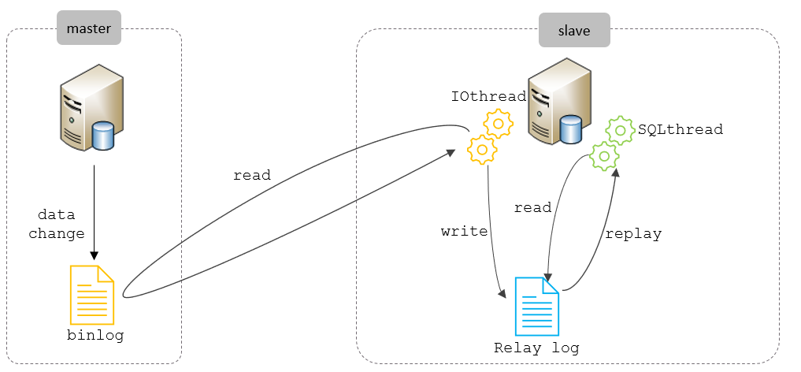

<!--#region
@author 吴钦飞
@email wuqinfei@qq.com
@create date 2025-05-07 22:06:47
@modify date 2025-07-07 22:02:33
@desc [description]
#endregion-->

# MySQL - 运维

大纲: 

* 日志
* 主从复制
* 分库分表
* 读写分离

## 1. 日志

### 1.1. 错误日志

错误日志是 MySQL 中最重要的日志之一，它记录了当 mysqld 启动和停止时，以及服务器在运行过程中发生任何严重错误时的相关信息。当数据库出现任何故障导致无法正常使用时，建议首先查看此日志。

该日志是默认开启的，默认存放目录 `/var/log/`，默认的日志文件名为 mysqld.log 。

查看日志位置：

```sql
show variables like '%log_error%';
/*
+----------------------------+----------------------------------------+
| Variable_name              | Value                                  |
+----------------------------+----------------------------------------+
| log_error                  | .\WIN-52GQ01H2BNI.err                  |
+----------------------------+----------------------------------------+
*/

-- C:\ProgramData\MySQL\MySQL Server 8.0\Data\WIN-52GQ01H2BNI.err
```

### 1.2. 二进制日志

#### 1.2.1. 介绍

二进制日志（BINLOG）记录了所有的 DDL（数据定义语言）语句和 DML（数据操纵语言）语句，但不包括数据查询（SELECT、SHOW）语句。

作用：

1. 灾难时的数据恢复；
2. MySQL 的主从复制。

在 MySQL8 版本中，默认二进制日志是开启着的，涉及到的参数如下：

```sql
show variables like '%log_bin%';

/*
+---------------------------------+------------------------------------------------------------------+
| Variable_name                   | Value                                                            |
+---------------------------------+------------------------------------------------------------------+
| log_bin                         | ON                                                               |
| log_bin_basename                | C:\ProgramData\MySQL\MySQL Server 8.0\Data\WUQINFEI-PC-bin       |
| log_bin_index                   | C:\ProgramData\MySQL\MySQL Server 8.0\Data\WUQINFEI-PC-bin.index |
| log_bin_trust_function_creators | OFF                                                              |
| log_bin_use_v1_row_events       | OFF                                                              |
| sql_log_bin                     | ON                                                               |
+---------------------------------+------------------------------------------------------------------+
*/
```

参数说明：

* log_bin_basename: 当前数据库服务器的 binlog 日志的基础名称(前缀)，具体的 binlog 文件名为 `log_bin_basename + 编号`
* log_bin_index：binlog 的索引文件，里面记录了当前服务器关联的b inlog 文件有哪些。

演示:

```text
# 管理员身份打开 CMD
C:\Windows\System32>cd "C:\ProgramData\MySQL\MySQL Server 8.0\Data"

C:\ProgramData\MySQL\MySQL Server 8.0\Data>dir

2025/07/05  13:26               450 WUQINFEI-PC-bin.index
2025/06/05  16:40               180 WUQINFEI-PC-bin.000023
2025/06/06  12:03               180 WUQINFEI-PC-bin.000024
2025/06/06  18:03               180 WUQINFEI-PC-bin.000025
......

# 查看 索引文件内容
C:\ProgramData\MySQL\MySQL Server 8.0\Data>type WUQINFEI-PC-bin.index

.\WUQINFEI-PC-bin.000023
.\WUQINFEI-PC-bin.000024
.\WUQINFEI-PC-bin.000025
......
```

#### 1.2.2. 格式

MySQL 服务器中提供了多种格式来记录二进制日志，具体格式及特点如下：

| 日志格式 | 含义 |
| - | - |
| STATEMENT | 基于 SQL 语句的日志记录，记录的是SQL语句，对数据进行修改的 SQL 都会记录在日志文件中。 |
| ROW | 基于行的日志记录，记录的是每一行的数据变更。（默认）|
| MIXED | 混合了 STATEMENT 和 ROW 两种格式，默认采用 STATEMENT，在某些特殊情况下会自动切换为ROW进行记录。|

查看格式:

```sql
show variables like '%binlog_format%';
/*
+---------------+-------+
| Variable_name | Value |
+---------------+-------+
| binlog_format | ROW   |
+---------------+-------+
*/
```

可以在配置文件 `C:\ProgramData\MySQL\MySQL Server 8.0\my.ini` 中修改

#### 1.2.3. 查看

由于日志是以二进制方式存储的，不能直接读取，需要通过二进制日志查询工具 mysqlbinlog 来查看，具体语法：

```text
mysqlbinlog [ 参数选项 ] logfilename

参数选项：

  -d    # 指定数据库名称，只列出指定的数据库相关操作。
  -o    # 忽略掉日志中的前n行命令。
  -v    # 将行事件(数据变更)重构为 SQL 语句
  -vv   # 将行事件(数据变更)重构为 SQL 语句，并输出注释信息
```

#### 1.2.4. 删除

对于比较繁忙的业务系统，每天生成的 binlog 数据巨大，如果长时间不清除，将会占用大量磁盘空间。可以通过以下几种方式清理日志：

1. `reset master`
   * 删除全部 binlog 日志，删除之后，日志编号，将从 binlog.000001 重新开始

2. `purge master logs to 'binlog.*' `
   * 删除 `*` 编号之前的所有日志

3. `purge master logs before 'yyyy-mm-dd hh24:mi:ss' `
   * 删除日志为 "yyyy-mm-dd hh24:mi:ss" 之前产生的所有日志


也可以在 mysql 的配置文件中配置二进制日志的过期时间，设置了之后，二进制日志过期会自动删除。

```sql
show variables like '%binlog_expire_logs_seconds%';
/*
+----------------------------+---------+
| Variable_name              | Value   |
+----------------------------+---------+
| binlog_expire_logs_seconds | 2592000 |
+----------------------------+---------+
*/

-- 2592000 / (3600 * 24) = 30 (天)
```

### 1.3. 查询日志

查询日志中记录了客户端的所有操作语句，而二进制日志不包含查询数据的 SQL 语句。
默认情况下， 查询日志是 未开启 的。

```sql
show variables like '%general%';
/*
+------------------+-----------------+
| Variable_name    | Value           |
+------------------+-----------------+
| general_log      | OFF             |
| general_log_file | WUQINFEI-PC.log |
+------------------+-----------------+
*/
```

如果需要开启查询日志，可以修改MySQL的配置文件 `/etc/my.cnf`(`C:\ProgramData\MySQL\MySQL Server 8.0\my.ini`) 文件，添加如下内容：

```shell
# 该选项用来开启查询日志 ， 可选值 ： 0 或者 1 ； 0 代表关闭， 1 代表开启
general_log=1

# my.ini 使用如下参数
general-log=1


# 设置日志的文件名 ， 如果没有指定， 默认的文件名
general_log_file=mysql_query.log
```

开启了查询日志之后，在 MySQL 的数据存放目录，也就是 `/var/lib/mysql/` 目录下就会出现 mysql_query.log 文件。
之后所有的客户端的增删改查操作都会记录在该日志文件之中，长时间运行后，该日志文件将会非常大

### 1.4. 慢查询日志

慢查询日志记录了所有执行时间超过参数 `long_query_time` 设置值并且扫描记录数不小于 `min_examined_row_limit` 的所有的 SQL 语句的日志，默认未开启。

`long_query_time` 默认为 10 秒，最小为 0， 精度可以到微秒。

如果需要开启慢查询日志，需要在 MySQL 的配置文件 `/etc/my.cnf` 中配置如下参数：

```shell
# 慢查询日志
slow_query_log=1

# 执行时间参数
long_query_time=2
```

默认情况下，不会记录管理语句，也不会记录不使用索引进行查找的查询。
可以使用 `log_slow_admin_statements` 和 更改此行为 `log_queries_not_using_indexes` ，如下所述。

```shell
# 记录执行较慢的管理语句
log_slow_admin_statements=1

# 记录执行较慢的未使用索引的语句
log_queries_not_using_indexes=1
```

## 2. 主从复制

### 2.1. 概述

主从复制是指将主数据库的 DDL 和 DML 操作通过二进制日志传到从库服务器中，然后在从库上对这些日志重新执行（也叫重做），从而使得从库和主库的数据保持同步。

MySQL 支持一台主库同时向多台从库进行复制， 从库同时也可以作为其他从服务器的主库，实现链状复制。

```text
主库(Master) --> 从库(Slave)
```

MySQL 复制的优点主要包含以下三个方面：

* 主库出现问题，可以快速切换到从库提供服务。
* 实现读写分离，降低主库的访问压力。
* 可以在从库中执行备份，以避免备份期间影响主库服务。

### 2.2. 原理

MySQL 主从复制的核心就是 二进制日志，具体的过程如下：



从上图来看，复制分成三步：

1. Master 主库在事务提交时，会把数据变更记录在二进制日志文件 Binlog 中。
2. 从库读取主库的二进制日志文件 Binlog ，写入到从库的中继日志 Relay Log 。
3. slave 重做中继日志中的事件，将改变反映它自己的数据。

### 2.3. 搭建

#### 2.3.1. 准备

主服务器: (master)

* win10
* 192.168.1.105


从服务器: (slave)

* win10
* Administrator / 123456
* 192.168.17.130
* 关闭防火墙


注意:

* 如果主库里有数据，则需要先将主库的数据导入从库

#### 2.3.2. 主库配置

>C:\ProgramData\MySQL\MySQL Server 8.0\my.ini

(1) 修改配置文件

```shell
# mysql 服务ID，保证整个集群环境中唯一
# 取值范围：1 ~ 2^32 − 1，默认为 1
server-id=1


# 是否只读
# 1 代表只读, 0 代表读写
read-only=0


# 忽略的数据, 指不需要同步的数据库
# binlog-ignore-db=my_db_1


# 指定同步的数据库
# binlog-do-db=my_db_2
```

(2) 重启 MySQL 服务

```shell
net stop MySQL80

net start MySQL80
```

(3) 创建远程连接的账号，并授予主从复制权限

```sql
-- 创建 my_slave_1 用户，并设置密码 123456 ，该用户可在任意主机连接该 MySQL 服务
CREATE USER 'my_slave_1'@'%' IDENTIFIED WITH mysql_native_password BY '123456';

-- 为 'my_slave_1'@'%' 用户分配主从复制权限
GRANT REPLICATION SLAVE ON *.* TO 'my_slave_1'@'%';
```

(4) 从服务器，测试是否可以登录

```text
C:\Users\Administrator> mysql -h192.168.1.105 -umy_slave_1 -p123456

mysql> show databases;

+--------------------+
| Database           |
+--------------------+
| information_schema |
| performance_schema |
+--------------------+
```

(5) 通过指令，查看二进制日志坐标

```sql
show master status ;
+----------------------------+----------+--------------+------------------+-------------------+
| File                       | Position | Binlog_Do_DB | Binlog_Ignore_DB | Executed_Gtid_Set |
+----------------------------+----------+--------------+------------------+-------------------+
| WIN-52GQ01H2BNI-bin.000155 |      672 |              |                  |                   |
+----------------------------+----------+--------------+------------------+-------------------+
```

字段含义说明：

* file : 从哪个日志文件开始推送日志文件
* position ： 从哪个位置开始推送日志
* binlog_ignore_db : 指定不需要同步的数据库

#### 2.3.3. 从库配置

>C:\ProgramData\MySQL\MySQL Server 8.0\my.ini

(1) 修改配置文件

```shell
# mysql 服务ID，保证整个集群环境中唯一
# 取值范围：1 ~ 2^32 − 1，默认为 1
# 和主库不一样即可
server-id=2


# 是否只读
# 1 代表只读, 0 代表读写
# 针对普通用户，超级管理员需要设置 super-read-only=1
read-only=1
```

(2) 重启 MySQL 服务

```shell
net stop MySQL80

net start MySQL80
```

(3) 登录 mysql，设置主库配置

```sql
CHANGE REPLICATION SOURCE TO 
   SOURCE_HOST='192.168.1.105', 
   SOURCE_USER='my_slave_1',
   SOURCE_PASSWORD='123456', 
   SOURCE_LOG_FILE='WIN-52GQ01H2BNI-bin.000155',
   SOURCE_LOG_POS=672
;

-- 上述是 8.0.23 中的语法。如果 mysql 是 8.0.23 之前的版本，执行如下 SQL：
CHANGE MASTER TO 
   MASTER_HOST='192.168.1.105', 
   MASTER_USER='my_slave_1',
   MASTER_PASSWORD='123456', 
   MASTER_LOG_FILE='WIN-52GQ01H2BNI-bin.000155',
   MASTER_LOG_POS=672
;

-- 8.0.23 之后的版本是 兼容 旧语法的
```

| 参数名 | 含义 | 8.0.23 之前 |
| - | - | - |
| SOURCE_HOST | 主库 IP 地址 | MASTER_HOST |
| SOURCE_USER | 连接主库的用户名 | MASTER_USER |
| SOURCE_PASSWORD | 连接主库的密码 | MASTER_PASSWORD |
| SOURCE_LOG_FILE | binlog 日志文件名 | MASTER_LOG_FILE |
| SOURCE_LOG_POS | binlog 日志文件位置 | MASTER_LOG_POS |


(4) 开启同步操作

```sql
-- 8.0.22 之前
-- start slave ; 

-- 8.0.22 之后
start replica ; 

```

(5) 查看主从同步状态

```sql
-- 8.0.22之前
-- show slave status ; 

-- 8.0.22之后
show replica status \G; 

/*
             Replica_IO_State: Waiting for source to send event
                  Source_Host: 192.168.1.105
                  Source_User: my_slave_1
                  Source_Port: 3306
                Connect_Retry: 60
              Source_Log_File: WIN-52GQ01H2BNI-bin.000156
          Read_Source_Log_Pos: 157
               Relay_Log_File: DESKTOP-NJMQ8RL-relay-bin.000005
                Relay_Log_Pos: 393
        Relay_Source_Log_File: WIN-52GQ01H2BNI-bin.000156

# 这两个为 YES 说明启动成功
           Replica_IO_Running: Yes
          Replica_SQL_Running: Yes

# 如果失败，下面两个会显示错误详情
                Last_IO_Error:
               Last_SQL_Error:
*/
```

#### 2.3.4. 测试

(1) 在主库 192.168.1.105 上创建数据库、表，并插入数据

```sql
create database db01;

use db01;

create table tb_user(
   id int(11) primary key not null auto_increment,
   name varchar(50) not null,
   sex varchar(1)
) engine=innodb default charset=utf8mb4;

insert into tb_user(id,name,sex) values 
   (null,'Tom', '1'),
   (null,'Trigger','0'),
   (null,'Dawn','1')
;

select * from tb_user;
```

(2) 在从库 192.168.17.130 中查询数据，验证主从是否同步

```sql
show databases;

use db01;

select * from tb_user;
```