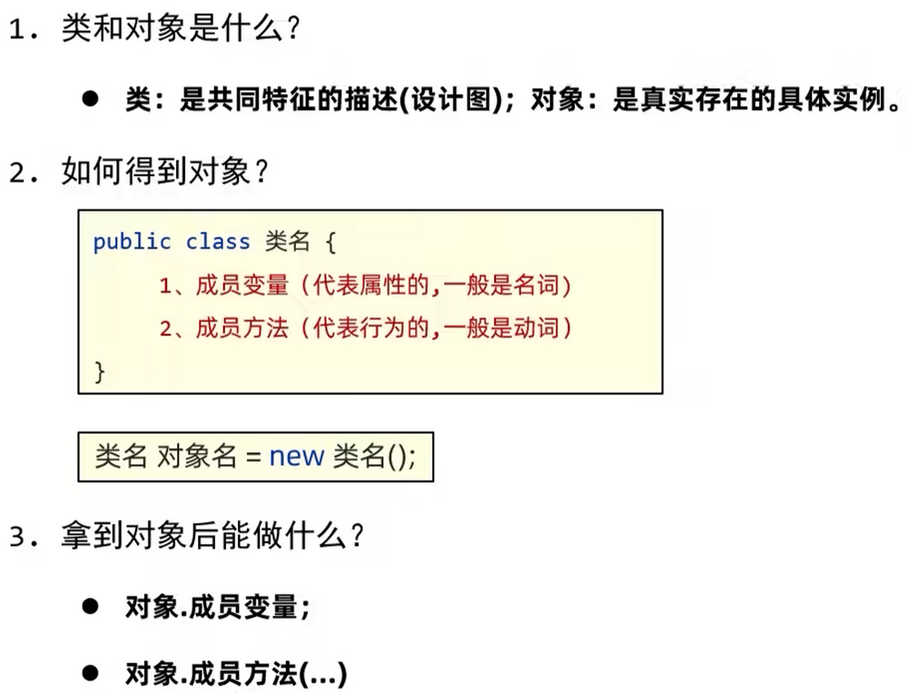
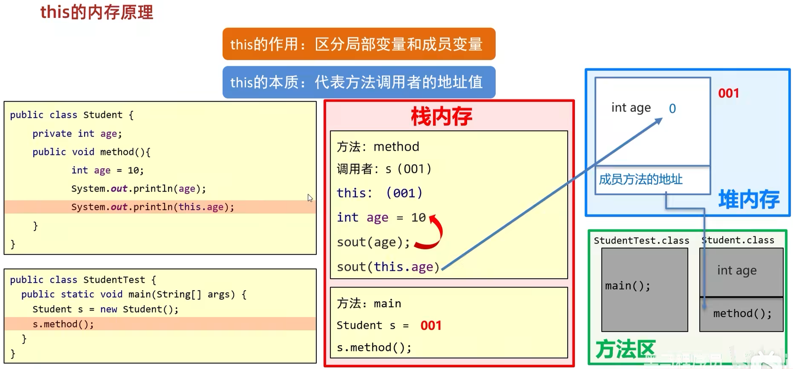
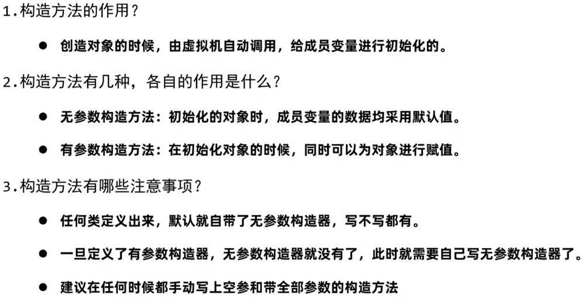
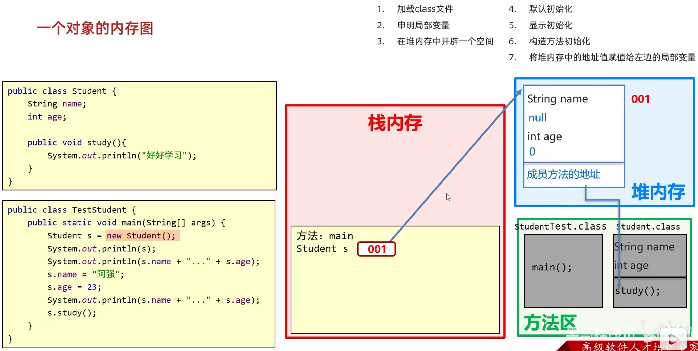
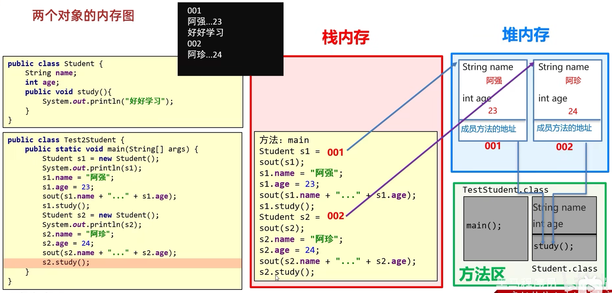
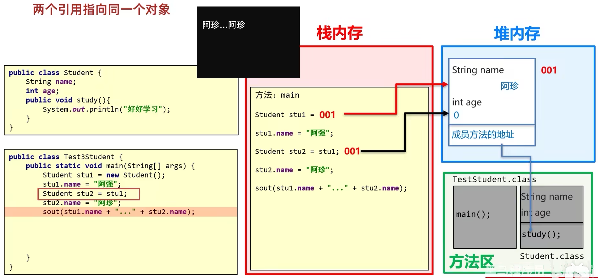
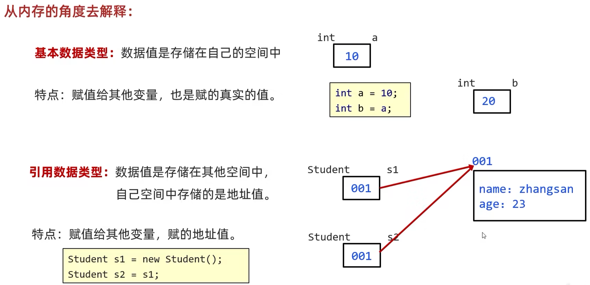
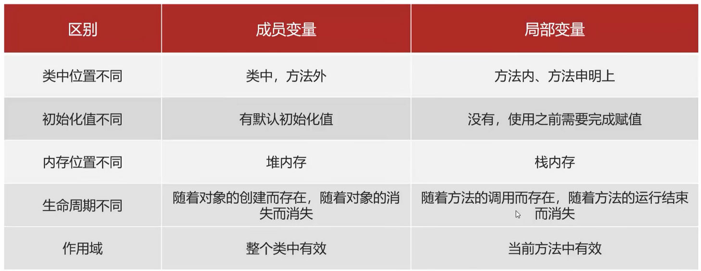

# 类和对象

[[toc]]

## 1. 类和对象

客观存在的事物皆为对象 ，所以我们也常常说万物皆对象。

类的理解：

* 类是对现实生活中一类具有共同属性和行为的事物的抽象
* 类是对象的数据类型，类是具有相同属性和行为的一组对象的集合
* 简单理解：类就是对现实事物的一种描述

类的组成：

* 属性：指事物的特征，例如：手机事物（品牌，价格，尺寸）
* 行为：指事物能执行的操作，例如：手机事物（打电话，发短信）

类和对象的关系：

* 类：类是对现实生活中一类具有共同属性和行为的事物的抽象
* 对象：是能够看得到摸的着的真实存在的实体
* 简单理解：**类是对事物的一种描述，对象则为具体存在的事物**

### 1.1. 类的定义

类的组成是由属性和行为两部分组成：

* 属性：在类中通过成员变量来体现（类中方法外的变量）
* 行为：在类中通过成员方法来体现（和前面的方法相比去掉static关键字即可）

类的定义步骤：

1. 定义类
2. 编写类的成员变量
3. 编写类的成员方法

```text
public class 类名 {
    // 成员变量
    变量1的数据类型 变量1;
    变量2的数据类型 变量2;
    …
    // 成员方法
    方法1;
    方法2;    
}
```

示例代码：

```java
/*
    手机类：
        类名：
        手机(Phone)

        成员变量：
        品牌(brand)
        价格(price)

        成员方法：
        打电话(call)
        发短信(sendMessage)
 */
public class Phone {
    //成员变量
    String brand;
    int price;

    //成员方法
    public void call() {
        System.out.println("打电话");
    }

    public void sendMessage() {
        System.out.println("发短信");
    }
}

```

### 1.2. 对象的使用

创建对象的格式：

`类名 对象名 = new 类名();`

调用成员的格式：

* 对象名.成员变量
* 对象名.成员方法();

示例代码：

```java
/*
    创建对象
        格式：类名 对象名 = new 类名();
        范例：Phone p = new Phone();

    使用对象
        1：使用成员变量
            格式：对象名.变量名
            范例：p.brand
        2：使用成员方法
            格式：对象名.方法名()
            范例：p.call()
 */
public class PhoneDemo {
    public static void main(String[] args) {
        //创建对象
        Phone p = new Phone();

        //使用成员变量
        System.out.println(p.brand);
        System.out.println(p.price);

        p.brand = "小米";
        p.price = 2999;

        System.out.println(p.brand);
        System.out.println(p.price);

        //使用成员方法
        p.call();
        p.sendMessage();
    }
}
```

### 1.3. 总结



### 1.4. 学生对象-练习

需求：

    首先定义一个学生类，
    然后定义一个学生测试类，
    在学生测试类中通过对象完成成员变量和成员方法的使用

分析：

    成员变量：姓名，年龄…
    成员方法：学习，做作业…

示例代码：

```java
public class Student {
    //成员变量
    String name;
    int age;

    //成员方法
    public void study() {
        System.out.println("好好学习，天天向上");
    }

    public void doHomework() {
        System.out.println("键盘敲烂，月薪过万");
    }
}
/*
    学生测试类
 */
public class StudentDemo {
    public static void main(String[] args) {
        //创建对象
        Student s = new Student();

        //使用对象
        System.out.println(s.name + "," + s.age);

        s.name = "林青霞";
        s.age = 30;

        System.out.println(s.name + "," + s.age);

        s.study();
        s.doHomework();
    }
}
```


## 2. 封装

### 2.1. 封装思想

封装概述：

* 是面向对象三大特征之一（封装，继承，多态）
* 对象代表什么，就得封装对应的数据，并提供数据对应的行为 

比如：

* 人画圆
  * 涉及 “人”类 和 “圆”类
  * “画圆” 这个行为是属于 “圆”类 的

* 人关门
  * “关门” 这个行为是属于 “门”类 的


封装代码实现：

* 将类的某些信息隐藏在类内部，不允许外部程序直接访问，而是通过该类提供的方法来实现对隐藏信息的操作和访问
* 成员变量 `private`，提供对应的 `getXxx()`/`setXxx()` 方法

### 2.2. private 关键字

`private` 是一个修饰符，可以用来修饰成员（成员变量，成员方法）

被 `private` 修饰的成员，只能在本类进行访问，针对 `private` 修饰的成员变量，如果需要被其他类使用，提供相应的操作

* 提供“get变量名()”方法，用于获取成员变量的值，方法用 `public` 修饰
* 提供“set变量名(参数)”方法，用于设置成员变量的值，方法用 `public` 修饰

示例代码：

```java
/*
    学生类
 */
class Student {
    //成员变量
    String name;
    private int age;

    //提供get/set方法
    public void setAge(int a) {
        if(a<0 || a>120) {
            System.out.println("你给的年龄有误");
        } else {
            age = a;
        }
    }

    public int getAge() {
        return age;
    }

    //成员方法
    public void show() {
        System.out.println(name + "," + age);
    }
}
/*
    学生测试类
 */
public class StudentDemo {
    public static void main(String[] args) {
        //创建对象
        Student s = new Student();
        //给成员变量赋值
        s.name = "林青霞";
        s.setAge(30);
        //调用show方法
        s.show();
    }
}
```

### 2.3. private 的使用

需求：

    定义标准的学生类，
    要求 name 和 age 使用 private 修饰，
    并提供 set和get方法 以及便于显示数据的 show 方法，
    测试类中创建对象并使用，最终控制台输出     林青霞，30 

示例代码：

```java
/*
    学生类
 */
class Student {
    //成员变量
    private String name;
    private int age;

    //get/set方法
    public void setName(String n) {
        name = n;
    }

    public String getName() {
        return name;
    }

    public void setAge(int a) {
        age = a;
    }

    public int getAge() {
        return age;
    }

    public void show() {
        System.out.println(name + "," + age);
    }
}
/*
    学生测试类
 */
public class StudentDemo {
    public static void main(String[] args) {
        //创建对象
        Student s = new Student();

        //使用set方法给成员变量赋值
        s.setName("林青霞");
        s.setAge(30);

        s.show();

        //使用get方法获取成员变量的值
        System.out.println(s.getName() + "---" + s.getAge());
        System.out.println(s.getName() + "," + s.getAge());

    }
}
```

## 3. this 关键字

### 3.1. 概念

`this` 修饰的变量用于指代成员变量，其主要作用是 区分局部变量和成员变量：

* 同名，`name` 为局部变量， `this.name` 为成员变量
* 不同名，`name` 和`this.name` 都为成员变量

```java
public class Student {
    private String name;
    private int age;

    public void setName(String name) {
        this.name = name;
    }

    public String getName() {
        return name;
    }

    public void setAge(int age) {
        this.age = age;
    }

    public int getAge() {
        return age;
    }

    public void show() {
        System.out.println(name + "," + age);
    }
}
```

### 3.2. 内存原理



## 4. 构造方法

### 4.1. 构造方法概述

（`new` 关键字）创建对象的时候，虚拟机会自动调用构造方法，给成员变量进行初始化。

也就是说，对象是 `new` 创建的，构造方法只是对新创建的对象进行初始化。

格式：

```text
public class 类名 {

    修饰符 类名( 参数 ) {
  
    }

}
```

特点：

* 方法名与类名相同
* 没有返回值类型（void 都没有）
* 没有返回语句（不能写 return 语句）


功能：主要是完成对象数据的初始化

示例代码：

```java
class Student {
    private String name;
    private int age;

    //构造方法
    public Student() {
        System.out.println("无参构造方法");
    }

    public void show() {
        System.out.println(name + "," + age);
    }
}
/*
    测试类
 */
public class StudentDemo {
    public static void main(String[] args) {
        //创建对象
        Student s = new Student();
        s.show();
    }
}
```

### 4.2. 构造方法的注意事项

构造方法的创建：

* 如果没有定义构造方法，系统将给出一个默认的无参数构造方法
* 如果定义了构造方法，系统将不再提供默认的构造方法

构造方法的重载：

* 如果自定义了带参构造方法，还要使用无参数构造方法，就必须再写一个无参数构造方法

推荐的使用方式：

* 无论是否使用，都手工书写无参数构造方法

重要功能：

* 可以使用带参构造，为成员变量进行初始化

示例代码：

```java
/*
    学生类
 */
class Student {
    private String name;
    private int age;

    public Student() {}

    public Student(String name) {
        this.name = name;
    }

    public Student(int age) {
        this.age = age;
    }

    public Student(String name,int age) {
        this.name = name;
        this.age = age;
    }

    public void show() {
        System.out.println(name + "," + age);
    }
}
/*
    测试类
 */
public class StudentDemo {
    public static void main(String[] args) {
        //创建对象
        Student s1 = new Student();
        s1.show();

        //public Student(String name)
        Student s2 = new Student("林青霞");
        s2.show();

        //public Student(int age)
        Student s3 = new Student(30);
        s3.show();

        //public Student(String name,int age)
        Student s4 = new Student("林青霞",30);
        s4.show();
    }
}
```

### 4.3. 总结



### 4.4. 练习

需求：

    定义标准学生类，要求分别使用空参和有参构造方法创建对象，
    空参创建的对象通过setXxx赋值，
    有参创建的对象直接赋值，并通过show方法展示数据。 

示例代码：

```java
class Student {
    //成员变量
    private String name;
    private int age;

    //构造方法
    public Student() {
    }

    public Student(String name, int age) {
        this.name = name;
        this.age = age;
    }

    //成员方法
    public void setName(String name) {
        this.name = name;
    }

    public String getName() {
        return name;
    }

    public void setAge(int age) {
        this.age = age;
    }

    public int getAge() {
        return age;
    }

    public void show() {
        System.out.println(name + "," + age);
    }
}
/*
    创建对象并为其成员变量赋值的两种方式
        1:无参构造方法创建对象后使用setXxx()赋值
        2:使用带参构造方法直接创建带有属性值的对象
*/
public class StudentDemo {
    public static void main(String[] args) {
        //无参构造方法创建对象后使用setXxx()赋值
        Student s1 = new Student();
        s1.setName("林青霞");
        s1.setAge(30);
        s1.show();

        //使用带参构造方法直接创建带有属性值的对象
        Student s2 = new Student("林青霞",30);
        s2.show();
    }
}
```

## 5. 标准 JavaBean

### 5.1. 原则

1. 类名需要见名知意

2. 成员变量使用 `private` 修饰

3. 提供至少两个构造方法： 

    * 无参构造方法
    * 带全部参数的构造方法

4. 成员方法

   * 提供每一个成员变量对应的 setXxx() / getXxx()
   * 如果还有其他行为，也需要写上


### 5.2. 练习


```java
public class User {
    //1.私有化全部的成员变量
    //2.空参构造
    //3.带全部参数的构造
    //4.针对于每一个私有化的成员变量都要提供其对应的get和set方法
    //5.如果当前事物还有其他行为，那么也要写出来，比如学生的吃饭，睡觉等行为

    private String username;//用户名
    private String password;//密码
    private String email;//邮箱
    private char gender;//性别
    private int age;//年龄

    //空参构造方法
    public User() {
    }

    //带全部参数的构造
    public User(String username, String password, String email, char gender, int age) {
        this.username = username;
        this.password = password;
        this.email = email;
        this.gender = gender;
        this.age = age;
    }

    //get和set

    public String getUsername() {
        return username;
    }

    public void setUsername(String username) {
        this.username = username;
    }

    public String getPassword() {
        return password;
    }

    public void setPassword(String password) {
        this.password = password;
    }

    public String getEmail() {
        return email;
    }

    public void setEmail(String email) {
        this.email = email;
    }

    public char getGender() {
        return gender;
    }

    public void setGender(char gender) {
        this.gender = gender;
    }

    public int getAge() {
        return age;
    }

    public void setAge(int age) {
        this.age = age;
    }

    public void eat(){
        System.out.println(username + "在吃饭");
    }
}

public class Test {
    public static void main(String[] args) {
        //写一个标准的javabean类
        //咱们在课后只要能把这个标准的javabean能自己写出来，那么就表示今天的知识点就ok了


        //利用空参构造创建对象
        User u1 = new User();
        //如果利用空参创建对象，还想赋值只能用set方法赋值
        u1.setUsername("zhangsan");
        u1.setPassword("1234qwer");
        u1.setEmail("itheima@itcast.cn");
        u1.setGender('男');
        u1.setAge(23);
        //获取属性的值并打印
        System.out.println(u1.getUsername() + ", " + u1.getPassword()
                + ", " + u1.getEmail() + ", " + u1.getGender() + ", " + u1.getAge());
        u1.eat();

        System.out.println("=============================");

        //简单的办法
        //利用带全部参数的构造来创建对象
        //快捷键:ctrl + p
        User u2 = new User("lisi","12345678","lisi@itcast.cn",'女',24);
        System.out.println(u2.getUsername() + ", " + u2.getPassword()
                + ", " + u2.getEmail() + ", " + u2.getGender() + ", " + u2.getAge());
        u2.eat();
    }
}
```

## 6. 对象内存图


### 6.1. 单个对象内存图

```java
// Student.java
public class Student {
    String name = "";
}

// TestStudent.java
public class TestStudent {
    public static void main(String[] args) {
        Student s = new Student();
    }
}
```

`Student s = new Student();` :

1. 【方法区】加载 Student.class 文件
2. 【栈内存】申明局部变量 `Student s`
3. 【堆内存】开辟一个空间
4. 默认初始化： `s = null`;
5. 显式初始化： `s = ""`
6. 构造方法初始化
7. 将堆内存中的地址值赋值给局部变量 `s`

图示：



### 6.2. 多个对象内存图

图示：



总结：

多个对象在堆内存中，都有不同的内存划分，成员变量存储在各自的内存区域中，成员方法多个对象共用的一份

### 6.3. 两个引用指向同一个对象



## 7. 基本数据类型和引用数据类型



## 8. 成员变量和局部变量的区别


