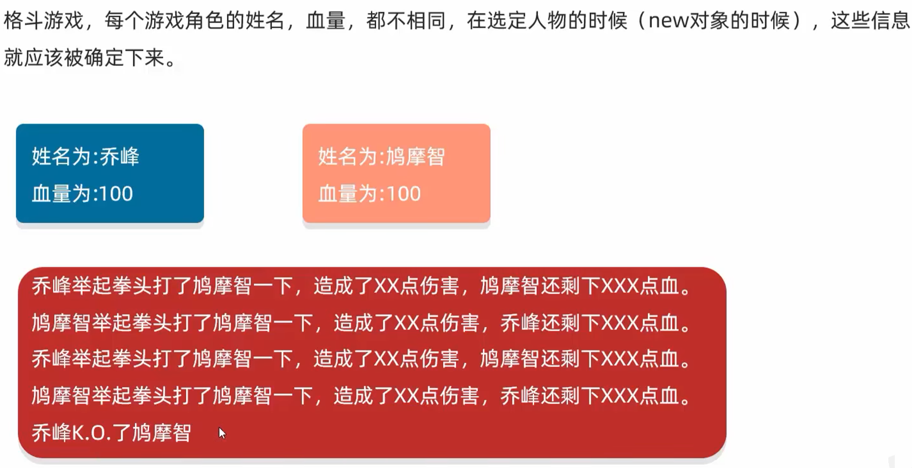

# 面向对象综合练习

[[toc]]

## 键盘录入

方式 1：

* nextInt(): 整数
* nextDouble(): 小数
* next(): 字符串

方式 2：

* nextLine(): 字符串

注意：

* 方式 1 : 遇到空格、制表符、回车就停止接收，这些符号后面的数据会作为下一个 `nextXx` 的输入
* 方式 2 : 遇到回车才停止接收
* 上面两种方式不建议混用

## 文字版格斗游戏

需求：

代码：

<<< @/docs/back-end/java/basic/codes/day10/src/game/Role.java

测试：

<<< @/docs/back-end/java/basic/codes/day10/src/game/GameTest.java

## 对象数组练习

## 购物车