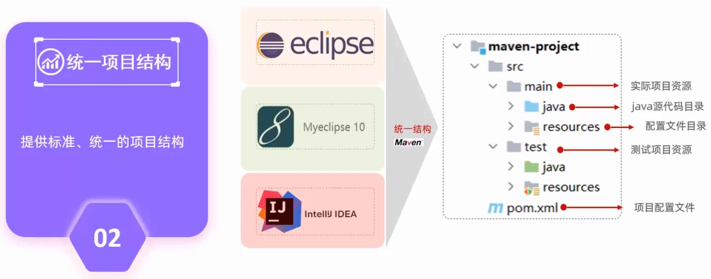

<!--#region
@author 吴钦飞
@email wuqinfei@qq.com
@create date 2023-10-21 09:28:57
@modify date 2023-10-21 16:45:25
@desc [description]
#endregion-->

# maven 快速入门

目录：

* 概述
* IDEA 集成 Maven
* 依赖管理

## 1. 概述

### 1.1. 介绍

说明：

* Maven 是 apache（开源软件基金会） 旗下的开源项目
* Maven 是一款管理和构建 Java 项目的工具
* 基于 POM（项目对象模型）的概念，通过描述信息来管理项目的构建
* 

作用：

* 依赖管理：

    * 管理项目依赖的 jar 包，避免冲突

* 统一项目结构：

    * 提供标准、统一的项目结构
    * eclipse、MyEclipse、Idea 创建的 Maven 项目都可以互相导入
    * 

* 项目构建：

    * 自动化项目构建方式
    * 

官网：

* [https://maven.apache.org/](https://maven.apache.org/)

### 1.2. 安装

1. 下载并解压 [apache-maven-3.5.4-bin.zip](https://archive.apache.org/dist/maven/maven-3/3.5.4/binaries/apache-maven-3.5.4-bin.zip)

    * W:/maven/apache-maven-3.5.4

2. 配置本地仓库

    * W:\maven\apache-maven-3.5.4\conf\settings.xml

    ```xml
    <settings>
      <!-- ... -->
      <localRepository>w:/maven/repository</localRepository>
    </settings>
    ```

3. 配置阿里云私服


    * W:\maven\apache-maven-3.5.4\conf\settings.xml

    ```xml
    <settings>

      <mirrors>
        <mirror>
          <id>alimaven</id>
          <name>aliyun maven</name>
          <url>https://maven.aliyun.com/repository/public</url>
          <mirrorOf>central</mirrorOf>
        </mirror>
      </mirrors>

    </settings>
    ```
  
  4. 环境变量

      * MAVEN_HOME=W:\maven\apache-maven-3.5.4
      * path=;%MAVEN_HOME%\bin; ...

  5. 测试

      * 注意： 配置的系统变量，需要重启后才生效

      ```shell
      mvn -v
      ```

## 2. IDEA 集成 Maven

### 2.1. 配置 Maven 环境

IDEA 全局配置：

* 针对所有项目
* 

环境：

1. Maven 的 安装目录、配置文件、本地仓库

    * Build,Execution,Deployment > Build Tools > Maven

    ```text
    Maven home path:      W:/maven/apache-maven-3.5.4

    User settings file:   W:\maven\apache-maven-3.5.4\conf\settings.xml

    Local repository:     W:\maven\repository
    ```

2. Maven 关联的 JRE 版本

    * Build,Execution,Deployment > Build Tools > Maven > Runner

    ```text
    JRE: jdk11
    ```

3. 编译器的字节码版本（Java 编译器的版本）

    * Build,Execution,Deployment > Compiler > Java Compiler

    ```text
    Project bytecode version: 11
    ```

4. 项目的 JDK 版本

### 2.2. maven 坐标

坐标：

* Maven 中的坐标是资源的唯一标识，通过该坐标可以唯一定位资源位置
* 使用坐标来定义项目或引入依赖

坐标组成：

* groupId: 组织名称， eg. `org.example`
* artifactId: 项目名称
* version: 项目版本号

## 3. 依赖管理

### 3.1. 依赖配置

步骤：

1. 在 [https://mvnrepository.com/](https://mvnrepository.com/) 中搜索对应依赖的坐标

2. 粘贴坐标

    ```xml
    <project>
        <!-- ...... -->

        <dependencies>
            <dependency>
                <groupId>ch.qos.logback</groupId>
                <artifactId>logback-classic</artifactId>
                <version>1.2.9</version>
            </dependency>
        </dependencies>
    </project>
    ```

### 3.2. 依赖传递

依赖具有传递性：

* 直接依赖: 在当前项目中通过依赖配置建立的依赖关系
* 间接依赖: 被依赖的资源，如果依赖其他资源，当前项目间接依赖其他资源

排除依赖：

* 排除依赖指主动断开依赖的资源，被排除的资源无需指定版本
* 示例：

    ```xml
    <dependencies>
        <dependency>
            <groupId>ch.qos.logback</groupId>
            <artifactId>logback-classic</artifactId>
            <version>1.2.9</version>

            <exclusions>
                <exclusion>
                    <groupId>junit</groupId>
                    <artifactId>junit</artifactId>
                </exclusion>
            </exclusions>
        </dependency>
    </dependencies>
    ```

### 3.3. 依赖范围

说明：

* 主程序: main 文件夹范围内
* 测试程序: test 文件夹范围内
* 打包(运行)

`<scope>` 的值：

| scope 值 | 主程序 | 测试程序 | 打包（运行） | 示例 |
| - | - | - | - | - |
| `compile`(默认) | Y | Y | Y | log4j |
| `test` | - | Y | - | junit |
| `provided` | Y | Y | - | servlet-api |
| `runtime` | - | Y | Y | jdbc driver |

### 3.4. 生命周期

说明：

* Maven 的生命周期就是为了对所有的 maven 项目构建过程进行抽象和统一

Maven 中有 3 套相互独立的生命周期:

1. clean: 清理工作
2. default: 核心工作，如: 编译、测试、打包、安装、部署等
3. site: 生成报告、发布站点等

阶段：

* 每套生命周期包含一些阶段(phase)，阶段是有顺序的，后面的阶段依赖于前面的阶段。
* 也就是说，在同一套生命周期中，执行后面的阶段，前面的阶段也会按个执行
* 

主要周期阶段：

* clean: 移除上一次构建生成的文件
* compile: 编译项目源代码
* test: 使用合适的单元测试框架运行测试(junit)
* package: 将编译后的文件打包，如: jar、war等
* install: 安装项目到本地仓库

执行某个阶段的方式：

1. 双击 IDEA 的 maven 面板中的阶段即可
2. 项目根目录执行：

    * mvn clean
    * mvn package