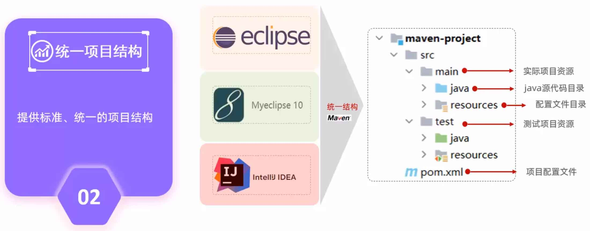
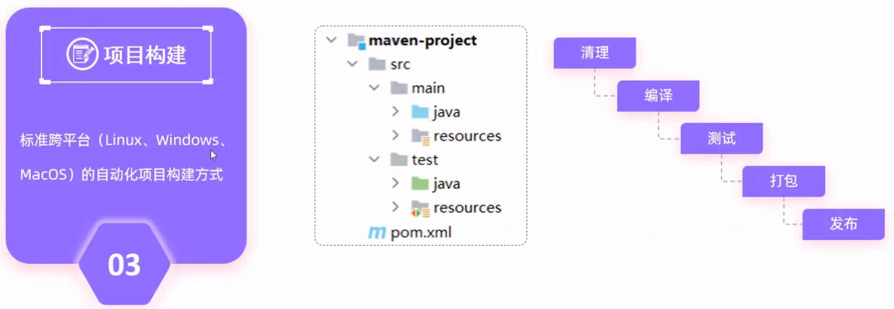

<!--#region
@author 吴钦飞
@email wuqinfei@qq.com
@create date 2023-10-21 09:28:57
@modify date 2023-10-21 10:41:35
@desc [description]
#endregion-->

# maven 快速入门

目录：

* 概述
* IDEA 集成 Maven
* 依赖管理

## 1. 概述

### 1.1. 介绍

说明：

* Maven 是 apache（开源软件基金会） 旗下的开源项目
* Maven 是一款管理和构建 Java 项目的工具
* 基于 POM（项目对象模型）的概念，通过描述信息来管理项目的构建
* 

作用：

* 依赖管理：

    * 管理项目依赖的 jar 包，避免冲突

* 统一项目结构：

    * 提供标准、统一的项目结构
    * eclipse、MyEclipse、Idea 创建的 Maven 项目都可以互相导入
    * 

* 项目构建：

    * 自动化项目构建方式
    * 

官网：

* [https://maven.apache.org/](https://maven.apache.org/)

### 1.2. 安装

1. 下载并解压 [apache-maven-3.5.4-bin.zip](https://archive.apache.org/dist/maven/maven-3/3.5.4/binaries/apache-maven-3.5.4-bin.zip)

    * W:/maven/apache-maven-3.5.4

2. 配置本地仓库

    * W:\maven\apache-maven-3.5.4\conf\settings.xml

    ```xml
    <settings>
      <!-- ... -->
      <localRepository>w:/maven/repository</localRepository>
    </settings>
    ```

3. 配置阿里云私服


    * W:\maven\apache-maven-3.5.4\conf\settings.xml

    ```xml
    <settings>

      <mirrors>
        <mirror>
          <id>alimaven</id>
          <name>aliyun maven</name>
          <url>http://maven.aliyun.com/nexus/content/groups/public/</url>
          <mirrorOf>central</mirrorOf>
        </mirror>
      </mirrors>

    </settings>
    ```
  
  4. 环境变量

      * MAVEN_HOME=W:\maven\apache-maven-3.5.4
      * path=;%MAVEN_HOME%\bin; ...

  5. 测试

      * 注意： 配置的系统变量，需要重启后才生效

      ```shell
      mvn -v
      ```