<!--#region
@author 吴钦飞
@email wuqinfei@qq.com
@create date 2026-01-18 07:28:33
@modify date 2026-02-08 11:57:14
@desc [description]
#endregion-->

# Java并发编程-黑马

## 1. 概览

课程:

* 进程
* 线程
* 并发
* 并行

依赖:

```xml
<properties>
  <maven.compiler.source>1.8</maven.compiler.source>
  <maven.compiler.target>1.8</maven.compiler.target>
</properties>

<dependencies>
  <dependency>
    <groupId>org.projectlombok</groupId>
    <artifactId>lombok</artifactId>
    <version>1.18.10</version>
  </dependency>
  <dependency>
    <groupId>ch.qos.logback</groupId>
    <artifactId>logback-classic</artifactId>
    <version>1.2.3</version>
  </dependency>
</dependencies>
```

logback.xml 配置:

```xml
<?xml version="1.0" encoding="UTF-8"?>
<configuration
        xmlns="http://ch.qos.logback/xml/ns/logback"
        xmlns:xsi="http://www.w3.org/2001/XMLSchema-instance"
        xsi:schemaLocation="http://ch.qos.logback/xml/ns/logback logback.xsd">
    <appender name="STDOUT" class="ch.qos.logback.core.ConsoleAppender">
        <encoder>
            <pattern>%date{mm:ss.SSS} [%4t] - %m%n</pattern>
        </encoder>
    </appender>

    <logger name="c" level="debug" additivity="false">
        <appender-ref ref="STDOUT"/>
    </logger>

    <root level="ERROR">
        <appender-ref ref="STDOUT"/>
    </root>
</configuration>
```

## 2. 进程与线程

进程与线程的概念

并行与并发的概念

线程基本应用

### 2.1. 进程与线程

#### 2.1.1. 进程

程序由指令和数据组成，但这些指令要运行，数据要读写，就必须将指令加载至 CPU，数据加载至内存。在指令运行过程中还需要用到磁盘、网络等设备。进程就是用来加载指令、管理内存、管理 IO 的

当一个程序被运行，从磁盘加载这个程序的代码至内存，这时就开启了一个进程。

进程就可以视为程序的一个实例。大部分程序可以同时运行多个实例进程（例如记事本、画图、浏览器等），也有的程序只能启动一个实例进程（例如网易云音乐、360 安全卫士等）

#### 2.1.2. 线程

一个进程之内可以分为一到多个线程。

一个线程就是一个指令流，将指令流中的一条条指令以一定的顺序交给 CPU 执行 

Java 中，线程作为最小调度单位，进程作为资源分配的最小单位。 

在 windows 中进程是不活动的，只是作为线程的容器

#### 2.1.3. 对比

进程基本上相互独立的，而线程存在于进程内，是进程的一个子集 

进程拥有共享的资源，如内存空间等，供其内部的线程共享 

进程间通信较为复杂：
* 同一台计算机的进程通信称为 IPC（Inter-process communication）
* 不同计算机之间的进程通信，需要通过网络，并遵守共同的协议，例如 HTTP

线程通信相对简单，因为它们共享进程内的内存，一个例子是多个线程可以访问同一个共享变量

线程更轻量，线程上下文切换成本一般上要比进程上下文切换低

### 2.2. 并行与并发

#### 2.2.1. 并发

单核 cpu 下，线程实际还是 串行执行 的。

操作系统中有一个组件叫做任务调度器，将 cpu 的时间片（windows 下时间片最小约为 15 毫秒）分给不同的程序使用，只是由于 cpu 在线程间（时间片很短）的切换非常快，人类感觉是 同时运行的 。

总结为一句话就是： 微观串行，宏观并行 

一般会将这种 线程轮流使用 CPU 的做法称为并发， concurrent

#### 2.2.2. 并行

多核 cpu下，每个 核（core） 都可以调度运行线程，这时候线程可以是并行的。

#### 2.2.3. 总结

并发（concurrent）是同一时间应对（dealing with）多件事情的能力

并行（parallel）是同一时间动手做（doing）多件事情的能力

#### 2.2.4. 例子

家庭主妇做饭、打扫卫生、给孩子喂奶，她一个人轮流交替做这多件事，这时就是并发

家庭主妇雇了个保姆，她们一起这些事，这时既有并发，也有并行（这时会产生竞争，例如锅只有一口，一个人用锅时，另一个人就得等待）

雇了 3 个保姆，一个专做饭、一个专打扫卫生、一个专喂奶，互不干扰，这时是并行

### 2.3. 线程应用

#### 2.3.1. 异步调用

以调用方角度来讲:

* 需要等待结果返回，才能继续运行就是同步
* 不需要等待结果返回，就能继续运行就是异步

多线程可以让方法执行变为异步的（即不要巴巴干等着）

比如说读取磁盘文件时，假设读取操作花费了 5 秒钟，如果没有线程调度机制，这 5 秒 cpu 什么都做不了，其它代码都得暂停...

【比如】

在项目中，视频文件需要转换格式等操作比较费时，这时开一个新线程处理视频转换，避免阻塞主线程

tomcat 的异步 servlet 也是类似的目的，让用户线程处理耗时较长的操作，避免阻塞 tomcat 的工作线程

ui 程序中，开线程进行其他操作，避免阻塞 ui 线程

#### 2.3.2. 提高效率

充分利用多核 cpu 的优势，提高运行效率。

想象下面的场景，执行 3 个计算，最后将计算结果汇总。

```text
计算 1 花费 10 ms
计算 2 花费 11 ms
计算 3 花费 9 ms
汇总需要 1 ms
```

如果是串行执行，那么总共花费的时间是 10 + 11 + 9 + 1 = 31ms

但如果是四核 cpu，
各个核心分别使用线程 1 执行计算 1，线程 2 执行计算 2，线程 3 执行计算 3，
那么 3 个 线程是并行的，花费时间只取决于最长的那个线程运行的时间，即 11ms 最后加上汇总时间只会花费 12ms

注意: 需要在多核 cpu 才能提高效率，单核仍然时是轮流执行

【结论】

单核 cpu 下，多线程不能实际提高程序运行效率，只是为了能够在不同的任务之间切换，不同线程轮流使用 cpu ，不至于一个线程总占用 cpu，别的线程没法干活

多核 cpu 可以并行跑多个线程，但能否提高程序运行效率还是要分情况的

* 有些任务，经过精心设计，将任务拆分，并行执行，当然可以提高程序的运行效率。但不是所有计算任务都能拆分（参考后文的【阿姆达尔定律】）
* 也不是所有任务都需要拆分，任务的目的如果不同，谈拆分和效率没啥意义

IO 操作不占用 cpu，只是我们一般拷贝文件使用的是【阻塞 IO】，这时相当于线程虽然不用 cpu，但需要一直等待 IO 结束，没能充分利用线程。
所以才有后面的【非阻塞 IO】和【异步 IO】优化

## 3. Java 线程

创建和运行线程

查看线程

线程 API

线程状态

### 3.1. 创建和运行线程

方法一，直接使用 Thread:

```java
@Slf4j(topic = "c.Test1")
public class Test1 {
    public static void main(String[] args) {
        // 1. 创建线程对象
        Thread thread = new Thread() {
            @Override
            public void run() {
                // 2. 要执行的任务
                log.debug("running...thread");
            }
        };

        thread.setName("t1"); // 给线程设置名称

        // 3. 启动线程
        thread.start();

        log.debug("running...main");
    }
    //=> 12:13:51 [main] c.Test1 - running...main
    //=> 12:13:51 [t1] c.Test1 - running...thread
}
```

方法二，使用 Runnable 配合 Thread: 【推荐】

```java
// 把【线程】和【任务】分开，更灵活

Runnable task = new Runnable() {
    @Override
    public void run() {
        // 要执行的任务
        log.debug("running...");
    }
};

// 创建线程对象
Thread t = new Thread(task, "t2");

// 启动线程
t.start();
```

使用 lambda 简化 Runnable 的书写:

```java
Runnable task = () -> {
    // 要执行的任务
    log.debug("running...");
};
```

方法三，FutureTask 配合 Thread:

```java
public static void main(String[] args) throws ExecutionException, InterruptedException {
    // 创建任务对象
    FutureTask<Integer> task = new FutureTask<>(() -> {
        log.debug("running...");
        Thread.sleep(3000); // 方法体的异常，默认全部抛出
        return 123;
    });

    Thread t1 = new Thread(task, "t1");

    t1.start();

    // 主线程阻塞，同步等待 task 执行完毕的结果
    Integer result = task.get();

    log.debug("task result: {}", result);
}
//=> 18:40:42 [t1] c.Test3 - running...
//=> 18:40:45 [main] c.Test3 - task result: 123
```

### 3.2. 查看进程线程的方法

windows:

```shell
# 查看所有进程
tasklist

# 过滤
tasklist | findstr "java"

# 杀死
taskkill /F /PID 28888
```

linux:

```shell
# 查看所有进程
ps -fe 

# 查看某个进程（PID）的所有线程
ps -fT -p <PID> 

# 杀死进程
kill 

# 按大写 H 切换是否显示线程
top 

# 查看某个进程（PID）的所有线程
top -H -p <PID> 
```

Java:

```shell
# 命令查看所有 Java 进程
jps

# 查看某个 Java 进程（PID）的所有线程状态
jstack <PID> 

# 查看某个 Java 进程中线程的运行情况（图形界面）
jconsole 
```

jconsole 远程监控配置:

```shell
java 
  -Djava.rmi.server.hostname=192.168.1.123 
  -Dcom.sun.management.jmxremote 
  -Dcom.sun.management.jmxremote.port=1234 
  -Dcom.sun.management.jmxremote.ssl=false 
  -Dcom.sun.management.jmxremote.authenticate=false 
  java类
```

### 3.3. 线程运行原理

【栈与栈帧】

Java Virtual Machine Stacks （Java 虚拟机栈）

我们都知道 JVM 中由堆、栈、方法区所组成，其中栈内存是给谁用的呢？

其实就是线程，每个线程启动后，虚拟机就会为其分配一块栈内存。

每个栈由多个栈帧（Frame）组成，对应着每次方法调用时所占用的内存

每个线程只能有一个活动栈帧，对应着当前正在执行的那个方法

【线程上下文切换（Thread Context Switch）】

因为以下一些原因导致 cpu 不再执行当前的线程，转而执行另一个线程的代码：

* 线程的 cpu 时间片用完
* 垃圾回收
* 有更高优先级的线程需要运行
* 线程自己调用了 sleep、yield、wait、join、park、synchronized、lock 等方法

当 Context Switch 发生时，需要由操作系统保存当前线程的状态，并恢复另一个线程的状态，Java 中对应的概念就是程序计数器（Program Counter Register），它的作用是记住下一条 jvm 指令的执行地址，是线程私有的

* 状态包括程序计数器、虚拟机栈中每个栈帧的信息，如局部变量、操作数栈、返回地址等
* Context Switch 频繁发生会影响性能

### 3.4. 常见方法

| 方法名 | static | 功能说明 | 注意 |
| - | - | - | - |
| `start()` | - | 启动一个新线程，在新的线程运行 run 方法中的代码 | start 方法只是让线程进入就绪，里面代码不一定立刻运行（CPU 的时间片还没分给它）。每个线程对象的 start 方法只能调用一次，如果调用了多次会出现  IllegalThreadStateException |
| `run()` | - | 新线程启动后会调用的方法 | 如果在构造 Thread 对象时传递了 Runnable 参数，则线程启动后会调用Runnable 中的 run 方法，否则默认不执行任何操作。但可以创建 Thread 的子类对象，来覆盖默认行为 |
| `join()` | - | 等待线程运行结束 | - |
| `join(long n)` | - | 等待线程运行结束,最多等待 n 毫秒 | - |
| `getId()` | - | 获取线程的 id | id 唯一，长整型 |
| `getName()` | - | 获取线程名 | - |
| `setName(String)` | - | 修改线程名 | - |
| `getPriority()` | - | 获取线程优先级 | - |
| `setPriority(int)` | - | 修改线程优先级 | java 中规定线程优先级是 1~10 的整数，较大的优先级能提高该线程被 CPU 调度的机率 |
| `getState()` | - | 获取线程状态 | Java 中线程状态是用 6 个 enum 表示，分别为： NEW, RUNNABLE, BLOCKED, WAITING, TIMED_WAITING, TERMINATED |
| `isInterrupted()` | - | 判断是否被打断 | 不会清除 打断标记。（打断标记为 true，被打断；为 false，未被打断，称为清除 打断标记） |
| `isAlive()` | - | 线程是否存活（还没有运行完毕） | - |
| `interrupt()` | - | 打断线程 | 如果被打断线程正在 sleep，wait，join 会导致被打断的线程抛出 InterruptedException，并清除 打断标记 ；如果打断的正在运行的线程，则会设置 打断标记 ；park 的线程被打断，也会设置 打断标记 |
| `interrupted()` | static | 判断当前线程是否被打断 | 会清除 打断标记 |
| `currentThread()` | static | 获取当前正在执行的线程 | - |
| `sleep(long n)` | static | 让当前执行的线程休眠 n 毫秒，休眠时让出 cpu 的时间片给其它线程 | - |
| `yield()` | static | 提示线程调度器让出当前线程对 CPU 的使用 | 主要是为了测试和调试 |

### 3.5. start() 与 run()

```java
public static void main(String[] args) throws ExecutionException, InterruptedException {
    Thread t1 = new Thread("t1") {
        @Override
        public void run() {
            log.debug("running...");
        }
    };

    // 直接调用 run 是在主线程中执行了 run，没有启动新的线程
    t1.run();

    log.debug("start 之前的状态: {}", t1.getState());

    // 使用 start 是启动新的线程，通过新的线程间接执行 run 中的代码
    t1.start();;

    log.debug("start 之后的状态: {}", t1.getState());

    // 再次调用 start() ，抛异常 IllegalThreadStateException
    // t1.start();
}
//=> 19:36:55 [main] c.Test4 - running...
//=> 19:36:55 [main] c.Test4 - start 之前的状态: NEW
//=> 19:36:55 [main] c.Test4 - start 之后的状态: RUNNABLE
//=> 19:36:55 [t1] c.Test4 - running...
```

### 3.6. sleep() 与 yield()

#### 3.6.1. sleep

调用 sleep 会让当前线程从 `Running` 进入 `Timed Waiting` 状态（阻塞）

其它线程可以使用 interrupt 方法打断正在睡眠的线程，这时 sleep 方法会抛出 InterruptedException

睡眠结束后的线程未必会立刻得到执行

```java
public static void main(String[] args) throws InterruptedException {
    Thread t1 = new Thread("t1") {
        @Override
        public void run() {
            log.debug("t1 sleep...");
            try {
                Thread.sleep(3000);
            } catch (InterruptedException e) {
                log.debug("t1 wake up... {}", e.getMessage());
            }
        }
    };

    log.debug("t1 status: {}", t1.getState());

    t1.start();
    log.debug("t1 status: {}", t1.getState());
    log.debug("main sleep...");
    Thread.sleep(1000);

    log.debug("t1 status: {}", t1.getState());

    log.debug("interrupt...");
    t1.interrupt();
}
//=> 03:49.709 [main] - t1 status: NEW
//=> 03:49.713 [main] - t1 status: RUNNABLE
//=> 03:49.713 [main] - main sleep...
//=> 03:49.713 [  t1] - t1 sleep...
//=> 03:50.722 [main] - t1 status: TIMED_WAITING
//=> 03:50.722 [main] - interrupt...
//=> 03:50.722 [  t1] - t1 wake up... sleep interrupted
```

建议用 TimeUnit 的 sleep 代替 Thread 的 sleep 来获得更好的可读性

```java
// 当前线程睡眠 1 秒: 等价 Thread.sleep(1000);
TimeUnit.SECONDS.sleep(1);

// 当前线程睡眠 1 分: 等价 Thread.sleep(1000 * 60);
TimeUnit.MINUTES.sleep(1);
```

#### 3.6.2. yield

调用 yield 会让当前线程从 Running 进入 Runnable 就绪状态，然后调度执行其它线程

具体的实现依赖于操作系统的任务调度器

```java
// 将当前线程的状态从 Running 改为 Runnable
Thread.yield();
```

#### 3.6.3. 线程优先级

线程优先级会提示（hint）调度器优先调度该线程，但它仅仅是一个提示，调度器可以忽略它

如果 cpu 比较忙，那么优先级高的线程会获得更多的时间片，但 cpu 闲时，优先级几乎没作用

```java
Thread t1 = new Thread(() -> log.debug("running..."));

// 1
t1.setPriority(Thread.MIN_PRIORITY);
// 5
t1.setPriority(Thread.NORM_PRIORITY);
// 10
t1.setPriority(Thread.MAX_PRIORITY);
```

### 3.7. 案例：防止 CPU 占用 100% - sleep 实现

在没有利用 cpu 来计算时，不要让 `while(true)` 空转浪费 cpu，这时可以使用 yield 或 sleep 来让出 cpu 的使用权
给其他程序

```java
while(true) {
    try {
        Thread.sleep(50);
    } catch (InterruptedException e) {
        e.printStackTrace();
    }
}
```

可以用 wait 或 条件变量 达到类似的效果，但这两种方式都需要加锁，并且需要相应的唤醒操作，一般适用于要进行同步的场景

sleep 适用于无需锁同步的场景

### 3.8. join()

【介绍】

使用 join() 方法，阻塞当前线程，等待线程运行结束

```java
public static void main(String[] args) throws InterruptedException {
    Thread t1 = new Thread(() -> {
        log.debug("t1 start...");
        try { TimeUnit.SECONDS.sleep(1); } catch (InterruptedException e) { throw new RuntimeException(e); }
        log.debug("t1 stop....");
    }, "t1");

    t1.start();
    
    // 在 start 之后调用
    t1.join();

    log.debug("main stop");
}
//=> 29:08.191 [  t1] - t1 start...
//=> 29:09.200 [  t1] - t1 stop....
//=> 29:09.201 [main] - main stop
```

【同步应用】

以调用方角度来讲，如果

* 需要 等待结果返回，才能继续运行就是 同步
* 不需要 等待结果返回，就能继续运行就是 异步

【限时同步】

```java
// 最多等 3 秒，超时则不等
t1.join(TimeUnit.SECONDS.toMillis(3));
```

### 3.9. interrupt()

#### 3.9.1. 打断阻塞

sleep，wait，join 会使线程进入阻塞状态

打断 阻塞 的线程, 会清空打断状态，以 sleep 为例

```java
public static void main(String[] args) throws InterruptedException {
    Thread t1 = new Thread(() -> {
        log.debug("t1 sleep 5 s");
        try {
            Thread.sleep(5000); // wait, join
        } catch (InterruptedException e) {
            log.debug("t1 is interrupted");
        }
    }, "t1");

    t1.start();

    log.debug("main sleep 1 s");
    Thread.sleep(1000);

    log.debug("main interrupt t1");
    t1.interrupt();

    boolean interrupted = t1.isInterrupted();
    log.debug("t1 interrupted: {}", interrupted);
}
//=> 32:48.831 [main] - main sleep 1 s
//=> 32:48.831 [  t1] - t1 sleep 5 s
//=> 32:49.837 [main] - main interrupt t1
//=> 32:49.837 [  t1] - t1 is interrupted
//=> 32:49.838 [main] - t1 interrupted: false
```

#### 3.9.2. 打断正常

打断正常运行的线程, 不会清空打断状态

```java
public static void main(String[] args) throws InterruptedException {
    Thread t1 = new Thread(() -> {
        while (true) {
            boolean interrupted = Thread.currentThread().isInterrupted();
            if (interrupted) {
                log.debug("检测到被人干扰，选择停止继续执行");
                break;
            }
        }
    }, "t1");

    t1.start();

    log.debug("main sleep 1 s");
    Thread.sleep(1000);

    log.debug("main interrupt t1");
    t1.interrupt();
}
//=> 43:19.021 [main] - main sleep 1 s
//=> 43:20.032 [main] - main interrupt t1
//=> 43:20.032 [  t1] - 检测到被人干扰，选择停止继续执行
```

#### 3.9.3. 设计模式: 两阶段终止

Two Phase Termination

在一个线程 T1 中如何“优雅”终止线程 T2？这里的 “优雅” 指的是给 T2 一个料理后事的机会。

暴力做法 1. 使用线程对象的 stop() 方法停止线程

* stop 方法会真正杀死线程，如果这时线程锁住了共享资源，那么当它被杀死后就再也没有机会释放锁，
其它线程将永远无法获取锁

暴力做法 2. 使用线程对象的 stop() 方法停止线程

* 目的仅是停止一个线程，但这种做法会让整个程序都停止

分析:

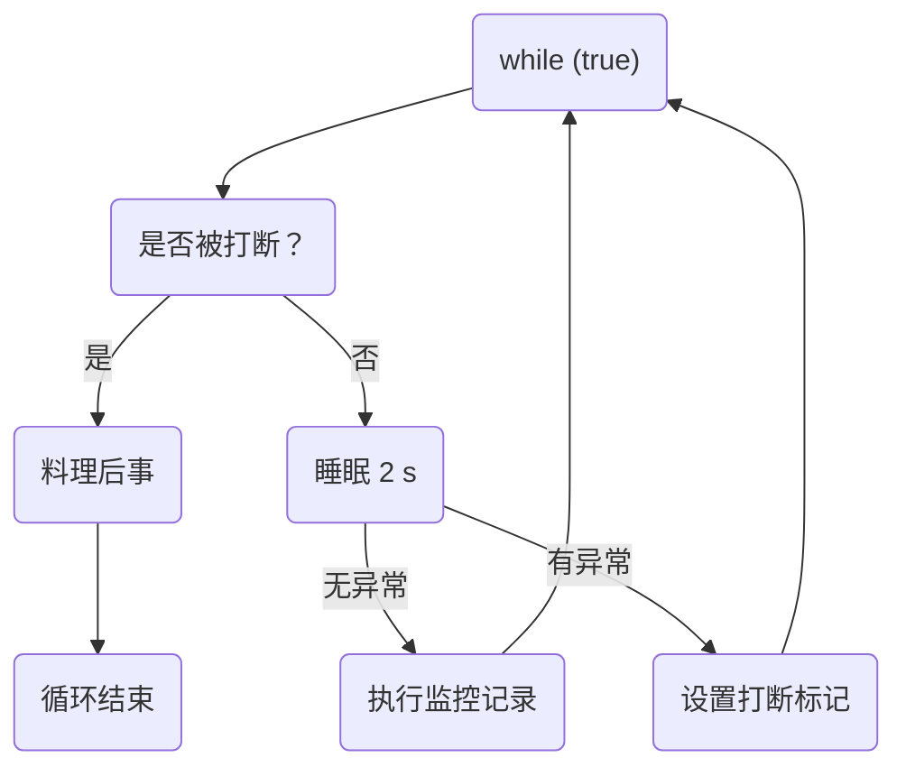

实现:

```java
@Slf4j(topic = "c.Test")
public class Test11 {
    public static void main(String[] args) throws InterruptedException {
        TwoPhaseTermination tpt = new TwoPhaseTermination();
        log.debug("启动监控");
        tpt.start();

        Thread.sleep(3500);
        log.debug("停止监控");
        tpt.stop();
    }
    //=> 32:43.637 [main] - 启动监控
    //=> 32:44.679 [monitor] - 执行监控逻辑
    //=> 32:45.680 [monitor] - 执行监控逻辑
    //=> 32:46.693 [monitor] - 执行监控逻辑
    //=> 32:47.178 [main] - 停止监控
    //=> 32:47.178 [monitor] - 睡眠时被打断
    //=> 32:47.178 [monitor] - 料理后事
}

@Slf4j(topic = "c.TwoPhaseTermination")
class TwoPhaseTermination {
    private Thread monitor;

    // 启动
    public void start() {
        monitor = new Thread(() -> {
            while (true) {
                Thread current = Thread.currentThread();

                if (current.isInterrupted()) {
                    log.debug("料理后事");
                    break;
                }

                try {
                    Thread.sleep(1000);
                    log.debug("执行监控逻辑");
                } catch (InterruptedException e) {
                    log.debug("睡眠时被打断");
                    // 阻塞时被打断，会将 isInterrupted 重置为 false。此时需要重新设置为 true
                    current.interrupt();
                }
            }
        }, "monitor");

        monitor.start();
    }

    // 停止
    public void stop() {
        monitor.interrupt();
    }
}
```

细节:

* 使用 `Thread.interrupted()` 静态方法 会 返回是否被打断 并清除打断标记

#### 3.9.4. 打断 park

打断 park 线程, 不会清空打断状态

打断标记为 true 时，打断 park 线程无效

```java
public static void main(String[] args) throws InterruptedException {
    Thread t1 = new Thread(() -> {
        log.debug("t1 park");
        // 打断标记 为 false 时，会阻塞当前线程，且不会更改 打断标记
        LockSupport.park();

        // 返回 打断标记，并将其重置为 false
        log.debug("t1 打断标记: {}", Thread.interrupted());

        log.debug("t1 unpark");

        log.debug("t1 park");
        LockSupport.park();
        log.debug("t1 unpark");
    }, "t1");

    t1.start();

    log.debug("main sleep 1 s");
    Thread.sleep(1000);

    log.debug("main interrupt t1");
    t1.interrupt();
}
//=> 55:32.751 [main] - main sleep 1 s
//=> 55:32.751 [  t1] - t1 park
//=> 55:33.764 [main] - main interrupt t1
//=> 55:33.764 [  t1] - t1 打断标记: true
//=> 55:33.768 [  t1] - t1 unpark
//=> 55:33.768 [  t1] - t1 park
```

### 3.10. 过时方法

这些方法已过时，容易破坏同步代码块，造成线程死锁

| 方法名 | static | 功能说明 |
| - | - | - |
| stop() | - | 停止线程运行 |
| suspend() | - | 挂起（暂停）线程运行 |
| resume() | - | 恢复线程运行 |

### 3.11. 守护线程

默认情况下，Java 进程需要等待所有线程都运行结束，才会结束。

有一种特殊的线程叫做守护线程，只要其它非守护线程运行结束了，即使守护线程的代码没有执行完，也会强制结束。

```java
public static void main(String[] args) throws InterruptedException {
    Thread t1 = new Thread(() -> {
        if (true) {
            while (true) {
                // do something
            }
        }
        log.debug("t1 end");
    }, "t1");

    // 设置为 守护线程
    t1.setDaemon(true);

    t1.start();

    log.debug("main sleep 1 s");
    Thread.sleep(1000);

    log.debug("main end");
    // 主线程结束，即所有的非守护线程都结束了，t1 被强制结束
}
```

注意:

* 垃圾回收器线程就是一种守护线程
* Tomcat 中的 Acceptor 和 Poller 线程都是守护线程，所以 Tomcat 接收到 shutdown 命令后，不会等待它们处理完当前请求

### 3.12. 线程的 五种状态

这是从 操作系统 层面来描述的

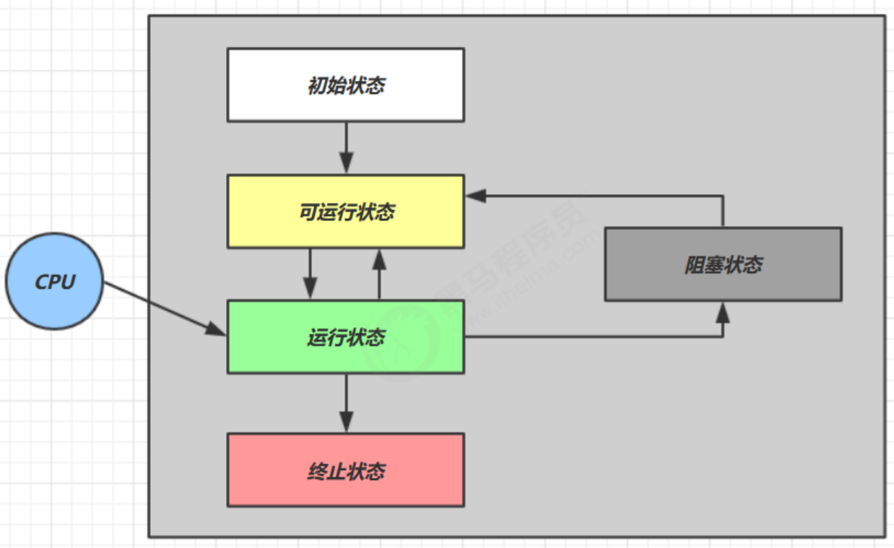


【初始状态】仅是在语言层面创建了线程对象，还未与操作系统线程关联

【可运行状态】（就绪状态）指该线程已经被创建（与操作系统线程关联），可以由 CPU 调度执行

【运行状态】指获取了 CPU 时间片运行中的状态

* 当 CPU 时间片用完，会从【运行状态】转换至【可运行状态】，会导致线程的上下文切换

【阻塞状态】

* 如果调用了阻塞 API，如 BIO 读写文件，这时该线程实际不会用到 CPU，会导致线程上下文切换，进入 【阻塞状态】
* 等 BIO 操作完毕，会由操作系统唤醒阻塞的线程，转换至【可运行状态】
* 与【可运行状态】的区别是，对【阻塞状态】的线程来说只要它们一直不唤醒，调度器就一直不会考虑调度它们

【终止状态】表示线程已经执行完毕，生命周期已经结束，不会再转换为其它状态

### 3.13. 线程的 六种状态

这是从 Java API 层面来描述的，根据 Thread.State 枚举，分为六种状态

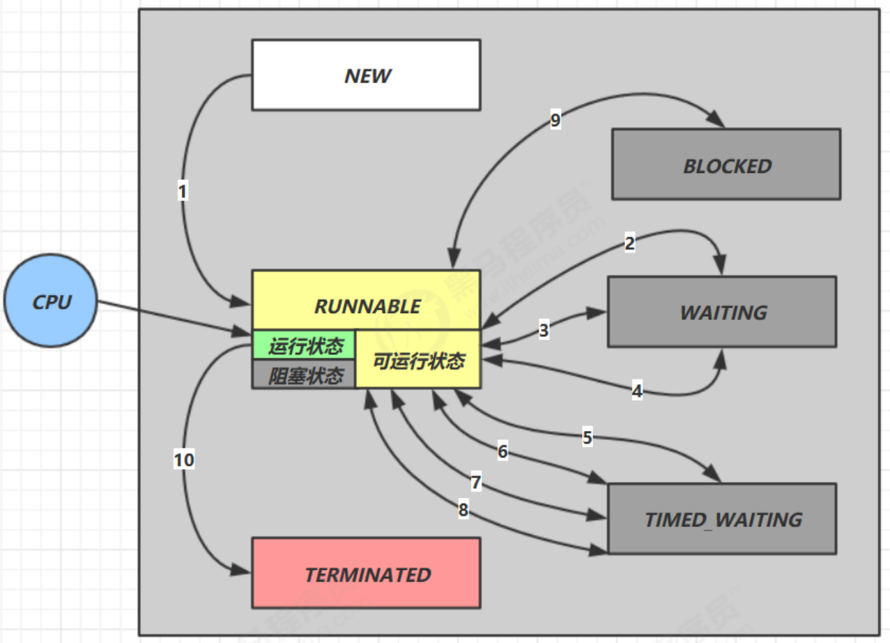

NEW 

* 线程刚被创建，但是还没有调用 start() 方法

RUNNABLE 

* 当调用了 start() 方法之后
* 注意，Java API 层面的 `RUNNABLE` 状态涵盖了操作系统层面的【可运行状态】、【运行状态】和【阻塞状态】（由于 BIO 导致的线程阻塞，在 Java 里无法区分，仍然认为是可运行）

BLOCKED、WAITING、TIMED_WAITING 

* 都是 Java API 层面对【阻塞状态】的细分，后面会在状态转换一节详述

TERMINATED

* 当线程代码运行结束

### 3.14. 线程的 六种状态 - 演示

```java
@Slf4j(topic = "c.Test")
public class TestState {
    public static void main(String[] args) throws InterruptedException {
        Thread t1 = new Thread(() -> log.debug("t1 running..."), "t1");

        Thread t2 = new Thread(() -> {
            log.debug("t2 running...");
            while (true) { /* do nothing */ }
            }, "t2");
        t2.start();

        Thread t3 = new Thread(() -> log.debug("t3 running..."), "t3");
        t3.start();

        Thread t4 = new Thread(() -> {
            synchronized (TestState.class) {
                try {
                    log.debug("t4 running...");
                    Thread.sleep(1000000); // 等待指定时间
                } catch (InterruptedException e) {
                    e.printStackTrace();
                }
            }
        }, "t4");
        t4.start();

        Thread t5 = new Thread(() -> {
            try {
                log.debug("t5 running...");
                t2.join(); // 等待未知时间
            } catch (InterruptedException e) {
                e.printStackTrace();
            }
        }, "t5");
        t5.start();

        Thread t6 = new Thread(() -> {
            synchronized (TestState.class) { // 一直获取不到锁
                log.debug("t6 running...");
            }
        }, "t6");
        t6.start();


        Thread.sleep(1000);

        log.debug("t1 state: {}", t1.getState());
        log.debug("t2 state: {}", t2.getState());
        log.debug("t3 state: {}", t3.getState());
        log.debug("t4 state: {}", t4.getState());
        log.debug("t5 state: {}", t5.getState());
        log.debug("t6 state: {}", t6.getState());
    }
    //=> 40:43.786 [  t3] - t3 running...
    //=> 40:43.786 [  t5] - t5 running...
    //=> 40:43.786 [  t4] - t4 running...
    //=> 40:43.786 [  t2] - t2 running...
    //=> 40:44.795 [main] - t1 state: NEW
    //=> 40:44.800 [main] - t2 state: RUNNABLE
    //=> 40:44.800 [main] - t3 state: TERMINATED
    //=> 40:44.800 [main] - t4 state: TIMED_WAITING
    //=> 40:44.800 [main] - t5 state: WAITING
    //=> 40:44.800 [main] - t6 state: BLOCKED
}
```

### 3.15. 应用 - 统筹

分析:

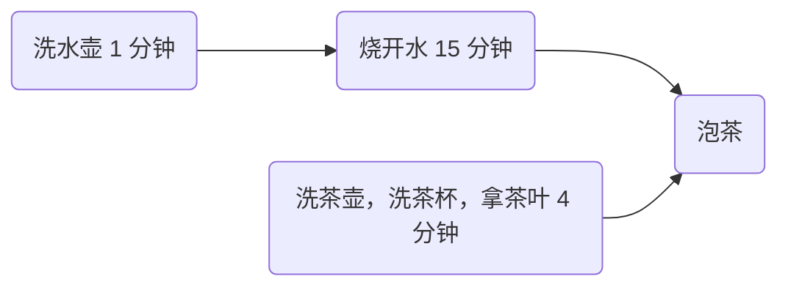

示例:

```java
public static void sleepAndPrint(int seconds, String desc) {
    try {
        log.debug("{} 耗时，{} 秒", desc, seconds);
        TimeUnit.SECONDS.sleep(seconds);
    } catch (InterruptedException e) {
        log.debug("exception: {}", e.getMessage());
    }
}

public static void main(String[] args) throws InterruptedException {
    Thread t1 = new Thread(() -> {
        sleepAndPrint(1, "洗水壶");
        sleepAndPrint(5, "烧开水");
    }, "张三");

    Thread t2 = new Thread(() -> {
        sleepAndPrint(1, "洗茶壶");
        sleepAndPrint(2, "洗茶杯");
        sleepAndPrint(1, "拿茶叶");

        try {
            t1.join();
            sleepAndPrint(1, "泡茶");
        } catch (InterruptedException e) {
            log.debug("exception: {}", e.getMessage());
        }
    }, "李四");

    t1.start();
    t2.start();
}
//=> 38:31.551 [  张三] - 洗水壶 耗时，1 秒
//=> 38:31.551 [  李四] - 洗茶壶 耗时，1 秒
//=> 38:32.563 [  李四] - 洗茶杯 耗时，2 秒
//=> 38:32.563 [  张三] - 烧开水 耗时，5 秒
//=> 38:34.569 [  李四] - 拿茶叶 耗时，1 秒
//=> 38:37.567 [  李四] - 泡茶 耗时，1 秒
```

## 4. 共享模型 - 管程

共享问题

synchronized

线程安全分析

Monitor

wait/notify

线程状态转换

活跃性

Lock

### 4.1. 线程安全问题

#### 4.1.1. 示例

```java
@Slf4j(topic = "c.Test")
public class Test15 {
    static int counter = 0;
    public static void main(String[] args) throws InterruptedException {
        Thread t1 = new Thread(() -> {
            for (int i = 0; i < 10000; i++) counter++;
        }, "t1");

        Thread t2 = new Thread(() -> {
            for (int i = 0; i < 10000; i++) counter--;
        }, "t2");

        t1.start();
        t2.start();
        t1.join();
        t2.join();
        log.debug("counter: {}", counter);
        //=> 02:06.366 [main] - counter: 175
    }
}
```

#### 4.1.2. 分析

以上的结果可能是正数、负数、零。为什么呢？

因为 Java 中对静态变量的 自增、自减 并不是原子操作，要彻底理解，必须从字节码来进行分析

例如对于 i++ 而言（i 为静态变量），实际会产生如下的 JVM 字节码指令：

```c
getstatic i // 获取静态变量i的值
iconst_1    // 准备常量1
iadd        // 自增
putstatic i // 将修改后的值存入静态变量i
```

而对应 i-- 也是类似：

```c
getstatic i // 获取静态变量i的值
iconst_1    // 准备常量1
isub        // 自减
putstatic i // 将修改后的值存入静态变量i
```

而 Java 的内存模型，完成静态变量的 自增/自减 需要在主存和工作内存中进行数据交换

如果是单线程，以上 8 行代码 是顺序执行（不会交错），没有问题

但 多线程下，这 8 行代码可能交错运行

#### 4.1.3. 临界区

一个程序运行多个线程本身是没有问题的

问题出在多个线程访问共享资源：

* 多个线程 读 共享资源 其实也没有问题
* 多个线程 读写 共享资源 时发生指令交错，就会出现问题

一段代码块内 如果存在对 共享资源 的多线程读写操作，称这段代码块为 临界区(Critical Section)

例如，下面代码中的临界区:

```java
static int counter = 0;

static void increment() 
// 临界区
{ 
 counter++; // 先读取，再加 1
}

static void decrement() 
// 临界区
{ 
 counter--;
}
```

#### 4.1.4. 竞态条件

多个线程在临界区内执行，由于代码的执行序列不同而导致结果无法预测，称之为发生了 竞态条件(Race Condition)

### 4.2. synchronized 解决方案

#### 4.2.1. 互斥

为了避免临界区的竞态条件发生，有多种手段可以达到目的:

* 阻塞式的解决方案：synchronized，Lock
* 非阻塞式的解决方案：原子变量

本次课使用阻塞式的解决方案：synchronized，来解决上述问题，即俗称的【对象锁】，它采用互斥的方式让同一时刻至多只有一个线程能持有【对象锁】，其它线程再想获取这个【对象锁】时就会阻塞住。这样就能保证拥有锁的线程可以安全的执行临界区内的代码，不用担心线程上下文切换


虽然 java 中互斥和同步都可以采用 synchronized 关键字来完成，但它们还是有区别的：

* 互斥是保证临界区的竞态条件发生，同一时刻只能有一个线程执行临界区代码
* 同步是由于线程执行的先后、顺序不同、需要一个线程等待其它线程运行到某个点

#### 4.2.2. synchronized

语法：

```java
synchronized(对象) // 线程1， 线程2(blocked)
{
    // 临界区
}
```

示例: (解决)

```java
package org.example.test;

import lombok.extern.slf4j.Slf4j;

@Slf4j(topic = "c.Test")
public class Test16 {
    static int counter = 0;
    static final Object lock = new Object();

    public static void main(String[] args) throws InterruptedException {
        Thread t1 = new Thread(() -> {
            for (int i = 0; i < 10000; i++) {
                synchronized (lock) {
                    counter++;
                }
            }
        }, "t1");

        Thread t2 = new Thread(() -> {
            for (int i = 0; i < 10000; i++) {
                synchronized (lock) {
                    counter--;
                }
            }
        }, "t2");

        t1.start();
        t2.start();
        t1.join();
        t2.join();
        log.debug("counter: {}", counter);
    }
}
```

类比:

* `synchronized(对象)` 中的对象，可以想象为一个房间（room），有唯一入口（门）房间只能一次进入一人进行计算，线程 t1、t2 想象成两个人
* 当线程 t1 执行到 `synchronized(room)` 时就好比 t1 进入了这个房间，并锁住了门拿走了钥匙，在门内执行 `count++` 代码
* 这时候如果 t2 也运行到了 `synchronized(room)` 时，它发现门被锁住了，只能在门外等待，发生了上下文切换，阻塞住了
* 这中间即使 t1 的 cpu 时间片不幸用完，被踢出了门外（不要错误理解为锁住了对象就能一直执行下去哦），这时门还是锁住的，t1 仍拿着钥匙，t2 线程还在阻塞状态进不来，只有下次轮到 t1 自己再次获得时间片时才能开门进入
* 当 t1 执行完 `synchronized{}` 块内的代码，这时候才会从 obj 房间出来并解开门上的锁，唤醒 t2 线程把钥匙给他。t2 线程这时才可以进入 obj 房间，锁住了门拿上钥匙，执行它的 `count--` 代码

#### 4.2.3. 思考

synchronized 实际是用对象锁保证了临界区内代码的原子性，临界区内的代码对外是不可分割的，不会被线程切换所打断。

为了加深理解，请思考下面的问题:

* 如果把 `synchronized(obj)` 放在 for 循环的外面，如何理解？-- 原子性
* 如果 t1 `synchronized(obj1)` 而 t2 `synchronized(obj2)` 会怎样运作？-- 锁对象
* 如果 t1 `synchronized(obj)` 而 t2 没有加会怎么样？如何理解？-- 锁对象


#### 4.2.4. 面向对象改进

把需要保护的共享变量放入一个类

```java
@Getter
class Room {
    private int count = 0;

    public void increase() {
        synchronized (this) {
            count++;
        }
    }
    public void decrease() {
        synchronized (this) {
            count--;
        }
    }
}

@Slf4j(topic = "c.Test")
public class Test17 {
    public static void main(String[] args) throws InterruptedException {
        Room room = new Room();

        Thread t1 = new Thread(() -> {
            for (int i = 0; i < 10000; i++) {
                room.increase();
            }
        }, "t1");

        Thread t2 = new Thread(() -> {
            for (int i = 0; i < 10000; i++) {
                room.decrease();
            }
        }, "t2");

        t1.start();
        t2.start();
        t1.join();
        t2.join();
        log.debug("counter: {}", room.getCount());
    }
}
```

#### 4.2.5. 方法上的 synchronized

普通方法上加 synchronized

```java
class Test{
    public synchronized void test() {
        // 方法体
    }
}

// 等价于

class Test{
    public void test() {
        synchronized(this) {
            // 方法体
        }
    }
}
```

静态方法上加 synchronized

```java
class Test{
    public synchronized static void test() {
        // 方法体
    }
}

// 等价于

class Test{
    public static void test() {
        synchronized(Test.class) {
            // 方法体
        }
    }
}
```

#### 4.2.6. 习题 - 线程八锁

略

### 4.3. 线程安全分析

【问题 1. 成员变量和静态变量是否线程安全？】

如果它们没有共享，则线程安全

如果它们被共享了，根据它们的状态是否能够改变，又分两种情况

* 如果 只有读 操作，则线程安全
* 如果 有读写 操作，则这段代码是临界区，需要考虑线程安全

【问题 2. 局部变量是否线程安全？】

局部变量是线程安全的

但局部变量引用的对象则未必

* 如果该对象 没有逃离 方法的作用范围，它是线程安全的
* 如果该对象 逃离 方法的作用范围，需要考虑线程安全

【局部变量线程安全分析】

```java
public static void test1() {
    int i = 10;
    i++;
}
```

每个线程调用 `test1()` 方法时，局部变量 `i` 会在每个线程的栈帧内存中被创建多份，因此不存在共享

### 4.4. 常见线程安全类

#### 4.4.1. 常见类

String: 它的属性都是不可更改的

Integer: 基本类型的包装类 都是线程安全的

StringBuffer: StringBuilder 是线程不安全

Random

Vector: List 实现

Hashtable: Map 实现

java.util.concurrent 包下的类: 简称 JUC

这里说它们是线程安全的是指，多个线程调用它们同一个实例的某个方法时，是线程安全的。

也可以理解为:

* 它们的每个方法是原子的
* 但注意它们多个方法的组合不是原子的，见后面分析

#### 4.4.2. 组合调用

```java
Hashtable table = new Hashtable();
// 线程1，线程2
if ( table.get("key") == null) {
    table.put("key", value);
}
```

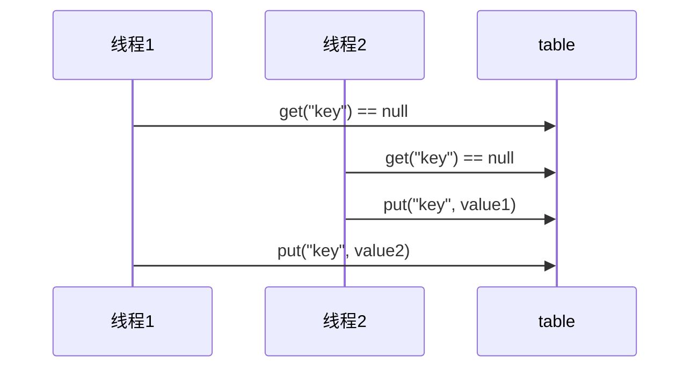

#### 4.4.3. 不可变类

String、Integer 等都是不可变类，因为其内部的状态不可以改变，因此它们的方法都是线程安全的

### 4.5. 练习

#### 4.5.1. 卖票

代码: 

```java
@Slf4j(topic = "c.Test")
public class E01_SellTickets {
    public static void main(String[] args) throws InterruptedException {
        // 执行多次，更容易发现问题
        for (int i = 0; i < 10; i++) {
            test();
        }
    }

    private static void test() throws InterruptedException {
        TicketWindow ticketWindow = TicketWindow.of(1000);

        // 卖出的票
        List<Integer> amountList = new Vector<>();

        // 线程集合
        List<Thread> threadList = new ArrayList<>();

        // 模拟多人卖票
        for (int i = 0; i < 2000; i++) {
            Thread thread = new Thread(() -> {
                int amount = ticketWindow.sell(randomAmount());
                amountList.add(amount);
            });
            thread.start();
            threadList.add(thread);
        }

        for (Thread thread : threadList) {
            thread.join();
        }


        int count = amountList.stream().mapToInt(Integer::intValue).sum();

        // 如果没问题，则不打印
        if (count == 1000) {
            return;
        }

        log.debug("剩余票数: {}", count);
        log.debug("卖出票数: {}", count);
    }
    //=> 33:33.460 [main] - 剩余票数: 0
    //=> 33:33.468 [main] - 卖出票数: 1005


    static Random random = new Random();
    // 随机 1~5
    public static int randomAmount() {
        return random.nextInt(5) + 1;
    }
}

@Data
@AllArgsConstructor(staticName = "of")
class TicketWindow {
    private int count; // 余票

    public int sell(int amount) { // 卖票
        // 模拟 查询用户信息 的操作
        try {
            Thread.sleep(10);
        } catch (InterruptedException e) {
            throw new RuntimeException(e);
        }

        if (this.count >= amount) {
            this.count -= amount;
            return amount;
        }
        return 0;
    }
}
```

解决:

```java
public synchronized int sell(int amount) { // 卖票
    // ...
}
```

#### 4.5.2. 转账

代码:

```java
package org.example.exercise;

import lombok.Data;
import lombok.extern.slf4j.Slf4j;

import java.util.Random;

@Slf4j(topic = "c.Test")
public class E02_Transfer {
    public static void main(String[] args) throws InterruptedException {
        Account a = new Account(1000);
        Account b = new Account(1000);
        Thread t1 = new Thread(() -> {
            for (int i = 0; i < 1000; i++) {
                a.transfer(b, randomAmount());
            }
        }, "t1");
        Thread t2 = new Thread(() -> {
            for (int i = 0; i < 1000; i++) {
                b.transfer(a, randomAmount());
            }
        }, "t2");
        t1.start();
        t2.start();
        t1.join();
        t2.join();

        // 查看转账2000次后的总金额
        log.debug("total:{}", (a.getMoney() + b.getMoney()));
    }

    // Random 为线程安全
    static Random random = new Random();

    // 随机 1~100
    public static int randomAmount() {
        return random.nextInt(100) + 1;
    }
}

@Data
class Account {
    private int money;

    public Account(int money) {
        this.money = money;
    }

    public void transfer(Account target, int amount) {
        if (this.money > amount) {
            this.setMoney(this.getMoney() - amount);
            target.setMoney(target.getMoney() + amount);
        }
    }
}
```

解决:

```java
public void transfer(Account target, int amount) {
    // 所有线程都会排队访问，效率极低
    synchronized (Account.class) {
        if (this.money > amount) {
            this.setMoney(this.getMoney() - amount);
            target.setMoney(target.getMoney() + amount);
        }
    }
}
```

### 4.6. Monitor 概念

#### 4.6.1. Java 对象头

Java 对象都有 对象头 作为对象的元信息

以 32 位虚拟机为例

普通对象:

```text
|--------------------------------------------------------------|
|                    Object Header (64 bits)                   |
|------------------------------------|-------------------------|
| Mark Word (32 bits)                | Klass Word (32 bits)    |
|------------------------------------|-------------------------|

Mark Word  : 状态信息
Klass Word : 指向该对象的字节码
```

数组对象:

```text
|---------------------------------------------------------------------------------|
|                         Object Header (96 bits)                                 |
|--------------------------------|-----------------------|------------------------|
| Mark Word(32bits)              |    Klass Word(32bits) |   array length(32bits) |
|--------------------------------|-----------------------|------------------------|
```

其中 Mark Word 结构为:

```text
|-------------------------------------------------------|--------------------|
|                     Mark Word (32 bits)               |        State       |
|-------------------------------------------------------|--------------------|
| hashcode:25           | age:4 |  biased_lock:0   | 01 |        Normal      |
|-------------------------------------------------------|--------------------|
| thread:23   | epoch:2 | age:4 |  biased_lock:1   | 01 |        Biased      |
|-------------------------------------------------------|--------------------|
| ptr_to_lock_record:30                            | 00 | Lightweight Locked |
|-------------------------------------------------------|--------------------|
| ptr_to_heavyweight_monitor:30                    | 10 | Heavyweight Locked |
|-------------------------------------------------------|--------------------|
|                                                  | 11 |    Marked for GC   |
|-------------------------------------------------------|--------------------|
```

参考: https://stackoverflow.com/questions/26357186/what-is-in-java-object-header

#### 4.6.2. Monitor(锁) 原理

Monitor 被翻译为监视器或管程

每个 Java 对象都可以关联一个 Monitor 对象，如果使用 synchronized 给对象上锁（重量级）之后，该对象头的 Mark Word 中就被设置指向 Monitor 对象的指针

Monitor 结构如下

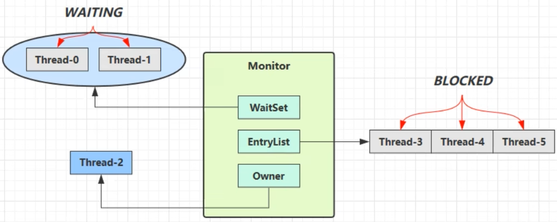

说明：

* 刚开始 Monitor 中 Owner 为 null
* 当 Thread-2 执行 synchronized(obj) 就会将 Monitor 的所有者 Owner 置为 Thread-2，Monitor 中只能有一个 Owner
* 在 Thread-2 上锁的过程中，如果 Thread-3，Thread-4，Thread-5 也来执行 synchronized(obj)，就会进入 EntryList BLOCKED
* Thread-2 执行完同步代码块的内容，然后唤醒 EntryList 中等待的线程来竞争锁，竞争的时是非公平的
* 图中 WaitSet 中的 Thread-0，Thread-1 是之前获得过锁，但条件不满足进入 WAITING 状态的线程，后面讲 wait-notify 时会分析

注意：

* synchronized 必须是进入同一个对象的 monitor 才有上述的效果
* 不加 synchronized 的对象不会关联监视器，不遵从以上规则

### 4.7. synchronized 优化原理

Java 6 之后，对 synchronized 这种重量级锁进行了优化

#### 4.7.1. 轻量级锁

轻量级锁的使用场景：如果一个对象虽然有多线程要加锁，但加锁的时间是错开的（也就是没有竞争），那么可以使用轻量级锁来优化。

轻量级锁对使用者是透明的，即语法仍然是 synchronized

假设有两个方法同步块，利用同一个对象加锁

```java
static final Object obj = new Object();
public static void method1() {
    synchronized( obj ) {
        // 同步块 A
        method2();
    }
}
public static void method2() {
    synchronized( obj ) {
        // 同步块 B
    }
}
```

创建锁记录（Lock Record）对象，每个线程都的栈帧都会包含一个锁记录的结构，内部可以存储锁定对象的 Mark Word

让锁记录中 Object reference 指向锁对象，并尝试用 cas 替换 Object 的 Mark Word，将 Mark Word 的值存入锁记录

如果 cas 替换成功，对象头中存储了锁记录地址和状态 00 ，表示由该线程给对象加锁

如果 cas 失败，有两种情况:

* 如果是其它线程已经持有了该 Object 的轻量级锁，这时表明有竞争，进入锁膨胀过程
* 如果是自己执行了 synchronized 锁重入，那么再添加一条 Lock Record 作为重入的计数

当退出 synchronized 代码块（解锁时）如果有取值为 null 的锁记录，表示有重入，这时重置锁记录，表示重入计数减一

当退出 synchronized 代码块（解锁时）锁记录的值不为 null，这时使用 cas 将 Mark Word 的值恢复给对象头:

* 成功，则解锁成功
* 失败，说明轻量级锁进行了锁膨胀或已经升级为重量级锁，进入重量级锁解锁流程

#### 4.7.2. 锁膨胀

如果在尝试加轻量级锁的过程中，CAS 操作无法成功，这时一种情况就是有其它线程为此对象加上了轻量级锁（有竞争），这时需要进行锁膨胀，将轻量级锁变为重量级锁。

```java
static Object obj = new Object();
public static void method1() {
    synchronized( obj ) {
        // 同步块
    }
}
```

当 Thread-1 进行轻量级加锁时，Thread-0 已经对该对象加了轻量级锁

这时 Thread-1 加轻量级锁失败，进入锁膨胀流程:

* 即为 Object 对象申请 Monitor 锁，让 Object 指向重量级锁地址
* 然后自己进入 Monitor 的 EntryList BLOCKED

当 Thread-0 退出同步块解锁时，使用 cas 将 Mark Word 的值恢复给对象头，失败。
这时会进入重量级解锁流程，即按照 Monitor 地址找到 Monitor 对象，设置 Owner 为 null，唤醒 EntryList 中 BLOCKED 线程

#### 4.7.3. 自旋优化

重量级锁竞争的时候，还可以使用自旋来进行优化，如果当前线程自旋成功（即这时候持锁线程已经退出了同步块，释放了锁），这时当前线程就可以避免阻塞。

也是就是说，当其它线程（Thread-2）访问同步代码块时，
发现对象锁已经上锁，则 Thread-2 则执行几次循环多尝试几次是否能获取锁对象，
如果这个尝试期间能成功 则 不用阻塞 及 上下文切换。

自旋会占用 CPU 时间，单核 CPU 自旋就是浪费，多核 CPU 自旋才能发挥优势。

Java 6 之后自旋锁是自适应的，比如对象刚刚的一次自旋操作成功过，那么认为这次自旋成功的可能性会高，就多自旋几次；反之，就少自旋甚至不自旋，总之，比较智能。

Java 7 之后不能控制是否开启自旋功能

#### 4.7.4. 偏向锁

轻量级锁在没有竞争时（就自己这个线程），每次重入仍然需要执行 CAS 操作。

Java 6 中引入了偏向锁来做进一步优化：只有第一次使用 CAS 将线程 ID 设置到对象的 Mark Word 头，之后发现这个线程 ID 是自己的就表示没有竞争，不用重新 CAS。
以后只要不发生竞争，这个对象就归该线程所有

#### 4.7.5. 偏向状态

一个对象创建时：

* 如果开启了偏向锁（默认开启），那么对象创建后，markword 值为 0x05 即最后 3 位为 101，这时它的 thread、epoch、age 都为 0
* 偏向锁 默认是延迟的，不会在程序启动时立即生效，如果想避免延迟，可以加 VM 参数 `-XX:BiasedLockingStartupDelay=0` 来禁用延迟
* 如果没有开启偏向锁，那么对象创建后，markword 值为 0x01 即最后 3 位为 001，这时它的 hashcode、age 都为 0，第一次用到 hashcode 时才会赋值

注意:

* 处于偏向锁的对象解锁后，线程 id 仍存储于对象头中

在添加 VM 参数 `-XX:-UseBiasedLocking` 可以禁用偏向锁

#### 4.7.6. 撤销 - 调用对象 hashCode

调用了对象的 hashCode，但偏向锁的对象 MarkWord 中存储的是线程 id，如果调用 hashCode 会导致偏向锁被撤销

* 轻量级锁会在锁记录中记录 hashCode
* 重量级锁会在 Monitor 中记录 hashCode

正常状态对象一开始是没有 hashCode 的，第一次调用(`obj.hashCode()`)才生成，此时会占用 偏向锁 的空间，导致偏向锁失效

#### 4.7.7. 撤销 - 其它线程使用对象

当有其它线程使用偏向锁对象时，会将偏向锁升级为轻量级锁

当锁对象第一次被上锁时，是偏向锁，此时锁对象一直保留 第一次使用该锁的线程 的 id，
一旦其它线程使用该锁对象，则说明该锁不是第一次使用该锁的线程 独占，此时会升级为 轻量级锁

#### 4.7.8. 撤销 - 调用 wait/notify

wait/notify 是重量级锁才有的功能，一旦调用则会导致 偏向锁 失效

#### 4.7.9. 批量重偏向

如果对象虽然被多个线程访问，但没有竞争，这时偏向了线程 T1 的对象仍有机会重新偏向 T2，重偏向会重置对象的 Thread ID

当撤销偏向锁阈值超过 20 次后，jvm 会这样觉得，我是不是偏向错了呢，于是会在给这些对象加锁时重新偏向至加锁线程

也就是说，线程 1 给 30 个锁对象上偏向锁后，线程 2 访问这 30 个锁对象，前 19 个会不停将锁对象升级为 轻量级锁，后 11 个会将锁对象的偏向改为 线程 2

#### 4.7.10. 批量撤销

当撤销偏向锁阈值超过 40 次后，jvm 会这样觉得，自己确实偏向错了，根本就不该偏向。于是整个类的所有对象都会变为不可偏向的，新建的对象也是不可偏向的

#### 4.7.11. 锁消除

```java
public void b() throws Exception {
    Object o = new Object();
    synchronized (o) {
        x++;
    }
}

// 上面的代码中的锁完全没有起作用，默认会被优化为:
public void b() throws Exception {
    x++;
}
```

通过 VM 参数 `-XX:-EliminateLocks` 可以关闭这种优化

### 4.8. wait 和 notify

#### 4.8.1. 原理


Owner 线程发现条件不满足，调用 wait 方法，即可进入 WaitSet 变为 WAITING 状态

BLOCKED 和 WAITING 的线程都处于阻塞状态，不占用 CPU 时间片

BLOCKED 线程会在 Owner 线程释放锁时唤醒

WAITING 线程会在 Owner 线程调用 notify 或 notifyAll 时唤醒，但唤醒后并不意味者立刻获得锁，仍需进入 EntryList 重新竞争

#### 4.8.2. API 介绍

`obj.wait()` 让进入 obj 监视器的线程到 waitSet 等待

`obj.notify()` 在 obj 上正在 waitSet 等待的线程中挑一个唤醒

`obj.notifyAll()` 让 obj 上正在 waitSet 等待的线程全部唤醒

它们都是线程之间进行协作的手段，都属于 Object 对象的方法。必须获得此对象的锁，才能调用这几个方法

`wait()` 方法会释放对象的锁，进入 WaitSet 等待区，从而让其他线程就机会获取对象的锁。无限制等待，直到 notify 为止

`wait(long n)` 有时限的等待, 到 n 毫秒后结束等待，或是被 notify

```java
@Slf4j(topic = "c.Test")
public class Test18 {
    static final Object lockObj = new Object();

    public static void main(String[] args) throws InterruptedException {
        for (int i = 1; i <= 3 ; i++) {
            new Thread(() -> {
                synchronized (lockObj) {
                    log.debug("running...1");
                    try {
                        lockObj.wait(); // 让线程在 lockObj 上一致等下下
                    } catch (InterruptedException e) {
                        e.printStackTrace();
                    }
                    log.debug("running...2");
                }
            }, "t" + i).start();
        }

        log.debug("sleep");
        TimeUnit.SECONDS.sleep(2);

        synchronized (lockObj) {
            lockObj.notify(); // 唤醒 lockObj 上一个等待的线程
            // lockObj.notifyAll(); // 唤醒 lockObj 上所有等待的线程
        }
    }
    //=> 17:12.425 [main] - sleep
    //=> 17:12.425 [  t1] - running...1
    //=> 17:12.428 [  t3] - running...1
    //=> 17:12.428 [  t2] - running...1
    //=> 17:14.439 [  t1] - running...2
}
```

#### 4.8.3. sleep 和 wait 的区别

sleep 是 Thread 方法，而 wait 是 Object 的方法 

sleep 不需要强制和 synchronized 配合使用，但 wait 需要和 synchronized 一起用 

sleep 在睡眠的同时，不会释放对象锁的，但 wait 在等待的时候会释放对象锁 

它们状态 TIMED_WAITING

#### 4.8.4. 最佳实践

套路:

```java
// 条件不成立，则继续等待
synchronized (lock) {
    while (条件不成立) {
        lock.wait();
    }
    // 条件不成立，做正事
}

// 条件成立，则唤醒所有
synchronized (lock) {
    lock.notifyAll();
}
```

示例:

```java
@Slf4j(topic = "c.Test")
public class Test19 {
    static final Object lock = new Object();
    static boolean has5090 = false;
    static boolean hasSKII = false;

    public static void main(String[] args) throws InterruptedException {
        new Thread(() -> {
            synchronized (lock) {
                while (!has5090) {
                    try {
                        log.debug("5090 还没送到，继续等");
                        lock.wait();
                    } catch (InterruptedException e) {
                        log.debug("被打断");
                    }
                }

                log.debug("5090 已送到，打游戏");
            }
        }, "小明").start();

        new Thread(() -> {
            synchronized (lock) {
                while (!hasSKII) {
                    try {
                        log.debug("SKII 还没送到，继续等");
                        lock.wait();
                    } catch (InterruptedException e) {
                        log.debug("被打断");
                    }
                }

                log.debug("SKII 已送到，化妆");
            }
        }, "小红").start();

        TimeUnit.SECONDS.sleep(1);

        synchronized (lock) {
            has5090 = true;
            lock.notifyAll();
        }
    }
    //=> 04:45.726 [  小明] - 5090 还没送到，继续等
    //=> 04:45.729 [  小红] - SKII 还没送到，继续等
    //=> 04:46.737 [  小红] - SKII 还没送到，继续等
    //=> 04:46.737 [  小明] - 5090 已送到，打游戏
}
```

### 4.9. 设计模式 - 保护性暂停

#### 4.9.1. 介绍

即 Guarded Suspension，用在一个线程等待另一个线程的执行结果

要点:

* 有一个结果需要从一个线程传递到另一个线程，让他们关联同一个 GuardedObject
* 如果有结果不断从一个线程到另一个线程那么可以使用消息队列（见生产者/消费者）
* JDK 中，join 、Future 的实现，采用的就是此模式
* 因为要等待另一方的结果，因此归类到同步模式

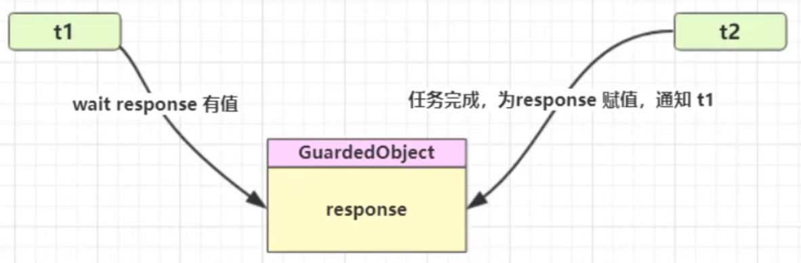

#### 4.9.2. 实现

```java
@Slf4j(topic = "c.Test")
public class Test20 {
    public static void main(String[] args) throws Exception {
        GuardedObject guardedObject = new GuardedObject();

        new Thread(() -> {
            log.debug("t1 开始执行");

            try {
                TimeUnit.SECONDS.sleep(1);
            } catch (InterruptedException e) {
                e.printStackTrace();
            }

            log.debug("t1 执行完成，将结果塞入 guardedObject");
            guardedObject.complete("123");
            // guardedObject.complete(null); // 传入 null，模拟 虚假唤醒
        }, "t1").start();

        new Thread(() -> {
            log.debug("t2 等待结果");
            // Object response = guardedObject.get(500); // 超时，拿到 null
            Object response = guardedObject.get(2000);   // 未超时，拿到 123

            log.debug("t2 拿到结果，从 guardedObject 拿结果: {}", response);
        }, "t2").start();
    }
    //=> 12:06.368 [  t2] - t2 等待结果
    //=> 12:06.368 [  t1] - t1 开始执行
    //=> 12:07.383 [  t1] - t1 执行完成，将结果塞入 guardedObject
    //=> 12:07.383 [  t2] - t2 拿到结果，从 guardedObject 拿结果: 123
}

class GuardedObject {
    // 结果
    private Object response;

    // 获取结果
    public Object get(long timeout) {
        synchronized (this) {
            long begin = System.currentTimeMillis();
            long passedTime = 0;

            while (response == null) {
                long waitTime = timeout - passedTime;

                if (waitTime <= 0) {
                    break;
                }
                try {
                    this.wait(waitTime);
                } catch (InterruptedException e) {
                    e.printStackTrace();
                }

                passedTime = System.currentTimeMillis() - begin;
            }

            return response;
        }
    }

    // 产生结果
    public void complete(Object response) {
        synchronized (this) {
            this.response = response;
            this.notifyAll();
        }
    }
}
```

#### 4.9.3. join 原理

join 是等待另一个线程的结束

#### 4.9.4. 解耦 等待和生产

```java
@Slf4j(topic = "c.Test")
public class Test21 {
    public static void main(String[] args) throws Exception {
        for (int i = 0; i < 3; i++) {
            new Person(String.format("张三-%s", i)).start();
        }

        TimeUnit.SECONDS.sleep(1);

        for (Integer id : Mailboxes.getIds()) {
            new Postman(id, "内容" + id, String.format("【%s】的专属邮递员", id)).start();
        }
    }
    //=> 40:25.667 [张三-0] - 开始收信: id=0
    //=> 40:25.667 [张三-2] - 开始收信: id=1
    //=> 40:25.667 [张三-1] - 开始收信: id=2
    //=> 40:26.677 [【1】的专属邮递员] - 送信: id=1, mail=内容1
    //=> 40:26.677 [【2】的专属邮递员] - 送信: id=2, mail=内容2
    //=> 40:26.677 [张三-2] - 收到了信: id=1, mail=内容1
    //=> 40:26.677 [张三-1] - 收到了信: id=2, mail=内容2
    //=> 40:26.678 [【0】的专属邮递员] - 送信: id=0, mail=内容0
    //=> 40:26.678 [张三-0] - 收到了信: id=0, mail=内容0
}

@Slf4j(topic = "c.Test")
class Person extends Thread {
    public Person(String name) {
        super(name);
    }
    @Override
    public void run() {
        // 收信
        GuardedObjectWithId guardedObject = Mailboxes.createGuardedObject();
        log.debug("开始收信: id={}", guardedObject.getId());
        Object mail = guardedObject.get(5000);
        log.debug("收到了信: id={}, mail={}", guardedObject.getId(), mail);
    }
}

@Slf4j(topic = "c.Test")
class Postman extends Thread {
    private final int id;
    private final String mail;

    public Postman(int id, String mail, String name) {
        super(name);
        this.id = id;
        this.mail = mail;
    }

    @Override
    public void run() {
        GuardedObjectWithId guardedObject = Mailboxes.getGuardedObjectById(id);
        log.debug("送信: id={}, mail={}", guardedObject.getId(), mail);
        guardedObject.complete(mail);
    }
}


// 中间解耦类
class Mailboxes {
    private static final Map<Integer, GuardedObjectWithId> boxes = new Hashtable<>(); // 线程安全的 map

    private static int id = 0;
    private static synchronized int generateId() {
        return id++;
    }

    public static GuardedObjectWithId getGuardedObjectById(int id) {
        return boxes.remove(id);
    }

    public static GuardedObjectWithId createGuardedObject() {
        GuardedObjectWithId guardedObject = new GuardedObjectWithId(generateId());
        boxes.put(guardedObject.getId(), guardedObject);
        return guardedObject;
    }

    public static Set<Integer> getIds() {
        return boxes.keySet();
    }
}

@Getter
@AllArgsConstructor
class GuardedObjectWithId extends GuardedObject {
    private int id;
}
```

### 4.10. 异步模式 - 生产者/消费者

#### 4.10.1. 定义

与前面的保护性暂停中的 GuardObject 不同，不需要产生结果和消费结果的线程一一对应

消费队列可以用来平衡生产和消费的线程资源

生产者仅负责产生结果数据，不关心数据该如何处理，而消费者专心处理结果数据

消息队列是有容量限制的，满时不会再加入数据，空时不会再消耗数据

JDK 中各种阻塞队列，采用的就是这种模式

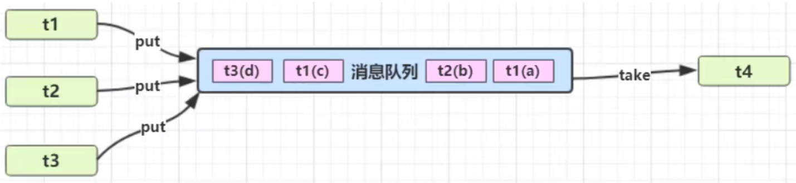

#### 4.10.2. 实现

```java

@Slf4j(topic = "c.Test")
public class Test22 {
    public static void main(String[] args) throws InterruptedException {
        MessageQueue messageQueue = new MessageQueue(2);

        for (int i = 0; i < 3; i++) {
            int id = i;
            String value = "内容" + i;
            String name = "生产者" + i;
            new Thread(() -> messageQueue.put(new Message(id, value)), name).start();
        }


        new Thread(() -> {
            while (true) {
                try {
                    TimeUnit.SECONDS.sleep(1);
                } catch (InterruptedException e) {
                    throw new RuntimeException(e);
                }
                messageQueue.take();
            }
        }, "消费者").start();
    }
    //=> 07:03.903 [生产者0] - 存: Message(id=0, Value=内容0)
    //=> 07:03.907 [生产者1] - 存: Message(id=1, Value=内容1)
    //=> 07:03.907 [生产者2] - 存: 容量已满，等待
    //=> 07:04.904 [ 消费者] - 取: Message(id=0, Value=内容0)
    //=> 07:04.905 [生产者2] - 存: Message(id=2, Value=内容2)
    //=> 07:05.918 [ 消费者] - 取: Message(id=1, Value=内容1)
    //=> 07:06.933 [ 消费者] - 取: Message(id=2, Value=内容2)
    //=> 07:07.947 [ 消费者] - 取: 队列为空，等待
}

// 消息队列类，Java 线程间通信
@RequiredArgsConstructor
@Slf4j(topic = "c.Test")
class MessageQueue {
    // 集合
    private final LinkedList<Message> list = new LinkedList<>();
    // 容量
    private final int capacity;

    // 取: 从头取
    public Message take() {
        synchronized (list) {
            while (list.isEmpty()) {
                try {
                    log.debug("取: 队列为空，等待");
                    list.wait();
                } catch (InterruptedException e) {
                    e.printStackTrace();
                }
            }

            Message message = list.removeFirst();

            log.debug("取: {}", message);

            list.notifyAll(); // 广播: 有新空位了

            return message;
        }
    }

    // 存: 从尾存
    public void put(Message message) {
        synchronized (list) {
            while (list.size() >= capacity) {
                try {
                    log.debug("存: 容量已满，等待");
                    list.wait();
                } catch (InterruptedException e) {
                    e.printStackTrace();
                }
            }
            list.addLast(message);

            log.debug("存: {}", message);

            list.notifyAll(); // 广播: 有新元素了
        }
    }
}

@Getter
@AllArgsConstructor
@ToString
final class Message {
    private int id;
    private Object Value;
}
```

### 4.11. park 和 unpark

#### 4.11.1. 基本使用

它们是 LockSupport 类中的方法:

```java
// 暂停当前线程
LockSupport.park(); 

// 恢复某个线程的运行
LockSupport.unpark(线程对象)

// unpack 可以先于 park 调用；先调用 unpack，后续执行 park 时不会再暂停
```

示例:

```java
public static void main(String[] args) {
    Thread t1 = new Thread(() -> {
        sleepSeconds(1);
        log.debug("t1 park");
        LockSupport.park();
        log.debug("t1 resume");
    }, "t1");

    t1.start();

    sleepSeconds(2);
    log.debug("main unpack t1");
    LockSupport.unpark(t1);
}
//=> 26:26.882 [main] - 睡眠 2 秒
//=> 26:26.882 [  t1] - 睡眠 1 秒
//=> 26:27.900 [  t1] - t1 park
//=> 26:28.899 [main] - main unpack t1
//=> 26:28.899 [  t1] - t1 resume
```

#### 4.11.2. 特点

与 Object 的 wait & notify 相比：

* `wait & notify/notifyAll` 必须配合 Object Monitor 一起使用，而 `park & unpark` 不必
* `park & unpark` 是以线程为单位来【阻塞】和【唤醒】线程，而 notify 只能随机唤醒一个等待线程，notifyAll 是唤醒所有等待线程，就不那么【精确】
* `park & unpark` 可以先 unpark，而 `wait & notify` 不能先 notify

#### 4.11.3. 原理

每个线程都有自己的一个 Parker 对象，由三部分组成 `_counter` ， `_cond` 和 `_mutex`

### 4.12. 线程状态转换


假设有

* 线程 `Thread t`

#### 4.12.1. 情况 1 NEW --> RUNNABLE

当调用 `t.start()` 方法时，由 NEW --> RUNNABLE

#### 4.12.2. 情况 2 RUNNABLE <--> WAITING

t 线程 用 `synchronized(obj)` 获取了对象锁后

调用 `obj.wait()` 方法时，t 线程 从 RUNNABLE --> WAITING

调用 `obj.notify()` ， `obj.notifyAll()` ， `t.interrupt()` 时

* 竞争锁成功，t 线程 从 WAITING --> RUNNABLE
* 竞争锁失败，t 线程 从 WAITING --> BLOCKED

#### 4.12.3. 情况 3 RUNNABLE <--> WAITING

当前线程 调用 `t.join()` 方法时，当前线程 从 RUNNABLE --> WAITING

注意是 当前线程 在 t 线程对象的监视器上等待

t 线程运行结束，或调用了 当前线程 的 `interrupt()` 时，当前线程 从 WAITING --> RUNNABLE

#### 4.12.4. 情况 4 RUNNABLE <--> WAITING

当前线程 调用 `LockSupport.park()` 方法会让 当前线程 从 RUNNABLE --> WAITING

调用 `LockSupport.unpark(目标线程)` 或 调用了线程 的 `interrupt()` ，会让目标线程从 WAITING --> RUNNABLE

#### 4.12.5. 情况 5 RUNNABLE <--> TIMED_WAITING

t 线程用 `synchronized(obj)` 获取了对象锁后

调用 `obj.wait(long n)` 方法时，t 线程从 RUNNABLE --> TIMED_WAITING

t 线程 等待时间超过了 n 毫秒，或调用 `obj.notify()` ， `obj.notifyAll()` ， `t.interrupt()` 时

* 竞争锁成功，t 线程 从 TIMED_WAITING --> RUNNABLE
* 竞争锁失败，t 线程 从 TIMED_WAITING --> BLOCKED

#### 4.12.6. 情况 6 RUNNABLE <--> TIMED_WAITING

当前线程调用 `t.join(long n)` 方法时，当前线程从 RUNNABLE --> TIMED_WAITING

* 注意是 当前线程 在 t 线程对象的监视器上等待

当前线程等待时间超过了 n 毫秒，或 t 线程 运行结束，或调用了当前线程的 `interrupt()` 时，当前线程从 TIMED_WAITING --> RUNNABLE

#### 4.12.7. 情况 7 RUNNABLE <--> TIMED_WAITING

当前线程 调用 `Thread.sleep(long n)` ，当前线程 从 RUNNABLE --> TIMED_WAITING

当前线程 等待时间超过了 n 毫秒，当前线程 从 TIMED_WAITING --> RUNNABLE

#### 4.12.8. 情况 8 RUNNABLE <--> TIMED_WAITING

当前线程调用 `LockSupport.parkNanos(long nanos)` 或 `LockSupport.parkUntil(long millis)` 时，当前线程 从 RUNNABLE --> TIMED_WAITING

调用 `LockSupport.unpark(目标线程)` 或调用了线程的 `interrupt()` ，或是 等待超时，会让 目标线程 从 TIMED_WAITING--> RUNNABLE

#### 4.12.9. 情况 9 RUNNABLE <--> BLOCKED

t 线程 用 `synchronized(obj)` 获取了对象锁时，如果竞争失败 则从 RUNNABLE --> BLOCKED

持 obj 锁线程的同步代码块执行完毕，会唤醒该对象上所有 BLOCKED 的线程重新竞争，如果其中 t 线程竞争成功，从 BLOCKED --> RUNNABLE ，其它失败的线程仍然 BLOCKED

#### 4.12.10. 情况 10 RUNNABLE <--> TERMINATED

当前线程 所有代码运行完毕，进入 TERMINATED

### 4.13. 多把锁

示例:

```java
@Slf4j(topic = "c.Test")
public class Test24 {
    public static void main(String[] args) {
        House house = new House();
        new Thread(() -> {
            log.debug("t1 睡觉 2 小时");
            house.sleep();
        }, "t1").start();
        new Thread(() -> {
            log.debug("t2 学习 1 小时");
            house.study();
        }, "t2").start();
    }
    //=> 26:23.437 [  t2] - t2 学习 1 小时
    //=> 26:23.437 [  t1] - t1 睡觉 2 小时
    //=> 26:23.438 [  t1] - 睡眠 2 秒
    //=> 26:23.438 [  t2] - 睡眠 1 秒
}

@Slf4j(topic = "c.Test")
class House {
    private final Object bedroom = new Object();
    private final Object studyRoom = new Object();

    public void sleep() {
        synchronized (bedroom) {
            Sleeper.sleepSeconds(2);
        }
    }
    public void study() {
        synchronized (studyRoom) {
            Sleeper.sleepSeconds(1);
        }
    }
}
```

将锁的粒度细分

* 好处，是可以增强并发度
* 坏处，如果一个线程需要同时获得多把锁，就容易发生死锁

### 4.14. 活跃性

#### 4.14.1. 死锁

一个线程需要同时获取多把锁，这时就容易发生死锁

* t1 线程 获得 A对象 锁，接下来想获取 B对象 的锁 
* t2 线程 获得 B对象 锁，接下来想获取 A对象 的锁

示例:

```java
@Slf4j(topic = "c.Test")
public class Test25 {
    public static void main(String[] args) {
        Object A = new Object();
        Object B = new Object();

        Thread t1 = new Thread(() -> {
            synchronized (A) {
                log.debug("t1 已获取 锁A");
                Sleeper.sleepSeconds(2);
                log.debug("t1 尝试获取 锁B");
                synchronized (B) {
                    log.debug("t1 已获取 锁B");
                }
            }
        }, "t1");

        Thread t2 = new Thread(() -> {
            synchronized (B) {
                log.debug("t2 已获取 锁B");
                Sleeper.sleepSeconds(1);
                log.debug("t2 尝试获取 锁A");
                synchronized (A) {
                    log.debug("t2 已获取 锁A");
                }
            }
        }, "t2");

        t1.start();
        t2.start();
    }
    //=> 37:23.416 [  t1] - t1 已获取 锁A
    //=> 37:23.416 [  t2] - t2 已获取 锁B
    //=> 37:23.420 [  t1] - 睡眠 2 秒
    //=> 37:23.420 [  t2] - 睡眠 1 秒
    //=> 37:24.431 [  t2] - t2 尝试获取 锁A
    //=> 37:25.435 [  t1] - t1 尝试获取 锁B
}
```

#### 4.14.2. 死锁: 定位

先通过 jps 获取 Java 程序进程 ID:

```shell
jps

# 41856 Jps
# 46528 Launcher
# 38228 Main
# 44004 Test25
```

通过 jstack 查看线程信息来发现死锁: (信息末尾)

```shell
jstack 44004

# Found one Java-level deadlock:
# =============================
# "t2":
#   waiting to lock monitor 0x000001156dffafa8 (object 0x000000071827ca28, a java.lang.Object),
#   which is held by "t1"
# "t1":
#   waiting to lock monitor 0x000001156dffce98 (object 0x000000071827ca38, a java.lang.Object),
#   which is held by "t2"

# Java stack information for the threads listed above:
# ===================================================
# "t2":
#         at org.example.test.Test25.lambda$main$1(Test25.java:33)
#         - waiting to lock <0x000000071827ca28> (a java.lang.Object)
#         - locked <0x000000071827ca38> (a java.lang.Object)
#         at org.example.test.Test25$$Lambda$2/872627152.run(Unknown Source)
#         at java.lang.Thread.run(Thread.java:750)
# "t1":
#         at org.example.test.Test25.lambda$main$0(Test25.java:22)
#         - waiting to lock <0x000000071827ca38> (a java.lang.Object)
#         - locked <0x000000071827ca28> (a java.lang.Object)
#         at org.example.test.Test25$$Lambda$1/866191240.run(Unknown Source)
#         at java.lang.Thread.run(Thread.java:750)

# Found 1 deadlock.
```

通过 jconsole 来检测:

```shell
jconsole

# 打开: Java 监视和管理控制台

# 连接进程: 44004

# 切换页签: 线程

# 点击按钮: 检测死锁 （左下角）
```

避免死锁要注意加锁顺序

另外如果由于某个线程进入了死循环，导致其它线程一直等待，对于这种情况 linux 下可以通过 top 先定位到 CPU 占用高的 Java 进程，再利用 top -Hp 进程id 来定位是哪个线程，最后再用 jstack 排查

#### 4.14.3. 死锁: 哲学家就餐

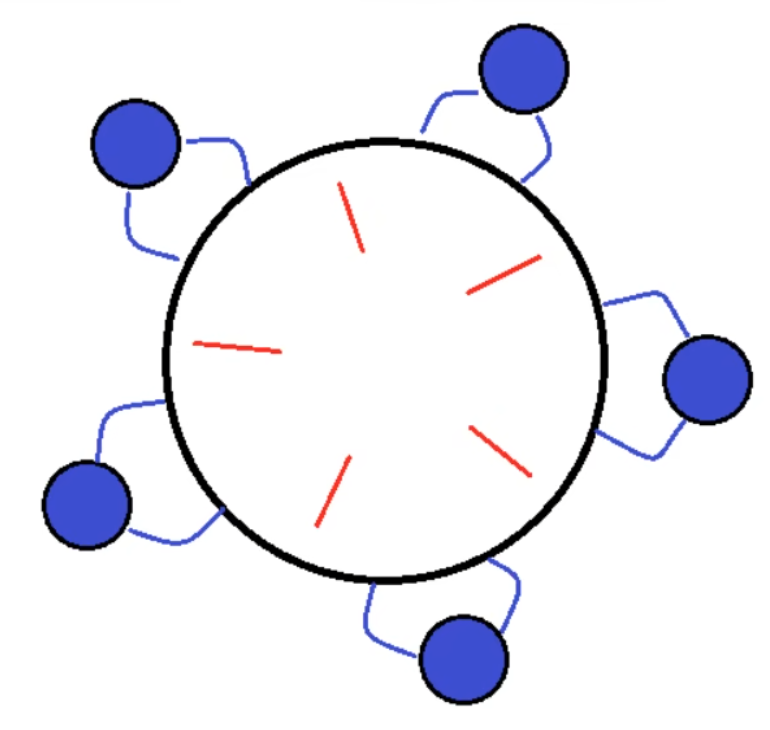

有五位哲学家，围坐在圆桌:

* 他们只做两件事，思考和吃饭，思考一会吃口饭，吃完饭后接着思考。
* 吃饭时要用两根筷子吃，桌上共有 5 根筷子，每位哲学家左右手边各有一根筷子。
* 如果筷子被身边的人拿着，自己就得等待

示例:

```java
@Slf4j(topic = "c.Test")
public class Test26 {
    public static void main(String[] args) {
        Chopstick c1 = new Chopstick("1");
        Chopstick c2 = new Chopstick("2");
        Chopstick c3 = new Chopstick("3");
        Chopstick c4 = new Chopstick("4");
        Chopstick c5 = new Chopstick("5");
        new Philosopher("苏格拉底", c1, c2).start();
        new Philosopher("柏拉图", c2, c3).start();
        new Philosopher("亚里士多德", c3, c4).start();
        new Philosopher("赫拉克利特", c4, c5).start();
        new Philosopher("阿基米德", c5, c1).start();
    }
}

@Slf4j(topic = "c.Test")
class Philosopher extends Thread {
    final Chopstick left;
    final Chopstick right;

    public Philosopher(String name, Chopstick left, Chopstick right) {
        super(name);
        this.left = left;
        this.right = right;
    }

    private void eat() {
        log.debug("eating...");
        Sleeper.sleepSeconds(1);
    }

    @Override
    public void run() {
        while (true) {
            // 获得左手筷子
            synchronized (left) {
                // 获得右手筷子
                synchronized (right) {
                    // 吃饭
                    eat();
                }
                // 放下右手筷子
            }
            // 放下左手筷子
        }
    }
}

class Chopstick {
    String name;

    public Chopstick(String name) {
        this.name = name;
    }

    @Override
    public String toString() {
        return "筷子{" + name + '}';
    }
}
```

#### 4.14.4. 活锁

活锁出现在两个线程互相改变对方的结束条件，最后谁也无法结束，例如

```java
@Slf4j(topic = "c.Test")
public class Test27 {
    static volatile int count = 5;

    public static void main(String[] args) {
        new Thread(() -> {
            while (count > 0) {
                Sleeper.sleepSeconds(1);
                count--;
                log.debug("count: {}", count);
            }
        }, "t1").start();

        new Thread(() -> {
            while (count < 10) {
                Sleeper.sleepSeconds(1);
                count++;
                log.debug("count: {}", count);
            }
        }, "t2").start();
    }
}
```

解决方案:

1. 交错线程的执行，不要同时执行
2. 增加一个 随机 睡眠时间

#### 4.14.5. 饥饿

很多教程中把饥饿定义为，一个线程由于优先级太低，始终得不到 CPU 调度执行，也不能够结束。

饥饿的情况不易演示，讲读写锁时会涉及饥饿问题

### 4.15. ReentrantLock

#### 4.15.1. 介绍

与 synchronized 相比，它的优势:

* 可中断
* 可以设置超时时间
* 可以设置为公平锁
* 支持多个条件变量

与 synchronized 一样，都支持可重入

语法:

```java
// 创建锁
static ReentrantLock lock = new ReentrantLock();

// 获取锁
reentrantLock.lock();

try {
    
    // 临界区

} finally {
    // 释放锁
    reentrantLock.unlock();
}
```

#### 4.15.2. 可重入

可重入 是指同一个线程如果首次获得了这把锁，那么因为它是这把锁的拥有者，因此有权利再次获取这把锁

如果是 不可重入锁，那么第二次获得锁时，自己也会被锁挡住

示例:

```java
@Slf4j(topic = "c.Test")
public class Test28 {
    static ReentrantLock lock = new ReentrantLock();

    public static void main(String[] args) {
        m1();
    }
    private static void m1() {
        lock.lock();
        try {
            log.debug("执行 m1");
            m2();
        } finally { lock.unlock(); }
    }
    private static void m2() {
        lock.lock();
        try {
            log.debug("执行 m2");
            m3();
        } finally { lock.unlock(); }
    }
    private static void m3() {
        lock.lock();
        try {
            log.debug("执行 m3");
        } finally { lock.unlock(); }
    }
}
```

#### 4.15.3. 可打断

```java
@Slf4j(topic = "c.Test")
public class Test29 {
    static ReentrantLock lock = new ReentrantLock();

    public static void main(String[] args) {
        Thread t1 = new Thread(() -> {
            try {
                // 获取到锁，则执行
                // 未获取锁，则等待，但可以被中断
                lock.lockInterruptibly();
            } catch (InterruptedException e) {
                log.debug("t1 等待时被打断，直接返回");
                return;
            }

            try {
                log.debug("t1 获得锁");
            } finally {
                lock.unlock();
            }
        }, "t1");

        log.debug("main 线程上锁");
        lock.lock();

        t1.start();
        sleepSeconds(1);
        t1.interrupt();
    }
    //=> 25:05.649 [main] - main 线程上锁
    //=> 25:05.652 [main] - 睡眠 1 秒
    //=> 25:06.659 [  t1] - t1 等待时被打断，直接返回
}
```

#### 4.15.4. 锁超时

```java
@Slf4j(topic = "c.Test")
public class Test30 {
    static ReentrantLock lock = new ReentrantLock();

    public static void main(String[] args) {
        Thread t1 = new Thread(() -> {
            if (!lock.tryLock()) {
                log.debug("t1 尝试马上获取锁: 失败");
            }
            try {
                if (lock.tryLock(2, TimeUnit.SECONDS)) {
                    log.debug("t1 尝试 2秒内 获取锁: 成功");
                } else {
                    log.debug("t1 尝试 2秒内 获取锁: 失败");
                    return;
                }
            } catch (InterruptedException e) {
                e.printStackTrace();
                return;
            }

            try {
                log.debug("t1 获得锁");
            } finally {
                lock.unlock();
            }
        }, "t1");

        log.debug("main 上锁");
        lock.lock();

        t1.start();
        sleepSeconds(1);
        log.debug("main 释放锁");
        lock.unlock();
    }
    //=> 40:25.851 [main] - main 上锁
    //=> 40:25.853 [  t1] - t1 尝试马上获取锁: 失败
    //=> 40:25.853 [main] - 睡眠 1 秒
    //=> 40:26.869 [main] - main 释放锁
    //=> 40:26.870 [  t1] - t1 尝试 2秒内 获取锁: 成功
    //=> 40:26.870 [  t1] - t1 获得锁
}
```

#### 4.15.5. 锁超时 - 解决哲学家就餐

```java
class Chopstick extends ReentrantLock {
    // ...
}

class Philosopher extends Thread {
    final Chopstick left;
    final Chopstick right;

    // ...
    
    @Override
    public void run() {
        while (true) {
            if (left.tryLock()) { // 获得左手筷子
                try {
                    if (right.tryLock()) { // 获得右手筷子
                        try {
                            eat(); // 吃饭
                        } finally {
                            right.unlock(); // 放下右手筷子
                        }
                    }
                } finally {
                    left.unlock(); // 放下左手筷子
                }

            }
        }
    }
}
```

#### 4.15.6. 公平锁

ReentrantLock 默认是不公平的

通过 `ReentrantLock lock = new ReentrantLock(true);` 创建公平锁

公平锁一般没有必要，会降低并发度

#### 4.15.7. 条件变量

synchronized 中也有条件变量，就是我们讲原理时那个 waitSet 休息室，当条件不满足时进入 waitSet 等待

ReentrantLock 的条件变量比 synchronized 强大之处在于，它是支持多个条件变量的，这就好比

* synchronized 是那些不满足条件的线程都在一间休息室等消息
* ReentrantLock 支持多间休息室，唤醒时也是按休息室来唤醒

使用要点：

* await 前需要获得锁
* await 执行后，会释放锁，进入 conditionObject 等待
* await 的线程被唤醒（或打断、或超时）取重新竞争 lock 锁
* 竞争 lock 锁成功后，从 await 后继续执行

基本使用:

```java
public class Test31 {
    static ReentrantLock lock = new ReentrantLock();

    public static void main(String[] args) throws InterruptedException {
        // 休息室 1
        Condition waitSet1 = lock.newCondition();
        // 休息室 2
        Condition waitSet2 = lock.newCondition();

        // 加锁
        lock.lock();

        // 在 休息室 1 等待
        waitSet1.await();

        // 唤醒 休息室 1 中的某个线程
        waitSet1.signal();
        // 唤醒 休息室 1 中的所有线程
        waitSet1.signalAll();
    }
}
```

### 4.16. 同步模式 - 固定运行顺序

先打印 2 再打印 1

#### 4.16.1. wait 和 notify

```java
@Slf4j(topic = "c.Test")
public class Test32 {
    static final Object lock = new Object();
    static boolean isT2Runed = false;

    public static void main(String[] args) throws InterruptedException {
        Thread t1 = new Thread(() -> {
            synchronized (lock) {
                while (!isT2Runed) {
                    log.debug("等待 t2 运行完毕");
                    try {
                        lock.wait();
                    } catch (InterruptedException e) {
                        e.printStackTrace();
                    }
                }
                log.debug("1");
            }
        }, "t1");

        Thread t2 = new Thread(() -> {
            synchronized (lock) {
                log.debug("2");
                isT2Runed = true;
                lock.notify();
            }
        }, "t2");

        t1.start();
        sleepSeconds(1);
        t2.start();
    }
    //=> 2:00.366 [main] - 睡眠 1 秒
    //=> 02:00.366 [  t1] - 等待 t2 运行完毕
    //=> 02:01.381 [  t2] - 2
    //=> 02:01.381 [  t1] - 1
}
```

#### 4.16.2. park 和 unpark

park 和 unpark 方法比较灵活，他俩谁先调用，谁后调用无所谓。

并且是以线程为单位进行『暂停』和『恢复』， 不需要『同步对象』和『运行标记』

```java
@Slf4j(topic = "c.Test")
public class Test33 {
    public static void main(String[] args) throws InterruptedException {
        Thread t1 = new Thread(() -> {
            LockSupport.park();
            log.debug("1");
        }, "t1");

        Thread t2 = new Thread(() -> {
            log.debug("2");
            LockSupport.unpark(t1);
        }, "t2");

        t1.start();
        sleepSeconds(1);
        t2.start();
    }
    //=> 08:10.488 [main] - 睡眠 1 秒
    //=> 08:11.505 [  t2] - 2
    //=> 08:11.507 [  t1] - 1
}
```

### 4.17. 同步模式 - 交替输出

线程 1 输出 a  5 次，

线程 2 输出 b  5 次，

线程 3 输出 c  5 次。

现在要求输出 abcabcabcabcabc 怎么实现

#### 4.17.1. wait 和 notify

```java
@Slf4j(topic = "c.Test")
public class Test34 {
    public static void main(String[] args) throws InterruptedException {
        WaitNotify wn = new WaitNotify(1, 5);
        new Thread(() -> wn.print("a", 1, 2), "t1").start();
        new Thread(() -> wn.print("b", 2, 3), "t1").start();
        new Thread(() -> wn.print("c", 3, 1), "t1").start();
    }
}

@AllArgsConstructor
class WaitNotify {
    // 等待标记
    private int flag;
    // 循环次数
    private int loopNumber;

    public void print(String content, int waitFlag, int nextFlag) {
        for (int i = 0; i < loopNumber; i++) {
            synchronized (this) {
                while (flag != waitFlag) {
                    try {
                        this.wait();
                    } catch (InterruptedException e) {
                        e.printStackTrace();
                    }
                }
                System.out.print(content);
                this.flag = nextFlag;
                this.notifyAll();
            }
        }
    }
}
```

#### 4.17.2. await 和 signal

```java
@Slf4j(topic = "c.Test")
public class Test35 {
    public static void main(String[] args) throws InterruptedException {
        AwaitSignal as = new AwaitSignal(5);
        Condition a = as.newCondition();
        Condition b = as.newCondition();
        Condition c = as.newCondition();

        new Thread(() -> as.print("a", a, b), "t1").start();
        new Thread(() -> as.print("b", b, c), "t2").start();
        new Thread(() -> as.print("c", c, a), "t3").start();

        sleepSeconds(1);

        as.start(a);
    }
}

@AllArgsConstructor
class AwaitSignal extends ReentrantLock {
    // 循环次数
    private int loopNumber;

    public void start(Condition first) {
        lock();
        try {
            first.signal();
        } finally {
            unlock();
        }
    }

    public void print(String content, Condition curr, Condition next) {
        for (int i = 0; i < loopNumber; i++) {
            lock();
            try {
                curr.await();
                System.out.print(content);
                next.signal();
            } catch (InterruptedException e) {
                e.printStackTrace();
            } finally {
              unlock();
            }
        }
    }
}
```

## 5. 共享模型 - 内存

上一章讲解的 Monitor 主要关注的是访问共享变量时，保证临界区代码的原子性

这一章我们进一步深入学习共享变量在多线程间的【可见性】问题与多条指令执行时的【有序性】问题

### 5.1. Java 内存模型

JMM 即 Java Memory Model，它定义了主存、工作内存抽象概念，底层对应着 CPU 寄存器、缓存、硬件内存、 CPU 指令优化等。

* 主存: 共享区域，如线程共享的 成员变量
* 工作内存: 线程私有的

JMM 体现在以下几个方面

* 原子性 - 保证指令不会受到线程上下文切换的影响
* 可见性 - 保证指令不会受 cpu 缓存的影响
* 有序性 - 保证指令不会受 cpu 指令并行优化的影响

### 5.2. 可见性

#### 5.2.1. 问题 - 退不出的循环

main 线程对 isRun 变量的修改对于 t1 线程不可见，导致了 t1 线程无法停止：

```java
@Slf4j(topic = "c.Test")
public class Test36 {
    static boolean isRun = true;

    public static void main(String[] args) throws InterruptedException {
        Thread t1 = new Thread(() -> {
            while (isRun) {
                // ...
            }
        }, "t1");

        t1.start();
        sleepSeconds(1);
        log.debug("停止 t1");
        isRun = false; // 线程 t1 不会停下来
    }
}
```

分析:

1. 初始状态， t1 线程刚开始从主内存读取了 isRun 的值到工作内存
2. 因为 t1 线程要频繁从主内存中读取 isRun 的值，JIT 编译器会将 isRun 的值缓存至自己工作内存中的高速缓存中， 减少对主存中 isRun 的访问，提高效率
3. 1 秒之后，main 线程修改了 isRun 的值，并同步至主存，而 t1 是从自己工作内存中的高速缓存中读取这个变量的值，结果永远是旧值

#### 5.2.2. 解决 - 退不出的循环

volatile（易变关键字）

它可以用来修饰成员变量和静态成员变量，他可以避免线程从自己的工作缓存中查找变量的值，必须到主存中获取它的值，线程操作 volatile 变量都是直接操作主存

```java
static volatile boolean isRun = true;
```

使用 `synchronized` 包裹 读写 isRun 的代码，也可以解决

#### 5.2.3. 可见性 vs 原子性

前面例子体现的实际就是可见性，它保证的是在多个线程之间，一个线程对 volatile 变量的修改对另一个线程可见， 不能保证原子性，仅用在一个写线程，多个读线程的情况

synchronized 语句块既可以保证代码块的原子性，也同时保证代码块内变量的可见性。
但缺点是 synchronized 是属于重量级操作，性能相对更低

如果在前面示例的死循环中加入 `System.out.println()` 会发现即使不加 volatile 修饰符，线程 t1 也能正确看到 对 isRun 变量的修改了，想一想为什么？

### 5.3. 终止模式 - 两阶段终止 - volatile

```java
@Slf4j(topic = "c.Test")
public class Test37 {
    static volatile boolean isRun = true;

    public static void main(String[] args) throws InterruptedException {
        TPTVolatile t = new TPTVolatile();
        t.start();
        Thread.sleep(3500);
        log.debug("stop");
        t.stop();
    }
}

// 停止标记用 volatile 是为了保证该变量在多个线程之间的可见性
// 我们的例子中，即主线程把它修改为 true 对 t1 线程可见
@Slf4j(topic = "c.Test")
class TPTVolatile {
    private Thread thread;
    private volatile boolean stop = false;

    public void start() {
        thread = new Thread(() -> {
            while (true) {
                if (stop) {
                    log.debug("料理后事");
                    break;
                }
                try {
                    Thread.sleep(1000);
                    log.debug("将结果保存");
                } catch (InterruptedException e) {
                    e.printStackTrace();
                }
                // 执行监控操作
            }
        }, "监控");
        thread.start();
    }

    public void stop() {
        stop = true;
        thread.interrupt();
    }
}
```

### 5.4. 同步模式 - 犹豫模式

Balking （犹豫）模式用在一个线程发现另一个线程或本线程已经做了某一件相同的事，那么本线程就无需再做了，直接结束返回

示例:

```java
@Slf4j(topic = "c.Test")
public class Test38 {
    public static void main(String[] args) throws InterruptedException {
        MonitorService m = new MonitorService();

        for (int i = 0; i < 100; i++) {
            new Thread(m::start, "t" + i).start();
        }
    }
}

@Slf4j(topic = "c.Test")
class MonitorService {
    private volatile boolean starting;

    public void start() {
        synchronized (this) {
            if (starting) {
                return;
            }
            starting = true;
        }

        // 只需要执行一次的代码
        log.info("已运行...");
    }
}
```

应用:

```java
public final class Singleton {
    private static Singleton INSTANCE = null;
    
    private Singleton() { }

    public static synchronized Singleton getInstance() {
        if (INSTANCE != null) {
            return INSTANCE;
        }

        INSTANCE = new Singleton();
        return INSTANCE;
    }
}
```

### 5.5. 有序性 - 指令重排

#### 5.5.1. 介绍

JVM 会在不影响正确性的前提下，可以调整语句的执行顺序，思考下面一段代码

```java
static int i;
static int j;

// 在某个线程内执行如下赋值操作
i = ...; 
j = ...;
```

可以看到，至于是先执行 i 还是 先执行 j ，对最终的结果不会产生影响。

```java
// 所以，上面代码真正执行时，既可以是
i = ...; 
j = ...;

// 也可以是
j = ...;
i = ...; 
```

这种特性称之为『指令重排』，多线程下『指令重排』会影响正确性。为什么要有重排指令这项优化呢？
从 CPU 执行指令的原理来理解一下吧

#### 5.5.2. 指令重排序优化

事实上，现代处理器会设计为一个时钟周期完成一条执行时间最长的 CPU 指令。

为什么这么做呢？可以想到指令还可以再划分成一个个更小的阶段，

例如，每条指令都可以分为 5 个阶段： 

1. 取指令
2. 指令译码
3. 执行指令
4. 内存访问
5. 数据写回

在不改变程序结果的前提下，这些指令的各个阶段可以通过重排序和组合来实现指令级并行，这一技术在 八九十年代 占据了计算架构的重要地位。

提示： 分阶段，分工是提升效率的关键！

指令重排的前提是，重排指令不能影响结果，例如

```java
// 可以重排的例子
int a = 10; // 指令1
int b = 20; // 指令2
System.out.println( a + b );

// 不能重排的例子
int a = 10; // 指令1
int b = a - 5; // 指令2
```

#### 5.5.3. 支持流水线的处理器

现代 CPU 支持多级指令流水线，

例如支持同时执行 取指令 - 指令译码 - 执行指令 - 内存访问 - 数据写回 的处理器，就可以称之为五级指令流水线。

这时 CPU 可以在一个时钟周期内，同时运行五条指令的不同阶段（相当于一条执行时间最长的复杂指令），IPC = 1，

本质上，流水线技术并不能缩短单条指令的执行时间，但它变相地提高了指令地吞吐率。

#### 5.5.4. 问题

```java
int num = 0;
boolean ready = false;

// 线程1 执行此方法
public void actor1(I_Result r) {
    if (ready) {
        r.r1 = num + num;
    } else {
        r.r1 = 1;
    }
}

// 线程2 执行此方法
public void actor2(I_Result r) { 
    num = 2;
    ready = true; 
}
```

I_Result 是一个对象，有一个属性 r1 用来保存结果，问，可能的结果有几种？

* 结果 1: 线程1 先执行，这时 ready = false，所以进入 else 分支结果为 1
* 结果 4: 线程2 执行到 ready = true，线程1 执行，这回进入 if 分支，结果为 4
* 结果 0: 线程2 执行 ready = true，切换到线程1，进入 if 分支，相加为 0，再切回线程2 执行 num = 2

这种现象叫做指令重排，是 JIT 编译器在运行时的一些优化，这个现象需要通过大量测试才能复现

借助 java 并发压测工具 [jcstress](https://wiki.openjdk.java.net/display/CodeTools/jcstress)

```shell
mvn archetype:generate 
    -DinteractiveMode=false 
    -DarchetypeGroupId=org.openjdk.jcstress - DarchetypeArtifactId=jcstress-java-test-archetype 
    -DarchetypeVersion=0.5 
    -DgroupId=cn.itcast 
    -DartifactId=ordering 
    -Dversion=1.0
```

执行上面的指令 会创建一个 maven 项目，修改 ConcurrencyTest 类:

```java
@JCStressTest
@Outcome(id = {"1", "4"}, expect = Expect.ACCEPTABLE, desc = "ok")
@Outcome(id = "0", expect = Expect.ACCEPTABLE_INTERESTING, desc = "!!!!")
@State
public class ConcurrencyTest {
    int num = 0;
    boolean ready = false;

    @Actor
    public void actor1(I_Result r) {
        if(ready) {
            r.r1 = num + num;
        } else {
            r.r1 = 1;
        }
    }
    
    @Actor
    public void actor2(I_Result r) {
        num = 2;
        ready = true;
    }
}
```

打 jar 包并运行:

```java
java -jar target/jcstress.jar
```

会输出我们感兴趣的结果，摘录其中一次结果：

```text
Observed state      Occurrences Expectation             Interpretation 
    0               1,652       ACCEPTABLE_INTERESTING  !!!! 
    1               46,460,657  ACCEPTABLE              ok 
    4               4,571,072   ACCEPTABLE              ok
```

可以看到，出现结果为 0 的情况有 1,652 次，虽然次数相对很少，但毕竟是出现了。

#### 5.5.5. 解决方法

volatile 修饰的变量，可以禁用指令重排

```java
volatile boolean ready = false;

public void actor2(I_Result r) {
    num = 2;
    // 禁止 ready 前面的代码 被重排序到 后面
    ready = true;
}
```

### 5.6. volatile - 原理

#### 5.6.1. 保证可见性

写屏障（sfence）保证在该屏障之前的，对共享变量的改动，都同步到主存当中:

```java
public void actor2(I_Result r) {
    num = 2;
    ready = true; 
    // 写屏障
    // ready 是 volatile 赋值带写屏障
}
```

读屏障（lfence）保证在该屏障之后，对共享变量的读取，加载的是主存中最新数据:

```java
public void actor1(I_Result r) {
    // 读屏障
    // ready 是 volatile 读取值带读屏障
    if (ready) {
        r.r1 = num + num;
    } else {
        r.r1 = 1;
    }
}
```

#### 5.6.2. 保证有序性

写屏障会确保指令重排序时，不会将写屏障之前的代码排在写屏障之后

读屏障会确保指令重排序时，不会将读屏障之后的代码排在读屏障之前

但不能解决指令交错：

* 写屏障仅仅是保证之后的读能够读到最新的结果，但不能保证读跑到它前面去
* 而有序性的保证也只是保证了本线程内相关代码不被重排序

#### 5.6.3. double-checked locking

```java
public final class Singleton {
    private Singleton() { }
    private static Singleton INSTANCE = null;

    public static Singleton getInstance() { 
        if (INSTANCE == null) { // t2
            // 首次访问会同步，而之后的使用没有 synchronized
            synchronized(Singleton.class) {
                if (INSTANCE == null) { // t1
                    INSTANCE = new Singleton();
                } 
            }
        }
        return INSTANCE;
    }
}
```

发生指令重排，如果 `new 对象` 与 `给 INSTANCE 赋值` 同时进行，会导致 t2 拿到未初始化完毕的 对象

解决:

```java
// 之前
private static Singleton INSTANCE = null;

// 之后
private static volatile Singleton INSTANCE = null;
```

### 5.7. happens-before

happens-before 规定了对共享变量的写操作对其它线程的读操作可见，它是可见性与有序性的一套规则总结，

抛开以下 happens-before 规则，JMM 并不能保证一个线程对共享变量的写，对于其它线程对该共享变量的读可见

规则 1. 线程解锁 m 之前对变量的写，对于接下来对 m 加锁的其它线程对该变量的读可见

```java
static int x;
static Object m = new Object();

new Thread(() -> {
    synchronized (m) {
        x = 10;
    }
}, "t1").start();

new Thread(() -> {
    synchronized (m) {
        System.out.println(x); //=> 10
    }
}, "t2").start();
```

规则 2. 线程对 volatile 变量的写，对接下来其它线程对该变量的读可见

```java
volatile static int x;

new Thread(() -> {
    x = 10;
}, "t1").start();

new Thread(() -> {
    System.out.println(x); //=> 10
}, "t2").start();
```

规则 3. 线程 start 前对变量的写，对该线程开始后对该变量的读可见

```java
static int x;

x = 10;

new Thread(() -> {
    System.out.println(x); //=> 10
}, "t2").start();
```

规则 4. 线程结束前对变量的写，对其它线程得知它结束后的读可见（比如其它线程调用 `t1.isAlive()` 或 `t1.join()` 等待它结束）

```java
static int x;

Thread t1 = new Thread(() -> {
    x = 10;
}, "t1");

t1.start();
t1.join();
System.out.println(x); //=> 10
```

规则 5. 线程 t1 打断 t2（interrupt）前对变量的写，对于其他线程得知 t2 被打断后对变量的读可见（通过 t2.interrupted 或 t2.isInterrupted）

```java
static int x;

public static void main (String[]args){
    Thread t2 = new Thread(() -> {
        while (true) {
            if (Thread.currentThread().isInterrupted()) {
                System.out.println(x);
                break;
            }
        }
    }, "t2");
    
    t2.start();
    
    new Thread(() -> {
        sleep(1);
        x = 10;
        t2.interrupt();
    }, "t1").start();
    
    while (!t2.isInterrupted()) {
        Thread.yield();
    }
    
    System.out.println(x);
}
```

规则 6. 对变量默认值（0，false，null）的写，对其它线程对该变量的读可见

规则 7. 具有传递性，如果 `x hb-> y` 并且 `y hb-> z` 那么有 `x hb-> z` ，配合 volatile 的防指令重排

```java
volatile static int x;
static int y;

new Thread(() -> {
    y = 10;
    x = 20;
}, "t1").start();

new Thread(() -> {
    // x=20 对 t2 可见, 同时 y=10 也对 t2 可见
    System.out.println(x);
}, "t2").start();
```

### 5.8. 线程安全单例

单例模式有很多实现方法，饿汉、懒汉、静态内部类、枚举类，

试分析每种实现下获取单例对象（即调用 getInstance）时的线程安全，并思考注释中的问题

饿汉式：类加载就会创建该单实例对象

懒汉式：类加载不会导致创建该单实例对象，而是首次使用该对象时才会创建

#### 5.8.1. 实现 1

```java
// 问题1：为什么加 final
// 避免被继承后 破坏其封装

// 问题2：如果实现了序列化接口, 还要做什么来防止反序列化破坏单例
// 反序列化时，如果该类有 readResolve，则直接调用拿到实例对象

public final class Singleton implements Serializable {
    // 问题3：为什么设置为私有? 是否能防止反射创建新的实例?
    // 避免通过 new 创建对象。不能阻止反射创建对象
    private Singleton() {}

    // 问题4：这样初始化是否能保证单例对象创建时的线程安全?
    // 可以。类加载时实例化对象
    private static final Singleton INSTANCE = new Singleton();

    // 问题5：为什么提供静态方法而不是直接将 INSTANCE 设置为 public, 说出你知道的理由
    // 返回实例前可以额外做一些处理
    public static Singleton getInstance() {
        return INSTANCE;
    }

    public Object readResolve() {
        return INSTANCE;
    }
}
```

#### 5.8.2. 实现 2

```java
public final class Singleton {
    private Singleton() { }

    private static Singleton INSTANCE = null;

    // 分析这里的线程安全, 并说明有什么缺点
    // 锁的范围有点大
    public static synchronized Singleton getInstance() {
        if ( INSTANCE != null ){
            return INSTANCE;
        } 

        INSTANCE = new Singleton();
        return INSTANCE;
    }
}
```

#### 5.8.3. 实现 3

```java
public final class Singleton {
    private Singleton() { }
    // 问题1：解释为什么要加 volatile ?
    // 禁止 `INSTANCE = new Singleton();` 指令重排 导致先赋值后调用构造函数
    private static volatile Singleton INSTANCE = null;

    // 问题2：对比实现3, 说出这样做的意义 
    // 创建完实例后，不用再加锁
    public static Singleton getInstance() {
        if (INSTANCE != null) { 
            return INSTANCE;
        }
        synchronized (Singleton.class) { 
            // 问题3：为什么还要在这里加为空判断, 之前不是判断过了吗
            // 避免创建多个实例
            if (INSTANCE != null) {
                return INSTANCE;
            }
            INSTANCE = new Singleton(); 
            return INSTANCE;
        } 
    }
}
```

#### 5.8.4. 实现 4

```java
public final class Singleton {
    private Singleton() { }
    
    // 问题1：属于懒汉式还是饿汉式
    // 懒汉式。用到该类时才会加载
    private static class LazyHolder {
        static final Singleton INSTANCE = new Singleton();
    }

    // 问题2：在创建时是否有并发问题
    // 没有
    public static Singleton getInstance() {
        return LazyHolder.INSTANCE; // 执行该代码时才会加载 LazyHolder 类
    }
}
```

#### 5.8.5. 实现 4

```java
public final class Singleton {
    private Singleton() { }
    
    // 问题1：属于懒汉式还是饿汉式
    // 懒汉式。用到该类时才会加载
    private static class LazyHolder {
        static final Singleton INSTANCE = new Singleton();
    }

    // 问题2：在创建时是否有并发问题
    // 没有
    public static Singleton getInstance() {
        return LazyHolder.INSTANCE; // 执行该代码时才会加载 LazyHolder 类
    }
}
```

### 5.9. 本章小结

可见性 - 由 JVM 缓存优化引起

有序性 - 由 JVM 指令重排序优化引起

happens-before 规则

原理方面:

* CPU 指令并行
* volatile

模式方面:

* 两阶段终止模式的 volatile 改进
* 同步模式之 balking

## 6. 共享模型 - 无锁

CAS 与 volatile

原子整数

原子引用

原子累加器

Unsafe

### 6.1. 保护共享资源

#### 6.1.1. 接口

```java
interface Account {
    // 获取余额
    Integer getBalance();

    // 取款
    void withdraw(Integer amount);

    /**
     * 方法内会启动 1000 个线程，每个线程做 -10 元 的操作
     * 如果初始余额为 10000 那么正确的结果应当是 0
     */
    static void demo(Account account) {
        List<Thread> ts = new ArrayList<>();
        long start = System.nanoTime();
        for (int i = 0; i < 1000; i++) {
            ts.add(new Thread(() -> {
                account.withdraw(10);
            }));
        }
        ts.forEach(Thread::start);
        ts.forEach(t -> {
            try {
                t.join();
            } catch (InterruptedException e) {
                e.printStackTrace();
            }
        });

        long end = System.nanoTime();
        System.out.println(String.format("余额: %s . 耗时: %s ms", account.getBalance(),  (end - start) / 1000_000));
    }
}
```

#### 6.1.2. 加锁实现 - synchronized

```java
@Slf4j(topic = "c.Test")
public class Test39 {
    public static void main(String[] args) throws InterruptedException {
        Account.demo(new AccountWithSync(10000));
    }
}

@AllArgsConstructor
class AccountWithSync implements Account {
    private Integer balance;
    @Override
    public synchronized Integer getBalance() {
        return balance;
    }

    @Override
    public synchronized void withdraw(Integer amount) {
        this.balance -= amount;
    }
}
```

#### 6.1.3. 无锁实现 - cas

```java
class AccountWithCas implements Account {
    private AtomicInteger balance;

    public AccountWithCas(Integer balance) {
        this.balance = new AtomicInteger(balance);
    }

    @Override
    public Integer getBalance() {
        return balance.get();
    }

    @Override
    public void withdraw(Integer amount) {
        while (true) {
            // 改前 的余额
            int prev = balance.get();
            // 改后 的余额
            int next = prev - amount;
            // 修改
            boolean success = balance.compareAndSet(prev, next);

            if (success) {
                break;
            }
        }
    }
}
```

### 6.2. CAS

#### 6.2.1. 工作方式

前面看到的 AtomicInteger 的解决方法，内部并没有用锁来保护共享变量的线程安全。那么它是如何实现的呢？

其中的关键是 compareAndSet，它的简称就是 CAS （也有 Compare And Swap 的说法），它必须是原子操作。

```java
@Override
public void withdraw(Integer amount) {
    //  需要不断尝试，直到成功为止
    while (true) {
        // 拿最新的值，比如 10000
        int prev = balance.get();
        int next = prev - amount;

        // 执行交换时，如果 10000 不是最新值，则交换失败
        // 交换失败，则尝试下一次
        boolean success = balance.compareAndSet(prev, next);

        if (success) {
            break;
        }
    }
}
```

#### 6.2.2. volatile

获取共享变量时，为了保证该变量的可见性，需要使用 volatile 修饰。

它可以用来修饰成员变量和静态成员变量，他可以避免线程从自己的工作缓存中查找变量的值，必须到主存中获取它的值，线程操作 volatile 变量都是直接操作主存。

即一个线程对 volatile 变量的修改，对另一个线程可见。

注意: volatile 仅仅保证了共享变量的可见性，让其它线程能够看到最新值，但不能解决指令交错问题（不能保证原子性）

CAS 必须借助 volatile 才能读取到共享变量的最新值来实现【比较并交换】的效果

#### 6.2.3. 效率分析 - 无锁效率高

无锁情况下，即使重试失败，线程始终在高速运行，没有停歇，而 synchronized 会让线程在没有获得锁的时候，发生上下文切换，进入阻塞。

打个比喻，线程就好像高速跑道上的赛车，高速运行时，速度超快，一旦发生上下文切换，就好比赛车要减速、熄火， 等被唤醒又得重新打火、启动、加速... 恢复到高速运行，代价比较大

但无锁情况下，因为线程要保持运行，需要额外 CPU 的支持，CPU 在这里就好比高速跑道，没有额外的跑道，线程想高速运行也无从谈起，虽然不会进入阻塞，但由于没有分到时间片，仍然会进入可运行状态，还是会导致上下文切换。

#### 6.2.4. CAS 的特点

结合 CAS 和 volatile 可以实现无锁并发，适用于线程数少、多核 CPU 的场景下。

CAS 是基于乐观锁的思想：最乐观的估计，不怕别的线程来修改共享变量，就算改了也没关系，我吃亏点再重试呗。

synchronized 是基于悲观锁的思想：最悲观的估计，得防着其它线程来修改共享变量，我上了锁你们都别想改，我改完了解开锁，你们才有机会。

CAS 体现的是无锁并发、无阻塞并发，请仔细体会这两句话的意思:

* 因为没有使用 synchronized，所以线程不会陷入阻塞，这是效率提升的因素之一
* 但如果竞争激烈，可以想到重试必然频繁发生，反而效率会受影响

### 6.3. 原子整数

J.U.C 并发包提供了：

* AtomicBoolean
* AtomicInteger
* AtomicLong

#### 6.3.1. 基本用法 - AtomicInteger

```java
AtomicInteger i = new AtomicInteger(0);

// 先获取 再加 1，类似于 i++
i.getAndIncrement(); //=> 结果: 0 。i 的值: 1
 
// 先加 1 再获取，类似于 ++i
i.incrementAndGet(); //=> 结果: 2 。i 的值: 2
 
// 先减 1 再获取，类似于 --i
i.decrementAndGet(); //=> 结果: 1 。i 的值: 1
 
// 先获取 再减 1，类似于 i--
i.getAndDecrement(); //=> 结果: 1 。i 的值: 0
 
// 先获取 再加 5
i.getAndAdd(5);  //=> 结果: 0 。i 的值: 5
 
// 先加 -5 再获取
i.addAndGet(-5); //=> 结果: 0 。i 的值: 0
```

#### 6.3.2. updateAndGet

```java
@Slf4j(topic = "c.Test")
public class Test40 {
    public static void main(String[] args) throws InterruptedException {
        AtomicInteger atomicInteger = new AtomicInteger(1);

        // 先更新 后获取
        int result1 = atomicInteger.updateAndGet(value -> value * 2); //=> 2

        // 先获取 后更新
        // atomicInteger.getAndUpdate()

        int result2 = updateAndGet(atomicInteger, value -> value * 2); //=> 4

        log.debug("result1={}, result2={}", result1, result2);
    }

    // 自定义实现
    public static int updateAndGet(AtomicInteger i, Function<Integer, Integer> updateFunction) {
        while (true) {
            int prev = i.get();
            int next = updateFunction.apply(prev);
            if (i.compareAndSet(prev, next)) {
                return next;
            }
        }
    }
}
```

### 6.4. 原子引用

#### 6.4.1. AtomicReference

```java
@Slf4j(topic = "c.Test")
public class Test41 {
    public static void main(String[] args) throws InterruptedException {
        DecimalAccount.demo(new DecimalAccountSafeCas(new BigDecimal("10000")));
    }
}

class DecimalAccountSafeCas implements DecimalAccount {
    AtomicReference<BigDecimal> ref;

    public DecimalAccountSafeCas(BigDecimal balance) {
        ref = new AtomicReference<>(balance);
    }

    @Override
    public BigDecimal getBalance() {
        return ref.get();
    }

    @Override
    public void withdraw(BigDecimal amount) {
        while (true) {
            BigDecimal prev = ref.get();
            BigDecimal next = prev.subtract(amount);
            if (ref.compareAndSet(prev, next)) {
                break;
            }
        }
    }
}

interface DecimalAccount {
    // 获取余额
    BigDecimal getBalance();

    // 取款
    void withdraw(BigDecimal amount);

    /**
     * 方法内会启动 1000 个线程，每个线程做 -10 元 的操作
     * 如果初始余额为 10000 那么正确的结果应当是 0
     */
    static void demo(DecimalAccount account) {
        List<Thread> ts = new ArrayList<>();
        for (int i = 0; i < 1000; i++) {
            ts.add(new Thread(() -> {
                account.withdraw(BigDecimal.TEN);
            }));
        }
        ts.forEach(Thread::start);
        ts.forEach(t -> {
            try {
                t.join();
            } catch (InterruptedException e) {
                e.printStackTrace();
            }
        });
        System.out.println(String.format("余额: %s", account.getBalance()));
    }
}
```

#### 6.4.2. ABA 问题

```java
@Slf4j(topic = "c.Test")
public class Test42 {
    public static void main(String[] args) throws InterruptedException {
        AtomicReference<String> ref = new AtomicReference<>("A");

        String prev = ref.get();
        String next = "C";

        // 中途对其进行更改: A -> B -> A
        log.debug("A -> B: {}", ref.compareAndSet(ref.get(), "B"));
        log.debug("B -> A: {}", ref.compareAndSet(ref.get(), "A"));

        log.debug("A -> C: {}", ref.compareAndSet(prev, next));
    }
    //=> 22:13.169 [main] - A -> B: true
    //=> 22:13.172 [main] - B -> A: true
    //=> 22:13.172 [main] - A -> C: true
}
```

仅能判断出共享变量的值与最初值 A 是否相同，不能感知到这种从 A 改为 B 又 改回 A 的情况，

#### 6.4.3. AtomicStampedReference - 版本号

仅比较值是不够的，需要再加一个版本号

```java
@Slf4j(topic = "c.Test")
public class Test43 {
    public static void main(String[] args) throws InterruptedException {
        AtomicStampedReference<String> ref = new AtomicStampedReference<>("A", 0);

        String prev = ref.getReference();
        final int prevStamp = ref.getStamp();
        String next = "C";

        int stamp = ref.getStamp();
        log.debug("A -> B: {} . stamp: {}", ref.compareAndSet(ref.getReference(), "B", stamp, stamp + 1), stamp);

        stamp = ref.getStamp();
        log.debug("B -> A: {} . stamp: {}", ref.compareAndSet(ref.getReference(), "A", stamp, stamp + 1), stamp);

        log.debug("A -> C: {} . stamp: {}", ref.compareAndSet(prev, next, prevStamp, prevStamp + 1), prevStamp);
    }
    //=> 35:36.285 [main] - A -> B: true . stamp: 0
    //=> 35:36.289 [main] - B -> A: true . stamp: 1
    //=> 35:36.289 [main] - A -> C: false . stamp: 0
}
```

#### 6.4.4. AtomicMarkableReference - 是否变更

AtomicStampedReference 可以给原子引用加上版本号，追踪原子引用整个的变化过程，如： `A -> B -> A -> C` ，通过AtomicStampedReference，我们可以知道，引用变量中途被更改了几次。

但是有时候，并不关心引用变量更改了几次，只是单纯的关心是否更改过，所以就有了 AtomicMarkableReference

```java
@Slf4j(topic = "c.Test")
public class Test44 {
    public static void main(String[] args) throws InterruptedException {
        AtomicMarkableReference<Person> ref = new AtomicMarkableReference<>(new Person("张三"), true);

        Person prev = ref.getReference();

        // 中途有人修改
        log.debug("张三 -> 张三: {}", ref.compareAndSet(prev, prev, true, false));

        log.debug("张三 -> 李四: {}", ref.compareAndSet(prev, new Person("李四"), true, false));
    }
    //=> 53:17.373 [main] - 张三 -> 张三: true
    //=> 53:17.375 [main] - 张三 -> 李四: false

    @AllArgsConstructor
    static class Person {
        public String name;
    }
}
```

### 6.5. 原子数组

AtomicIntegerArray

AtomicLongArray

AtomicReferenceArray

#### 6.5.1. 函数式接口

| 函数式接口 | 功能 | 解释 | 示例 |
| - | - | - | - |
| Supplier | 提供者 | 无中生有 | `() -> 结果` |
| Function | 函数 | 一个参数 一个结果 | `(参数) -> 结果` |
| BiFunction | 函数 | 两个参数 一个结果 | `(参数1, 参数2) -> 结果` |
| Consumer | 消费者 | 一个参数 没有结果 | `(参数) -> Void` |
| BiConsumer | 消费者 | 两个参数 没有结果 | `(参数1, 参数2) -> Void` |

```java
private static <T> void demo(
        Supplier<T> arraySupplier,
        Function<T, Integer> lengthFun,
        BiConsumer<T, Integer> putConsumer,
        Consumer<T> printConsumer) {
    List<Thread> ts = new ArrayList<>();
    T array = arraySupplier.get();
    int length = lengthFun.apply(array);
    for (int i = 0; i < length; i++) {
        // 每个线程对数组作 10000 次操作
        ts.add(new Thread(() -> {
            for (int j = 0; j < 10000; j++) {
                putConsumer.accept(array, j % length);
            }
        }));
    }
    ts.forEach(Thread::start); // 启动所有线程
    ts.forEach(t -> {
        try {
            t.join();
        } catch (InterruptedException e) {
            e.printStackTrace();
        }
    }); // 等所有线程结束
    
    printConsumer.accept(array);
}
```

#### 6.5.2. 不安全的数组 - 普通数组

```java
demo(
        ()->new int[10],
        (array)->array.length,
        (array, index) -> array[index]++,
        array-> System.out.println(Arrays.toString(array))
);
//=> [4118, 4081, 4017, 4022, 3927, 3921, 4100, 4162, 4242, 4219]
```

#### 6.5.3. 安全的数组 - AtomicIntegerArray

```java
demo(
        ()-> new AtomicIntegerArray(10),
        (array) -> array.length(),
        (array, index) -> array.getAndIncrement(index),
        array -> System.out.println(array)
);
//=> [10000, 10000, 10000, 10000, 10000, 10000, 10000, 10000, 10000, 10000]
```

### 6.6. 字段更新器

AtomicReferenceFieldUpdater: 针对 引用类型 的字段

AtomicIntegerFieldUpdater: 针对 整形 的字段

AtomicLongFieldUpdater: 针对 长整形 的字段

利用字段更新器，可以针对对象的某个域（Field）进行原子操作，只能配合 volatile 修饰的字段使用，否则会出现异常

示例:

```java
@Slf4j(topic = "c.Test")
public class Test46 {
    private volatile int number;

    public static void main(String[] args) {
        AtomicReferenceFieldUpdater<Student, String> updater = AtomicReferenceFieldUpdater.newUpdater(Student.class, String.class, "name");

        Student student = new Student();

        log.debug("student.name, null -> 张三: {}. student={}", updater.compareAndSet(student, null, "张三"), student);
        //=> true

        AtomicIntegerFieldUpdater<Test46> numUpdater = AtomicIntegerFieldUpdater.newUpdater(Test46.class, "number");

        Test46 test46 = new Test46();
        log.debug("test46.number, 0 -> 1: {}. test46.number={}", numUpdater.compareAndSet(test46, 0, 1), test46.number);
        //=> true
    }
}

@Data
class Student {
    public volatile String name;
}
```

### 6.7. 原子累加器

相关类:

* LongAdder
* LongAccumulator
* DoubleAdder
* DoubleAccumulator

虽然 AtomicLong 也有累加的功能，但是 LongAdder 性能更好

```java
public class Test47 {
    public static void main(String[] args) throws InterruptedException {
        demo(() -> new AtomicLong(), adder -> adder.getAndIncrement());
        //=> 20000000 cost:374

        demo(() -> new LongAdder(), adder -> adder.increment());
        //=> 20000000 cost:39
    }

    private static <T> void demo(Supplier<T> adderSupplier, Consumer<T> action) {
        T adder = adderSupplier.get();
        long start = System.nanoTime();
        List<Thread> ts = new ArrayList<>();
        // 4 个线程，每人累加 50 万
        for (int i = 0; i < 40; i++) {
            ts.add(new Thread(() -> {
                for (int j = 0; j < 500000; j++) {
                    action.accept(adder);
                }
            }));
        }
        ts.forEach(t -> t.start());
        ts.forEach(t -> {
            try {
                t.join();
            } catch (InterruptedException e) {
                e.printStackTrace();
            }
        });
        long end = System.nanoTime();
        System.out.println(adder + " cost:" + (end - start) / 1000_000);
    }
}
```

### 6.8. LongAdder 原理

LongAdder 是并发大师 @author Doug Lea （大哥李）的作品，设计的非常精巧

LongAdder 类有几个关键域

```java
// 累加单元数组, 懒惰初始化
transient volatile Cell[] cells;

// 基础值, 如果没有竞争, 则用 cas 累加这个域
transient volatile long base;

// 在 cells 创建或扩容时, 置为 1, 表示加锁
transient volatile int cellsBusy;
```

#### 6.8.1. cas 锁

```java
// 不要用于实践！！！
public class LockCas {
    private AtomicInteger state = new AtomicInteger(0);

    public void lock() {
        // 如果已上锁，则不停 “空转” 消耗 CPU
        while (true) {
            if (state.compareAndSet(0, 1)) {
                break;
            }
        }
    }

    public void unlock() {
        log.debug("unlock...");
        state.set(0);
    }
}
```

#### 6.8.2. 缓存行伪共享

其中 Cell 即为累加单元

```java
// 防止缓存行伪共享
@sun.misc.Contended
static final class Cell {
 volatile long value;
 Cell(long x) { value = x; }
 
 // 最重要的方法, 用来 cas 方式进行累加, prev 表示旧值, next 表示新值
 final boolean cas(long prev, long next) {
    return UNSAFE.compareAndSwapLong(this, valueOffset, prev, next);
 }
 // 省略不重要代码
}
```

得从缓存说起，缓存与内存的速度比较

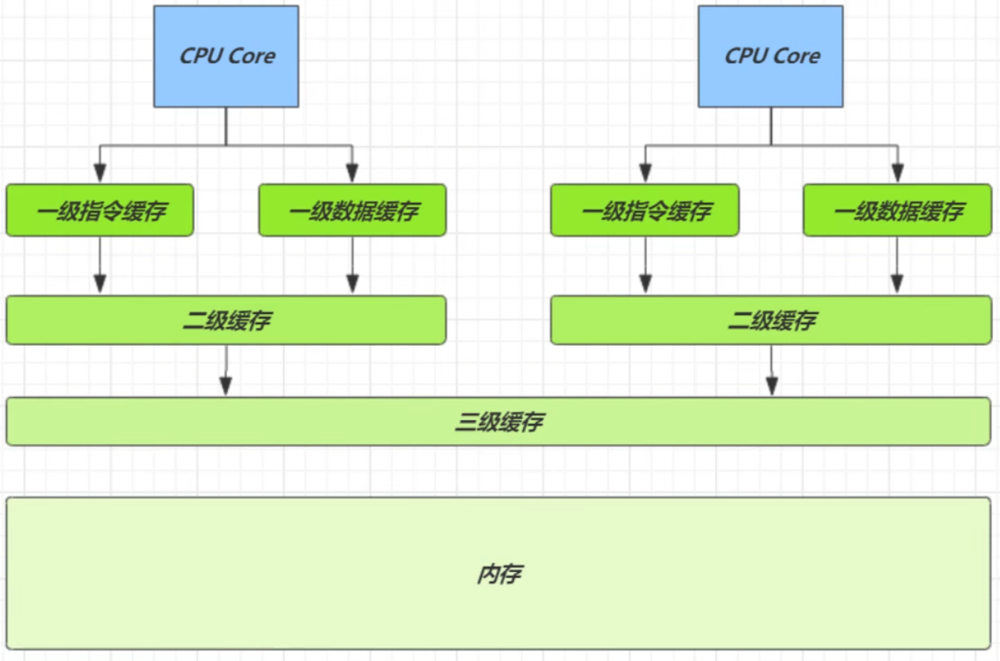

| 从 cpu 到 | 大约需要的时钟周期 |
| - | - |
| 寄存器 | 1 cycle (4GHz 的 CPU 约为0.25ns) |
| L1 | 3~4 cycle |
| L2 | 10~20 cycle |
| L3 | 40~45 cycle |
| 内存 | 120~240 cycle |

因为 CPU 与 内存的速度差异很大，需要靠预读数据至缓存来提升效率。

而缓存以缓存行为单位，每个缓存行对应着一块内存，一般是 64 byte（8 个 long）

缓存的加入会造成数据副本的产生，即同一份数据会缓存在不同核心的缓存行中

CPU 要保证数据的一致性，如果某个 CPU 核心更改了数据，其它 CPU 核心对应的整个缓存行必须失效

因为 Cell 是数组形式，在内存中是连续存储的，一个 Cell 为 24 字节（16 字节的对象头和 8 字节的 value），
因此缓存行可以存下 2 个的 Cell 对象。这样问题来了：

* Core-0 要修改 `Cell[0]`
* Core-1 要修改 `Cell[1]`

无论谁修改成功，都会导致对方 Core 的缓存行失效，比如 Core-0 中 `Cell[0]=6000, Cell[1]=8000` 要累加，这时会让 Core-1 的缓存行失效

@sun.misc.Contended 用来解决这个问题，它的原理是在使用此注解的对象或字段的前后各增加 128 字节大小的 padding，
从而让 CPU 将对象预读至缓存时占用不同的缓存行，这样，不会造成对方缓存行的失效

### 6.9. Unsafe

#### 6.9.1. 获取

Unsafe 对象提供了非常底层的，操作内存、线程的方法，Unsafe 对象不能直接调用，只能通过反射获得

```java
public class UnsafeAccessor {
    static Unsafe unsafe;
    
    static {
        try { 
            Field theUnsafe = Unsafe.class.getDeclaredField("theUnsafe");
            theUnsafe.setAccessible(true);
            unsafe = (Unsafe) theUnsafe.get(null);
        } catch (NoSuchFieldException | IllegalAccessException e) {
            throw new Error(e);
        }
    }

    static Unsafe getUnsafe() {
        return unsafe;
    }
}
```

## 7. 共享模型 - 不可变

不可变类的使用

不可变类设计

无状态类设计

### 7.1. 日期转换的问题

#### 7.1.1. 问题提出

由于 SimpleDateFormat 不是线程安全的，下面的代码在运行时有很大几率出现 java.lang.NumberFormatException 或者出现不正确的日期解析结果

```java
@Slf4j(topic = "c.Test")
public class Test01 {
    public static void main(String[] args) {
        SimpleDateFormat sdf = new SimpleDateFormat("yyyy-MM-dd");
        for (int i = 0; i < 10; i++) {
            new Thread(() -> {
                try {
                    log.debug("{}", sdf.parse("1951-04-21"));
                } catch (Exception e) {
                    log.error("日期转换异常:", e);
                }
            }, "t" + i).start();
        }
    }
    /*
    17:02.422 [  t3] - 日期转换异常:
    java.lang.NumberFormatException: multiple points
    
    17:02.422 [  t1] - 日期转换异常:
    java.lang.NumberFormatException: multiple points

    17:02.422 [  t4] - 日期转换异常:
    java.lang.NumberFormatException: empty String

    17:02.422 [  t0] - 日期转换异常:
    java.lang.NumberFormatException: multiple points

    17:02.422 [  t2] - 日期转换异常:
    java.lang.NumberFormatException: multiple points

    17:02.422 [  t8] - Sat Dec 29 00:00:00 CST 1956
    17:02.422 [  t5] - Sat Apr 21 00:00:00 CST 1951
    17:02.422 [  t9] - Wed Apr 21 00:00:00 CST 2100
    17:02.422 [  t6] - Sat Apr 21 00:00:00 CST 1951
    17:02.422 [  t7] - Sat Apr 21 00:00:00 CST 1951
     */
}
```

#### 7.1.2. 同步锁 - synchronized

```java
SimpleDateFormat sdf = new SimpleDateFormat("yyyy-MM-dd");
for (int i = 0; i < 10; i++) {
    new Thread(() -> {
        synchronized (sdf) {
            try {
                log.debug("{}", sdf.parse("1951-04-21"));
            } catch (Exception e) {
                log.error("日期转换异常:", e);
            }
        }
    }, "t" + i).start();
}
```

这样虽能解决问题，但带来的是性能上的损失，并不算很好

#### 7.1.3. 不可变日期格式化器 - DateTimeFormatter

如果一个对象不能修改其内部状态（属性），那么它就是线程安全的，因为不存在并发修改啊！这样的对象在 Java 中有很多，例如在 Java 8 后，提供了一个新的日期格式化类

```java
DateTimeFormatter dtf = DateTimeFormatter.ofPattern("yyyy-MM-dd");
for (int i = 0; i < 10; i++) {
    new Thread(() -> {
        LocalDate localDate = dtf.parse("2018-10-01", LocalDate::from);
        log.debug("{}", localDate);
    }, "t" + i).start();
}
```

可以看 DateTimeFormatter 的文档：

```text
This class is immutable and thread-safe.
```

不可变对象，实际是另一种避免竞争的方式

### 7.2. 不可变设计

另一个大家更为熟悉的 String 类也是不可变的，以它为例，说明一下不可变设计的要素

```java
public final class String
    implements java.io.Serializable, Comparable<String>, CharSequence {
    
    /** The value is used for character storage. */
    private final char value[];
    
    /** Cache the hash code for the string */
    private int hash; // Default to 0

    // ...
}
```

#### 7.2.1. final 的使用

发现该类、类中所有属性都是 final 的

* 属性用 final 修饰保证了该属性是只读的，不能修改
* 类用 final 修饰保证了该类中的方法不能被覆盖，防止子类无意间破坏不可变性

#### 7.2.2. 保护性拷贝

substring: 内部是调用 String 的构造方法创建了一个新字符串

这种通过创建副本对象来避免共享的手段称之为【保护性拷贝（defensive copy）】

### 7.3. 享元模式

Flyweight pattern. 当需要重用数量有限的同一类对象时

#### 7.3.1. 包装类

在JDK中 Boolean，Byte，Short，Integer，Long，Character 等包装类提供了 valueOf 方法，

例如 Long 的 valueOf 会缓存 -128~127 之间的 Long 对象，在这个范围之间会重用对象，
大于这个范围，才会新建 Long 对象：

```java
public static Long valueOf(long l) {
    final int offset = 128;
    if (l >= -128 && l <= 127) { // will cache
        return LongCache.cache[(int)l + offset];
    }
    return new Long(l);
}
```

Byte, Short, Long 缓存的范围都是 -128~127

Character 缓存的范围是 0~127

Integer的默认范围是 -128~127

* 最小值不能变
* 最大值可以通过调整虚拟机参数 `-Djava.lang.Integer.IntegerCache.high` 来改变

Boolean 缓存了 TRUE 和 FALSE

#### 7.3.2. String 串池

略

#### 7.3.3. BigDecimal BigInteger

略

### 7.4. DIY - 自定义连接池

例如：一个线上商城应用，QPS 达到数千，如果每次都重新创建和关闭数据库连接，性能会受到极大影响。

这时预先创建好一批连接，放入连接池。

一次请求到达后，从连接池获取连接，使用完毕后再还回连接池，这样既节约了连接的创建和关闭时间，也实现了连接的重用，不至于让庞大的连接数压垮数据库。

```java
@Slf4j(topic = "c.Test")
public class Test04 {
    public static void main(String[] args) {
        Pool pool = new Pool(2);
        for (int i = 0; i < 5; i++) {
            new Thread(() -> {
                Connection conn = pool.borrow();
                try {
                    Thread.sleep(new Random().nextInt(1000));
                } catch (InterruptedException e) {
                    e.printStackTrace();
                }
                pool.free(conn);
            }).start();
        }
    }
}

@Slf4j(topic = "c.Test")
class Pool {
    // 1. 连接池大小
    private final int poolSize;
    // 2. 连接对象数组
    private Connection[] connections;
    // 3. 连接状态数组 0 表示空闲， 1 表示繁忙
    private AtomicIntegerArray states;

    // 4. 构造方法初始化
    public Pool(int poolSize) {
        this.poolSize = poolSize;
        this.connections = new Connection[poolSize];
        this.states = new AtomicIntegerArray(new int[poolSize]);
        for (int i = 0; i < poolSize; i++) {
            connections[i] = new MockConnection("连接" + (i + 1));
        }
    }

    // 5. 借连接
    public Connection borrow() {
        while (true) {
            for (int i = 0; i < poolSize; i++) {
                // 获取空闲连接
                if (states.get(i) == 0) {
                    if (states.compareAndSet(i, 0, 1)) {
                        log.debug("borrow {}", connections[i]);
                        return connections[i];
                    }
                }
            }
            // 如果没有空闲连接，当前线程进入等待
            synchronized (this) {
                try {
                    log.debug("wait...");
                    this.wait();
                } catch (InterruptedException e) {
                    e.printStackTrace();
                }
            }
        }
    }

    // 6. 归还连接
    public void free(Connection conn) {
        for (int i = 0; i < poolSize; i++) {
            if (connections[i] == conn) {
                states.set(i, 0);
                synchronized (this) {
                    log.debug("free {}", conn);
                    this.notifyAll();
                }
                break;
            }
        }
    }
}

@Data
@AllArgsConstructor
class MockConnection implements Connection {
    private String name;
    // ...
}
```

以上实现没有考虑：

* 连接的动态增长与收缩
* 连接保活（可用性检测）
* 等待超时处理
* 分布式 hash

对于关系型数据库，有比较成熟的连接池实现，例如c3p0, druid等 

对于更通用的对象池，可以考虑使用 apache commons pool，例如 redis 连接池可以参考 jedis 中关于连接池的实现

### 7.5. final-原理

#### 7.5.1. 设置 final 变量的原理

理解了 volatile 原理，再对比 final 的实现就比较简单了

```java
public class TestFinal {
    final int a = 20;
}
```

字节码

```text
0: aload_0
1: invokespecial #1     // Method java/lang/Object."<init>":()V
4: aload_0
5: bipush 20
7: putfield #2          // Field a:I
    <-- 写屏障
10: return
```

发现 final 变量的赋值也会通过 putfield 指令来完成，
同样在这条指令之后也会加入写屏障，保证在其它线程读到它的值时不会出现为 0 的情况

#### 7.5.2. 获取 final 变量的原理

用 final 修饰的变量，会将其拷贝一份到栈内存中，而不是去主存中取

### 7.6. 无状态

在 web 阶段学习时，设计 Servlet 时为了保证其线程安全，都会有这样的建议 —— 不要为 Servlet 设置成员变量。

这种没有任何成员变量的类是线程安全的

因为成员变量保存的数据也可以称为状态信息，因此没有成员变量就称之为【无状态】

## 8. 并发工具

线程池

JUC

disruptor

guava

### 8.1. 自定义线程池

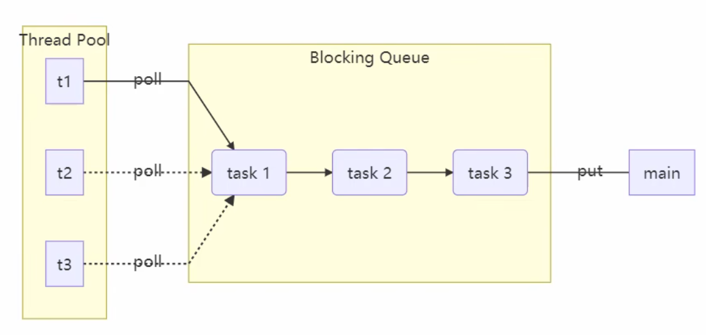

#### 8.1.1. 自定义拒绝策略接口

```java
// 拒绝策略
// 策略设计模式，当任务满了时，如何去处理未添加的任务
@FunctionalInterface 
interface RejectPolicy<T> {
    void reject(BlockingQueue<T> queue, T task);
}
```

#### 8.1.2. 自定义任务队列

```java
@Slf4j(topic = "c.Test")
class BlockingQueue<T> {
    // 1. 任务队列
    private Deque<T> queue = new ArrayDeque<>();
    // 2. 锁
    private ReentrantLock lock = new ReentrantLock();
    // 3. 生产者条件变量
    private Condition fullWaitSet = lock.newCondition();
    // 4. 消费者条件变量
    private Condition emptyWaitSet = lock.newCondition();
    // 5. 容量
    private int capcity;

    public BlockingQueue(int capcity) {
        this.capcity = capcity;
    }

    // 带超时阻塞获取
    public T poll(long timeout, TimeUnit unit) {
        lock.lock();
        try {
            // 将 timeout 统一转换为 纳秒
            long nanos = unit.toNanos(timeout);
            while (queue.isEmpty()) {
                try {
                    // 返回值是剩余时间
                    if (nanos <= 0) {
                        return null;
                    }
                    nanos = emptyWaitSet.awaitNanos(nanos);
                } catch (InterruptedException e) {
                    e.printStackTrace();
                }
            }
            T t = queue.removeFirst();
            fullWaitSet.signal();
            return t;
        } finally {
            lock.unlock();
        }

    }

    // 阻塞获取
    public T take() {
        lock.lock();
        try {
            while (queue.isEmpty()) {
                try {
                    emptyWaitSet.await();
                } catch (InterruptedException e) {
                    e.printStackTrace();
                }
            }
            T t = queue.removeFirst();
            fullWaitSet.signal();
            return t;
        } finally {
            lock.unlock();
        }
    }

    // 阻塞添加
    public void put(T task) {
        lock.lock();
        try {
            while (queue.size() == capcity) {
                try {
                    log.debug("等待加入任务队列 {} ...", task);
                    fullWaitSet.await();
                } catch (InterruptedException e) {
                    e.printStackTrace();
                }
            }
            log.debug("加入任务队列 {}", task);
            queue.addLast(task);
            emptyWaitSet.signal();
        } finally {
            lock.unlock();
        }
    }

    // 带超时时间阻塞添加
    public boolean offer(T task, long timeout, TimeUnit timeUnit) {
        lock.lock();
        try {
            long nanos = timeUnit.toNanos(timeout);
            while (queue.size() == capcity) {
                try {
                    if (nanos <= 0) {
                        return false;
                    }
                    log.debug("等待加入任务队列 {} ...", task);
                    nanos = fullWaitSet.awaitNanos(nanos);
                } catch (InterruptedException e) {
                    e.printStackTrace();
                }
            }
            log.debug("加入任务队列 {}", task);
            queue.addLast(task);
            emptyWaitSet.signal();
            return true;
        } finally {
            lock.unlock();
        }
    }

    public int size() {
        lock.lock();
        try {
            return queue.size();
        } finally {
            lock.unlock();
        }
    }

    public void tryPut(RejectPolicy<T> rejectPolicy, T task) {
        lock.lock();
        try {
            // 判断队列是否满
            if (queue.size() == capcity) {
                rejectPolicy.reject(this, task);
            } else { // 有空闲
                log.debug("加入任务队列 {}", task);
                queue.addLast(task);
                emptyWaitSet.signal();
            }
        } finally {
            lock.unlock();
        }
    }
}
```

#### 8.1.3. 自定义线程池

```java
@Slf4j(topic = "c.Test")
class ThreadPool {
    // 任务队列
    private BlockingQueue<Runnable> taskQueue;
    // 线程集合
    private HashSet<Worker> workers = new HashSet<>();
    // 核心线程数
    private int coreSize;
    // 获取任务时的超时时间
    private long timeout;
    private TimeUnit timeUnit;
    private RejectPolicy<Runnable> rejectPolicy;

    // 执行任务
    public void execute(Runnable task) {
        // 当任务数没有超过 coreSize 时，直接交给 worker 对象执行
        // 如果任务数超过 coreSize 时，加入任务队列暂存
        synchronized (workers) {
            if (workers.size() < coreSize) {
                Worker worker = new Worker(task);
                log.debug("新增 worker{}, {}", worker, task);
                workers.add(worker);
                worker.start();
            } else {
                // taskQueue.put(task);
                // 1) 死等
                // 2) 带超时等待
                // 3) 让调用者放弃任务执行
                // 4) 让调用者抛出异常
                // 5) 让调用者自己执行任务
                taskQueue.tryPut(rejectPolicy, task);
            }
        }
    }

    public ThreadPool(int coreSize, long timeout, TimeUnit timeUnit, int queueCapcity,
                      RejectPolicy<Runnable> rejectPolicy) {
        this.coreSize = coreSize;
        this.timeout = timeout;
        this.timeUnit = timeUnit;
        this.taskQueue = new BlockingQueue<>(queueCapcity);
        this.rejectPolicy = rejectPolicy;
    }

    class Worker extends Thread {
        private Runnable task;

        public Worker(Runnable task) {
            this.task = task;
        }

        @Override
        public void run() {
            // 执行任务
            // 1) 当 task 不为空，执行任务
            // 2) 当 task 执行完毕，再接着从任务队列获取任务并执行
            // while(task != null || (task = taskQueue.take()) != null) {
            while (task != null || (task = taskQueue.poll(timeout, timeUnit)) != null) {
                try {
                    log.debug("正在执行...{}", task);
                    task.run();
                } catch (Exception e) {
                    e.printStackTrace();
                } finally {
                    task = null;
                }
            }
            synchronized (workers) {
                log.debug("worker 被移除{}", this);
                workers.remove(this);
            }
        }
    }
}
```

#### 8.1.4. 测试

```java
@Slf4j(topic = "c.Test")
public class Test01 {
    public static void main(String[] args) {
        ThreadPool threadPool = new ThreadPool(1,
                1000, TimeUnit.MILLISECONDS, 1, (queue, task)->{
            // 1. 死等
            // queue.put(task);
            // 2) 带超时等待
            // queue.offer(task, 1500, TimeUnit.MILLISECONDS);
            // 3) 让调用者放弃任务执行
            // log.debug("放弃{}", task);
            // 4) 让调用者抛出异常
            // throw new RuntimeException("任务执行失败 " + task);
            // 5) 让调用者自己执行任务
            task.run();
        });
        for (int i = 0; i < 4; i++) {
            int j = i;
            threadPool.execute(() -> {
                try {
                    Thread.sleep(1000L);
                } catch (InterruptedException e) {
                    e.printStackTrace();
                }
                log.debug("{}", j);
            });
        }
    }
}
```

### 8.2. ThreadPoolExecutor

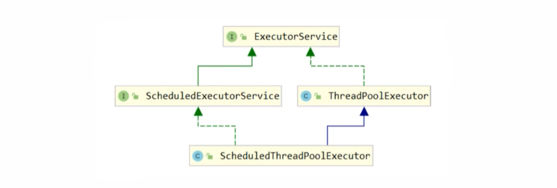

#### 8.2.1. 线程池状态

ThreadPoolExecutor 使用 int 的高 3 位来表示线程池状态，低 29 位表示线程数量

| 状态名 | 高 3 位 | 接收新任务 | 处理阻塞队列任务 | 说明 |
| - | - | - | - | - |
| RUNNING | 111 | Y | Y | - |
| SHUTDOWN | 000 | N | Y | 不会接收新任务，但会处理阻塞队列剩余任务 |
| STOP | 001 | N |  N | 会中断正在执行的任务，并抛弃阻塞队列任务 |
| TIDYING | 010 | - | - | 任务全执行完毕，活动线程为 0 即将进入终结 |
| TERMINATED | 011 | - | - | 终结状态 |

从数字上比较，TERMINATED > TIDYING > STOP > SHUTDOWN > RUNNING

这些信息存储在一个原子变量 ctl 中，目的是将线程池状态与线程个数合二为一，这样就可以用一次 cas 原子操作进行赋值

```java
// c 为旧值， ctlOf 返回结果为新值
ctl.compareAndSet(c, ctlOf(targetState, workerCountOf(c))));

// rs 为高 3 位代表线程池状态， wc 为低 29 位代表线程个数，ctl 是合并它们
private static int ctlOf(int rs, int wc) { return rs | wc; }
```

#### 8.2.2. 构造方法

```java
public ThreadPoolExecutor(
        int corePoolSize,
        int maximumPoolSize,
        long keepAliveTime,
        TimeUnit unit,
        BlockingQueue<Runnable> workQueue,
        ThreadFactory threadFactory,
        RejectedExecutionHandler handler
)
```

说明: 

* corePoolSize    核心线程数目 (最多保留的线程数)
* maximumPoolSize 最大线程数目
* keepAliveTime   生存时间 - 针对救急线程
* unit            时间单位 - 针对救急线程
* workQueue       阻塞队列
* threadFactory   线程工厂 - 可以为线程创建时起个好名字
* handler         拒绝策略

核心线程不会销毁，当核心线程用完 且 队列也满了 时，才会创建救急线程；
当救急线程也满了时，则执行拒绝策略

工作方式：

* 线程池中刚开始没有线程，当一个任务提交给线程池后，线程池会创建一个新线程来执行任务。
* 当线程数达到 corePoolSize 并没有线程空闲，这时再加入任务，新加的任务会被加入 workQueue 队列排队，直到有空闲的线程。
* 如果队列选择了有界队列，那么任务超过了队列大小时，会创建 maximumPoolSize - corePoolSize 数目的线程来救急。
* 如果线程到达 maximumPoolSize 仍然有新任务这时会执行拒绝策略。
* 当高峰过去后，超过 corePoolSize 的救急线程如果一段时间没有任务做，需要结束以节省资源，这个时间由 keepAliveTime 和 unit 来控制。

jdk 提供了 4 种 拒绝策略 的实现:

* AbortPolicy 让调用者抛出 RejectedExecutionException 异常，【默认策略】
* CallerRunsPolicy 让调用者运行任务
* DiscardPolicy 放弃本次任务
* DiscardOldestPolicy 放弃队列中最早的任务，本任务取而代之

其它著名框架也提供了 拒绝策略 实现:

* Dubbo 的实现，在抛出 RejectedExecutionException 异常之前会记录日志，并 dump 线程栈信息，方便定位问题
* Netty 的实现，是创建一个新线程来执行任务
* ActiveMQ 的实现，带超时等待（60s）尝试放入队列，类似我们之前自定义的拒绝策略
* PinPoint 的实现，它使用了一个拒绝策略链，会逐一尝试策略链中每种拒绝策略

根据这个构造方法，JDK Executors 类中提供了众多工厂方法来创建各种用途的线程池

### 8.3. Executors

#### 8.3.1. newFixedThreadPool - 固定大小线程池

构造函数: 

```java
public static ExecutorService newFixedThreadPool(int nThreads) {
    return new ThreadPoolExecutor(
        nThreads, 
        
        nThreads,
        0L, TimeUnit.MILLISECONDS,
        
        new LinkedBlockingQueue<Runnable>()
    );
}
```

特点:

* 核心线程数 == 最大线程数，没有救急线程被创建，因此也无需超时时间
* 阻塞队列是无界的，可以放任意数量的任务
* 核心线程不会结束，一直运行

应用场景:

* 适用于任务量已知，相对耗时的任务

示例:

```java
@Slf4j(topic = "c.Test")
public class Test02 {
    public static void main(String[] args) {
        // 使用 默认线程工厂
        ExecutorService pool1 = Executors.newFixedThreadPool(2);
        //=> 29:41.139 [pool-1-thread-1] - 1
        //=> 29:41.139 [pool-1-thread-2] - 2
        //=> 29:41.142 [pool-1-thread-1] - 3

        // 使用 自定义线程工厂
        ExecutorService pool2 = Executors.newFixedThreadPool(2, new ThreadFactory() {
            private final AtomicInteger t = new AtomicInteger(1);

            @Override
            public Thread newThread(Runnable r) {
                return new Thread(r, "my-pool--t-" + t.getAndIncrement());
            }
        });
        //=> 28:55.019 [my-pool--t-1] - 1
        //=> 28:55.019 [my-pool--t-2] - 2
        //=> 28:55.022 [my-pool--t-2] - 3

        for (int i = 0; i < 3; i++) {
            int num = i + 1;
            pool1.execute(() -> {
                log.debug("{}", num);
            });
        }
    }
}
```

#### 8.3.2. newCachedThreadPool - 带缓冲线程池

构造函数:

```java
public static ExecutorService newCachedThreadPool() {
    return new ThreadPoolExecutor(
        0, 
        
        Integer.MAX_VALUE,
        60L, TimeUnit.SECONDS,
        
        new SynchronousQueue<Runnable>()
    );
}
```

特点:

* 核心线程数是 0， 最大线程数是 Integer.MAX_VALUE，救急线程的空闲生存时间是 60s
   * 全部都是救急线程（60s 后可以回收）
   * 救急线程可以无限创建
* 队列采用了 SynchronousQueue 实现特点是，它没有容量，没有线程来取是放不进去的（一手交钱、一手交货）

示例:

```java
@Slf4j(topic = "c.Test")
public class Test03 {
    public static void main(String[] args) {
        SynchronousQueue<Integer> integers = new SynchronousQueue<>();
        new Thread(() -> {
            try {
                log.debug("putting {} ", 1);
                integers.put(1);
                log.debug("{} putted...", 1);
                log.debug("putting...{} ", 2);
                integers.put(2);
                log.debug("{} putted...", 2);
            } catch (InterruptedException e) {
                e.printStackTrace();
            }
        }, "t1").start();
        Sleeper.sleepSeconds(1);
        new Thread(() -> {
            try {
                log.debug("taking {}", 1);
                integers.take();
            } catch (InterruptedException e) {
                e.printStackTrace();
            }
        }, "t2").start();
        Sleeper.sleepSeconds(1);
        new Thread(() -> {
            try {
                log.debug("taking {}", 2);
                integers.take();
            } catch (InterruptedException e) {
                e.printStackTrace();
            }
        }, "t3").start();
    }
    //=> 32:00.376 [main] - 睡眠 1 秒
    //=> 32:00.376 [  t1] - putting 1
    //=> 32:01.390 [main] - 睡眠 1 秒
    //=> 32:01.391 [  t2] - taking 1
    //=> 32:01.391 [  t1] - 1 putted...
    //=> 32:01.391 [  t1] - putting...2
    //=> 32:02.394 [  t3] - taking 2
    //=> 32:02.394 [  t1] - 2 putted...
}
```

#### 8.3.3. newSingleThreadExecutor - 单线程线程池

构造函数:

```java
public static ExecutorService newSingleThreadExecutor() {
    return new FinalizableDelegatedExecutorService
        (
            new ThreadPoolExecutor(
                1, 
                1, 
                0L, TimeUnit.MILLISECONDS,
                new LinkedBlockingQueue<Runnable>()
            )
        );
}
```

使用场景：

* 多个任务排队执行。
* 线程数固定为 1，任务数多于 1 时，会放入无界队列排队。任务执行完毕，这唯一的线程也不会被释放。

区别：

* 自己创建一个单线程串行执行任务，如果任务执行失败而终止 那么其它任务就不会执行；而线程池还会新建一个线程，保证池的正常工作
* Executors.newSingleThreadExecutor() 线程个数始终为 1，不能修改
   * FinalizableDelegatedExecutorService 应用的是装饰器模式，只对外暴露了 ExecutorService 接口，因此不能调用 ThreadPoolExecutor 中特有的方法
* Executors.newFixedThreadPool(1) 初始时为 1，以后还可以修改
   * 对外暴露的是 ThreadPoolExecutor 对象，可以强转后调用 setCorePoolSize 等方法进行修改

### 8.4. ThreadPoolExecutor

```java
// 执行任务
void execute(Runnable command);

// 提交任务 task，用返回值 Future 获得任务执行结果
<T> Future<T> submit(Callable<T> task);

// 提交 tasks 中所有任务
<T> List<Future<T>> invokeAll(Collection<? extends Callable<T>> tasks) throws InterruptedException;

// 提交 tasks 中所有任务，带超时时间。超时针对的是 任务集合，而非单个任务；超时后虽然拿不到结果，但任务仍旧会执行完毕
<T> List<Future<T>> invokeAll(Collection<? extends Callable<T>> tasks, long timeout, TimeUnit unit) throws InterruptedException;

// 提交 tasks 中所有任务，哪个任务先成功执行完毕，返回此任务执行结果，其它任务取消
<T> T invokeAny(Collection<? extends Callable<T>> tasks) throws InterruptedException, ExecutionException;

// 提交 tasks 中所有任务，哪个任务先成功执行完毕，返回此任务执行结果，其它任务取消，带超时时间
<T> T invokeAny(Collection<? extends Callable<T>> tasks, long timeout, TimeUnit unit) throws InterruptedException, ExecutionException, TimeoutException;
```

#### 8.4.1. submit - 提交任务

```java
@Slf4j(topic = "c.Test")
public class Test04 {
    public static void main(String[] args) throws Exception {
        ExecutorService pool = Executors.newFixedThreadPool(2);

        Future<String> future = pool.submit(new Callable<String>() {
            @Override
            public String call() throws Exception {
                sleepSeconds(1);
                return "ok";
            }
        });

        String result = future.get();

        log.debug("result: {}", result);
    }
    //=> 09:21.890 [pool-1-thread-1] - 睡眠 1 秒
    //=> 09:22.907 [main] - result: ok
}
```

#### 8.4.2. invokeAll - 提交任务集合

```java
@Slf4j(topic = "c.Test")
public class Test05 {
    public static void main(String[] args) throws Exception {
        ExecutorService pool = Executors.newFixedThreadPool(2);

        List<Future<String>> futureList = pool.invokeAll(Arrays.asList(
                () -> {
                    log.debug("begin 1");
                    sleepSeconds(2);
                    log.debug("end 1");
                    return "1";
                },
                () -> {
                    log.debug("begin 2");
                    sleepSeconds(3);
                    log.debug("end 2");
                    return "2";
                },
                () -> {
                    log.debug("begin 3");
                    sleepSeconds(1);
                    log.debug("end 3");
                    return "3";
                }
        ), 2500, TimeUnit.MILLISECONDS);

        futureList.forEach(item -> {
            try {
                String result = item.get();
                log.debug(result);
            } catch (Exception e) {
                log.warn("异常: {}", e.getMessage());
            }
        });
    }
    //=> 38:07.714 [pool-1-thread-2] - begin
    //=> 38:07.713 [pool-1-thread-1] - begin
    //=> 38:07.717 [pool-1-thread-2] - 睡眠 3 秒
    //=> 38:07.717 [pool-1-thread-1] - 睡眠 2 秒
    //=> 38:09.726 [pool-1-thread-1] - end
    //=> 38:09.726 [pool-1-thread-1] - begin
    //=> 38:09.726 [pool-1-thread-1] - 睡眠 1 秒
    //=> 38:10.219 [pool-1-thread-1] - 异常: sleep interrupted
    //=> 38:10.219 [pool-1-thread-2] - 异常: sleep interrupted
    //=> 38:10.220 [pool-1-thread-1] - end
    //=> 38:10.220 [pool-1-thread-2] - end
    //=> 38:10.220 [main] - 1
    //=> 38:10.221 [main] - 异常: null
    //=> 38:10.221 [main] - 异常: null
}
```

#### 8.4.3. invokeAny - 返回最先执行完毕的任务的结果

```java
@Slf4j(topic = "c.Test")
public class Test06 {
    public static void main(String[] args) throws Exception {
        ExecutorService pool = Executors.newFixedThreadPool(2);

        String result = pool.invokeAny(Arrays.asList(
                () -> {
                    log.debug("begin 1");
                    sleepSeconds(2);
                    log.debug("end 1");
                    return "1";
                },
                () -> {
                    log.debug("begin 2");
                    sleepSeconds(3);
                    log.debug("end 2");
                    return "2";
                },
                () -> {
                    log.debug("begin 3");
                    sleepSeconds(1);
                    log.debug("end 3");
                    return "3";
                }
        ));

        log.debug("result: {}", result);
    }
    //=> 47:10.450 [pool-1-thread-1] - begin 1
    //=> 47:10.450 [pool-1-thread-2] - begin 2
    //=> 47:10.453 [pool-1-thread-2] - 睡眠 3 秒
    //=> 47:10.453 [pool-1-thread-1] - 睡眠 2 秒
    //=> 47:12.455 [pool-1-thread-1] - end 1
    //=> 47:12.455 [pool-1-thread-1] - begin 3
    //=> 47:12.455 [pool-1-thread-1] - 睡眠 1 秒
    //=> 47:12.455 [main] - result: 1
    //=> 47:12.455 [pool-1-thread-1] - 异常: sleep interrupted
    //=> 47:12.455 [pool-1-thread-1] - end 3
    //=> 47:12.455 [pool-1-thread-2] - 异常: sleep interrupted
    //=> 47:12.455 [pool-1-thread-2] - end 2
}
```

#### 8.4.4. 关闭线程池

shutdown

```java
/*
    线程池状态变为 SHUTDOWN
    - 不会接收新任务
    - 但已提交任务会执行完
    - 此方法不会阻塞调用线程的执行
*/
void shutdown();


public void shutdown() {
    final ReentrantLock mainLock = this.mainLock;
    mainLock.lock();
    try {
        checkShutdownAccess();
        // 修改线程池状态
        advanceRunState(SHUTDOWN);
        // 仅会打断空闲线程
        interruptIdleWorkers();
        onShutdown(); // 扩展点 ScheduledThreadPoolExecutor
    } finally {
        mainLock.unlock();
    }
    // 尝试终结(没有运行的线程可以立刻终结，如果还有运行的线程也不会等)
    tryTerminate();
}
```

shutdownNow

```java
/*
    线程池状态变为 STOP
    - 不会接收新任务
    - 会将队列中的任务返回
    - 并用 interrupt 的方式中断正在执行的任务
*/
List<Runnable> shutdownNow();

public List<Runnable> shutdownNow() {
    List<Runnable> tasks;
    final ReentrantLock mainLock = this.mainLock;
    mainLock.lock();
    try {
        checkShutdownAccess();
        // 修改线程池状态
        advanceRunState(STOP);
        // 打断所有线程
        interruptWorkers();
        // 获取队列中剩余任务
        tasks = drainQueue();
    } finally {
        mainLock.unlock();
    }
    // 尝试终结
    tryTerminate();
    return tasks;
}
```

#### 8.4.5. 其它方法

```java
// 不在 RUNNING 状态的线程池，此方法就返回 true
boolean isShutdown();

// 线程池状态是否是 TERMINATED
boolean isTerminated();

// 调用 shutdown 后，由于调用线程并不会等待所有任务运行结束，因此如果它想在线程池 TERMINATED 后做些事情，可以利用此方法等待
boolean awaitTermination(long timeout, TimeUnit unit) throws InterruptedException;
```