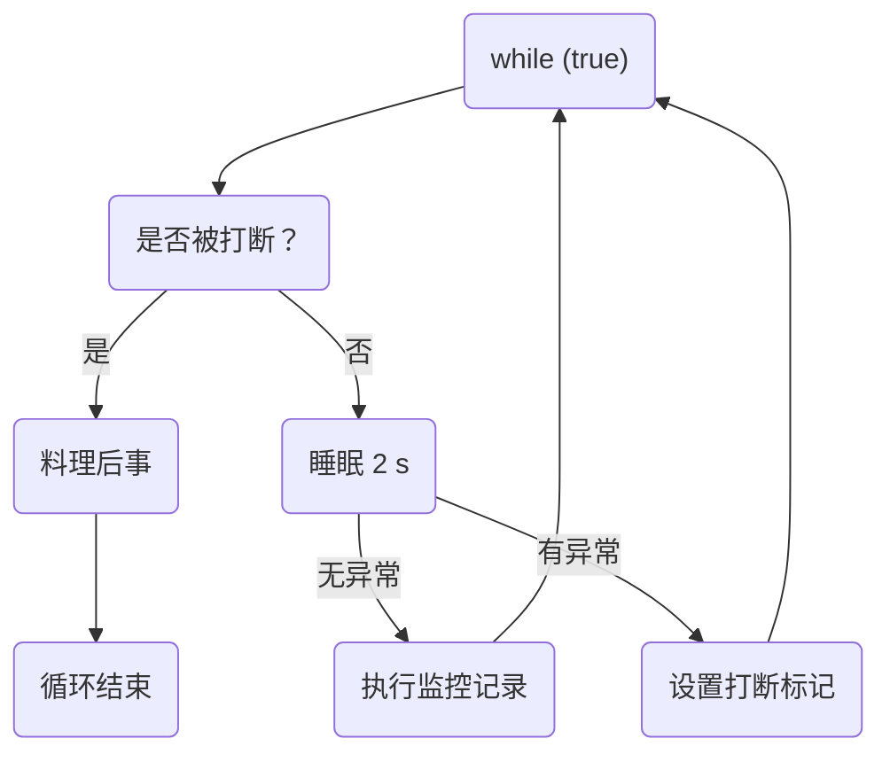
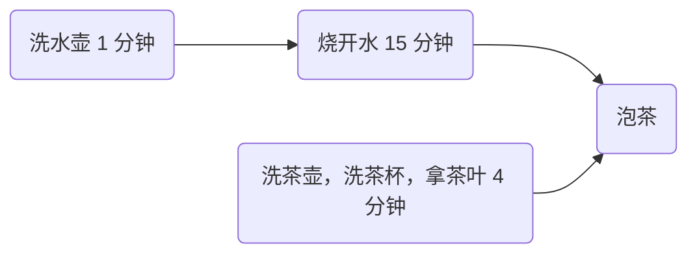
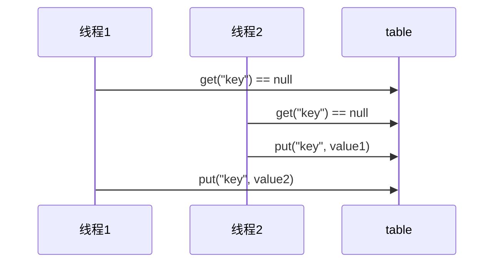

<!--#region
@author 吴钦飞
@email wuqinfei@qq.com
@create date 2026-01-18 07:28:33
@modify date 2026-01-26 19:13:16
@desc [description]
#endregion-->

# Java并发编程-黑马

## 1. 概览

课程:

* 进程
* 线程
* 并发
* 并行

依赖:

```xml
<properties>
  <maven.compiler.source>1.8</maven.compiler.source>
  <maven.compiler.target>1.8</maven.compiler.target>
</properties>

<dependencies>
  <dependency>
    <groupId>org.projectlombok</groupId>
    <artifactId>lombok</artifactId>
    <version>1.18.10</version>
  </dependency>
  <dependency>
    <groupId>ch.qos.logback</groupId>
    <artifactId>logback-classic</artifactId>
    <version>1.2.3</version>
  </dependency>
</dependencies>
```

logback.xml 配置:

```xml
<?xml version="1.0" encoding="UTF-8"?>
<configuration
        xmlns="http://ch.qos.logback/xml/ns/logback"
        xmlns:xsi="http://www.w3.org/2001/XMLSchema-instance"
        xsi:schemaLocation="http://ch.qos.logback/xml/ns/logback logback.xsd">
    <appender name="STDOUT" class="ch.qos.logback.core.ConsoleAppender">
        <encoder>
            <pattern>%date{mm:ss.SSS} [%4t] - %m%n</pattern>
        </encoder>
    </appender>

    <logger name="c" level="debug" additivity="false">
        <appender-ref ref="STDOUT"/>
    </logger>

    <root level="ERROR">
        <appender-ref ref="STDOUT"/>
    </root>
</configuration>
```

## 2. 进程与线程

进程与线程的概念

并行与并发的概念

线程基本应用

### 2.1. 进程与线程

#### 2.1.1. 进程

程序由指令和数据组成，但这些指令要运行，数据要读写，就必须将指令加载至 CPU，数据加载至内存。在指令运行过程中还需要用到磁盘、网络等设备。进程就是用来加载指令、管理内存、管理 IO 的

当一个程序被运行，从磁盘加载这个程序的代码至内存，这时就开启了一个进程。

进程就可以视为程序的一个实例。大部分程序可以同时运行多个实例进程（例如记事本、画图、浏览器等），也有的程序只能启动一个实例进程（例如网易云音乐、360 安全卫士等）

#### 2.1.2. 线程

一个进程之内可以分为一到多个线程。

一个线程就是一个指令流，将指令流中的一条条指令以一定的顺序交给 CPU 执行 

Java 中，线程作为最小调度单位，进程作为资源分配的最小单位。 

在 windows 中进程是不活动的，只是作为线程的容器

#### 2.1.3. 对比

进程基本上相互独立的，而线程存在于进程内，是进程的一个子集 

进程拥有共享的资源，如内存空间等，供其内部的线程共享 

进程间通信较为复杂：
* 同一台计算机的进程通信称为 IPC（Inter-process communication）
* 不同计算机之间的进程通信，需要通过网络，并遵守共同的协议，例如 HTTP

线程通信相对简单，因为它们共享进程内的内存，一个例子是多个线程可以访问同一个共享变量

线程更轻量，线程上下文切换成本一般上要比进程上下文切换低

### 2.2. 并行与并发

#### 2.2.1. 并发

单核 cpu 下，线程实际还是 串行执行 的。

操作系统中有一个组件叫做任务调度器，将 cpu 的时间片（windows 下时间片最小约为 15 毫秒）分给不同的程序使用，只是由于 cpu 在线程间（时间片很短）的切换非常快，人类感觉是 同时运行的 。

总结为一句话就是： 微观串行，宏观并行 

一般会将这种 线程轮流使用 CPU 的做法称为并发， concurrent

#### 2.2.2. 并行

多核 cpu下，每个 核（core） 都可以调度运行线程，这时候线程可以是并行的。

#### 2.2.3. 总结

并发（concurrent）是同一时间应对（dealing with）多件事情的能力

并行（parallel）是同一时间动手做（doing）多件事情的能力

#### 2.2.4. 例子

家庭主妇做饭、打扫卫生、给孩子喂奶，她一个人轮流交替做这多件事，这时就是并发

家庭主妇雇了个保姆，她们一起这些事，这时既有并发，也有并行（这时会产生竞争，例如锅只有一口，一个人用锅时，另一个人就得等待）

雇了 3 个保姆，一个专做饭、一个专打扫卫生、一个专喂奶，互不干扰，这时是并行

### 2.3. 线程应用

#### 2.3.1. 异步调用

以调用方角度来讲:

* 需要等待结果返回，才能继续运行就是同步
* 不需要等待结果返回，就能继续运行就是异步

多线程可以让方法执行变为异步的（即不要巴巴干等着）

比如说读取磁盘文件时，假设读取操作花费了 5 秒钟，如果没有线程调度机制，这 5 秒 cpu 什么都做不了，其它代码都得暂停...

【比如】

在项目中，视频文件需要转换格式等操作比较费时，这时开一个新线程处理视频转换，避免阻塞主线程

tomcat 的异步 servlet 也是类似的目的，让用户线程处理耗时较长的操作，避免阻塞 tomcat 的工作线程

ui 程序中，开线程进行其他操作，避免阻塞 ui 线程

#### 2.3.2. 提高效率

充分利用多核 cpu 的优势，提高运行效率。

想象下面的场景，执行 3 个计算，最后将计算结果汇总。

```text
计算 1 花费 10 ms
计算 2 花费 11 ms
计算 3 花费 9 ms
汇总需要 1 ms
```

如果是串行执行，那么总共花费的时间是 10 + 11 + 9 + 1 = 31ms

但如果是四核 cpu，
各个核心分别使用线程 1 执行计算 1，线程 2 执行计算 2，线程 3 执行计算 3，
那么 3 个 线程是并行的，花费时间只取决于最长的那个线程运行的时间，即 11ms 最后加上汇总时间只会花费 12ms

注意: 需要在多核 cpu 才能提高效率，单核仍然时是轮流执行

【结论】

单核 cpu 下，多线程不能实际提高程序运行效率，只是为了能够在不同的任务之间切换，不同线程轮流使用 cpu ，不至于一个线程总占用 cpu，别的线程没法干活

多核 cpu 可以并行跑多个线程，但能否提高程序运行效率还是要分情况的

* 有些任务，经过精心设计，将任务拆分，并行执行，当然可以提高程序的运行效率。但不是所有计算任务都能拆分（参考后文的【阿姆达尔定律】）
* 也不是所有任务都需要拆分，任务的目的如果不同，谈拆分和效率没啥意义

IO 操作不占用 cpu，只是我们一般拷贝文件使用的是【阻塞 IO】，这时相当于线程虽然不用 cpu，但需要一直等待 IO 结束，没能充分利用线程。
所以才有后面的【非阻塞 IO】和【异步 IO】优化

## 3. Java 线程

创建和运行线程

查看线程

线程 API

线程状态

### 3.1. 创建和运行线程

方法一，直接使用 Thread:

```java
@Slf4j(topic = "c.Test1")
public class Test1 {
    public static void main(String[] args) {
        // 1. 创建线程对象
        Thread thread = new Thread() {
            @Override
            public void run() {
                // 2. 要执行的任务
                log.debug("running...thread");
            }
        };

        thread.setName("t1"); // 给线程设置名称

        // 3. 启动线程
        thread.start();

        log.debug("running...main");
    }
    //=> 12:13:51 [main] c.Test1 - running...main
    //=> 12:13:51 [t1] c.Test1 - running...thread
}
```

方法二，使用 Runnable 配合 Thread: 【推荐】

```java
// 把【线程】和【任务】分开，更灵活

Runnable task = new Runnable() {
    @Override
    public void run() {
        // 要执行的任务
        log.debug("running...");
    }
};

// 创建线程对象
Thread t = new Thread(task, "t2");

// 启动线程
t.start();
```

使用 lambda 简化 Runnable 的书写:

```java
Runnable task = () -> {
    // 要执行的任务
    log.debug("running...");
};
```

方法三，FutureTask 配合 Thread:

```java
public static void main(String[] args) throws ExecutionException, InterruptedException {
    // 创建任务对象
    FutureTask<Integer> task = new FutureTask<>(() -> {
        log.debug("running...");
        Thread.sleep(3000); // 方法体的异常，默认全部抛出
        return 123;
    });

    Thread t1 = new Thread(task, "t1");

    t1.start();

    // 主线程阻塞，同步等待 task 执行完毕的结果
    Integer result = task.get();

    log.debug("task result: {}", result);
}
//=> 18:40:42 [t1] c.Test3 - running...
//=> 18:40:45 [main] c.Test3 - task result: 123
```

### 3.2. 查看进程线程的方法

windows:

```shell
# 查看所有进程
tasklist

# 过滤
tasklist | findstr "java"

# 杀死
taskkill /F /PID 28888
```

linux:

```shell
# 查看所有进程
ps -fe 

# 查看某个进程（PID）的所有线程
ps -fT -p <PID> 

# 杀死进程
kill 

# 按大写 H 切换是否显示线程
top 

# 查看某个进程（PID）的所有线程
top -H -p <PID> 
```

Java:

```shell
# 命令查看所有 Java 进程
jps

# 查看某个 Java 进程（PID）的所有线程状态
jstack <PID> 

# 查看某个 Java 进程中线程的运行情况（图形界面）
jconsole 
```

jconsole 远程监控配置:

```shell
java 
  -Djava.rmi.server.hostname=192.168.1.123 
  -Dcom.sun.management.jmxremote 
  -Dcom.sun.management.jmxremote.port=1234 
  -Dcom.sun.management.jmxremote.ssl=false 
  -Dcom.sun.management.jmxremote.authenticate=false 
  java类
```

### 3.3. 线程运行原理

【栈与栈帧】

Java Virtual Machine Stacks （Java 虚拟机栈）

我们都知道 JVM 中由堆、栈、方法区所组成，其中栈内存是给谁用的呢？

其实就是线程，每个线程启动后，虚拟机就会为其分配一块栈内存。

每个栈由多个栈帧（Frame）组成，对应着每次方法调用时所占用的内存

每个线程只能有一个活动栈帧，对应着当前正在执行的那个方法

【线程上下文切换（Thread Context Switch）】

因为以下一些原因导致 cpu 不再执行当前的线程，转而执行另一个线程的代码：

* 线程的 cpu 时间片用完
* 垃圾回收
* 有更高优先级的线程需要运行
* 线程自己调用了 sleep、yield、wait、join、park、synchronized、lock 等方法

当 Context Switch 发生时，需要由操作系统保存当前线程的状态，并恢复另一个线程的状态，Java 中对应的概念就是程序计数器（Program Counter Register），它的作用是记住下一条 jvm 指令的执行地址，是线程私有的

* 状态包括程序计数器、虚拟机栈中每个栈帧的信息，如局部变量、操作数栈、返回地址等
* Context Switch 频繁发生会影响性能

### 3.4. 常见方法

| 方法名 | static | 功能说明 | 注意 |
| - | - | - | - |
| `start()` | - | 启动一个新线程，在新的线程运行 run 方法中的代码 | start 方法只是让线程进入就绪，里面代码不一定立刻运行（CPU 的时间片还没分给它）。每个线程对象的 start 方法只能调用一次，如果调用了多次会出现  IllegalThreadStateException |
| `run()` | - | 新线程启动后会调用的方法 | 如果在构造 Thread 对象时传递了 Runnable 参数，则线程启动后会调用Runnable 中的 run 方法，否则默认不执行任何操作。但可以创建 Thread 的子类对象，来覆盖默认行为 |
| `join()` | - | 等待线程运行结束 | - |
| `join(long n)` | - | 等待线程运行结束,最多等待 n 毫秒 | - |
| `getId()` | - | 获取线程的 id | id 唯一，长整型 |
| `getName()` | - | 获取线程名 | - |
| `setName(String)` | - | 修改线程名 | - |
| `getPriority()` | - | 获取线程优先级 | - |
| `setPriority(int)` | - | 修改线程优先级 | java 中规定线程优先级是 1~10 的整数，较大的优先级能提高该线程被 CPU 调度的机率 |
| `getState()` | - | 获取线程状态 | Java 中线程状态是用 6 个 enum 表示，分别为： NEW, RUNNABLE, BLOCKED, WAITING, TIMED_WAITING, TERMINATED |
| `isInterrupted()` | - | 判断是否被打断 | 不会清除 打断标记。（打断标记为 true，被打断；为 false，未被打断，称为清除 打断标记） |
| `isAlive()` | - | 线程是否存活（还没有运行完毕） | - |
| `interrupt()` | - | 打断线程 | 如果被打断线程正在 sleep，wait，join 会导致被打断的线程抛出 InterruptedException，并清除 打断标记 ；如果打断的正在运行的线程，则会设置 打断标记 ；park 的线程被打断，也会设置 打断标记 |
| `interrupted()` | static | 判断当前线程是否被打断 | 会清除 打断标记 |
| `currentThread()` | static | 获取当前正在执行的线程 | - |
| `sleep(long n)` | static | 让当前执行的线程休眠 n 毫秒，休眠时让出 cpu 的时间片给其它线程 | - |
| `yield()` | static | 提示线程调度器让出当前线程对 CPU 的使用 | 主要是为了测试和调试 |

### 3.5. start() 与 run()

```java
public static void main(String[] args) throws ExecutionException, InterruptedException {
    Thread t1 = new Thread("t1") {
        @Override
        public void run() {
            log.debug("running...");
        }
    };

    // 直接调用 run 是在主线程中执行了 run，没有启动新的线程
    t1.run();

    log.debug("start 之前的状态: {}", t1.getState());

    // 使用 start 是启动新的线程，通过新的线程间接执行 run 中的代码
    t1.start();;

    log.debug("start 之后的状态: {}", t1.getState());

    // 再次调用 start() ，抛异常 IllegalThreadStateException
    // t1.start();
}
//=> 19:36:55 [main] c.Test4 - running...
//=> 19:36:55 [main] c.Test4 - start 之前的状态: NEW
//=> 19:36:55 [main] c.Test4 - start 之后的状态: RUNNABLE
//=> 19:36:55 [t1] c.Test4 - running...
```

### 3.6. sleep() 与 yield()

#### 3.6.1. sleep

调用 sleep 会让当前线程从 `Running` 进入 `Timed Waiting` 状态（阻塞）

其它线程可以使用 interrupt 方法打断正在睡眠的线程，这时 sleep 方法会抛出 InterruptedException

睡眠结束后的线程未必会立刻得到执行

```java
public static void main(String[] args) throws InterruptedException {
    Thread t1 = new Thread("t1") {
        @Override
        public void run() {
            log.debug("t1 sleep...");
            try {
                Thread.sleep(3000);
            } catch (InterruptedException e) {
                log.debug("t1 wake up... {}", e.getMessage());
            }
        }
    };

    log.debug("t1 status: {}", t1.getState());

    t1.start();
    log.debug("t1 status: {}", t1.getState());
    log.debug("main sleep...");
    Thread.sleep(1000);

    log.debug("t1 status: {}", t1.getState());

    log.debug("interrupt...");
    t1.interrupt();
}
//=> 03:49.709 [main] - t1 status: NEW
//=> 03:49.713 [main] - t1 status: RUNNABLE
//=> 03:49.713 [main] - main sleep...
//=> 03:49.713 [  t1] - t1 sleep...
//=> 03:50.722 [main] - t1 status: TIMED_WAITING
//=> 03:50.722 [main] - interrupt...
//=> 03:50.722 [  t1] - t1 wake up... sleep interrupted
```

建议用 TimeUnit 的 sleep 代替 Thread 的 sleep 来获得更好的可读性

```java
// 当前线程睡眠 1 秒: 等价 Thread.sleep(1000);
TimeUnit.SECONDS.sleep(1);

// 当前线程睡眠 1 分: 等价 Thread.sleep(1000 * 60);
TimeUnit.MINUTES.sleep(1);
```

#### 3.6.2. yield

调用 yield 会让当前线程从 Running 进入 Runnable 就绪状态，然后调度执行其它线程

具体的实现依赖于操作系统的任务调度器

```java
// 将当前线程的状态从 Running 改为 Runnable
Thread.yield();
```

#### 3.6.3. 线程优先级

线程优先级会提示（hint）调度器优先调度该线程，但它仅仅是一个提示，调度器可以忽略它

如果 cpu 比较忙，那么优先级高的线程会获得更多的时间片，但 cpu 闲时，优先级几乎没作用

```java
Thread t1 = new Thread(() -> log.debug("running..."));

// 1
t1.setPriority(Thread.MIN_PRIORITY);
// 5
t1.setPriority(Thread.NORM_PRIORITY);
// 10
t1.setPriority(Thread.MAX_PRIORITY);
```

### 3.7. 案例：防止 CPU 占用 100% - sleep 实现

在没有利用 cpu 来计算时，不要让 `while(true)` 空转浪费 cpu，这时可以使用 yield 或 sleep 来让出 cpu 的使用权
给其他程序

```java
while(true) {
    try {
        Thread.sleep(50);
    } catch (InterruptedException e) {
        e.printStackTrace();
    }
}
```

可以用 wait 或 条件变量 达到类似的效果，但这两种方式都需要加锁，并且需要相应的唤醒操作，一般适用于要进行同步的场景

sleep 适用于无需锁同步的场景

### 3.8. join()

【介绍】

使用 join() 方法，阻塞当前线程，等待线程运行结束

```java
public static void main(String[] args) throws InterruptedException {
    Thread t1 = new Thread(() -> {
        log.debug("t1 start...");
        try { TimeUnit.SECONDS.sleep(1); } catch (InterruptedException e) { throw new RuntimeException(e); }
        log.debug("t1 stop....");
    }, "t1");

    t1.start();
    
    // 在 start 之后调用
    t1.join();

    log.debug("main stop");
}
//=> 29:08.191 [  t1] - t1 start...
//=> 29:09.200 [  t1] - t1 stop....
//=> 29:09.201 [main] - main stop
```

【同步应用】

以调用方角度来讲，如果

* 需要 等待结果返回，才能继续运行就是 同步
* 不需要 等待结果返回，就能继续运行就是 异步

【限时同步】

```java
// 最多等 3 秒，超时则不等
t1.join(TimeUnit.SECONDS.toMillis(3));
```

### 3.9. interrupt()

#### 3.9.1. 打断阻塞

sleep，wait，join 会使线程进入阻塞状态

打断 阻塞 的线程, 会清空打断状态，以 sleep 为例

```java
public static void main(String[] args) throws InterruptedException {
    Thread t1 = new Thread(() -> {
        log.debug("t1 sleep 5 s");
        try {
            Thread.sleep(5000); // wait, join
        } catch (InterruptedException e) {
            log.debug("t1 is interrupted");
        }
    }, "t1");

    t1.start();

    log.debug("main sleep 1 s");
    Thread.sleep(1000);

    log.debug("main interrupt t1");
    t1.interrupt();

    boolean interrupted = t1.isInterrupted();
    log.debug("t1 interrupted: {}", interrupted);
}
//=> 32:48.831 [main] - main sleep 1 s
//=> 32:48.831 [  t1] - t1 sleep 5 s
//=> 32:49.837 [main] - main interrupt t1
//=> 32:49.837 [  t1] - t1 is interrupted
//=> 32:49.838 [main] - t1 interrupted: false
```

#### 3.9.2. 打断正常

打断正常运行的线程, 不会清空打断状态

```java
public static void main(String[] args) throws InterruptedException {
    Thread t1 = new Thread(() -> {
        while (true) {
            boolean interrupted = Thread.currentThread().isInterrupted();
            if (interrupted) {
                log.debug("检测到被人干扰，选择停止继续执行");
                break;
            }
        }
    }, "t1");

    t1.start();

    log.debug("main sleep 1 s");
    Thread.sleep(1000);

    log.debug("main interrupt t1");
    t1.interrupt();
}
//=> 43:19.021 [main] - main sleep 1 s
//=> 43:20.032 [main] - main interrupt t1
//=> 43:20.032 [  t1] - 检测到被人干扰，选择停止继续执行
```

#### 3.9.3. 设计模式: 两阶段终止

Two Phase Termination

在一个线程 T1 中如何“优雅”终止线程 T2？这里的 “优雅” 指的是给 T2 一个料理后事的机会。

暴力做法 1. 使用线程对象的 stop() 方法停止线程

* stop 方法会真正杀死线程，如果这时线程锁住了共享资源，那么当它被杀死后就再也没有机会释放锁，
其它线程将永远无法获取锁

暴力做法 2. 使用线程对象的 stop() 方法停止线程

* 目的仅是停止一个线程，但这种做法会让整个程序都停止

分析:



实现:

```java
@Slf4j(topic = "c.Test")
public class Test11 {
    public static void main(String[] args) throws InterruptedException {
        TwoPhaseTermination tpt = new TwoPhaseTermination();
        log.debug("启动监控");
        tpt.start();

        Thread.sleep(3500);
        log.debug("停止监控");
        tpt.stop();
    }
    //=> 32:43.637 [main] - 启动监控
    //=> 32:44.679 [monitor] - 执行监控逻辑
    //=> 32:45.680 [monitor] - 执行监控逻辑
    //=> 32:46.693 [monitor] - 执行监控逻辑
    //=> 32:47.178 [main] - 停止监控
    //=> 32:47.178 [monitor] - 睡眠时被打断
    //=> 32:47.178 [monitor] - 料理后事
}

@Slf4j(topic = "c.TwoPhaseTermination")
class TwoPhaseTermination {
    private Thread monitor;

    // 启动
    public void start() {
        monitor = new Thread(() -> {
            while (true) {
                Thread current = Thread.currentThread();

                if (current.isInterrupted()) {
                    log.debug("料理后事");
                    break;
                }

                try {
                    Thread.sleep(1000);
                    log.debug("执行监控逻辑");
                } catch (InterruptedException e) {
                    log.debug("睡眠时被打断");
                    // 阻塞时被打断，会将 isInterrupted 重置为 false。此时需要重新设置为 true
                    current.interrupt();
                }
            }
        }, "monitor");

        monitor.start();
    }

    // 停止
    public void stop() {
        monitor.interrupt();
    }
}
```

细节:

* 使用 `Thread.interrupted()` 静态方法 会 返回是否被打断 并清除打断标记

#### 3.9.4. 打断 park

打断 park 线程, 不会清空打断状态

打断标记为 true 时，打断 park 线程无效

```java
public static void main(String[] args) throws InterruptedException {
    Thread t1 = new Thread(() -> {
        log.debug("t1 park");
        // 打断标记 为 false 时，会阻塞当前线程，且不会更改 打断标记
        LockSupport.park();

        // 返回 打断标记，并将其重置为 false
        log.debug("t1 打断标记: {}", Thread.interrupted());

        log.debug("t1 unpark");

        log.debug("t1 park");
        LockSupport.park();
        log.debug("t1 unpark");
    }, "t1");

    t1.start();

    log.debug("main sleep 1 s");
    Thread.sleep(1000);

    log.debug("main interrupt t1");
    t1.interrupt();
}
//=> 55:32.751 [main] - main sleep 1 s
//=> 55:32.751 [  t1] - t1 park
//=> 55:33.764 [main] - main interrupt t1
//=> 55:33.764 [  t1] - t1 打断标记: true
//=> 55:33.768 [  t1] - t1 unpark
//=> 55:33.768 [  t1] - t1 park
```

### 3.10. 过时方法

这些方法已过时，容易破坏同步代码块，造成线程死锁

| 方法名 | static | 功能说明 |
| - | - | - |
| stop() | - | 停止线程运行 |
| suspend() | - | 挂起（暂停）线程运行 |
| resume() | - | 恢复线程运行 |

### 3.11. 守护线程

默认情况下，Java 进程需要等待所有线程都运行结束，才会结束。

有一种特殊的线程叫做守护线程，只要其它非守护线程运行结束了，即使守护线程的代码没有执行完，也会强制结束。

```java
public static void main(String[] args) throws InterruptedException {
    Thread t1 = new Thread(() -> {
        if (true) {
            while (true) {
                // do something
            }
        }
        log.debug("t1 end");
    }, "t1");

    // 设置为 守护线程
    t1.setDaemon(true);

    t1.start();

    log.debug("main sleep 1 s");
    Thread.sleep(1000);

    log.debug("main end");
    // 主线程结束，即所有的非守护线程都结束了，t1 被强制结束
}
```

注意:

* 垃圾回收器线程就是一种守护线程
* Tomcat 中的 Acceptor 和 Poller 线程都是守护线程，所以 Tomcat 接收到 shutdown 命令后，不会等待它们处理完当前请求

### 3.12. 线程的 五种状态

这是从 操作系统 层面来描述的


【初始状态】仅是在语言层面创建了线程对象，还未与操作系统线程关联

【可运行状态】（就绪状态）指该线程已经被创建（与操作系统线程关联），可以由 CPU 调度执行

【运行状态】指获取了 CPU 时间片运行中的状态

* 当 CPU 时间片用完，会从【运行状态】转换至【可运行状态】，会导致线程的上下文切换

【阻塞状态】

* 如果调用了阻塞 API，如 BIO 读写文件，这时该线程实际不会用到 CPU，会导致线程上下文切换，进入 【阻塞状态】
* 等 BIO 操作完毕，会由操作系统唤醒阻塞的线程，转换至【可运行状态】
* 与【可运行状态】的区别是，对【阻塞状态】的线程来说只要它们一直不唤醒，调度器就一直不会考虑调度它们

【终止状态】表示线程已经执行完毕，生命周期已经结束，不会再转换为其它状态

### 3.13. 线程的 六种状态

这是从 Java API 层面来描述的，根据 Thread.State 枚举，分为六种状态


NEW 

* 线程刚被创建，但是还没有调用 start() 方法

RUNNABLE 

* 当调用了 start() 方法之后
* 注意，Java API 层面的 `RUNNABLE` 状态涵盖了操作系统层面的【可运行状态】、【运行状态】和【阻塞状态】（由于 BIO 导致的线程阻塞，在 Java 里无法区分，仍然认为是可运行）

BLOCKED、WAITING、TIMED_WAITING 

* 都是 Java API 层面对【阻塞状态】的细分，后面会在状态转换一节详述

TERMINATED

* 当线程代码运行结束

### 3.14. 线程的 六种状态 - 演示

```java
@Slf4j(topic = "c.Test")
public class TestState {
    public static void main(String[] args) throws InterruptedException {
        Thread t1 = new Thread(() -> log.debug("t1 running..."), "t1");

        Thread t2 = new Thread(() -> {
            log.debug("t2 running...");
            while (true) { /* do nothing */ }
            }, "t2");
        t2.start();

        Thread t3 = new Thread(() -> log.debug("t3 running..."), "t3");
        t3.start();

        Thread t4 = new Thread(() -> {
            synchronized (TestState.class) {
                try {
                    log.debug("t4 running...");
                    Thread.sleep(1000000); // 等待指定时间
                } catch (InterruptedException e) {
                    e.printStackTrace();
                }
            }
        }, "t4");
        t4.start();

        Thread t5 = new Thread(() -> {
            try {
                log.debug("t5 running...");
                t2.join(); // 等待未知时间
            } catch (InterruptedException e) {
                e.printStackTrace();
            }
        }, "t5");
        t5.start();

        Thread t6 = new Thread(() -> {
            synchronized (TestState.class) { // 一直获取不到锁
                log.debug("t6 running...");
            }
        }, "t6");
        t6.start();


        Thread.sleep(1000);

        log.debug("t1 state: {}", t1.getState());
        log.debug("t2 state: {}", t2.getState());
        log.debug("t3 state: {}", t3.getState());
        log.debug("t4 state: {}", t4.getState());
        log.debug("t5 state: {}", t5.getState());
        log.debug("t6 state: {}", t6.getState());
    }
    //=> 40:43.786 [  t3] - t3 running...
    //=> 40:43.786 [  t5] - t5 running...
    //=> 40:43.786 [  t4] - t4 running...
    //=> 40:43.786 [  t2] - t2 running...
    //=> 40:44.795 [main] - t1 state: NEW
    //=> 40:44.800 [main] - t2 state: RUNNABLE
    //=> 40:44.800 [main] - t3 state: TERMINATED
    //=> 40:44.800 [main] - t4 state: TIMED_WAITING
    //=> 40:44.800 [main] - t5 state: WAITING
    //=> 40:44.800 [main] - t6 state: BLOCKED
}
```

### 3.15. 应用 - 统筹

分析:



示例:

```java
public static void sleepAndPrint(int seconds, String desc) {
    try {
        log.debug("{} 耗时，{} 秒", desc, seconds);
        TimeUnit.SECONDS.sleep(seconds);
    } catch (InterruptedException e) {
        log.debug("exception: {}", e.getMessage());
    }
}

public static void main(String[] args) throws InterruptedException {
    Thread t1 = new Thread(() -> {
        sleepAndPrint(1, "洗水壶");
        sleepAndPrint(5, "烧开水");
    }, "张三");

    Thread t2 = new Thread(() -> {
        sleepAndPrint(1, "洗茶壶");
        sleepAndPrint(2, "洗茶杯");
        sleepAndPrint(1, "拿茶叶");

        try {
            t1.join();
            sleepAndPrint(1, "泡茶");
        } catch (InterruptedException e) {
            log.debug("exception: {}", e.getMessage());
        }
    }, "李四");

    t1.start();
    t2.start();
}
//=> 38:31.551 [  张三] - 洗水壶 耗时，1 秒
//=> 38:31.551 [  李四] - 洗茶壶 耗时，1 秒
//=> 38:32.563 [  李四] - 洗茶杯 耗时，2 秒
//=> 38:32.563 [  张三] - 烧开水 耗时，5 秒
//=> 38:34.569 [  李四] - 拿茶叶 耗时，1 秒
//=> 38:37.567 [  李四] - 泡茶 耗时，1 秒
```

## 4. 共享模型 - 管程

共享问题

synchronized

线程安全分析

Monitor

wait/notify

线程状态转换

活跃性

Lock

### 4.1. 线程安全问题

#### 4.1.1. 示例

```java
@Slf4j(topic = "c.Test")
public class Test15 {
    static int counter = 0;
    public static void main(String[] args) throws InterruptedException {
        Thread t1 = new Thread(() -> {
            for (int i = 0; i < 10000; i++) counter++;
        }, "t1");

        Thread t2 = new Thread(() -> {
            for (int i = 0; i < 10000; i++) counter--;
        }, "t2");

        t1.start();
        t2.start();
        t1.join();
        t2.join();
        log.debug("counter: {}", counter);
        //=> 02:06.366 [main] - counter: 175
    }
}
```

#### 4.1.2. 分析

以上的结果可能是正数、负数、零。为什么呢？

因为 Java 中对静态变量的 自增、自减 并不是原子操作，要彻底理解，必须从字节码来进行分析

例如对于 i++ 而言（i 为静态变量），实际会产生如下的 JVM 字节码指令：

```c
getstatic i // 获取静态变量i的值
iconst_1    // 准备常量1
iadd        // 自增
putstatic i // 将修改后的值存入静态变量i
```

而对应 i-- 也是类似：

```c
getstatic i // 获取静态变量i的值
iconst_1    // 准备常量1
isub        // 自减
putstatic i // 将修改后的值存入静态变量i
```

而 Java 的内存模型，完成静态变量的 自增/自减 需要在主存和工作内存中进行数据交换

如果是单线程，以上 8 行代码 是顺序执行（不会交错），没有问题

但 多线程下，这 8 行代码可能交错运行

#### 4.1.3. 临界区

一个程序运行多个线程本身是没有问题的

问题出在多个线程访问共享资源：

* 多个线程 读 共享资源 其实也没有问题
* 多个线程 读写 共享资源 时发生指令交错，就会出现问题

一段代码块内 如果存在对 共享资源 的多线程读写操作，称这段代码块为 临界区(Critical Section)

例如，下面代码中的临界区:

```java
static int counter = 0;

static void increment() 
// 临界区
{ 
 counter++; // 先读取，再加 1
}

static void decrement() 
// 临界区
{ 
 counter--;
}
```

#### 4.1.4. 竞态条件

多个线程在临界区内执行，由于代码的执行序列不同而导致结果无法预测，称之为发生了 竞态条件(Race Condition)

### 4.2. synchronized 解决方案

#### 4.2.1. 互斥

为了避免临界区的竞态条件发生，有多种手段可以达到目的:

* 阻塞式的解决方案：synchronized，Lock
* 非阻塞式的解决方案：原子变量

本次课使用阻塞式的解决方案：synchronized，来解决上述问题，即俗称的【对象锁】，它采用互斥的方式让同一时刻至多只有一个线程能持有【对象锁】，其它线程再想获取这个【对象锁】时就会阻塞住。这样就能保证拥有锁的线程可以安全的执行临界区内的代码，不用担心线程上下文切换


虽然 java 中互斥和同步都可以采用 synchronized 关键字来完成，但它们还是有区别的：

* 互斥是保证临界区的竞态条件发生，同一时刻只能有一个线程执行临界区代码
* 同步是由于线程执行的先后、顺序不同、需要一个线程等待其它线程运行到某个点

#### 4.2.2. synchronized

语法：

```java
synchronized(对象) // 线程1， 线程2(blocked)
{
    // 临界区
}
```

示例: (解决)

```java
package org.example.test;

import lombok.extern.slf4j.Slf4j;

@Slf4j(topic = "c.Test")
public class Test16 {
    static int counter = 0;
    static final Object lock = new Object();

    public static void main(String[] args) throws InterruptedException {
        Thread t1 = new Thread(() -> {
            for (int i = 0; i < 10000; i++) {
                synchronized (lock) {
                    counter++;
                }
            }
        }, "t1");

        Thread t2 = new Thread(() -> {
            for (int i = 0; i < 10000; i++) {
                synchronized (lock) {
                    counter--;
                }
            }
        }, "t2");

        t1.start();
        t2.start();
        t1.join();
        t2.join();
        log.debug("counter: {}", counter);
    }
}
```

类比:

* `synchronized(对象)` 中的对象，可以想象为一个房间（room），有唯一入口（门）房间只能一次进入一人进行计算，线程 t1、t2 想象成两个人
* 当线程 t1 执行到 `synchronized(room)` 时就好比 t1 进入了这个房间，并锁住了门拿走了钥匙，在门内执行 `count++` 代码
* 这时候如果 t2 也运行到了 `synchronized(room)` 时，它发现门被锁住了，只能在门外等待，发生了上下文切换，阻塞住了
* 这中间即使 t1 的 cpu 时间片不幸用完，被踢出了门外（不要错误理解为锁住了对象就能一直执行下去哦），这时门还是锁住的，t1 仍拿着钥匙，t2 线程还在阻塞状态进不来，只有下次轮到 t1 自己再次获得时间片时才能开门进入
* 当 t1 执行完 `synchronized{}` 块内的代码，这时候才会从 obj 房间出来并解开门上的锁，唤醒 t2 线程把钥匙给他。t2 线程这时才可以进入 obj 房间，锁住了门拿上钥匙，执行它的 `count--` 代码

#### 4.2.3. 思考

synchronized 实际是用对象锁保证了临界区内代码的原子性，临界区内的代码对外是不可分割的，不会被线程切换所打断。

为了加深理解，请思考下面的问题:

* 如果把 `synchronized(obj)` 放在 for 循环的外面，如何理解？-- 原子性
* 如果 t1 `synchronized(obj1)` 而 t2 `synchronized(obj2)` 会怎样运作？-- 锁对象
* 如果 t1 `synchronized(obj)` 而 t2 没有加会怎么样？如何理解？-- 锁对象


#### 4.2.4. 面向对象改进

把需要保护的共享变量放入一个类

```java
@Getter
class Room {
    private int count = 0;

    public void increase() {
        synchronized (this) {
            count++;
        }
    }
    public void decrease() {
        synchronized (this) {
            count--;
        }
    }
}

@Slf4j(topic = "c.Test")
public class Test17 {
    public static void main(String[] args) throws InterruptedException {
        Room room = new Room();

        Thread t1 = new Thread(() -> {
            for (int i = 0; i < 10000; i++) {
                room.increase();
            }
        }, "t1");

        Thread t2 = new Thread(() -> {
            for (int i = 0; i < 10000; i++) {
                room.decrease();
            }
        }, "t2");

        t1.start();
        t2.start();
        t1.join();
        t2.join();
        log.debug("counter: {}", room.getCount());
    }
}
```

#### 4.2.5. 方法上的 synchronized

普通方法上加 synchronized

```java
class Test{
    public synchronized void test() {
        // 方法体
    }
}

// 等价于

class Test{
    public void test() {
        synchronized(this) {
            // 方法体
        }
    }
}
```

静态方法上加 synchronized

```java
class Test{
    public synchronized static void test() {
        // 方法体
    }
}

// 等价于

class Test{
    public static void test() {
        synchronized(Test.class) {
            // 方法体
        }
    }
}
```

#### 4.2.6. 习题 - 线程八锁

略

### 4.3. 线程安全分析

【问题 1. 成员变量和静态变量是否线程安全？】

如果它们没有共享，则线程安全

如果它们被共享了，根据它们的状态是否能够改变，又分两种情况

* 如果 只有读 操作，则线程安全
* 如果 有读写 操作，则这段代码是临界区，需要考虑线程安全

【问题 2. 局部变量是否线程安全？】

局部变量是线程安全的

但局部变量引用的对象则未必

* 如果该对象 没有逃离 方法的作用范围，它是线程安全的
* 如果该对象 逃离 方法的作用范围，需要考虑线程安全

【局部变量线程安全分析】

```java
public static void test1() {
    int i = 10;
    i++;
}
```

每个线程调用 `test1()` 方法时，局部变量 `i` 会在每个线程的栈帧内存中被创建多份，因此不存在共享

### 4.4. 常见线程安全类

#### 4.4.1. 常见类

String: 它的属性都是不可更改的

Integer: 基本类型的包装类 都是线程安全的

StringBuffer: StringBuilder 是线程不安全

Random

Vector: List 实现

Hashtable: Map 实现

java.util.concurrent 包下的类: 简称 JUC

这里说它们是线程安全的是指，多个线程调用它们同一个实例的某个方法时，是线程安全的。

也可以理解为:

* 它们的每个方法是原子的
* 但注意它们多个方法的组合不是原子的，见后面分析

#### 4.4.2. 组合调用

```java
Hashtable table = new Hashtable();
// 线程1，线程2
if ( table.get("key") == null) {
    table.put("key", value);
}
```



#### 4.4.3. 不可变类

String、Integer 等都是不可变类，因为其内部的状态不可以改变，因此它们的方法都是线程安全的

### 4.5. 练习

#### 4.5.1. 卖票

代码: 

```java
@Slf4j(topic = "c.Test")
public class E01_SellTickets {
    public static void main(String[] args) throws InterruptedException {
        // 执行多次，更容易发现问题
        for (int i = 0; i < 10; i++) {
            test();
        }
    }

    private static void test() throws InterruptedException {
        TicketWindow ticketWindow = TicketWindow.of(1000);

        // 卖出的票
        List<Integer> amountList = new Vector<>();

        // 线程集合
        List<Thread> threadList = new ArrayList<>();

        // 模拟多人卖票
        for (int i = 0; i < 2000; i++) {
            Thread thread = new Thread(() -> {
                int amount = ticketWindow.sell(randomAmount());
                amountList.add(amount);
            });
            thread.start();
            threadList.add(thread);
        }

        for (Thread thread : threadList) {
            thread.join();
        }


        int count = amountList.stream().mapToInt(Integer::intValue).sum();

        // 如果没问题，则不打印
        if (count == 1000) {
            return;
        }

        log.debug("剩余票数: {}", count);
        log.debug("卖出票数: {}", count);
    }
    //=> 33:33.460 [main] - 剩余票数: 0
    //=> 33:33.468 [main] - 卖出票数: 1005


    static Random random = new Random();
    // 随机 1~5
    public static int randomAmount() {
        return random.nextInt(5) + 1;
    }
}

@Data
@AllArgsConstructor(staticName = "of")
class TicketWindow {
    private int count; // 余票

    public int sell(int amount) { // 卖票
        // 模拟 查询用户信息 的操作
        try {
            Thread.sleep(10);
        } catch (InterruptedException e) {
            throw new RuntimeException(e);
        }

        if (this.count >= amount) {
            this.count -= amount;
            return amount;
        }
        return 0;
    }
}
```

解决:

```java
public synchronized int sell(int amount) { // 卖票
    // ...
}
```

#### 4.5.2. 转账

代码:

```java
package org.example.exercise;

import lombok.Data;
import lombok.extern.slf4j.Slf4j;

import java.util.Random;

@Slf4j(topic = "c.Test")
public class E02_Transfer {
    public static void main(String[] args) throws InterruptedException {
        Account a = new Account(1000);
        Account b = new Account(1000);
        Thread t1 = new Thread(() -> {
            for (int i = 0; i < 1000; i++) {
                a.transfer(b, randomAmount());
            }
        }, "t1");
        Thread t2 = new Thread(() -> {
            for (int i = 0; i < 1000; i++) {
                b.transfer(a, randomAmount());
            }
        }, "t2");
        t1.start();
        t2.start();
        t1.join();
        t2.join();

        // 查看转账2000次后的总金额
        log.debug("total:{}", (a.getMoney() + b.getMoney()));
    }

    // Random 为线程安全
    static Random random = new Random();

    // 随机 1~100
    public static int randomAmount() {
        return random.nextInt(100) + 1;
    }
}

@Data
class Account {
    private int money;

    public Account(int money) {
        this.money = money;
    }

    public void transfer(Account target, int amount) {
        if (this.money > amount) {
            this.setMoney(this.getMoney() - amount);
            target.setMoney(target.getMoney() + amount);
        }
    }
}
```

解决:

```java
public void transfer(Account target, int amount) {
    // 所有线程都会排队访问，效率极低
    synchronized (Account.class) {
        if (this.money > amount) {
            this.setMoney(this.getMoney() - amount);
            target.setMoney(target.getMoney() + amount);
        }
    }
}
```

### 4.6. Monitor 概念

#### 4.6.1. Java 对象头

Java 对象都有 对象头 作为对象的元信息

以 32 位虚拟机为例

普通对象:

```text
|--------------------------------------------------------------|
|                    Object Header (64 bits)                   |
|------------------------------------|-------------------------|
| Mark Word (32 bits)                | Klass Word (32 bits)    |
|------------------------------------|-------------------------|

Mark Word  : 状态信息
Klass Word : 指向该对象的字节码
```

数组对象:

```text
|---------------------------------------------------------------------------------|
|                         Object Header (96 bits)                                 |
|--------------------------------|-----------------------|------------------------|
| Mark Word(32bits)              |    Klass Word(32bits) |   array length(32bits) |
|--------------------------------|-----------------------|------------------------|
```

其中 Mark Word 结构为:

```text
|-------------------------------------------------------|--------------------|
|                     Mark Word (32 bits)               |        State       |
|-------------------------------------------------------|--------------------|
| hashcode:25           | age:4 |  biased_lock:0   | 01 |        Normal      |
|-------------------------------------------------------|--------------------|
| thread:23   | epoch:2 | age:4 |  biased_lock:1   | 01 |        Biased      |
|-------------------------------------------------------|--------------------|
| ptr_to_lock_record:30                            | 00 | Lightweight Locked |
|-------------------------------------------------------|--------------------|
| ptr_to_heavyweight_monitor:30                    | 10 | Heavyweight Locked |
|-------------------------------------------------------|--------------------|
|                                                  | 11 |    Marked for GC   |
|-------------------------------------------------------|--------------------|
```

参考: https://stackoverflow.com/questions/26357186/what-is-in-java-object-header

#### 4.6.2. Monitor(锁) 原理

Monitor 被翻译为监视器或管程

每个 Java 对象都可以关联一个 Monitor 对象，如果使用 synchronized 给对象上锁（重量级）之后，该对象头的 Mark Word 中就被设置指向 Monitor 对象的指针

Monitor 结构如下


说明：

* 刚开始 Monitor 中 Owner 为 null
* 当 Thread-2 执行 synchronized(obj) 就会将 Monitor 的所有者 Owner 置为 Thread-2，Monitor 中只能有一个 Owner
* 在 Thread-2 上锁的过程中，如果 Thread-3，Thread-4，Thread-5 也来执行 synchronized(obj)，就会进入 EntryList BLOCKED
* Thread-2 执行完同步代码块的内容，然后唤醒 EntryList 中等待的线程来竞争锁，竞争的时是非公平的
* 图中 WaitSet 中的 Thread-0，Thread-1 是之前获得过锁，但条件不满足进入 WAITING 状态的线程，后面讲 wait-notify 时会分析

注意：

* synchronized 必须是进入同一个对象的 monitor 才有上述的效果
* 不加 synchronized 的对象不会关联监视器，不遵从以上规则

### 4.7. synchronized 优化原理

Java 6 之后，对 synchronized 这种重量级锁进行了优化

#### 4.7.1. 轻量级锁

轻量级锁的使用场景：如果一个对象虽然有多线程要加锁，但加锁的时间是错开的（也就是没有竞争），那么可以使用轻量级锁来优化。

轻量级锁对使用者是透明的，即语法仍然是 synchronized

假设有两个方法同步块，利用同一个对象加锁

```java
static final Object obj = new Object();
public static void method1() {
    synchronized( obj ) {
        // 同步块 A
        method2();
    }
}
public static void method2() {
    synchronized( obj ) {
        // 同步块 B
    }
}
```

创建锁记录（Lock Record）对象，每个线程都的栈帧都会包含一个锁记录的结构，内部可以存储锁定对象的 Mark Word

让锁记录中 Object reference 指向锁对象，并尝试用 cas 替换 Object 的 Mark Word，将 Mark Word 的值存入锁记录

如果 cas 替换成功，对象头中存储了锁记录地址和状态 00 ，表示由该线程给对象加锁

如果 cas 失败，有两种情况:

* 如果是其它线程已经持有了该 Object 的轻量级锁，这时表明有竞争，进入锁膨胀过程
* 如果是自己执行了 synchronized 锁重入，那么再添加一条 Lock Record 作为重入的计数

当退出 synchronized 代码块（解锁时）如果有取值为 null 的锁记录，表示有重入，这时重置锁记录，表示重入计数减一

当退出 synchronized 代码块（解锁时）锁记录的值不为 null，这时使用 cas 将 Mark Word 的值恢复给对象头:

* 成功，则解锁成功
* 失败，说明轻量级锁进行了锁膨胀或已经升级为重量级锁，进入重量级锁解锁流程

#### 4.7.2. 锁膨胀

如果在尝试加轻量级锁的过程中，CAS 操作无法成功，这时一种情况就是有其它线程为此对象加上了轻量级锁（有竞争），这时需要进行锁膨胀，将轻量级锁变为重量级锁。

```java
static Object obj = new Object();
public static void method1() {
    synchronized( obj ) {
        // 同步块
    }
}
```

当 Thread-1 进行轻量级加锁时，Thread-0 已经对该对象加了轻量级锁

这时 Thread-1 加轻量级锁失败，进入锁膨胀流程:

* 即为 Object 对象申请 Monitor 锁，让 Object 指向重量级锁地址
* 然后自己进入 Monitor 的 EntryList BLOCKED

当 Thread-0 退出同步块解锁时，使用 cas 将 Mark Word 的值恢复给对象头，失败。
这时会进入重量级解锁流程，即按照 Monitor 地址找到 Monitor 对象，设置 Owner 为 null，唤醒 EntryList 中 BLOCKED 线程

#### 4.7.3. 自旋优化

重量级锁竞争的时候，还可以使用自旋来进行优化，如果当前线程自旋成功（即这时候持锁线程已经退出了同步块，释放了锁），这时当前线程就可以避免阻塞。

也是就是说，当其它线程（Thread-2）访问同步代码块时，
发现对象锁已经上锁，则 Thread-2 则执行几次循环多尝试几次是否能获取锁对象，
如果这个尝试期间能成功 则 不用阻塞 及 上下文切换。

自旋会占用 CPU 时间，单核 CPU 自旋就是浪费，多核 CPU 自旋才能发挥优势。

Java 6 之后自旋锁是自适应的，比如对象刚刚的一次自旋操作成功过，那么认为这次自旋成功的可能性会高，就多自旋几次；反之，就少自旋甚至不自旋，总之，比较智能。

Java 7 之后不能控制是否开启自旋功能

#### 4.7.4. 偏向锁

轻量级锁在没有竞争时（就自己这个线程），每次重入仍然需要执行 CAS 操作。

Java 6 中引入了偏向锁来做进一步优化：只有第一次使用 CAS 将线程 ID 设置到对象的 Mark Word 头，之后发现这个线程 ID 是自己的就表示没有竞争，不用重新 CAS。
以后只要不发生竞争，这个对象就归该线程所有

#### 4.7.5. 偏向状态

一个对象创建时：

* 如果开启了偏向锁（默认开启），那么对象创建后，markword 值为 0x05 即最后 3 位为 101，这时它的 thread、epoch、age 都为 0
* 偏向锁 默认是延迟的，不会在程序启动时立即生效，如果想避免延迟，可以加 VM 参数 `-XX:BiasedLockingStartupDelay=0` 来禁用延迟
* 如果没有开启偏向锁，那么对象创建后，markword 值为 0x01 即最后 3 位为 001，这时它的 hashcode、age 都为 0，第一次用到 hashcode 时才会赋值

注意:

* 处于偏向锁的对象解锁后，线程 id 仍存储于对象头中

在添加 VM 参数 `-XX:-UseBiasedLocking` 可以禁用偏向锁

#### 4.7.6. 撤销 - 调用对象 hashCode

调用了对象的 hashCode，但偏向锁的对象 MarkWord 中存储的是线程 id，如果调用 hashCode 会导致偏向锁被撤销

* 轻量级锁会在锁记录中记录 hashCode
* 重量级锁会在 Monitor 中记录 hashCode

正常状态对象一开始是没有 hashCode 的，第一次调用(`obj.hashCode()`)才生成，此时会占用 偏向锁 的空间，导致偏向锁失效

#### 4.7.7. 撤销 - 其它线程使用对象

当有其它线程使用偏向锁对象时，会将偏向锁升级为轻量级锁

当锁对象第一次被上锁时，是偏向锁，此时锁对象一直保留 第一次使用该锁的线程 的 id，
一旦其它线程使用该锁对象，则说明该锁不是第一次使用该锁的线程 独占，此时会升级为 轻量级锁

#### 4.7.8. 撤销 - 调用 wait/notify

wait/notify 是重量级锁才有的功能，一旦调用则会导致 偏向锁 失效

#### 4.7.9. 批量重偏向

如果对象虽然被多个线程访问，但没有竞争，这时偏向了线程 T1 的对象仍有机会重新偏向 T2，重偏向会重置对象的 Thread ID

当撤销偏向锁阈值超过 20 次后，jvm 会这样觉得，我是不是偏向错了呢，于是会在给这些对象加锁时重新偏向至加锁线程

也就是说，线程 1 给 30 个锁对象上偏向锁后，线程 2 访问这 30 个锁对象，前 19 个会不停将锁对象升级为 轻量级锁，后 11 个会将锁对象的偏向改为 线程 2

#### 4.7.10. 批量撤销

当撤销偏向锁阈值超过 40 次后，jvm 会这样觉得，自己确实偏向错了，根本就不该偏向。于是整个类的所有对象都会变为不可偏向的，新建的对象也是不可偏向的

#### 4.7.11. 锁消除

```java
public void b() throws Exception {
    Object o = new Object();
    synchronized (o) {
        x++;
    }
}

// 上面的代码中的锁完全没有起作用，默认会被优化为:
public void b() throws Exception {
    x++;
}
```

通过 VM 参数 `-XX:-EliminateLocks` 可以关闭这种优化

### 4.8. wait 和 notify

#### 4.8.1. 原理


Owner 线程发现条件不满足，调用 wait 方法，即可进入 WaitSet 变为 WAITING 状态

BLOCKED 和 WAITING 的线程都处于阻塞状态，不占用 CPU 时间片

BLOCKED 线程会在 Owner 线程释放锁时唤醒

WAITING 线程会在 Owner 线程调用 notify 或 notifyAll 时唤醒，但唤醒后并不意味者立刻获得锁，仍需进入 EntryList 重新竞争

#### 4.8.2. API 介绍

`obj.wait()` 让进入 obj 监视器的线程到 waitSet 等待

`obj.notify()` 在 obj 上正在 waitSet 等待的线程中挑一个唤醒

`obj.notifyAll()` 让 obj 上正在 waitSet 等待的线程全部唤醒

它们都是线程之间进行协作的手段，都属于 Object 对象的方法。必须获得此对象的锁，才能调用这几个方法

`wait()` 方法会释放对象的锁，进入 WaitSet 等待区，从而让其他线程就机会获取对象的锁。无限制等待，直到 notify 为止

`wait(long n)` 有时限的等待, 到 n 毫秒后结束等待，或是被 notify

```java
@Slf4j(topic = "c.Test")
public class Test18 {
    static final Object lockObj = new Object();

    public static void main(String[] args) throws InterruptedException {
        for (int i = 1; i <= 3 ; i++) {
            new Thread(() -> {
                synchronized (lockObj) {
                    log.debug("running...1");
                    try {
                        lockObj.wait(); // 让线程在 lockObj 上一致等下下
                    } catch (InterruptedException e) {
                        e.printStackTrace();
                    }
                    log.debug("running...2");
                }
            }, "t" + i).start();
        }

        log.debug("sleep");
        TimeUnit.SECONDS.sleep(2);

        synchronized (lockObj) {
            lockObj.notify(); // 唤醒 lockObj 上一个等待的线程
            // lockObj.notifyAll(); // 唤醒 lockObj 上所有等待的线程
        }
    }
    //=> 17:12.425 [main] - sleep
    //=> 17:12.425 [  t1] - running...1
    //=> 17:12.428 [  t3] - running...1
    //=> 17:12.428 [  t2] - running...1
    //=> 17:14.439 [  t1] - running...2
}
```

#### 4.8.3. sleep 和 wait 的区别

sleep 是 Thread 方法，而 wait 是 Object 的方法 

sleep 不需要强制和 synchronized 配合使用，但 wait 需要和 synchronized 一起用 

sleep 在睡眠的同时，不会释放对象锁的，但 wait 在等待的时候会释放对象锁 

它们状态 TIMED_WAITING

#### 4.8.4. 最佳实践

套路:

```java
// 条件不成立，则继续等待
synchronized (lock) {
    while (条件不成立) {
        lock.wait();
    }
    // 条件不成立，做正事
}

// 条件成立，则唤醒所有
synchronized (lock) {
    lock.notifyAll();
}
```

示例:

```java
@Slf4j(topic = "c.Test")
public class Test19 {
    static final Object lock = new Object();
    static boolean has5090 = false;
    static boolean hasSKII = false;

    public static void main(String[] args) throws InterruptedException {
        new Thread(() -> {
            synchronized (lock) {
                while (!has5090) {
                    try {
                        log.debug("5090 还没送到，继续等");
                        lock.wait();
                    } catch (InterruptedException e) {
                        log.debug("被打断");
                    }
                }

                log.debug("5090 已送到，打游戏");
            }
        }, "小明").start();

        new Thread(() -> {
            synchronized (lock) {
                while (!hasSKII) {
                    try {
                        log.debug("SKII 还没送到，继续等");
                        lock.wait();
                    } catch (InterruptedException e) {
                        log.debug("被打断");
                    }
                }

                log.debug("SKII 已送到，化妆");
            }
        }, "小红").start();

        TimeUnit.SECONDS.sleep(1);

        synchronized (lock) {
            has5090 = true;
            lock.notifyAll();
        }
    }
    //=> 04:45.726 [  小明] - 5090 还没送到，继续等
    //=> 04:45.729 [  小红] - SKII 还没送到，继续等
    //=> 04:46.737 [  小红] - SKII 还没送到，继续等
    //=> 04:46.737 [  小明] - 5090 已送到，打游戏
}
```

### 4.9. 设计模式 - 保护性暂停

#### 4.9.1. 介绍

即 Guarded Suspension，用在一个线程等待另一个线程的执行结果

要点:

* 有一个结果需要从一个线程传递到另一个线程，让他们关联同一个 GuardedObject
* 如果有结果不断从一个线程到另一个线程那么可以使用消息队列（见生产者/消费者）
* JDK 中，join 、Future 的实现，采用的就是此模式
* 因为要等待另一方的结果，因此归类到同步模式


#### 4.9.2. 实现

```java
@Slf4j(topic = "c.Test")
public class Test20 {
    public static void main(String[] args) throws Exception {
        GuardedObject guardedObject = new GuardedObject();

        new Thread(() -> {
            log.debug("t1 开始执行");

            try {
                TimeUnit.SECONDS.sleep(1);
            } catch (InterruptedException e) {
                e.printStackTrace();
            }

            log.debug("t1 执行完成，将结果塞入 guardedObject");
            guardedObject.complete("123");
            // guardedObject.complete(null); // 传入 null，模拟 虚假唤醒
        }, "t1").start();

        new Thread(() -> {
            log.debug("t2 等待结果");
            // Object response = guardedObject.get(500); // 超时，拿到 null
            Object response = guardedObject.get(2000);   // 未超时，拿到 123

            log.debug("t2 拿到结果，从 guardedObject 拿结果: {}", response);
        }, "t2").start();
    }
    //=> 12:06.368 [  t2] - t2 等待结果
    //=> 12:06.368 [  t1] - t1 开始执行
    //=> 12:07.383 [  t1] - t1 执行完成，将结果塞入 guardedObject
    //=> 12:07.383 [  t2] - t2 拿到结果，从 guardedObject 拿结果: 123
}

class GuardedObject {
    // 结果
    private Object response;

    // 获取结果
    public Object get(long timeout) {
        synchronized (this) {
            long begin = System.currentTimeMillis();
            long passedTime = 0;

            while (response == null) {
                long waitTime = timeout - passedTime;

                if (waitTime <= 0) {
                    break;
                }
                try {
                    this.wait(waitTime);
                } catch (InterruptedException e) {
                    e.printStackTrace();
                }

                passedTime = System.currentTimeMillis() - begin;
            }

            return response;
        }
    }

    // 产生结果
    public void complete(Object response) {
        synchronized (this) {
            this.response = response;
            this.notifyAll();
        }
    }
}
```