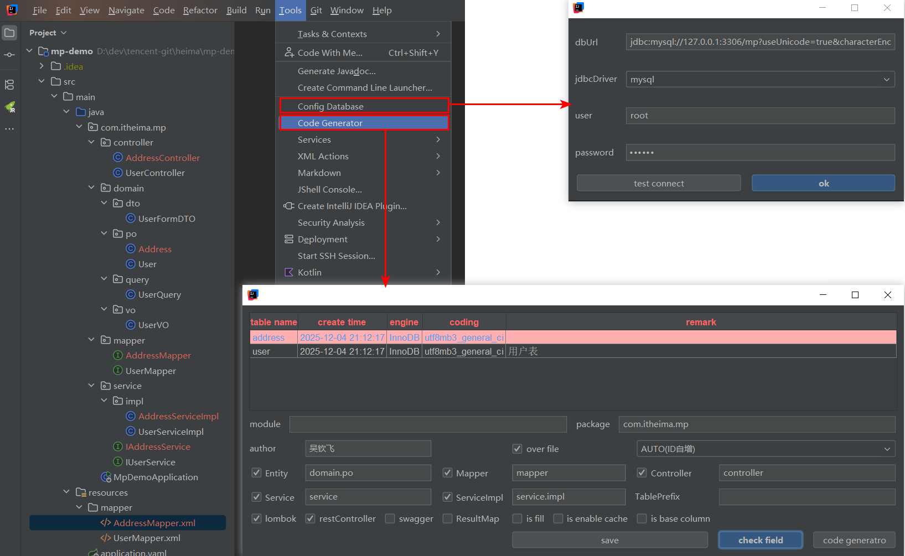

<!--#region
@author 吴钦飞
@email wuqinfei@qq.com
@create date 2025-12-04 18:10:30
@modify date 2025-12-07 19:32:47
@desc [description]
#endregion-->

# MybatisPlus教程-黑马

官网: https://www.baomidou.com/

教程文档: https://ai.feishu.cn/wiki/PsyawI04ei2FQykqfcPcmd7Dnsc

目录:

* 快速入门
* 核心功能
* 扩展功能
* 插件功能

## 1. 快速入门

目录:

* 入门案例
   * 学会 MP 的基本用法
   * 体会 MP 的无侵入和方便快捷的特点
* 常见注解
* 常见配置

### 1.1. 入门案例

使用 MybatisPlus 的基本步骤:

1. 引入 MybatisPlus 依赖，代替 Mybatis 依赖
2. 定义 Mapper 接口并继承 BaseMapper

#### 1.1.1. 引入依赖

MyBatisPlus 官方提供了 starter，其中集成了 Mybatis 和 MybatisPlus 的所有功能，并且实现了自动装配效果。

因此我们可以用MybatisPlus的starter代替Mybatis的starter：

```xml
<!--
<dependency>
   <groupId>org.mybatis.spring.boot</groupId>
   <artifactId>mybatis-spring-boot-starter</artifactId>
   <version>2.3.1</version>
</dependency>
-->
<dependency>
   <groupId>com.baomidou</groupId>
   <artifactId>mybatis-plus-boot-starter</artifactId>
   <version>3.5.3.1</version>
</dependency>
```

#### 1.1.2. 定义 Mapper 接口

自定义的 Mapper 继承 MybatisPlus 提供的 BaseMapper 接口：

```java
public interface UserMapper extends BaseMapper<User> {
   
}
```


继承 BaseMapper 后，就有如下 增删改查方法:

```java
// 增
insert(T entity): int

// 删
deleteById(Serializable id): int
deleteById(T entity): int
deleteByMap(Map<String, Object> columnMap): int
delete(Wrapper<T> queryWrapper): int
deleteBatchIds(Collection<?> idList): int

// 改
updateById(T entity): int
update(T entity, Wrapper<T> updateWrapper): int

// 查
selectById(Serializable id): T
selectBatchIds(Collection<? extends Serializable> idList): List<T>
selectByMap(Map<String, Object> columnMap): List<T>
selectOne(Wrapper<T> queryWrapper): T

selectCount(Wrapper<T> queryWrapper): Long
selectList(Wrapper<T> queryWrapper): List<T>
selectMaps(Wrapper<T> queryWrapper): List<Map<String, Object>>
selectObjs(Wrapper<T> queryWrapper): List<Object>
selectPage(P page, Wrapper<T> queryWrapper): P
selectMapsPage(P page, Wrapper<T> queryWrapper): P

exists(Wrapper<T> queryWrapper): boolean
```

### 1.2. 常见注解

#### 1.2.1. 原理

MyBatisPlus 通过扫描实体类，并基于反射获取实体类信息作为数据库表信息。

1.根据 `BaseMapper<User>` 中的 `User` 实体类信息

```java
public interface UserMapper extends BaseMapper<User> { }

@Data
public class User {
    private Long id;
    private String username;
    private String password;
    private String phone;
    private String info;
    private Integer status;
    private Integer balance;
    private LocalDateTime createTime;
    private LocalDateTime updateTime;
}
```

2.解析实体类获取表信息

* 表名: 类名 驼峰转下划线
* 主键: 名为 id 的成员变量
* 字段名: 成员变量名 驼峰转下划线

以上是按约定来，如果不按约定来则需要显式设置

#### 1.2.2. 基础注解

MybatisPlus 中比较常用的几个注解如下：

* `@TableName` : 指定表名
* `@TableId` : 指定表中的主键字段信息
* `@TableField` : 指定表中的普通字段信息


`@TableName`:

* 当 类名转下划线 后，与数据库表名不一致，则需要显式设置


`@TableId`:

* 设置主键字段及类型(`type`)
* 类型的值为 IdType 枚举类型
* `IdType.AUTO` : 数据库自增长
* `IdType.INPUT` : 通过set方法自行输入
* `IdType.ASSIGN_ID` : 默认。分配 ID，接口 IdentifierGenerator 的方法 nextId 来生成 id，默认实现类为 DefaultIdentifierGenerator 雪花算法


`@TableField`:

* 成员变量名与数据库字段名不一致
* 成员变量名以 `is` 开头，且是布尔值。(反射时通常会去掉 `is`)
   * MySQL不原生支持布尔类型，但 `bit(1)` 或‌ `TINYINT(1)` 常作为替代方案
   * `bit(1)` 更直接映射二进制逻辑，而 `TINYINT(1)` 兼容性更广
   * `bit` 类型存储二进制值，每个位只能是 0 或 1，基础长度为 1 位，默认长度为 1。‌‌
* 成员变量名与数据库关键字冲突。（需要转义）
* 成员变量不是数据库字段

示例:

```java
@TableName("tb_user")
public class User {
   @TableId(value="id", type=IdType.AUTO)
   private Long id;

   @TableField("username")
   private String name;

   @TableField("is_married")
   private Boolean isMarried; // 对应的数据库字段类型 bit(1)

   @TableField("`order`")
   private Integer order;

   @TableField(exist = false)
   private String address;
}
```

#### 1.2.3. 总结

MybatisPlus 是如何获取实现CRUD的数据库表信息的？

* 默认以类名驼峰转下划线作为表名
* 默认把名为id的字段作为主键
* 默认把变量名驼峰转下划线作为表的字段名


MybatisPlus 的常用注解有哪些？

* @TableName：指定表名称及全局配置
* @TableId：指定id字段及相关配置
* @TableField：指定普通字段及相关配置


IdType的常见类型有哪些？

* AUTO 
* ASSIGN_ID
* INPUT


使用 @TableField 的常见场景是？

* 成员变量名与数据库字段名不一致
* 成员变量名以is开头，且是布尔值
* 成员变量名与数据库关键字冲突
* 成员变量不是数据库字段

### 1.3. 常见配置

MyBatisPlus 的配置项继承了 MyBatis 原生配置和一些自己特有的配置。例如：

```yml
mybatis-plus:
  # 别名扫描包  
  # 在 mapper.xml 文件中使用实体类时，可以省略全路径
  type-aliases-package: com.itheima.mp.domain.po 

  # Mapper.xml文件地址，默认值
  # MP 擅长单表增删改查，复杂 SQL 语句还是要在 mapper.xml 文件中写
  mapper-locations: "classpath*:/mapper/**/*.xml" 
  
  configuration:    
    # 是否开启下划线和驼峰的映射    
    map-underscore-to-camel-case: true 
  
    # 是否开启二级缓存
    # 一般不开启
    cache-enabled: false 
  
  global-config:    
    db-config:      
      # id 为雪花算法生成      
      id-type: assign_id 
      # 更新策略：只更新非空字段
      update-strategy: not_null 
```

配置文档: https://www.baomidou.com/reference/

### 1.4. 总结

MyBatisPlus使用的基本流程是什么？

* 引入起步依赖
* 自定义 Mapper 基础 BaseMapper
* 在实体类上添加注解声明 表信息
* 在 application.yml 中根据需要添加配置

## 2. 核心功能

目录:

* 条件构造器
* 自定义 SQL
* Service 接口

### 2.1. 条件构造器

#### 2.1.1. 介绍

MyBatisPlus 支持各种复杂的 where 条件，可以满足日常开发的所有需求。

`Wrapper` 类的继承结构（部分）:

```text
Wrapper
  AbstractWrapper
    QueryWrapper
    UpdateWrapper
    AbstractLambdaWrapper
      LambdaUpdateWrapper
      LambdaQueryWrapper
```

`AbstractWrapper` 里存在各种构造条件方法: (构造 where 语句)

```java
allEq(boolean condition, Map<R, V> params, boolean null2IsNull)

eq(boolean condition, R column, Object val)
ne(boolean condition, R column, Object val)
gt(boolean condition, R column, Object val)
ge(boolean condition, R column, Object val)
lt(boolean condition, R column, Object val)
le(boolean condition, R column, Object val)
like(boolean condition, R column, Object val)
likeLeft(boolean condition, R column, Object val)
likeRight(boolean condition, R column, Object val)
notLike(boolean condition, R column, Object val)
notLikeLeft(boolean condition, R column, Object val)
notLikeRight(boolean condition, R column, Object val)

// ......
```

`QueryWrapper` 查询相关的方法: (构造 SELECT 语句)

```java
// SELECT 语句

// 比如: SELECT id,username,info,balance 
select(String... columns)
select(List<String> columns)
select(Class<T> entityClass, Predicate<TableFieldInfo> predicate)
```

`UpdateWrapper` 更新相关的方法: (构造 SET 语句)

```java
// SET 语句

// 比如: SET balance = balance - 200    
setSql(boolean condition, String sql)
```

AbstractLambdaWrapper/LambdaUpdateWrapper/LambdaQueryWrapper 

* 基于 lambda 语法。推荐使用
* 使用方式与 非lambda 一致，可以避免硬编码
* `QueryWrapper.lambda()` 返回 `LambdaQueryWrapper`
* `UpdateWrapper.lambda()` 返回 `LambdaUpdateWrapper`

#### 2.1.2. 案例: 基于 QueryWrapper 的查询

需求1: 查询出名字中带 `o` 的，存款大于等于 1000 元的人的 id、username、info、balance 字段:

```java
/*
SELECT id,username,info,balance 
FROM user 
WHERE username LIKE ? AND balance >= ?
*/

// 1. 构造查询条件
QueryWrapper<User> wrapper = new QueryWrapper<User>()
        .select("id","username","info","balance" )
        .like("username", "o")
        .ge("balance", 1000);

// lambda 方式避免硬编码
LambdaQueryWrapper<User> wrapper = new LambdaQueryWrapper<User>()
        .select(User::getId,User::getUsername,User::getInfo,User::getBalance )
        .like(User::getUsername, "o")
        .ge(User::getBalance, 1000);

// 2. 查询
List<User> users = userMapper.selectList(wrapper);

users.forEach(System.out::println);
```

需求2: 更新用户名为 jack 的用户的余额为 2000

```java
/*
UPDATE user     
SET balance = 2000     
WHERE (username = "jack")
*/

// 1. 要更新的数据
User user = new User();
user.setBalance(2000);

// 2. 更新的条件
QueryWrapper<User> wrapper = new QueryWrapper<User>()
        .eq("username", "jack");

// 3. 执行更新
int updateCount = userMapper.update(user, wrapper);

System.out.println("updateCount = " + updateCount); //=> 1
```

需求3: 更新 id 为 1,2,4 的用户的余额，扣 200

```java
/*
UPDATE user     
SET balance = balance - 200     
WHERE id in (1, 2, 4)
*/

List<Long> ids = List.of(1L, 2L, 4L);

UpdateWrapper<User> wrapper = new UpdateWrapper<User>()
        .setSql("balance = balance - 200   ")
        .in("id", ids);

int updateCount = userMapper.update(null, wrapper);

System.out.println("updateCount = " + updateCount); //=> 3
```

#### 2.1.3. 总结

条件构造器的用法：

* `QueryWrapper` 和 `LambdaQueryWrapper` 通常用来构建 select、delete、update 的 where 条件部分
* `UpdateWrapper` 和 `LambdaUpdateWrapper` 通常只有在 set 语句比较特殊才使用
* 尽量使用 `LambdaQueryWrapper` 和 `LambdaUpdateWrapper` ，避免硬编码

### 2.2. 自定义 SQL

#### 2.2.1. 介绍

利用 MyBatisPlus 的 Wrapper 来构建复杂的 Where 条件，然后自己定义 SQL 语句中剩下的部分。

需求：将 id 在指定范围的用户（例如 1、2、4 ）的余额扣减指定值

```xml
<!-- 直接在 mapper.xml 文件中写，WHERE 相对来说很繁琐 -->
<update id="updateBalanceByIds">    
  UPDATE user     
  SET balance = balance - #{amount}    
  WHERE id IN    
    <foreach collection="ids" separator="," item="id" open="(" close=")">        
    #{id}    
    </foreach>
</update>
```

```java
// setSql() 直接在 业务层写 SQL 语句，违反开发规范

List<Long> ids = List.of(1L, 2L, 4L);
UpdateWrapper<User> wrapper = new UpdateWrapper<User>()
        .setSql("balance = balance - 200   ")
        .in("id", ids);
int updateCount = userMapper.update(null, wrapper);
```

```xml
<!-- 这种复杂的 SELECT 子句如果通过 MP 的 select() 直接写 SQL 就会违反开发规范 -->
<update id="selectXxx">
  SELECT status, COUNT(id) AS total
  FROM tb_user
  <where>    
    <if test="name != null">AND username LIKE #{name}</if>    
    <if test="ids != null">        
      AND id IN        
        <foreach collection="ids" open="(" close=")" item="id" separator=",">            
          #{id}        
        </foreach>    
    </if>
  </where>
  GROUP BY status
</update>
```

#### 2.2.2. 步骤

步骤1: 基于 Wrapper 构建 WHERE 条件

```java
List<Long> ids = List.of(1L, 2L, 4L);
int amount = 200;

// 1.构建条件
LambdaQueryWrapper<User> wrapper = new LambdaQueryWrapper<User>().in(User::getId, ids);

// 2.自定义 SQL 方法调用
userMapper.updateBalanceByIds(wrapper, amount);

/*
==>  Preparing: UPDATE user SET balance = balance - ? WHERE (id IN (?,?,?))
==> Parameters: 200(Integer), 1(Long), 2(Long), 4(Long)
<==    Updates: 3
  */
```

步骤2: 在 mapper 方法参数中用 `@Param("ew")` 声明 wrapper 变量名称

```java
public interface UserMapper extends BaseMapper<User> {
    // 建议使用 @Param(Constants.WRAPPER) 替代 @Param("ew")  
    // com.baomidou.mybatisplus.core.toolkit.Constants.Constants.WRAPPER = "ew"
    void updateBalanceByIds(@Param("ew") LambdaQueryWrapper<User> wrapper, @Param("amount") int amount);
}
```

步骤3: 自定义SQL，并使用 Wrapper 条件

```xml
<update id="updateBalanceByIds">
    UPDATE user
    SET balance = balance - #{amount}
    <!-- 下面就是 wrapper 构造的 WHERE 子句 -->
    ${ew.customSqlSegment}
</update>
```

### 2.3. IService 基本用法

#### 2.3.1. 介绍

增:

```java
save(T entity): boolean
saveBatch(Collection<T> entityList)   : boolean
saveBatch(Collection<T> entityList)   : boolean
```

删:

```java
remove(Wrapper<T> queryWrapper)                   : boolean

removeById(Serializable id)                       : boolean
removeById(Serializable id, boolean useFill)      : boolean
removeById(T entity)                              : boolean

removeByMap(Map<String, Object> columnMap)        : boolean

// 单个 DELETE 语句，where id in (?,?,?)，适合一千个以内
removeByIds(Collection<?> list)                   : boolean
removeByIds(Collection<?> list, boolean useFill)  : boolean

// 多个 DELETE 语句，批处理，数据量大时 效率高
removeBatchByIds(Collection<?> list)    : boolean
removeBatchByIds(Collection<?> list, boolean useFill) : boolean
removeBatchByIds(Collection<?> list, int batchSize)   : boolean
removeBatchByIds(Collection<?> list, int batchSize, boolean useFill)  : boolean
```

改:

```java
update(Wrapper<T> updateWrapper)            : boolean
update(T entity, Wrapper<T> updateWrapper)  : boolean

updateById(T entity)    : boolean

updateBatchById(Collection<T> entityList)                 : boolean
updateBatchById(Collection<T> entityList, int batchSize)  : boolean
```

增或改:(无 ID 则 INSERT，有 ID 则 UPDATE)

```java
saveOrUpdate(T entity)                          : boolean
saveOrUpdate(T entity, Wrapper<T> updateWrapper): boolean

saveOrUpdateBatch(Collection<T> entityList)                 : boolean
saveOrUpdateBatch(Collection<T> entityList, int batchSize)  : boolean
```

查(单个):

```java
getById(Serializable id)                          : T

getOne(Wrapper<T> queryWrapper)                   : T
getOne(Wrapper<T> queryWrapper, boolean throwEx)  : T
```

查(列表):

```java
// 无参，查所有
list()                            : List<T>
list(Wrapper<T> queryWrapper)     : List<T>

listByIds(Collection<? extends Serializable> idList)  : List<T>
listByMap(Map<String, Object> columnMap)              : List<T>

listMaps()                        : List<Map<String, Object>>
listMaps(Wrapper<T> queryWrapper) : List<Map<String, Object>>

listObjs()                        : List<Object>
listObjs(Wrapper<T> queryWrapper) : List<Object>
listObjs(Function<? super Object, V> mapper)                          : List<V>
listObjs(Wrapper<T> queryWrapper, Function<? super Object, V> mapper) : List<V>
```

查(分页):

```java
page(E page)                          : E
page(E page, Wrapper<T> queryWrapper) : E

pageMaps(E page)                          : E
pageMaps(E page, Wrapper<T> queryWrapper) : E
```

查(总数):

```java
count()                         : long
count(Wrapper<T> queryWrapper)  : long
```

Lambda:（查询或更新 时构造复杂条件）

```java
lambdaQuery()         : LambdaQueryChainWrapper<T>
lambdaQuery(T entity) : LambdaQueryChainWrapper<T>
lambdaUpdate()        : LambdaUpdateChainWrapper<T>
```

#### 2.3.2. 使用

步骤1: 自定义接口继承 `IService<实体类>`

```java
public interface IUserService extends IService<User> {
}
```

步骤2: 自定义接口的实现类 继承 `IService` 的实现类(`ServiceImpl<Mapper,实体类>`)

```java
@Service
public class UserServiceImpl extends ServiceImpl<UserMapper, User> implements IUserService {
}

public interface UserMapper extends BaseMapper<User> {
}
```

测试:

```java
@SpringBootTest
class UserServiceImplTest {
    @Autowired
    private IUserService userService;

    @Test
    void testList() {
        List<User> list = userService.list();
        list.forEach(System.out::println);
    }
}
```

#### 2.3.3. 总结

MP 的 Service 接口使用流程是怎样的？

1.自定义 Service 接口继承 IService 接口

```java
public interface IUserService extends IService<User> {}
```

2.自定义 Service 实现类，实现自定义接口并继承 ServiceImpl 类

```java
public class UserServiceImpl extends ServiceImpl<UserMapper, User> implements IUserService {}
```

### 2.4. IService 开发基础业务接口

>`BaseMapper<User>` 和 `IService<User>` 中的很多方法功能是一致的，实际业务开发时到底使用哪个？

需求：基于 Restful 风格实现下面的接口

| 编号 | 接口 | 请求方式 | 请求路径 | 请求参数 | 返回值 |
| - | - | - | - | - | - |
| 1 | 新增用户 | POST | /users | 用户表单实体DTO | 无 |
| 2 | 删除用户 | DELETE | /users/{id} | 用户ID | 无 |
| 3 | 根据id查询用户 | GET | /users/{id} | 用户ID | 用户VO |
| 4 | 根据id批量查询 | GET | /users | 用户ID集合 | 用户VO集合 |
| 5 | 根据id扣减余额 | PUT | /users/{id}/deduction/{money} | 用户ID/扣减金额 | 无 |

说明:

* PO: Persistent Object, 持久化对象, 如 User
* DTO: Data Transfer Object, 数据传输对象; 控制层 接收参数使用 
* VO: View Object, 控制层; 返回结果使用 

引入依赖: (web 和 swagger)

```xml
<!--swagger-->
<dependency>
    <groupId>com.github.xiaoymin</groupId>
    <artifactId>knife4j-openapi2-spring-boot-starter</artifactId>
    <version>4.1.0</version>
</dependency>
<!--web-->
<dependency>
    <groupId>org.springframework.boot</groupId>
    <artifactId>spring-boot-starter-web</artifactId>
</dependency>
```

配置:(swagger)

```yml
knife4j:
  enable: true
  openapi:
    title: 用户管理接口文档
    description: "用户管理接口文档"
    email: zhanghuyi@itcast.cn
    concat: 虎哥
    url: https://www.itcast.cn
    version: v1.0.0
    group:
      default:
        group-name: default
        api-rule: package
        api-rule-resources:
          - com.itheima.mp.controller
```

访问 swagger:

* http://localhost:8080/doc.html

接口需要两个实体：

* UserFormDTO：代表新增时的用户表单
* UserVO：代表查询的返回结果

```java
@Data
@ApiModel(description = "用户表单实体")
public class UserFormDTO {

    @ApiModelProperty("id")
    private Long id;

    @ApiModelProperty("用户名")
    private String username;

    @ApiModelProperty("密码")
    private String password;

    @ApiModelProperty("注册手机号")
    private String phone;

    @ApiModelProperty("详细信息，JSON风格")
    private String info;

    @ApiModelProperty("账户余额")
    private Integer balance;
}


@Data
@ApiModel(description = "用户VO实体")
public class UserVO {
    
    @ApiModelProperty("用户id")
    private Long id;
    
    @ApiModelProperty("用户名")
    private String username;
    
    @ApiModelProperty("详细信息")
    private String info;

    @ApiModelProperty("使用状态（1正常 2冻结）")
    private Integer status;
    
    @ApiModelProperty("账户余额")
    private Integer balance;
}
```

按照 Restful 风格编写 Controller 接口方法:

```java
@Api(tags = "用户管理接口")
@RequestMapping("users")
@RestController
// 针对加了 final 的成员变量，会添加到构造函数的形参中，进而会被 spring 注入依赖
@RequiredArgsConstructor
public class UserController {

    private final IUserService userService;

    @ApiOperation("新增用户")
    @PostMapping
    public void saveUser(@RequestBody UserFormDTO userFormDTO){
        // 1.转换DTO为PO
        User user = BeanUtil.copyProperties(userFormDTO, User.class);
        // 2.新增
        userService.save(user);
    }

    @ApiOperation("删除用户")
    @DeleteMapping("/{id}")
    public void removeUserById(@ApiParam("用户id") @PathVariable("id") Long userId){
        userService.removeById(userId);
    }

    @ApiOperation("根据id查询用户")
    @GetMapping("/{id}")
    public UserVO queryUserById(@ApiParam("用户id") @PathVariable("id") Long userId){
        // 1.查询用户
        User user = userService.getById(userId);
        // 2.处理vo
        return BeanUtil.copyProperties(user, UserVO.class);
    }

    @ApiOperation("根据id集合查询用户")
    @GetMapping
    public List<UserVO> queryUserByIds(@ApiParam("用户id集合") @RequestParam("ids") List<Long> ids){
        // 1.查询用户
        List<User> users = userService.listByIds(ids);
        // 2.处理vo
        return BeanUtil.copyToList(users, UserVO.class);
    }
}
```

可以看到上述接口都直接在 controller 即可实现，无需编写任何 service 代码，非常方便。

### 2.5. IService 开发复杂业务接口

说明:

* 在 UserServiceImpl 中已经自动注入了 `UserMapper` (`baseMapper`), 通过 this.baseMapper 可以直接调用 `UserMapper` 的方法

示例:

```java
@RequestMapping("users")
@RestController
@RequiredArgsConstructor
public class UserController {
    private final IUserService userService;

    @PutMapping("/{id}/deduction/{money}")
    public void deductionBalance( @PathVariable("id") Long userId, @PathVariable("money") Integer money){
        userService.deductionBalance(userId, money);
    }
}


public interface IUserService extends IService<User> {
    void deductionBalance(Long userId, Integer money);
}


@Service
public class UserServiceImpl extends ServiceImpl<UserMapper, User> implements IUserService {
    @Override
    public void deductionBalance(Long id, Integer money) {
        // 1. 查询用户
        User user = this.getById(id);

        // 2. 校验用户状态
        if (user == null || user.getStatus() == 2) {
            throw new RuntimeException("用户状态异常！");
        }

        // 3. 校验余额是否充足
        Integer balance = user.getBalance();
        if (balance < money) {
            throw new RuntimeException("用户余额不足！");
        }

        // 4. 扣减余额
        // this.baseMapper 指向 UserMapper
        this.baseMapper.deductionBalance(id, money);
    }
}


public interface UserMapper extends BaseMapper<User> {
    @Update("UPDATE user SET balance = balance - #{money} WHERE id = #{id}")
    void deductionBalance(@Param("id") Long id, @Param("money") Integer money);
}
```

### 2.6. IService 的 Lambda 方法

IService 中还提供了 Lambda 功能来简化我们的复杂查询及更新功能

* `lambdaQuery(): LambdaQueryChainWrapper<T>`
* `lambdaUpdate(): LambdaUpdateChainWrapper<T>`

#### 2.6.1. lambdaQuery

案例 1：实现一个根据复杂条件查询用户的接口，查询条件如下

* name：用户名关键字，可以为空
* status：用户状态，可以为空
* minBalance：最小余额，可以为空
* maxBalance：最大余额，可以为空

实现:

```java
// 查询条件实体，UserQuery 实体
@Data
@ApiModel(description = "用户查询条件实体")
public class UserQuery {
    @ApiModelProperty("用户名关键字")
    private String name;
    @ApiModelProperty("用户状态：1-正常，2-冻结")
    private Integer status;
    @ApiModelProperty("余额最小值")
    private Integer minBalance;
    @ApiModelProperty("余额最大值")
    private Integer maxBalance;
}


// controller 
@ApiOperation("根据复杂条件查询用户")
@GetMapping("/list")
public List<UserVO> deductionBalance(UserQuery query){
    // 1.查询用户
    List<User> users = userService.queryUsers(
            query.getName(),
            query.getStatus(),
            query.getMinBalance(),
            query.getMaxBalance()
    );

    // 2.处理vo
    return BeanUtil.copyToList(users, UserVO.class);
}

// service
@Override
public List<User> queryUsers(String name, Integer status, Integer minBalance, Integer maxBalance) {
    return lambdaQuery()
            .like(name != null, User::getUsername, name)
            .eq(status != null, User::getStatus, status)
            .ge(minBalance != null, User::getBalance, minBalance)
            .le(maxBalance != null, User::getBalance, maxBalance)
            .list();
}
```

说明:

* 使用 `lambdaQuery()` 后，无需 `new LambdaQueryWrapper()`
* `lambdaQuery()` 构建完成条件，在最后需要执行查询操作

常用的查询操作: (查看 `ChainQuery`)

* `.one(): T`：最多1个结果
* `.list(): List<T>`：返回集合结果
* `.page(E page): E`：返回集合结果
* `.count(): Long`：返回计数结果
* `.exists(): boolean`：是否存在

#### 2.6.2. lambdaUpdate

需求：改造根据id修改用户余额的接口，要求如下

* 如果扣减后余额为 `0`，则将用户 status 修改为冻结状态（`2`）

实现:

```java
// 加上事务: 可重复读
@Transactional
@Override
public void deductionBalance(Long id, Integer money) {
    // 1. 查询用户
    User user = this.getById(id);

    // 2. 校验用户状态
    if (user == null || user.getStatus() == 2) {
        throw new RuntimeException("用户状态异常！");
    }

    // 3. 校验余额是否充足
    Integer balance = user.getBalance();
    if (balance < money) {
        throw new RuntimeException("用户余额不足！");
    }

    // 4. 扣减余额
    int remainBalance = balance - money;

    lambdaUpdate()
            // 扣减余额: SET balance = ?
            .set(User::getBalance, remainBalance)
            // 如果余额为 0 则改用户状态: SET status = 2
            .set(remainBalance == 0, User::getStatus, 2)
            // WHERE 条件: id = ?
            .eq(User::getId, id)
            // WHERE 条件: balance = ?
            // 乐观锁，多个人同时修改，只有第一个修改成功
            .eq(User::getBalance, balance)
            // 执行更新语句
            .update();
}
```

### 2.7. IService 的批量新增

需求：批量插入 10 万条用户数据，并作出对比

方式:

1. 逐条插入
2. MP 批量插入: 默认情况
3. MP 批量插入: 开启重写批处理参数后

示例:

```java
@Test
void testSaveOneByOne() {
    long start = System.currentTimeMillis();

    for (int i = 0; i < 10_0000; i++) {
        userService.save(buildUser(i));
    }

    long end = System.currentTimeMillis();

    System.out.println("耗时(秒):" + TimeUnit.MILLISECONDS.toSeconds(end - start));
    //=> 78 秒
}

@Test
void testSaveBatch() {
    // 1. 准备一个容量为 1000 的列表
    List<User> list = new ArrayList<>(1000);

    long start = System.currentTimeMillis();

    for (int i = 1; i <= 10_0000; i++) {
        // 2. 往列表添加 user
        list.add(buildUser(i));

        // 3. 每 1000 条批量插入一次
        if (i % 1000 == 0) {
            userService.saveBatch(list);
            // 4. 清空集合，准备下一批数据
            list.clear();
        }
    }

    long end = System.currentTimeMillis();

    System.out.println("耗时(秒):" + TimeUnit.MILLISECONDS.toSeconds(end - start));
    //=> 未开启批处理优化: 8 秒
    //=> 已开启批处理优化: 8 秒
}


private User buildUser(int i) {
    String num = String.valueOf(i);
    LocalDateTime now = LocalDateTime.now();

    User user = new User();

    user.setUsername("user_" + num);
    user.setPassword(num);
    user.setPhone(num);
    user.setBalance(2000);
    user.setInfo("{\"age\": 18, \"intro\": \"美女\", \"gender\": \"female\"}");
    user.setCreateTime(now);
    user.setUpdateTime(now);

    return user;
}
```

#### 2.7.1. 逐条插入

说明:

* 每次请求都只发送一个 INSERT 语句
* 性能极差

原理:

```sql
-- 第 1 次请求
INSERT INTO user (col1,...) VALUES(val1,...)


-- ...


-- 第 100000 次请求
INSERT INTO user (col1,...) VALUES(val00000,...)
```

#### 2.7.2. MP 批量插入: 默认情况

说明:

* 每次网络请求，携带的数据有限，因此批量插入时，将 10 万条数据进行拆分，每次批量处理 1000 条
* 减少了网络请求次数，从 10万次 优化为 100次
* SQL 语句仍旧是逐条执行的

原理:

```sql
-- 第 1 次请求
INSERT INTO user (col1,...) VALUES(val1,...)
-- ...
INSERT INTO user (col1,...) VALUES(val1000,...)


-- ...


-- 第 100 次请求
INSERT INTO user (col1,...) VALUES(val99001,...)
-- ...
INSERT INTO user (col1,...) VALUES(val100000,...)
```

#### 2.7.3. MP 批量插入: 开启重写批处理参数后

说明:

* 在MySQL中，`rewriteBatchedStatements` 是一个 JDBC 连接属性，它用于优化批量更新操作
* 当你执行大量 `INSERT`、`UPDATE` 或 `DELETE` 操作时，将这些操作合并为较少数量的语句可以显著提高性能。
* 比如将多个 `INSERT INTO ... VALUES(...)` 合并为一个 `INSERT INTO ... VALUES(...),(...)`

设置:

```yml
spring:
  datasource:
    url: jdbc:mysql://127.0.0.1:3306/mp?useUnicode=true&characterEncoding=UTF-8&autoReconnect=true&serverTimezone=Asia/Shanghai&rewriteBatchedStatements=true
```

原理:

```sql
-- 第 1 次请求
INSERT INTO user (col1,...) VALUES(val1,...), ..., (val1000,...)


-- ...


-- 第 100 次请求
INSERT INTO user (col1,...) VALUES(val99001,...), ..., (val100000,...)
```

补充:

* 如果不开启 `rewriteBatchedStatements`，通过在 mapper.xml 中拼 SQL 也可以到达上述效果

## 3. 扩展功能

目录:

* 代码生成
* 静态工具
* 逻辑删除
* 枚举处理器
* JSON 处理器

### 3.1. 代码生成

代码生成方式：

1. 引入代码生成器依赖，编写配置，执行代码来生成
2. 使用 IDEA 插件 MyBatisX 进行，通过界面来生成
2. 使用 IDEA 插件 MyBatisPlus 进行，通过界面来生成 【推荐】

#### 3.1.1. MyBatisPlus

>IDEA 2025.2.5

菜单:

* 配置数据库: Tools -> Config Database
* 代码生成器: Tools -> Code Generator

示例:



### 3.2. 静态工具类 Db

Db:

* MP 提供的静态工具类，具备 IService 的所有功能
* 该类没有泛型，使用方法时需要指定 实体类的字节码

应用场景: 

* 当两个 service 互相调用时，形成循环依赖，此时可以使用 Db 来解决

示例:

```java
@Service
public class UserServiceImpl extends ServiceImpl<UserMapper, User> implements IUserService {
    @Override
    public UserVO getUserAndAddressById(Long userId) {
        // 1. 查 用户PO
        User user = getById(userId);

        if (user == null || user.getStatus() == 2) {
            throw new RuntimeException("用户状态异常！");
        }

        // 2. 根据 用户ID 查 地址PO集合
        List<Address> addresses = Db.lambdaQuery(Address.class).eq(Address::getUserId, userId).list();

        // 3. 用户PO 转 用户VO
        UserVO userVO = BeanUtil.copyProperties(user, UserVO.class);

        if (CollUtil.isNotEmpty(addresses)) {
            // 4. 地址PO集合 转 地址VO集合
            List<AddressVO> addressVoList = BeanUtil.copyToList(addresses, AddressVO.class);

            // 5. 将 地址PO集合 塞入 用户VO
            userVO.setAddresses(addressVoList);
        }

        return userVO;
    }
}
```

说明:

* `Db.lambdaQuery(Address.class)` 等价于 `addressService.lambdaQuery()` 

需求: 

* 批量查询用户和地址

分析:

1. 先根据 userIds 查出所有的用户
2. 根据查出来的用户列表，获取有效的 userIds
3. 在根据 userIds 查出所有的地址
4. 对所有的地址进行分组(Map)，key 为 userId, value 为该用户的地址列表
5. 遍历查出来的用户，将该用户的地址列表塞进去

实现:

```java
@Override
public List<UserVO> getUserAndAddressByIds(List<Long> ids) {
    // 1. 先根据 userIds 查出所有的用户
    List<User> userPOs = listByIds(ids);

    if (CollUtil.isEmpty(userPOs)) {
        return Collections.emptyList();
    }

    List<UserVO> userVOs = BeanUtil.copyToList(userPOs, UserVO.class);

    // 2. 根据查出来的用户列表，获取有效的 userIds
    List<Long> userIds = userPOs.stream().map(User::getId).collect(Collectors.toList());

    // 3. 在根据 userIds 查出所有的地址
    List<Address> addressPOs = Db.lambdaQuery(Address.class).in(Address::getUserId, userIds).list();
    List<AddressVO> addressVOs = BeanUtil.copyToList(addressPOs, AddressVO.class);

    if (CollUtil.isEmpty(addressPOs)) {
        return userVOs;
    }

    // 4. 对所有的地址进行分组(Map)，key 为 userId, value 为该用户的地址列表
    Map<Long, List<AddressVO>> addressMap  = addressVOs.stream().collect(Collectors.groupingBy(AddressVO::getUserId));

    // 5. 遍历查出来的用户，将该用户的地址列表塞进去
    userVOs.forEach((userVO) -> userVO.setAddresses(addressMap.get(userVO.getId())));

    return userVOs;
}
```

### 3.3. 逻辑删除

逻辑删除就是基于代码逻辑模拟删除效果，但并不会真正删除数据。

思路如下：

* 在表中添加一个字段标记数据是否被删除
* 当删除数据时把标记置为 1
* 查询时只查询标记为 0 的数据

例如，逻辑删除字段为 `deleted` ：

* 删除操作: `UPDATE user SET deleted = 1 WHERE id = 1 AND deleted = 0`
* 查询操作: `SELECT * FROM user WHERE deleted = 0`

MybatisPlus 提供了逻辑删除功能，无需改变方法调用的方式，而是在底层帮我们自动修改CRUD的语句。

我们要做的就是在 application.yaml 文件中配置逻辑删除的字段名称和值即可：

```yml
mybatis-plus:
  global-config:
    db-config:
      # 全局逻辑删除的实体字段名
      # 只要实体类上有该变量，则默认会标记为逻辑删除字段，启用逻辑删除功能
      # 数据库字段类型可以是 boolean 、integer
      # PO 变量的类型可以是 Boolean
      logic-delete-field: deleted 
      
      # 逻辑已删除值(默认为 1)
      logic-delete-value: 1 
      
      # 逻辑未删除值(默认为 0)
      logic-not-delete-value: 0 
```

给 `address` 表添加一个逻辑删除字段：

```sql
-- 使用 bit 类型，默认会当成 true/false
alter table address add deleted bit default b'0' null comment '逻辑删除';
```

逻辑删除本身也有自己的问题，比如：

* 会导致数据库表垃圾数据越来越多，影响查询效率
* SQL 中全都需要对逻辑删除字段做判断，影响查询效率

因此，不太推荐采用逻辑删除功能，如果数据不能删除，可以采用把数据迁移到其它表的办法。

测试：

```java
@Test
void testLogicDelete() {
    boolean flag = addressService.removeById(59L);
    System.out.println("逻辑删除结果: " + flag);
    //=> true
    //=> UPDATE address SET deleted=1 WHERE id=? AND deleted=0

    Address address = addressService.getById(59L);
    System.out.println("address = " + address);
    //=> null
    //=> SELECT id,user_id,...,deleted FROM address WHERE id=? AND deleted=0
}
```

### 3.4. 枚举处理器

>PO 中枚举类型与数据库字段的相互转换

PO 中的字段类型与数据库中的字段类型，由 MyBatis 的 `TypeHandler` 进行转换

MP 又拓展了两种处理器:

```java
TypeHandler
    BaseTypeHandler
        MybatisEnumTypeHandler
        AbstractJsonTypeHandler
            GsonTypeHandler
            JacksonTypeHandler
            FastjsonTypeHandler
```

实体类中使用枚举:

```java
@Data
public class UserVO {
    // ...

    // 数据库字段: `status` int DEFAULT '1' COMMENT '使用状态（1正常 2冻结）',
    private UserStatus status;
}
```

使用枚举的步骤：

1. 配置枚举处理器
   * 在配置文件里，设置全局枚举处理器 
2. 数据库字段 转换
   * PO 中的枚举类型变量 与 数据字段 的转换
   * 在枚举类里，通过 `@EnumValue` 注解来标记枚举属性
3. JSON 转换
   * Java 对象中的枚举类型变量 与 JSON 属性 的转换
   * 枚举转 JSON 时，默认转化为 枚举的名称（的字符串），即 `"NORMAL"` / `"FREEZE"`
   * 在枚举里，使用 `@JsonValue` 标记转换为哪个属性的值
   * SpringMVC 默认使用 Jackson 处理 JSON，使用 `@JsonValue` 标记转换时取哪个属性

步骤 1. 配置枚举处理器:

```yml
mybatis-plus:
  configuration:
    default-enum-type-handler: com.baomidou.mybatisplus.core.handlers.MybatisEnumTypeHandler
```

步骤 2. 在枚举里标记字段属性:

```java
@Getter
public enum UserStatus {
    NORMAL(1, "正常"),
    FREEZE(2, "冻结")
    ;
    @JsonValue // 使用 Jackson ，枚举 与 JSON 转化时，使用 value
    @EnumValue // 使用 MyBatis ，枚举 与 普通值 转化时，使用 value
    private final int value;
    private final String desc;

    UserStatus(int value, String desc) {
        this.value = value;
        this.desc = desc;
    }
}
```
