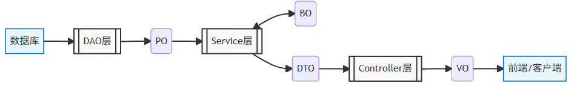

<!--#region
@author 吴钦飞
@email wuqinfei@qq.com
@create date 2025-12-06 10:46:39
@modify date 2025-12-06 17:44:51
@desc [description]
#endregion-->

# Java-分层开发-POJO

## 1. 项目结构

```text
java
  com.itheima.mp
    domain
      dto
        UserFormDTO.java
      po
        User.java
      vo
        UserVO.java
      query               # 查询条件实体
        UserQuery.java    
    controller
      UserController.java
    service
      IUserService.java
      impl
        UserServiceImpl.java
    mapper
      UserMapper.java

resources
  mapper
    UserMapper.xml
  application.yaml
```

## 2. 核心概念与定义

### 2.1. PO

Persistent Object，持久化对象

定义: 

* PO与数据库表结构一一对应，每个字段映射表中的一列，通常由 ORM 框架（如MyBatis、Hibernate）自动生成

作用：

* 用于数据持久化操作，如增删改查（CRUD），仅包含数据，不涉及业务逻辑

示例:(MyBatis)

```java
@Table(name = "t_user")
public class UserPO {
    @Id
    private Long userId;
    private String userName;
    // 其他字段...
} 
```

### 2.2. BO

Business Object，业务对象

定义：

* BO 封装业务逻辑，可由多个 PO 组合而成，包含复杂的业务操作（如数据校验、流程控制）

特点:

* 独立于具体存储方式，可操作数据库、缓存、外部接口等
* 例如，订单 BO 可能包含用户 PO 、商品 PO 和支付信息 PO

示例:

```java
public class OrderBO {
    private OrderPO order;
    private List<ItemPO> items;
    private UserPO user;

    public BigDecimal calculateTotal() {
        // 复杂的计算逻辑...
    }
}
```

### 2.3. DTO

Data Transfer Object，数据传输对象

定义：

* DTO 用于不同层之间的数据传输，尤其是 Service 层与 Controller 层的交互。它可以根据需求封装部分字段，减少不必要的数据传输

特点:

* 可能包含多个 PO 的组合或裁剪后的字段（例如从 30 个字段中选取 10 个传输）
* 支持序列化，常用于远程调用（如 RPC、HTTP 接口）
* 无业务逻辑

示例:

```java
public class UserDTO {
    private String displayName;
    private LocalDateTime registerTime;
    // 转换方法
    public static UserDTO fromPO(UserPO po) {
        // 转换逻辑...
    }
}
```

### 2.4. VO

View Object，视图对象

定义：

* VO 是展示层（前端页面）直接使用的对象，仅包含前端需要展示的数据，通常以 JSON 形式返回

应用场景：

* Controller 层将数据封装为 VO 后传递给前端，避免暴露敏感字段（如密码、内部状态）

示例:

```java
public class UserVO {
    private String formattedDate;
    private String userLevel;
    // 可能包含组合字段...
}
```

### 2.5. POJO

Plain Ordinary Java Object，简单Java对象

定义：

* POJO 是所有简单 Java 对象的统称，VO、DTO、PO 等均属于 POJO

特点：

* 仅包含属性及 Getter/Setter 方法，不依赖特定框架

## 3. 对比与区别

### 3.1. 表格对比

| 对象 | 应用场景                     | 特点                                   |
| ---- | ---------------------------- | -------------------------------------- |
| PO   | 数据库交互                   | 与数据库表严格对应                     |
| BO   | Service 层内部业务逻辑       | 封装复杂业务逻辑，可包含多个 PO 的组合 |
| DTO  | Service 层与 Controller 层间 | 聚合业务所需数据，可能组合多个 PO      |
| VO   | Controller 层与前端交互      | 按前端需求定制字段                     |

### 3.2. 关键区别

PO vs DTO:

* PO 严格映射数据库表
* DTO 可根据业务需求裁剪字段

DTO vs VO:

* DTO 关注传输效率
* VO 关注展示效果
* 例如，DTO 可能包含敏感字段（如用户ID），而 VO 仅展示脱敏后的信息

BO vs PO:

* BO 包含业务逻辑
* PO 仅存储数据
* 例如，订单 BO 可能计算总价，而订单 PO 仅记录金额

### 3.3. 流转图



查询用户信息并返回给前端:

1. DAO 层通过 UserDAO 查询数据库，返回 UserPO
2. Service 层将 UserPO 转换为 UserDTO ，过滤敏感字段
3. Controller 层将 UserDTO 转换为 UserVO，添加前端需要的格式化字段（如日期字符串）

## 4. 总结

合理使用 VO、DTO、PO 和 BO 等对象能有效实现解耦、提高灵活性和安全性。

VO 保护敏感数据

DTO 适配不同接口需求

PO 确保数据持久化准确

BO封装复杂业务逻辑

在开发中，根据项目复杂度选择合适的对象类型，并统一团队规范，提升代码可读性和可维护性。

## 5. 参考

* [Java分层开发必知：PO、BO、DTO、VO、POJO概念详解](https://cloud.tencent.com/developer/article/2519672)
