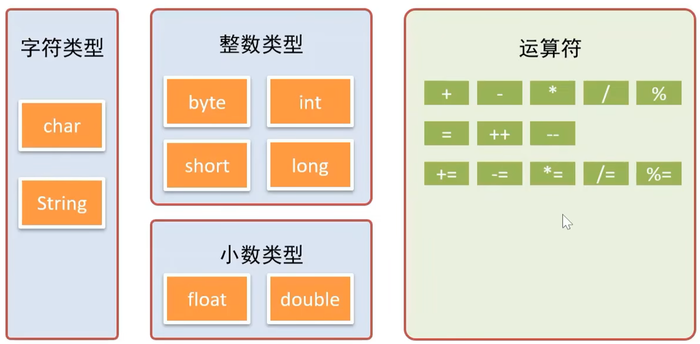
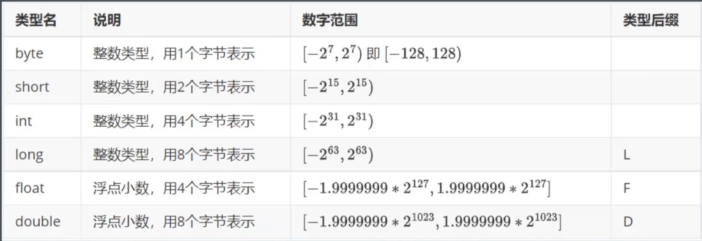
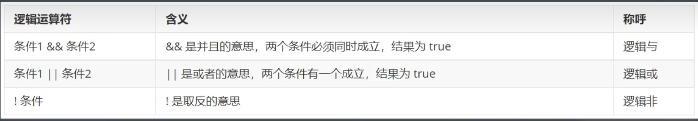

# 开发命令行程序

[[toc]]

## 1. 输入输出

输入：

* 由使用者告诉程序要操作的数据
* `System.in` / `new Scanner(System.in)`

输出：

* 由程序向使用者展现执行的结果
* `System.out`

示例：

```text
# System.in 不是很方便
jshell> System.in.read()
a
$5 ==> 97

jshell> var scanner = new Scanner(System.in)
scanner ==> java.util.Scanner[...]

jshell> var in = scanner.nextLine()
abc
in ==> "abc"

jshell> in
in ==> "abc"

jshell> System.out.println(in)
abc
```

## 2. 字符运算

字符值：

* 有且仅有一个字符，单引号界定
* 如：

  ```java
  'a'
  '中'
  ```

字符串值：

* 可以有N个字符，双引号界定
* 如：

  ```java
  "abc"
  "abc" + "de"; //=> "abcde"
  ```

文本块值：

* 多行文本，三个双引号界定
* 如：

  ```java
  """
  abc
  123
  """
  ```

转义字符：

* 特殊含义，以 `\` 打头
* 如：

  ```text
  jshell> System.out.println('\'')
  '

  jshell> System.out.println("\"")
  "

  jshell> System.out.println("\\")
  \

  jshell> System.out.println("12\n34")
  12
  34

  jshell> System.out.println("12\b34") // 退格
  134

  jshell> System.out.println("12\r34") // 回车，从头开始
  34

  jshell> System.out.println("12\t34")
  12      34
  ```

## 3. 数学运算

类型：

* 

数字类型：

* 

定义变量：

* 例：

  ```java
  int num = 10;
  // num ==> 10

  double salary = 12000.00
  // salary ==> 12000.0

  char ch = 'a';
  // ch ==> 'a'

  String name = "张三";
  // name ==> "张三"

  var scanner = new Scanner(System.in);

  String in = scanner.nextLine();
  // abc
  // in ==> "abc"

  int in2 = scanner.nextInt();
  // 123
  // in2 ==> 123
  ```

运算符：

* 例：

  ```java
  1 + 1;
  //==> 2

  2 - 1;
  //==> 1

  2 * 2;
  //==> 4

  5 / 3;
  //==> 1

  5.0 / 3;
  //==> 1.6666666666666667

  5 / 0;
  //|  异常错误 java.lang.ArithmeticException：/ by zero
  //|        at (#14:1)

  5.0 / 0;
  //==> Infinity

  5 % 3;
  //==> 2
  ```

数字的货币格式化：

```java
java.text.NumberFormat.getCurrencyInstance(Locale.US)
  .format(123456789.123456789);
//==> "$123,456,789.12"
```

## 4. 条件语句

示例：

```java
if (score >= 90) {
  // A
} else if (score >= 80) {
  // B
} else if (score >= 60) {
  // C
} else {
  // D
}
```

逻辑运算符：



优化：

```java
// 一个入口，一个出口
if (c) {
  // 分支 1
} else {
  // 分支 2
}

//==> 一个入口，多个出口

if (!c) {
  // 分支 2
  return;
}
// 分支 1
```

## 5. 循环语句

语法：

```text
for (初始化变量 (1); 终止条件 (2); 更新变量 (3)) {
  // 循环体 (4)
}

顺序：

1 -> 2 -> 4 -> 3 ->
     2 -> 4 -> 3 ->
     2 -> 4 -> 3 ->
     ...
```

示例：

```java
int sum = 0;

for (int i = 1; i <= 100; i++) {
  sum += i;
}

System.out.println(sum);
```

## 6. 方法使用