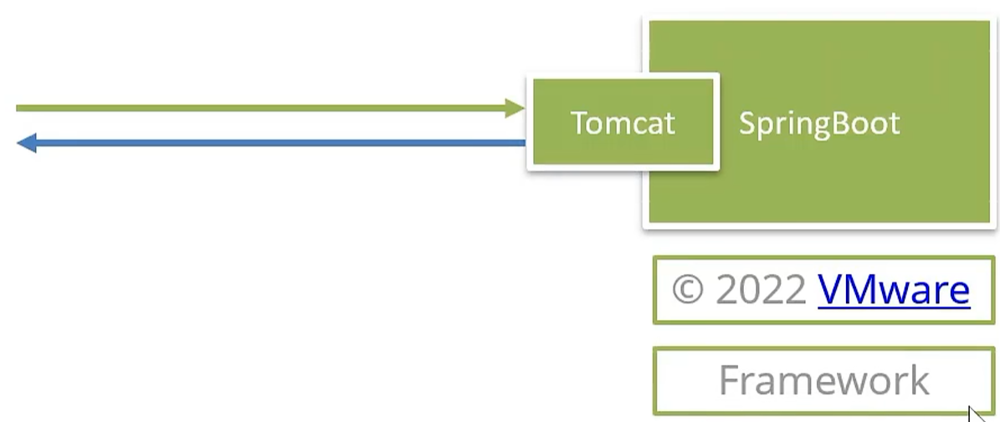
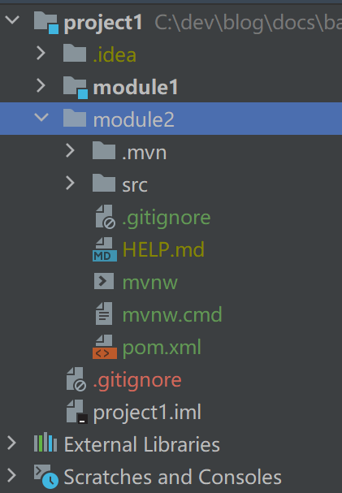
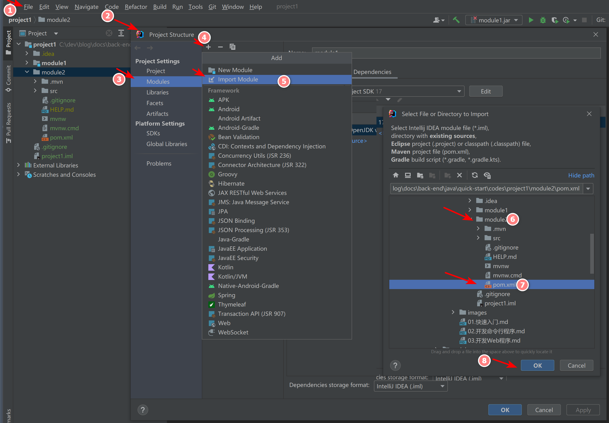
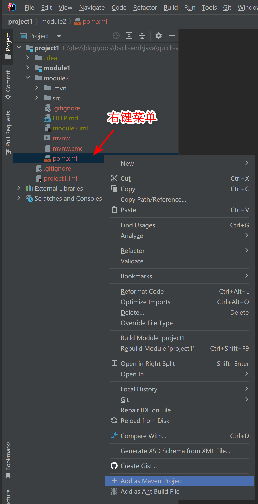

# 开发Web程序

[[toc]]

## 1. C/S 架构


也可以认为是 B/S 架构，因为 C 端为 Browser


## 2. SpringBoot简介



framework(框架):

* 条条框框，必须按照框架的规则来编写代码
* 通用功能，框架提供了很多通用的功能，能够节省开发时间，提升开发效率

参考：

* [是时候给大家介绍 Spring Boot/Cloud 背后豪华的研发团队了](https://developer.aliyun.com/article/686829)

## 3. 生成骨架代码

>1.通过网页生成；2.通过 idea 引导生成

### 3.1. spring initializr

官网：

* [https://start.spring.io/](https://start.spring.io/)

示例：

* 

### 3.2. Aliyun Java Initializr

地址：

* [https://start.aliyun.com/bootstrap.html](https://start.aliyun.com/bootstrap.html)


示例：

* 

修改：（spring 版本、java 版本）

```text
pom.xml:

  1.8 --> 17
    三处修改

  2.3.7.RELEASE --> 2.7.5
    两处修改
```

### 3.3. 导入

#### 3.3.1. 将 module2.zip 解压，并拷贝到项目



#### 3.3.2. 修改 idea 内置 maven 配置：

```xml
<!-- 
  IntelliJ IDEA 2022.2.3\plugins\maven\lib\maven3\conf\settings.xml
-->

<mirror>
  <id>central</id>
  <mirrorOf>central</mirrorOf>
  <url>https://maven.aliyun.com/repository/public</url>
</mirror>
```

#### 3.3.3. 导入项目

方式一：（导入模块）



方式二：（作为maven项目添加进来）



参考：

* [成功解决 Plugin ‘org.springframework.boot:spring-boot-maven-plugin:‘ not found](https://blog.csdn.net/weixin_46291251/article/details/125289383)

## 4. springboot 入门

示例：

<<< @/docs/back-end/java/quick-start/codes/project1/module2/src/main/java/xyz/study/module2/HelloController.java

运行：

```text

执行 Module2Application.java 类即可


  .   ____          _            __ _ _
 /\\ / ___'_ __ _ _(_)_ __  __ _ \ \ \ \
( ( )\___ | '_ | '_| | '_ \/ _` | \ \ \ \
 \\/  ___)| |_)| | | | | || (_| |  ) ) ) )
  '  |____| .__|_| |_|_| |_\__, | / / / /
 =========|_|==============|___/=/_/_/_/
 :: Spring Boot ::                (v2.7.4)

... : Tomcat initialized with port(s): 8080 (http)
... : Starting service [Tomcat]
... : Starting Servlet engine: [Apache Tomcat/9.0.65]
... : Tomcat started on port(s): 8080 (http) with context path ''
... : Completed initialization in 1 ms

```

测试：

* http://localhost:8080/sayHello
* http://localhost:8080/sayBye

## 5. 数组

定义：

```text
1. 类型[] 变量名 = new 类型[长度]

2. 类型[] 变量名 = new 类型[]{ 元素1, 元素2, ... }

3. 类型[] 变量名 = { 元素1, 元素2, ... }
```

示例：

```java
int[] nums = new int[3];
nums[0] = 1;
nums[1] = 10;
nums[2] = 100;
System.out.println(Arrays.toString(nums)); // [1, 10, 100]

double[] prices = new double[]{1.0, 2.0, 3.0};
System.out.println(Arrays.toString(prices));

String[] statements = { "123", "abc", "xyz" };
System.out.println(Arrays.toString(statements) + '\t' + statements.length);
```

数组长度：

* `arr.length`, 获取数组`arr`的长度
* 数组长度一旦定义，就不能更改

数组越界：

```java
int[] arr = {0};
System.out.println(arr[-1]); // ArrayIndexOutOfBoundsException
```

遍历数组：

```java
for (int i = 0; i < nums.length; i++) {
    System.out.println(nums[i]);
}

// enhanced 'for' 
for (int num: nums) {
    System.out.println(num);
}
```

默认值：

```java
new String[3];  // [null, null, null]
new int[3];     // [0, 0, 0]
new double[3];  // [0.0, 0.0, 0.0]
new boolean[3]; // [false, false, false]
```
