<!--#region
@author 吴钦飞
@email wuqinfei@qq.com
@create date 2025-09-19 16:48:39
@modify date 2025-11-10 20:33:31
@desc [description]
#endregion-->


# redis-实战篇

目录:

* 短信登录

   * Redis 的共享 session 应用

* 商户查询缓存

   * 企业的缓存使用技巧
   * 解决 缓存雪崩、穿透 等问题

* 优惠券秒杀

   * Redis 的计数器、Lua 脚本 Redis
   * 分布式锁
   * Redis 的三种消息队列

* 达人探店

   * 基于 List 的点赞列表
   * 基于 SortedSet 的点赞排行榜

* 好友关注

   * 基于 Set 集合的关注、取关、共同关注
   * 消息推送等功能

* 附近的商户

   * Redis 的 GeoHash 的应用
   
* 用户签到

   * Redis 的 BitMap 数据统计功能

* UV统计

   * Redis 的 HyperLogLog 的统计功能

## 1. 短信登录

### 1.1. 导入黑马点评项目

表:

* tb_user: 用户
* tb_user_info: 用户详情 
* tb_shop: 商户信息
* tb_shop_type: 商户类型
* tb_blog: 用户日记
* tb_follow: 用户关注
* tb_voucher: 优惠券
* tb_voucher_order: 优惠券的订单

架构:


测试:

* 服务端: http://localhost:8081/api/shop-type/list
* 客户端: http://localhost:8080 (移动端Web模式)
   * 启动 Ngxin: `start nginx.exe` (CMD)

### 1.2. 基于 Session 实现登录

#### 1.2.1. 流程


#### 1.2.2. 发送验证码

```java
@Service
@Slf4j
public class UserServiceImpl extends ServiceImpl<UserMapper, User> implements IUserService {

    @Override
    public Result sendCode(String phone, HttpSession session) {
        // 1. 校验手机号
        boolean phoneInvalid = RegexUtils.isPhoneInvalid(phone);

        // 2. 如果校验失败，则返回错误信息
        if (phoneInvalid) {
            return Result.fail("手机号格式错误");
        }

        // 3. 校验成功，生成验证码 (cn.hutool.core.util.RandomUtil)
        String code = RandomUtil.randomNumbers(6);

        // 4. 保存验证码到 session
        session.setAttribute("code", code);

        // 5. 发送验证码到手机 (直接在控制台打印)
        log.debug("发送验证码成功，验证码为: {}", code);

        // 返回 成功
        return Result.ok();
    }
}
```

#### 1.2.3. 短信验证码登录和注册

```java
@Override
public Result login(LoginFormDTO loginForm, HttpSession session) {
   String phone = loginForm.getPhone();

   // 1. 校验手机号
   boolean phoneInvalid = RegexUtils.isPhoneInvalid(phone);
   // 1.1 如果校验失败，则返回错误信息
   if (phoneInvalid) {
      return Result.fail("手机号格式错误");
   }

   // 2. 校验验证码
   String code = loginForm.getCode();
   Object cachedCode = session.getAttribute("code");

   // 2.1 不一致，报错
   if (cachedCode == null || !cachedCode.toString().equals(code)) {
      return Result.fail("验证码错误");
   }

   // 3. 根据手机号查询用户
//        User user = lambdaQuery().eq(User::getPhone, phone).one(); // ?? 为什么不可以
   User user = query().eq("phone", phone).one();

   // 4. 用户不存在则创建
   if (user == null) {
      user = createUserWithPhone(phone);
   }

   // 5. 保存用户信息到 session
   session.setAttribute("user", user);

   return Result.ok();
}

private User createUserWithPhone(String phone) {
   User user = new User();

   user.setPhone(phone);
   user.setNickName(USER_NICK_NAME_PREFIX + RandomUtil.randomString(6));

   save(user);

   return user;
}
```

#### 1.2.4. 登录校验拦截器

UserHolder:

```java
public class UserHolder {
    private static final ThreadLocal<User> tl = new ThreadLocal<>();

    public static void saveUser(User user){
        tl.set(user);
    }

    public static User getUser(){
        return tl.get();
    }

    public static void removeUser(){
        tl.remove();
    }
}
```

拦截器: 

```java
/**
 * 每个请求处理之前 都判断 session 中是否有 user,
 *    有 则 存入 ThreadLocal，供后续方法进行处理，并放行
 *    无 则 返回 401，不放行
 * 请求处理完毕，则销毁掉 ThreadLocal 中的 User
 */
@Slf4j
public class LoginInterceptor implements HandlerInterceptor {
    @Override
    public boolean preHandle(HttpServletRequest request, HttpServletResponse response, Object handler) throws Exception {
        // 1. 获取 session
        HttpSession session = request.getSession();

        // 2. 获取 session 中的用户
        Object user = session.getAttribute("user");

        // 3. 用户不存在，拦截 并返回 401 或抛异常
        if (user == null) {
            log.info("用户不存在");
            response.setStatus(401);
            return false;
        }

        // 4. 用户存在，存入 ThreadLocal
        UserHolder.saveUser((User) user);

        // 5. 放行
        return true;
    }

    @Override
    public void afterCompletion(HttpServletRequest request, HttpServletResponse response, Object handler, Exception ex) throws Exception {
        UserHolder.removeUser();
    }
}
```

注册拦截器:

```java
@Configuration
public class MvcConfig implements WebMvcConfigurer {
    @Override
    public void addInterceptors(InterceptorRegistry registry) {
        registry
                .addInterceptor(new LoginInterceptor())
                // 排除（不拦截）
                .excludePathPatterns(
                        "/shop/**",
                        "/shop-type/**",
                        "/voucher/**",
                        "/upload/**",
                        "/blog/hot",

                        "/user/code",
                        "/user/login"
                );
    }
}
```

#### 1.2.5. 隐藏用户敏感信息

说明:

* 接口返回的 User 是一个完整的对象，包含用户所有的信息，其中有很多敏感的数据
* ThreadLocal 里存储的 User 越小越好

### 1.3. 集群的 Session 共享问题


session 共享问题:

* 多台 Tomcat 并不共享 session 存储空间，当请求切换到不同 Tomcat 服务时导致数据丢失的问题

session 的替代方案应该满足:

* 数据共享
* 内存存储
* key、value 结构

### 1.4. 基于 Redis 实现共享 Session 登录

#### 1.4.1. Redis 代替 session 的业务流程

发送短信验证码:


短信验证码登录、注册:

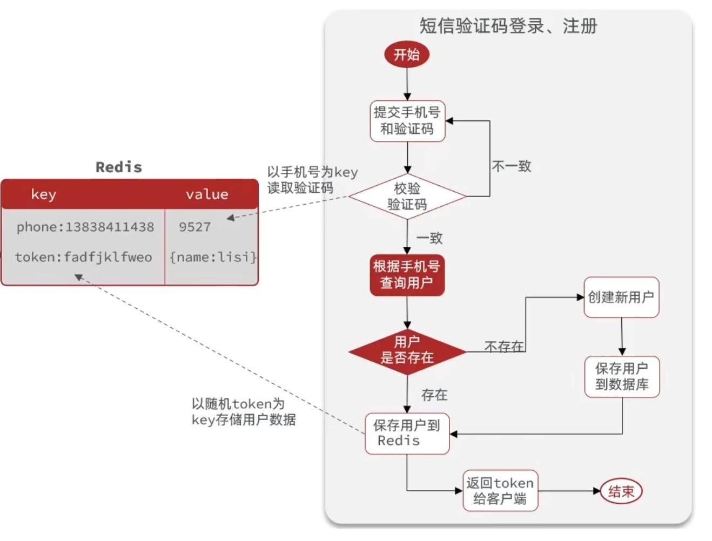

校验登录状态:

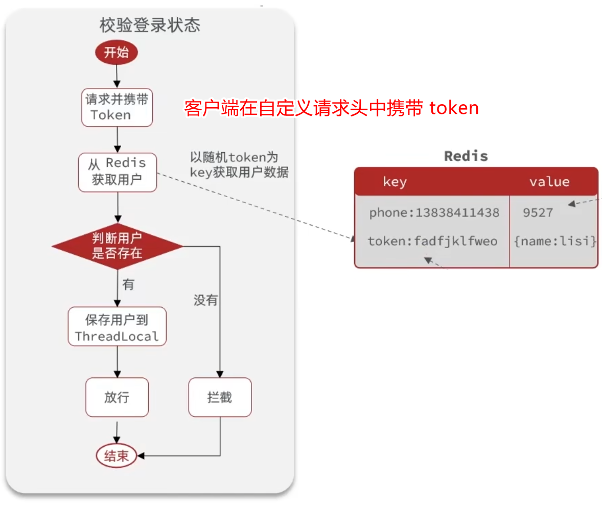


#### 1.4.2. 发送短信验证码

```java
public class RedisConstants {
    public static final String LOGIN_CODE_KEY = "login:code:";
    public static final Long LOGIN_CODE_TTL = 2L;
}

// ...

@Autowired
private StringRedisTemplate stringRedisTemplate;

// 4. 保存验证码到 redis
stringRedisTemplate.opsForValue().set(LOGIN_CODE_KEY + "phone", code, LOGIN_CODE_TTL, TimeUnit.MINUTES);
```

#### 1.4.3. 短信验证码登录、注册

```java
@Override
public Result login(LoginFormDTO loginForm, HttpSession session) {
   String phone = loginForm.getPhone();

   // 1. 校验手机号
   boolean phoneInvalid = RegexUtils.isPhoneInvalid(phone);
   // 1.1 如果校验失败，则返回错误信息
   if (phoneInvalid) {
      return Result.fail("手机号格式错误");
   }

   // 2. 校验验证码
   String code = loginForm.getCode();
   String cachedCode = stringRedisTemplate.opsForValue().get(LOGIN_CODE_KEY + phone);

   // 2.1 不一致，报错
   if (cachedCode == null || !cachedCode.equals(code)) {
      return Result.fail("验证码错误");
   }

   // 3. 根据手机号查询用户
   User user = query().eq("phone", phone).one();

   // 4. 用户不存在则创建
   if (user == null) {
      user = createUserWithPhone(phone);
   }

   // 5. 保存用户信息到 redis

   // 5.1 生成随机 token (uuid)
   String token = UUID.randomUUID().toString(true); // true - 不带中划线的 UUID

   // 5.2 将 user 转 Map
   UserDTO userDTO = BeanUtil.copyProperties(user, UserDTO.class);

   // stringRedisTemplate 要求 Hash 值中的 value 必须为 String
   CopyOptions copyOptions = CopyOptions.create()
            .setIgnoreNullValue(true)
            .setFieldValueEditor((fieldName, fieldValue) -> fieldValue.toString());
   Map<String, Object> userMap = BeanUtil.beanToMap(userDTO, new HashMap<>(), copyOptions);

   // 5.3 将 userMap 存储到 Redis
   String tokenKey = LOGIN_USER_KEY + token;
   stringRedisTemplate.opsForHash().putAll(tokenKey, userMap);

   // 5.4 设置 token 有效期
   stringRedisTemplate.expire(tokenKey, LOGIN_USER_TTL, TimeUnit.MINUTES);

   // 6. 将 token 返回给前端
   return Result.ok(token);
}
```

#### 1.4.4. 校验登录状态

```java
@Slf4j
public class LoginInterceptor implements HandlerInterceptor {
    private final StringRedisTemplate stringRedisTemplate;

    public LoginInterceptor(StringRedisTemplate stringRedisTemplate) {
        this.stringRedisTemplate = stringRedisTemplate;
    }

    @Override
    public boolean preHandle(HttpServletRequest request, HttpServletResponse response, Object handler) throws Exception {
        // 1. 获取请求头中 token
        String token = request.getHeader("authorization");

        // 1.1 不能存在，则返回 401
        if (StrUtil.isEmpty(token)) {
            log.info("未携带自定义请求头: authorization=token");
            response.setStatus(401);
            return false;
        }

        // 2. 基于 token 获取 Redis 中存储的 user
        String tokenKey = RedisConstants.LOGIN_USER_KEY + token;
        Map<Object, Object> userMap = stringRedisTemplate.opsForHash().entries(tokenKey);

        // 3. 用户不存在，拦截 并返回 401 或抛异常
        if (CollectionUtil.isEmpty(userMap)) {
            log.info("用户不存在");
            response.setStatus(401);
            return false;
        }

        // 4. 用户存在，存入 ThreadLocal
        UserDTO userDTO = BeanUtil.fillBeanWithMap(userMap, new UserDTO(), false);
        UserHolder.saveUser(userDTO);

        // 5. 刷新 token 有效期
        stringRedisTemplate.expire(tokenKey, RedisConstants.LOGIN_USER_TTL, TimeUnit.MINUTES);

        // 6. 放行
        return true;
    }

    @Override
    public void afterCompletion(HttpServletRequest request, HttpServletResponse response, Object handler, Exception ex) throws Exception {
        UserHolder.removeUser();
    }
}
```

### 1.5. 优化登录拦截器

说明:

* 登录拦截器，拦截 非匿名 请求，校验用户是否登录（ThreadLocal 中是否有 user）
* token 刷新拦截器，拦截所有请求，校验 token 并将 user 保存到 ThreadLocal


代码:

```java
@Configuration
public class MvcConfig implements WebMvcConfigurer {
    @Resource
    private StringRedisTemplate stringRedisTemplate;

    // 注册拦截器
    @Override
    public void addInterceptors(InterceptorRegistry registry) {
        registry.addInterceptor(new RefreshTokenInterceptor(stringRedisTemplate))
                // 拦截器的顺序默认为 0 （越小优先级高），相同则先添加的先执行
                .order(0)
                // 默认就是拦截所有
                .addPathPatterns("/**");

        registry
                .addInterceptor(new LoginInterceptor())
                .order(1)
                // 排除（不拦截）
                .excludePathPatterns(
                        "/shop/**",
                        "/shop-type/**",
                        "/voucher/**",
                        "/upload/**",
                        "/blog/hot",

                        "/user/code",
                        "/user/login"
                );

    }
}

// 刷新 token 拦截器
@Slf4j
public class RefreshTokenInterceptor implements HandlerInterceptor {
    private final StringRedisTemplate stringRedisTemplate;

    public RefreshTokenInterceptor(StringRedisTemplate stringRedisTemplate) {
        this.stringRedisTemplate = stringRedisTemplate;
    }

    @Override
    public boolean preHandle(HttpServletRequest request, HttpServletResponse response, Object handler) throws Exception {
        // 1. 获取请求头中 token
        String token = request.getHeader("authorization");

        // 1.1 不存在，直接放行 并 返回
        if (StrUtil.isEmpty(token)) {
            log.info("token 为空");
            return true;
        }

        // 2. 基于 token 获取 Redis 中存储的 user
        String tokenKey = RedisConstants.LOGIN_USER_KEY + token;
        Map<Object, Object> userMap = stringRedisTemplate.opsForHash().entries(tokenKey);

        // 3. 用户不存在，直接放行 并 返回
        if (CollectionUtil.isEmpty(userMap)) {
            log.info("用户不存在");
            return true;
        }

        // 4. 用户存在，存入 ThreadLocal
        UserDTO userDTO = BeanUtil.fillBeanWithMap(userMap, new UserDTO(), false);
        UserHolder.saveUser(userDTO);

        // 5. 刷新 token 有效期
        stringRedisTemplate.expire(tokenKey, RedisConstants.LOGIN_USER_TTL, TimeUnit.MINUTES);

        // 6. 放行
        return true;
    }

    @Override
    public void afterCompletion(HttpServletRequest request, HttpServletResponse response, Object handler, Exception ex) throws Exception {
        UserHolder.removeUser();
    }
}

// 登录拦截器
@Slf4j
public class LoginInterceptor implements HandlerInterceptor {
    @Override
    public boolean preHandle(HttpServletRequest request, HttpServletResponse response, Object handler) throws Exception {
        // 判断 ThreadLocal 中是否有 user，无则返回 401
        if (UserHolder.getUser() == null) {
            log.info("未登录");
            response.setStatus(401);
            return false;
        }
        return true;
    }
}
```

## 2. 商户查询缓存

目录:

* 什么是缓存
* 添加 Redis 缓存
* 缓存更新策略
* 缓存穿透
* 缓存雪崩
* 缓存击穿
* 缓存工具封装

### 2.1. 什么是缓存

缓存:

* 缓存就是数据交换的缓冲区（cache）
* 是存储数据的临时地方，一般读写性能较高

作用:

* 降低后端负载
* 提高读写效率，减少响应时间

成本:

* 数据一致性成本
* 代码维护成本
* 运维成本

### 2.2. 添加 Redis 缓存

功能：

* 添加商户缓存

流程:

1. 从 Redis 查询商铺
2. Redis 里存在，则直接返回
3. Redis 里不存在，则根据 id 查询数据库
4. 数据库 里不存在，返回错误
5. 数据库 里存在，则写入 Redis
6. 返回

### 2.3. 缓存更新策略

策略:

| 策略 | 内存淘汰 | 超时剔除 | 主动更新 |
| - | - | - | - |
| 说明 | 不用自己维护，利用 Redis 的内存淘汰机制，当内存不足时自动淘汰部分数据。下次查询时更新缓存 | 给缓存数据添加 TTL 时间，到期后自动删除缓存。下次查询时更新缓存 | 编写业务逻辑，在修改数据库的同时，更新缓存 |
| 一致性 | 差 | 一般 | 好 |
| 维护成本 | 无 | 低 | 高 |

业务场景:

* 低一致性需求: 使用内存淘汰机制。例如 店铺类型 的查询缓存。
* 高一致性需求: 主动更新，并以超时剔除作为兜底方案。例如 店铺详情 的查询缓存

主动更新策略:

* 【√】Cache Aside Pattern 
   * 由缓存的调用者，在更新数据库的同时更新缓存 【主动更新】
* Read/Write Through Pattern
   * 缓存与数据库整合为一个服务，由服务来维护一致性
   * 调用者调用该服务，无需关心缓存一致性问题
* Write Behind Caching Pattern
   * 调用者只操作缓存
   * 由其它线程异步的将缓存数据持久化到数据库，保证最终一致性

主动更新 需要考虑如下问题:

1. 删除缓存还是更新缓存?

   * 更新缓存: 每次更新数据库都更新缓存，无效写操作较多【×】
   * 删除缓存: 更新数据库时让缓存失效，查询时再更新缓存【√】
   
2. 如何保证缓存与数据库的操作 同时成功或失败【事务问题】

   * 单体系统: 将缓存与数据库操作放在同一个事物
   * 分布式系统: 利用 TCC 等分布式事务方案

3. 先操作 缓存 还是先操作 数据库？【线程安全问题】

   * 先删除缓存，再操作数据库【×】
   * 先操作数据库，再删除缓存【√】


分析 “先操作 缓存 还是先操作 数据库”：


最佳实践:

1. 低一致性需求: 使用 Redis 自带的内存淘汰机制
2. 高一致性需求: 主动更新，并以超时剔除作为兜底方案
   * 读操作
      * 缓存命中则直接返回
      * 缓存未命中则查询数据库，并写入缓存，设定超时时间
   * 写操作
      * 先写数据库，然后再删除缓存
      * 要确保数据库与缓存操作的原子性

案例: 修改 ShopController 中的业务逻辑，满足如下需求

* 根据 ID 查询店铺时，如果换成未命中，则查询数据库，将数据库结果写入缓存，并设置超时时间
* 根据 ID 修改店铺时，先修改数据库，再删除缓存

```java
@Transactional
@Override
public Result update(Shop shop) {
    Long id = shop.getId();

    if (id == null) {
        return Result.fail("店铺ID不能为空");
    }

    // 1. 先修改数据库
    updateById(shop);

    // 2. 再修改Redis
    stringRedisTemplate.delete(GET_CACHE_SHOP_KEY(id));

    return Result.ok();
}
```

### 2.4. 缓存穿透

说明:

* 缓存穿透 是指客户端请求的数据在缓存中和数据库中都不存在，这样缓存永远不会生效，这些请求都会到达数据库
* 不断发起这样的请求，会给数据库带来巨大的压力

常见解决方案:

* 缓存空对象【√】
* 布隆过滤

缓存空对象:

* 优点: 实现简单，维护方便
* 缺点: 额外的内存消耗；可能造成短期的不一致


布隆过滤:

* 优点: 内存占用较少，没有多余 key
* 缺点: 实现复杂; 存在误判的可能


其他主动方案: （该讲师的 SpringCould 课程里有讲）

* 增强 id 的复杂度，避免被猜测 id 规律
* 做好数据的基础格式校验
* 加强用户权限校验
* 做好热点参数的限流

解决商铺查询的缓存穿透问题:


代码:

```java
@Override
public Result queryById(Long id) {
    // 1. 从 Redis 查询商铺
    String shopKey = GET_CACHE_SHOP_KEY(id);
    String shopJsonStr = stringRedisTemplate.opsForValue().get(shopKey);

    // 2. Redis 里存在，则直接返回
    if (StrUtil.isNotBlank(shopJsonStr)) {
        Shop shop = JSONUtil.toBean(shopJsonStr, Shop.class);
        return Result.ok(shop);
    }

    // 如果 缓存空对象 则返回错误
    // StrUtil.isBlank(shopJsonStr) 一定为 true，因为 第 2 步里已经判断了 StrUtil.isNotBlank
    if (shopJsonStr != null && StrUtil.isBlank(shopJsonStr)) { 
        // 返回错误
        return Result.fail("【缓存空对象】店铺不存在");
    }

    // 3. Redis 里不存在，则根据 id 查询数据库
    Shop shop = getById(id);

    // 4. 数据库 里不存在，则缓存空值并返回错误
    if (shop == null) {
        // 缓存空字符串，2 分钟过期
        stringRedisTemplate.opsForValue().set(shopKey, "", CACHE_NULL_TTL, TimeUnit.MINUTES);
        // 返回错误
        return Result.fail("店铺不存在");
    }

    // 5. 数据库 里存在，则写入 Redis
    stringRedisTemplate.opsForValue().set(shopKey, JSONUtil.toJsonStr(shop), CACHE_SHOP_TTL, TimeUnit.MINUTES);

    // 6. 返回
    return Result.ok(shop);
}
```

### 2.5. 缓存雪崩

说明:

* 缓存雪崩 是指在同一时间段大量的缓存 key 同时失效 或者 Redis 宕机，导致大量请求到达数据库，带来巨大压力
* 比如，将数据库的大量数据导入到 Redis 时，设置相同的 TTL

解决方案:

* 给不同的 key 的 TTL 添加随机量
* 利用 Redis 集群提高服务的可用性
* 给缓存业务添加降级限流策略（SpringCould）
* 给业务添加多级缓存（SpringCould）

### 2.6. 缓存击穿

说明:

* 缓存击穿问题 也叫做 热点 key 问题
* 就是一个被 **高并发访问** 并且 **缓存重建比较耗时** 的 key 突然失效了，无数的请求访问在瞬间给数据库带来巨大的冲击
* 如下图

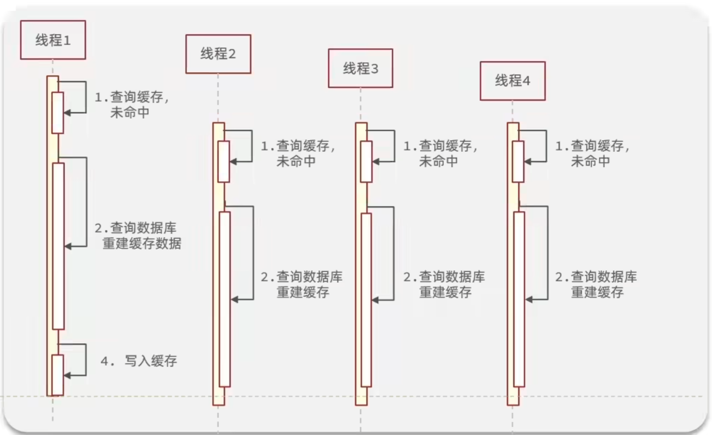

常见解决方案:

* 互斥锁
* 逻辑过期

互斥锁:


逻辑过期:

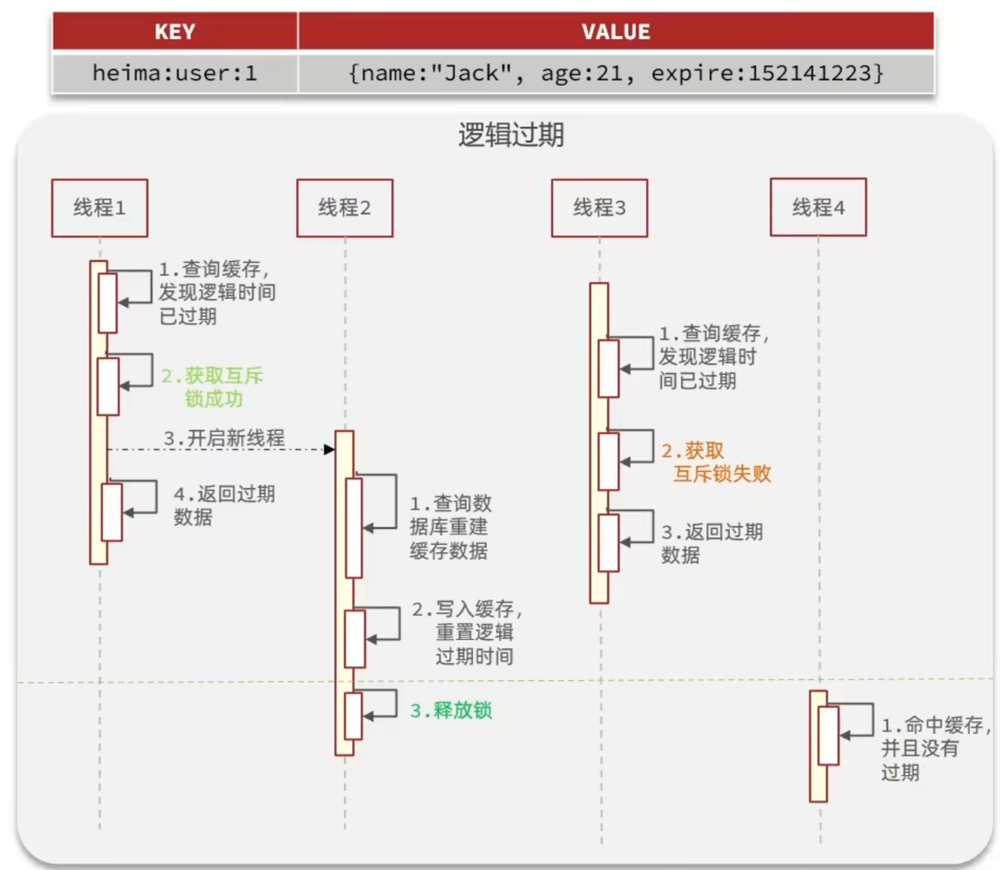

对比:

| 解决方案 | 优点 | 缺点 |
| - | - | - |
| 互斥锁 | 没有额外的内存消耗<br />保证一致性<br />实现简单 | 线程需要等待，性能受影响<br />可能有死锁风险 |
| 逻辑过期 | 线程无需等待，性能较好 | 不保证一致性<br />有额外内存消耗<br />实现复杂 |

#### 2.6.1. 互斥锁 解决缓存击穿的问题

需求:

* 修改 根据 id 查询商铺的业务，基于互斥锁来解决缓存击穿问题

流程:

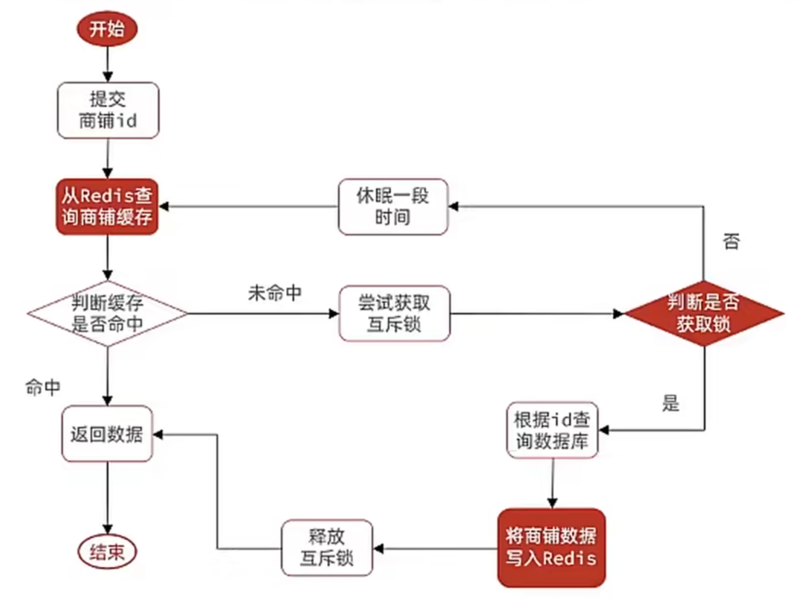

互斥锁:

* 基于 Redis 的 setnx（不存在则创建）命令来实现互斥锁
* 获取锁: `setnx lock:shop:商铺ID 1`
   * 成功返回 1
   * 失败返回 0
* 释放锁: `del lock:shop:商铺ID`

代码:

```java
private boolean tryLock(String key) {
    // value 随意
    // TTL 一般是业务处理时间的 10倍 或 20倍
    Boolean flag = stringRedisTemplate.opsForValue().setIfAbsent(key, "1", 10, TimeUnit.SECONDS);

    // 直接拆箱 Boolean 可能报空指针，建议使用 BooleanUtil
    return BooleanUtil.isTrue(flag);
}

private void unlock(String key) {
    stringRedisTemplate.delete(key);
}

/** 缓存击穿 */
private Shop queryWithMutex(Long id) {
    // 1. 从 Redis 查询商铺
    String shopKey = GET_CACHE_SHOP_KEY(id);
    String shopJsonStr = stringRedisTemplate.opsForValue().get(shopKey);

    // 2. Redis 里存在，则直接返回
    if (StrUtil.isNotBlank(shopJsonStr)) {
        Shop shop = JSONUtil.toBean(shopJsonStr, Shop.class);
        return shop;
    }

    // 如果 缓存空对象 则返回错误
    if (shopJsonStr != null && StrUtil.isBlank(shopJsonStr)) {
        // 返回错误
        return null;
    }

    Shop shop = null;
    String lockKey = "lock:show:" + id;

    try {
        // 3. 实现缓存重建
        // 3.1 获取互斥锁
        boolean isLock = tryLock(lockKey);

        // 3.2 判断是否获取成功
        if (!isLock) {
            // 3.3 获取失败，则休眠并重试
            Thread.sleep(50);

            return queryWithMutex(id);
        }

        // 3.4 再次检查 Redis 是否缓存，避免第二个拿到锁的线程再次 缓存重建

        // 3.5 则根据 id 查询数据库
        shop = getById(id);
        
        // 模拟重建的耗时
        Thread.sleep(200);

        // 4. 数据库 里不存在，则缓存空值并返回错误
        if (shop == null) {
            // 缓存空字符串，2 分钟过期
            stringRedisTemplate.opsForValue().set(shopKey, "", CACHE_NULL_TTL, TimeUnit.MINUTES);
            // 返回错误
            return null;
        }

        // 5. 数据库 里存在，则写入 Redis
        stringRedisTemplate.opsForValue().set(shopKey, JSONUtil.toJsonStr(shop), CACHE_SHOP_TTL, TimeUnit.MINUTES);
    } catch (InterruptedException e) {
        throw new RuntimeException(e);
    } finally {
        // 6. 释放锁
        unlock(lockKey);
    }
    // 7. 返回
    return shop;
}
```

测试:

* 使用 Apache JMeter 进行测试
* 1000 个线程，5 秒钟，访问 `http://localhost:8081/shop/1`

#### 2.6.2. 逻辑过期 解决缓存击穿的问题

需求:

* 修改 根据 id 查询商铺的业务，基于 逻辑过期 来解决缓存击穿问题

流程:

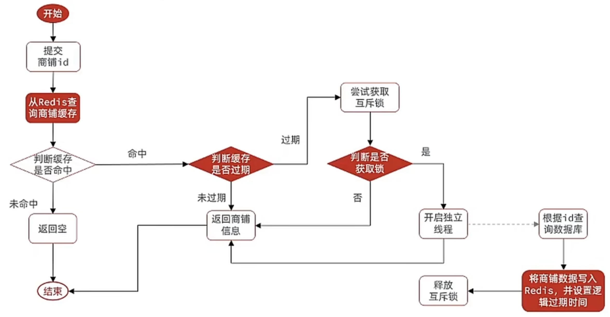

难点:

* 逻辑过期时间 字段 放在哪里？
   * 创建 RedisData 组合 过期时间 和 数据
* 缓存预热（如何提前缓存）
   * 在测试代码里添加

代码:

```java
// 使用线程池，避免频繁线程创建与销毁
private static final ExecutorService CACHE_REBUILD_EXECUTOR = Executors.newFixedThreadPool(10);

/** 解决缓存穿透问题 */
private Shop queryWithLogicExpire(Long id) {
    // 1. 从 Redis 查询商铺
    String shopKey = GET_CACHE_SHOP_KEY(id);
    String redisDataJsonStr = stringRedisTemplate.opsForValue().get(shopKey);

    // 2. Redis 里不存在，则直接返回
    if (StrUtil.isBlank(redisDataJsonStr)) {
        return null;
    }

    // 3. Redis 里存在，则先把 json 反序列化为 RedisData
    RedisData redisData = JSONUtil.toBean(redisDataJsonStr, RedisData.class);
    // Object 类型的属性，hutool 会将其转为 JSONObject 对象
    Object data = redisData.getData();
    JSONObject jsonObjectData = (JSONObject) data;
    // JSONObject 对象 可以继续转为 Shop 对象
    Shop shop = JSONUtil.toBean(jsonObjectData, Shop.class);

    // 4. 判断是否过期
    LocalDateTime expireTime = redisData.getExpireTime();
    boolean isExpired = expireTime.isBefore(LocalDateTime.now());

    if (!isExpired) {
        // 4.1 未过期，直接返回商铺信息
        return shop;
    }

    // 4.2 已过期，则缓存重建

    // 5. 缓存重建
    // 5.1 获取互斥锁
    String lockKey = GET_LOCK_SHOP_KEY(id);
    boolean isAcquiredLock = tryLock(lockKey);

    // 5.2 判断是否获取锁成功
    if (isAcquiredLock) {
        // TODO: 获取锁成功后应该再次检测 Redis 缓存是否过期，做 DoubleCheck，如果存在则无需重建
        // 5.3 成功，则开启独立线程 去缓存重建
        CACHE_REBUILD_EXECUTOR.execute(() -> {
            try {
                this.saveShop2Redis(id, 30L); // 实际应该是 30 分钟
            } catch (Exception e) {
                throw new RuntimeException(e);
            } finally {
                // 释放锁
                unlock(lockKey);
            }
        });
    }

    // 5.4 返回过期的商铺信息
    return shop;
}


@Data
public class RedisData {
    private LocalDateTime expireTime;
    private Object data;
}


/** 将数据写入 redis */
public void saveShop2Redis(Long id, Long expireSeconds) {
    // 1. 查询店铺数据
    Shop shop = getById(id);

    // 2. 封装逻辑过期时间
    RedisData redisData = new RedisData();
    redisData.setData(shop);
    redisData.setExpireTime(LocalDateTime.now().plusSeconds(expireSeconds));

    // 3. 写入 Redis
    stringRedisTemplate.opsForValue().set(GET_CACHE_SHOP_KEY(id), JSONUtil.toJsonStr(redisData));
}
```

### 2.7. 缓存工具封装

基于 StringRedisTemplate 封装一个缓存工具类：

* 方法1: 将任意 Java 对象序列化为 json 并存储在 string 类型的 key 中，并且可以设置 TTL 过期时间
* 方法2: 将任意 Java 对象序列化为 json 并存储在 string 类型的 key 中，并且可以设置 逻辑 过期时间，用于处理缓存击穿问题
* 方法3: 根据指定的 key 查询缓存，并反序列化为指定类型，利用缓存空值的方法解决缓存穿透问题
* 方法4: 根据指定的 key 查询缓存，并反序列化为指定类型，需要利用逻辑过期解决缓存击穿问题

代码:

```java
@Component
@Slf4j
public class CacheClient {
    private final StringRedisTemplate stringRedisTemplate;

    public CacheClient(StringRedisTemplate stringRedisTemplate) {
        this.stringRedisTemplate = stringRedisTemplate;
    }

    /** 将任意 Java 对象序列化为 json 并存储在 string 类型的 key 中，并且可以设置 TTL 过期时间 */
    public void set(String key, Object value, Long time, TimeUnit unit) {
        stringRedisTemplate.opsForValue().set(key, JSONUtil.toJsonStr(value), time, unit);
    }

    /** 将任意 Java 对象序列化为 json 并存储在 string 类型的 key 中，并且可以设置 逻辑 过期时间，用于处理缓存击穿问题 */
    public void setWithLogicalExpire(String key, Object value, Long time, TimeUnit unit) {
        // 设置逻辑过期时间
        RedisData redisData = new RedisData();
        redisData.setData(value);
        // 过期时间 = 当前时间 + TTL
        redisData.setExpireTime(LocalDateTime.now().plusSeconds(unit.toSeconds(time)));

        // 写入 Redis
        stringRedisTemplate.opsForValue().set(key, JSONUtil.toJsonStr(redisData));
    }

    /** 根据指定的 key 查询缓存，并反序列化为指定类型，利用缓存空值的方法解决缓存穿透问题 */
    public <R, ID> R queryWithPassThrough(
            String prefix,
            ID id,
            Class<R> type,
            Function<ID, R> dbFallback,
            Long time,
            TimeUnit unit
    ) {
        String key = prefix + id;

        // 1. 从 Redis 查询缓存
        String json = stringRedisTemplate.opsForValue().get(key);

        // 2. 判断是否存在
        if (StrUtil.isNotBlank(json)) {
            // 3. 存在，直接返回
            return JSONUtil.toBean(json, type);
        }

        // 判断命中的 是否 是空值
        if (json != null) { // 不是 null 则为 空字符串("")
            return null;
        }

        // 4. 不存在，则根据 id 查询数据库
        R r = dbFallback.apply(id);

        // 5. 不存在，则返回 null
        if (r == null) {
            // 将 空字符串 写入 Redis
            this.set(key, "", RedisConstants.CACHE_NULL_TTL, TimeUnit.MINUTES);
            // RedisConstants.CACHE_NULL_TTL = 2

            // 返回空
            return null;
        }

        // 6. 存在，则写入 Redis
        this.set(key, JSONUtil.toJsonStr(r), time, unit);

        return r;
    }
    // 使用线程池，避免频繁线程创建与销毁
    private static final ExecutorService CACHE_REBUILD_EXECUTOR = Executors.newFixedThreadPool(10);

    /** 解决缓存穿透问题 */
    public <R, ID> R queryWithLogicExpire(
            String prefix,
            ID id,
            Class<R> type,
            Function<ID, R> dbFallback,
            Long time,
            TimeUnit unit,
            String lockKeyPrefix
    ) {
        // 1. 从 Redis 查询商铺
        String key = prefix + id;
        String redisDataJsonStr = stringRedisTemplate.opsForValue().get(key);

        // 2. Redis 里不存在，则直接返回
        if (StrUtil.isBlank(redisDataJsonStr)) {
            return null;
        }

        // 3. Redis 里存在，则先把 json 反序列化为 RedisData
        RedisData redisData = JSONUtil.toBean(redisDataJsonStr, RedisData.class);
        // Object 类型的属性，hutool 会将其转为 JSONObject 对象
        Object data = redisData.getData();
        JSONObject jsonObjectData = (JSONObject) data;
        // JSONObject 对象 可以继续转为 Shop 对象
        R resultFromRedis = JSONUtil.toBean(jsonObjectData, type);

        // 4. 判断是否过期
        LocalDateTime expireTime = redisData.getExpireTime();
        boolean isExpired = expireTime.isBefore(LocalDateTime.now());

        if (!isExpired) {
            // 4.1 未过期，直接返回商铺信息
            return resultFromRedis;
        }

        // 4.2 已过期，则缓存重建

        // 5. 缓存重建
        // 5.1 获取互斥锁
        String lockKey = lockKeyPrefix + id;
        boolean isAcquiredLock = tryLock(lockKey);

        // 5.2 判断是否获取锁成功
        if (isAcquiredLock) {
            // TODO: 获取锁成功后应该再次检测 Redis 缓存是否过期，做 DoubleCheck，如果存在则无需重建
            // 5.3 成功，则开启独立线程 去缓存重建
            CACHE_REBUILD_EXECUTOR.execute(() -> {
                try {
                    R resultFromDb = dbFallback.apply(id);
                    this.setWithLogicalExpire(key, resultFromDb, time, unit); // 实际应该是 30 分钟
                } catch (Exception e) {
                    throw new RuntimeException(e);
                } finally {
                    unlock(lockKey);
                }
            });
        }

        // 5.4 返回过期的商铺信息
        return resultFromRedis;
    }

    private boolean tryLock(String key) {
        // value 随意
        // TTL 一般是业务处理时间的 10倍 或 20倍
        Boolean flag = stringRedisTemplate.opsForValue().setIfAbsent(key, "1", 10, TimeUnit.SECONDS);

        // 直接拆箱 Boolean 可能报空指针，建议使用 BooleanUtil
        return BooleanUtil.isTrue(flag);
    }

    private void unlock(String key) {
        stringRedisTemplate.delete(key);
    }

}
```

## 3. 优惠券秒杀

目录:

* 全局 ID 生成器
* 实现优惠券秒杀下单
* 超卖问题
* 一人一单
* 分布式锁
* Redis 优化秒杀
* Redis 消息队列实现异步秒杀

### 3.1. 全局 ID 生成器

订单表使用数据库自增 ID 存在问题:

* id 的规律性太明显
* 受单表数据量的限制
   * 每张表都有自己的自增长，拆表后可能存在 id 冲突

全局 ID 生成器：

* 是一种在分布式系统下用来生成全局唯一 ID 的工具
* 特性:
   * 唯一性
   * 高可用
   * 高性能
   * 递增性: 替代数据库自增ID，逐渐变大，有利于数据库索引
   * 安全性: 复杂的递增规则
* Redis 的自增数值满足上述特性

为了增加 ID 的安全性，不直接使用 Redis 自增的数值，而是拼接一些其它信息:

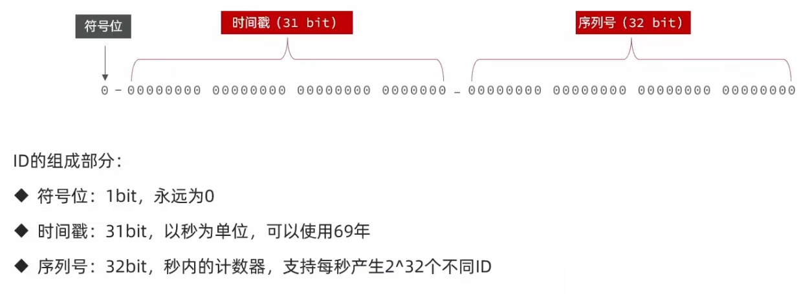

全局唯一 ID 生成策略:

* UUID: 不是逐渐增大的数字，应用较少
* Redis 自增
* snowflake 算法: 雪花算法，依赖机器的时钟
* 数据库自增: 专门设计一张记录 ID 的表，比 Redis 效率低

Redis 自增 ID 策略:

* 每天一 key，方便统计订单量
* ID 构造: 时间戳 + 计数器

代码:

```java
@Component
public class RedisIdWorker {
    /** 开始时间戳 */
    private static final long BEGIN_TIMESTAMP = 1761868800L;

    /** 序列号的位数 */
    private static final int COUNT_BITS = 32;

    private final StringRedisTemplate stringRedisTemplate;

    public RedisIdWorker(StringRedisTemplate stringRedisTemplate) {
        this.stringRedisTemplate = stringRedisTemplate;
    }

    public long nextId(String keyPrefix) {
        // 1. 生成时间戳
        LocalDateTime now = LocalDateTime.now();
        long nowEpochSecond = now.toEpochSecond(ZoneOffset.UTC);
        long timestamp = nowEpochSecond - BEGIN_TIMESTAMP;

        // 2. 生成序列号
        // 2.1 获取当前日期，精确到天。方便统计，避免 key 对应的数字超过上限
        String dateStr = now.format(DateTimeFormatter.ofPattern("yyyy:MM:dd"));

        String key = "icr:" + keyPrefix + ":" + dateStr;

        // 2.2 自增长。
        // 如果 key 不存在，则会自动创建并返回 1
        long count = stringRedisTemplate.opsForValue().increment(key);

        // 3. 拼接并返回。
        // 向左移 32 位，空出来的 32 位 0，32 位 0 与 count 进行或运算
        return timestamp << COUNT_BITS | count;
    }

    public static void main(String[] args) {
        // 将 2025-10-31 作为开始日期
        LocalDateTime beginDate = LocalDateTime.of(2025, 10, 31, 0, 0, 0);

        // 计算 beginData 的时间戳
        long beginEpochSeconds = beginDate.toEpochSecond(ZoneOffset.UTC);

        System.out.println("beginEpochSeconds = " + beginEpochSeconds);
        //=> 1761868800
    }
}
```

测试:

```java
@Test
public void testIdWorker() throws InterruptedException {
    int count = 300;

    // 计数器
    CountDownLatch countDownLatch = new CountDownLatch(count);

    // 创建 500 个线程的线程池
    ExecutorService executorService = Executors.newFixedThreadPool(500);

    // 创建一个生成并打印 100 个 ID 的线程任务
    Runnable task = () -> {
        for (int i = 0; i < 100; i++) {
            long id = redisIdWorker.nextId("order");
            System.out.println("id = " + id);
        }
        // 每执行一次，则计数一次
        countDownLatch.countDown();
    };

    long begin = System.currentTimeMillis();

    // 异步执行 300 个线程任务
    for (int i = 0; i < count; i++) {
        executorService.submit(task);
    }

    // 等待计数完毕
    countDownLatch.await();

    long end = System.currentTimeMillis();

    System.out.println("time = " + (end - begin));
}
```

### 3.2. 实现优惠券秒杀下单

需求:

* 平价券 可以任意购买
* 特价券 需要秒杀抢购

表关系:

* tb_voucher: （基本/普通/平价）优惠券的 基本信息、优惠金额、使用规则 等
* tb_seckill_voucher: （秒杀/特价）优惠券的 库存、开始抢购时间、结束抢购时间
   * 相当于继承 tb_voucher

手动新增秒杀券：

```http
POST http://localhost:8081/voucher/seckill
content-type: application/json

{
    "shopId": 1,
    "title": "100元代金券",
    "subTitle": "周一至周五均可使用",
    "rules": "全场通用\\n可无线叠加",
    "payValue": 8000,
    "actualValue": 10000,
    "type": 1,
    "stock": 100,
    "beginTime": "2025-11-01T10:00:00",
    "endTime": "2025-11-01T22:00:00"
}
```

下单时需要判断两点:

* 秒杀是否开始或结束，如果尚未开始或已经结束则无法下单
* 库存是否充足，不足则无法下单

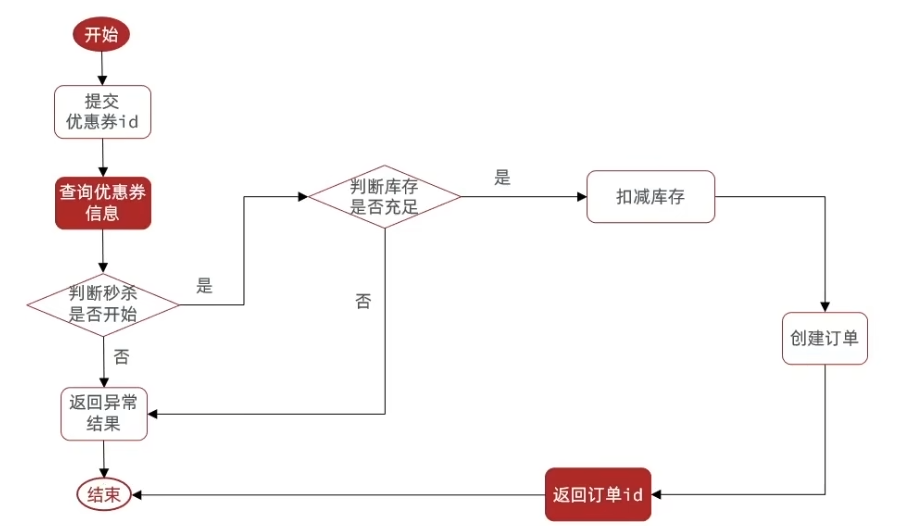

流程:

1. 查询优惠券
2. 判断秒杀是否开始
3. 判断秒杀是否已经结束
4. 判断库存是否充足
5. 扣减库存
6. 创建订单
7. 返回订单 id

实现:

```java
@Service
public class VoucherOrderServiceImpl extends ServiceImpl<VoucherOrderMapper, VoucherOrder> implements IVoucherOrderService {
    @Resource
    private ISeckillVoucherService seckillVoucherService;

    @Resource
    private RedisIdWorker redisIdWorker;

    @Override
    public Result seckillVoucher(Long voucherId) {
        // 1. 查询优惠券
        SeckillVoucher seckillVoucher = seckillVoucherService.getById(voucherId);

        LocalDateTime now = LocalDateTime.now();
        // 2. 判断秒杀是否开始
        if (seckillVoucher.getBeginTime().isAfter(now)) {
            return Result.fail("秒杀未开始");
        }
        // 3. 判断秒杀是否已经结束
        if (seckillVoucher.getEndTime().isBefore(now)) {
            return Result.fail("秒杀已结束");
        }
        // 4. 判断库存是否充足
        if (seckillVoucher.getStock() < 1) {
            return Result.fail("库存不足");
        }
        // 5. 扣减库存
        boolean success = seckillVoucherService.update()
                .setSql("stock = stock - 1")
                .eq("voucher_id", voucherId)
                .update();

        if (!success) {
            return Result.fail("库存不足");
        }

        // 6. 创建订单
        VoucherOrder voucherOrder = new VoucherOrder();
        // 6.1 订单id
        long orderId = redisIdWorker.nextId("order");
        voucherOrder.setId(orderId);
        // 6.2 用户id
        Long userId = UserHolder.getUser().getId();
        voucherOrder.setUserId(userId);
        // 6.1 代金券id
        voucherOrder.setVoucherId(voucherId);

        save(voucherOrder);

        // 7. 返回订单 id
        return Result.ok(orderId);
    }
}
```

### 3.3. 超卖问题

超卖问题:


超卖问题是典型的多线程安全问题，针对这一问题的常见解决方案是加锁：

* 悲观锁
* 乐观锁

悲观锁:

* 认为线程安全问题一定会发生
* 因此在操作数据之前先获取锁，确保线程串行执行
* 例如 Synchronized、Lock、数据库的锁

乐观锁:

* 认为线程安全问题不一定会发生
* 因此不加锁，只是在更新数据时去判断有没有其它线程对数据做了修改
* 如果没有修改 则认为是安全的，自己才更新数据
* 如果已经被其它线程修改 则说明发生了安全问题，此时可以重试或异常

乐观锁的关键是判断之前查询得到的数据是否有被修改过，常见的方式有两种:

* 版本号法
* CAS 法 （Compare And Set）

版本号法:

* 在表里添加 version 字段
* 查询时，获取 version 字段（比如 `1`）
* 更新时，将 `version = 1` 作为条件
   * 如果数据没有人修改，则可以更新成功
   * 否则更新失败

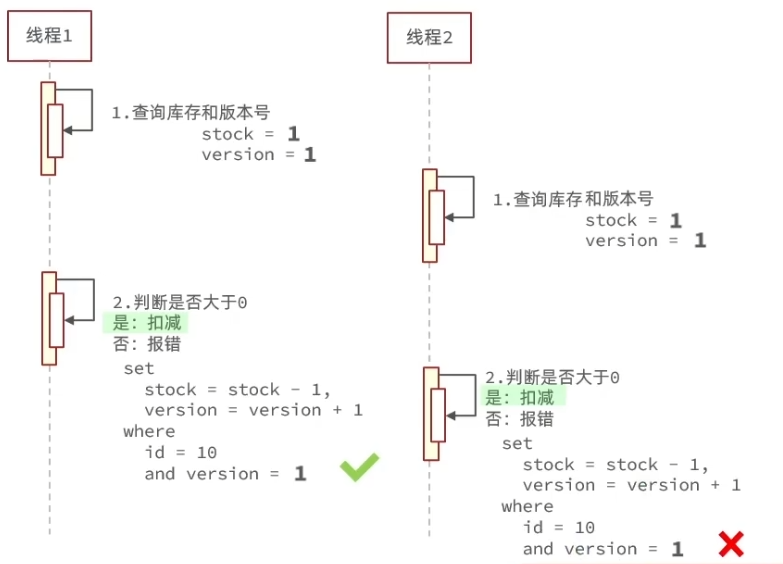

CAS 法:

* 在 版本号法 的基础上做了简化，需要更新的字段也可以作为 “版本号”
* 比如扣减库存
* 查询时，获取 stock 字段（比如 `1`）
* 更新时，将 `stock = 1` 作为条件
   * 如果数据没有人修改，则可以更新成功
   * 否则更新失败


版本号法的弊端:

* 成功率低
* 比如：100个线程同时执行执行查询，更新时只有 1 个能成功
* 针对库存，只需要判断 stock 是否大于 0 即可，不需要 查询与更新时 stock 一致

代码示例:

```java
// 1. 查询优惠券
SeckillVoucher seckillVoucher = seckillVoucherService.getById(voucherId);
Integer stock = seckillVoucher.getStock();

// 5. 扣减库存
boolean success = seckillVoucherService.update()
        .setSql("stock = stock - 1")
        .eq("voucher_id", voucherId) // and voucher_id = xx
        .gt("stock", 0) // and stock > 0
        .update();
```

总结:

超卖这样的线程安全问题，解决方案有哪些？

1. 悲观锁: 添加同步锁，让线程串行执行
   * 优点: 简单粗暴
   * 缺点: 性能一般
2. 乐观锁: 不加锁，在更新时判断是否有其它线程在修改
   * 优点: 性能好
   * 缺点: 存在成功率低的问题。（可以使用分段锁，提供成功率）

### 3.4. 一人一单

需求:

* 一个优惠券，只允许一个人购买一次


代码:

```java
@Override
public Result seckillVoucher(Long voucherId) {
    // 1. 查询优惠券
    SeckillVoucher seckillVoucher = seckillVoucherService.getById(voucherId);

    LocalDateTime now = LocalDateTime.now();
    // 2. 判断秒杀是否开始
    if (seckillVoucher.getBeginTime().isAfter(now)) {
        return Result.fail("秒杀未开始");
    }
    // 3. 判断秒杀是否已经结束
    if (seckillVoucher.getEndTime().isBefore(now)) {
        return Result.fail("秒杀已结束");
    }
    // 4. 判断库存是否充足
    Integer stock = seckillVoucher.getStock();
    if (stock < 1) {
        return Result.fail("库存不足");
    }

    Long userId = UserHolder.getUser().getId();

    // 从常量池中取字符，而非 new String()
    String userLock = userId.toString().intern();

    // 使用 userId 作为锁，只对同一用户的请求做串行操作
    // 必须等（数据插入的）事务执行完毕后，才能释放锁
    synchronized (userLock) {
        // 由于 seckillVoucher 没有加事务，该方法里 通过 this 调用的方法，其事务也不会生效
        // 因为 Spring 是通过代理对象来处理事务的
        // return this.createVoucherOrder(voucherId);

        // 所以，应该拿到代理对象，通过代理对象来调用 加了事务的方法
        IVoucherOrderService voucherOrderServiceProxy = (IVoucherOrderService) AopContext.currentProxy();
        return voucherOrderServiceProxy.createVoucherOrder(voucherId);

        // 上述解决方案，需要如下操作：
        // 1. 显式引入 aspectj 依赖
        //      <dependency>
        //           <groupId>org.aspectj</groupId>
        //           <artifactId>aspectjweaver</artifactId>
        //       </dependency>
        // 2. 在启动类上通过注解暴露代理对象
        //      @EnableAspectJAutoProxy(exposeProxy = true)
    }
}

@Transactional
@Override
public Result createVoucherOrder(Long voucherId) {
    // 5. 一人一单
    Long userId = UserHolder.getUser().getId();
    // 5.1 查询订单
    int count = query().eq("user_id", userId).eq("voucher_id", voucherId).count();

    // 5.2 判断是否存在
    if (count > 0) {
        return Result.fail("用户已经购买过一次！");
    }

    // 6. 扣减库存
    boolean success = seckillVoucherService.update()
            .setSql("stock = stock - 1")
            .eq("voucher_id", voucherId) // and voucher_id = xx
            .gt("stock", 0) // and stock > 0
            .update();

    if (!success) {
        return Result.fail("库存不足");
    }

    // 7. 创建订单
    VoucherOrder voucherOrder = new VoucherOrder();
    // 7.1 订单id
    long orderId = redisIdWorker.nextId("order");
    voucherOrder.setId(orderId);
    // 7.2 用户id
    voucherOrder.setUserId(userId);
    // 7.1 代金券id
    voucherOrder.setVoucherId(voucherId);

    save(voucherOrder);

    // 8. 返回订单 id
    return Result.ok(orderId);
}
```

总结:

1. 同步锁: 
   * 使用 userId 作为锁对象，注意需要从常量池取字符串，而非 `new String()`
2. 释放锁: 
   * 需要等事务执行完毕再释放锁
3. 事务代理: 
   * 在 非事务的方法里 调用加了事务的方法，事务会失效
   * 需要获取到 事务代理对象，通过代理对象调用加了事务的方法

#### 3.4.1. 一人一单的并发安全问题

通过加锁可以解决在单机情况下的一人一单安全问题，但在集群模式下就不行了

配置两个端点的集群：

(1) 将后端服务启动两份，端口分别为 8081 、 8082

复制 IDEA 的启动配置项

通过 VM options 覆盖 application.yml 文件中的配置项:

```text
-Dserver.port=8082
```

(2) 修改 nginx , 配置反向代理和负载均衡

```conf
http {
    # ...
    server {
        # ...
        location /api {  
            # ...
            proxy_pass http://backend;
        }
    }

    upstream backend {
        server 127.0.0.1:8081 max_fails=5 fail_timeout=10s weight=1;
        server 127.0.0.1:8082 max_fails=5 fail_timeout=10s weight=1;
    }  
}
```

总结:

* `synchronized` 的锁由 jvm 提供
* 部署集群模式下，有多个 jvm，synchronized 会失效

### 3.5. 分布式锁

分布式锁:

* 满足分布式系统或集群模式下多进程可见并且互斥的锁

特点:

* 多进程可见
* 互斥
* 高可用
* 高性能
* 安全性

分布式锁的核心是实现多进程之间互斥，满足这一点的方式有很多，常见的有三种:

1. MySQL
   * 互斥: 利用 MySQL 本身的互斥锁机制
   * 高可用: 好
   * 高性能: 一般
   * 安全性: 断开连接、自动释放锁
2. Redis
   * 互斥: 利用 setnx 这样的互斥命令
   * 高可用: 好
   * 高性能: 好
   * 安全性: 利用锁超时时间，到期释放
3. Zookeeper
   * 互斥: 利用节点的唯一性和有序性实现互斥
   * 高可用: 好
   * 高性能: 一般
   * 安全性: 临时节点，断开连接自动释放

实现分布式锁时需要实现的两个基本方法:

1. 获取锁
   * 互斥: 确保只能有一个线程获取锁
   * 非阻塞: 尝试一次，成功返回 true，失败返回 false
   * `SET lock thread1 NX EX 10`: NX 是互斥，EX 是设置超时时间
2. 释放锁
   * 手动释放
   * 超时释放: 获取锁时添加一个超时时间
   * `DEL key`

流程:


#### 3.5.1. 基于 Redis 实现分布式锁 初级版本

需求: 定义一个类，实现下面接口，利用 Redis 实现分布式锁功能

接口：

```java
public interface ILock {
    /**
     * 尝试获取锁
     * @param timeoutSec 锁持有的超时时间，过期自动释放
     * @return true - 获取锁成功； false - 获取锁失败
     */
    boolean tryLock(long timeoutSec);

    /**
     * 释放锁
     */
    void unlock();
}
```

实现:

```java
public class SimpleRedisLock implements ILock {
    /** 业务的名称 或 锁的名称 */
    private String name;

    private StringRedisTemplate stringRedisTemplate;

    public SimpleRedisLock(String name, StringRedisTemplate stringRedisTemplate) {
        this.name = name;
        this.stringRedisTemplate = stringRedisTemplate;
    }

    private static final String KEY_PREFIX = "lock:";

    @Override
    public boolean tryLock(long timeoutSec) {
        // 线程标识
        long threadId = Thread.currentThread().getId();
        String value = threadId + "";

        // 获取锁
        Boolean success = stringRedisTemplate.opsForValue().setIfAbsent(getKey(), value, timeoutSec, TimeUnit.SECONDS);

        // 如果直接返回 success 的值，会 自动拆箱，如果 success 的值是 null 则会报空指针
        return Boolean.TRUE.equals(success);
    }

    @Override
    public void unlock() {
        stringRedisTemplate.delete(getKey());
    }

    private String getKey() {
        return KEY_PREFIX + name;
    }
}
```

使用:

```java
Long userId = UserHolder.getUser().getId();

// 创建锁对象
SimpleRedisLock lock = new SimpleRedisLock("order:" + userId, stringRedisTemplate);

// 获取锁
boolean isLock = lock.tryLock(60);

// 判断是否获取锁成功
if (!isLock) {
    // 获取锁失败，返回错误 或 重试
    return Result.fail("不允许重复下单");
}

try {
    IVoucherOrderService voucherOrderServiceProxy = (IVoucherOrderService) AopContext.currentProxy();
    return voucherOrderServiceProxy.createVoucherOrder(voucherId);
} finally {
    // 释放锁
    lock.unlock();
}
```

测试:

```http
POST http://localhost:8080/api/voucher-order/seckill/10
authorization: 57f8704a82184d79b17681cc9bfe8086
```

```http
POST http://localhost:8080/api/voucher-order/seckill/10
authorization: 57f8704a82184d79b17681cc9bfe8086
```

#### 3.5.2. 分布式锁误删的问题

问题:

* 线程1 获取到锁，执行时间过长，超时删除
* 线程2 获取到锁，执行中
* 线程1 执行完毕，删除锁，此时把 线程2 的锁给删除了
* 线程3 获取到锁，执行中
* 线程2 执行完毕，删除锁，此时把 线程3 的锁给删除了

解决:

* 删除锁时，判断一下该锁的 线程标识 是不是当前线程

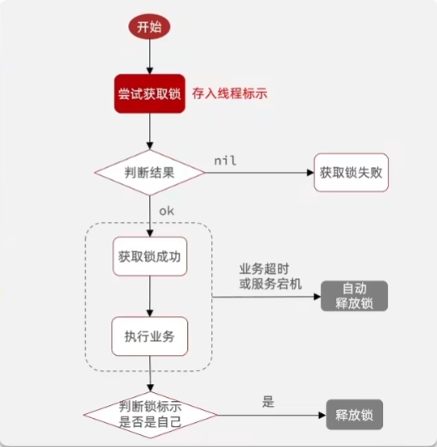

#### 3.5.3. 解决分布式锁误删

修改之前的分布式锁的实现，满足：

1. 在获取锁时存入线程标识
   * 用 UUID 表示
   * 线程 ID 是一个自增的数字，由 jvm 维护
   * 集群模式，线程 ID 有可能重复
2. 在释放锁时先获取锁中的线程标识，判断是否与当前线程标识一致
   * 一致 则释放
   * 不一致 则不释放

实现:

```java
public class SimpleRedisLock implements ILock {
    /** 业务的名称 或 锁的名称 */
    private final String name;

    private final StringRedisTemplate stringRedisTemplate;

    public SimpleRedisLock(String name, StringRedisTemplate stringRedisTemplate) {
        this.name = name;
        this.stringRedisTemplate = stringRedisTemplate;
    }

    private static final String KEY_PREFIX = "lock:";

    private static final String ID_PREFIX = UUID.randomUUID().toString(true) + "-";

    @Override
    public boolean tryLock(long timeoutSec) {
        // 线程标识
        String threadId = getThreadId();

        // 获取锁
        Boolean success = stringRedisTemplate.opsForValue().setIfAbsent(getKey(), threadId, timeoutSec, TimeUnit.SECONDS);

        // 如果直接返回 success 的值，会 自动拆箱，如果 success 的值是 null 则会报空指针
        return Boolean.TRUE.equals(success);
    }


    @Override
    public void unlock() {
        // 线程标识
        String threadId = getThreadId();

        // 获取锁
        String threadIdFromLock = stringRedisTemplate.opsForValue().get(getKey());

        // 判断锁中线程标识 与 当前线程线程标识 是否一致
        if (threadId.equals(threadIdFromLock)) {
            // 一致 则删除
            stringRedisTemplate.delete(getKey());
        }
    }

    private String getKey() {
        return KEY_PREFIX + name;
    }

    private static String getThreadId() {
        return ID_PREFIX + Thread.currentThread().getId();
    }
}
```

#### 3.5.4. 分布式锁的原子性

问题:

1. 线程1 获取锁，执行业务，执行释放锁的方法
   * 先 判断锁的标识
   * 此时出现阻塞，比如执行 GC（垃圾回收）
   * 锁超时释放
2. 线程2 获取锁，执行业务
3. 线程1 释放 线程2 的锁，导致误删

#### 3.5.5. Redis 的 Lua 脚本

Redis 提供了 Lua 脚本功能，在一个脚本中编写多条 Redis 命令，确保多条命令执行时的原子性。

Lua 是一种编程语言，基本语法请参考:

* Lua 菜鸟教程: https://www.runoob.com/lua/lua-tutorial.html

Redis 提供的调研函数，语法:

```js
redis.call('命令名称', 'key', '其它参数', ...)
```

单个命令:

```lua
-- set name jack
redis.call('set', 'name', 'jack')

-- get name
redis.call('get', 'name')
```

多个命令:

```lua
-- 先执行 set name jack
redis.call('set', 'name', 'jack')

-- 再执行 get name
local name = redis.call('get', 'name')

-- 返回
return name
```

写好脚本后，需要使用 Redis 的 `script` 命令来调用 Lua 脚本：

```text
EVAL script numkeys key [key ...] arg [arg ...]

EVAL 脚本内容 key参数个数 key参数1 [key参数2, ...] 其它参数1 [其它参数2 ...]
```

比如执行 `return redis.call('set', 'name', 'jack')`:

```shell
EVAL "return redis.call('set', 'name', 'jack')" 0
#=> OK
```

外部传入的参数，通过 KEYS 数组、ARGV 数组接收，比如:

```shell
# KEYS 接收 key, 数组索引从 1 开始
# ARGV 接收 arg
EVAL "return redis.call('set', KEYS[1], ARGV[1])" 1 name Rose

#=> OK
```

释放锁的业务流程如下:

1. 获取锁中的线程标识
2. 判断是否与指定的标识（当前线程标识）一致
3. 如果一致，则释放锁（删除）
4. 如果不一致，则什么也不做

用 Lua 脚本实现:

```lua
-- 锁的 key
local key = KEYS[1]
-- 线程标识
local currThreadId = ARGV[1]
-- 锁中的线程标识
local lockThreadId = redis.call('get', key)

-- 比较 当前线程标识 与 锁中的标识 是否一致
if (lockThreadId == currThreadId) then
    -- 一致 则删除，并返回 1
    return redis.call('del', key);
end

-- 不一致 则返回 0
return 0
```

#### 3.5.6. 使用 Lua 改进 Redis 的分布式锁

需求: 

* 基于 Lua 脚本实现分布式锁的 释放锁逻辑

RedisTemplate 调用 Lua 脚本的 API 如下:

```java
public class RedisTemplate {
    public <T> T execute(RedisScript<T> script, List<K> keys, Object... args) {
        return (T)this.scriptExecutor.execute(script, keys, args);
    }
}
```

编写脚本(`src/main/resources/unlock.lua`):

```lua
local key = KEYS[1]
-- 线程标识
local currThreadId = ARGV[1]
-- 锁中的线程标识
local lockThreadId = redis.call('get', key)

-- 比较 当前线程标识 与 锁中的标识 是否一致
if (lockThreadId == currThreadId) then
    -- 一致 则删除，并返回 1
    return redis.call('del', key);
end

-- 不一致 则返回 0
return 0
```

调用脚本:

```java
public class SimpleRedisLock implements ILock {
    // ...
    
    private static final DefaultRedisScript<Long> UNLOCK_SCRIPT;

    static {
        UNLOCK_SCRIPT = new DefaultRedisScript<>();
        UNLOCK_SCRIPT.setLocation(new ClassPathResource("unlock.lua"));
        UNLOCK_SCRIPT.setResultType(Long.class);
    }

    // ...

    @Override
    public void unlock() {
        // 调用 lua 脚本，多个 redis 语句满足原子性
        stringRedisTemplate.execute(
                UNLOCK_SCRIPT,
                Collections.singletonList(getKey()),
                getThreadId()
        );
    }

    // ...
}
```

#### 3.5.7. 总结

基于 Redis 的分布式锁实现思路:

* 利用 `set nx ex` 获取锁，并设置过期时间，保存线程标识
* 释放锁时先判断线程标识是否与自己一致，一致则删除锁

特性：

* 利用 `set nx` 满足互斥性
* 利用 `set ex` 保证故障时锁依然能释放，避免死锁，提高安全性
* 利用 Redis 集群保证高可用和高并发特性

#### 3.5.8. 基于 setnx 实现的分布式锁存在的问题

1. 不可重入
   * 同一个线程无法多次获取同一把锁
   * 比如: 方法A 中调用 方法B，方法A 要获取 锁1，方法B 也要获取 锁1
2. 不可重试
   * 获取锁只尝试一次就返回 false，没有重试机制
   * 比如: 获取锁失败时，可以等一等再尝试获取
3. 超时释放
   * 锁超时释放虽然可以避免死锁，但如果是业务执行耗时较长，也会导致锁释放，存在安全隐患
4. 主从一致性
   * 如果 Redis 提供了主从集群，主从同步存在延迟，当“主”宕机时，如果“从”未同步“主”中的锁数据，则会出现锁失效

#### 3.5.9. Redisson 介绍

Redisson 是一个在 Redis 的基础上实现的 Java 驻内存数据网络（In-Memory Data Grid）。

它不仅提供了一系列的分布式的 Java 常用对象，还提供了许多分布式服务，其中就包含了各种分布式锁的实现。

分布式锁(Lock)和同步器(Synchronizer)：

* 可重入锁(Reentrant Lock)
* 公平锁(Fair Lock)
* 联锁(MultiLock)
* 红锁(RedLock)
* 读写锁(ReadWriteLock)
* 信号锁(Semaphore)
* 可过期性信号量(PermitExpiableSemaphore)
* 闭锁(CountDownLatch)

官网地址:

* https://redisson.pro/

GitHub 地址: 

* https://github.com/redisson/redisson

#### 3.5.10. Redisson 快速入门

步骤 1，引入依赖:

```xml
<dependency>
    <groupId>org.redisson</groupId>
    <artifactId>redisson</artifactId>
    <version>3.52.0</version>
</dependency>
```

步骤 2，配置 Redisson 客户端:

* 建议使用 Java 配置类来配置
* 不建议使用 starter 来配置，会覆盖一些配置

```java
@Configuration
public class RedisConfig {
    @Bean
    public RedissonClient redissonClient() {
        // 配置类
        Config config = new Config();

        // 添加 redis 地址，这里是单点的地址
        // 可以使用 config.useClusterServers() 添加集群地址
        config.useSingleServer().setAddress("redis://localhost:6379")
                // .setPassword("123")
        ;

        return Redisson.create(config);
    }
}
```

步骤 3，使用 Redisson 的分布式锁

```java
@Resource
private RedissonClient redissonClient;

@Test
void test() {
    // 获取锁（可重入），指定锁的名称
    RLock lock = redissonClient.getLock("lock:order:" + userId);

    // 尝试获取锁
    // 无参数: -1, 30, TimeUnit.SECONDS
    boolean isLock = lock.tryLock();
    
    // 有参数: 最大等待时间（期间会重试），超时释放，时间单位
    // boolean isLock = lock.tryLock(1, 10, TimeUnit.SECONDS);

    // 判断是否获取锁成功
    if (isLock) {
        try {
            // 执行业务
        } finally {
            // 释放锁
            lock.unlock();
        }
    }
}
```

#### 3.5.11. Redisson 可重入锁原理

锁的可重入:

* 同一个线程，可以多次获取一个锁
* 使用 hash 结构，存入 线程标识 和 重入次数

获取锁时，判断锁有没有人占用:

* 未被占用，则存入当前线程的线程标识和获取次数
* 已被占用，判断是否被自己占用
   * 是被自己占用，则 获取次数 +1
   * 不是自己占用，则 返回或等待（阻塞）

释放锁时，获取次数 -1，如果获取次数为 0 则删除锁


获取锁的 lua 脚本:

```lua
local key = KEYS[1]; -- 锁的key
local threadId = ARGV[1]; -- 线程唯一标识
local releaseTime = ARGV[2]; -- 锁的自动释放时间

-- 判断是否存在
if(redis.call('exists', key) == 0) then
    -- 不存在, 获取锁
    redis.call('hset', key, threadId, '1');

    -- 设置有效期
    redis.call('expire', key, releaseTime);

    -- 返回结果
    return 1;
end;

-- 锁已经存在，判断threadId是否是自己
if(redis.call('hexists', key, threadId) == 1) then
  -- 不存在, 获取锁，重入次数+1
  redis.call('hincrby', key, threadId, '1');

  -- 设置有效期
  redis.call('expire', key, releaseTime);

  return 1; -- 返回结果
end;

return 0; -- 代码走到这里,说明获取锁的不是自己，获取锁失败
```

释放锁的 lua 脚本:

```lua
local key = KEYS[1]; -- 锁的key
local threadId = ARGV[1]; -- 线程唯一标识
local releaseTime = ARGV[2]; -- 锁的自动释放时间

-- 判断当前锁是否还是被自己持有
if (redis.call('HEXISTS', key, threadId) == 0) then
  return nil; -- 如果已经不是自己，则直接返回
end;

-- 是自己的锁，则重入次数-1
local count = redis.call('HINCRBY', key, threadId, -1);

-- 判断是否重入次数是否已经为0
if (count > 0) then
  -- 大于0说明不能释放锁，重置有效期然后返回
  redis.call('EXPIRE', key, releaseTime);

  return nil;
else  -- 等于0说明可以释放锁，直接删除
  redis.call('DEL', key);
  
  return nil;
end;
```

#### 3.5.12. Redisson 的锁重试和 WatchDog 机制


#### 3.5.13. Redisson 分布式锁原理

可重入:

* 利用 hash 结构记录线程 id 和重入次数

可重试:

* 利用信号量 和 PubSub 功能实现等待、唤醒，获取锁失败的重试机制
* 尝试获取锁，获取锁失败后，则订阅“释放锁”（一旦释放锁则尝试获取锁），这个地方会递归
* 等待时间小于 0 或获取锁成功则返回

超时续约:

* 利用 watchDog，每隔一段时间（releaseTime / 3），重置超时时间
* 当锁的超时释放时间设置为 -1 时，则不断重置锁的 TTL，直到业务执行完毕释放锁

#### 3.5.14. Redisson 分布式锁主从一致性问题

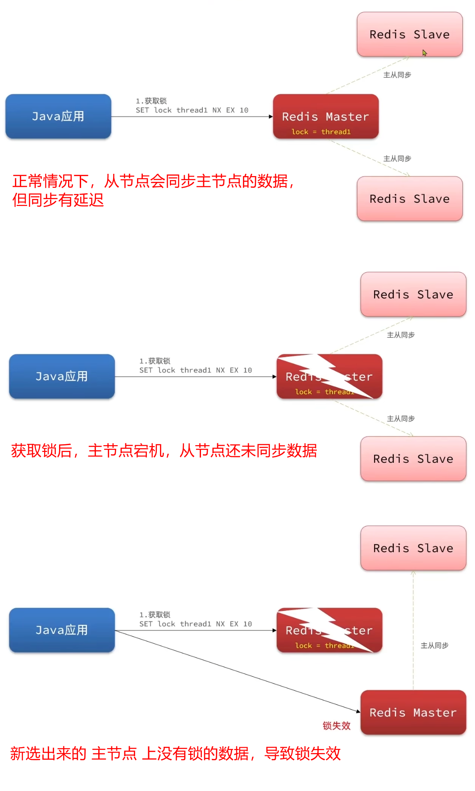

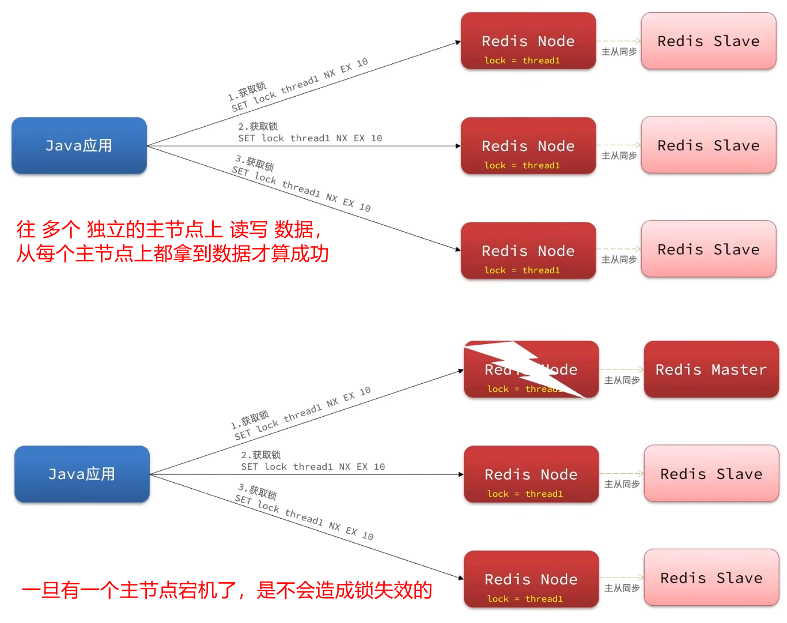

使用联锁的方式，把多个独立的锁联合起来

#### 3.5.15. Redisson 的 multiLock (联锁)

配置:

```java
@Configuration
public class RedisConfig {
    @Bean
    public RedissonClient redissonClient() {
        // 配置类
        Config config = new Config();

        // 添加 redis 地址，这里是单点的地址
        // 可以使用 config.useClusterServers() 添加集群地址
        config.useSingleServer().setAddress("redis://localhost:6379");

        return Redisson.create(config);
    }

    @Bean
    public RedissonClient redissonClient2() {
        Config config = new Config();
        config.useSingleServer().setAddress("redis://localhost:6380");
        return Redisson.create(config);
    }
}
```

测试:

```java
@Slf4j
@SpringBootTest
public class RedissonTest {
    @Resource
    private RedissonClient redissonClient;
    @Resource
    private RedissonClient redissonClient2;

    private RLock lock;

    @BeforeEach
    void setUp() {
        // 创建 2 个独立的锁
        RLock lock1 = redissonClient.getLock("order");
        RLock lock2 = redissonClient2.getLock("order");

        // 创建联锁 multiLock
        lock = redissonClient.getMultiLock(lock1, lock2);
    }

    @Test
    void method1() throws InterruptedException {
        boolean isLock = lock.tryLock(1L, TimeUnit.SECONDS);

        if (!isLock) {
            log.error("获取锁失败 。。。1");
            return;
        }

        try {
            log.info("获取锁成功 。。。1");
            method2();
            log.info("执行业务 。。。1");
        } finally {
            log.warn("准备释放锁 。。。1");
            lock.unlock();
        }
    }

    @Test
    void method2() throws InterruptedException {
        boolean isLock = lock.tryLock(1L, TimeUnit.SECONDS);

        if (!isLock) {
            log.error("获取锁失败 。。。2");
            return;
        }

        try {
            log.info("获取锁成功 。。。2");
            log.info("执行业务 。。。2");
        } finally {
            log.warn("准备释放锁 。。。2");
            lock.unlock();
        }
    }
}
```

#### 3.5.16. 总结

不可重入 Redis 分布式锁:

* 原理: 利用 setnx 的互斥性，利用 ex 避免死锁，释放锁时判断线程标识
* 缺陷: 不可重入、无法重试、超时时失效

可冲入的 Redis 分布式锁:

* 原理: 利用 hash 结构，记录线程标识和重入次数；利用 watchDog 延续锁时间；利用信号量控制锁重试等待
* 缺陷: Redis 宕机引起锁失效问题

Redisson 的 multiLock:

* 原理: 多个独立的 Redis 节点，必须在所有节点都获取成功锁，才算获取锁成功
* 缺陷: 运维成功高、实现复杂

### 3.6. Redis 优化秒杀

#### 3.6.1. 异步秒杀思路


一条龙服务，串行查数据库，效率低

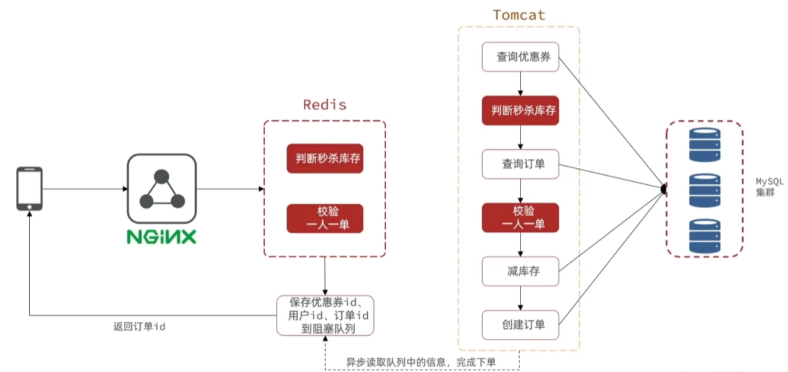

可以将判断下单资格放到 redis 里来做，下单使用异步线程来做

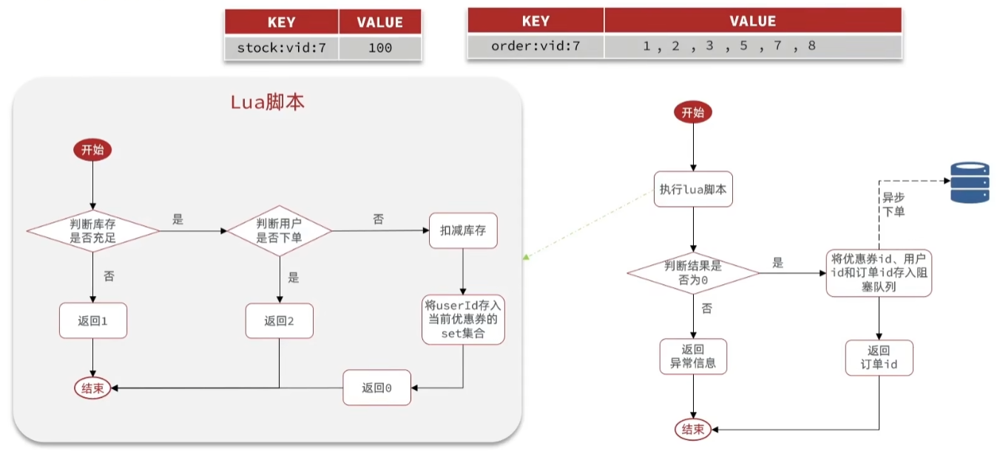

redis:

* 存储优惠券的库存 —— 超卖
* 存储优惠券被哪些用户下单了 —— 一人一单

通过 Lua 脚本判断下单资格