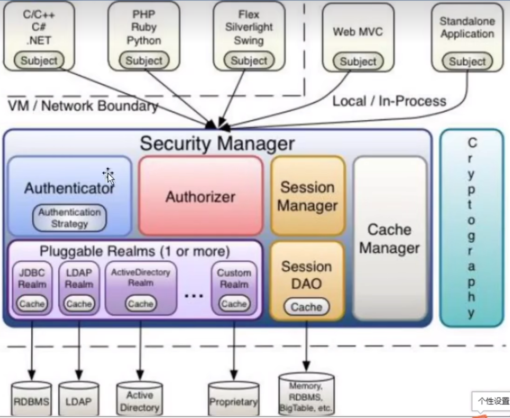
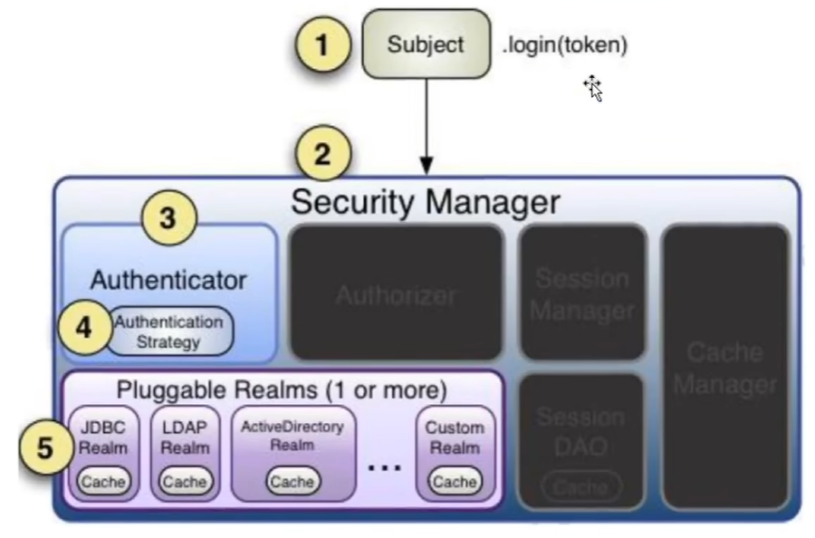

<!--#region
@author 吴钦飞
@email wuqinfei@qq.com
@create date 2025-08-27 21:02:37
@modify date 2025-08-27 22:22:29
@desc [description]
#endregion-->

# shiro

## 1. 入门概述

### 1.1. 是什么

Apache Shiro 是 Java 安全（权限）框架。

功能:

* 认证
* 授权
* 加密
* 会话管理
* 与 Web 集成
* 缓存

### 1.2. 为什么要用 Shiro

* 易于使用
* 全面
* 灵活
* 强力支持 Web
* 兼容性强

### 1.3. 与 Spring Security 的对比

* Spring Security 基于 Spring，更方便、强大，社区资源也更好
* Shiro 不依赖 Spring，在集群中 会话 独立于容器

### 1.4. 基本功能




## 2. 基本使用

### 2.1. 环境准备

1. 创建普通 Java 工程（选择 Maven 构建）

2. 添加依赖

    ```xml
    <dependency>
        <groupId>org.apache.shiro</groupId>
        <artifactId>shiro-core</artifactId>
        <version>1.9.0</version>
    </dependency>
    
    <dependency>
        <groupId>commons-logging</groupId>
        <artifactId>commons-logging</artifactId>
        <version>1.2</version>
    </dependency>
    ```

### 2.2. ini 文件

Shiro 获取权限相关信息可以通过数据库，也可以通过 ini 配置文件

位置:

```text
${root}/
  src/main/resources
    shiro.ini
```

shiro.ini:

```ini
[users]
zhangsan=123
lisi=456
```

### 2.3. 登录认证

#### 2.3.1. 登录认证概念

1. 身份验证
   * 一般需要提供标志信息来表明登录者的身份
   * 比如 email 、 用户名/密码 

2. principals / credentials
   * principals: `/ˈprɪnsəpəlz/` , 身份
   * credentials: `/krəˈdenʃlz/`, 证明
   * 在 Shiro 中，用户需要提供 身份/证明 来验证用户身份

3. principals
   * 身份，即主体的标识属性
   * 比如: 用户名、邮箱、手机号（唯一即可）
   * 但只有一个 primary principals

4. credentials
   * 证明 / 凭证
   * 只有主体知道的安全值
   * 比如: 密码 、数字证书

5. 最常见的 principals/credentials 组合就是 用户名/密码

#### 2.3.2. 登录认证基本流程

1. 收集用户 身份/凭证，比如 用户名/密码
2. 调用 Subject.login() 登录
   * 登录失败则抛异常 AuthenticationException
3. 创建自定义 Realm 类
   * 继承 AuthenticatingRealm 类
   * 实现 doGetAuthenticationInfo() 方法



#### 2.3.3. 登录认证实例

```java
// 1. 初始化: 创建 securityManager
IniSecurityManagerFactory securityManagerFactory = new IniSecurityManagerFactory("classpath:shiro.ini");
SecurityManager securityManager = securityManagerFactory.getInstance();
// securityManager 放入 SecurityUtils
SecurityUtils.setSecurityManager(securityManager);

// 2. 获取 Subject 对象
Subject subject = SecurityUtils.getSubject();

// 3. 创建 token 对象
AuthenticationToken token = new UsernamePasswordToken("zhangsan", "123");

try {
    // 4. 登录
    subject.login(token);

    System.out.println("登录成功");
} catch (UnknownAccountException e) {
    System.out.println("登录失败: 用户名不存在");
} catch (IncorrectCredentialsException e) {
    System.out.println("登录失败: 密码错误");
} catch (AuthenticationException e) {
    System.out.println("登录失败: 未知错误");
}
```

## 3. 与 Spring Boot 整合