<!--#region
@author 吴钦飞
@email wuqinfei@qq.com
@create date 2026-02-04 17:03:58
@modify date 2026-02-17 16:43:06
@desc [description]
#endregion-->

# SpringCloud-黑马-教程

## 1. 微服务技术栈导学

微服务技术栈:


实用篇:

1. 微服务治理
   * Eureka
   * Nacos
   * OpenFeign
   * 网关 Gateway
   * 配置中心 Nacos
   
2. Docker
   * Docker 原理
   * Docker 使用
   * Dockerfile
   * DockerCompose

3. 异步通信
   * 同步和异步
   * MQ技术选型
   * SpringAMQP
   * 消费者限流

4. 分布式搜索
   * DSL 语法
   * HighLevelClient
   * 拼音搜索
   * 自动补全
   * 竞价排名
   * 地理搜索
   * 聚合统计
   * 分片集群

高级篇:

1. 微服务保护
   * 流量控制
   * 系统保护
   * 熔断降级
   * 服务授权

2. 分布式事务
   * XA 模式
   * TCC 模式
   * AT 模式
   * Saga 模式

3. 分布式缓存
   * 数据持久化
   * Redis 主从集群
   * 哨兵机制
   * Redis 分片集群

4. 多级缓存
   * 多级缓存分层
   * Nginx 缓存
   * Redis 缓存
   * Canal 数据同步

5. 可靠消息服务
   * 消息三方确认
   * 惰性队列
   * 延迟队列
   * 镜像集群
   * 仲裁队列

面试篇:

1. Nacos 源码
   * Nacos 的服务发现原理
   * Nacos 服务注册原理
   * Nacos 心跳机制
   * Nacos、Eureka 差异

2. Sentinel 源码
   * Sentinel 滑动窗口算法
   * 令牌桶算法
   * 漏桶算法

3. Redis 热点问题
   * 分布式锁问题
   * 缓存穿透
   * 缓存击穿
   * 缓存雪崩

## 2. 认识微服务

### 2.1. 服务架构演变

#### 2.1.1. 单体架构

单体架构：将业务的所有功能集中在一个项目中开发，打成一个包部署。

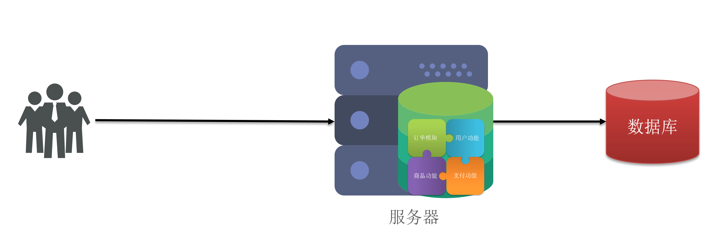

优点：

* 架构简单
* 部署成本低

缺点：

* 耦合度高

#### 2.1.2. 分布式架构

分布式架构：根据业务功能对系统进行拆分，每个业务模块作为独立项目开发，称为一个服务。

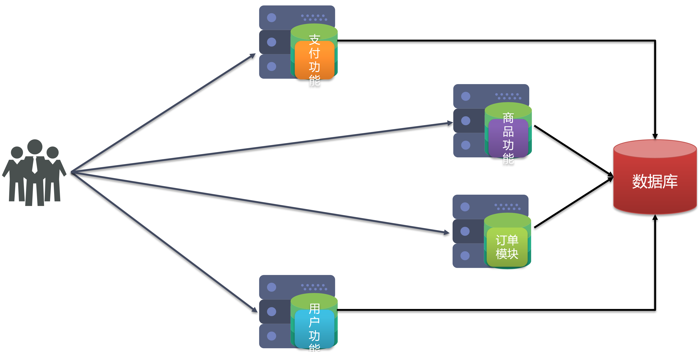

优点：

* 降低服务耦合
* 有利于服务升级拓展

#### 2.1.3. 服务治理

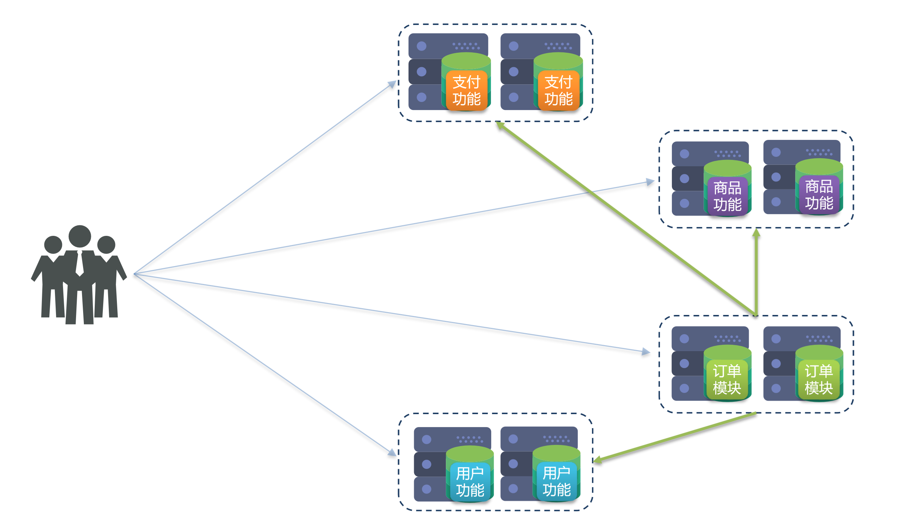

分布式架构的要考虑的问题：

* 服务拆分粒度如何？
* 服务集群地址如何维护？
* 服务之间如何实现远程调用？
* 服务健康状态如何感知？

#### 2.1.4. 微服务

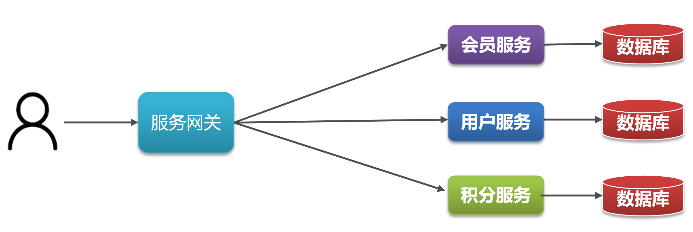

微服务是一种经过良好架构设计的分布式架构方案，微服务架构特征：

* 单一职责：微服务拆分粒度更小，每一个服务都对应唯一的业务能力，做到单一职责，避免重复业务开发
* 面向服务：微服务对外暴露业务接口
* 自治：团队独立、技术独立、数据独立、部署独立
* 隔离性强：服务调用做好隔离、容错、降级，避免出现级联问题

#### 2.1.5. 小结

单体架构特点？

* 简单方便，高度耦合，扩展性差。
* 适合小型项目，例如：学生管理系统

分布式架构特点？

* 松耦合，扩展性好，但架构复杂，难度大。
* 适合大型互联网项目，例如：京东、淘宝

微服务：一种良好的分布式架构方案

* 优点：拆分粒度更小、服务更独立、耦合度更低
* 缺点：架构非常复杂，运维、监控、部署难度提高


### 2.2. 微服务技术对比

#### 2.2.1. 微服务结构

微服务这种方案需要技术框架来落地，全球的互联网公司都在积极尝试自己的微服务落地技术。在国内最知名的就是 SpringCloud 和阿里巴巴的 Dubbo。

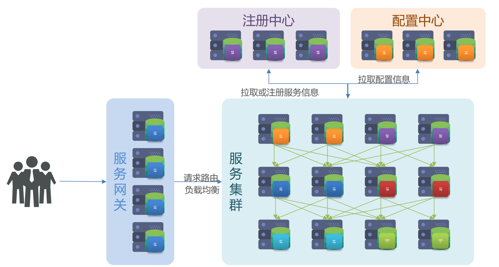

#### 2.2.2. 微服务技术对比

|                | Dubbo               | SpringCloud              | SpringCloudAlibaba       |
| -------------- | ------------------- | ------------------------ | ------------------------ |
| 注册中心       | zookeeper、Redis    | Eureka、Consul           | Nacos、Eureka            |
| 服务远程调用   | Dubbo协议           | Feign（http协议）        | Dubbo、Feign             |
| 配置中心       | 无                  | SpringCloudConfig        | SpringCloudConfig、Nacos |
| 服务网关       | 无                  | SpringCloudGateway、Zuul | SpringCloudGateway、Zuul |
| 服务监控和保护 | dubbo-admin，功能弱 | Hystix                   | Sentinel                 |

#### 2.2.3. 企业需求

SpringCloud + Feign:

* 使用SpringCloud技术栈
* 服务接口采用Restful风格
* 服务调用采用Feign方式

SpringCloudAlibaba + Feign:

* 使用SpringCloudAlibaba技术栈
* 服务接口采用Restful风格
* 服务调用采用Feign方式

SpringCloudAlibaba + Dubbo:

* 使用SpringCloudAlibaba技术栈
* 服务接口采用Dubbo协议标准
* 服务调用采用Dubbo方式

Dubbo 原始模式:

* 基于Dubbo老旧技术体系
* 服务接口采用Dubbo协议标准
* 服务调用采用Dubbo方式

### 2.3. SpringCloud

SpringCloud是目前国内使用最广泛的微服务框架。

官网地址：https://spring.io/projects/spring-cloud 。

SpringCloud集成了各种微服务功能组件，并基于SpringBoot实现了这些组件的自动装配，从而提供了良好的开箱即用体验:

* 服务注册发现: Eureka, Nacos, Consul
* 服务远程调用: OpenFeign、 Dubbo
* 服务链路监控: Zipkin、 Sleuth
* 统一配置管理: SpringCloudConfig、 Nacos
* 统一网关路由: SpringCloudGateway、 Zuul
* 流控、降级、保护: Hystix, Sentinel

SpringCloud 与 SpringBoot 的版本兼容关系如下：

| Release Train | Spring Boot Generation |
| - | - |
| 2025.1.x aka Oakwood | 4.0.x |
| 2025.0.x aka Northfields | 3.5.x |
| 2024.0.x aka Moorgate | 3.4.x |
| 2023.0.x aka Leyton | 3.3.x, 3.2.x |
| 2022.0.x aka Kilburn | 3.0.x, 3.1.x (Starting with 2022.0.3) |
| 2021.0.x aka Jubilee | 2.6.x, 2.7.x (Starting with 2021.0.3) |
| 2020.0.x aka Ilford | 2.4.x, 2.5.x (Starting with 2020.0.3) |
| Hoxton | 2.2.x, 2.3.x (Starting with SR5) |

本教程的 SpringCloud 版本是 Hoxton.SR10，因此对应的 SpringBoot 版本是 2.3.x 版本。

## 3. 服务拆分及远程调用

### 3.1. 服务拆分

服务拆分注意事项:

* 单一职责：不同微服务，不要重复开发相同业务
* 数据独立：不要访问其它微服务的数据库
* 面向服务：将自己的业务暴露为接口，供其它微服务调用

项目结构:

```text
cloud-demo/          # 父工程
   order-service/       # 子项目
      根据 ID 查询订单
   user-service/        # 子项目
      根据 ID 查询用户
```

order-service 项目的数据库的脚本:

```sql
DROP DATABASE IF EXISTS cloud_order;
CREATE DATABASE cloud_order;
USE cloud_order;

DROP TABLE IF EXISTS `tb_order`;
CREATE TABLE `tb_order`  (
  `id` bigint(20) NOT NULL AUTO_INCREMENT COMMENT '订单id',
  `user_id` bigint(20) NOT NULL COMMENT '用户id',
  `name` varchar(100) CHARACTER SET utf8 COLLATE utf8_general_ci NULL DEFAULT NULL COMMENT '商品名称',
  `price` bigint(20) NOT NULL COMMENT '商品价格',
  `num` int(10) NULL DEFAULT 0 COMMENT '商品数量',
  PRIMARY KEY (`id`) USING BTREE,
  UNIQUE INDEX `username`(`name`) USING BTREE
) ENGINE = InnoDB AUTO_INCREMENT = 109 CHARACTER SET = utf8 COLLATE = utf8_general_ci ROW_FORMAT = Compact;

INSERT INTO `tb_order` VALUES (101, 1, 'Apple 苹果 iPhone 12 ', 699900, 1);
INSERT INTO `tb_order` VALUES (102, 2, '雅迪 yadea 新国标电动车', 209900, 1);
INSERT INTO `tb_order` VALUES (103, 3, '骆驼（CAMEL）休闲运动鞋女', 43900, 1);
INSERT INTO `tb_order` VALUES (104, 4, '小米10 双模5G 骁龙865', 359900, 1);
INSERT INTO `tb_order` VALUES (105, 5, 'OPPO Reno3 Pro 双模5G 视频双防抖', 299900, 1);
INSERT INTO `tb_order` VALUES (106, 6, '美的（Midea) 新能效 冷静星II ', 544900, 1);
INSERT INTO `tb_order` VALUES (107, 2, '西昊/SIHOO 人体工学电脑椅子', 79900, 1);
INSERT INTO `tb_order` VALUES (108, 3, '梵班（FAMDBANN）休闲男鞋', 31900, 1);
```

user-service 项目的数据库的脚本: 

```sql
DROP DATABASE IF EXISTS cloud_user;
CREATE DATABASE cloud_user;
USE cloud_user;

DROP TABLE IF EXISTS `tb_user`;
CREATE TABLE `tb_user`  (
  `id` bigint(20) NOT NULL AUTO_INCREMENT,
  `username` varchar(100) CHARACTER SET utf8 COLLATE utf8_general_ci NULL DEFAULT NULL COMMENT '收件人',
  `address` varchar(255) CHARACTER SET utf8 COLLATE utf8_general_ci NULL DEFAULT NULL COMMENT '地址',
  PRIMARY KEY (`id`) USING BTREE,
  UNIQUE INDEX `username`(`username`) USING BTREE
) ENGINE = InnoDB AUTO_INCREMENT = 109 CHARACTER SET = utf8 COLLATE = utf8_general_ci ROW_FORMAT = Compact;

INSERT INTO `tb_user` VALUES (1, '柳岩', '湖南省衡阳市');
INSERT INTO `tb_user` VALUES (2, '文二狗', '陕西省西安市');
INSERT INTO `tb_user` VALUES (3, '华沉鱼', '湖北省十堰市');
INSERT INTO `tb_user` VALUES (4, '张必沉', '天津市');
INSERT INTO `tb_user` VALUES (5, '郑爽爽', '辽宁省沈阳市大东区');
INSERT INTO `tb_user` VALUES (6, '范兵兵', '山东省青岛市');
```

访问:

* http://localhost:8081/user/1
* http://localhost:8080/order/101

小结:

* 微服务需要根据业务模块拆分，做到单一职责,不要重复开发相同业务
* 微服务可以将业务暴露为接口，供其它微服务使用
* 不同微服务都应该有自己独立的数据库

### 3.2. 服务间调用

需求：根据订单id查询订单的同时，把订单所属的用户信息一起返回

分析:

* 在 order-service 服务里，向 user-service 发送 HTTP 请求，获取用户信息，合并后返回给用户

使用 RestTemplate 发送 HTTP 请求

步骤 1. 在启动类里注册 RestTemplate

```java
@SpringBootApplication
public class OrderApplication {

 // ...
 
    @Bean
    public RestTemplate restTemplate() {
        return new RestTemplate();
    }
}
```

步骤 2. 修改订单服务

```java
@Service
public class OrderService {

    @Autowired
    private OrderMapper orderMapper;

    @Autowired
    private RestTemplate restTemplate;

    public Order queryOrderById(Long orderId) {
        // 1.查询订单
        Order order = orderMapper.findById(orderId);

        // 2. 发送请求获取用户
        String url = "http://localhost:8081/user/" + order.getUserId();
        User user = restTemplate.getForObject(url, User.class);

        // 3. 将用户塞入订单对象
        order.setUser(user);

        // 4.返回
        return order;
    }
}
```

小结:

* 微服务调用方式
   * 基于RestTemplate发起的http请求实现远程调用
   * http 请求做远程调用是与语言无关的调用，只要知道对方的 ip、端口、接口路径、请求参数 即可。

### 3.3. 提供者与消费者

服务提供者：一次业务中，被其它微服务调用的服务。（提供接口给其它微服务）

服务消费者：一次业务中，调用其它微服务的服务。（调用其它微服务提供的接口）

服务 A 调用服务 B，服务 B 调用服务 C，那么服务 B 是什么角色？

服务调用关系:

* 服务提供者：暴露接口给其它微服务调用
* 服务消费者：调用其它微服务提供的接口
* 提供者与消费者角色其实是相对的
* 一个服务可以同时是服务提供者和服务消费者

## 4. Eureka 注册中心

`[juˈriːkə]`

### 4.1. 远程调用的问题

服务调用出现的问题:

* 服务消费者该如何获取服务提供者的地址信息？
* 如果有多个服务提供者，消费者该如何选择？
* 消费者如何得知服务提供者的健康状态？

### 4.2. eureka 原理

Eureka 的作用:

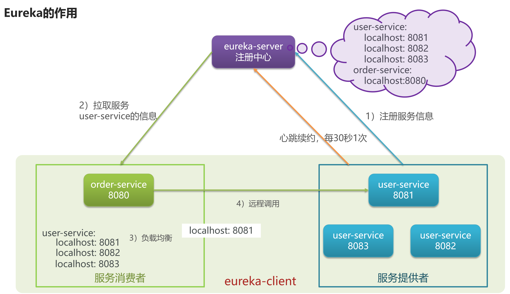

消费者该如何获取服务提供者具体信息？

* 服务提供者启动时向eureka注册自己的信息
* eureka保存这些信息
* 消费者根据服务名称向eureka拉取提供者信息

如果有多个服务提供者，消费者该如何选择？

* 服务消费者利用负载均衡算法，从服务列表中挑选一个

消费者如何感知服务提供者健康状态？

* 服务提供者会每隔 30 秒向 EurekaServer 发送心跳请求，报告健康状态
* eureka 会更新记录服务列表信息，心跳不正常会被剔除
* 消费者就可以拉取到最新的信息

在 Eureka 架构中，微服务角色有两类：

EurekaServer：服务端，注册中心

* 记录服务信息
* 心跳监控

EurekaClient：客户端

* Provider：服务提供者，例如案例中的 user-service
   * 注册自己的信息到EurekaServer
   * 每隔30秒向EurekaServer发送心跳
* Consumer：服务消费者，例如案例中的 order-service
   * 根据服务名称从 EurekaServer 拉取服务列表
   * 基于服务列表做负载均衡，选中一个微服务后发起远程调用

### 4.3. 搭建 EurekaServer

#### 4.3.1. 动手实践

1. 搭建注册中心
   * 搭建EurekaServer

2. 服务注册
   * 将 user-service、order-service 都注册到 eureka

3. 服务发现
   * 在 order-service 中完成服务拉取，然后通过负载均衡挑选一个服务，实现远程调用

#### 4.3.2. 搭建 EurekaServer

步骤 1. 创建项目，引入 spring-cloud-starter-netflix-eureka-server 的依赖

```xml
<dependency>
    <groupId>org.springframework.cloud</groupId>
    <artifactId>spring-cloud-starter-netflix-eureka-server</artifactId>
</dependency>
```

步骤 2. 编写启动类，添加 @EnableEurekaServer 注解

```java
@SpringBootApplication
@EnableEurekaServer
public class EurekaApplication {
    public static void main( String[] args ) {
        SpringApplication.run(EurekaApplication.class, args);
    }
}
```

步骤 3. 添加 application.yml 文件，编写下面的配置：

```yml
server:
  port: 10086
spring:
  application:
    name: eurekaserver # eureka 的服务名称
eureka:
  client:
    service-url: # eureka 的地址信息
      defaultZone: http://127.0.0.1:10086/eureka
```

访问: http://localhost:10086/


### 4.4. 服务注册

将 user-service 服务注册到 EurekaServer 步骤如下：

步骤 1. 加 eureka-client 的依赖

```xml
<dependency>
    <groupId>org.springframework.cloud</groupId>
    <artifactId>spring-cloud-starter-netflix-eureka-client</artifactId>
</dependency>
```

步骤 2. 配置 eureka 的地址

```yml
spring:
  application:
    name: userservice # user 的服务名称

eureka:
  client:
    service-url: # eureka 的地址信息
      defaultZone: http://127.0.0.1:10086/eureka
```

小结:

* 服务注册
   * 引入 eureka-client 依赖
   * 在 application.yml 中配置 eureka 地址
* 无论是消费者还是提供者，引入 eureka-client 依赖、知道 eureka 地址后，都可以完成服务注册

### 4.5. 服务发现

服务拉取是基于服务名称获取服务列表，然后在对服务列表做负载均衡

修改 OrderService 的代码，修改访问的 url 路径，用服务名代替 ip、端口：

```java
// String url = "http://localhost:8081/user/" + order.getUserId();
String url = "http://userservice/user/" + order.getUserId();
```

在 order-service 项目的启动类 OrderApplication 中的 RestTemplate 添加负载均衡注解:

```java
@LoadBalanced // 负载均衡注解
@Bean
public RestTemplate restTemplate() {
   return new RestTemplate();
}
```

### 4.6. 小结

搭建 EurekaServer:

* 引入eureka-server依赖
* 添加@EnableEurekaServer注解
* 在application.yml中配置eureka地址

服务注册:

* 引入 eureka-client 依赖
* 在 application.yml 中配置 eureka 地址

服务发现:

* 引入 eureka-client 依赖
* 在 application.yml 中配置 eureka 地址
* 给 RestTemplate 添加 @LoadBalanced 注解
* 用服务提供者的服务名称远程调用

## 5. Ribbon 负载均衡原理

### 5.1. 负载均衡原理

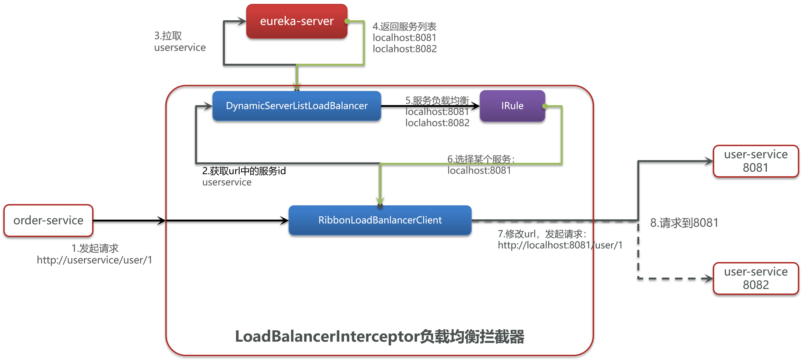

### 5.2. 负载均衡策略

Ribbon 的负载均衡规则是一个叫做 IRule 的接口来定义的，每一个子接口都是一种规则

| 内置负载均衡规则类 | 规则描述 |
| - | - |
| RoundRobinRule | 简单轮询服务列表来选择服务器。它是Ribbon默认的负载均衡规则。|
| AvailabilityFilteringRule | 对以下两种服务器进行忽略： （1）在默认情况下，这台服务器如果3次连接失败，这台服务器就会被设置为“短路”状态。短路状态将持续30秒，如果再次连接失败，短路的持续时间就会几何级地增加。 （2）并发数过高的服务器。如果一个服务器的并发连接数过高，配置了AvailabilityFilteringRule规则的客户端也会将其忽略。并发连接数的上限，可以由客户端的`<clientName>`.`<clientConfigNameSpace>`.ActiveConnectionsLimit属性进行配置。 |
| WeightedResponseTimeRule | 为每一个服务器赋予一个权重值。服务器响应时间越长，这个服务器的权重就越小。这个规则会随机选择服务器，这个权重值会影响服务器的选择。 |
| ZoneAvoidanceRule | 以区域可用的服务器为基础进行服务器的选择。使用Zone对服务器进行分类，这个Zone可以理解为一个机房、一个机架等。而后再对Zone内的多个服务做轮询。 |
| BestAvailableRule | 忽略那些短路的服务器，并选择并发数较低的服务器。 |
| RandomRule | 随机选择一个可用的服务器。 |
| RetryRule | 重试机制的选择逻辑 |

通过定义 IRule 实现可以修改负载均衡规则，有两种方式：

方式 1，代码方式：在 order-service 中的 OrderApplication 类中，定义一个新的 IRule：

```java
// 会替代默认的 轮询 规则
// 全局的: 当前整个项目访问的所有服务生效
@Bean
public IRule randomRule(){
    return new RandomRule(); 
}
```

方式 2，配置文件方式：在 order-service 的 application.yml 文件中，添加新的配置也可以修改规则：

```yml
# 局部的: 针对 配置 的服务生效
userservice:
  ribbon:
    NFLoadBalancerRuleClassName: com.netflix.loadbalancer.RandomRule # 负载均衡规则 
```

### 5.3. 饥饿加载

Ribbon 默认是采用懒加载，即第一次访问时才会去创建 LoadBalanceClient，请求时间会很长。

而饥饿加载则会在项目启动时创建，降低第一次访问的耗时，通过下面配置开启饥饿加载：

```yml
ribbon:
  eager-load:
    enabled: true # 开启饥饿加载
    clients: 
      - userservice # 指定对 userservice 这个服务饥饿加载
```

### 5.4. 小结

Ribbon 负载均衡规则:

* 规则接口是 IRule
* 默认实现是 ZoneAvoidanceRule，根据 zone 选择服务列表，然后轮询

负载均衡自定义方式:

* 代码方式：配置灵活，但修改时需要重新打包发布
* 配置方式：直观，方便，无需重新打包发布，但是无法做全局配置

饥饿加载:

* 开启饥饿加载
* 指定饥饿加载的微服务名称

## 6. Nacos 注册中心

### 6.1. 安装 Nacos

Nacos 是阿里巴巴的产品，现在是 SpringCloud 中的一个组件。相比 Eureka 功能更加丰富，在国内受欢迎程度较高。

官网: https://nacos.io/

下载: 

* https://nacos.io/download/release-history 【点击 发布说明 进入下载页】
* nacos-server-1.4.1.zip

解压: D:\soft\nacos

启动:

```shell
# 进入 bin 目录

# 单机启动
startup.cmd -m standalone
```

访问: 

* http://192.168.18.1:8848/nacos/index.html
* nacos / nacos

### 6.2. 服务注册到 Nacos

步骤 1: 在 cloud-demo 父工程中添加 spring-cloud-alilbaba 的管理依赖

```xml
<dependency>
      <groupId>com.alibaba.cloud</groupId>
      <artifactId>spring-cloud-alibaba-dependencies</artifactId>
      <version>2.2.6.RELEASE</version>
      <type>pom</type>
      <scope>import</scope>
</dependency>
```

步骤 2: 注释掉 order-service 和 user-service 中原有的 eureka 依赖

```xml
<!--
<dependency>
   <groupId>org.springframework.cloud</groupId>
   <artifactId>spring-cloud-starter-netflix-eureka-client</artifactId>
</dependency>
-->
```

步骤 3: 添加 nacos 的客户端依赖

```xml
<!-- nacos 客户端依赖 -->
<dependency>
   <groupId>com.alibaba.cloud</groupId>
   <artifactId>spring-cloud-starter-alibaba-nacos-discovery</artifactId>
</dependency>
```

步骤 4: 修改 user-service 、 order-service 的 application.yml，注释 eureka 地址，添加 nacos 地址

```yml
spring:
  cloud:
    nacos:
      server-addr: localhost:8848 # 默认地址
```

### 6.3. 小结

Nacos 服务搭建: 

* 下载安装包
* 解压
* 在 bin 目录下运行指令：startup.cmd -m standalone

Nacos 服务注册或发现:

* 引入 nacos.discovery 依赖
* 配置 nacos 地址 spring.cloud.nacos.server-addr


### 6.4. Nacos 服务分级存储模型

#### 6.4.1. Nacos 服务分级存储模型

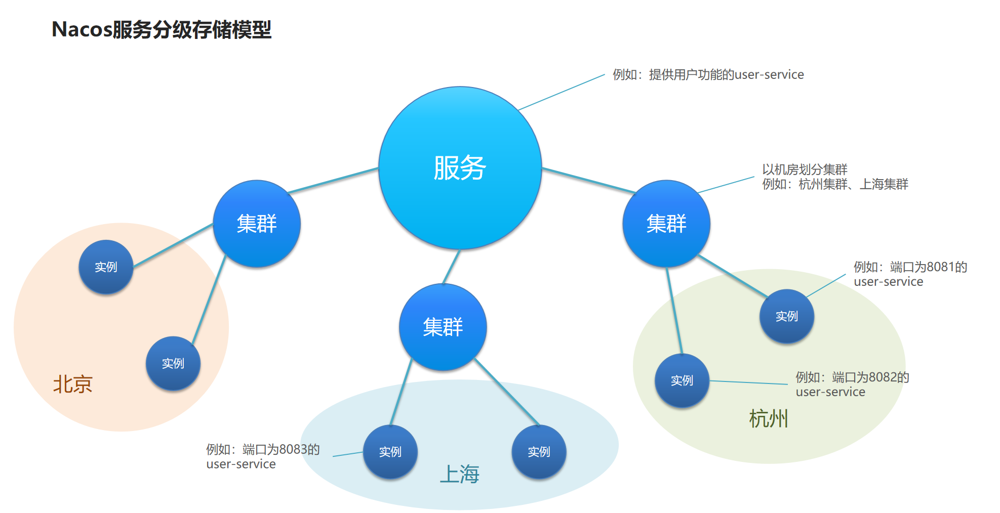

#### 6.4.2. 服务跨集群调用问题

服务调用尽可能选择本地集群的服务，跨集群调用延迟较高

本地集群不可访问时，再去访问其它集群

#### 6.4.3. 服务集群属性

```yml
spring:
  cloud:
    nacos:
      discovery:
        cluster-name: HB # 配置集群名称，默认为 "DEFAULT"
```

#### 6.4.4. 小结

Nacos 服务分级存储模型:

* 一级是服务，例如 userservice
* 二级是集群，例如 杭州 或 上海
* 三级是实例，例如 杭州机房的某台部署了 userservice 的服务器

如何设置实例的集群属性:

* 修改 application.yml 文件，添加 spring.cloud.nacos.discovery.cluster-name 属性即可

### 6.5. NacosRule 负载均衡

在 order-service 中设置负载均衡的 IRule为NacosRule ，这个规则优先会寻找与自己同集群的服务

```yml
userservice:
  ribbon:
    NFLoadBalancerRuleClassName: com.alibaba.cloud.nacos.ribbon.NacosRule # 负载均衡规则
```

NacosRule 负载均衡策略:

* 优先选择同集群服务实例列表
* 本地集群找不到提供者，才去其它集群寻找，并且会报警告
* 确定了可用实例列表后，再采用随机负载均衡挑选实例

### 6.6. 服务实例的权重设置

实际部署中会出现这样的场景：

* 服务器设备性能有差异，部分实例所在机器性能较好，另一些较差，我们希望性能好的机器承担更多的用户请求

Nacos 提供了权重配置来控制访问频率，权重越大则访问频率越高

1. 在 Nacos 控制台可以设置实例的权重值，首先选中实例后面的编辑按钮
2. 将权重设置为 0.1，测试可以发现 8081 被访问到的频率大大降低

不停机更新:

1. 先将 实例1 的权重设置为 0
2. 待其处理完所有请求，将其停止并更新版本
3. 待该服务器重启后，将其权重逐渐恢复为 1
4. 其它 实例 也如此操作，可达到平滑更新的目录

实例的权重控制:

* Nacos 控制台可以设置实例的权重值，0~1 之间
* 同集群内的多个实例，权重越高被访问的频率越高
* 权重设置为 0 则完全不会被访问


### 6.7. Nacos 环境隔离

Nacos 中服务存储和数据存储的最外层都是一个名为 namespace 的东西，用来做最外层隔离

步骤 1: 在 Nacos 控制台可以创建 namespace，用来隔离不同环境

步骤 2: 然后填写一个新的命名空间信息

步骤 3: 保存后会在控制台看到这个命名空间的 id

步骤 4: 修改 order-service 的 application.yml，添加 namespace

```yml
spring:
  cloud:
    nacos:
      discovery:
        namespace: 492a7d5d-237b-46a1-a99a-fa8e98e4b0f9 # 命名空间，填ID
```

步骤 5: 重启 order-service 后，再来查看控制台

步骤 6: 此时访问 order-service，因为 namespace 不同，会导致找不到 userservice，控制台会报错

Nacos环境隔离:

* 每个 namespace 都有唯一 id
* 服务设置 namespace 时要写 id 而不是名称
* 不同 namespace 下的服务互相不可见

### 6.8. Nacos 和 Eureka 的对比

#### 6.8.1. nacos 注册中心细节分析

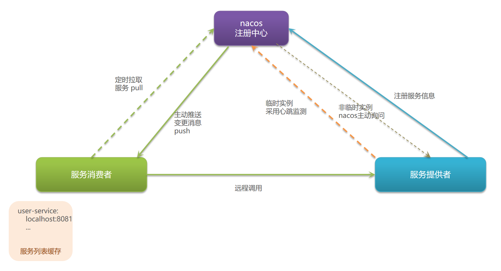

#### 6.8.2. 临时实例和非临时实例

服务注册到Nacos时，可以选择注册为临时或非临时实例，通过下面的配置来设置：

```yml
spring:  
  cloud:
    nacos:
      discovery:
        ephemeral: false # 设置为非临时实例
```

临时实例宕机时，会从 nacos 的服务列表中剔除，而非临时实例则不会

#### 6.8.3. 小结

Nacos 与 eureka 的共同点:

* 都支持服务注册和服务拉取
* 都支持服务提供者心跳方式做健康检测

Nacos 与 Eureka 的区别:

* Nacos 支持服务端主动检测提供者状态：临时实例采用心跳模式，非临时实例采用主动检测模式
* 临时实例心跳不正常会被剔除，非临时实例则不会被剔除
* Nacos 支持服务列表变更的消息推送模式，服务列表更新更及时
* Nacos 集群默认采用 AP 方式，当集群中存在非临时实例时，采用 CP 模式；Eureka 采用 AP 方式

## 7. Nacos 配置管理

### 7.1. Nacos 实现配置管理

配置更改热更新

在 Nacos 中添加配置信息

配置名称的格式: `服务名称-环境.后缀名`

* 比如: userservice-dev.yaml

```yml
pattern:
  dateformat: yyyy-MM-dd HH:mm:ss
```

### 7.2. 微服务配置拉取

#### 7.2.1. 获取配置的流程


#### 7.2.2. 步骤

步骤 1: user-service 引入 Nacos 的配置管理客户端依赖

```xml
<!--nacos 配置管理依赖-->
<dependency>
    <groupId>com.alibaba.cloud</groupId>
    <artifactId>spring-cloud-starter-alibaba-nacos-config</artifactId>
</dependency>
```

步骤 2: 在 user-service 中的 resource 目录添加一个 bootstrap.yml 文件，这个文件是引导文件，优先级高于 application.yml

```yml
spring:
  application:
    name: userservice # 服务名称
  profiles:
    active: dev #开发环境，这里是dev
  cloud:
    nacos:
      server-addr: localhost:8848 # Nacos地址
      config:        
        file-extension: yaml # 文件后缀名
```

测试: 在 user-service 中将 pattern.dateformat 这个属性注入到 UserController 中做测试

```java
@Slf4j
@RestController
@RequestMapping("/user")
public class UserController {

    @Value("${pattern.dateformat}")
    private String dateformat;

    @GetMapping("/now")
    public String now() {
        log.info("dateformat ======> {}", dateformat);
        return LocalDateTime.now().format(DateTimeFormatter.ofPattern(dateformat));
    }
}
```

#### 7.2.3. 小结

将配置交给 Nacos 管理的步骤: 

* 在 Nacos 中添加配置文件
* 在微服务中引入 nacos 的 config 依赖
* 在微服务中添加 bootstrap.yml ，配置 nacos 地址、当前环境、服务名称、文件后缀名。这些决定了程序启动时去 nacos 读取哪个文件

### 7.3. 配置热更新

Nacos 中的配置文件变更后，微服务无需重启就可以感知。不过需要通过下面两种配置实现

* @Value + @RefreshScope
* @ConfigurationProperties

#### 7.3.1. @Value + @RefreshScope

```java
@RefreshScope // 刷新 @Value
public class UserController {

    @Value("${pattern.dateformat}")
    private String dateformat;

    @GetMapping("/now")
    public String now() {
        log.info("dateformat ======> {}", dateformat);
        return LocalDateTime.now().format(DateTimeFormatter.ofPattern(dateformat));
    }
}
```

#### 7.3.2. @ConfigurationProperties

```java
@ConfigurationProperties(prefix = "pattern")
@Data
public class UserController {
    private String dateformat;
}
```

#### 7.3.3. 小结

Nacos 配置更改后，微服务可以实现热更新，方式：

* 通过 @Value 注解注入，结合 @RefreshScope 来刷新
* 通过 @ConfigurationProperties 注入，自动刷新

注意事项：

* 不是所有的配置都适合放到配置中心，维护起来比较麻烦
* 建议将一些关键参数，需要运行时调整的参数放到 nacos 配置中心，一般都是自定义配置

### 7.4. 多环境配置共享

微服务启动时会从 nacos 读取多个配置文件：

* `[spring.application.name]-[spring.profiles.active].yaml`，例如：`userservice-dev.yaml`
* `[spring.application.name].yaml`，例如：`userservice.yaml`

无论 profile 如何变化，`[spring.application.name].yaml` 这个文件一定会加载，因此多环境共享配置可以写入这个文件

多种配置的优先级：

* 服务名-环境.yaml > 服务名称.yaml > 本地配置

微服务会 从nacos 读取的配置文件：

* `[服务名]-[spring.profile.active].yaml`，环境配置
* `[服务名].yaml`，默认配置，多环境共享

优先级：

* `[服务名]-[环境].yaml` > `[服务名].yaml` > 本地配置

### 7.5. Nacos 集群搭建

#### 7.5.1. 集群结构图

其中包含 3 个 nacos 节点，然后一个负载均衡器代理 3 个 Nacos。这里负载均衡器可以使用 nginx。

我们计划的集群结构：

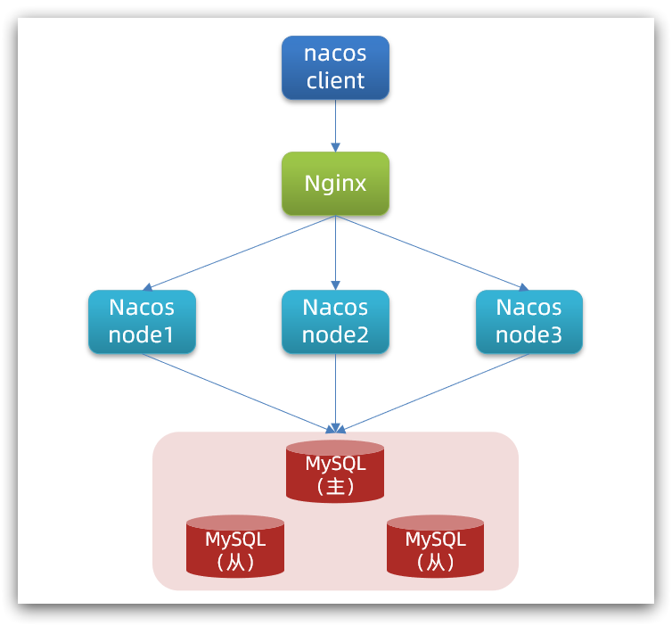

三个 nacos 节点的地址：

| 节点   | ip            | port |
| ------ | ------------- | ---- |
| nacos1 | 192.168.150.1 | 8845 |
| nacos2 | 192.168.150.1 | 8846 |
| nacos3 | 192.168.150.1 | 8847 |

#### 7.5.2. 搭建集群

搭建集群的基本步骤：

- 搭建数据库，初始化数据库表结构
- 下载 nacos 安装包
- 配置 nacos
- 启动 nacos 集群
- nginx 反向代理

#### 7.5.3. 初始化数据库

Nacos 默认数据存储在内嵌数据库 Derby 中，不属于生产可用的数据库。

官方推荐的最佳实践是使用带有主从的高可用数据库集群，主从模式的高可用数据库。

这里我们以单点的数据库为例来讲解。

首先新建一个数据库，命名为 nacos，而后导入下面的 SQL：

```sql
CREATE TABLE `config_info` (
  `id` bigint(20) NOT NULL AUTO_INCREMENT COMMENT 'id',
  `data_id` varchar(255) NOT NULL COMMENT 'data_id',
  `group_id` varchar(255) DEFAULT NULL,
  `content` longtext NOT NULL COMMENT 'content',
  `md5` varchar(32) DEFAULT NULL COMMENT 'md5',
  `gmt_create` datetime NOT NULL DEFAULT CURRENT_TIMESTAMP COMMENT '创建时间',
  `gmt_modified` datetime NOT NULL DEFAULT CURRENT_TIMESTAMP COMMENT '修改时间',
  `src_user` text COMMENT 'source user',
  `src_ip` varchar(50) DEFAULT NULL COMMENT 'source ip',
  `app_name` varchar(128) DEFAULT NULL,
  `tenant_id` varchar(128) DEFAULT '' COMMENT '租户字段',
  `c_desc` varchar(256) DEFAULT NULL,
  `c_use` varchar(64) DEFAULT NULL,
  `effect` varchar(64) DEFAULT NULL,
  `type` varchar(64) DEFAULT NULL,
  `c_schema` text,
  PRIMARY KEY (`id`),
  UNIQUE KEY `uk_configinfo_datagrouptenant` (`data_id`,`group_id`,`tenant_id`)
) ENGINE=InnoDB DEFAULT CHARSET=utf8 COLLATE=utf8_bin COMMENT='config_info';

/******************************************/
/*   数据库全名 = nacos_config   */
/*   表名称 = config_info_aggr   */
/******************************************/
CREATE TABLE `config_info_aggr` (
  `id` bigint(20) NOT NULL AUTO_INCREMENT COMMENT 'id',
  `data_id` varchar(255) NOT NULL COMMENT 'data_id',
  `group_id` varchar(255) NOT NULL COMMENT 'group_id',
  `datum_id` varchar(255) NOT NULL COMMENT 'datum_id',
  `content` longtext NOT NULL COMMENT '内容',
  `gmt_modified` datetime NOT NULL COMMENT '修改时间',
  `app_name` varchar(128) DEFAULT NULL,
  `tenant_id` varchar(128) DEFAULT '' COMMENT '租户字段',
  PRIMARY KEY (`id`),
  UNIQUE KEY `uk_configinfoaggr_datagrouptenantdatum` (`data_id`,`group_id`,`tenant_id`,`datum_id`)
) ENGINE=InnoDB DEFAULT CHARSET=utf8 COLLATE=utf8_bin COMMENT='增加租户字段';


/******************************************/
/*   数据库全名 = nacos_config   */
/*   表名称 = config_info_beta   */
/******************************************/
CREATE TABLE `config_info_beta` (
  `id` bigint(20) NOT NULL AUTO_INCREMENT COMMENT 'id',
  `data_id` varchar(255) NOT NULL COMMENT 'data_id',
  `group_id` varchar(128) NOT NULL COMMENT 'group_id',
  `app_name` varchar(128) DEFAULT NULL COMMENT 'app_name',
  `content` longtext NOT NULL COMMENT 'content',
  `beta_ips` varchar(1024) DEFAULT NULL COMMENT 'betaIps',
  `md5` varchar(32) DEFAULT NULL COMMENT 'md5',
  `gmt_create` datetime NOT NULL DEFAULT CURRENT_TIMESTAMP COMMENT '创建时间',
  `gmt_modified` datetime NOT NULL DEFAULT CURRENT_TIMESTAMP COMMENT '修改时间',
  `src_user` text COMMENT 'source user',
  `src_ip` varchar(50) DEFAULT NULL COMMENT 'source ip',
  `tenant_id` varchar(128) DEFAULT '' COMMENT '租户字段',
  PRIMARY KEY (`id`),
  UNIQUE KEY `uk_configinfobeta_datagrouptenant` (`data_id`,`group_id`,`tenant_id`)
) ENGINE=InnoDB DEFAULT CHARSET=utf8 COLLATE=utf8_bin COMMENT='config_info_beta';

/******************************************/
/*   数据库全名 = nacos_config   */
/*   表名称 = config_info_tag   */
/******************************************/
CREATE TABLE `config_info_tag` (
  `id` bigint(20) NOT NULL AUTO_INCREMENT COMMENT 'id',
  `data_id` varchar(255) NOT NULL COMMENT 'data_id',
  `group_id` varchar(128) NOT NULL COMMENT 'group_id',
  `tenant_id` varchar(128) DEFAULT '' COMMENT 'tenant_id',
  `tag_id` varchar(128) NOT NULL COMMENT 'tag_id',
  `app_name` varchar(128) DEFAULT NULL COMMENT 'app_name',
  `content` longtext NOT NULL COMMENT 'content',
  `md5` varchar(32) DEFAULT NULL COMMENT 'md5',
  `gmt_create` datetime NOT NULL DEFAULT CURRENT_TIMESTAMP COMMENT '创建时间',
  `gmt_modified` datetime NOT NULL DEFAULT CURRENT_TIMESTAMP COMMENT '修改时间',
  `src_user` text COMMENT 'source user',
  `src_ip` varchar(50) DEFAULT NULL COMMENT 'source ip',
  PRIMARY KEY (`id`),
  UNIQUE KEY `uk_configinfotag_datagrouptenanttag` (`data_id`,`group_id`,`tenant_id`,`tag_id`)
) ENGINE=InnoDB DEFAULT CHARSET=utf8 COLLATE=utf8_bin COMMENT='config_info_tag';

/******************************************/
/*   数据库全名 = nacos_config   */
/*   表名称 = config_tags_relation   */
/******************************************/
CREATE TABLE `config_tags_relation` (
  `id` bigint(20) NOT NULL COMMENT 'id',
  `tag_name` varchar(128) NOT NULL COMMENT 'tag_name',
  `tag_type` varchar(64) DEFAULT NULL COMMENT 'tag_type',
  `data_id` varchar(255) NOT NULL COMMENT 'data_id',
  `group_id` varchar(128) NOT NULL COMMENT 'group_id',
  `tenant_id` varchar(128) DEFAULT '' COMMENT 'tenant_id',
  `nid` bigint(20) NOT NULL AUTO_INCREMENT,
  PRIMARY KEY (`nid`),
  UNIQUE KEY `uk_configtagrelation_configidtag` (`id`,`tag_name`,`tag_type`),
  KEY `idx_tenant_id` (`tenant_id`)
) ENGINE=InnoDB DEFAULT CHARSET=utf8 COLLATE=utf8_bin COMMENT='config_tag_relation';

/******************************************/
/*   数据库全名 = nacos_config   */
/*   表名称 = group_capacity   */
/******************************************/
CREATE TABLE `group_capacity` (
  `id` bigint(20) unsigned NOT NULL AUTO_INCREMENT COMMENT '主键ID',
  `group_id` varchar(128) NOT NULL DEFAULT '' COMMENT 'Group ID，空字符表示整个集群',
  `quota` int(10) unsigned NOT NULL DEFAULT '0' COMMENT '配额，0表示使用默认值',
  `usage` int(10) unsigned NOT NULL DEFAULT '0' COMMENT '使用量',
  `max_size` int(10) unsigned NOT NULL DEFAULT '0' COMMENT '单个配置大小上限，单位为字节，0表示使用默认值',
  `max_aggr_count` int(10) unsigned NOT NULL DEFAULT '0' COMMENT '聚合子配置最大个数，，0表示使用默认值',
  `max_aggr_size` int(10) unsigned NOT NULL DEFAULT '0' COMMENT '单个聚合数据的子配置大小上限，单位为字节，0表示使用默认值',
  `max_history_count` int(10) unsigned NOT NULL DEFAULT '0' COMMENT '最大变更历史数量',
  `gmt_create` datetime NOT NULL DEFAULT CURRENT_TIMESTAMP COMMENT '创建时间',
  `gmt_modified` datetime NOT NULL DEFAULT CURRENT_TIMESTAMP COMMENT '修改时间',
  PRIMARY KEY (`id`),
  UNIQUE KEY `uk_group_id` (`group_id`)
) ENGINE=InnoDB DEFAULT CHARSET=utf8 COLLATE=utf8_bin COMMENT='集群、各Group容量信息表';

/******************************************/
/*   数据库全名 = nacos_config   */
/*   表名称 = his_config_info   */
/******************************************/
CREATE TABLE `his_config_info` (
  `id` bigint(64) unsigned NOT NULL,
  `nid` bigint(20) unsigned NOT NULL AUTO_INCREMENT,
  `data_id` varchar(255) NOT NULL,
  `group_id` varchar(128) NOT NULL,
  `app_name` varchar(128) DEFAULT NULL COMMENT 'app_name',
  `content` longtext NOT NULL,
  `md5` varchar(32) DEFAULT NULL,
  `gmt_create` datetime NOT NULL DEFAULT CURRENT_TIMESTAMP,
  `gmt_modified` datetime NOT NULL DEFAULT CURRENT_TIMESTAMP,
  `src_user` text,
  `src_ip` varchar(50) DEFAULT NULL,
  `op_type` char(10) DEFAULT NULL,
  `tenant_id` varchar(128) DEFAULT '' COMMENT '租户字段',
  PRIMARY KEY (`nid`),
  KEY `idx_gmt_create` (`gmt_create`),
  KEY `idx_gmt_modified` (`gmt_modified`),
  KEY `idx_did` (`data_id`)
) ENGINE=InnoDB DEFAULT CHARSET=utf8 COLLATE=utf8_bin COMMENT='多租户改造';


/******************************************/
/*   数据库全名 = nacos_config   */
/*   表名称 = tenant_capacity   */
/******************************************/
CREATE TABLE `tenant_capacity` (
  `id` bigint(20) unsigned NOT NULL AUTO_INCREMENT COMMENT '主键ID',
  `tenant_id` varchar(128) NOT NULL DEFAULT '' COMMENT 'Tenant ID',
  `quota` int(10) unsigned NOT NULL DEFAULT '0' COMMENT '配额，0表示使用默认值',
  `usage` int(10) unsigned NOT NULL DEFAULT '0' COMMENT '使用量',
  `max_size` int(10) unsigned NOT NULL DEFAULT '0' COMMENT '单个配置大小上限，单位为字节，0表示使用默认值',
  `max_aggr_count` int(10) unsigned NOT NULL DEFAULT '0' COMMENT '聚合子配置最大个数',
  `max_aggr_size` int(10) unsigned NOT NULL DEFAULT '0' COMMENT '单个聚合数据的子配置大小上限，单位为字节，0表示使用默认值',
  `max_history_count` int(10) unsigned NOT NULL DEFAULT '0' COMMENT '最大变更历史数量',
  `gmt_create` datetime NOT NULL DEFAULT CURRENT_TIMESTAMP COMMENT '创建时间',
  `gmt_modified` datetime NOT NULL DEFAULT CURRENT_TIMESTAMP COMMENT '修改时间',
  PRIMARY KEY (`id`),
  UNIQUE KEY `uk_tenant_id` (`tenant_id`)
) ENGINE=InnoDB DEFAULT CHARSET=utf8 COLLATE=utf8_bin COMMENT='租户容量信息表';


CREATE TABLE `tenant_info` (
  `id` bigint(20) NOT NULL AUTO_INCREMENT COMMENT 'id',
  `kp` varchar(128) NOT NULL COMMENT 'kp',
  `tenant_id` varchar(128) default '' COMMENT 'tenant_id',
  `tenant_name` varchar(128) default '' COMMENT 'tenant_name',
  `tenant_desc` varchar(256) DEFAULT NULL COMMENT 'tenant_desc',
  `create_source` varchar(32) DEFAULT NULL COMMENT 'create_source',
  `gmt_create` bigint(20) NOT NULL COMMENT '创建时间',
  `gmt_modified` bigint(20) NOT NULL COMMENT '修改时间',
  PRIMARY KEY (`id`),
  UNIQUE KEY `uk_tenant_info_kptenantid` (`kp`,`tenant_id`),
  KEY `idx_tenant_id` (`tenant_id`)
) ENGINE=InnoDB DEFAULT CHARSET=utf8 COLLATE=utf8_bin COMMENT='tenant_info';

CREATE TABLE `users` (
 | `username` varchar(50) NOT NULL PRIMARY KEY,
 | `password` varchar(500) NOT NULL,
 | `enabled` boolean NOT NULL
);

CREATE TABLE `roles` (
 | `username` varchar(50) NOT NULL,
 | `role` varchar(50) NOT NULL,
 | UNIQUE INDEX `idx_user_role` (`username` ASC, `role` ASC) USING BTREE
);

CREATE TABLE `permissions` (
    `role` varchar(50) NOT NULL,
    `resource` varchar(255) NOT NULL,
    `action` varchar(8) NOT NULL,
    UNIQUE INDEX `uk_role_permission` (`role`,`resource`,`action`) USING BTREE
);

INSERT INTO users (username, password, enabled) VALUES ('nacos', '$2a$10$EuWPZHzz32dJN7jexM34MOeYirDdFAZm2kuWj7VEOJhhZkDrxfvUu', TRUE);

INSERT INTO roles (username, role) VALUES ('nacos', 'ROLE_ADMIN');
```

#### 7.5.4. 下载 Nacos

本例中才用 1.4.1 版本

#### 7.5.5. 配置 Nacos

将这个包解压到任意非中文目录下: 

```text
D:\soft\
    nacos
```

进入 nacos 的 conf 目录，修改配置文件 cluster.conf.example，重命名为 cluster.conf，添加内容：

```
127.0.0.1:8845
127.0.0.1.8846
127.0.0.1.8847
```

修改 application.properties 文件，添加数据库配置:

```properties
spring.datasource.platform=mysql

db.num=1

db.url.0=jdbc:mysql://127.0.0.1:3306/nacos?characterEncoding=utf8&connectTimeout=1000&socketTimeout=3000&autoReconnect=true&useUnicode=true&useSSL=false&serverTimezone=UTC
db.user.0=root
db.password.0=123456
```

#### 7.5.6. 启动

将 nacos 文件夹复制三份，分别命名为：nacos1、nacos2、nacos3， 分别修改三个文件夹中的 application.properties

nacos1:

```properties
server.port=8845
```

nacos2:

```properties
server.port=8846
```

nacos3:

```properties
server.port=8847
```

分别启动三个 nacos 节点：

```shell
startup.cmd
```

#### 7.5.7. nginx 反向代理

修改 conf/nginx.conf 文件，配置如下：

```nginx
upstream nacos-cluster {
    server 127.0.0.1:8845;
 | server 127.0.0.1:8846;
 | server 127.0.0.1:8847;
}

server {
    listen       80;
    server_name  localhost;

    location /nacos {
        proxy_pass http://nacos-cluster;
    }
}
```

#### 7.5.8. 访问

在浏览器访问：http://localhost/nacos

#### 7.5.9. 修改服务的 nacos 地址

application.yml:

```yaml
spring:
  cloud:
    nacos:
      server-addr: localhost:80 # Nacos地址
```

## 8. Feign 远程调用

`[feɪn]`

### 8.1. 基于 Feign 远程调用

#### 8.1.1. RestTemplate 方式调用存在的问题

先来看我们以前利用 RestTemplate 发起远程调用的代码：

```java
String url = "http://userservice/user/" + order.getUserId();
User user = restTemplate.getForObject(url, User.class);
```

存在下面的问题：

* 代码可读性差，编程体验不统一
* 参数复杂 URL 难以维护

#### 8.1.2. Feign 的介绍

Feign 是一个声明式的 http 客户端，官方地址：https://github.com/OpenFeign/feign

其作用就是帮助我们优雅的实现 http 请求的发送，解决上面提到的问题。

#### 8.1.3. 定义和使用 Feign 客户端

依赖:

```xml
<dependency>
    <groupId>org.springframework.cloud</groupId>
    <artifactId>spring-cloud-starter-openfeign</artifactId>
</dependency>
```

开关: (启动类添加注解开启 Feign 的功能)

```java
@EnableFeignClients // 开启 Feign
@SpringBootApplication
public class OrderApplication {  
  // ...
}
```

编写 Feign 客户端:

```java
@FeignClient("userservice") // 默认已实现 负载均衡
public interface UserClient {
    @GetMapping("/user/{id}")
    User findById(@PathVariable("id") Long id);
}

/*
 * 主要是基于 SpringMVC 的注解来声明远程调用的信息，比如：
 *   服务名称：userservice
 *   请求方式：GET
 *   请求路径：/user/{id}
 *   请求参数：Long id
 *   返回值类型：User
 */
```


用 Feign 客户端代替 RestTemplate:

```java
@Service
public class OrderService {

    @Autowired
    private OrderMapper orderMapper;

    @Autowired
    private UserClient userClient;

    public Order queryOrderById(Long orderId) {
        // 1.查询订单
        Order order = orderMapper.findById(orderId);

        // 2. 发送请求获取用户
        // String url = "http://localhost:8081/user/" + order.getUserId();
        // String url = "http://userservice/user/" + order.getUserId();
        // User user = restTemplate.getForObject(url, User.class);

        User user = userClient.findById(order.getUserId());

        // 3. 将用户塞入订单对象
        order.setUser(user);

        // 4.返回
        return order;
    }
}
```

#### 8.1.4. 小结

Feign 的使用步骤:

* 引入依赖
* 添加 @EnableFeignClients 注解
* 编写 FeignClient 接口
* 使用 FeignClient 中定义的方法代替 RestTemplate

### 8.2. 自定义配置

#### 8.2.1. 可修改的配置

Feign 运行自定义配置来覆盖默认配置，可以修改的配置如下:

| 类型 | 作用 | 说明 |
| - | - | - |
| feign.Logger.Level | 修改日志级别 | 包含四种不同的级别：NONE、BASIC、HEADERS、FULL |
| feign.codec.Decoder | 响应结果的解析器 | http 远程调用的结果做解析，例如解析 json 字符串为 java 对象 |
| feign.codec.Encoder | 请求参数编码 | 将请求参数编码，便于通过 http 请求发送 |
| feign.Contract | 支持的注解格式 | 默认是 SpringMVC 的注解 |
| feign.Retryer | 失败重试机制 | 请求失败的重试机制，默认是没有，不过会使用 Ribbon 的重试 |

一般我们需要配置的就是日志级别

配置 Feign 日志有两种方式:

* 配置文件方式
* Java 代码方式

#### 8.2.2. 配置文件方式

```yml
feign:
  client:
    config:
      default:      # 全局配置
        loggerLevel: FULL 
        
      userservice:  # 局部配置
        loggerLevel: BASIC 
```

#### 8.2.3. Java 代码方式

先声明一个 Bean:

```java
public class FeignClientConfiguration {
    @Bean
    public Logger.Level feignLogLevel() {
        return Logger.Level.BASIC;
    }
}
```

添加进注解:

```java
// 全局配置
@EnableFeignClients(defaultConfiguration = FeignClientConfiguration.class)

// 局部配置
@FeignClient(value = "userservice", configuration = FeignClientConfiguration.class)
```

#### 8.2.4. 小结

Feign的日志配置

方式一 是配置文件，feign.client.config.xxx.loggerLevel :

* 如果 xxx 是 default 则代表全局
* 如果 xxx 是服务名称，例如 userservice 则代表某服务

方式二 是 java 代码配置Logger.Level这个Bean :

* 如果在 @EnableFeignClients 注解声明则代表全局
* 如果在 @FeignClient 注解中声明则代表某服务

### 8.3. 性能优化

#### 8.3.1. Feign 的性能优化

Feign 底层的客户端实现：

* URLConnection：默认实现，不支持连接池 (JDK 提供的功能)
* Apache HttpClient ：支持连接池
* OKHttp：支持连接池

因此优化 Feign 的性能主要包括：

* 使用连接池代替默认的 URLConnection
* 日志级别，最好用 basic 或 none

#### 8.3.2. Feign 添加 HttpClient 的支持

依赖:

```xml
<dependency>
    <groupId>io.github.openfeign</groupId>
    <artifactId>feign-httpclient</artifactId>
</dependency>
```

配置:

```yml
feign:
  httpclient:
    enabled: true
    max-connections: 200 # 最大的连接数
    max-connections-per-route: 50 # 每个路径的最大连接数
```

#### 8.3.3. 小结

日志级别尽量用 basic

使用 HttpClient 或 OKHttp 代替 URLConnection:

* 引入 feign-httpClient依赖
* 配置文件开启 httpClient 功能，设置连接池参数

### 8.4. 最佳实践分析

#### 8.4.1. 方式一（继承）

给消费者的 FeignClient 和提供者的 controller 定义统一的父接口作为标准

```java
// 统一的父接口
public interface UserAPI {     
    @GetMapping("/user/{id}")     
    User findById(@PathVariable("id") Long id); 
}

// 消费者
@FeignClient(value = "userservice")
public interface UserClient extends UserAPI {}

// 提供者
@RestController
public class UserController implements UserAPI{
    public User findById(@PathVariable("id") Long id) {
        // ...实现业务
    }
}
```

缺点:

* 服务紧耦合
* 父接口参数列表中的映射不会被继承

#### 8.4.2. 方式二（抽取）

将 FeignClient 抽取为独立模块，并且把接口有关的 POJO、默认的 Feign 配置都放到这个模块中，提供给所有消费者使用

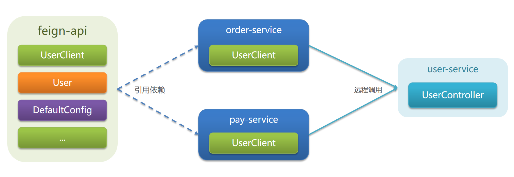

#### 8.4.3. 小结

Feign 的最佳实践:

* 让 controller 和 FeignClient 继承同一接口
* 将 FeignClient、POJO、Feign 的默认配置都定义到一个项目中，供所有消费者使用

### 8.5. 实现 Feign 最佳实践

实现最佳实践方式二的步骤如下：

1. 首先创建一个 module，命名为 feign-api，然后引入 feign 的 starter 依赖
2. 将 order-service 中编写的 UserClient、User、DefaultFeignConfiguration 都复制到 feign-api 项目中
3. 在 order-service 中引入 feign-api 的依赖
4. 修改 order-service 中的所有与上述三个组件有关的 import 部分，改成导入 feign-api 中的包
5. 重启测试

当定义的 FeignClient 不在 SpringBootApplication 的扫描包范围时，这些 FeignClient 无法使用，有两种方式解决: 

方式一：指定 FeignClient 所在包

```java
@EnableFeignClients(basePackages = "cn.itcast.feign.clients")
```

方式二：指定 FeignClient 字节码 【推荐】

```java
@EnableFeignClients(clients = {UserClient.class})
```

## 9. Gateway 服务网关

### 9.1. 网关作用介绍

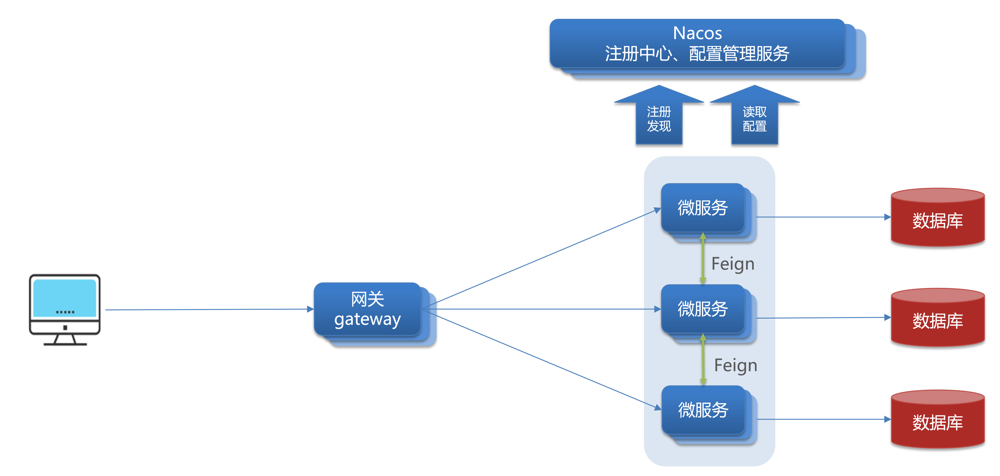

网关功能：

* 身份认证和权限校验
* 服务路由、负载均衡
* 请求限流

在 SpringCloud 中网关的实现包括两种：

* gateway
* zuul

Zuul 是基于 Servlet 的实现，属于阻塞式编程。
而 SpringCloudGateway 则是基于 Spring5 中提供的 WebFlux，属于响应式编程的实现，具备更好的性能。

网关的作用：

* 对用户请求做身份认证、权限校验
* 将用户请求路由到微服务，并实现负载均衡
* 对用户请求做限流

### 9.2. 快速入门

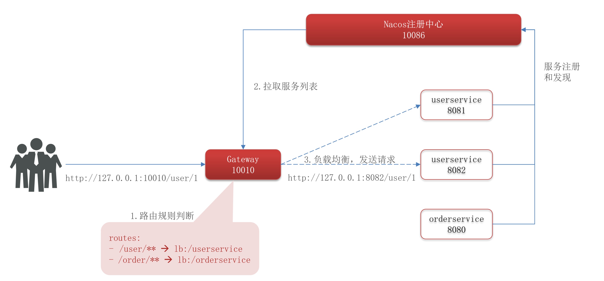

步骤 1: 创建 module，引入 SpringCloudGateway、nacos 的依赖

```xml
<!--网关依赖-->
<dependency>
    <groupId>org.springframework.cloud</groupId>
    <artifactId>spring-cloud-starter-gateway</artifactId>
</dependency>

<!--nacos服务发现依赖-->
<dependency>
    <groupId>com.alibaba.cloud</groupId>
    <artifactId>spring-cloud-starter-alibaba-nacos-discovery</artifactId>
</dependency>
```

步骤 2: 编写路由配置及 nacos 地址

```yml
server:
  port: 10010
spring:
  application:
    name: gateway
  cloud:
    nacos:
      server-addr: localhost:8848
    gateway:
      routes:
        - id: user-service # 路由标识，唯一
          uri: lb://userservice # 路由的目标地址
          predicates: # 路由断言，判断请求是否符合规则
            - Path=/user/** # 路径断言，判断路径是否以 /user 打头
        - id: order-service
          uri: lb://orderservice
          predicates:
            - Path=/order/**
```

访问: 

* http://localhost:10010/user/1
* http://localhost:10010/order/101


网关搭建步骤：

* 创建项目，引入 nacos 服务发现和 gateway 依赖
* 配置 application.yml，包括服务基本信息、nacos地址、路由

路由配置包括：

* 路由 id：路由的唯一标示
* 路由目标（uri）：路由的目标地址，http代表固定地址，lb代表根据服务名负载均衡
* 路由断言（predicates）：判断路由的规则，
* 路由过滤器（filters）：对请求或响应做处理

### 9.3. 路由断言工厂

网关路由可以配置的内容包括：

* 路由id：路由唯一标示
* uri：路由目的地，支持lb和http两种
* predicates：路由断言，判断请求是否符合要求，符合则转发到路由目的地
* filters：路由过滤器，处理请求或响应

我们在配置文件中写的断言规则只是字符串，这些字符串会被 Predicate Factory 读取并处理，转变为路由判断的条件

例如 `Path=/user/**` 是按照路径匹配，这个规则是由 `org.springframework.cloud.gateway.handler.predicate.PathRoutePredicateFactory` 类来处理的

像这样的断言工厂在 SpringCloudGateway 还有十几个

Spring 提供了 11 种基本的 Predicate 工厂:

| 名称 | 说明 | 示例 |
| - | - | - |
| After | 是某个时间点后的请求 | `- After=2037-01-20T17:42:47.789-07:00[America/Denver]` |
| Before | 是某个时间点之前的请求 | `- Before=2031-04-13T15:14:47.433+08:00[Asia/Shanghai]` |
| Between | 是某两个时间点之前的请求 | `- Between=2037-01-20T17:42:47.789-07:00[America/Denver], 2037-01-21T17:42:47.789-07:00[America/Denver]` |
| Cookie | 请求必须包含某些cookie | `- Cookie=chocolate, ch.p` |
| Header | 请求必须包含某些header | `- Header=X-Request-Id, \d+` |
| Host | 请求必须是访问某个host（域名） | `- Host=**.somehost.org,**.anotherhost.org` |
| Method | 请求方式必须是指定方式 | `- Method=GET,POST` |
| Path | 请求路径必须符合指定规则 | `- Path=/red/{segment},/blue/**` |
| Query | 请求参数必须包含指定参数 | `- Query=name, Jack或者- Query=name` |
| RemoteAddr | 请求者的 ip 必须是指定范围 | `- RemoteAddr=192.168.1.1/24` |
| Weight | 权重处理 | - |

参考: https://docs.spring.io/spring-cloud-gateway/docs/2.2.6.RELEASE/reference/html/#gateway-request-predicates-factories

PredicateFactory 的作用是什么？

* 读取用户定义的断言条件，对请求做出判断

`Path=/user/**` 是什么含义？

* 路径是以/user开头的就认为是符合的

### 9.4. 路由的过滤器配置

#### 9.4.1. GatewayFilter

GatewayFilter 是网关中提供的一种过滤器，可以对进入网关的请求和微服务返回的响应做处理

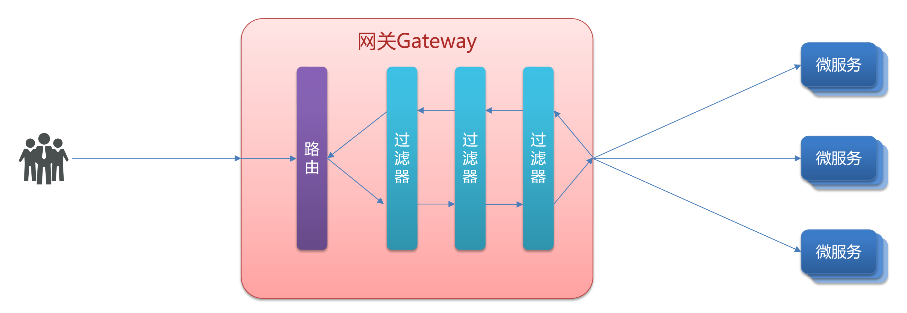

Spring 提供了 31 种不同的路由过滤器工厂。例如：

| 名称 | 说明 |
| - | - |
| AddRequestHeader | 给当前请求添加一个请求头 |
| RemoveRequestHeader | 移除请求中的一个请求头 |
| AddResponseHeader | 给响应结果中添加一个响应头 |
| RemoveResponseHeader | 从响应结果中移除有一个响应头 |
| RequestRateLimiter | 限制请求的流量 |

参考: https://docs.spring.io/spring-cloud-gateway/docs/2.2.6.RELEASE/reference/html/#gatewayfilter-factories

#### 9.4.2. 案例

给所有进入 userservice 的请求添加一个请求头(AuthMethod=UsernamePassword)

```yml
spring:
  cloud:
    gateway:
      routes:
        - id: user-service # 路由标识，唯一
          uri: lb://userservice # 路由的目标地址
          predicates: # 路由断言，判断请求是否符合规则
            - Path=/user/** # 路径断言，判断路径是否以 /user 打头
          filters:
            - AddRequestHeader=AuthMethod, UsernamePassword
```

```java
@GetMapping("/{id}")
public User queryById(@PathVariable("id") Long id, @RequestHeader(name = "AuthMethod", required = false) String header) {
    log.info("AuthMethod={}", header);
    return userService.queryById(id);
}
```

#### 9.4.3. 默认过滤器

如果要对所有的路由都生效，则可以将过滤器工厂写到 default 下。格式如下：

```yml
spring:
  cloud:
    gateway:
      default-filters:
        - AddRequestHeader=AuthMethod, UsernamePassword
```

#### 9.4.4. 小结

过滤器的作用是什么？

* 对路由的请求或响应做加工处理，比如添加请求头
* 配置在路由下的过滤器只对当前路由的请求生效

defaultFilters 的作用是什么？

* 对所有路由都生效的过滤器

### 9.5. 全局过滤器

#### 9.5.1. GlobalFilter

全局过滤器的作用也是处理一切进入网关的请求和微服务响应，与 GatewayFilter 的作用一样。

区别在于 GatewayFilter 通过配置定义，处理逻辑是固定的。而 GlobalFilter 的逻辑需要自己写代码实现。

定义方式是实现 GlobalFilter 接口。

```java
public interface GlobalFilter {   
    /**    
     *  处理当前请求，有必要的话通过{@link GatewayFilterChain}将请求交给下一个过滤器处理
     *
     * @param exchange 请求上下文，里面可以获取 Request、Response 等信息    
     * @param chain 用来把请求委托给下一个过滤器     
     * @return {@code Mono<Void>} 返回标示当前过滤器业务结束    
     */   
    Mono<Void> filter(ServerWebExchange exchange, GatewayFilterChain chain);
}
```

#### 9.5.2. 案例

定义全局过滤器，拦截并判断用户身份

需求：定义全局过滤器，拦截请求，判断请求的参数是否满足下面条件：
* 参数中是否有 authorization
* authorization 参数值是否为 admin

如果同时满足则放行，否则拦截并返回 401

```java
@Order(-1) // 数值越小，优先级越高，默认为最低
@Component
public class AuthorizeFilter implements GlobalFilter {
    @Override
    public Mono<Void> filter(ServerWebExchange exchange, GatewayFilterChain chain) {
        // 1.获取请求参数
        MultiValueMap<String, String> params = exchange.getRequest().getQueryParams();
        // 2.获取authorization参数
        String auth = params.getFirst("authorization");
        // 3.校验
        if ("admin".equals(auth)) {
            // 放行
            return chain.filter(exchange);
        }
        // 4.拦截
        // 4.1.禁止访问
        ServerHttpResponse response = exchange.getResponse();
        response.setStatusCode(HttpStatus.UNAUTHORIZED); // 401

        // 4.2.结束处理
        return response.setComplete();
    }
}
```

测试: http://localhost:10010/user/1?authorization=admin

#### 9.5.3. 小结

全局过滤器的作用是什么？

* 对所有路由都生效的过滤器，并且可以自定义处理逻辑

实现全局过滤器的步骤？

* 实现 GlobalFilter 接口
* 添加 @Order 注解或实现 Ordered 接口
* 编写处理逻辑


### 9.6. 过滤器链执行顺序

#### 9.6.1. 过滤器执行顺序

请求进入网关会碰到三类过滤器：当前路由的过滤器、DefaultFilter、GlobalFilter

请求路由后，会将 当前路由过滤器、DefaultFilter、GlobalFilter，合并到一个过滤器链（集合）中，排序后依次执行每个过滤器

每一个过滤器都必须指定一个 int 类型的 order 值，order 值越小，优先级越高，执行顺序越靠前。

GlobalFilter 通过实现 Ordered 接口，或者添加 @Order 注解来指定 order 值，由我们自己指定

路由过滤器、defaultFilter 的 order 由 Spring 指定，默认是按照声明顺序从 1 递增。

当过滤器的 order 值一样时，会按照 defaultFilter > 路由过滤器 > GlobalFilter 的顺序执行。

#### 9.6.2. 示例

配置过滤器:

```yml
server:
  port: 10010
spring:
  application:
    name: gateway
  cloud:
    nacos:
      server-addr: localhost:8848
    gateway:
      default-filters:
        - DefaultFilterA     # order(1)
        - DefaultFilterB     # order(2)
      routes:
        - id: user-service 
          uri: lb://userservice 
          predicates: 
            - Path=/user/** 
          filters:
            - 当前路由过滤器A # order(1)
            - 当前路由过滤器B # order(2)

```

自定义过滤器: 

```java
@Order(1)
@Component
public class AuthorizeFilter implements GlobalFilter {
    // ...
}
```

当访问 /user/1 时，过滤器的执行顺序: DefaultFilterA -> 当前路由过滤器A -> AuthorizeFilter

#### 9.6.3. 小结

路由过滤器、defaultFilter、全局过滤器的执行顺序？

* order 值越小，优先级越高
* 当 order 值一样时，顺序是 defaultFilter 最先，然后是局部的路由过滤器，最后是全局过滤器

### 9.7. 网关的 cors 跨域配置

#### 9.7.1. 跨域问题

跨域：域名不一致就是跨域

主要包括：
* 域名不同： www.taobao.com 和 www.taobao.org ， www.jd.com 和 miaosha.jd.com
* 域名相同，端口不同：localhost:8080 和 localhost8081

跨域问题：浏览器 禁止 请求的发起者 与 服务端 发生跨域 ajax 请求，请求被浏览器拦截的问题

解决方案：CORS

#### 9.7.2. CORS

网关处理跨域采用的同样是 CORS 方案，并且只需要简单配置即可实现

```yml
spring:
  cloud:
    gateway:
      globalcors: # 全局的跨域处理
        add-to-simple-url-handler-mapping: true # 解决 options 请求被拦截问题
        corsConfigurations:
          '[/**]':
            allowedOrigins: "*" # 允许哪些网站的跨域请求
#              - "http://localhost:8090"
#              - "http://www.leyou.com"
            allowedMethods: "*" # 允许的跨域ajax的请求方式
#              - "GET"
#              - "POST"
#              - "DELETE"
#              - "PUT"
#              - "OPTIONS"
            allowedHeaders: "*" # 允许在请求中携带的头信息
            allowCredentials: true # 是否允许携带cookie
            maxAge: 360000 # 这次跨域检测的有效期
```

#### 9.7.3. 小结

CORS跨域要配置的参数包括哪几个？

* 允许哪些域名跨域？
* 允许哪些请求头？
* 允许哪些请求方式？
* 是否允许使用 cookie？
* 有效期是多久？

## 10. Docker

### 10.1. 初识 Docker - 什么是 docker

大型项目组件较多，运行环境也较为复杂，部署时会碰到一些问题：

* 依赖关系复杂，容易出现兼容性问题
* 开发、测试、生产环境有差异

Docker如何解决依赖的兼容问题的？

* 将应用的 Libs（函数库）、Deps（依赖）、配置 与 应用 一起打包
* 将每个应用放到一个隔离容器去运行，避免互相干扰

Docker 如何解决不同系统环境的问题？

* Docker 将用户程序与所需要调用的系统(比如 Ubuntu)函数库一起打包
* Docker 运行到不同操作系统时，直接基于打包的库函数，借助于操作系统的 Linux 内核来运行

Docker 如何解决大型项目依赖关系复杂，不同组件依赖的兼容性问题？

* Docker 允许开发中将应用、依赖、函数库、配置一起打包，形成可移植镜像
* Docker 应用运行在容器中，使用沙箱机制，相互隔离

Docker 如何解决开发、测试、生产环境有差异的问题

* Docker 镜像中包含完整运行环境，包括系统函数库，仅依赖系统的 Linux 内核，因此可以在任意 Linux 操作系统上运行

Docker 是一个快速交付应用、运行应用的技术：

* 可以将程序及其依赖、运行环境一起打包为一个镜像，可以迁移到任意 Linux 操作系统
* 运行时利用沙箱机制形成隔离容器，各个应用互不干扰
* 启动、移除都可以通过一行命令完成，方便快捷

### 10.2. 初识 Docker - Docker 和虚拟机的差别

虚拟机（virtual machine）是在操作系统中模拟硬件设备，然后运行另一个操作系统，比如在 Windows 系统里面运行 Ubuntu 系统，这样就可以运行任意的Ubuntu应用了。

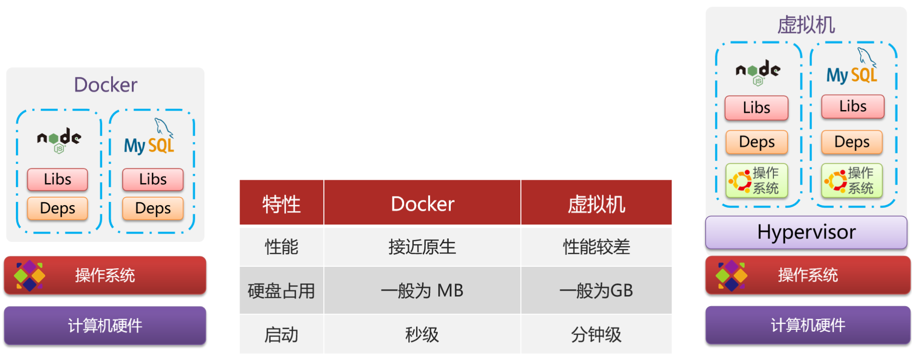

Docker 和虚拟机的差异：

* docker 是一个系统进程；虚拟机是在操作系统中的操作系统
* docker 体积小、启动速度快、性能好；虚拟机体积大、启动速度慢、性能一般

### 10.3. 初识 Docker - Docker 架构

镜像和容器:

* 镜像（Image）：Docker 将应用程序及其所需的依赖、函数库、环境、配置等文件打包在一起，称为镜像。
* 容器（Container）：镜像中的应用程序运行后形成的进程就是容器，只是 Docker 会给容器做隔离，对外不可见。

Docker 和 DockerHub:

* DockerHub：DockerHub 是一个 Docker 镜像的托管平台。这样的平台称为 Docker Registry。
* 国内也有类似于 DockerHub 的公开服务，比如 网易云镜像服务、阿里云镜像库等。

Docker 是一个 CS 架构的程序，由两部分组成：

* 服务端(server)：Docker 守护进程，负责处理 Docker 指令，管理镜像、容器等
* 客户端(client)：通过命令或 RestAPI 向 Docker 服务端发送指令。可以在本地或远程向服务端发送指令

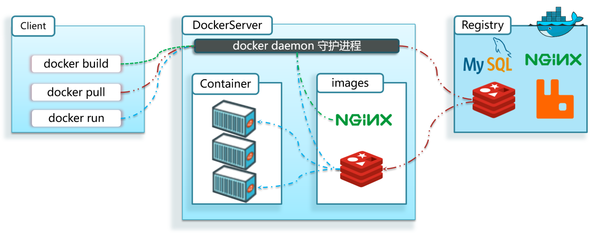

镜像：

* 将应用程序及其依赖、环境、配置打包在一起

容器：

* 镜像运行起来就是容器，一个镜像可以运行多个容器

Docker结构：

* 服务端：接收命令或远程请求，操作镜像或容器
* 客户端：发送命令或者请求到Docker服务端

DockerHub：

* 一个镜像托管的服务器，类似的还有阿里云镜像服务，统称为 DockerRegistry

### 10.4. 初识 Docker - Docker 的安装

#### 10.4.1. 1.1.卸载（可选）

如果之前安装过旧版本的Docker，可以使用下面命令卸载：

```shell
yum remove docker \
                  docker-client \
                  docker-client-latest \
                  docker-common \
                  docker-latest \
                  docker-latest-logrotate \
                  docker-logrotate \
                  docker-selinux \
                  docker-engine-selinux \
                  docker-engine \
                  docker-ce
```

#### 10.4.2. 安装 docker

首先需要大家虚拟机联网，安装yum工具

```sh
yum install -y yum-utils \
           device-mapper-persistent-data \
           lvm2 --skip-broken

```

然后更新本地镜像源：

```shell
# 设置 docker 镜像源
yum-config-manager \
    --add-repo \
    https://mirrors.aliyun.com/docker-ce/linux/centos/docker-ce.repo
    
sed -i 's/download.docker.com/mirrors.aliyun.com\/docker-ce/g' /etc/yum.repos.d/docker-ce.repo

yum makecache fast

```

然后输入命令：

```shell
yum install -y docker-ce
```

docker-ce为社区免费版本。稍等片刻，docker即可安装成功。

#### 10.4.3. 启动 docker

Docker 应用需要用到各种端口，逐一去修改防火墙设置。非常麻烦，因此建议大家直接关闭防火墙！

```sh
# 关闭
systemctl stop firewalld

# 禁止开机启动防火墙
systemctl disable firewalld

# 查看防火墙状态
systemctl status firewalld
```


通过命令启动 docker：

```sh
# 启动docker服务
systemctl start docker  

# 停止docker服务
systemctl stop docker  

# 重启docker服务
systemctl restart docker  
```

验证 docker 已启动:


```sh
# 方式 1: 查看服务状态
systemctl status docker  


# 方式2: 查看 docker 版本
docker -v

# Docker version 26.1.4, build 5650f9b
```

#### 10.4.4. 配置镜像加速

docker官方镜像仓库网速较差，我们需要设置国内镜像服务：

参考阿里云的镜像加速文档：https://cr.console.aliyun.com/cn-hangzhou/instances/mirrors

```shell
sudo mkdir -p /etc/docker
sudo tee /etc/docker/daemon.json <<-'EOF'
{
  "registry-mirrors": [
    "https://docker.mirrors.ustc.edu.cn/",
    "https://hub-mirror.c.163.com/",
    "https://docker.m.daocloud.io",
    "https://reg-mirror.qiniu.com",
    "https://proxy.1panel.live",
    "https://docker.1panel.top"
  ]
}
EOF
sudo systemctl daemon-reload
sudo systemctl restart docker
```

```shell
# 查看是否配置成功
docker info
```

阿里云的Docker镜像加速器在2024年7月2日后已停止对外网普通用户的服务，仅支持在阿里云服务器等内网环境中使用。 ‌

因此，对于非阿里云服务器的用户，配置的阿里云镜像加速地址将无法连接，导致拉取Docker镜像失败或超时。

为解决此问题，可采用以下第三方镜像加速器替代方案：

* ‌中科大镜像‌：https://docker.mirrors.ustc.edu.cn/
* ‌网易镜像‌：https://hub-mirror.c.163.com/
* ‌DaoCloud镜像‌：https://docker.m.daocloud.io
* ‌七牛云镜像‌：https://reg-mirror.qiniu.com
* ‌1Panel镜像‌：https://proxy.1panel.live 或 https://docker.1panel.top

### 10.5. 使用 Docker - 镜像命令

#### 10.5.1. 镜像名称

镜像名称一般分两部分组成：`[repository]:[tag]`。

在没有指定 tag 时，默认是 latest，代表最新版本的镜像

#### 10.5.2. 镜像操作命令

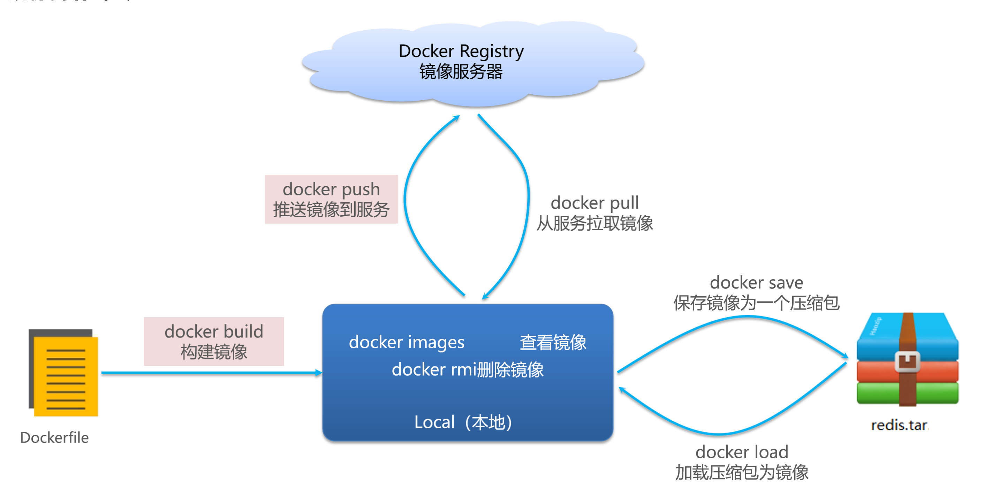

#### 10.5.3. 案例

步骤 1: 到 [官网](https://hub.docker.com/) 搜索 nginx （注意要翻墙），查看 镜像名称及版本

* 搜索镜像: https://docker.xuanyuan.me/
* 参考: [2026 最新 Docker 国内镜像源加速列表（2月16日更新）](https://zhuanlan.zhihu.com/p/24461370776)

步骤 2: 从 DockerHub 拉取 nginx 镜像

```shell
# 拉取
docker pull nginx
# Using default tag: latest

# 查看
docker images
# REPOSITORY   TAG       IMAGE ID       CREATED       SIZE
# nginx        latest    5cdef4ac3335   12 days ago   161MB
```

步骤 3: 导出 nginx 镜像到本地

```shell
docker save --help
# Usage:  docker save [OPTIONS] IMAGE [IMAGE...]

# Save one or more images to a tar archive (streamed to STDOUT by default)

# Aliases:
#   docker image save, docker save

# Options:
#   -o, --output string   Write to a file, instead of STDOUT

docker save -o nginx.tar nginx:latest

ll
# 总用量 160640
# -rw-------. 1 root root 164491264 2月  17 22:35 nginx.tar
```

步骤 4: 删除已安装的 nginx 镜像

```shell
docker rmi nginx:latest
# Untagged: nginx:latest
```

步骤 5: 从本地载入 nginx 镜像

```shell
docker load -i nginx.tar
```

### 10.6. 使用 Docker - 容器命令

#### 10.6.1. 介绍


#### 10.6.2. 创建并运行 Ngxin 容器

命令:

```shell
docker run \
  --name 容器名称 \
  -p 宿主机端口:容器端口 \
  -d \
  镜像名称
```

说明:

* docker run: 创建并运行一个容器
* --name: 容器名称。给容器起一个名字，比如叫做 mn
* -p: 端口隐射。将宿主机端口与容器端口映射，冒号左侧是宿主机端口，右侧是容器端口
* -d: 后台运行容器

示例:

```shell
docker run --name mn -p 80:80 -d nginx
# 输出 容器的 ID
# 5e07f6f52c092b9f03303bfe7dc3ef41b01597b9f84553e96c9349a12ebb9879

# 查看 所有运行的容器
docker ps
# CONTAINER ID   IMAGE     STATUS          PORTS                               NAMES
# 5e07f6f52c09   nginx     Up 46 seconds   0.0.0.0:80->80/tcp, :::80->80/tcp   mn

# 持续查看 mn 容器的日志
docker logs -f mn
```

#### 10.6.3. 进入 Ngxin 容器，修改 index.html 的内容

步骤 1: 进入容器

```shell
docker exec -it mn bash

# docker exec ：进入容器内部，执行一个命令
# -it  : 给当前进入的容器创建一个标准输入、输出终端，允许我们与容器交互
# mn   ：要进入的容器的名称
# bash ：进入容器后执行的命令，bash 是一个 linux 终端交互命令
```

步骤 2：进入 nginx 的 HTML 所在目录 /usr/share/nginx/html

```shell
cd /usr/share/nginx/html
```

步骤 3: 修改 index.html 的内容

```shell
sed -i 's#Welcome to nginx#张三，你好#g' index.html
sed -i 's#<head>#<head><meta charset="utf-8">#g' index.html
```

步骤 4: 退出容器

```shell
exit
```

示例:

```shell
# 停止 容器
docker stop mn

# 查看所有容器的状态，包括已停止的，默认只能查看正在运行的
docker ps -a

# 启动 容器
docker start mn

# 强制删除 正在运行 的容器
docker rm -f mn
```

查看容器状态：

* docker ps 
* 添加 -a 参数查看所有状态的容器

删除容器：

* docker rm
* 不能删除运行中的容器，除非添加 -f 参数

进入容器：
* 命令是 `docker exec -it [容器名] [要执行的命令]`
* exec 命令可以进入容器修改文件，但是在容器内修改文件是不推荐的


### 10.7. Docker 的基本操作
### 10.8. Dockerfile 自定义镜像
### 10.9. Docker-Compose
### 10.10. Docker 镜像仓库