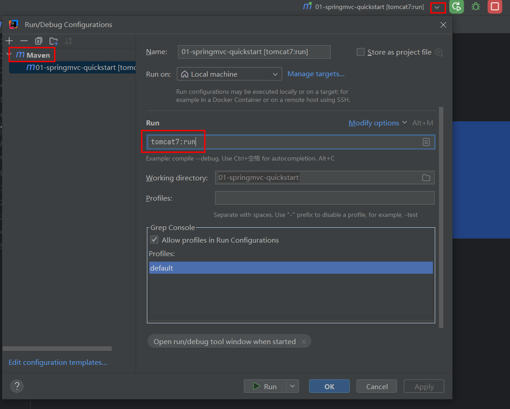

<!--#region
@author 吴钦飞
@email wuqinfei@qq.com
@create date 2025-07-25 21:01:17
@modify date 2025-07-30 09:05:00
@desc [description]
#endregion-->

# ssm - spring mvc

## 1. SpringMVC 概述

SpringMVC 是一种基于 Java 实现 MVC 模型的轻量级 Web 框架

## 2. SpringMVC 入门案例

### 2.1. 案例

(1) 步骤1: 创建 web 项目

maven 项目

maven-archetype-webapp

(2) 步骤2: 新建源码目录(java)

```text
${root}/
    src/main
        java      # 在项目结构设置中，新建 java 源码目录
```

(3) 步骤3: 导入 jar 包

```xml
<project xmlns="http://maven.apache.org/POM/4.0.0" xmlns:xsi="http://www.w3.org/2001/XMLSchema-instance"
  xsi:schemaLocation="http://maven.apache.org/POM/4.0.0 http://maven.apache.org/maven-v4_0_0.xsd">
  <modelVersion>4.0.0</modelVersion>
  <groupId>org.example</groupId>
  <artifactId>01-springmvc-quickstart</artifactId>
  <packaging>war</packaging>
  <version>1.0-SNAPSHOT</version>

  <dependencies>
    <dependency>
      <groupId>javax.servlet</groupId>
      <artifactId>javax.servlet-api</artifactId>
      <version>3.1.0</version>
      <scope>provided</scope>
    </dependency>
    <dependency>
      <groupId>org.springframework</groupId>
      <artifactId>spring-webmvc</artifactId>
      <version>5.2.10.RELEASE</version>
    </dependency>
  </dependencies>

  <build>
    <plugins>
      <plugin>
        <groupId>org.apache.tomcat.maven</groupId>
        <artifactId>tomcat7-maven-plugin</artifactId>
        <version>2.1</version>
        <configuration>
          <port>80</port>
          <path>/</path>
        </configuration>
      </plugin>
    </plugins>
  </build>

</project>
```

servlet 的坐标为什么需要添加 `<scope>provided</scope>` ?

* `scope` 是 maven 中 jar 包依赖作用范围的描述
* 如果不设置默认是 `compile` ，在编译、运行、测试时均有效
* 如果运行有效的话就会和 tomcat 中的 servlet-api 包发生冲突，导致启动报错
* `provided` 代表的是该包只在编译和测试的时候用，运行的时候无效；此时使用 tomcat 中的，就避免冲突

(4) 步骤4: 创建 SpringMVC 配置类

```java
@Configuration
@ComponentScan("org.example.controller")
public class SpringMvcConfig {
}
```

(5) 步骤5: 创建 Controller 类

```java
@Controller
public class UserController {
    @RequestMapping("/save")
    @ResponseBody
    public String save(){
        System.out.println("user save ...");
        return "{ 'info': 'springmvc' }";
    }
}
```

(6) 步骤6: 使用配置类替换 web.xml

将 web.xml 删除，换成 ServletContainersInitConfig

```java
// 该文件会自动扫描到
// web 容器配置类
public class ServletContainersInitConfig extends AbstractDispatcherServletInitializer {
    // 加载 springmvc 配置类
    protected WebApplicationContext createServletApplicationContext() {
        // 初始化 WebApplicationContext 对象
        AnnotationConfigWebApplicationContext ctx = new AnnotationConfigWebApplicationContext();
        // 加载指定配置类
        ctx.register(SpringMvcConfig.class);
        return ctx;
    }

    //设置由 springmvc 控制器处理的请求映射路径
    protected String[] getServletMappings() {
        return new String[]{"/"};
    }

    //加载 spring 配置类
    protected WebApplicationContext createRootApplicationContext() {
        return null;
    }
}
```

(7) 步骤7: 启动项目



(8) 步骤8: 浏览器访问

http://localhost/save

注意事项:

* SpringMVC 是基于 Spring 的，`spring-webmvc` jar包 自动依赖spring相关坐标
* `AbstractDispatcherServletInitializer` 类是 SpringMVC 提供的快速初始化 Web3.0 容器的抽象类
* `AbstractDispatcherServletInitializer` 提供了三个接口方法供用户实现
   * `createServletApplicationContext` 方法，创建 Servlet 容器时，加载 SpringMVC 对应的 bean 并放入 `WebApplicationContext` 对象范围中，而 `WebApplicationContext` 的作用范围为 `ServletContext` 范围，即整个 web 容器范围
  * `getServletMappings` 方法，设定 SpringMVC 对应的请求映射路径，即 SpringMVC 拦截哪些请求
  * `createRootApplicationContext` 方法，如果创建 Servlet 容器时需要加载非 SpringMVC 对应的 bean,使用当前方法进行，使用方式和 `createServletApplicationContext` 相同。
  * `createServletApplicationContext` 用来加载 SpringMVC 环境
  * `createRootApplicationContext` 用来加载 Spring 环境

### 2.2. 工作流程解析

#### 2.2.1. 启动服务器初始化过程

1. 服务器启动，执行 `ServletContainersInitConfig` 类，初始化 web 容器
    * 功能类似于以前的web.xml

2. 执行 `createServletApplicationContext` 方法，创建了 `WebApplicationContext` 对象
    * 该方法加载 SpringMVC 的配置类 SpringMvcConfig 来初始化 SpringMVC 的容器

3. 加载 `SpringMvcConfig` 配置类

4. 执行 `@ComponentScan` 加载对应的 bean
    * 扫描指定包及其子包下所有类上的注解，如 Controller 类上的 `@Controller` 注解

5. 加载 UserController，每个 `@RequestMapping` 的名称对应一个具体的方法
    * 此时就建立了 `/save` 和 save 方法的对应关系

6. 执行 `getServletMappings` 方法，设定 SpringMVC 拦截请求的路径规则
   * `/` 代表所拦截请求的路径规则，只有被拦截后才能交给 SpringMVC 来处理请求

#### 2.2.2. 单次请求过程

1. 发送请求 `http://localhost/save`
2. web 容器发现该请求满足 SpringMVC 拦截规则，将请求交给 SpringMVC 处理
3. 解析请求路径 `/save`
4. 由 `/save` 匹配执行对应的方法 `save()`
    * 上面的第 5 步已经将请求路径和方法建立了对应关系，通过 `/save` 就能找到对应的 `save()` 方法
5. 执行 save()
6. 检测到有 `@ResponseBody` 直接将 `save()` 方法的返回值作为响应体返回给请求方

### 2.3. bean 加载控制

#### 2.3.1. 问题分析

SpringMVC 加载的 bean:

* 表现层 的 bean (`@Controller`)

Spring 加载的 bean:

* 业务 bean (Service)
* 功能 bean
   * DataSource
   * SqlSessionFactoryBean
   * MapperScannerConfigurer

让 Spring 和 SpringMVC 分开加载各自的内容

#### 2.3.2. 思路分析

针对上面的问题，解决方案也比较简单，就是:

* 加载 Spring 控制的 bean 的时候排除掉 SpringMVC 控制的 bean

具体该如何排除：

* 方式一: Spring 加载的 bean 设定扫描范围为精准范围，例如 service包、dao包 等
* 方式二: Spring 加载的 bean 设定扫描范围为 org.example , 排除掉 controller 包中的 bean
* 方式三: 不区分 Spring 与 SpringMVC 的环境，加载到同一个环境中

#### 2.3.3. 示例

目录:

```text
${root}/
    src/main/java/
        org.example
            config/
                ServletContainersInitConfig.java
                SpringConfig.java
                SpringMvcConfig.java
            controller/
                UserController.java
            dao/
                UserDao.java
                impl/UserDaoImpl.java
            service/
                UserService.java
                impl/UserServiceImpl.java
```

```java
public interface UserDao {
    void save();
}

@Repository
public class UserDaoImpl implements UserDao {
    @Override
    public void save() {
        System.out.println("user dao save...");
    }
}

public interface UserService {
    void save();
}

@Service
public class UserServiceImpl implements UserService {
    @Autowired
    private UserDao userDao;

    @Override
    public void save() {
        userDao.save();
        System.out.println("user service save...");
    }
}

@Controller
public class UserController {
    @Autowired
    private UserService userService;

    @RequestMapping("/save")
    @ResponseBody
    public String save(){
        userService.save();
        return "{ 'info': 'springmvc' }";
    }
}
```

```java
@Configuration
@ComponentScan({"org.example.service","org.example.dao"})
public class SpringConfig {
}

@Configuration
@ComponentScan("org.example.controller")
public class SpringMvcConfig {
}

// 这个类作为入口，加载 spring 、springmvc 的配置类
public class ServletContainersInitConfig extends AbstractDispatcherServletInitializer {
    // 加载 springmvc 配置类
    protected WebApplicationContext createServletApplicationContext() {
        AnnotationConfigWebApplicationContext ctx = new AnnotationConfigWebApplicationContext();
        ctx.register(SpringMvcConfig.class);
        return ctx;
    }

    // 设置由 springmvc 控制器处理的请求映射路径
    protected String[] getServletMappings() {
        return new String[]{"/"};
    }

    // 加载 spring 配置类
    protected WebApplicationContext createRootApplicationContext() {
        AnnotationConfigWebApplicationContext ctx = new AnnotationConfigWebApplicationContext();
        ctx.register(SpringConfig.class);
        return ctx;
    }
}
```

`ServletContainersInitConfig` 的更简便写法:

```java
public class ServletContainersInitConfig extends AbstractAnnotationConfigDispatcherServletInitializer {

    protected Class<?>[] getRootConfigClasses() {
        return new Class[]{SpringConfig.class};
    }

    protected Class<?>[] getServletConfigClasses() {
        return new Class[]{SpringMvcConfig.class};
    }

    protected String[] getServletMappings() {
        return new String[]{"/"};
    }
}
```

## 3. 请求参数

### 3.1. GET 请求中文乱码

请求: 

```http
GET http://localhost/params?name=张三
```

说明:

* Tomcat8.5 以后的版本已经处理了中文乱码的问题
* IDEA 中的 Tomcat 插件目前只到 Tomcat7，所以需要修改 pom.xml 来解决 GET 请求中文乱码问题

```xml
<build>
    <plugins>
        <plugin>
            <groupId>org.apache.tomcat.maven</groupId>
            <artifactId>tomcat7-maven-plugin</artifactId>
            <version>2.1</version>
            <configuration>
                <port>80</port>
                <path>/</path>
                
                <!-- 设置编码 -->
                <uriEncoding>UTF-8</uriEncoding>
            </configuration>
        </plugin>
    </plugins>
</build>
```

### 3.2. POST 请求中文乱码

请求:

```http
POST http://localhost/params
Content-Type: application/x-www-form-urlencoded

name=张三
```

说明:

* 配置过滤器

```java
import javax.servlet.Filter;

public class ServletContainersInitConfig extends AbstractAnnotationConfigDispatcherServletInitializer {

    protected Class<?>[] getRootConfigClasses() {
        return new Class[]{SpringConfig.class};
    }

    protected Class<?>[] getServletConfigClasses() {
        return new Class[]{SpringMvcConfig.class};
    }

    protected String[] getServletMappings() {
        return new String[]{"/"};
    }

    // POST 乱码处理
    @Override
    protected Filter[] getServletFilters() {
        CharacterEncodingFilter filter = new CharacterEncodingFilter();
        filter.setEncoding("UTF-8");
        return new Filter[]{filter};
    }
}
```

### 3.3. URL 参数

| 名称     | @RequestParam                                          |
| -------- | ------------------------------------------------------ |
| 类型     | 形参注解                                               |
| 位置     | SpringMVC控制器方法形参定义前面                        |
| 作用     | 绑定请求参数与处理器方法形参间的关系                   |
| 相关参数 | required：是否为必传参数 <br/>defaultValue：参数默认值 |

#### 3.3.1. 普通参数

说明: URL 中的参数名称 与 controller 中方法的形参名称一致即可

示例:

```http
POST http://localhost/common-params
Content-Type: application/x-www-form-urlencoded

name=张三
```

```java
@RequestMapping("/common-params")
@ResponseBody
public String commonParams(String name){
    System.out.println("common-params: name = " + name);
    return "OK";
}
```

如果 URL 上的参数名称与方法的形参不一致，则需要使用 `@RequestParam("URL参数的名称")`

```http
POST http://localhost/common-params-diff-name
Content-Type: application/x-www-form-urlencoded

name=张三
```

```java
@RequestMapping("/common-params-diff-name")
@ResponseBody
public String commonParamsDiffName(@RequestParam("name") String userName){
    System.out.println("common-params-diff-name: userName = " + userName);
    return "OK";
}
```

如果某个参数为非必填的，则需要使用 `@RequestParam(required = false)`

```http
POST http://localhost/common-params-option-arg
Content-Type: application/x-www-form-urlencoded

name=张三
```

```java
@RequestMapping("/common-params-option-arg")
@ResponseBody
// 注意: 基本类型请使用其包装类型
public String commonParamsOptionArg(String name, @RequestParam(required = false) Integer age){
    System.out.println("common-params-option-arg: name = " + name);
    System.out.println("common-params-option-arg: age = " + age);
    return "OK";
}
```

#### 3.3.2. POJO 数据类型

说明:

* 请求参数名与形参对象属性名相同，定义 POJO 类型形参即可接收参数

```http
POST http://localhost/pojo-params
Content-Type: application/x-www-form-urlencoded

name=张三
&age=18
```

```java
@RequestMapping("/pojo-params")
@ResponseBody
public String pojoParams(User user){
    System.out.println("pojo-params: user = " + user);
    return "OK";
}

public class User {
    private String name;
    private Integer age;
    // ...
}
```

#### 3.3.3. 嵌套 POJO 类型参数

```http
POST http://localhost/pojo-params-nest
Content-Type: application/x-www-form-urlencoded

name=张三
&age=18
&address.province=湖北
&address.city=武汉
```

```java
@RequestMapping("/pojo-params-nest")
@ResponseBody
public String pojoParamsNest(User user){
    System.out.println("pojo-params-nest: user = " + user);
    return "OK";
}

public class User {
    private String name;
    private Integer age;
    private Address address;
    // ...
}
public class Address {
    private String province;
    private String city;
    // ...
}
```

#### 3.3.4. 数组类型参数

```http
POST http://localhost/array-params
Content-Type: application/x-www-form-urlencoded

hobbies=看小说
&hobbies=打游戏
&hobbies=做梦
```

```java
@RequestMapping("/array-params")
@ResponseBody
public String arrayParams(String[] hobbies){
    System.out.println("array-params: hobbies = " + Arrays.toString(hobbies));
    return "OK";
}
```

#### 3.3.5. 集合类型参数

```http
POST http://localhost/list-params
Content-Type: application/x-www-form-urlencoded

hobbies=看小说
&hobbies=打游戏
&hobbies=做梦
```

```java
@RequestMapping("/list-params")
@ResponseBody
// 如果不加 @RequestParam，SpringMVC 会将 hobbies 当成 POJO，给 hobbies 的属性赋值
public String listParams(@RequestParam List<String> hobbies){
    System.out.println("list-params: hobbies = " + hobbies);
    return "OK";
}
```


### 3.4. JSON 参数

#### 3.4.1. 开启 JSON 转换

(1) 步骤 1: 导入 jackson 

SpringMVC 默认使用的是 jackson 来处理 json 的转换

```xml
<dependency>
    <groupId>com.fasterxml.jackson.core</groupId>
    <artifactId>jackson-databind</artifactId>
    <version>2.9.0</version>
</dependency>
```

(2) 步骤 2: 开启 SpringMVC 注解支持

在 SpringMVC 的配置类中开启 SpringMVC 的注解支持，这里面就包含了将 JSON 转换成对象的功能。

```java
@Configuration
@ComponentScan("org.example.controller")
@EnableWebMvc // 开启 json 数据类型自动转换
public class SpringMvcConfig {
}
```

(3) 步骤 3: 参数前添加 `@RequestBody`

```java
@RequestMapping("/list-params-for-json")
@ResponseBody
public String listParamsForJson(@RequestBody List<String> hobbies){
    System.out.println("list-params: hobbies = " + hobbies);
    return "OK";
}
```

```http
POST http://localhost/list-params-for-json
Content-Type: application/json

[
    "看小说",
    "打游戏",
    "做梦"
]
```

#### 3.4.2. @EnableWebMvc

| 名称 | @EnableWebMvc             |
| ---- | ------------------------- |
| 类型 | 配置类注解            |
| 位置 | SpringMVC 配置类定义上方   |
| 作用 | 开启 SpringMVC 多项辅助功能 |

#### 3.4.3. @RequestBody

| 名称 | @RequestBody                                                       |
| ---- | ------------------------------------------------------------------ |
| 类型 | 形参注解                                                            |
| 位置 | SpringMVC 控制器方法形参定义前面                                      |
| 作用 | 将请求中请求体所包含的数据传递给请求参数，此注解一个处理器方法只能使用一次 |

### 3.5. 日期类型参数

#### 3.5.1. 指定请求参数的日期格式

```http
POST http://localhost/date-params
Content-Type: application/x-www-form-urlencoded

date1=2021/10/21
&date2=2021-10-21
&date3=2021/10/21 13:23:45
```

```java
@RequestMapping("/date-params")
@ResponseBody
public String dateParams(
        Date date1, // 默认格式 yyyy/MM/dd
        @DateTimeFormat(pattern = "yyyy-MM-dd") Date date2,
        @DateTimeFormat(pattern = "yyyy/MM/dd HH:mm:sss")Date date3
){
    System.out.println("date-params: date1 = " + date1.toLocaleString()); // 2021-10-21 0:00:00
    System.out.println("date-params: date2 = " + date2.toLocaleString()); // 2021-10-21 0:00:00
    System.out.println("date-params: date3 = " + date3.toLocaleString()); // 2021-10-21 13:23:45
    return "OK";
}
```

#### 3.5.2. 内部实现原理

后台需要的数据类型有很多中，如下

* 前端传递字符串，后端使用日期 Date 接收
* 前端传递 JSON 数据，后端使用对象接收
* 前端传递字符串，后端使用 Integer 接收

在数据的传递过程中存在很多类型的转换，SpringMVC 提供了很多类型转换接口和实现类

* Converter 接口
* HttpMessageConverter 接口: 实现对象与 JSON 之间的转换工作

```java
// org.springframework.core.convert.converter
/**
 *	S: the source type
 *	T: the target type
 */
public interface Converter<S, T> {
    @Nullable
    //该方法就是将从页面上接收的数据(S)转换成我们想要的数据类型(T)返回
    T convert(S source);
}
```

注意:

* 需要开启 `@EnableWebMvc`，以启用转换功能

### 3.6. 响应

返回:

* 页面
* 数据
   * 文本
   * json 数据

#### 3.6.1. 返回页面

```java
@RequestMapping("/jump-to-page")
public String jumpToPage(){
    // src/main/webapp/page.jsp
    return "page.jsp";
}
```

访问: http://localhost/jump-to-page

#### 3.6.2. 返回文本

```java
@RequestMapping("/return-text")
@ResponseBody
public String returnText(){
    return "Hello, SpringMVC";
}
```

```http
POST http://localhost/return-text
```

#### 3.6.3. 返回 JSON

示例:

```java
@RequestMapping("/return-json")
@ResponseBody
public User returnJson(){
    User user = new User();
    user.setName("张三");
    user.setAge(18);
    return user;
}
```

```http
POST http://localhost/return-json
```

#### 3.6.4. 分析 @ResponseBody

| 名称     | @ResponseBody                                                |
| -------- | ------------------------------------------------------------ |
| 类型     | 方法\类注解                                              |
| 位置     | SpringMVC 控制器方法定义上方和控制类上                        |
| 作用     | 设置当前控制器返回值作为响应体,<br/>写在类上，该类的所有方法都有该注解功能 |
| 相关属性 | pattern：指定日期时间格式字符串 

`@ResponseBody` 控制将方法的返回值转换为响应体，

其中转换接口为 `org.springframework.http.converter.HttpMessageConverter`

`org.springframework.http.converter.json.MappingJackson2HttpMessageConverter` 实现类 将 Java 对象转换为 JSON 格式响应体的

## 4. REST 风格

### 4.1. REST 简介

当我们想表示一个网络资源的时候，可以使用两种方式:

* 传统风格资源描述形式
    * `http://localhost/user/getById?id=1` 查询id为1的用户信息
    * `http://localhost/user/saveUser` 保存用户信息
* REST风格描述形式
    * `http://localhost/user/1` 
    * `http://localhost/user`


不同的请求方式代表不同的操作类型:

* GET: 查询
* POST: 新增
* PUT: 修改
* DELETE: 删除

描述模块的名称通常使用复数

示例:

* `GET http://localhost/users`      查询全部用户信息
* `GET http://localhost/users/1`    查询指定用户信息
* `POST http://localhost/users`     添加用户信息
* `PUT http://localhost/users`      修改用户信息
* `DELETE http://localhost/users/1` 删除用户信息

### 4.2. RESTful 入门案例

```java
@Controller
public class UserController {
    @RequestMapping(value = "/users", method = RequestMethod.POST)
    @ResponseBody
    public String save(@RequestBody User user) { /* ... */ }

    //@PathVariable 注解用于设置路径变量（路径参数），要求路径上设置对应的占位符，并且占位符名称与方法形参名称相同
    @RequestMapping(value = "/users/{id}", method = RequestMethod.DELETE)
    @ResponseBody
    public String delete(@PathVariable Integer id) { /* ... */ }

    @RequestMapping(value = "/users", method = RequestMethod.PUT)
    @ResponseBody
    public String update(@RequestBody User user) { /* ... */ }

    @RequestMapping(value = "/users/{id}", method = RequestMethod.GET)
    @ResponseBody
    public String getById(@PathVariable Integer id){ /* ... */ }

    @RequestMapping(value = "/users", method = RequestMethod.GET)
    @ResponseBody
    public String getAll() { /* ... */ }
}
```

`@PathVariable`

| 名称 | @PathVariable                                                |
| ---- | ------------------------------------------------------------ |
| 类型 | 形参注解                                                 |
| 位置 | SpringMVC控制器方法形参定义前面                              |
| 作用 | 绑定路径参数与处理器方法形参间的关系，要求路径参数名与形参名一一对应 |

区别:
* `@RequestParam` 用于接收 url 地址传参或表单传参
* `@RequestBody` 用于接收 json 数据
* `@PathVariable` 用于接收路径参数，使用`{参数名称}`描述路径参数

应用:
* 后期开发中，发送请求参数超过1个时，以 json 格式为主，`@RequestBody`应用较广
* 如果发送非 json 格式数据，选用 `@RequestParam` 接收请求参数
* 采用 RESTful 进行开发，当参数数量较少时，例如 1 个，可以采用 `@PathVariable` 接收请求路径变量，通常用于传递 id 值

### 4.3. RESTful 快速开发

```java
// 使用 @RestController 注解替换 @Controller 与 @ResponseBody 注解
@RestController     
@RequestMapping("/books")
public class BookController {
    @PostMapping
    public String save(@RequestBody Book book) { /* ... */ }

    @DeleteMapping("/{id}") 
    public String delete(@PathVariable Integer id) { /* ... */ }

    @PutMapping         
    public String update(@RequestBody Book book) { /* ... */ }

    @GetMapping("/{id}")
    public String getById(@PathVariable Integer id) { /* ... */ }

    @GetMapping
    public String getAll() { /* ... */ }
}
```

`@RestController`

| 名称 | @RestController                                              |
| ---- | ------------------------------------------------------------ |
| 类型 | 类注解                                                   |
| 位置 | 基于 SpringMVC 的 RESTful 开发控制器类定义上方                   |
| 作用 | 设置当前控制器类为 RESTful 风格，<br/>等同于 `@Controller` 与` @ResponseBody` 两个注解组合功能 |

### 4.4. RESTful 案例

#### 4.4.1. 设置静态资源目录

org.example.config: 

```java
// 设置静态资源访问过滤，当前类需要设置为配置类，并被扫描加载
@Configuration
public class SpringMvcSupport extends WebMvcConfigurationSupport {
    @Override
    protected void addResourceHandlers(ResourceHandlerRegistry registry) {
        // 当访问 /static/???? 时候，从 /static 目录下查找内容
        registry.addResourceHandler("/static/**").addResourceLocations("/static/");
    }
}


@Configuration
@ComponentScan({"org.example.controller", "org.example.config"})
@EnableWebMvc // 开启 json 数据类型自动转换
public class SpringMvcConfig {
}
```

## 5. SSM 整合

### 5.1. 流程分析

#### 5.1.1. 创建工程

(1) 创建 Maven 的 web 工程

(2) 添加依赖

(3) web 项目，入口配置类 ServletConfig

实现 `AbstractAnnotationConfigDispatcherServletInitializer` 重写以下方法

* getRootConfigClasses(): SpringConfig, 返回 Spring 的配置类
* getServletConfigClasses(): SpringMvcConfig, 返回 SpringMVC 的配置类
* getServletMappings() : 设置 SpringMVC 请求拦截路径规则
* getServletFilters(): 设置过滤器，解决 POST 请求中文乱码问题

#### 5.1.2. SSM 整合

SpringConfig

* 标识该类为配置类 @Configuration
* 扫描 Service 所在的包 @ComponentScan
* 事务管理 @EnableTransactionManagement
* 读取外部的 properties 配置文件 @PropertySource
* 整合 Mybatis 需要引入 Mybatis 相关配置类 @Import

第三方数据源配置类 JdbcConfig

* 构建 DataSource 数据源，DruidDataSource
* 构建平台事务管理器，DataSourceTransactionManager

Mybatis 配置类 MybatisConfig

* 构建 SqlSessionFactoryBean 并设置别名扫描与数据源
* 构建 MapperScannerConfigurer 并设置 DAO 层的包扫描

SpringMvcConfig

* 标识该类为配置类 @Configuration
* 扫描 Controller 所在的包 @ComponentScan
* 开启 SpringMVC 注解支持 @EnableWebMvc

#### 5.1.3. 功能模块

创建数据库表

根据数据库表创建对应的模型类

通过 Dao 层完成数据库表的增删改查(接口+自动代理)

编写 Service 层

* @Service
* @Transactional
* 整合 Junit 对业务层进行单元测试
   * @RunWith
   * @ContextConfiguration
   * @Test

编写 Controller 层

### 5.2. 整合配置

#### 5.2.1. 添加依赖

```xml
<project xmlns="http://maven.apache.org/POM/4.0.0" xmlns:xsi="http://www.w3.org/2001/XMLSchema-instance"
  xsi:schemaLocation="http://maven.apache.org/POM/4.0.0 http://maven.apache.org/maven-v4_0_0.xsd">
  <modelVersion>4.0.0</modelVersion>
  <groupId>org.example</groupId>
  <artifactId>04-springmvc-ssm</artifactId>
  <packaging>war</packaging>
  <version>1.0-SNAPSHOT</version>
  <dependencies>
    <dependency>
      <groupId>org.springframework</groupId>
      <artifactId>spring-webmvc</artifactId>
      <version>5.2.10.RELEASE</version>
    </dependency>

    <dependency>
      <groupId>org.springframework</groupId>
      <artifactId>spring-jdbc</artifactId>
      <version>5.2.10.RELEASE</version>
    </dependency>

    <dependency>
      <groupId>org.springframework</groupId>
      <artifactId>spring-test</artifactId>
      <version>5.2.10.RELEASE</version>
    </dependency>

    <dependency>
      <groupId>org.mybatis</groupId>
      <artifactId>mybatis</artifactId>
      <version>3.5.6</version>
    </dependency>

    <dependency>
      <groupId>org.mybatis</groupId>
      <artifactId>mybatis-spring</artifactId>
      <version>1.3.0</version>
    </dependency>

    <dependency>
      <groupId>mysql</groupId>
      <artifactId>mysql-connector-java</artifactId>
      <version>5.1.47</version>
    </dependency>

    <dependency>
      <groupId>com.alibaba</groupId>
      <artifactId>druid</artifactId>
      <version>1.1.16</version>
    </dependency>

    <dependency>
      <groupId>junit</groupId>
      <artifactId>junit</artifactId>
      <version>4.12</version>
      <scope>test</scope>
    </dependency>

    <dependency>
      <groupId>javax.servlet</groupId>
      <artifactId>javax.servlet-api</artifactId>
      <version>3.1.0</version>
      <scope>provided</scope>
    </dependency>

    <dependency>
      <groupId>com.fasterxml.jackson.core</groupId>
      <artifactId>jackson-databind</artifactId>
      <version>2.9.0</version>
    </dependency>
  </dependencies>

  <build>
    <plugins>
      <plugin>
        <groupId>org.apache.tomcat.maven</groupId>
        <artifactId>tomcat7-maven-plugin</artifactId>
        <version>2.1</version>
        <configuration>
          <port>80</port>
          <path>/</path>
          <!-- 设置编码 -->
          <uriEncoding>UTF-8</uriEncoding>
        </configuration>
      </plugin>
    </plugins>
  </build>
</project>
```

#### 5.2.2. 创建项目包结构

```text
${root}/
  src/main/
    java/
      org.example
        config/
        controller/
        dao/
        domain/
        service/
    resources/
      jdbc.properties
    test/
      java/
        org.example.service
```

#### 5.2.3. 创建 jdbc.properties

src/main/resources/jdbc.properties

```properties
jdbc.driver=com.mysql.jdbc.Driver
jdbc.url=jdbc:mysql://localhost:3306/ssm_db
jdbc.username=root
jdbc.password=123456
```

#### 5.2.4. 创建 JdbcConfig 配置类

```java
public class JdbcConfig {
    @Value("${jdbc.driver}")
    private String driver;
    @Value("${jdbc.url}")
    private String url;
    @Value("${jdbc.username}")
    private String username;
    @Value("${jdbc.password}")
    private String password;

    @Bean
    public DataSource dataSource(){
        DruidDataSource dataSource = new DruidDataSource();
        dataSource.setDriverClassName(driver);
        dataSource.setUrl(url);
        dataSource.setUsername(username);
        dataSource.setPassword(password);
        return dataSource;
    }

    @Bean
    public PlatformTransactionManager transactionManager(DataSource dataSource){
        DataSourceTransactionManager ds = new DataSourceTransactionManager();
        ds.setDataSource(dataSource);
        return ds;
    }
}
```

#### 5.2.5. 创建 MybatisConfig 配置类

```java
public class MyBatisConfig {
    @Bean
    public SqlSessionFactoryBean sqlSessionFactory(DataSource dataSource){
        SqlSessionFactoryBean factoryBean = new SqlSessionFactoryBean();
        factoryBean.setDataSource(dataSource);
        factoryBean.setTypeAliasesPackage("org.example.domain");
        return factoryBean;
    }

    @Bean
    public MapperScannerConfigurer mapperScannerConfigurer(){
        MapperScannerConfigurer msc = new MapperScannerConfigurer();
        msc.setBasePackage("org.example.dao");
        return msc;
    }
}
```

#### 5.2.6. 创建 SpringConfig 配置类

```java
@Configuration
@ComponentScan({"org.example.service"})
@PropertySource("classpath:jdbc.properties")
@Import({JdbcConfig.class, MyBatisConfig.class})
@EnableTransactionManagement
public class SpringConfig {
}
```

#### 5.2.7. 创建 SpringMVC 配置类

```java
@Configuration
@ComponentScan("org.example.controller")
@EnableWebMvc
public class SpringMvcConfig {
}
```

#### 5.2.8. 创建 Web 项目入口配置类

```java
public class ServletConfig extends AbstractAnnotationConfigDispatcherServletInitializer {
    //加载Spring配置类
    protected Class<?>[] getRootConfigClasses() {
        return new Class[]{SpringConfig.class};
    }
    //加载SpringMVC配置类
    protected Class<?>[] getServletConfigClasses() {
        return new Class[]{SpringMvcConfig.class};
    }
    //设置SpringMVC请求地址拦截规则
    protected String[] getServletMappings() {
        return new String[]{"/"};
    }
    //设置post请求中文乱码过滤器
    @Override
    protected Filter[] getServletFilters() {
        CharacterEncodingFilter filter = new CharacterEncodingFilter();
        filter.setEncoding("utf-8");
        return new Filter[]{filter};
    }
}
```

### 5.3. 功能模块开发

#### 5.3.1. 创建数据库及表

```sql
create database ssm_db;

create table tbl_book(
  id int primary key auto_increment,
  type varchar(20),
  name varchar(50),
  description varchar(255)
);

insert  into `tbl_book`(`id`,`type`,`name`,`description`) values (1,'计算机理论','Spring实战 第五版','Spring入门经典教程，深入理解Spring原理技术内幕'),(2,'计算机理论','Spring 5核心原理与30个类手写实践','十年沉淀之作，手写Spring精华思想'),(3,'计算机理论','Spring 5设计模式','深入Spring源码刨析Spring源码中蕴含的10大设计模式'),(4,'计算机理论','Spring MVC+Mybatis开发从入门到项目实战','全方位解析面向Web应用的轻量级框架，带你成为Spring MVC开发高手'),(5,'计算机理论','轻量级Java Web企业应用实战','源码级刨析Spring框架，适合已掌握Java基础的读者'),(6,'计算机理论','Java核心技术 卷Ⅰ 基础知识(原书第11版)','Core Java第11版，Jolt大奖获奖作品，针对Java SE9、10、11全面更新'),(7,'计算机理论','深入理解Java虚拟机','5个纬度全面刨析JVM,大厂面试知识点全覆盖'),(8,'计算机理论','Java编程思想(第4版)','Java学习必读经典，殿堂级著作！赢得了全球程序员的广泛赞誉'),(9,'计算机理论','零基础学Java(全彩版)','零基础自学编程的入门图书，由浅入深，详解Java语言的编程思想和核心技术'),(10,'市场营销','直播就这么做:主播高效沟通实战指南','李子柒、李佳奇、薇娅成长为网红的秘密都在书中'),(11,'市场营销','直播销讲实战一本通','和秋叶一起学系列网络营销书籍'),(12,'市场营销','直播带货:淘宝、天猫直播从新手到高手','一本教你如何玩转直播的书，10堂课轻松实现带货月入3W+');
```

#### 5.3.2. 编写模型类

```java
package org.example.domain;

public class Book {
    private Integer id;
    private String type;
    private String name;
    private String description;
    //getter...setter...toString省略
}
```

#### 5.3.3. 编写 Dao 接口

```java
package org.example.dao;

public interface BookDao {
    @Insert("insert into tbl_book (type,name,description) values(#{type},#{name},#{description})")
    public void save(Book book);

    @Update("update tbl_book set type = #{type}, name = #{name}, description = #{description} where id = #{id}")
    public void update(Book book);

    @Delete("delete from tbl_book where id = #{id}")
    public void delete(Integer id);

    @Select("select * from tbl_book where id = #{id}")
    public Book getById(Integer id);

    @Select("select * from tbl_book")
    public List<Book> getAll();
}
```

#### 5.3.4. 编写 Service 接口和实现类

```java
package org.example.service;

@Transactional
public interface BookService {
    public boolean save(Book book);
    public boolean update(Book book);
    public boolean delete(Integer id);
    public Book getById(Integer id);
    public List<Book> getAll();
}
```

```java
package org.example.service.impl;

@Service
public class BookServiceImpl implements BookService {
    @Autowired
    private BookDao bookDao;

    public boolean save(Book book) {
        bookDao.save(book);
        return true;
    }

    public boolean update(Book book) {
        bookDao.update(book);
        return true;
    }

    public boolean delete(Integer id) {
        bookDao.delete(id);
        return true;
    }

    public Book getById(Integer id) {
        return bookDao.getById(id);
    }

    public List<Book> getAll() {
        return bookDao.getAll();
    }
}
```

#### 5.3.5. 编写 Controller 类

```java
package org.example.controller;

@RestController
@RequestMapping("/books")
public class BookController {
    @Autowired
    private BookService bookService;

    @PostMapping
    public boolean save(@RequestBody Book book) {
        return bookService.save(book);
    }

    @PutMapping
    public boolean update(@RequestBody Book book) {
        return bookService.update(book);
    }

    @DeleteMapping("/{id}")
    public boolean delete(@PathVariable Integer id) {
        return bookService.delete(id);
    }

    @GetMapping("/{id}")
    public Book getById(@PathVariable Integer id) {
        return bookService.getById(id);
    }

    @GetMapping
    public List<Book> getAll() {
        return bookService.getAll();
    }
}
```

### 5.4. 服务层测试-单元测试

src/main/test/java/org.example.service/BookServiceTest.java

```java
@RunWith(SpringJUnit4ClassRunner.class)
@ContextConfiguration(classes = SpringConfig.class)
public class BookServiceTest {

    @Autowired
    private BookService bookService;

    @Test
    public void testGetById(){
        Book book = bookService.getById(1);
        System.out.println(book);
    }

    @Test
    public void testGetAll(){
        List<Book> all = bookService.getAll();
        System.out.println(all);
    }
}
```

### 5.5. 表现层测试

新增:

```http
POST http://localhost/books
Content-Type: application/json

{
	"type":"类别测试数据",
  "name":"书名测试数据",
  "description":"描述测试数据"
}
```

修改:

```http
PUT http://localhost/books
Content-Type: application/json

{
  "id":13,
  "type":"类别测试数据11",
  "name":"书名测试数据22",
  "description":"描述测试数据33"
}
```

删除:

```http
DELETE http://localhost/books/13
```

查询单个:

```http
GET http://localhost/books/1
```

查询所有:

```http
GET http://localhost/books
```

## 6. 统一结果封装

```text
controller/
    Result.java
    Code.java
```

结果封装:

```java
public class Result {
    //描述统一格式中的数据
    private Object data;
    //描述统一格式中的编码，用于区分操作，可以简化配置0或1表示成功失败
    private Integer code;
    //描述统一格式中的消息，可选属性
    private String msg;

    public Result() {
    }
	//构造方法是方便对象的创建
    public Result(Integer code,Object data) {
        this.data = data;
        this.code = code;
    }
	//构造方法是方便对象的创建
    public Result(Integer code, Object data, String msg) {
        this.data = data;
        this.code = code;
        this.msg = msg;
    }
	//setter...getter...省略
}
```

定义返回码 Code 类:

```java
public class Code {
    public static final Integer SAVE_OK = 20011;
    public static final Integer DELETE_OK = 20021;
    public static final Integer UPDATE_OK = 20031;
    public static final Integer GET_OK = 20041;

    public static final Integer SAVE_ERR = 20010;
    public static final Integer DELETE_ERR = 20020;
    public static final Integer UPDATE_ERR = 20030;
    public static final Integer GET_ERR = 20040;
}
```

修改 Controller 类的返回值:

```java
//统一每一个控制器方法返回值
@RestController
@RequestMapping("/books")
public class BookController {

    @Autowired
    private BookService bookService;

    @PostMapping
    public Result save(@RequestBody Book book) {
        boolean flag = bookService.save(book);
        return new Result(flag ? Code.SAVE_OK:Code.SAVE_ERR,flag);
    }

    @PutMapping
    public Result update(@RequestBody Book book) {
        boolean flag = bookService.update(book);
        return new Result(flag ? Code.UPDATE_OK:Code.UPDATE_ERR,flag);
    }

    @DeleteMapping("/{id}")
    public Result delete(@PathVariable Integer id) {
        boolean flag = bookService.delete(id);
        return new Result(flag ? Code.DELETE_OK:Code.DELETE_ERR,flag);
    }

    @GetMapping("/{id}")
    public Result getById(@PathVariable Integer id) {
        Book book = bookService.getById(id);
        Integer code = book != null ? Code.GET_OK : Code.GET_ERR;
        String msg = book != null ? "" : "数据查询失败，请重试！";
        return new Result(code,book,msg);
    }

    @GetMapping
    public Result getAll() {
        List<Book> bookList = bookService.getAll();
        Integer code = bookList != null ? Code.GET_OK : Code.GET_ERR;
        String msg = bookList != null ? "" : "数据查询失败，请重试！";
        return new Result(code,bookList,msg);
    }
}
```

## 7. 统一异常处理

### 7.1. 介绍

异常的种类及出现异常的原因:

* 框架内部抛出的异常：因使用不合规导致
* 数据层抛出的异常：因外部服务器故障导致（例如：服务器访问超时）
* 业务层抛出的异常：因业务逻辑书写错误导致（例如：遍历业务书写操作，导致索引异常等）
* 表现层抛出的异常：因数据收集、校验等规则导致（例如：不匹配的数据类型间导致异常）
* 工具类抛出的异常：因工具类书写不严谨不够健壮导致（例如：必要释放的连接长期未释放等）

**思考**

1. 各个层级均出现异常，异常处理代码书写在哪一层?
    * 所有的异常均抛出到表现层进行处理

2. 异常的种类很多，表现层如何将所有的异常都处理到呢?
   * 异常分类

3. 表现层处理异常，每个方法中单独书写，代码书写量巨大且意义不强，如何解决?
   * AOP

### 7.2. 异常分类

1. 业务异常（BusinessException）
   * 用户在页面输入内容的时候未按照指定格式进行数据填写，如在年龄框输入的是字符串
   * 使用工具调用接口，故意传递错误数据

2. 系统异常（SystemException）
   * 项目运行过程中可预计但无法避免的异常
   * 比如: 数据库或服务器宕机

3. 其他异常（Exception）
   * 编程人员未预期到的异常
   * 比如: 用到的文件不存在

### 7.3. 异常解决方案

1. 业务异常（BusinessException）
   * 发送对应消息传递给用户，提醒规范操作，比如 提示用户名已存在或密码格式不正确

2. 系统异常（SystemException）
   * 发送固定消息传递给用户，安抚用户
      * 系统繁忙，请稍后再试
      * 系统正在维护升级，请稍后再试
      * 系统出问题，请联系系统管理员等
   * 发送特定消息给运维人员，提醒维护
      * 可以发送短信、邮箱或者是公司内部通信软件
   * 记录日志
      * 发消息和记录日志对用户来说是不可见的，属于后台程序

3. 其他异常（Exception）
   * 发送固定消息传递给用户，安抚用户
   * 发送特定消息给编程人员，提醒维护（纳入预期范围内）
     * 一般是程序没有考虑全，比如未做非空校验等
   * 记录日志

### 7.4. 具体实现

#### 7.4.1. 思路

1. 定义自定义异常
   * BusinessException 业务
   * SystemException 系统
   * Exception 其他
2. 将实际出现的异常包装成 自定义异常
3. 在异常处理器类中对不同的该三类的异常进行处理

#### 7.4.2. 自定义异常类

```java
package org.example.exception;

//自定义异常处理器，用于封装异常信息，对异常进行分类
public class BusinessException extends RuntimeException{
    private Integer code;

    public Integer getCode() {
        return code;
    }

    public void setCode(Integer code) {
        this.code = code;
    }

    public BusinessException(Integer code, String message) {
        super(message);
        this.code = code;
    }

    public BusinessException(Integer code, String message, Throwable cause) {
        super(message, cause);
        this.code = code;
    }
}
```

```java
package org.example.exception;

// 自定义异常处理器，用于封装异常信息，对异常进行分类
public class SystemException extends RuntimeException{
    private Integer code;

    public Integer getCode() {
        return code;
    }

    public void setCode(Integer code) {
        this.code = code;
    }

    public SystemException(Integer code, String message) {
        super(message);
        this.code = code;
    }

    public SystemException(Integer code, String message, Throwable cause) {
        super(message, cause);
        this.code = code;
    }
}
```

**说明:**

* 让自定义异常类继承`RuntimeException`的好处是，后期在抛出这两个异常的时候，就不用在try...catch...或throws了
* 自定义异常类中添加`code`属性的原因是为了更好的区分异常是来自哪个业务的

#### 7.4.3. 状态码

```java
public class Code {
    public static final Integer SAVE_OK = 20011;
    public static final Integer SAVE_ERR = 20010;
    // ...

    public static final Integer SYSTEM_ERR = 50001;
    public static final Integer SYSTEM_TIMEOUT_ERR = 50002;
    public static final Integer SYSTEM_UNKNOWN_ERR = 59999;

    public static final Integer BUSINESS_ERR = 60002;
}
```

#### 7.4.4. 处理器类中处理自定义异常

```java
package org.example.controller;

@RestControllerAdvice // 用于标识当前类为REST风格对应的异常处理器
public class ProjectExceptionAdvice {
    //@ExceptionHandler 用于设置当前处理器类对应的异常类型
    @ExceptionHandler(SystemException.class)
    public Result doSystemException(SystemException ex){
        //记录日志
        //发送消息给运维
        //发送邮件给开发人员,ex对象发送给开发人员
        return new Result(ex.getCode(),null, ex.getMessage());
    }

    @ExceptionHandler(BusinessException.class)
    public Result doBusinessException(BusinessException ex){
        return new Result(ex.getCode(),null,ex.getMessage());
    }

    //除了自定义的异常处理器，保留对Exception类型的异常处理，用于处理非预期的异常
    @ExceptionHandler(Exception.class)
    public Result doOtherException(Exception ex){
        //记录日志
        //发送消息给运维
        //发送邮件给开发人员,ex对象发送给开发人员
        return new Result(Code.SYSTEM_UNKNOWN_ERR,null,"系统繁忙，请稍后再试！");
    }
}
```

#### 7.4.5. 测试

模拟异常:

```java
@GetMapping("/exception/{id}")
public Result testExceptionForGetById(@PathVariable Integer id) {
    // 模拟业务异常，包装成自定义异常
    if (id < 0) {
        throw new BusinessException(Code.BUSINESS_ERR, "请输入合法的 ID");
    }

    // 模拟系统异常，将可能出现的异常进行包装，转换成自定义异常
    if (id == 500) {
        try {
            int i = 1 / 0;
        } catch (Exception e){
            throw new SystemException(Code.SYSTEM_TIMEOUT_ERR,"服务器访问超时，请重试!",e);
        }
    }

    return new Result(Code.GET_OK,null,"OK");
}
```

调用接口:

```http
GET http://localhost/books/exception/1
```

```http
GET http://localhost/books/exception/-1
```

```http
GET http://localhost/books/exception/500
```


### 7.5. 知识点

@RestControllerAdvice

| 名称 | @RestControllerAdvice              |
| ---- | ---------------------------------- |
| 类型 | 类注解                         |
| 位置 | Rest 风格开发的控制器增强类定义上方 |
| 作用 | 为 Rest 风格开发的控制器类做增强     |

**说明:**此注解自带 @ResponseBody 注解与 @Component 注解，具备对应的功能

@ExceptionHandler

| 名称 | @ExceptionHandler                                            |
| ---- | ------------------------------------------------------------ |
| 类型 | 方法注解                                                 |
| 位置 | 专用于异常处理的控制器方法上方                               |
| 作用 | 设置指定异常的处理方案，功能等同于控制器方法，<br/>出现异常后终止原始控制器执行,并转入当前方法执行 |

**说明：**此类方法可以根据处理的异常不同，制作多个方法分别处理对应的异常
