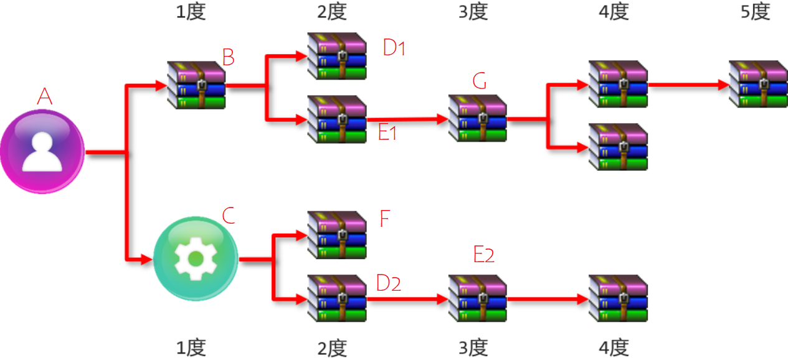
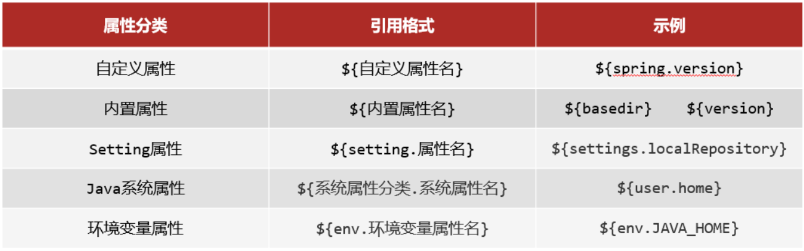

<!--#region
@author 吴钦飞
@email wuqinfei@qq.com
@create date 2025-08-01 20:46:46
@modify date 2025-08-01 22:36:25
@desc [description]
#endregion-->

# ssm - Maven 高级

## 1. 分模块开发

目录:

```text
01-maven-app/
  src/main/java/org/example/App.java
  pom.xml

02-maven-app-user/
  src/main/java/org/example/domain/User.java
  pom.xml
```

步骤

(1) 安装 02-maven-app-user 到本地仓库

(2) 01-maven-app 的 pom.xml 声明 02-maven-app-user 的坐标

(3) 在 App.java 直接使用 User.java

## 2. 依赖管理

一个项目可以设置多个依赖，格式为:

```xml
<!--设置当前项目所依赖的所有jar-->
<dependencies>
    <!--设置具体的依赖-->
    <dependency>
        <!--依赖所属群组id-->
        <groupId>org.springframework</groupId>
        <!--依赖所属项目id-->
        <artifactId>spring-webmvc</artifactId>
        <!--依赖版本号-->
        <version>5.2.10.RELEASE</version>
    </dependency>
</dependencies>
```

### 2.1. 依赖传递与冲突问题



说明:

* A 代表自己的项目；
* B,C,D,E,F,G 代表的是项目所依赖的 jar 包；
* D1和D2 E1和E2 代表是相同 jar 包的不同版本

(1) A 依赖了 B 和 C, B 和 C 又分别依赖了其他 jar 包，所以在 A 项目中就可以使用上面所有 jar 包，这就是所说的依赖传递

(2) 依赖传递有直接依赖和间接依赖

* 相对于 A 来说，A 直接依赖 B 和 C,间接依赖了 D1, E1, G，F, D2 和 E2
* 相对于 B 来说，B 直接依赖了 D1 和 E1, 间接依赖了 G
* 直接依赖和间接依赖是一个相对的概念

(3) 因为有依赖传递的存在，就会导致 jar 包在依赖的过程中出现冲突问题，具体什么是冲突? Maven 是如何解决冲突的?

这里所说的 依赖冲突 是指项目依赖的某一个 jar 包，有多个不同的版本，因而造成类包版本冲突。


特殊优先：当同级配置了相同资源的不同版本，后配置的覆盖先配置的。

路径优先：当依赖中出现相同的资源时，层级越深，优先级越低，层级越浅，优先级越高
* A 通过 B 间接依赖到 E1
* A 通过 C 间接依赖到 E2
* A 就会间接依赖到 E1 和 E2, Maven 会按照层级来选择，E1 是 2 度，E2 是 3 度，所以最终会选择 E1

声明优先：当资源在相同层级被依赖时，配置顺序靠前的覆盖配置顺序靠后的
* A 通过 B 间接依赖到 D1
* A 通过 C 间接依赖到 D2
* D1 和 D2 都是两度，这个时候就不能按照层级来选择，需要按照声明来，谁先声明用谁，也就是说 B 在 C 之前声明，这个时候使用的是 D1，反之则为 D2

但是对应上面这些结果，大家不需要刻意去记它。因为不管 Maven 怎么选，最终的结果都会在 Maven 的 `Dependencies` 面板中展示出来，展示的是哪个版本，也就是说它选择的就是哪个版本

### 2.2. 可选依赖和排除依赖

可选依赖指对外隐藏当前所依赖的资源 --- 不透明

```xml
<dependency>
    <groupId>com.itheima</groupId>
    <artifactId>maven_03_pojo</artifactId>
    <version>1.0-SNAPSHOT</version>
    <!--可选依赖是隐藏当前工程所依赖的资源，隐藏后对应资源将不具有依赖传递-->
    <optional>true</optional>
</dependency>
```

排除依赖指主动断开依赖的资源，被排除的资源无需指定版本 --- 不需要

```xml
<dependency>
    <groupId>com.itheima</groupId>
    <artifactId>maven_04_dao</artifactId>
    <version>1.0-SNAPSHOT</version>
    <!--排除依赖是隐藏当前资源对应的依赖关系-->
    <exclusions>
        <exclusion>
            <groupId>log4j</groupId>
            <artifactId>log4j</artifactId>
        </exclusion>
        <exclusion>
            <groupId>org.mybatis</groupId>
            <artifactId>mybatis</artifactId>
        </exclusion>
    </exclusions>
</dependency>
```

## 3. 聚合和继承

### 3.1. 聚合

聚合: 将多个模块组织成一个整体，同时进行项目构建的过程称为聚合

聚合工程：

* 通常是一个不具有业务功能的"空"工程（有且仅有一个 pom 文件）
* 聚合工程主要是用来管理项目
* 聚合工程管理的项目在进行运行的时候，会按照项目与项目之间的依赖关系来自动决定执行的顺序和配置的顺序无关。

作用：

* 使用聚合工程可以将多个工程编组，通过对聚合工程进行构建，实现对所包含的模块进行同步构建
* 当 聚合工程 的`compile`被点击后，所有被其管理的项目都会被执行编译操作。

当工程中某个模块发生更新（变更）时，必须保障工程中与已更新模块关联的模块同步更新，此时可以使用聚合工程来解决批量模块同步构建的问题。

创建聚合工程的步骤：

1. 创建一个空的 maven 项目（只有 pom.xml 文件）
2. pom.xml: 将项目的打包方式改为 pom
3. pom.xml: 添加所要管理的项目

示例:

```xml
<?xml version="1.0" encoding="UTF-8"?>
<project xmlns="http://maven.apache.org/POM/4.0.0"
         xmlns:xsi="http://www.w3.org/2001/XMLSchema-instance"
         xsi:schemaLocation="http://maven.apache.org/POM/4.0.0 http://maven.apache.org/xsd/maven-4.0.0.xsd">
    <modelVersion>4.0.0</modelVersion>

    <groupId>org.example</groupId>
    <artifactId>01-maven-app</artifactId>
    <version>1.0-SNAPSHOT</version>

    <!-- 将项目的打包方式改为 pom -->
    <packaging>pom</packaging>
    
    <!-- 设置管理的模块名称 -->
    <modules>
      <module>../02-maven-app-user</module>
      <module>../03-maven-app-dept</module>
    </modules>
</project>
```

### 3.2. 继承

继承: 描述的是两个工程间的关系，与 java 中的继承相似，子工程可以继承父工程中的配置信息，常见于依赖关系的继承。

作用：

* 简化配置
* 减少版本冲突

继承的步骤：

1. 创建一个空的 maven 项目（只有 pom.xml 文件）
   * 实际开发中，聚合和继承一般也都放在同一个项目中，但是这两个的功能是不一样的。
2. 在子项目中设置其父工程
3. 管理子项目中所有的依赖
   * 公共依赖
   * 可选依赖

父工程 01-maven-app:

```xml
<project xmlns="http://maven.apache.org/POM/4.0.0" xmlns:xsi="http://www.w3.org/2001/XMLSchema-instance"
  xsi:schemaLocation="http://maven.apache.org/POM/4.0.0 http://maven.apache.org/xsd/maven-4.0.0.xsd">
  <modelVersion>4.0.0</modelVersion>

  <groupId>org.example</groupId>
  <artifactId>01-maven-app</artifactId>
  <version>1.0-SNAPSHOT</version>

  <packaging>pom</packaging>

  <!--设置管理的模块名称-->
  <modules>
    <module>../02-maven-app-user</module>
    <module>../03-maven-app-dept</module>
  </modules>

  <!-- 所有子工程都有的依赖 -->
  <dependencies>
    <dependency>
      <groupId>junit</groupId>
      <artifactId>junit</artifactId>
      <version>3.8.1</version>
      <scope>test</scope>
    </dependency>
  </dependencies>

  <!--
    配置可供子项目选择的jar包依赖
    子工程在自己的 pom.xml 中声明时，不需要再指定版本
  -->
  <dependencyManagement>
    <dependencies>
      <dependency>
        <groupId>com.fasterxml.jackson.core</groupId>
        <artifactId>jackson-databind</artifactId>
        <version>2.9.0</version>
      </dependency>
    </dependencies>
  </dependencyManagement>

</project>
```


子工程 02-maven-app-user:

```xml
<project xmlns="http://maven.apache.org/POM/4.0.0" xmlns:xsi="http://www.w3.org/2001/XMLSchema-instance"
  xsi:schemaLocation="http://maven.apache.org/POM/4.0.0 http://maven.apache.org/xsd/maven-4.0.0.xsd">
  <modelVersion>4.0.0</modelVersion>

  <groupId>org.example</groupId>
  <artifactId>02-maven-app-user</artifactId>
  <version>1.0-SNAPSHOT</version>

  <packaging>jar</packaging>

  <!--配置当前工程继承自parent工程-->
  <parent>
    <groupId>org.example</groupId>
    <artifactId>01-maven-app</artifactId>
    <version>1.0-SNAPSHOT</version>
    <relativePath>../01-maven-app/pom.xml</relativePath>
  </parent>

  <dependencies>
    <!-- 子工程使用这个依赖，不需要指定版本 -->
    <dependency>
      <groupId>com.fasterxml.jackson.core</groupId>
      <artifactId>jackson-databind</artifactId>
    </dependency>
  </dependencies>
</project>
```

子工程 03-maven-app-dept:

```xml
<project xmlns="http://maven.apache.org/POM/4.0.0" xmlns:xsi="http://www.w3.org/2001/XMLSchema-instance"
  xsi:schemaLocation="http://maven.apache.org/POM/4.0.0 http://maven.apache.org/xsd/maven-4.0.0.xsd">
  <modelVersion>4.0.0</modelVersion>

  <groupId>org.example</groupId>
  <artifactId>03-maven-app-dept</artifactId>
  <version>1.0-SNAPSHOT</version>
  <packaging>jar</packaging>

  <!--配置当前工程继承自parent工程-->
  <parent>
    <groupId>org.example</groupId>
    <artifactId>01-maven-app</artifactId>
    <version>1.0-SNAPSHOT</version>
    <relativePath>../01-maven-app/pom.xml</relativePath>
  </parent>

</project>
```

总结来说，继承可以帮助做两件事

* 将所有项目公共的 jar 包依赖提取到父工程的 pom.xml 中，子项目就可以不用重复编写，简化开发
* 将所有项目的 jar 包配置到父工程的 `dependencyManagement` 标签下，实现版本管理，方便维护
   * `dependencyManagement` 标签不真正引入 jar 包，只是管理 jar 包的版本
   * 子项目在引入的时候，只需要指定 groupId 和 artifactId ，不需要加 version
   * 当 `dependencyManagement` 标签中 jar 包版本发生变化，所有子项目中有用到该 jar 包的地方对应的版本会自动随之更新

最后总结一句话就是， **父工程主要是用来快速配置依赖 jar 包和管理项目中所使用的资源** 。 


注意事项:

1. 子工程中使用父工程中的可选依赖时，仅需要提供群组 id 和项目 id，无需提供版本，版本由父工程统一提供，避免版本冲突
2. 子工程中还可以定义父工程中没有定义的依赖关系, 只不过不能被父工程进行版本统一管理。

### 3.3. 聚合与继承的区别

两种之间的作用:

* 聚合用于快速构建项目，对项目进行管理
* 继承用于快速配置和管理子项目中所使用jar包的版本

聚合和继承的相同点:

* 聚合与继承的pom.xml文件打包方式均为pom，可以将两种关系制作到同一个pom文件中
* 聚合与继承均属于设计型模块，并无实际的模块内容

聚合和继承的不同点:

* 聚合是在当前模块中配置关系，聚合可以感知到参与聚合的模块有哪些
* 继承是在子模块中配置关系，父模块无法感知哪些子模块继承了自己

## 4. 属性

### 4.1. 自定义属性

通过 属性（变量）抽取依赖的版本号

父级项目:

```xml
<project>

  <groupId>org.example</groupId>
  <artifactId>01-maven-app</artifactId>
  <version>1.0-SNAPSHOT</version>

  <packaging>pom</packaging>

  <!-- 定义属性 -->
  <properties>
    <junit.version>3.8.1</junit.version>
  </properties>

  <!-- 使用属性 -->
  <dependencies>
    <dependency>
      <groupId>junit</groupId>
      <artifactId>junit</artifactId>
      <!-- 使用属性 -->
      <version>${junit.version}</version>
      <scope>test</scope>
    </dependency>
  </dependencies>
</project>
```

### 4.2. 配置文件加载属性

让 `src\main\resources` 目录下的配置文件（如 jdbc.properties）可以读取到 pom.xml 文件中定义的属性

步骤 1: 父工程定义属性

```xml
<properties>
   <jdbc.url>jdbc:mysql://127.1.1.1:3306/ssm_db</jdbc.url>
</properties>
```

步骤 2: jdbc.properties 文件中引用属性

```properties
jdbc.url=${jdbc.url}
```

步骤 3: 设置 maven 过滤文件范围

```xml
<build>
    <resources>
    <!--
			${project.basedir}: 当前项目所在目录,子项目继承了父项目，
			相当于所有的子项目都添加了资源目录的过滤
		-->
        <resource>
            <directory>${project.basedir}/src/main/resources</directory>
            <filtering>true</filtering>
        </resource>
    </resources>
</build>
```

### 4.3. 打 war 包报错

如果项目中没有 web.xml 则会报错。

解决方案 1：在项目的 `src\main\webapp\WEB-INF\` 添加一个空的 web.xml 文件

解决方案 2: 配置 maven 打包 war 时，忽略 web.xml 检查

```xml
<build>
    <plugins>
        <plugin>
            <groupId>org.apache.maven.plugins</groupId>
            <artifactId>maven-war-plugin</artifactId>
            <version>3.2.3</version>
            <configuration>
                <failOnMissingWebXml>false</failOnMissingWebXml>
            </configuration>
        </plugin>
    </plugins>
</build>
```

### 4.4. 系统属性

在 Maven 中的属性分为:

* 自定义属性（常用）
* 内置属性
* Setting属性
* Java系统属性
* 环境变量属性



在 cmd 命令行中输入 `mvn help:system` 查看这些属性


具体使用，就是使用 `${key}`来获取，key 为等号左边的，值为等号右边的

比如获取红线的值，对应的写法为 `${java.runtime.name}`。