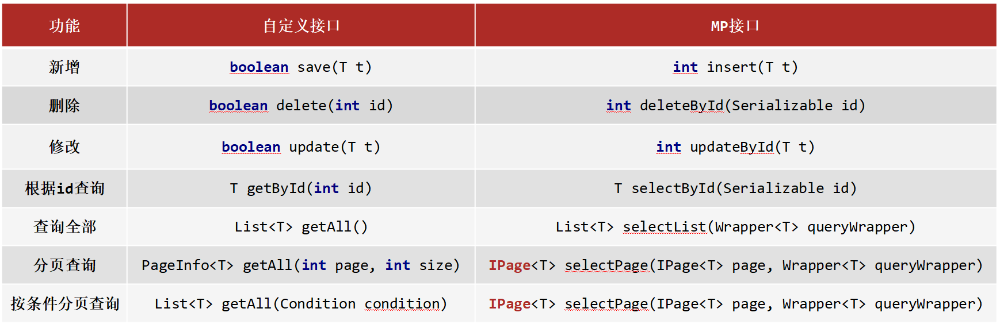

<!--#region
@author 吴钦飞
@email wuqinfei@qq.com
@create date 2025-08-08 20:06:14
@modify date 2025-08-09 09:33:59
@desc [description]
#endregion-->

# ssm - mybatis-plus

## 1. MyBatisPlus 入门案例与简介

### 1.1. MybatisPlus 简介

MyBatisPlus（简称 MP）是基于 MyBatis 框架基础上开发的增强型工具，旨在 简化开发、提高效率

MyBatisPlus的官网为: https://mp.baomidou.com/

### 1.2. MybatisPlus 入门案例

建表:

```sql
create database if not exists mybatisplus_db;

use mybatisplus_db;

CREATE TABLE user (
    id bigint(20) primary key auto_increment,
    name varchar(32) not null,
    password  varchar(32) not null,
    age int(3) not null ,
    tel varchar(32) not null
);

insert into user values(1,'Tom','tom',3,'18866668888');
insert into user values(2,'Jerry','jerry',4,'16688886666');
insert into user values(3,'Jock','123456',41,'18812345678');
insert into user values(4,'传智播客','itcast',15,'4006184000');
```

pom.xml:

```xml
<?xml version="1.0" encoding="UTF-8"?>
<project xmlns="http://maven.apache.org/POM/4.0.0" xmlns:xsi="http://www.w3.org/2001/XMLSchema-instance"
         xsi:schemaLocation="http://maven.apache.org/POM/4.0.0 https://maven.apache.org/xsd/maven-4.0.0.xsd">
    <modelVersion>4.0.0</modelVersion>
    <groupId>org.example</groupId>
    <artifactId>mybatis-plus-01-quickstart</artifactId>
    <version>0.0.1-SNAPSHOT</version>

    <parent>
        <groupId>org.springframework.boot</groupId>
        <artifactId>spring-boot-starter-parent</artifactId>
        <version>2.5.0</version>
    </parent>

    <!--JDK 的版本-->
    <properties>
        <java.version>8</java.version>
    </properties>

    <dependencies>
        <dependency>
            <groupId>org.springframework.boot</groupId>
            <artifactId>spring-boot-starter</artifactId>
        </dependency>

        <dependency>
            <groupId>mysql</groupId>
            <artifactId>mysql-connector-java</artifactId>
            <scope>runtime</scope>
        </dependency>

        <dependency>
            <groupId>com.baomidou</groupId>
            <artifactId>mybatis-plus-boot-starter</artifactId>
            <version>3.4.1</version>
        </dependency>

        <dependency>
            <groupId>com.alibaba</groupId>
            <artifactId>druid</artifactId>
            <version>1.1.16</version>
        </dependency>

        <dependency>
            <groupId>org.springframework.boot</groupId>
            <artifactId>spring-boot-starter-test</artifactId>
            <scope>test</scope>
        </dependency>
    </dependencies>

    <build>
        <plugins>
            <plugin>
                <groupId>org.springframework.boot</groupId>
                <artifactId>spring-boot-maven-plugin</artifactId>
            </plugin>
        </plugins>
    </build>

</project>
```

application.yml:

```yml
spring:
  datasource:
    type: com.alibaba.druid.pool.DruidDataSource
    driver-class-name: com.mysql.cj.jdbc.Driver
    url: jdbc:mysql://localhost:3306/mybatisplus_db?serverTimezone=UTC
    username: root
    password: 123456
```

domain 和 dao:

```java
package org.example.domain;
public class User {
    private Long id;
    private String name;
    private String password;
    private Integer age;
    private String tel;
    // ...
}


package org.example.dao;
@Mapper
public interface UserDao extends BaseMapper<User> {
}
```

测试:

```java
@SpringBootTest
class MybatisPlus01QuickstartApplicationTests {
    @Autowired
    private UserDao userDao;

    @Test
    public void testGetAll() {
        List<User> userList = userDao.selectList(null);
        userList.forEach(System.out::println);
    }
}
```

## 2. 标准数据层开发

### 2.1. 标准 CRUD 使用



### 2.2. 新增

方法:

```java
int insert (T t)
```

说明:

* 返回值，新增成功后返回 `1` ，没有新增成功返回的是 `0`

### 2.3. 删除

方法:

```java
int deleteById (Serializable id)
```

说明:

* `String` 和 `Number` 是 `Serializable` 的子类
* `Number` 又是 `Float` , `Double` , `Integer` 等类的父类
* MP 使用 `Serializable` 作为参数类型，就好比我们可以用 `Object` 接收任何数据类型一样。
* 返回值类型，数据删除成功返回 `1` ，未删除数据返回 `0`

### 2.4. 修改

方法:

```java
int updateById(T t);
```

说明:

* 因为是根据ID进行修改，所以传入的对象中需要有ID属性值
* 非全量修改，只修改实体对象中非 null 的属性
* 返回值类型，数据删除成功返回 `1` ，未删除数据返回 `0`

### 2.5. 根据 ID 查询

方法:

```java
T selectById (Serializable id)
```

### 2.6. 查询所有

方法:

```java
List<T> selectList(Wrapper<T> queryWrapper)
```

说明:

* `Wrapper`: 用来构建条件查询的条件，目前我们没有可直接传为 `null`
* `List<T>`: 因为查询的是所有，所以返回的数据是一个集合

### 2.7. Lombok

说明:

* Lombok ，一个 Java 类库，提供了一组注解，简化 POJO 实体类开发。

坐标:

```xml
<dependency>
    <groupId>org.projectlombok</groupId>
    <artifactId>lombok</artifactId>
    <!-- 版本可以不用写，因为 SpringBoot 中已经管理了 lombok的版本。 -->
    <!-- <version>1.18.12</version> -->
</dependency>
```

Lombok 常见的注解有:

* `@NoArgsConstructor`: 提供一个无参构造函数
* `@AllArgsConstructor`: 提供一个包含所有参数的构造函数
* `@Data`: 是个组合注解，包含如下注解的功能
   * `@Setter`: 为模型类的属性提供 setter 方法
   * `@Getter`: 为模型类的属性提供 getter 方法
   * `@ToString`: 为模型类的属性提供 toString 方法
   * `@EqualsAndHashCode`: 为模型类的属性提供 equal s和 hashcode 方法

### 2.8. 分页功能

方法:

```java
IPage<T> selectPage(IPage<T> page, Wrapper<T> queryWrapper)
```

说明:

* `IPage`: 用来构建分页查询条件
* `Wrapper`: 用来构建条件查询的条件，目前我们没有可直接传为 null
* `IPage`: 返回值，你会发现构建分页条件和方法的返回值都是 `IPage`

示例：

```java
//分页查询
@Test
void testSelectPage(){
    //1 创建IPage分页对象,设置分页参数,1为当前页码，3为每页显示的记录数
    IPage<User> page=new Page<>(1,3);
    //2 执行分页查询
    userDao.selectPage(page,null);
    //3 获取分页结果
    System.out.println("当前页码值："+page.getCurrent());
    System.out.println("每页显示数："+page.getSize());
    System.out.println("一共多少页："+page.getPages());
    System.out.println("一共多少条数据："+page.getTotal());

    System.out.println("数据：");
    page.getRecords().forEach(System.out::println);
}
```

#### 2.8.1. 开启分页功能

(1) 设置分页拦截器

```java
package org.example.config;

@Configuration
public class MybatisPlusConfig {
    @Bean
    public MybatisPlusInterceptor mybatisPlusInterceptor(){
        //1 创建MybatisPlusInterceptor拦截器对象
        MybatisPlusInterceptor mpInterceptor=new MybatisPlusInterceptor();
        //2 添加分页拦截器
        mpInterceptor.addInnerInterceptor(new PaginationInnerInterceptor());
        return mpInterceptor;
    }
}
```

(2) 打开日志（可选）

```yml
mybatis-plus:
  configuration:
    # 打印SQL日志到控制台
    log-impl: org.apache.ibatis.logging.stdout.StdOutImpl
```

## 3. DQL 编程控制

内容:

* 条件查询方式
* 查询投影
* 查询条件设定
* 字段映射与表名映射

### 3.1. 条件查询

#### 3.1.1. 构建条件查询

示例:

```java
// 方式 1: QueryWrapper
QueryWrapper<User> qw = new QueryWrapper<>();

qw.lt("age",18);

List<User> userList = userDao.selectList(qw);


// 方式 2: QueryWrapper + lambda
QueryWrapper<User> qw = new QueryWrapper<>();

qw.lambda().lt(User::getAge,18);

List<User> userList = userDao.selectList(qw);


// 方式 3: LambdaQueryWrapper
LambdaQueryWrapper<User> lqw = new LambdaQueryWrapper<>();

lqw.lt(User::getAge,18);

List<User> userList = userDao.selectList(lqw);
```

#### 3.1.2. 关闭 SpringBoot、MybatisPlus 的启动 banner

application.yml:

```yml
spring:
  datasource:
    type: com.alibaba.druid.pool.DruidDataSource
    driver-class-name: com.mysql.cj.jdbc.Driver
    url: jdbc:mysql://localhost:3306/mybatisplus_db?serverTimezone=UTC
    username: root
    password: 123456
  main:
    # 关闭 SpringBoot 的启动 banner
    banner-mode: off


mybatis-plus:
  configuration:
    # 打印SQL日志到控制台
    log-impl: org.apache.ibatis.logging.stdout.StdOutImpl
  global-config:
    # 关闭 MybatisPlus 的启动 banner
    banner: false
```

#### 3.1.3. 取消初始化 spring 日志打印

resources/logback.xml:

```xml
<?xml version="1.0" encoding="UTF-8"?>
<configuration>
</configuration>
```

#### 3.1.4. 多条件构建

```java
LambdaQueryWrapper<User> lqw = new LambdaQueryWrapper<>();

// and
// WHERE (age > ? AND age < ?)
lqw.gt(User::getAge,18).lt(User::getAge, 60);

// or
// WHERE (age < ? OR age > ?)
lqw.lt(User::getAge,18).or().gt(User::getAge, 60);

List<User> userList = userDao.selectList(lqw);
```

#### 3.1.5. 条件查询 null 值判定

满足条件才拼接语句:

```java
package org.example.domain.query;
@Data
public class UserQuery extends User { // 专门用于封装前端传过来的条件
    private Integer minAge;
    private Integer maxAge;
}

LambdaQueryWrapper<User> lqw = new LambdaQueryWrapper<>();

UserQuery userQuery = new UserQuery();
userQuery.setMinAge(18);
userQuery.setMaxAge(60);

lqw.gt(userQuery.getMinAge() != null, User::getAge, userQuery.getMinAge());
lqw.lt(userQuery.getMaxAge() != null, User::getAge, userQuery.getMaxAge());

List<User> userList = userDao.selectList(lqw);
```