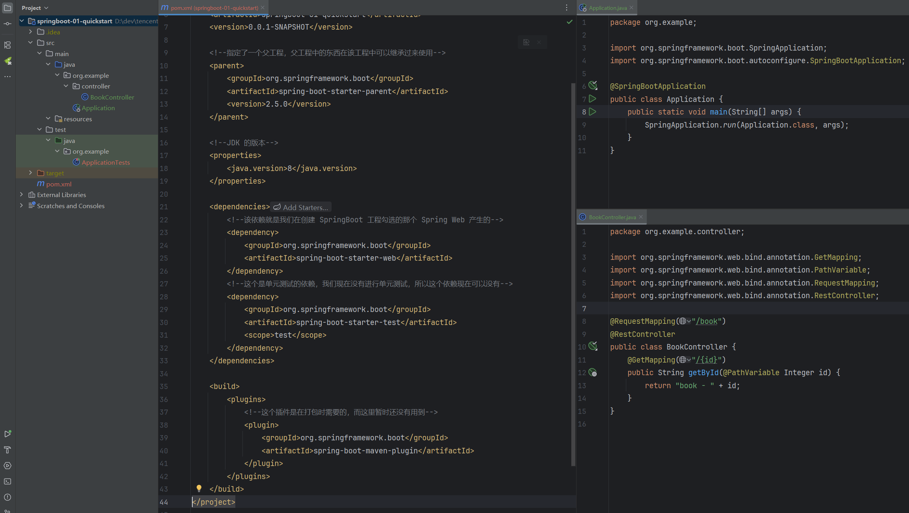

<!--#region
@author 吴钦飞
@email wuqinfei@qq.com
@create date 2025-08-04 19:48:09
@modify date 2025-08-04 21:08:48
@desc [description]
#endregion-->

# ssm - SpringBoot

## 1. SpringBoot 简介

`SpringBoot` 是由 `Pivotal` 团队提供的全新框架，其设计目的是用来 简化 `Spring` 应用的初始搭建以及开发过程。

### 1.1. SpringBoot 快速入门



pom.xml:

```xml
<?xml version="1.0" encoding="UTF-8"?>
<project xmlns="http://maven.apache.org/POM/4.0.0" xmlns:xsi="http://www.w3.org/2001/XMLSchema-instance"
         xsi:schemaLocation="http://maven.apache.org/POM/4.0.0 https://maven.apache.org/xsd/maven-4.0.0.xsd">
    <modelVersion>4.0.0</modelVersion>
    <groupId>org.example</groupId>
    <artifactId>springboot-01-quickstart</artifactId>
    <version>0.0.1-SNAPSHOT</version>

    <!--指定了一个父工程，父工程中的东西在该工程中可以继承过来使用-->
    <parent>
        <groupId>org.springframework.boot</groupId>
        <artifactId>spring-boot-starter-parent</artifactId>
        <version>2.5.0</version>
    </parent>

    <!--JDK 的版本-->
    <properties>
        <java.version>8</java.version>
    </properties>

    <dependencies>
        <!--该依赖就是我们在创建 SpringBoot 工程勾选的那个 Spring Web 产生的-->
        <dependency>
            <groupId>org.springframework.boot</groupId>
            <artifactId>spring-boot-starter-web</artifactId>
        </dependency>
        <!--这个是单元测试的依赖，我们现在没有进行单元测试，所以这个依赖现在可以没有-->
        <dependency>
            <groupId>org.springframework.boot</groupId>
            <artifactId>spring-boot-starter-test</artifactId>
            <scope>test</scope>
        </dependency>
    </dependencies>

    <build>
        <plugins>
            <!--这个插件是在打包时需要的，而这里暂时还没有用到-->
            <plugin>
                <groupId>org.springframework.boot</groupId>
                <artifactId>spring-boot-maven-plugin</artifactId>
            </plugin>
        </plugins>
    </build>
</project>
```

Application.java:

```java
@SpringBootApplication
public class Application {
    public static void main(String[] args) {
        SpringApplication.run(Application.class, args);
    }
}
```

访问:

```http
GET http://localhost:8080/books/2
```

### 1.2. SpringBoot 工程快速启动

由于我们在构建 `SpringBoot` 工程时已经在 `pom.xml` 中配置了如下插件

```xml
<plugin>
    <groupId>org.springframework.boot</groupId>
    <artifactId>spring-boot-maven-plugin</artifactId>
</plugin>
```

所以我们只需要使用 `Maven` 的 `package` 指令打包就会在 `target` 目录下生成对应的 `Jar` 包。

注意：该插件必须配置，不然打好的 `jar` 包也是有问题的。

进入 `jar` 包所在位置，在 `命令提示符` 中输入如下命令，即可启动项目

```shell
jar -jar springboot_01_quickstart-0.0.1-SNAPSHOT.jar
```

### 1.3. SpringBoot 概述

`SpringBoot` 是由 Pivotal 团队提供的全新框架，其设计目的是用来 简化 Spring 应用的初始搭建以及开发过程。

大家已经感受了 `SpringBoot` 程序，回过头看看 `SpringBoot` 主要作用是什么，就是简化 `Spring` 的搭建过程和开发过程。

原始 `Spring` 环境搭建和开发存在以下问题：

* 配置繁琐
* 依赖设置繁琐

`SpringBoot` 程序优点恰巧就是针对 `Spring` 的缺点

* 自动配置。这个是用来解决 `Spring` 程序配置繁琐的问题
* 起步依赖。这个是用来解决 `Spring` 程序依赖设置繁琐的问题
* 辅助功能（内置服务器,...）。
   * 我们在启动 `SpringBoot` 程序时既没有使用本地的 `tomcat` 也没有使用 `tomcat` 插件，而是使用 `SpringBoot` 内置的服务器。

接下来我们来说一下 `SpringBoot` 的起步依赖

```xml
  <parent>
      <groupId>org.springframework.boot</groupId>
      <artifactId>spring-boot-starter-parent</artifactId>
      <version>2.5.0</version>
  </parent>

spring-boot-starter-parent 依赖

  <parent>
    <groupId>org.springframework.boot</groupId>
    <artifactId>spring-boot-dependencies</artifactId>
    <version>2.5.0</version>
  </parent>

spring-boot-dependencies 里配置了“所有”技术的坐标及版本
```

```xml
    <dependencies>
        <!--该依赖就是我们在创建 SpringBoot 工程勾选的那个 Spring Web 产生的-->
        <dependency>
            <groupId>org.springframework.boot</groupId>
            <artifactId>spring-boot-starter-web</artifactId>
        </dependency>
    </dependencies>

spring-boot-starter-web 配置了 web 技术涉及的依赖坐标
```

**starter**

* `SpringBoot` 中常见项目名称，定义了当前项目使用的所有项目坐标，以达到减少依赖配置的目的

**parent**

* 所有 `SpringBoot` 项目要继承的项目，定义了若干个坐标版本号（依赖管理，而非依赖），以达到减少依赖冲突的目的
* `spring-boot-starter-parent`（2.5.0）与 `spring-boot-starter-parent`（2.4.6）共计57处坐标版本不同

**实际开发**

* 使用任意坐标时，仅书写 GAV 中的 G 和 A，V 由 SpringBoot 提供
   * G：groupid
   * A：artifactId
   * V：version

* 如发生坐标错误，再指定version（要小心版本冲突）