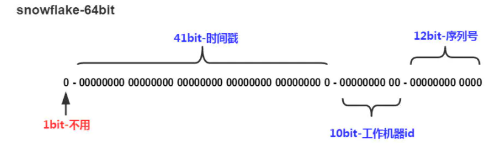

<!--#region
@author 吴钦飞
@email wuqinfei@qq.com
@create date 2025-08-08 20:06:14
@modify date 2025-10-15 22:58:01
@desc [description]
#endregion-->

# ssm - mybatis-plus

## 1. MyBatisPlus 入门案例与简介

### 1.1. MybatisPlus 简介

MyBatisPlus（简称 MP）是基于 MyBatis 框架基础上开发的增强型工具，旨在 简化开发、提高效率

MyBatisPlus的官网为: https://mp.baomidou.com/

### 1.2. MybatisPlus 入门案例

建表:

```sql
create database if not exists mybatisplus_db;

use mybatisplus_db;

CREATE TABLE user (
    id bigint(20) primary key auto_increment,
    name varchar(32) not null,
    password  varchar(32) not null,
    age int(3) not null ,
    tel varchar(32) not null
);

insert into user values(1,'Tom','tom',3,'18866668888');
insert into user values(2,'Jerry','jerry',4,'16688886666');
insert into user values(3,'Jock','123456',41,'18812345678');
insert into user values(4,'传智播客','itcast',15,'4006184000');
```

pom.xml:

```xml
<?xml version="1.0" encoding="UTF-8"?>
<project xmlns="http://maven.apache.org/POM/4.0.0" xmlns:xsi="http://www.w3.org/2001/XMLSchema-instance"
         xsi:schemaLocation="http://maven.apache.org/POM/4.0.0 https://maven.apache.org/xsd/maven-4.0.0.xsd">
    <modelVersion>4.0.0</modelVersion>
    <groupId>org.example</groupId>
    <artifactId>mybatis-plus-01-quickstart</artifactId>
    <version>0.0.1-SNAPSHOT</version>

    <parent>
        <groupId>org.springframework.boot</groupId>
        <artifactId>spring-boot-starter-parent</artifactId>
        <version>2.5.0</version>
    </parent>

    <!--JDK 的版本-->
    <properties>
        <java.version>8</java.version>
    </properties>

    <dependencies>
        <dependency>
            <groupId>org.springframework.boot</groupId>
            <artifactId>spring-boot-starter</artifactId>
        </dependency>

        <dependency>
            <groupId>mysql</groupId>
            <artifactId>mysql-connector-java</artifactId>
            <scope>runtime</scope>
        </dependency>

        <dependency>
            <groupId>com.baomidou</groupId>
            <artifactId>mybatis-plus-boot-starter</artifactId>
            <version>3.4.1</version>
        </dependency>

        <dependency>
            <groupId>com.alibaba</groupId>
            <artifactId>druid</artifactId>
            <version>1.1.16</version>
        </dependency>

        <dependency>
            <groupId>org.springframework.boot</groupId>
            <artifactId>spring-boot-starter-test</artifactId>
            <scope>test</scope>
        </dependency>
    </dependencies>

    <build>
        <plugins>
            <plugin>
                <groupId>org.springframework.boot</groupId>
                <artifactId>spring-boot-maven-plugin</artifactId>
            </plugin>
        </plugins>
    </build>

</project>
```

application.yml:

```yml
spring:
  datasource:
    type: com.alibaba.druid.pool.DruidDataSource
    driver-class-name: com.mysql.cj.jdbc.Driver
    url: jdbc:mysql://localhost:3306/mybatisplus_db?serverTimezone=UTC
    username: root
    password: 123456
```

domain 和 dao:

```java
package org.example.domain;
public class User {
    private Long id;
    private String name;
    private String password;
    private Integer age;
    private String tel;
    // ...
}


package org.example.dao;
@Mapper
public interface UserDao extends BaseMapper<User> {
}
```

测试:

```java
@SpringBootTest
class MybatisPlus01QuickstartApplicationTests {
    @Autowired
    private UserDao userDao;

    @Test
    public void testGetAll() {
        List<User> userList = userDao.selectList(null);
        userList.forEach(System.out::println);
    }
}
```

## 2. 标准数据层开发

### 2.1. 标准 CRUD 使用


### 2.2. 新增

方法:

```java
int insert (T t)
```

说明:

* 返回值，新增成功后返回 `1` ，没有新增成功返回的是 `0`

### 2.3. 删除

方法:

```java
int deleteById (Serializable id)
```

说明:

* `String` 和 `Number` 是 `Serializable` 的子类
* `Number` 又是 `Float` , `Double` , `Integer` 等类的父类
* MP 使用 `Serializable` 作为参数类型，就好比我们可以用 `Object` 接收任何数据类型一样。
* 返回值类型，数据删除成功返回 `1` ，未删除数据返回 `0`

### 2.4. 修改

方法:

```java
int updateById(T t);
```

说明:

* 因为是根据ID进行修改，所以传入的对象中需要有ID属性值
* 非全量修改，只修改实体对象中非 null 的属性
* 返回值类型，数据删除成功返回 `1` ，未删除数据返回 `0`

### 2.5. 根据 ID 查询

方法:

```java
T selectById (Serializable id)
```

### 2.6. 查询所有

方法:

```java
List<T> selectList(Wrapper<T> queryWrapper)
```

说明:

* `Wrapper`: 用来构建条件查询的条件，目前我们没有可直接传为 `null`
* `List<T>`: 因为查询的是所有，所以返回的数据是一个集合

### 2.7. Lombok

说明:

* Lombok ，一个 Java 类库，提供了一组注解，简化 POJO 实体类开发。

坐标:

```xml
<dependency>
    <groupId>org.projectlombok</groupId>
    <artifactId>lombok</artifactId>
    <!-- 版本可以不用写，因为 SpringBoot 中已经管理了 lombok的版本。 -->
    <!-- <version>1.18.12</version> -->
</dependency>
```

Lombok 常见的注解有:

* `@NoArgsConstructor`: 提供一个无参构造函数
* `@AllArgsConstructor`: 提供一个包含所有参数的构造函数
* `@Data`: 是个组合注解，包含如下注解的功能
   * `@Setter`: 为模型类的属性提供 setter 方法
   * `@Getter`: 为模型类的属性提供 getter 方法
   * `@ToString`: 为模型类的属性提供 toString 方法
   * `@EqualsAndHashCode`: 为模型类的属性提供 equal s和 hashcode 方法

### 2.8. 分页功能

方法:

```java
IPage<T> selectPage(IPage<T> page, Wrapper<T> queryWrapper)
```

说明:

* `IPage`: 用来构建分页查询条件
* `Wrapper`: 用来构建条件查询的条件，目前我们没有可直接传为 null
* `IPage`: 返回值，你会发现构建分页条件和方法的返回值都是 `IPage`

示例：

```java
//分页查询
@Test
void testSelectPage(){
    //1 创建IPage分页对象,设置分页参数,1为当前页码，3为每页显示的记录数
    // 页码从 1 开始，而非从 0 开始
    IPage<User> page=new Page<>(1,3);
    //2 执行分页查询
    userDao.selectPage(page,null);
    //3 获取分页结果
    System.out.println("当前页码值："+page.getCurrent());
    System.out.println("每页显示数："+page.getSize());
    System.out.println("一共多少页："+page.getPages());
    System.out.println("一共多少条数据："+page.getTotal());

    System.out.println("数据：");
    page.getRecords().forEach(System.out::println);
}
```

#### 2.8.1. 开启分页功能

(1) 设置分页拦截器

```java
package org.example.config;

@Configuration
public class MybatisPlusConfig {
    @Bean
    public MybatisPlusInterceptor mybatisPlusInterceptor(){
        //1 创建MybatisPlusInterceptor拦截器对象
        MybatisPlusInterceptor mpInterceptor=new MybatisPlusInterceptor();
        //2 添加分页拦截器
        mpInterceptor.addInnerInterceptor(new PaginationInnerInterceptor());
        return mpInterceptor;
    }
}
```

(2) 打开日志（可选）

```yml
mybatis-plus:
  configuration:
    # 打印SQL日志到控制台
    log-impl: org.apache.ibatis.logging.stdout.StdOutImpl
```

## 3. DQL 编程控制

内容:

* 条件查询方式
* 查询投影
* 查询条件设定
* 字段映射与表名映射

### 3.1. 条件查询

#### 3.1.1. 构建条件查询

示例:

```java
// 方式 1: QueryWrapper
QueryWrapper<User> qw = new QueryWrapper<>();

qw.lt("age",18);

List<User> userList = userDao.selectList(qw);


// 方式 2: QueryWrapper + lambda
QueryWrapper<User> qw = new QueryWrapper<>();

qw.lambda().lt(User::getAge,18);

List<User> userList = userDao.selectList(qw);


// 方式 3: LambdaQueryWrapper
LambdaQueryWrapper<User> lqw = new LambdaQueryWrapper<>();

lqw.lt(User::getAge,18);

List<User> userList = userDao.selectList(lqw);
```

#### 3.1.2. 关闭 SpringBoot、MybatisPlus 的启动 banner

application.yml:

```yml
spring:
  datasource:
    type: com.alibaba.druid.pool.DruidDataSource
    driver-class-name: com.mysql.cj.jdbc.Driver
    url: jdbc:mysql://localhost:3306/mybatisplus_db?serverTimezone=UTC
    username: root
    password: 123456
  main:
    # 关闭 SpringBoot 的启动 banner
    banner-mode: off


mybatis-plus:
  configuration:
    # 打印SQL日志到控制台
    log-impl: org.apache.ibatis.logging.stdout.StdOutImpl
  global-config:
    # 关闭 MybatisPlus 的启动 banner
    banner: false
```

#### 3.1.3. 取消初始化 spring 日志打印

resources/logback.xml:

```xml
<?xml version="1.0" encoding="UTF-8"?>
<configuration>
</configuration>
```

#### 3.1.4. 多条件构建

```java
LambdaQueryWrapper<User> lqw = new LambdaQueryWrapper<>();

// and
// WHERE (age > ? AND age < ?)
lqw.gt(User::getAge,18).lt(User::getAge, 60);

// or
// WHERE (age < ? OR age > ?)
lqw.lt(User::getAge,18).or().gt(User::getAge, 60);

List<User> userList = userDao.selectList(lqw);
```

#### 3.1.5. 条件查询 null 值判定

满足条件才拼接语句:

```java
package org.example.domain.query;
@Data
public class UserQuery extends User { // 专门用于封装前端传过来的条件
    private Integer minAge;
    private Integer maxAge;
}

LambdaQueryWrapper<User> lqw = new LambdaQueryWrapper<>();

UserQuery userQuery = new UserQuery();
userQuery.setMinAge(18);
userQuery.setMaxAge(60);

lqw.gt(userQuery.getMinAge() != null, User::getAge, userQuery.getMinAge());
lqw.lt(userQuery.getMaxAge() != null, User::getAge, userQuery.getMaxAge());

List<User> userList = userDao.selectList(lqw);
```

### 3.2. 查询投影

(1) 只查询部分字段的数据，未指定的字段为 null:

方式1:

```java
QueryWrapper<User> qw = new QueryWrapper<>();

// SELECT id,name FROM user
qw.select("id", "name");

List<User> userList = userDao.selectList(qw);
System.out.println(userList);
```

方式2:

```java
LambdaQueryWrapper<User> lqw = new LambdaQueryWrapper<>();

// SELECT id,name FROM user
lqw.select(User::getId, User::getName);

List<User> userList = userDao.selectList(lqw);
System.out.println(userList);
```

(2) 指定别名:

```java
QueryWrapper<User> qw = new QueryWrapper<>();

qw.select("count(*) as count");

List<Map<String, Object>> maps = userDao.selectMaps(qw);
System.out.println(maps); // [{count=4}]
```

### 3.3. 查询条件

等值查询:

* eq()： 相当于 `=`

范围查询:

* gt(): 大于(>)
* ge(): 大于等于(>=)
* lt(): 小于(<)
* lte(): 小于等于(<=)
* between(): between ? and ?

模糊查询:

* like(): 前后加百分号,如 %J%
* likeLeft(): 前面加百分号,如 %J
* likeRight(): 后面加百分号,如 J%

排序查询:

* groupBy(boolean condition, R... columns)
* orderByAsc(boolean condition, R... columns)
* orderByDesc(boolean condition, R... columns)

参考:

* [条件构造器](https://baomidou.com/guides/wrapper/)

### 3.4. 映射匹配兼容性

问题:

1. 表字段与编码属性设计不同步
2. 编码中添加了数据库中未定义的属性
3. 采用默认查询开放了更多的字段查看权限

示例:

```java
@Data

// 表名映射: 类名 -> 表名
@TableName("user")
public class UnMatchedUser {
    // 字段映射: 属性名 -> 字段名
    @TableField("id")
    private Long userId;

    private String name;

    // 该字段不在 select 字段列表中，也就是说查询时不查询该字段
    @TableField(select = false)
    private String password;

    private Integer age;
    private String tel;

    // 该字段不存在数据库表
    @TableField(exist = false)
    private Boolean online;
}
```

知识点 1： @TableField

| 名称     | @TableField                                                  |
| -------- | ------------------------------------------------------------ |
| 类型     | 属性注解                                                 |
| 位置     | 模型类属性定义上方                                           |
| 作用     | 设置当前属性对应的数据库表中的字段关系                       |
| 相关属性 | value(默认)：设置数据库表字段名称 <br/> exist:设置属性在数据库表字段中是否存在，默认为 true，此属性不能与 value 合并使用<br/> select:设置属性是否参与查询，此属性与select()映射配置不冲突 |


知识点2： @TableName

| 名称     | @TableName                    |
| -------- | ----------------------------- |
| 类型     | 类注解                    |
| 位置     | 模型类定义上方                |
| 作用     | 设置当前类对应于数据库表关系  |
| 相关属性 | value(默认)：设置数据库表名称 |

## 4. DML编程控制

### 4.1. id 生成策略控制

>新增时，ID自动生成策略

通过 `@TableId` 指定 主键属性 的 ID 生成策略

| 名称     | @TableId                                                     |
| -------- | ------------------------------------------------------------ |
| 类型     | 属性注解                                                 |
| 位置     | 模型类中用于表示主键的属性定义上方                           |
| 作用     | 设置当前类中主键属性的生成策略                               |
| 相关属性 | value(默认)：设置数据库表主键名称<br/> type:设置主键属性的生成策略，值查照 IdType 的枚举值 |

示例:

```java
@Data
@TableName("tbl_user")
public class User {
    // NONE: 不设置id生成策略
    @TableId(type = IdType.NONE) 
    private Long id;

    // ID 自增长。需要在数据库对应配置自增长
    @TableId(type = IdType.AUTO) 
    private Long id;


    // 手动输入。
    @TableId(type = IdType.INPUT) 
    private Long id;


    // 自动生成 64 位长整型数字或字符串。（通过雪花算法）
    @TableId(type = IdType.ASSIGN_ID) 
    private Long id;


    // UUID
    @TableId(type = IdType.ASSIGN_UUID) 
    private String id;
}
```

#### 4.1.1. 雪花算法

* SnowFlake
* 是 Twitter 官方给出的算法实现 是用 Scala写的。其生成的结果是一个 64bit 大小整数，它的结构如下图:



1. 1bit,不用,因为二进制中最高位是符号位，1表示负数，0表示正数。生成的id一般都是用整数，所以最高位固定为0。
2. 41bit-时间戳，用来记录时间戳，毫秒级
3. 10bit-工作机器id，用来记录工作机器id,其中高位5bit是数据中心ID其取值范围0-31，低位5bit是工作节点ID其取值范围0-31，两个组合起来最多可以容纳1024个节点
4. 序列号占用12bit，每个节点每毫秒0开始不断累加，最多可以累加到4095，一共可以产生4096个ID

#### 4.1.2. ID 生成策略对比

介绍了这些主键ID的生成策略，我们以后该用哪个呢?

* NONE: 不设置id生成策略，MP不自动生成，约等于INPUT,所以这两种方式都需要用户手动设置，但是手动设置第一个问题是容易出现相同的ID造成主键冲突，为了保证主键不冲突就需要做很多判定，实现起来比较复杂
* AUTO:数据库ID自增,这种策略适合在数据库服务器只有1台的情况下使用,不可作为分布式ID使用
* ASSIGN_UUID:可以在分布式的情况下使用，而且能够保证唯一，但是生成的主键是32位的字符串，长度过长占用空间而且还不能排序，查询性能也慢
* ASSIGN_ID:可以在分布式的情况下使用，生成的是Long类型的数字，可以排序性能也高，但是生成的策略和服务器时间有关，如果修改了系统时间就有可能导致出现重复主键
* 综上所述，每一种主键策略都有自己的优缺点，根据自己项目业务的实际情况来选择使用才是最明智的选择。

#### 4.1.3. 简化配置

给每个模型类的主键设置默认的 ID 生成策略:

```yml
mybatis-plus:
  global-config:
    db-config:
    	id-type: assign_id
```

MP 会默认将模型类的类名名首字母小写作为表名使用，假如数据库表的名称都以 `tbl_` 开头，则可以统一设置前缀

```yml
mybatis-plus:
  global-config:
    db-config:
    	table-prefix: tbl_
```

### 4.2. 多记录操作

```java
// 按照id集合批量删除
int deleteBatchIds(@Param(Constants.COLLECTION) Collection<? extends Serializable> idList);

// 按照id集合批量查找
List<T> selectBatchIds(@Param(Constants.COLLECTION) Collection<? extends Serializable> idList);
```

### 4.3. 逻辑删除

一旦存在逻辑删除字段，则 删除SQL 变为 修改SQL，且查询SQL都会带上 `delete = 0` 的条件

#### 4.3.1. 步骤

(1) 在表中添加 deleted 列

```sql
`deleted` tinyint(1) NULL DEFAULT 0,
```

(2) 使用 `@TableLogic` 标记删除字段

```java
@Data
public class User {
    //...

    
    // value 为正常数据的值，delval 为删除数据的值
    @TableLogic(value="0",delval="1")
    private Integer deleted;
}
```

| 名称     | @TableLogic                               |
| -------- | ----------------------------------------- |
| 类型     | 属性注解                              |
| 位置     | 模型类中用于表示删除字段的属性定义上方    |
| 作用     | 标识该字段为进行逻辑删除的字段            |
| 相关属性 | value：逻辑未删除值<br/>delval:逻辑删除值 |

#### 4.3.2. 全局配置删除字段

```yml
mybatis-plus:
  global-config:
    db-config:
      # 逻辑删除字段名
      logic-delete-field: deleted

      # 逻辑删除字面值：未删除为0
      logic-not-delete-value: 0

      # 逻辑删除字面值：删除为1
      logic-delete-value: 1
```

配置完后，如果 模型类中存在 deleted 字段，都会应用逻辑删除

### 4.4. 乐观锁

#### 4.4.1. 概念

业务并发现象带来的问题: 秒杀

* 假如有100个商品或者票在出售，为了能保证每个商品或者票只能被一个人购买，如何保证不会出现超买或者重复卖
* 对于这一类问题，其实有很多的解决方案可以使用
* 第一个最先想到的就是锁，锁在一台服务器中是可以解决的，但是如果在多台服务器下锁就没有办法控制，比如12306有两台服务器在进行卖票，在两台服务器上都添加锁的话，那也有可能会导致在同一时刻有两个线程在进行卖票，还是会出现并发问题
* 我们接下来介绍的这种方式是针对于小型企业的解决方案，因为数据库本身的性能就是个瓶颈，如果对其并发量超过 2000 以上的就需要考虑其他的解决方案了。

比如说，用户管理，多个管理员同时编辑某个用户的信息，拿到的都是相同的用户信息，都保存的情况下，是以哪个的为准？

简单来说，乐观锁主要解决的问题是当要更新一条记录的时候，希望这条记录没有被别人更新。

#### 4.4.2. 实现思路

乐观锁的实现方式:

* 数据库表中添加 version 列，比如默认值给 1
* 第一个线程要修改数据之前，取出记录时，获取当前数据库中的 version=1
* 第二个线程要修改数据之前，取出记录时，获取当前数据库中的 version=1
* 第一个线程执行更新时，`set version = newVersion where version = oldVersion`
   * newVersion = version + 1 (2)
   * oldVersion = version     (1)
* 第二个线程执行更新时，`set version = newVersion where version = oldVersion`
   * newVersion = version + 1 (2)
   * oldVersion = version     (1)
* 假如这两个线程都来更新数据，第一个和第二个线程都可能先执行
   * 假如第一个线程先执行更新，会把 version 改为 2
   * 第二个线程再更新的时候，`set version = 2 where version = 1`, 此时数据库表的数据 version 已经为 2，所以第二个线程会修改失败
   * 不管谁先执行都会确保只能有一个线程更新数据，这就是 MP 提供的乐观锁的实现原理分析

#### 4.4.3. 实现步骤

表中添加 version 列:

```sql
`version` int NULL DEFAULT 1,
```

用 `@Version` 在模型类中标记 version 属性:

```java
@Data
public class User {
    // ...

    
    @Version
    private Integer version;
}
```

添加乐观锁的拦截器:

```java
package org.example.config;

@Configuration
public class MybatisPlusConfig {
    @Bean
    public MybatisPlusInterceptor mybatisPlusInterceptor(){
        //1 创建MybatisPlusInterceptor拦截器对象
        MybatisPlusInterceptor mpInterceptor=new MybatisPlusInterceptor();
        //2 添加分页拦截器
        mpInterceptor.addInnerInterceptor(new PaginationInnerInterceptor());
        //3.添加乐观锁拦截器
        mpInterceptor.addInnerInterceptor(new OptimisticLockerInnerInterceptor());
        return mpInterceptor;
    }
}
```

执行更新操作:

```java
// 1. 先通过 id 查询出数据
User user = userDao.selectById(1L);     // version = 1
User user2 = userDao.selectById(1L);    // version = 1

user.setName("Tom 1111");
user2.setName("Tom 2222");

// 2. 携带 version 条件，进行修改
userDao.updateById(user);               // where version = 1
userDao.updateById(user2);              // where version = 1 不成立，更新失败
```

## 5. 代码生成器

坐标:

```xml
<!--代码生成器-->
<dependency>
    <groupId>com.baomidou</groupId>
    <artifactId>mybatis-plus-generator</artifactId>
    <version>3.4.1</version>
</dependency>

<!--velocity模板引擎-->
<dependency>
    <groupId>org.apache.velocity</groupId>
    <artifactId>velocity-engine-core</artifactId>
    <version>2.3</version>
</dependency>
```

代码:

```java
package generator;

import com.baomidou.mybatisplus.annotation.IdType;
import com.baomidou.mybatisplus.generator.AutoGenerator;
import com.baomidou.mybatisplus.generator.config.DataSourceConfig;
import com.baomidou.mybatisplus.generator.config.GlobalConfig;
import com.baomidou.mybatisplus.generator.config.PackageConfig;
import com.baomidou.mybatisplus.generator.config.StrategyConfig;

public class CodeGenerator {
    public static void main(String[] args) {
        //1.获取代码生成器的对象
        AutoGenerator autoGenerator = new AutoGenerator();

        //设置数据库相关配置
        DataSourceConfig dataSource = new DataSourceConfig();
        dataSource.setDriverName("com.mysql.cj.jdbc.Driver");
        dataSource.setUrl("jdbc:mysql://localhost:3306/mybatisplus_db?serverTimezone=UTC");
        dataSource.setUsername("root");
        dataSource.setPassword("123456");
        autoGenerator.setDataSource(dataSource);

        //设置全局配置
        GlobalConfig globalConfig = new GlobalConfig();
        globalConfig.setOutputDir(System.getProperty("user.dir")+"/../mybatis-plus-02-generator/src/main/java");    //设置代码生成位置
        globalConfig.setOpen(false);    //设置生成完毕后是否打开生成代码所在的目录
        globalConfig.setAuthor("黑马程序员");    //设置作者
        globalConfig.setFileOverride(true);     //设置是否覆盖原始生成的文件
        globalConfig.setMapperName("%sDao");    //设置数据层接口名，%s为占位符，指代模块名称
        globalConfig.setIdType(IdType.ASSIGN_ID);   //设置Id生成策略
        autoGenerator.setGlobalConfig(globalConfig);

        //设置包名相关配置
        PackageConfig packageInfo = new PackageConfig();
        packageInfo.setParent("org.example.user");   //设置生成的包名，与代码所在位置不冲突，二者叠加组成完整路径
        packageInfo.setEntity("entity");    //设置实体类包名
        packageInfo.setMapper("dao");   //设置数据层包名
        autoGenerator.setPackageInfo(packageInfo);

        //策略设置
        StrategyConfig strategyConfig = new StrategyConfig();
        strategyConfig.setInclude("user");  //设置当前参与生成的表名，参数为可变参数
        // strategyConfig.setTablePrefix("tbl_");  //设置数据库表的前缀名称，模块名 = 数据库表名 - 前缀名  例如： User = tbl_user - tbl_
        strategyConfig.setRestControllerStyle(true);    //设置是否启用Rest风格
        strategyConfig.setVersionFieldName("version");  //设置乐观锁字段名
        strategyConfig.setLogicDeleteFieldName("deleted");  //设置逻辑删除字段名
        strategyConfig.setEntityLombokModel(true);  //设置是否启用lombok
        autoGenerator.setStrategy(strategyConfig);
        //2.执行生成操作
        autoGenerator.execute();
   }
}
```