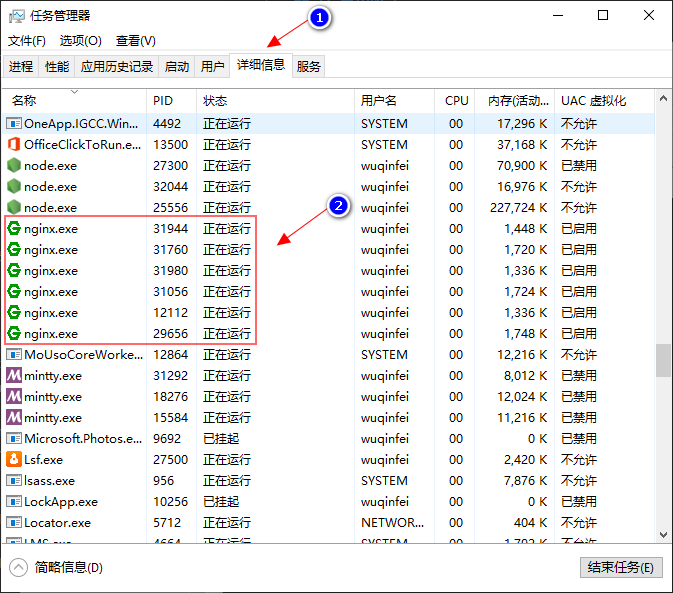

<!--#region
@author 吴钦飞
@email wuqinfei@qq.com
@create date 2023-10-31 16:24:58
@modify date 2023-10-31 16:32:06
@desc [description]
#endregion-->


# Nginx

## 1. 检查配置

命令：

```shell
# 检查指定的 nginx 配置文件，是否正确
nginx -t -c /usr/nginx/conf/nginx.conf  

# 检查默认的 nginx 配置文件
/usr/nginx/sbin/nginx -t
```

示例：

```shell
# 默认配置
cd /usr/local/nginx/sbin
./nginx -t

# 指定配置文件位置
/usr/local/nginx/sbin/nginx -t -c /usr/local/nginx/conf/nginx.conf
```

## 2. 启停

### 2.1. 启动

命令：

* `nginx -c 配置文件地址`

示例：

```shell
/usr/local/nginx/sbin/nginx -c /usr/local/nginx/conf/nginx.conf
```

### 2.2. 停止

命令：

```shell
ps -ef | grep nginx

## 从容停止 Nginx：
kill -QUIT 主进程号

## 快速停止 Nginx：
kill -TERM 主进程号

## 强制停止 Nginx：
kill -9 nginx
```

示例：

```shell
ps -ef | grep nginx

  # root 2255 .... nginx:master

kill -9 2255
```

### 2.3. 重启

命令：

* 方式 1: `nginx -s reload`
* 方式 2: `kill -HUP 主进称号`

示例：

```shell
# 方式 1:
cd /usr/local/nginx/sbin
./nginx -s reload


# 方式 2:
ps -ef | grep nginx
  # root 2255 .... nginx:master
  
kill -HUP 2255
```


## 3. windows

### 3.1. 启停


```shell
# 切换到 nginx 根目录
cd /D D:\dev\software\nginx-1.18.0

# 启动
start nginx

# 启动 时指定配置文件
start nginx -c .\conf\nginx_lxw.conf

# 停止
nginx -s stop
```

### 3.2. 注意

多次执行 `start nginx` 命令 会启动多个 Nginx 实例，可以在 任务管理器 中将其关闭：



## 4. 参考

* [【Nginx】启动，重启，关闭命令](https://www.jianshu.com/p/3b045336b4b1)