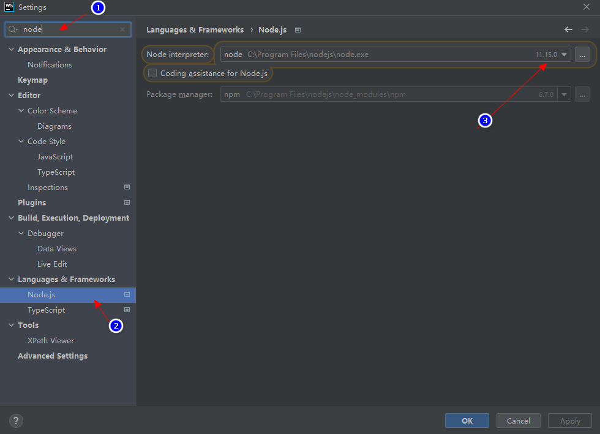
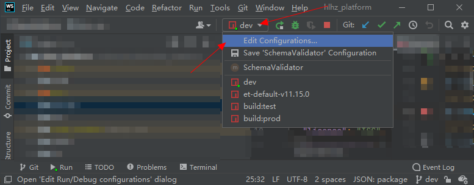

# npm 常用工具包

## 1. nodejs多版本管理 —— nvm

[[toc]]

### 1.1. 说明

使用 nvm 安装并切换多个版本 node.js

### 1.2. 安装

下载 `nvm-setup.zip` ：[https://github.com/coreybutler/nvm-windows/releases](https://github.com/coreybutler/nvm-windows/releases)

解压并安装。

### 1.3. 命令

>注意：使用管理员权限打开 CMD


查看可用版本：

```shell
nvm ls available

  |   CURRENT    |     LTS      |  OLD STABLE  | OLD UNSTABLE |
  |--------------|--------------|--------------|--------------|
  |    18.2.0    |   16.15.1    |   0.12.18    |   0.11.16    |
  |    18.1.0    |   16.15.0    |   0.12.17    |   0.11.15    |
  |    18.0.0    |   16.14.2    |   0.12.16    |   0.11.14    |
  |    17.9.1    |   16.14.1    |   0.12.15    |   0.11.13    |
```

安装指定版本：

```shell
# 安装具体的版本
nvm install 17.2.0

# 如果（因为网络原因）安装失败，则删除并重新安装
nvm uninstall 17.2.0

# 安装大版本的最新版，如下命令会安装 11.15.0
nvm install 11
```

查看当前系统的 node.js：

```shell
nvm ls

  * 17.2.0 (Currently using 64-bit executable)
    17.1.0
    12.22.7
```

使用已安装的版本：

```shell
nvm use 12.22.7

    Now using node v12.22.7 (64-bit)
```

## 2. 镜像源管理 —— nrm

### 2.1. 安装

```shell
npm install -g nrm
```

### 2.2. 命令

新增华为镜像源：

```shell
nrm add huawei https://repo.huaweicloud.com/repository/npm/
```

应用镜像源：

```shell
nrm use huawei
```

查看所有镜像源：

```shell
nrm ls

  npm ---------- https://registry.npmjs.org/
  yarn --------- https://registry.yarnpkg.com/
  tencent ------ https://mirrors.cloud.tencent.com/npm/
  cnpm --------- https://r.cnpmjs.org/
  taobao ------- https://registry.npmmirror.com/
  npmMirror ---- https://skimdb.npmjs.com/registry/
* huawei ------- https://repo.huaweicloud.com/repository/npm/
```

其他：

```shell
# 查看 npm registry 配置
npm config get registry
  
  https://repo.huaweicloud.com/repository/npm/

# （win10）查看 home 目录下的 .npmrc 文件
type C:\Users\wuqinfei\.npmrc

  registry=https://repo.huaweicloud.com/repository/npm/
```


### 2.3. 参考

* [https://github.com/Pana/nrm](https://github.com/Pana/nrm)

## 3. 在 webstorm 中的应用

### 3.1. 设置项目默认的 node.js 版本



### 3.2. 对不同的命令设置不同的 node.js 版本

打开配置：



设置：


