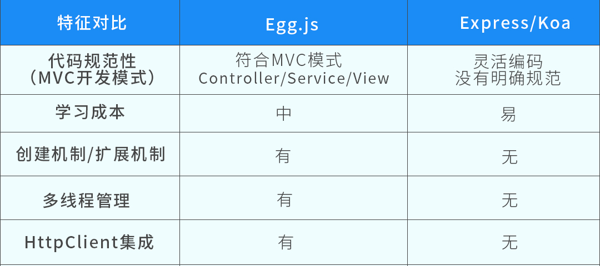

# egg.js 快速开始

## 1. 介绍

说明：

* 为企业级框架和应用而生的 node.js 框架
* 约定优于配置

特点：

* 基于 Koa

与其他框架的对比：

* 

## 2. hello world

快速生成项目:

```shell
mkdir egg-example

cd egg-example

npm init egg --type=simple

npm i

# ? Please select a boilerplate type simple - Simple egg app boilerplate
```

启动项目:

```shell
# 修改源码后，自动“重启”
npm run dev

open http://localhost:7001
```

## 3. 项目结构

目录：

```text
egg-example/
  app/
    controller/
      home.js
    public/
    router.js
```

新增路由：

* home.js

    ```js
    class HomeController extends Controller {
      // ...

      async test() {
        const { ctx } = this;
        ctx.body = '<h1>hello, test</h1>';
      }
    }
    ```

* router.js

    ```js
    module.exports = app => {
      const { router, controller } = app;

      // ...
      
      router.get('/test', controller.home.test);
    };
    ```

npm scripts:

```json
{
    "scripts": {
      // 启动（服务/后台）
      "start": "egg-scripts start --daemon --title=egg-server-example",
      // 停止
      "stop": "egg-scripts stop --title=egg-server-example",

      // 启动（开发模式）
      "dev": "egg-bin dev",
    },
}
```