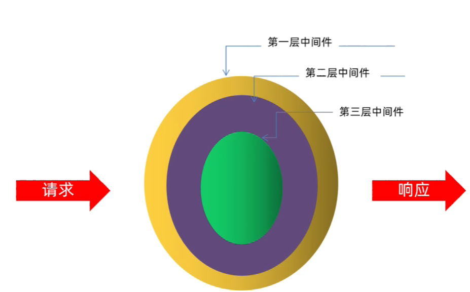

# koa2

* koa2 的介绍
* koa2 快速上手
* 后台项目

## 1. 介绍

说明：

* 基于 Node.js 平台的 web 开发框架
* 由 Express 原班人马打造

Web框架比较：

| web框架   | 异步处理              |
|---------|-------------------|
| Express | 回调函数              |
| koa     | Generator + yield |
| koa2    | async / await     |

特点：

* 支持 async/await (node v7.6+)
* 洋葱模型的中间件
  * 

## 2. 快速上手

安装：

```shell
npm i koa
```

目录结构：

```text
${root}/
    app.js
```

app.js:

<<< @/codes/koa2/01-quick-start/app.js

访问： 

* http://localhost:3000/

中间件的特点：

* 通过 `koaIns.use()` 应用中间件
* 一个中间件就是一个函数
* 中间件的执行顺序符合洋葱模型
* 需要调用 `next()` 方法才会执行下一个中间件

中间件示例：

<<< @/codes/koa2/01-quick-start/app_onion.js

## 3. 后台项目

目标：

* 计算处理请求的耗时
* 设置 MIME 类型
* 根据 URL 读取文件内容

步骤：

1. 项目准备
2. 总耗时中间件
3. 响应头中间件
4. 业务逻辑中间件

### 3.1. 项目准备

安装依赖：
  
```shell
npm init -y
npm install koa
```
 
文件及目录结构：

```text
${root}/
  app.js
  data/
    seller.json
  middleware/
    koa_response_data.js
    koa_response_duration.js
    koa_response_header.js
  utils/
    file_utils.js
```

### 3.2. 总耗时中间件

说明：

* 第 1 层中间件
* 计算执行时间， `next()` 前后的时间差
* 设置响应头： `x-response-time: 5ms`

示例：

<<< @/codes/koa2/02-server/middleware/koa_response_duration.js

### 3.3. 响应头中间件

说明：

* 第 2 层中间件
* 设置 `content-type: application/json;charset=UTF-8`
* 允许跨域

示例：

<<< @/codes/koa2/02-server/middleware/koa_response_header.js

### 3.4. 业务逻辑中间件

说明：

* 第 3 层
* 根据 URL 读取文件

接口：

| 接口              | 说明   |
|-----------------|------|
| /api/seller     | 商家销量 |
| /api/budget     | 预算开销 |
| /api/stock      | 库存信息 |
| /api/trend      | 销量趋势 |
| /api/rank       | 销量排行 |
| /api/map        | 商家分布 |
| /api/hotproduct | 热销商品 |

示例：

<<< @/codes/koa2/02-server/middleware/koa_response_data.js
