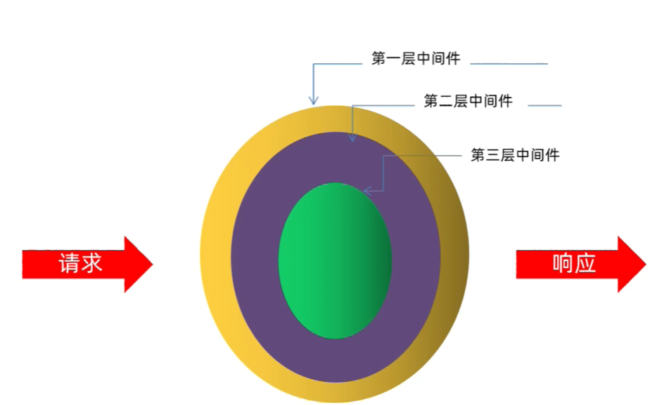

# koa2-快速入门

## 1. 介绍

说明：

* 基于 Node.js 平台的 web 开发框架
* 由 Express 原班人马打造

Web框架比较：

| web框架   | 异步处理              |
|---------|-------------------|
| Express | 回调函数              |
| koa     | Generator + yield |
| koa2    | async / await     |


## 2. 第一个应用

安装：

```shell
npm i koa

## "koa": "^2.14.2"
```

目录：

```text
proj/
  src/
    app.js  
```

app.js:

```js
const Koa = require('koa');
const app = new Koa();

app.use(async (ctx) => {
  ctx.body = 'Hello World';
});

app.listen(3000);
```

访问：

* `http://localhost:3000/`

## 3. 中间件

特点：

* 通过 `koaIns.use()` 应用中间件
* 一个中间件就是一个函数
* 中间件的执行顺序符合洋葱模型
  * 
* 需要调用 `next()` 方法才会执行下一个中间件

示例：

```js
const Koa = require('koa');

const app = new Koa();

app.use(async (ctx, next) => {
  console.log('step 1');
  ctx.response.body = 'hello world';

  const result = await next();

  console.log(`step 4`, result); // 中间件 2 返回的值

  return '中间件 1 返回的值';
});

app.use(async (ctx, next) => {
  console.log('step 2');

  const result = await next();

  console.log('step 3', result); // undefined

  return '中间件 2 返回的值';
});

app.listen(3000, () => {
  console.log('server is started: http://localhost:3000')
});
```

## 4. 路由

### 4.1. 基本使用

安装：

```shell
npm i @koa/router

## "@koa/router": "^12.0.0",
```

使用：

```js
const Koa = require('koa');
const Router = require('@koa/router');

const app = new Koa();
const router = new Router();

router.get('/', (ctx, next) => {
    ctx.body = 'Hello World';
});

app
  .use(router.routes())
  .use(router.allowedMethods());
```

### 4.2. 参数

```js
/*
  query 参数
    http://localhost:3000/getUser?id=1
 */
ctx.request.query; // { id: '1' }


/*
  body 参数
    需要 koa-body 中间件
 */
ctx.request.body


/*
  动态路由参数
    router.get('/user/:id', ...)
    
    http://localhost:3000/user/2
 */
ctx.params; // { id: '2' }
```

### 4.3. GET

query 传参：

```js
/*
请求：
  GET http://localhost:3000/getUser?id=1

响应：
  Content-Type: application/json; charset=utf-8

  {
    "id": 1,
    "name": "张三"
  }
 */
router.get('/getUser', (ctx, next) => {
    const { query } = ctx.request;

    // { id: '1' }
    console.log('ctx.request.query: ', query);

    ctx.response.body = { id: 1, name: '张三' };
})
```

动态路由传参：

```js
/*
请求：
  GET http://localhost:3000/user/2

响应：
  Content-Type: application/json; charset=utf-8

  {
      "id": 2,
      "name": "李四"
  }
 */
router.get('/user/:id', (ctx, next) => {
    const { params } = ctx;

    // { id: '2' }
    console.log('ctx.params: ', params);

    ctx.response.body = { id: 2, name: '李四' };
})
```

### 4.4. post

安装：

```shell
npm i koa-body

## "koa-body": "^6.0.1"
```

使用：

```javascript
const Koa = require('koa');
const Router = require('@koa/router');
const { koaBody } = require('koa-body');

const app = new Koa();
const router = new Router();

/*
请求：
  POST http://localhost:3000/updateUser
  {
    "id": 3,
    "name": "王五"
  }

响应：
  Content-Type: application/json; charset=utf-8
  {
    "id": 3,
    "name": "王五"
  }

注意：
  需要使用 koa-body 中间件，否则 ctx.request.body 为 undefined
 */
router.post('/updateUser', (ctx, next) => {
  const { body } = ctx.request

  // { id: 3, name: '王五' }
  console.log('ctx.request.body: ', body)

  ctx.response.body = body;
});

app
  .use(koaBody())
  .use(router.routes())
  .use(router.allowedMethods());
```

参考：

* [github.com/koajs/koa-body](https://github.com/koajs/koa-body)

### 4.5. 静态资源

### 4.6. 参考

* [koa获取参数的三种方式](https://juejin.cn/post/6844904114405507080)
* [koa2：统一接口返回数据格式](https://blog.csdn.net/qq_40963664/article/details/109217605)

## 5. 参考

* [koa 官网](https://koajs.com/)
