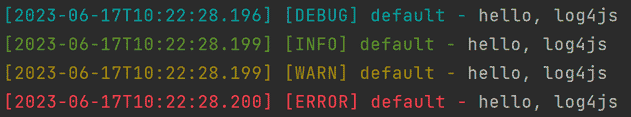

# log4js-快速入门

## 介绍

node 日志库

## 快速开始

安装：

```shell
npm i log4js

## "log4js": "^6.9.1"
```

示例：

```javascript
const log4js = require('log4js');
const logger = log4js.getLogger();

logger.level = log4js.levels.DEBUG; // 日志级别，输出 debug 级别及以上 的日志

logger.debug('hello, log4js');
logger.info('hello, log4js');
logger.warn('hello, log4js');
logger.error('hello, log4js');
```

输出：



## 核心

* appenders   : 输出
* categories  : 类型
* level       : 级别
* layouts     : 格式

### appenders (输出)

分类：

| type           | desc            |
|----------------|-----------------|
| stdout         | 标准输出流，输出到控制台，默认 |
| file           | 文件，按文件大小滚动创建文件  |
| dateFile       | 文件，按日期滚动创建文件    |
| categoryFilter | -               |
| console        | -               |
| fileSync       | -               |
| logLevelFilter | -               |
| multiFile      | -               |
| multiprocess   | -               |
| noLogFilter    | -               |
| recording      | -               |
| stderr         | -               |
| tcp            | -               |
| tcp-server     | -               |

参考：[https://log4js-node.github.io/log4js-node/appenders.html](https://log4js-node.github.io/log4js-node/appenders.html)

#### stdout

说明：

* This appender writes all log events to the standard output stream. It is the default appender for log4js.

配置：

```text
type    - stdout

layout  - object (optional, defaults to colouredLayout) 
        - see layouts
```

示例：

```javascript
log4js.configure({
  appenders: {
    stdout: {
      type: 'stdout'
    },
  },
  categories: {
    default: {
      appenders: ['stdout'],
      level: 'debug'
    },
  },
});
```

参考：[https://log4js-node.github.io/log4js-node/stdout.html](https://log4js-node.github.io/log4js-node/stdout.html)

#### file

说明：

* The file appender writes log events to a file. 
* It supports an optional maximum file size, and will keep a configurable number of backups.

配置：

```text
type        - "file"

filename    - string - the path of the file where you want your logs written.

maxLogSize  - integer (optional, defaults to undefined) 
            - the maximum size (in bytes) for the log file. 
              If not specified or 0, then no log rolling will happen. 
              maxLogSize can also accept string with the size suffixes: K, M, G such as 1K, 1M, 1G.
            
backups     - integer (optional, defaults to 5) 
            - the number of old log files to keep during log rolling (excluding the hot file).
            
layout      - (optional, defaults to basic layout) 
            - see layouts
            

encoding    - string (default “utf-8”)
mode        - integer (default 0o600 - node.js file modes)
flags       - string (default ‘a’ - node.js file flags)
compress    - boolean (default false) 
            - compress the backup files using gzip (backup files will have .gz extension)
keepFileExt - boolean (default false) 
            - preserve the file extension when rotating log files (file.log becomes file.1.log instead of file.log.1).
fileNameSep - string (default ‘.’) 
            - the filename separator when rolling. e.g.: abc.log.1 or abc.1.log (keepFileExt)
```

示例：

```javascript
const log4js = require('log4js');
const fs = require('fs');

log4js.configure({
  appenders: {
    access: {
      type: 'file',
      filename: './logs/access.log',
      maxLogSize: '1K',  // 单个文件最大尺寸，超过后自动创建新文件
      backups: 2,        // 旧文件的最大数量，不包含当前文件
      keepFileExt: true,
    },
  },
  categories: {
    default: {
      appenders: ['access'],
      level: 'info'
    },
  },
});

const logger = log4js.getLogger();

const content = fs.readFileSync('./node_modules/log4js/README.md', { encoding: 'utf-8' });

logger.info(content);
logger.info(content);
logger.info(content);
logger.info(content);

/* 输出：

logs/
  access.1.log
  access.2.log
  access.log

 */
```

参考：[https://log4js-node.github.io/log4js-node/file.html](https://log4js-node.github.io/log4js-node/file.html)

#### dateFile

说明：

* This is a file appender that rolls log files based on a configurable time, rather than the file size.

配置：

```text
type      - "dateFile"

filename  - string 
          - the path of the file where you want your logs written.

pattern   - string (optional, defaults to yyyy-MM-dd) 
          - the pattern to use to determine when to roll the logs.
            "yyyy-MM-dd-hh"  hourly log rolling
            
            https://github.com/nomiddlename/date-format
            
              dd    - date.getDate()
              MM    - date.getMonth() + 1
              yy    - date.getFullYear().toString().substring(2, 4)
              yyyy  - date.getFullYear()
              hh    - date.getHours()
              mm    - date.getMinutes()
              ss    - date.getSeconds()
              SSS   - date.getMilliseconds()
              O     - timezone offset in ±hh:mm format (note that time will still be local if displaying offset)

layout    - (optional, defaults to basic layout) - see layouts


encoding  - string (default “utf-8”)

mode      - integer (default 0o600 - node.js file modes)

flags     - string (default ‘a’ - node.js file flags)

compress  - boolean (default false) 
          - compress the backup files using gzip (backup files will have .gz extension)
          
keepFileExt 
          - boolean (default false) 
          - preserve the file extension when rotating log files 
            (file.log becomes file.2017-05-30.log instead of file.log.2017-05-30).
              
fileNameSep 
          - string (default ‘.’) 
          - the filename separator when rolling. 
            e.g.: abc.log.2013-08-30 or abc.2013-08-30.log (keepFileExt)
              
alwaysIncludePattern 
          - boolean (default false) 
          - include the pattern in the name of the current log file.
          
numBackups 
          - integer (default 1) 
          - the number of old files that matches the pattern to keep (excluding the hot file).
```

示例：

```javascript
const log4js = require('log4js');

log4js.configure({
  appenders: {
    app: {
      type: 'dateFile',
      filename: './logs/app.log',
      pattern: 'yyyy-MM-dd-hh-mm-ss',  // 秒级
      keepFileExt: true, // file.log.2017-05-30 -> file.2017-05-30.log
      alwaysIncludePattern: true, // 当前文件名包含 pattern
      numBackups: 3
    },
  },
  categories: {
    default: {
      appenders: ['app'],
      level: 'info'
    },
  },
});

const logger = log4js.getLogger();

logger.info(1)
setTimeout(() => logger.warn(2), 1100);
setTimeout(() => logger.error(3), 2200);
setTimeout(() => logger.error(4), 3300);
setTimeout(() => logger.error(5), 4400);

/* 输出：

logs/
  app.2023-06-17-12-38-59.log
  app.2023-06-17-12-39-01.log
  app.2023-06-17-12-39-02.log
  app.2023-06-17-12-39-03.log

 */
```

参考：[https://log4js-node.github.io/log4js-node/dateFile.html](https://log4js-node.github.io/log4js-node/dateFile.html)

### categories (类型)

## 参考

* [Node.js 之 log4js 完全讲解](https://zhuanlan.zhihu.com/p/22110802)
