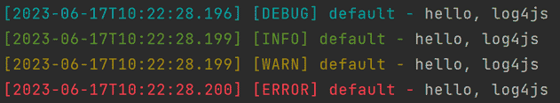

# log4js-快速入门

## 1. 介绍

node 日志库

## 2. 快速开始

安装：

```shell
npm i log4js

## "log4js": "^6.9.1"
```

示例：

```javascript
const log4js = require('log4js');
const logger = log4js.getLogger();

logger.level = log4js.levels.DEBUG; // 日志级别，输出 debug 级别及以上 的日志

logger.debug('hello, log4js');
logger.info('hello, log4js');
logger.warn('hello, log4js');
logger.error('hello, log4js');
```

输出：



## 3. 核心

* Level       : 级别（权重、优先级）
* Category    : 类别（分组）
* Appender    : 输出
* Logger      : 实例
* Layout      : 格式（样式）
* LogEvent    : 日志

### 3.1. Level

说明：

* 日志事件的权重、优先级
* 日志事件的权重低于或等于 Category.level 时，会发送给 Category.appenders
* 在 Category.level 中配置

源码：

```javascript
// node_modules/log4js/lib/levels.js
Level.addLevels({
  ALL: { value: Number.MIN_VALUE, colour: 'grey' },
  TRACE: { value: 5000, colour: 'blue' },
  DEBUG: { value: 10000, colour: 'cyan' },
  INFO: { value: 20000, colour: 'green' },
  WARN: { value: 30000, colour: 'yellow' },
  ERROR: { value: 40000, colour: 'red' },
  FATAL: { value: 50000, colour: 'magenta' },
  MARK: { value: 9007199254740992, colour: 'grey' }, // 2^53
  OFF: { value: Number.MAX_VALUE, colour: 'grey' },
});
```

取值：(不区分大小写)

* `'ALL'` , `log4js.levels.ALL`
* `'TRACE'` , `log4js.levels.TRACE`
* `'DEBUG'` , `log4js.levels.DEBUG`
* `'INFO'` , `log4js.levels.INFO`
* `'WARN'` , `log4js.levels.WARN`
* `'ERROR'` , `log4js.levels.ERROR`
* `'FATAL'` , `log4js.levels.FATAL`
* `'MARK'` , `log4js.levels.MARK`
* `'OFF'` , `log4js.levels.OFF`

示例：

```javascript
const log4js = require('log4js');

log4js.configure({
  appenders: {
    out: { type: 'stdout' },
  },
  categories: {
    default: {
      appenders: ['out'],
      level: log4js.levels.INFO.levelStr,
    }
  }
});


const logger = log4js.getLogger();

logger.debug('debug'); // 不会显示
logger.info('info');   
```

### 3.2. Category

说明：

* 对日志进行分组（分类）

源码：

```typescript
// node_modules\log4js\types\log4js.d.ts
export interface Log4js {
  configure(config: Configuration): Log4js;
  getLogger(category?: string): Logger;
  // ...
}

export interface Configuration {
  categories: {
    [name: string]: {
      appenders: string[];
      level: string;
      enableCallStack?: boolean;
    };
  };
  // ...
}
```

使用：

```javascript
const log4js = require('log4js');

log4js.configure({
  appenders: {
    out: {
      type: 'stdout'
    },
    app: {
      type: 'file',
      filename: 'logs/app.log'
    },
  },
  categories: {
    default: {
      appenders: ['out'],
      level: 'trace'
    },
    app: {
      // 同时输出到 out、app appender
      appenders: ['out', 'app'],
      level: 'info'
    },
  },
});

const defaultLogger = log4js.getLogger();
defaultLogger.debug('defaultLogger');

const appLogger = log4js.getLogger('app');
appLogger.info('appLogger');
```

参考：

* [https://log4js-node.github.io/log4js-node/categories.html](https://log4js-node.github.io/log4js-node/categories.html)

### 3.3. Appender

说明：

* 负责 日志事件 的输出

源码：

```typescript
// node_modules\log4js\types\log4js.d.ts
export interface Log4js {
  configure(filename: string): Log4js;
  configure(config: Configuration): Log4js;
  // ...
}

export interface Configuration {
  appenders: { [name: string]: Appender };
  // ...
}

export type Appender = Appenders[keyof Appenders];

export interface Appenders {
  CategoryFilterAppender: CategoryFilterAppender;
  ConsoleAppender: ConsoleAppender;
  FileAppender: FileAppender;
  SyncfileAppender: SyncfileAppender;
  DateFileAppender: DateFileAppender;
  LogLevelFilterAppender: LogLevelFilterAppender;
  NoLogFilterAppender: NoLogFilterAppender;
  MultiFileAppender: MultiFileAppender;
  MultiprocessAppender: MultiprocessAppender;
  RecordingAppender: RecordingAppender;
  StandardErrorAppender: StandardErrorAppender;
  StandardOutputAppender: StandardOutputAppender;
  TCPAppender: TCPAppender;
  CustomAppender: CustomAppender;
}
```

内置 appender 的 Appender.type 的取值：

| value          | desc            |
|----------------|-----------------|
| stdout         | 标准输出流，输出到控制台，默认 |
| file           | 文件，按文件大小滚动创建文件  |
| dateFile       | 文件，按日期滚动创建文件    |
| categoryFilter | -               |
| console        | -               |
| fileSync       | -               |
| logLevelFilter | -               |
| multiFile      | -               |
| multiprocess   | -               |
| noLogFilter    | -               |
| recording      | -               |
| stderr         | -               |
| tcp            | -               |
| tcp-server     | -               |

参考：[https://log4js-node.github.io/log4js-node/appenders.html](https://log4js-node.github.io/log4js-node/appenders.html)

#### 3.3.1. stdout

说明：

* This appender writes all log events to the standard output stream. It is the default appender for log4js.

配置：

```text
type    - stdout

layout  - object (optional, defaults to colouredLayout) 
        - see layouts
```

示例：

```javascript
log4js.configure({
  appenders: {
    stdout: {
      type: 'stdout'
    },
  },
  categories: {
    default: {
      appenders: ['stdout'],
      level: 'debug'
    },
  },
});
```

参考：[https://log4js-node.github.io/log4js-node/stdout.html](https://log4js-node.github.io/log4js-node/stdout.html)

#### 3.3.2. file

说明：

* The file appender writes log events to a file. 
* It supports an optional maximum file size, and will keep a configurable number of backups.

配置：

```text
type        - "file"

filename    - string - the path of the file where you want your logs written.

maxLogSize  - integer (optional, defaults to undefined) 
            - the maximum size (in bytes) for the log file. 
              If not specified or 0, then no log rolling will happen. 
              maxLogSize can also accept string with the size suffixes: K, M, G such as 1K, 1M, 1G.
            
backups     - integer (optional, defaults to 5) 
            - the number of old log files to keep during log rolling (excluding the hot file).
            
layout      - (optional, defaults to basic layout) 
            - see layouts
            

encoding    - string (default “utf-8”)

mode        - integer (default 0o600 - node.js file modes)

flags       - string (default ‘a’ - node.js file flags)

compress    - boolean (default false) 
            - compress the backup files using gzip (backup files will have .gz extension)
            
keepFileExt - boolean (default false) 
            - preserve the file extension when rotating log files 
              (file.log becomes file.1.log instead of file.log.1).
              
fileNameSep - string (default ‘.’) 
            - the filename separator when rolling. 
              e.g.: abc.log.1 or abc.1.log (keepFileExt)
```

示例：

```javascript
const log4js = require('log4js');
const fs = require('fs');

log4js.configure({
  appenders: {
    access: {
      type: 'file',
      filename: './logs/access.log',
      maxLogSize: '1K',  // 单个文件最大尺寸，超过后自动创建新文件
      backups: 2,        // 旧文件的最大数量，不包含当前文件
      keepFileExt: true,
    },
  },
  categories: {
    default: {
      appenders: ['access'],
      level: 'info'
    },
  },
});

const logger = log4js.getLogger();

const content = fs.readFileSync('./node_modules/log4js/README.md', { encoding: 'utf-8' });

logger.info(content);
logger.info(content);
logger.info(content);
logger.info(content);

/* 输出：

logs/
  access.1.log
  access.2.log
  access.log

 */
```

参考：[https://log4js-node.github.io/log4js-node/file.html](https://log4js-node.github.io/log4js-node/file.html)

#### 3.3.3. dateFile

说明：

* This is a file appender that rolls log files based on a configurable time, rather than the file size.

配置：

```text
type      - "dateFile"

filename  - string 
          - the path of the file where you want your logs written.

pattern   - string (optional, defaults to yyyy-MM-dd) 
          - the pattern to use to determine when to roll the logs.
            "yyyy-MM-dd-hh"  hourly log rolling
            
            https://github.com/nomiddlename/date-format
            
              dd    - date.getDate()
              MM    - date.getMonth() + 1
              yy    - date.getFullYear().toString().substring(2, 4)
              yyyy  - date.getFullYear()
              hh    - date.getHours()
              mm    - date.getMinutes()
              ss    - date.getSeconds()
              SSS   - date.getMilliseconds()
              O     - timezone offset in ±hh:mm format (note that time will still be local if displaying offset)

layout    - (optional, defaults to basic layout) - see layouts


encoding  - string (default “utf-8”)

mode      - integer (default 0o600 - node.js file modes)

flags     - string (default ‘a’ - node.js file flags)

compress  - boolean (default false) 
          - compress the backup files using gzip (backup files will have .gz extension)
          
keepFileExt 
          - boolean (default false) 
          - preserve the file extension when rotating log files 
            (file.log becomes file.2017-05-30.log instead of file.log.2017-05-30).
              
fileNameSep 
          - string (default ‘.’) 
          - the filename separator when rolling. 
            e.g.: abc.log.2013-08-30 or abc.2013-08-30.log (keepFileExt)
              
alwaysIncludePattern 
          - boolean (default false) 
          - include the pattern in the name of the current log file.
          
numBackups 
          - integer (default 1) 
          - the number of old files that matches the pattern to keep (excluding the hot file).
```

示例：

```javascript
const log4js = require('log4js');

log4js.configure({
  appenders: {
    app: {
      type: 'dateFile',
      filename: './logs/app.log',
      pattern: 'yyyy-MM-dd-hh-mm-ss',  // 秒级
      keepFileExt: true, // file.log.2017-05-30 -> file.2017-05-30.log
      alwaysIncludePattern: true, // 当前文件名包含 pattern
      numBackups: 3
    },
  },
  categories: {
    default: {
      appenders: ['app'],
      level: 'info'
    },
  },
});

const logger = log4js.getLogger();

logger.info(1)
setTimeout(() => logger.warn(2), 1100);
setTimeout(() => logger.error(3), 2200);
setTimeout(() => logger.error(4), 3300);
setTimeout(() => logger.error(5), 4400);

/* 输出：

logs/
  app.2023-06-17-12-38-59.log
  app.2023-06-17-12-39-01.log
  app.2023-06-17-12-39-02.log
  app.2023-06-17-12-39-03.log

 */
```

参考：[https://log4js-node.github.io/log4js-node/dateFile.html](https://log4js-node.github.io/log4js-node/dateFile.html)

### 3.4. Logger

说明：

* log4js 的主要接口
* 创建 Logger 实例（logger）时，可以传 category
* 有 info(), debug(), error() 等方法，可以创建 LogEvents 并将其传给 appenders

源码：

```typescript
export interface Logger {
  new (name: string): Logger;

  readonly category: string;
  
  level: Level | string;

  log(level: Level | string, ...args: any[]): void;

  trace(message: any, ...args: any[]): void;

  debug(message: any, ...args: any[]): void;

  info(message: any, ...args: any[]): void;

  warn(message: any, ...args: any[]): void;

  error(message: any, ...args: any[]): void;

  fatal(message: any, ...args: any[]): void;

  mark(message: any, ...args: any[]): void;
  
  // ...
}
```

### 3.5. Layout

说明：

* 函数
* 将 LogEvent 转换成字符串
* 在 Appender.layout 中配置

源码：

```typescript
export interface StandardOutputAppender {
  type: 'stdout';
  // (defaults to ColoredLayout)
  layout?: Layout;
}

export interface FileAppender {
  type: 'file';
  // (defaults to BasicLayout)
  layout?: Layout;
  // ...
}

export type Layout =
  | BasicLayout
  | ColoredLayout
  | MessagePassThroughLayout
  | DummyLayout
  | PatternLayout
  | CustomLayout;

export interface BasicLayout {
  type: 'basic';
}

export interface ColoredLayout {
  type: 'colored' | 'coloured';
}

export interface MessagePassThroughLayout {
  type: 'messagePassThrough';
}

export interface DummyLayout {
  type: 'dummy';
}

export interface PatternLayout {
  type: 'pattern';
  // specifier for the output format, using placeholders as described below
  pattern: string;
  // user-defined tokens to be used in the pattern
  tokens?: { [name: string]: Token };
}

export interface CustomLayout {
  [key: string]: any;
  type: string;
}
```

内置 layout 的 Appender.layout.type 的取值：

* basic
* colored
* messagePassThrough
* dummy
* pattern


示例：

```javascript
const log4js = require('log4js');

log4js.configure({
  appenders: {
    out: {
      type: 'stdout',
      layout: {
        type: 'pattern',
        /*
          %[[%d{yyyy-MM-dd hh:mm:ss.SSS}] [%p] %c - %m%]
              %[ ... %]
                  颜色块
              %d{yyyy-MM-dd hh:mm:ss.SSS}
                  格式化日期
              [%p]
                  级别
              %c
                  分组
              %m%
                  内容

          示例：
            [2023-06-17 18:10:44.666] [DEBUG] default - 娃哈哈
         */
        pattern: '%[[%d{yyyy-MM-dd hh:mm:ss.SSS}] [%p] %c - %m%]',
      }
    },
  },
  categories: {
    default: {
      appenders: ['out'],
      level: 'all',
    }
  }
});


const logger = log4js.getLogger();

logger.debug('娃哈哈');
logger.warn('呵呵');
```

参考：

* [https://log4js-node.github.io/log4js-node/layouts.html](https://log4js-node.github.io/log4js-node/layouts.html)

### 3.6. LogEvent

说明：

* 当调用 logger 的 debug()、info() 等方法时，会创建一个 LogEvent

源码：

```typescript
export interface LoggingEvent extends Partial<CallStack> {
  categoryName: string; // name of category
  level: Level; // level of message
  data: any[]; // objects to log
  startTime: Date;
  pid: number;
  context: any;
  cluster?: {
    workerId: number;
    worker: number;
  };
  /**
   * The first Error object in the data if there is one
   */
  error?: Error;
  serialise(): string;
}
```

## 4. 参考

* [Node.js 之 log4js 完全讲解](https://zhuanlan.zhihu.com/p/22110802)
