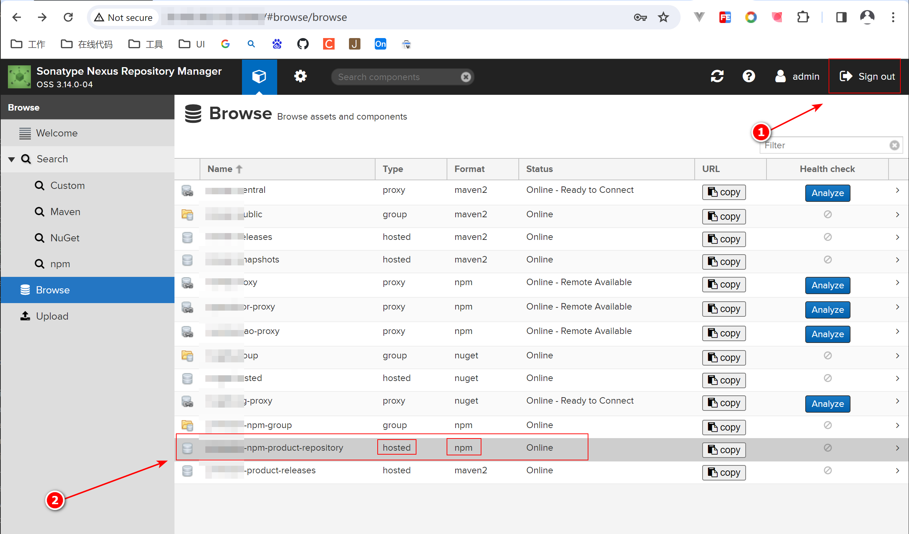
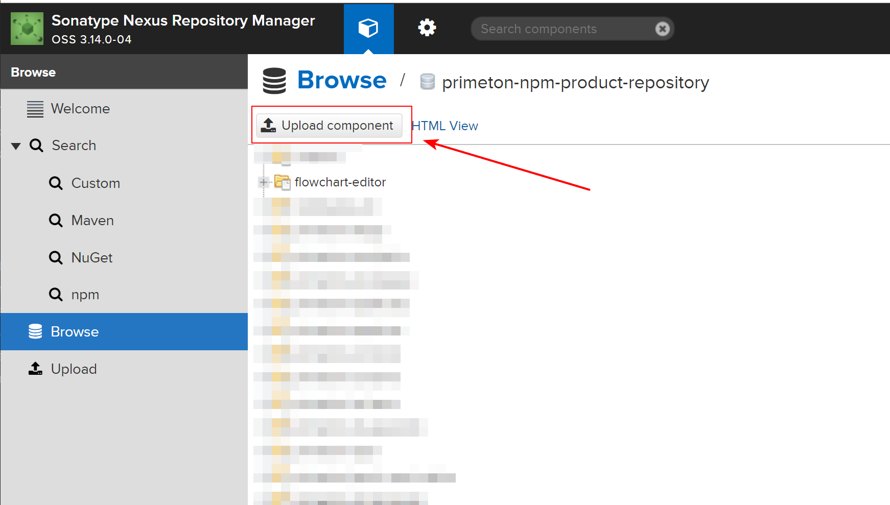
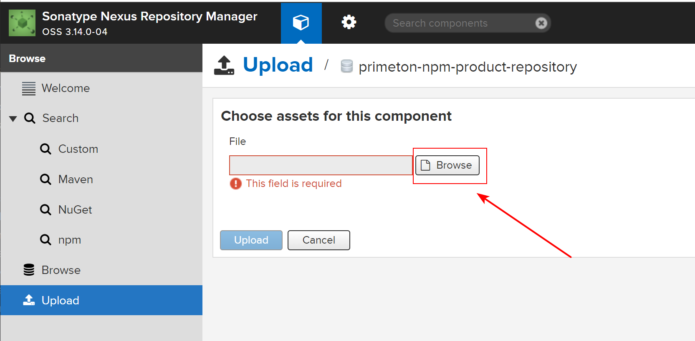

<!--#region
@author 吴钦飞
@email wuqinfei@qq.com
@create date 2023-12-20 15:49:04
@modify date 2023-12-25 08:59:25
@desc [description]
#endregion-->


# npm package 开发指南

[[toc]]

## 1. 介绍

本文介绍 npm 包开发流程：

1. 如何开发 npm 包
2. npm 包在外网如何使用
3. npm 包在内网如何使用

## 2. npm 包开发

>以 `@fe/flowchart-editor` 开发为例

### 2.1. 项目结构

```text
flowchart-editor/     # 项目根目录
  build/                # 构建相关配置
  dist/                 # 编译目录
  dist-zip/             # tgz 目录
  src/                  # 源码目录
  package.json          # 项目描述文件
  webpack.config.js     # webpack 构建脚本
```

### 2.2. package.json

```json
{
  // 项目名称（包的名称），在代码中通过 `import xx from 'flowchart-editor'` 引入
  "name": "@fe/flowchart-editor",

  "version": "1.0.3",

  // 项目入口文件
  "main": "./dist/index.js",

  "scripts": {
    "start": "npm run serve",
    "serve": "cross-env NODE_ENV=development webpack serve",
    "build": "cross-env NODE_ENV=production webpack",

    // 将项目打包（package, tgz, tarball）到 dist-zip 目录
    "pack": "npm pack --pack-destination dist-zip"
  },

  // 指定项目中哪些文件/目录 会打包到 tgz 里
  "files": [
    "dist",
    "src",
    "types",
    ".eslintignore",
    "package.json"
  ],

  // 指定项目中的前置依赖，避免使用该库的其他项目重复安装
  "peerDependencies": {
    // 匹配 2.x.x 版本的包
    "vue": "^2.6.0"
  },
  
  // 指定项目的依赖
  "dependencies": {
    "jquery": "^3.7.1",
    "lodash.clonedeep": "^4.5.0",
    "lodash.debounce": "^4.0.8",
    "lodash.get": "^4.4.2",
    "lodash.merge": "^4.6.2",
    "lodash.template": "^4.5.0",
    "lodash.throttle": "^4.1.1"
  },
}
```

### 2.3. webpack.config.js

```js
const MiniCssExtractPlugin = require('mini-css-extract-plugin');

module.exports = {
  // 排除掉第三方依赖
  externals: {
    vue: 'vue',
    jquery: 'jquery',
    'lodash.clonedeep': 'lodash.clonedeep',
    'lodash.debounce': 'lodash.debounce',
    'lodash.get': 'lodash.get',
    'lodash.merge': 'lodash.merge',
    'lodash.template': 'lodash.template',
    'lodash.throttle': 'lodash.throttle',
  }，

  // 输出的 bundle 文件的模块类型为 commonjs2
  output: {
    path: path.resolve(__dirname, './dist'),
    // 输出的 js 文件名称
    filename: 'index.js',
    library: {
      type: 'commonjs2',
    },
  },

  plugins: [
    new MiniCssExtractPlugin({
      // 输出的 css 文件名称
      filename: 'index.css',
    }),
  ],
};
```

## 3. 私仓上传与下载

>以 nexus 搭建的私仓（Type 为 hosted，Format 为 npm）为例

步骤：

1. 将项目打包成 tgz 的包
2. 将 tgz 上传至 nexus 仓库
3. 配置 .npmrc，指定 该包 的镜像源后 即可安装

### 3.1. 打包

```shell
# 切换至项目项目根目录
cd flowchart-editor

# 将项目打包至 dist-zip 目录
npm pack --pack-destination dist-zip

# 生成如下包
# ./dist-zip/fe-flowchart-editor-1.0.3.tgz
```

### 3.2. 上传

>nexus 地址: http://39.100.38.119:10000/

1. 登录，并进入 npm 仓库

  * 

2. 点击上传

  * 

3. 上传 fe-flowchart-editor-1.0.3.tgz

  * 

### 3.3. 安装

>以项目 demo 为例

项目结构：

```text
demo/
  src/
  package.json
  .npmrc
```

.npmrc:

```text
@fe:registry=http://39.100.38.119:10000/repository/primeton-npm-product-repository/
```

安装：

```shell
npm i @fe/flowchart-editor@1.0.3
```

## 4. 离线安装

步骤：

1. 获取 fe-flowchart-editor-1.0.3.tgz 文件，并存放到项目 libs 目录

2. 通过 `npm i ./libs/fe-flowchart-editor-1.0.3.tgz` 即可安装至项目
