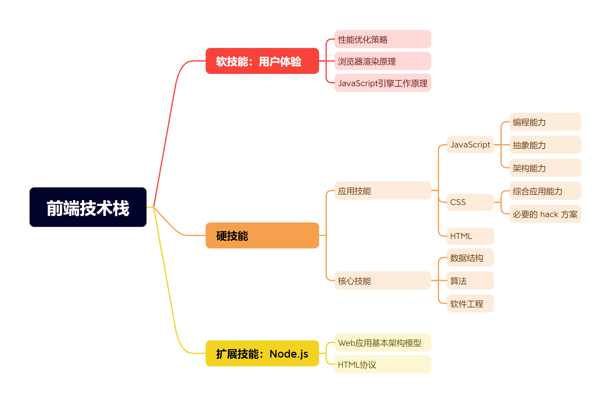

# 前端工程化-体系设计与实践

## 前言

本书将前端工程化解读为一系列规范和流程的集合，它不是一个框架或者工具，聚焦的不是某个垂直的研究领域或者特殊的业务类型，而是一种可演化、可扩展的服务，

服务的目标是解决前端开发以及前后端协作开发过程中的难点和痛点问题，涵盖项目的起始、开发、测试以及部署环节。

工具是前端工程化的实现媒介，规范是工程化的指导方针，工作流程是工程化的外在表现形式以及约束规范的载体。

本书通过解析一个Web项目迭代过程中前端开发者面临的诸多问题，从工程化的角度给出对应的解决方案，最终将各个环节串联为完整的工作流。

希望读者通过阅读本书可以对前端工程化要解决的问题有大致的了解，从而能够对读者自行实现工程化方案有所帮助

源码：

* [https://github.com/boijs/boi](https://github.com/boijs/boi)

章节介绍：

* 第 1 章 前端工程简史 

    * 讲述前端工程师的发展史、在团队中的定位，以及前后端分离和前端工程化的进化历程与基本形态。

* 第 2 章 脚手架 

    * 讲述作为前端项目起始阶段取代烦琐人工操作的脚手架必须具备的要素以及本质，通过剖析目前市面上的经典案例讲解实现脚手架过程中需要考虑的要点以及如何集成 Yeoman 到工程化方案中。

* 第 3 章 构建 

    * 讲述构建系统面临的问题以及对应的解决方案。构建是前端工程体系中功能最多、最复杂的模块，也是串联本地开发服务器、部署的关键，是实现工作流的核心模块。

* 第 4 章 本地开发服务器 

    * 讲述如何以 Mock 服务实现前后端并行开发，以及配合动态构建进一步提升前端工程师的开发效率。

* 第 5 章 部署 

    * 讲述部署功能如何权衡速度、协作和安全3个重要原则，以及前端静态资源特殊的部署策略。

* 第 6 章 工作流 

    * 讲述如何将既有的功能串联成完整的工作流。以速度见长的本地工作流和注重严谨的云平台工作流，两者各有优劣，适用于不同需求和不同规模的团队。

* 第 7 章 前端工程化的未来 

    * 讲述前端工程师如何选择进阶的方向以便适应未来的变化。前端工程化是服务于前端开发的，前端工程师定位的改变必然会引起工程化方案的调整。本章通过分析未来工程化不变和可变的方面，探讨前端工程化未来的表现形式。

## 第 1 章 前端工程简史

前端工程化这个概念在近两年被广泛地提及和讨论，究其原因，是前端工程师所负责的客户端功能逻辑在不断复杂化。

如果说互联网时代是前端工程师的舞台可能有些夸大其词，但前端工程师绝对撑起了互联网应用开发的“半壁江山”。

传统网站、手机应用、桌面应用、微信小程序等，前端工程师已经不是几年前被谑称的“切图仔”了。

以往的“写demo，套模板”模式已经严重拖累了前端开发以及整体团队的开发效率。

在这样的时代背景下，前端工程化便应运而生了。

在本章中，我们首先讨论当前市场环境下对前端工程师的技能要求是什么，以此为前提探讨前端开发以及前后端协作开发中有哪些问题需要从工程化的角度解决。

随后，沿着前端工程化从无到有的进化历程，了解前端工程化带给前端开发模式的改革和效率的提升，从而总结出前端工程化应有的形态。

最后结合作者的经验，讲述如何以Node.js为底层平台、以 webpack为构建体系核心打造一套完整的前端工程解决方案。

### 1.1. 前端工程师的基本素养

#### 1.1.1. 前端工程师的发展历史

**1990年**，Tim Berners Lee 发明了世界上第一个网页浏览器 WorldWideWeb。

**1995年**，Brendan Eich 只用了 10 天便完成了第 1 版网页脚本语言(也就是目前我们所熟知的JavaScript)的设计。

在网络条件与计算机设备比较落后的年代，网页基本是静态的。

对网页脚本语言功能的最初设想仅仅是能够在浏览器中完成一些简单的校验，比如表单验证。

所以网页脚本语言的特点是:功能简单、语法简洁、易学习、易部署。

那个年代的Web应用是重服务器端、轻客户端的模式，Web开发人员以服务器端开发为主，同时兼顾浏览器端，没有所谓的前端工程师。

**2005年**，AJAX 技术的问世令静态的网页“动”了起来，异步请求和局部刷新彻底改变了网页的交互模式。

同时，网络速度与个人计算机的普及给网站带来了更多用户，用户对网站的需求也越来越多。

需求与技术的同步增长让早期的重服务器端、轻客户端的天平向客户端有所倾斜，也就是从那个时候开始出现了第一批专职的前端工程师。

这批前端工程师相对于服务器端工程师的优势主要体现在对交互与UI的敏感度和专业度上。

所以第一批前端工程师中有很大一部分是设计师出身，导致前端工程师们有了一个很不相称的称谓:美工。

但不可否认的是，第一批前端工程师主要负责的是CSS与HTML的开发，虽然有了AJAX技术，但受限于JavaScript 引擎的性能，浏览器端的功能逻辑仍然十分简单。

**2008年**，Google 推出了全新的 JavaScript 引擎 V8，采用 JIT (实时编译)技术解释编译 JavaScript 代码，大大提高了 JavaScript 的运行性能。

随后，Netscape 公司的 SpiderMonkey 和苹果公司的 JavaScriptCore 也紧随 V8,加入了 JavaScript 引擎的性能追逐战。

JavaScript 引擎性能的提升让许多早期不能在浏览器端实现的功能得以实现，浏览器能够承载几千行甚至几万行的逻辑，Web 应用服务器端与客户端的天平再次向客户端一方发生倾斜。

业内开始提倡 REST (Representational State Transfer, 具象状态传输)风格的 Web 服务 API 与 SPA (Single Page Application,单页应用) 风格的客户端。

前端工程师承担起了客户端的交互、UI和逻辑的开发，工作职责进一步加重。

**2009年**，Node.js 的问世在前端界引发了轩然大波。

Node.js 将 JavaScript 语言带到了服务器端开发领域，截止到目前，业内已经有很多公司将 Node.js 应用到企业级产品中。

虽然 Node.js 仍然没有像 PHP、Java 等传统服务器端语言一样普及，但由它引发的“大前端”模式已经在 Web 开发领域中蔓延。

Node.js 对前端生态的促进，以及对同构开发的支持是 PHP、Java 等语言远不能比及的，本书所探讨的前端工程方案便是以 Node.js 为底层平台实现的。

“大前端”模式下的前端工程师跨越了之前浏览器与服务器端之间看似难以逾越的鸿沟，踏入了 Web 服务器端开发领域。

#### 1.1.2 前端工程师的技能栈

从最初的重交互/UI，轻 JavaScript 的开发模式，到交互、UI、逻辑一把抓，再到“大前端”的服务器端、客户端全掌控，前端工程师的工作内容和工作职责不断扩宽。

从前端工程师的发展历史中，我们可以总结出前端工程师的技能栈。

* 硬技能: HTML/CsS/JavaScript。这 3 项是前端工程师从蛮荒年代发展至今从未脱离的核心技术。

* 软技能：用户体验。用户体验是 Web 产品吸引用户的第一道菜，也是前端工程师工作产出的重点。

* 扩展技能：Node.js。并非特指 Node.js 本身，而是 Node.js 所代表的 Web 服务器端知识。即使你不是一个“大前端”，了解 Web 产品的运行原理也是一个前端工程师必备的素养。

**1. 硬技能 - HTML/CsS/JavaScript**

这 3 项俗称“前端工程师的三把刷子”，是前端工程师必须掌握的 3 项核心技能。

其实将 HTML/CSS 与 JavaScript 放在一起讨论并不合适，HTML 和 CSS 作为标记类语言，只有在浏览器环境或者类浏览器环境下才会被识别解析，所以可以认为这两者是 DSL (Domain Specific Language, 领域特定语言)；

而 JavaScript 与 HTML/CSS 的性质不同，虽然不如 C++、Java 等高级语言那样严谨，但其本质上是一门编程语言。

同其他编程语言一样，对于 JavaScript，掌握其语法和特性是最基本的。

但上面这些只是应用能力，最终考量的仍然是计算机体系的理论知识。

所以，数据结构、算法、软件工程等基础知识对于前端工程师同样重要，这些知识能够决定一个前端工程师的上限。

**2. 软技能 —— 用户体验**

除了以上提到的“硬技能”外，前端工程师还必须掌握一项“软技能”，即用户体验。

前端工程师的产出是直接面向用户的，良好的用户体验是一个 Web 产品的基本要素。

这里的用户体验并非指的是交互方案和视觉设计，当然这些也是用户体验的一部分。

此处我们讨论的用户体验包括但不限于以下几点。

* 保证内容的快速展现，减少用户等待时间。
* 保证操作的流畅度。
* 如果是移动设备，应尽量减少设备的耗电量。

上述几点总结起来其实就两个字:性能。

如果说按时完成了业务的所有需求是保证了“量”，那么提升产品的性能就是保证了“质”，两者缺一不可。

JavaScript 设计之初最经典的应用场景是表单验证。

比如，一个需要验证用户名和密码的表单，用户没有输入任何内容就单击“发送”按钮，仍然会发送一个请求到服务器端进行验证。

这在今天的网络技术下没什么大不了，但在网络速度慢而且上网费用昂贵的年代，这样的代价是非常巨大的，并且用户必须等待服务器端处理后才能得到反馈。 

JavaScript 在浏览器发送请求之前验证内容的有效性，避免一次无效的请求，既减轻了服务器端压力，节省了成本，又减少了用户等待时间，提升了用户体验。

可见 JavaScript 设计的初衷便将用户体验作为重要的考虑因素。

在现今社会的快节奏下，用户对于产品的需求也倾向于快速化：快速展现、快速迭代。

用户不想为了看一条新闻而去下载一款新闻软件，他们希望打开网站即可快速查看。

Web 产品本身就具备快速的基因，性能优化的最终目标也是保证“足够快”。

所以，前端工程师不仅要求熟练地使用基本的开发技能，还必须具备性能优化的意识和技能。

>小贴士：
>你可能会产生疑问：学习能力不算软技能的一种吗？这是因为学习能力是任何岗位都必须具备的软技能之一，并不是专属于前端工程师的软技能。

**3. 扩展技能 —— Node.js** 

将 Node.js 定位为扩展技能，并非指的是 Node.js 本身，而是以 Node.js 为代表的 Web 服务器端知识。

前端工程师掌握 Web 客户端的相关知识是基本要求，欠缺的是对 Web 服务器端的了解。

虽然并不是每个前端工程师都是“大前端”，并且让前端工程师编写不熟悉的服务器端逻辑也并不十分恰当，专业的事应该由专业的人负责，

但这并不意味着前端工程师不需要熟悉服务器端的理论知识。

了解 Web 应用从前到后的工作流程和整体架构模型，有助于前端工程师编写更合理的客户端逻辑，以及对产品出现的问题及时定位。

综上所述，一个合格的前端工程师应该掌握的技术栈可以用图 1-1 概括。

前端工程师是承载用户层所有功能的资源产出者，不仅是客户端最终呈现给用户的 HTML/CSS/JavaScript 等资源成品，

而且还包括这些资源从零开始到最终产出的生产流水线所涵盖的所有环节。

请读者时刻谨记前端工程师的定位，这是本书讨的前端工程化的重要前提。