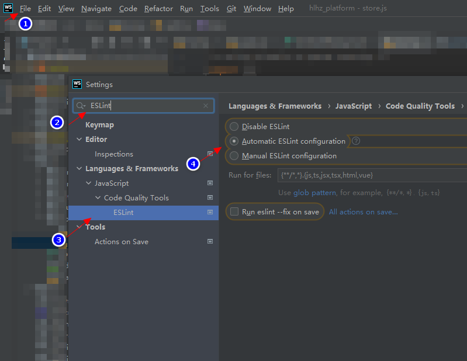

# 开发

## 1. 环境

```shell
node -v

    v16.13.1
```

## 2. 旧系统

* 登录页： [http://192.168.1.155](http://192.168.1.155)
* CRM ： [http://192.168.1.155/page/hlhz_crm_plus/index.html](http://192.168.1.155/page/hlhz_crm_plus/index.html)

## 3. 新系统

### 3.1. 安装

1. 下载 hlhz_platform 源文件

    * [hlhz_platform.zip](/code/hlhz_platform.zip)

2. 下载依赖项目 `@frontend/ui-theme`

    * [ui-theme.zip](/code/ui-theme.zip)

3. 解压以上两个压缩包，解压后的目录结构为：

    *   ```text
        ${root}/
            hlhz_platform/
            frontend/
                ui-theme
        ```  

4. 安装依赖

    *   ```shell
        cd hlhz_platform

        npm i
        ```  
5. 运行

    *   ```shell
        cd hlhz_platform

        npm run dev
        ```  

6. 访问

    * [http://localhost:8080/index.html](http://localhost:8080/index.html)

### 3.2. 启用 ESLint

在 webstorm 上启用 ESLint：

