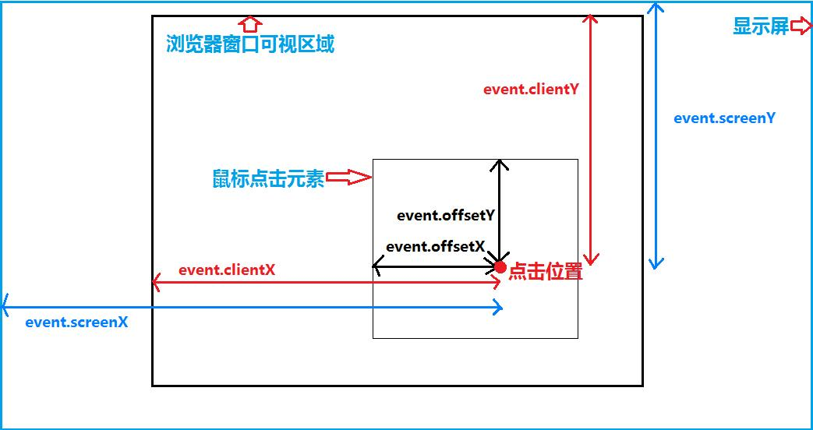

<!--#region
@author 吴钦飞
@email wuqinfei@qq.com
@create date 2023-11-28 10:29:40
@modify date 2023-11-28 10:30:10
@desc [description]
#endregion-->


# MouseEvent




## 1. 接口

```typescript
interface MouseEvent extends UIEvent {
  readonly altKey: boolean;
  readonly ctrlKey: boolean;
  readonly metaKey: boolean;
  readonly shiftKey: boolean;

  readonly clientX: number; // 视口坐标
  readonly clientY: number;

  readonly x: number; // 视口坐标
  readonly y: number;

  readonly pageX: number; // 文档坐标
  readonly pageY: number;

  readonly offsetX: number; // 相对 鼠标点击的元素 的偏移量
  readonly offsetY: number;

}
```


## 2. 参考

* [JS基础篇--了解JS的clientX、pageX、screenX等方法来获取鼠标坐标详解](https://segmentfault.com/a/1190000002405897)