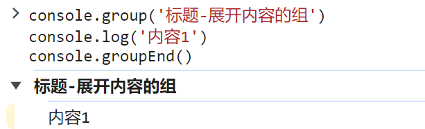
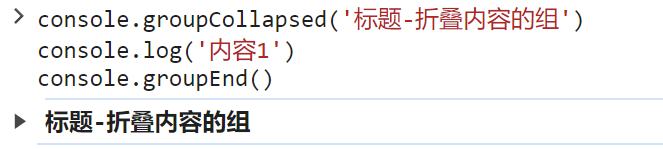

<!--#region
@author 吴钦飞
@email wuqinfei@qq.com
@create date 2024-08-15 10:14:17
@modify date 2024-08-15 10:14:18
@desc [description]
#endregion-->

# console - 控制台打印

## 1. 介绍

`console.log()` 控制台打印

## 2. 分组

### 2.1. 展开内容的组

代码：

```js
console.group('标题-展开内容的组')
console.log('内容1')
console.groupEnd()
```

图示：



### 2.2. 折叠内容的组

代码：

```js
console.groupCollapsed('标题-折叠内容的组')
console.log('内容1')
console.groupEnd()
```

图示：



## 3. 参考

* [console: group() static method](https://developer.mozilla.org/en-US/docs/Web/API/console/group_static)