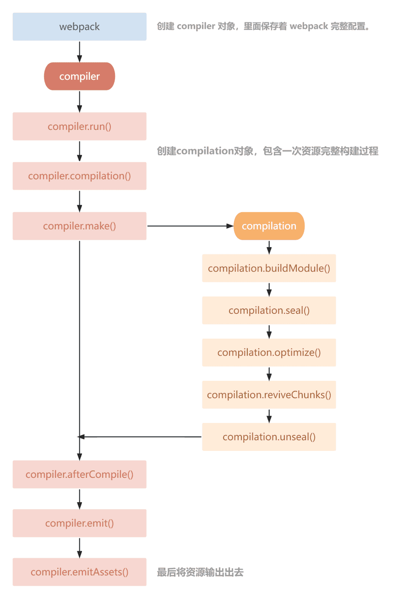

# webpack plugin

## 1. 介绍

通过插件我们可以扩展 webpack 的功能，加入自定义的构建行为，使 webpack 拥有更强的构建能力。

参考：

* [writing-a-plugin](https://webpack.js.org/contribute/writing-a-plugin/)

## 2. 工作原理

### 2.1. 《深入浅出 Webpack》

webpack 就像一条生产线，要经过一系列处理流程后才能将源文件转换成输出结果。 

这条生产线上的每个处理流程的职责都是单一的，多个流程之间有存在依赖关系，只有完成当前处理后才能交给下一个流程去处理。

插件就像是一个插入到生产线中的一个功能，在特定的时机对生产线上的资源做处理。

webpack 通过 tapable 来组织这条复杂的生产线。 

webpack 在运行过程中会广播事件，插件只需要监听它所关心的事件，就能加入到这条生产线中，去改变生产线的运作。

webpack 的事件流机制保证了插件的有序性，使得整个系统扩展性很好。

### 2.2. 代码逻辑

webpack 在编译代码过程中，会触发一系列 tapable 钩子事件，

插件所做的，就是找到相应的钩子，在上面挂上自己的任务（也就是注册事件），

这样，当 webpack 构建的时候，插件注册的事件就会随着钩子的触发而执行了。

## 3. webpack 内部钩子

### 3.1. 钩子

钩子的本质就是：事件。

为了方便我们直接介入和控制编译过程，webpack 把编译过程中触发的各类关键事件封装成事件接口暴露了出来。

这些接口被很形象地称做：hooks（钩子）。

### 3.2. tapable

tapable 为 webpack 提供了统一的插件接口（钩子）类型定义， 它是 webpack 的核心功能库。

webpack 中目前有十种 hooks，在 tapable 源码中可以看到，如下：

```js
// https://github.com/webpack/tapable/blob/master/lib/index.js
exports.SyncHook = require("./SyncHook");
exports.SyncBailHook = require("./SyncBailHook");
exports.SyncWaterfallHook = require("./SyncWaterfallHook");
exports.SyncLoopHook = require("./SyncLoopHook");
exports.AsyncParallelHook = require("./AsyncParallelHook");
exports.AsyncParallelBailHook = require("./AsyncParallelBailHook");
exports.AsyncSeriesHook = require("./AsyncSeriesHook");
exports.AsyncSeriesBailHook = require("./AsyncSeriesBailHook");
exports.AsyncSeriesLoopHook = require("./AsyncSeriesLoopHook");
exports.AsyncSeriesWaterfallHook = require("./AsyncSeriesWaterfallHook");
exports.HookMap = require("./HookMap");
exports.MultiHook = require("./MultiHook");
```

tapable 统一暴露了三个方法给插件，用于注入不同类型的自定义构建行为：

* `tap`：可以注册同步钩子和异步钩子。
* `tapAsync`：回调方式注册异步钩子。
* `tapPromise`：Promise 方式注册异步钩子。

## 4. 构建对象

### 4.1. compiler

compiler 对象中保存着完整的 webpack 环境配置，单实例（整个构建流程中，只有一个 compiler 对象）。

这个对象会在首次启动 Webpack 时创建，我们可以通过 compiler 对象上访问到 webpack 的主环境配置(如 loader、plugin 等)。

主要属性：

- `compiler.options`: webpack 配置（loaders、entry、output、 plugin 等等）。
- `compiler.inputFileSystem` 、 `compiler.outputFileSystem`: 文件操作，相当于 nodejs 中 fs。
- `compiler.hooks`: 注册 hook。

参考：

* [compiler-hooks](https://webpack.js.org/api/compiler-hooks/)

### 4.2. compilation

compilation 对象代表一次资源的构建(编译)，compilation 实例能够访问所有的模块和它们的依赖。

在编译阶段，模块会被加载(load)、封存(seal)、优化(optimize)、分块(chunk)、哈希(hash)、重新创建(restore)。

它有以下主要属性：

- `compilation.modules`: 可以访问所有模块。
- `compilation.chunks`: 可以访问所有代码块。
- `compilation.assets`: 可以访问本次打包生成所有文件的结果。
- `compilation.hooks`: 钩子。

参考：

* [compilation-hooks](https://webpack.js.org/api/compilation-hooks/)

### 4.3. 生命周期图



## 5. 第一个插件

目录：

* 项目目录: 

    ```text
    proj/
      plugins/
        my-first-plugin.js
      public/
        index.html
      src/
        main.js
      package.json
      webpack.config.js
    ```
  
配置：

* webpack.config.js: 

    ```javascript
    const MyFirstPlugin = require('./plugins/01.my-first-plugin');
    
    module.exports = {
      // ...
      plugins: [
        new MyFirstPlugin(),
      ]
    }
    ```

* my-first-plugin.js: 

    ```javascript
    /*
      webpack 编译流程：
    
        1. 加载 webpack.config.js 配置，此时 `new MyFirstPlugin()` 执行
        2. 创建 compiler 对象
        3. 挨个执行 plugin 中的 apply() 方法
     */
    class MyFirstPlugin {
      constructor() {
        console.log('MyFirstPlugin - constructor()');
      }
    
      apply(compiler) {
        console.log("MyFirstPlugin - apply()");
      }
    }
    
    module.exports = MyFirstPlugin;
    ```

## 6. 注册 hook

### 6.1. SyncHook(同步)

同步钩子，只能用 `tap` 注册

```javascript
class RegHooksPlugin {
  // ...
  apply(compiler) {
    compiler.hooks.initialize.tap('RegHooksPlugin', () => {
      console.log('RegHooksPlugin - compiler.hooks.initialize - SyncHook')
    });
  }
}
```

参考：[compiler-hooks/#initialize](https://webpack.js.org/api/compiler-hooks/#initialize)

### 6.2. AsyncSeriesHook

异步串行钩子，多个顺序执行

```javascript
class RegHooksPlugin {
  // ...
  apply(compiler) {
    compiler.hooks.beforeCompile.tap('RegHooksPlugin', () => {
      console.log('RegHooksPlugin - compiler.hooks.beforeCompile - AsyncSeriesHook - tap - 111')
    });
    
    compiler.hooks.beforeCompile.tapAsync('RegHooksPlugin', (compilationParams, callback) => {
      setTimeout(() => {
        console.log('RegHooksPlugin - compiler.hooks.beforeCompile - AsyncSeriesHook - tapAsync - 222')
        callback(); // callback() 执行后才会继续执行
      }, 2000);
    });
    
    compiler.hooks.beforeCompile.tapPromise('RegHooksPlugin', () => {
      return new Promise((resolve) => {
        setTimeout(() => {
          console.log('RegHooksPlugin - compiler.hooks.beforeCompile - AsyncSeriesHook - tapPromise - 333')
          resolve();
        }, 2000);
      });
    });
  }
}
```

参考：[compiler-hooks/#beforecompile](https://webpack.js.org/api/compiler-hooks/#beforecompile)


### 6.3. AsyncParallelHook

异步并行钩子，多个同时执行

```javascript
class RegHooksPlugin {
  // ...
  apply(compiler) {
    compiler.hooks.make.tap('RegHooksPlugin', (compilation) => {
      console.log('RegHooksPlugin - compiler.hooks.make - AsyncParallelHook - tap - 111')
    });
    
    compiler.hooks.make.tapAsync('RegHooksPlugin', (compilation, callback) => {
      setTimeout(() => {
        console.log('RegHooksPlugin - compiler.hooks.make - AsyncParallelHook - tapAsync - 222')
        callback(); // callback() 执行后才会继续执行
      }, 2000);
    });
    
    compiler.hooks.make.tapPromise('RegHooksPlugin', (compilation) => {
      return new Promise((resolve) => {
        setTimeout(() => {
          console.log('RegHooksPlugin - compiler.hooks.make - AsyncParallelHook - tapPromise - 333')
          resolve();
        }, 1000);
      });
    });
  }
}
```

参考：[compiler-hooks/#make](https://webpack.js.org/api/compiler-hooks/#make)

## 7. 使用 node 调试

1. 在项目根目录执行以下命令：

    ```shell
    node --inspect-brk ./node_modules/webpack-cli/bin/cli.js
   
    # Debugger listening on ws://127.0.0.1:9229/cfe3ee35-36e8-4f4d-a2a5-1c743849df73
    # For help, see: https://nodejs.org/en/docs/inspector
    ```

2. 打开 Chrome 浏览器控制台，有一个 nodejs 的绿色图标，点击即可显示调试界面：
  
  * 

备注：

* 也可以使用 webstorm 的调试功能

## 8. copyright-plugin

说明：

* 自定义一个 plugin，在输出的文本文件顶部添加版本信息

思路：

1. 在输出资源前 —— `compiler.hooks.emit`
2. 修改资源的内容 —— `compilation.assets`

配置：

* webpack.config.js:

    ```javascript
    const CopyrightPlugin = require('./plugins/copyright-plugin');
    module.exports = {
      plugins: [
        // ...
        new CopyrightPlugin({
          author: '吴钦飞',
          extensions: ['.js', '.css'],
        }),
      ]
    };
    ```

* copyright-plugin.js:

    ```javascript
    module.exports = class CopyrightPlugin {
      constructor(options = {}) {
        this.options = options;
      }
    
      apply(compiler) {
        compiler.hooks.emit.tap('CopyrightPlugin', (compilation) => {
          const { webpack } = compiler;
          const { RawSource } = webpack.sources;
          const { author, extensions } = this.options;
    
          /*
            {
              'js/main.js': Proxy{ RawSource },
              'index.html': Proxy{ RawSource },
            }
           */
          const { assets } = compilation;
    
          const scriptAssetKeys = Object.keys(assets)
            .filter((filename) => {
              const matched = extensions.some((extension) => filename.endsWith(extension));
              return matched;
            });
    
          scriptAssetKeys.forEach((key) => {
            const asset = assets[key];
            const content = asset.source();
    
            const newContent = `\
    /**
     * @author ${author}
     */
    ${content}`;
    
            assets[key] = new RawSource(newContent);
          })
        });
      }
    }
    ```

参考：

* [compiler-hooks/#emit](https://webpack.js.org/api/compiler-hooks/#emit)
* [webpack-sources](https://github.com/webpack/webpack-sources)

## 9. clean-plugin

说明：

* 自定义一个 plugin，在输出打包资源之前清空输出目录

思路：

1. 在输出资源前 —— `compiler.hooks.emit`
2. 删除目录及其中的文件 —— `compiler.outputFileSystem (fs)`
  * `compiler.options.output.path: outputPath`
  * `fs.rmSync(outputPath, { recursive: true })`

配置：

* webpack.config.js:

    ```javascript
    const CleanPlugin = require('./plugins/clean-plugin');
    module.exports = {
      plugins: [
        // ...
        new CleanPlugin(),
      ]
    };
    ```

* clean-plugin.js

```javascript
const path = require('path');

module.exports = class CleanPlugin {
  apply(compiler) {
    compiler.hooks.emit.tap('CleanPlugin', (compilation) => {
      const fs = compiler.outputFileSystem;
      const outputPath = compiler.options.output.path;

      fs.rmSync(outputPath, { recursive: true });
      // this.removeDir(outputPath, fs);
    });
  }

  removeDir(absDir, fs) {
    const filenames = fs.readdirSync(absDir);

    for (let i = 0, len = filenames.length; i < len; i++) {
      const filename = filenames[i];
      const absPath = path.join(absDir, filename);
      const fileStat = fs.statSync(absPath);

      if (fileStat.isDirectory()) {
        this.removeDir(absPath, fs);
        fs.rmdirSync(absPath);
        return;
      }

      fs.unlinkSync(absPath);
    }
  }
}
```

参考：

* [fs.rmSync(path, options)](https://nodejs.org/dist/latest-v18.x/docs/api/fs.html)
