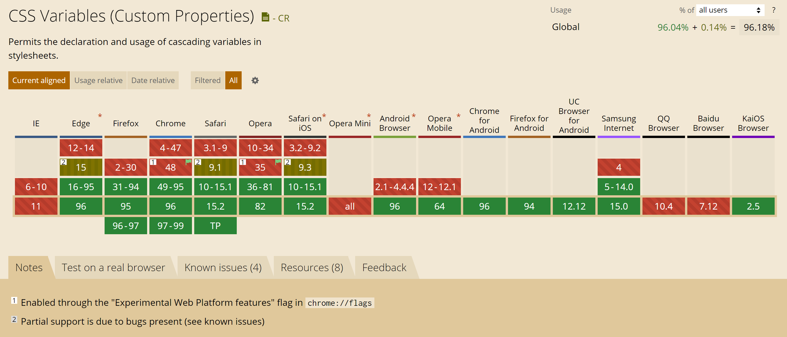

# CSS 变量

[[toc]]

## 1. 声明

在选择器中声明 CSS 变量。


```css
:root {
  --font-color: #333;
  --bg-color: #fff;
  --font-family: "Microsoft Yahei", Arial;
}
```

CSS 变量的优先级权重 与 声明时所在的选择器 一样；
同名的 CSS 变量，使用权重高的那个。

## 2. 使用

```css
.page {
  color: var(--font-color);
  background: var(--bg-color, transparent); /* 第二个参数为默认值 */
}
```

## 3. 兼容性

IE11 不兼容，详情如下图：



## 4. 参考

* [CSS 变量教程 —— 阮一峰](https://www.ruanyifeng.com/blog/2017/05/css-variables.html)
* [Can I Use](https://caniuse.com/?search=CSS%20Variables)
