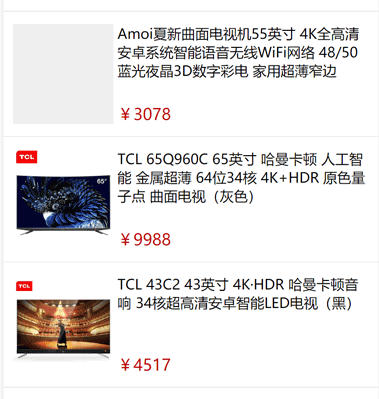

# 常用 UI 结构及命名

## 1. 商品列表

图示：



代码：

* 结构：

    ```html
    <div class="goods-list">

        <div class="goods-item" >
          
          <div class="goods-item-left">
            
          </div>
          
          <div class="goods-item-right">
            
            <div class="goods-name">{{ goods_name }}</div>
            
            <div class="goods-info-box">
              <span class="goods-price">{{ goods_price }}</span>
            </div>
            
          </div>
          
        </div>

    </div>
    ```

* 样式

    ```scss
    .goods-list {
      
      .goods-item {
        display: flex;
        padding: 12px 10px;
        border-bottom: solid 1px #efefef;
      }
      .goods-item-left {
        margin-right: 4px;
      }
      .goods-img {
        display: block;
        width: 100px;
        height: 100px;
        background-color: #efefef;
      }

      .goods-item-right {
        display: flex;
        flex-direction: column;
        justify-content: space-between;
      }
      .goods-name {
        font-size: 14px;
      }
      .goods-info-box {
        
      }
      .goods-price {
        font-size: 16px;
        color: #c00000;
      }
    }
    </style>
    ```