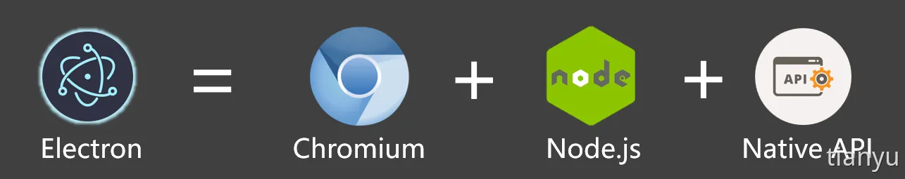
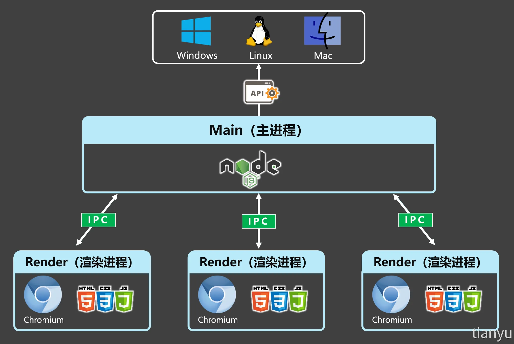

<!--#region
@author 吴钦飞
@email wuqinfei@qq.com
@create date 2025-08-02 17:10:48
@modify date 2025-08-02 17:12:04
@desc [description]
#endregion-->

# electron - 快速入门

## 1. 什么是 Electron？

Electron 是⼀个跨平台桌⾯应⽤开发框架，

开发者可以使⽤：HTML、CSS、JavaScript 等 Web 技术来构建桌⾯应⽤程序，

它的本质是结合了 Chromium 和 Node.js，现在⼴泛⽤于桌⾯应⽤程序开发

## 2. Electron 的优势

1. 可跨平台：同⼀套代码可以构建出能在：Windows、macOS、Linux 上运⾏的应⽤程序。
2. 上⼿容易：使⽤ Web 技术就可以轻松完成开发桌⾯应⽤程序。
3. 底层权限：允许应⽤程序访问⽂件系统、操作系统等底层功能，从⽽实现复杂的系统交互。
4. 社区⽀持：拥有⼀个庞⼤且活跃的社区，开发者可以轻松找到⽂档、教程和开源库。

## 3. Electron 技术架构

### 3.1. 技术架构

### 3.2. 进程模型

## 搭建⼀个⼯程