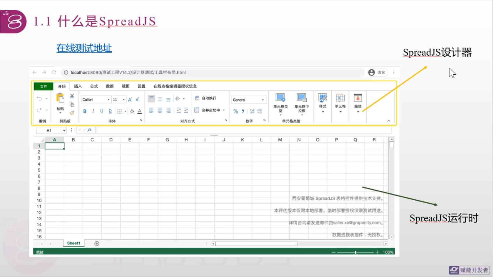
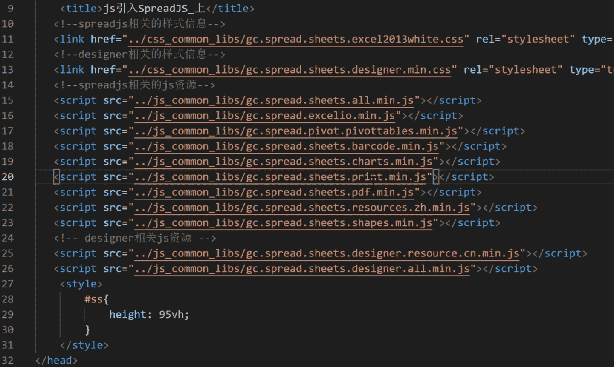

<!--#region
@author 吴钦飞
@email wuqinfei@qq.com
@create date 2024-04-18 21:59:01
@modify date 2024-04-18 21:59:11
@desc [description]
#endregion-->

# spreadjs 官方教程

## 1. 什么是 SpreadJS

说明：

* 纯前端 Excel 控件

SpreadJS 组成分为：

1. 设计器
2. 运行时



## 2. 引入

>spreajs v14

### 2.1. 原生 JS 引入

引入资源：

* 参考：[SpreadJS 中文文档 > 快速开始 > SpreadJS 组件库](https://demo.grapecity.com.cn/spreadjs/help/docs/getstarted/modules)
* 

实例化运行时：

* 参考： [SpreadJS 示例 > 功能例子 > 工作簿 > 初始化Spread](https://demo.grapecity.com.cn/spreadjs/SpreadJSTutorial/features/workbook/initialization/purejs)
* 代码：

    ```js
    window.onload = function () {
      // host the workbook control in a DIV element with id "ss"
      var spread = new GC.Spread.Sheets.Workbook(document.getElementById('ss'), {
        sheetCount: 1
      });

      /*
      * retrieve the spread workbook object from the host element using findControl static method.
      * var spread = GC.Spread.Sheets.findControl(document.getElementById('ss'));
      */
      initSpread(spread);
    };

    function initSpread(spread) {
      var sheet = spread.getActiveSheet();
      //Add text to first cell
      sheet.setValue(0, 0, "Hello World!");
    }
    ```

本地化：

* 参考：[SpreadJS 示例 > 功能例子 > 文化 > 本地化](https://demo.grapecity.com.cn/spreadjs/SpreadJSTutorial/features/culture/localization/purejs)
* 代码：

    ```js
    // 1. 引入对应语言资源

    // 2. 设置语言
    GC.Spread.Common.CultureManager.culture("zh-cn");
    ```
