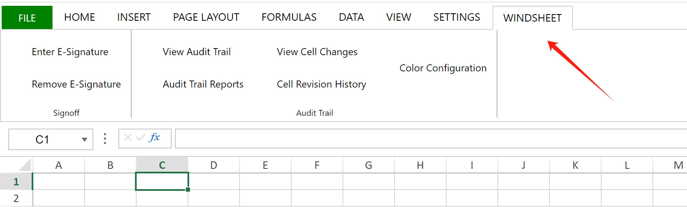
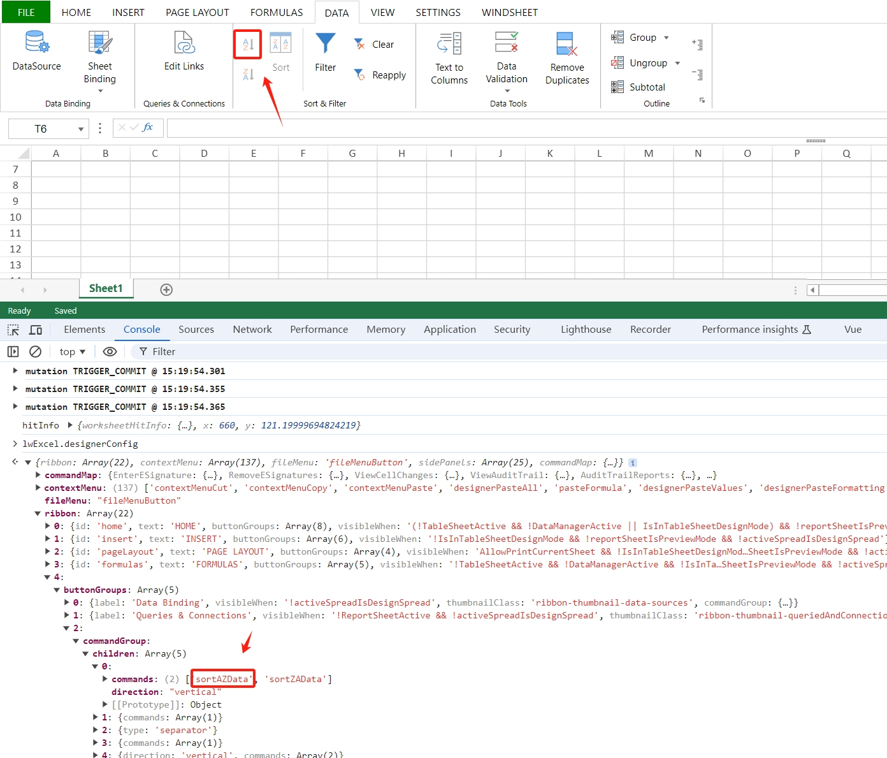

<!--#region
@author 吴钦飞
@email wuqinfei@qq.com
@create date 2024-04-10 19:31:33
@modify date 2025-03-04 10:17:15
@desc [description]
#endregion-->

# spread.js 快速入门

## 1. 介绍

vue3 项目，使用 spreadjs^16.1.4

## 2. 快速开始

### 2.1. v16.1.4

依赖:

```json
{
  "dependencies": {
    "@grapecity/spread-excelio": "^16.1.4",
    "@grapecity/spread-sheets": "^16.1.4",
    "@grapecity/spread-sheets-barcode": "^16.1.4",
    "@grapecity/spread-sheets-charts": "^16.1.4",
    "@grapecity/spread-sheets-designer": "^16.1.4",
    "@grapecity/spread-sheets-designer-resources-cn": "^16.1.4",
    "@grapecity/spread-sheets-designer-resources-en": "^16.1.4",
    "@grapecity/spread-sheets-designer-vue": "^16.1.4",
    "@grapecity/spread-sheets-io": "^16.1.4",
    "@grapecity/spread-sheets-languagepackages": "^16.1.4",
    "@grapecity/spread-sheets-pdf": "^16.1.4",
    "@grapecity/spread-sheets-pivot-addon": "^16.1.4",
    "@grapecity/spread-sheets-print": "^16.1.4",
    "@grapecity/spread-sheets-resources-zh": "^16.1.4",
    "@grapecity/spread-sheets-shapes": "^16.1.4",
    "@grapecity/spread-sheets-tablesheet": "^16.1.4",
    "@grapecity/spread-sheets-vue": "^16.1.4",
  }
}
```

引入:

```vue
<template>
  <div class="lw-online-excel">
    <Designer
      :styleInfo="styleInfo"
      :spreadOptions="spreadOptions"
      @designerInitialized="handleDesignerInitialized">
    </Designer>
  </div>
</template>
<script type="ts">
import { defineComponent } from 'vue';
import lodashGet from 'lodash.get';
import lodashSet from 'lodash.set';

import GC from '@grapecity/spread-sheets';
import '@grapecity/spread-sheets-vue';
import '@grapecity/spread-sheets-designer-resources-en';
import * as ExcelIO from '@grapecity/spread-excelio';
import Designer from '@grapecity/spread-sheets-designer-vue';

import '@grapecity/spread-sheets-designer/styles/gc.spread.sheets.designer.min.css';
import '@grapecity/spread-sheets/styles/gc.spread.sheets.excel2013white.css';

import { SPREAD_JS_LICENSES } from '@/commons/configs/constants';

GC.Spread.Sheets.Designer.LicenseKey = SPREAD_JS_LICENSES.designer;
GC.Spread.Sheets.LicenseKey = SPREAD_JS_LICENSES.sheets;
ExcelIO.LicenseKey = SPREAD_JS_LICENSES.sheets;

export default defineComponent({
  components: {
    Designer,
  },

  data() {
    return {
      styleInfo: { height: '100vh', width: '100vw' },
      spreadOptions: {
        sheetCount: 2,
      },
    };
  },

  methods: {
    // 该方法在 mounted 之前执行
    handleDesignerInitialized(designer: GC.Spread.Sheets.Designer) {
    },
  },
});
</script>
```

### 2.2. v17

```text
"@grapecity-software/spread-sheets-designer": "^17.0.0",
"@grapecity-software/spread-sheets-designer-resources-cn": "^17.0.0",
"@grapecity-software/spread-sheets-designer-resources-en": "^17.0.0",
"@grapecity-software/spread-sheets-designer-vue":"^17.0.0",
"@grapecity-software/spread-sheets-vue":"^17.0.0",
"@grapecity-software/spread-sheets": "^17.0.0",
"@grapecity-software/spread-sheets-resources-zh": "^17.0.0",
"@grapecity-software/spread-excelio": "^17.0.0",
"@grapecity-software/spread-sheets-barcode": "^17.0.0",
"@grapecity-software/spread-sheets-languagepackages": "^17.0.0",
"@grapecity-software/spread-sheets-print": "^17.0.0",
"@grapecity-software/spread-sheets-pdf": "^17.0.0",
"@grapecity-software/spread-sheets-shapes": "^17.0.0",
"@grapecity-software/spread-sheets-charts": "^17.0.0",
"@grapecity-software/spread-sheets-slicers": "^17.0.0",
"@grapecity-software/spread-sheets-formula-panel": "^17.0.0",
"@grapecity-software/spread-sheets-io": "^17.0.0",
"@grapecity-software/spread-sheets-pivot-addon": "^17.0.0",
"@grapecity-software/spread-sheets-tablesheet": "^17.0.0",
"@grapecity-software/spread-sheets-ganttsheet": "^17.0.0",
"@grapecity-software/spread-sheets-reportsheet-addon": "^17.0.0",
```

## 3. 设计器

### 3.1. options

说明：

* options 针对的是文件，载入其他的文件后，options 需要重新设置

示例：

```vue
<template>
  <!-- 如果没有载入外部文件，这个配置是生效的 -->
  <Designer
    :spread-options={
      newTabVisible: false,
    }
  />
</template>

<script>
// 文件载入完毕后，需要重新设置 options
designer.bind(GC.Spread.Sheets.Designer.Events.FileLoaded, (event, data)=>{
  const spread = designer.getWorkbook()

  spread.options = {
    ...spread.options,
    newTabVisible: false,
  };
});
</script>
```

### 3.2. 文件菜单

自定义保存的功能

```js
import lodashGet from 'lodash.get';
import lodashSet from 'lodash.set';

import GC from '@grapecity/spread-sheets';

export default {
  methods: {
    handleDesignerInitialized() {
      this.configFileMenu();
    },

    configFileMenu() {
      const that = this;
      const designer = GC.Spread.Sheets.Designer;

      const fileMenuPanelTemplate = designer.getTemplate(designer.TemplateNames.FileMenuPanelTemplate);

      /* {
        "type": "List",
        "listType": "menu",
        "listItemType": "menuitemradio",
        "className": "file-menu-category-list",
        "bindingPath": "activeCategory_main",
        "items": [
          {
            "text": "Open",
            "value": "OpenSJS"
          },
          {
            "text": "Save",
            "value": "SaveSJS"
          }
        ]
      } */
      // console.log(lodashGet(fileMenuPanelTemplate, 'content[0].children[0].children[0].children[0].children[3]'));

      lodashSet(fileMenuPanelTemplate, 'content[0].children[0].children[0].children[0].children[3].items', [
        { text: 'Save', value: 'lw_feature_save' },
      ]);

      designer.registerTemplate(
        designer.TemplateNames.FileMenuPanelTemplate,
        fileMenuPanelTemplate,
      );

      const defaultProcessPropertyChanged = designer.FileMenuHandler.processPropertyChanged;

      designer.FileMenuHandler.processPropertyChanged = function (context, bindingPath, itemValue) {
        console.log({ bindingPath, itemValue });

        if (itemValue === 'lw_feature_save') {
          that.saveFile();
        }

        defaultProcessPropertyChanged.apply(this, arguments);
      };
    },

    saveFile() {
      console.log('saveFile');
    },
  }
};
```

### 3.3. 设置当前选项卡

示例：

```js
/**
 * @param designer {GC.Spread.Sheets.Designer}
 */
handleDesignerInitialized(designer) {
  designer.activeRibbonTab('insert');

  // 查看所有 ribbon（选项卡）配置
  console.log(designer._config.ribbon);
}
```

参考：

* [表格设计器 - 设计器组件 - 定制 - 设定活动选项卡](https://demo.grapecity.com.cn/spreadjs/help/docs/designer/spreadjs_designer_component/customizations/set-active-ribbon)

### 3.4. 导入远程 Excel 文件

说明：

* 导入导出相关功能，需要引入 `gc.spread.io.x.x.x.min.js`

示例：

```js
function importRemoteExcel() {
  const blob = await axios.get( 'http://localhost:8088/test/1.xlsx', { responseType: 'blob' } );

  const file = new File([blob], '1.xlsx');

  spread.import(
    file,
    () => { console.log('import ok'); },
    (e) => {
      console.log(e);
      throw new Error(JSON.stringify(e));
    },
    { fileType: GC.Spread.Sheets.FileType.excel },
  );
}
```

参考：

* [SpreadJS 示例 > 功能例子 > 文件导入导出 > 概览](https://demo.grapecity.com.cn/spreadjs/SpreadJSTutorial/features/spreadjs-file-format/overview/vue)

### 3.5. sjs 文件的导入导出

打开 sjs 文件：

```ts
const blob = await axios.get( 'http://localhost:8088/test/1.sjs', { responseType: 'blob' } );

// 直接传 Blob 就可以了
spread.open(blob);

// 如果传 File，则 name 必须是 .sjs 后缀，如果是 .xlsx 则会当成 Excel 文件解析
const file = new File([blob], '1.sjs');
spread.open(file);
```

### 3.6. 自定义 tab

图示：

* 

示例1：

```vue
<template>
  <Designer :config="config"> </Designer>
</template>
<script type="ts">
import Designer from '@grapecity/spread-sheets-designer-vue';

export default defineComponent({
  components: {
    Designer,
  },

  data() {
    const config = GC.Spread.Sheets.Designer.DefaultConfig;

    config.commandMap = {
      EnterESignature: {
        text: 'Enter E-Signature',
        iconClass: 'lw-ribbon-icon-enter-e-signature',
        commandName: 'EnterESignature',
        execute(designer, propertyName, value) {
          console.log('EnterESignature');
        },
      },
    };

    config.ribbon.push({
      id: 'Windsheet',
      text: 'WINDSHEET',
      buttonGroups: [
        {
          label: 'Signoff',
          commandGroup: {
            children: [
              {
                direction: 'vertical',
                commands: [
                  'EnterESignature',
                ],
              },
            ],
          },
        },
      ],
    });

    return {
      config,
    }
  },
});
</script>
```

示例2:

```js
const config = GC.Spread.Sheets.Designer.DefaultConfig;

// 修改 config 的内容

// 应用修改后的 config 
designer.setConfig(config);
```

参考：

* [表格设计器 - 设计器组件 - 定制 - 添加自定义组件](https://demo.grapecity.com.cn/spreadjs/help/docs/designer/spreadjs_designer_component/customizations/add-custom-component)

### 3.7. setData

#### 3.7.1. 命令对象

说明：

* 命令对象 是否可用，可以通过自定义 key 来控制

图示：

* 

示例：

```js
// 查看 ribbon 中的命令对象
console.log(GC.Spread.Sheets.Designer.DefaultConfig)

// 获取命令对象
var sortAZDataCommand = GC.Spread.Sheets.Designer.getCommand("sortAZData");

// 在 enableContext 中设置 key
sortAZDataCommand.enableContext = "mySortAZData";

// 设置 key 的值
this.designer.setData("mySortAZData", false);
```

参考：

* [关于修改enableContext中内置变量的值的问题](https://gcdn.grapecity.com.cn/showtopic-151876-1-1.html)
* [表单保护下禁用工具栏按钮和右键菜单项](https://demo.grapecity.com.cn/spreadjs/help/docs/faqs/designer-menu-bar/disable-toolbar-buttons-and-right-click-menu-items-under-form-protection)

#### 3.7.2. 默认折叠工具栏

示例：

```js
designer.setData("isRibbonCollapse", true);
```

参考：

* [SpreadJS 中文文档 > 常见问题 > 表格设计器 > 默认折叠工具栏](https://demo.grapecity.com.cn/spreadjs/help/docs/faqs/spreadjsDesigner/collapse-toolbar)

#### 3.7.3. isFileModified

说明：

* 当该方法返回为true时，表示文件发生过变化。当我们对文件进行增加删除行列、填充背景、修改值等操作时，该方法都会返回true。
* 值得注意的是，如果在做了修改之后，再进行撤销回退到最初状态，该方法也会认为文件发生了变化，返回为true。

示例：

```js
designer.getData('isFileModified') 
```

参考：

* [问题：在SpreadJS中如何判断文件已经修改过？](https://demo.grapecity.com.cn/spreadjs/help/docs/faqs/spreadjsDesigner/isUpdate)

### 3.8. 字体列表中添加中文字体

说明：

* 在 HOME 选项卡中的字体列表中，添加中文字体

示例：

```js
const fontFamilyCmd = GC.Spread.Sheets.Designer.getCommand('fontFamily');

const customCNFont = [
  { value: '微软雅黑', text: '微软雅黑' },
  { value: '黑体', text: '黑体' },
];

fontFamilyCmd.dropdownList = customCNFont.concat(fontFamilyCmd.dropdownList);

var designerConfig = GC.Spread.Sheets.Designer.DefaultConfig;

if (!designerConfig.commandMap) {
  designerConfig.commandMap = {};
}

designerConfig.commandMap.fontFamily = fontFamilyCmd;

designer.setConfig(ribbonConfig);
```

参考：

* [在Designer中添加中文字体](https://gcdn.grapecity.com.cn/showtopic-201453-1-1.html)

### 3.9. 导出 PDF 时注册中文字体

说明：

* 导出 PDF 时，需要注册使用过的中文字体，否则会出现乱码
* 从 `C:\Windows\Fonts` 拷贝出对应的字体文件

示例：

```ts
const registerFont = async (name: string, type: string, path: string) => {
  const blob: Blob = await axios.get(path, { baseURL: '', responseType: 'blob' });

  const arrayBuffer = await new Promise<ArrayBuffer | null>((resolve) => {
    const reader = new FileReader();

    reader.onload = () => {
      resolve(reader.result as ArrayBuffer);
    };

    reader.readAsArrayBuffer(blob);
  });

  const font = (GC.Spread.Sheets.PDF.PDFFontsManager as any).getFont(name) || {};
  font[type] = arrayBuffer;
  GC.Spread.Sheets.PDF.PDFFontsManager.registerFont(name, font);
  console.log(`${name} 字体注册成功.`);
};

registerFont('黑体', 'normal', 'fonts/simhei.ttf')


// 设置默认中文字体 兜底的字体
const defaultFont = (GC.Spread.Sheets.PDF.PDFFontsManager as any).getFont('黑体').normal;

GC.Spread.Sheets.PDF.PDFFontsManager.fallbackFont = function fallbackFont() {
  return defaultFont;
};
```

参考：

* [导出PDF常见问题](https://demo.grapecity.com.cn/spreadjs/help/docs/faqs/file-import-export/pdf/pdf-chinese-error)

### 3.10. 表单控件

```ts
// 按钮-点击
spread.bind(GC.Spread.Sheets.Events.FormControlButtonClicked, this.handleFormControlButtonClicked);

function handleFormControlButtonClicked(e, info) {
  const shape = info.shape as GC.Spread.Sheets.Shapes.FormControlShape;

  console.log('button name', shape.name());
  console.log('button label', shape.text());
}


// 表单控件值变化
spread.bind(GC.Spread.Sheets.Events.FormControlValueChanged, this.handleFormControlValueChanged);

/**
 * info
 * info.sheet
 * info.sheetName 
 * info.shape {GC.Spread.Sheets.Shapes.Shape}
 * info.newValue
 * info.oldValue
 */
function handleFormControlValueChanged(e, info) {
  const shape = info.shape as GC.Spread.Sheets.Shapes.FormControlShape;

  const formControlType = shape.formControlType();
  
  if (formControlType === GC.Spread.Sheets.Shapes.FormControlType.checkBox) {
    // checkbox
  }
}


// 获取工作表的所有形状
sheet.shapes()


// 设置表单控件为只读
shape.enable(false)
```

### 3.11. i18n

示例：

1. 获取语言配置文件

    ```ts
    import '@grapecity-software/spread-sheets-designer-resources-en';

    console.log(GC.Spread.Sheets.Designer.getResources());

    // 在控制台右键“copy Object”，并保存为 designerEn.json 文件
    ```

2. 设置语言

    ```js
    import designerCn from '@/views/online-excel/commons/locale/designerCn.json';
    import designerEn from '@/views/online-excel/commons/locale/designerEn.json';

    export default {
      methods: {
        onDesignerInit(designer) { 
          GC.Spread.Sheets.Designer.setResources(designerEn);
          
          designer.setConfig(GC.Spread.Sheets.Designer.DefaultConfig);
        }
      }
    }
    ```

参考：

* [在线表格编辑器动态切换语言文件](https://gcdn.grapecity.com.cn/showtopic-159488-1-16.html)

### 3.12. 命令

```js
// 查看有哪些 命令
console.dir(LW.GC.Spread.Sheets.Designer.CommandNames)

// 执行 Sheet Bindings 命令
GC.Spread.Sheets.Designer.getCommand(GC.Spread.Sheets.Designer.CommandNames.DesignMode).execute(designer);
```

### 3.13. 打印

页脚设置 `&F`(工作簿的名称):

```js
// 打印时，&F 的值会取 spread.name 的值
spread.name = '/WindSheet/QA/0709/01/02.禁用复选框.xlt'
```

## 4. 运行时

### 4.1. sheet

type: `GC.Spread.Sheets.Worksheet`

#### 4.1.1. 设置 sheet 的个数

```js
spread.setSheetCount(5);
```

#### 4.1.2. 获取当前活动的 sheet

```ts
let sheet: GC.Spread.Sheets.Worksheet = spread.getActiveSheet();
```

#### 4.1.3. 名称

API:

```ts
/**
 * Gets or sets the name of the worksheet.
 * @param {string} [value] The name of the worksheet.
 * @returns {string|GC.Spread.Sheets.Worksheet} If no value is set, returns the worksheet name; otherwise, returns the worksheet.
 * @example
 * ```
 * spread.sheets[0].name("The first sheet");
 * spread.sheets[1].name( "The second sheet");
 * ```
 */
name(value?: string): any;
```

示例：

```js
const spread = designer.getWorkbook();

const sheet = spread.getActiveSheet();

sheet.name(); //=> sheet1
```

#### 4.1.4. 设置列数

```js
sheet.setColumnCount(100); // 当前 sheet 初始设置 100 列
```

#### 4.1.5. 获取行列总数

```js
sheet.getColumnCount();

sheet.getRowCount();
```

#### 4.1.6. 表单保护

说明：

* 限制表单的操作行为，例如不允许编辑，或调整行列高宽等

示例：

```js
// -- 通过 options 设置

// 设置
sheet.options.isProtected = true;
// <==> sheet.protect();

// 读取
sheet.options.isProtected; // true


// -- 用密码来保护工作表

const password = '123456';

sheet.protect(password);

sheet.hasPassword(); // true

sheet.unprotect(password); // true
```

参考：

* [SpreadJS 示例 > 功能例子 > 表单 > 表单保护](https://demo.grapecity.com.cn/spreadjs/SpreadJSTutorial/features/worksheet/protection/purejs)

#### 4.1.7. 保护选项

获取选项：

```js
sheet.options.protectionOptions;
/* 
{
  allowSelectLockedCells: true,
  allowSelectUnlockedCells: true,
  formatCells: true,
  allowSort: true,
  allowFilter: true,
  allowResizeRows: true,
  allowResizeColumns: true,
  allowEditObjects: true,
  allowDragInsertRows: true,
  allowDragInsertColumns: true,
  allowInsertRows: true,
  allowInsertColumns: true,
  allowDeleteRows: true,
  allowDeleteColumn: true,
  formatRows: true,
  formatColumns: true,
  allowOutlineColumns: true,
  allowOutlineRows: true,
}
*/
```

设置选项：

```js
sheet.options.protectionOptions.allowSelectLockedCells = false;
```

参考：

* [表单保护与锁定单元格](https://demo.grapecity.com.cn/spreadjs/help/docs/features/worksheet/celllock)

#### 4.1.8. 脏数据

```ts
// 获取脏数据
sheet.getDirtyCells(row: number,  col: number,  rowCount: number,  colCount: number): GC.Spread.Sheets.IDirtyCellInfo[];

export interface IDirtyCellInfo {
    row: number;
    col: number;
    newValue: any;
    oldValue: any;
}

// 删除脏数据
sheet.clearPendingChanges(clearChangeInfo?: GC.Spread.Sheets.IClearChangeInfo): void;

export interface IClearChangeInfo {
    row?: number;
    col?: number;
    rowCount?: number;
    colCount?: number;
    clearType?: GC.Spread.Sheets.ClearPendingChangeType;
}
export enum ClearPendingChangeType{
    /**
     * Clear dirty change.
     */
    dirty= 1,
    /**
     * Clear insert change.
     */
    insert= 2,
    /**
     * Clear deleted change.
     */
    delete= 4
}
```

#### 4.1.9. 设置光标焦点位置

说明:

* 设置完后，直接可以输入内容，
* 与设置选中区域是两码事

示例:

```js
sheet.setActiveCell(row, col);
```

### 4.2. event

参考：[SpreadJS 中文文档 > GC.Spread.Sheets > Classes > Events](https://demo.grapecity.com.cn/spreadjs/help/api/classes/GC.Spread.Sheets.Events)

#### 4.2.1. 绑定

```js
// 绑定到 workbook 上，所有 sheet 都会监听到
spread.bind(GC.Spread.Sheets.Events.EditChange, (sender, args) => {
  console.log(args);
});

// 绑定到
sheet.bind(GC.Spread.Sheets.Events.EditChange, (sender, args) => {
  console.log(args);
});
```

#### 4.2.2. EditChange

说明：

* 类比 输入框的 input 事件

#### 4.2.3. CellChanged

说明：

* 类比输入框的 blur 事件
* 编辑单元格时，如果之前有内容 则触发一次，如果之前没有内容 则触发两次（样式变化、值变化）

示例：

```ts
SPREAD.bind(GC.Spread.Sheets.Events.CellChanged, (event, info: GC.Spread.Sheets.ICellChangedEventArgs) => {
  if (info.propertyName !== 'value') {
    return;
  }

  this.handleCellChanged(info);
});
```

#### 4.2.4. ClipboardPasted

说明：

* 外部拷贝的内容

示例：

```ts
SPREAD.bind(GC.Spread.Sheets.Events.ClipboardPasted, (event, info: GC.Spread.Sheets.IClipboardPastedEventArgs) => {
  console.log('ClipboardPasted', event, info);
});
```

#### 4.2.5. EditStarting EditEnded

说明：

* EditStarting 里可以取消事件，达到禁止编辑的功能

示例：

```js
spread.bind(GC.Spread.Sheets.Events.EditStarting, (sender, args) => {
  console.log('EditStarting', args);

  // 禁止编辑 （取消事件）
  args.cancel = true;
});

spread.bind(GC.Spread.Sheets.Events.EditEnded, (sender, args) => {
  console.log('EditEnded', args);
});
```

#### 4.2.6. SelectionChanged

说明：

* 选中的区域变化后触发

#### 4.2.7. RangeChanged

说明：

* 对选中的区域按 “Delete” 键时会触发

示例：

```ts
SPREAD.bind(GC.Spread.Sheets.Events.RangeChanged, (event, info: GC.Spread.Sheets.IRangeChangedEventArgs) => {
  // 对选中的区域按 delete
  if (info.action === GC.Spread.Sheets.RangeChangedAction.clear) {
    const {
      sheetName,
      col,
      colCount,
      row,
      rowCount,
      changedCells,
    } = info;

    console.log('changedCells', changedCells);

    const dirtyCells = info.sheet.getDirtyCells(row, col, rowCount, colCount);

    // 旧数据 oldValue
    console.log('dirtyCells', dirtyCells);
  }
});
```

参考：

* [GC.Spread.Sheets.Events#rangechanged](https://demo.grapecity.com.cn/spreadjs/help/api/classes/GC.Spread.Sheets.Events#rangechanged)
* [GC.Spread.Sheets.RangeChangedAction](https://demo.grapecity.com.cn/spreadjs/help/api/enums/GC.Spread.Sheets.RangeChangedAction)
* [怎么获取被按键 delete 清除的数据](https://gcdn.grapecity.com.cn/showtopic-164047-1-1.html)

#### 4.2.8. ActiveSheetChanged

说明：

* 切换 sheet 时触发

#### 4.2.9. FileLoaded

说明：

* Spread.Sheets.Designer 文件加载完成时触发

示例：

```js
//使用FileLoaded事件示例
let designer = GC.Spread.Sheets.Designer.findControl(document.getElementById("gc-designer-container"));
designer.bind(GC.Spread.Sheets.Designer.Events.FileLoaded, (event, data)=>{
  console.log("file has loaded");
 });
```

### 4.3. 单元格

#### 4.3.1. 获取单元格

```js
sheet.getCell(1, 1, GC.Spread.Sheets.SheetArea.viewport);
```

#### 4.3.2. 根据自定义名称获取单元格

```ts
// Gets the specified custom name information.
spread.getCustomName(name: string): GC.Spread.Sheets.NameInfo;

// Gets all custom name information.
spread.getCustomNames(): GC.Spread.Sheets.NameInfo[];

class NameInfo {
  // Gets the base row of the custom named expression.
  getRow(): number;

  // Gets the base column of the custom named expression.
  getColumn(): number;

  // Gets the name of the current NameInfo object.
  getName(): string;
}
```

#### 4.3.3. 获取单元格集合

```js
// Get range by row and column info
sheet.getRange(1, 1, 10, 10, GC.Spread.Sheets.SheetArea.viewport);

// Or get range by range address
sheet.getRange('A1:A3', GC.Spread.Sheets.SheetArea.viewport);
```

#### 4.3.4. 获取选择的单元格集合

```js
const [selection] = sheet.getSelections();

// {row: 0, rowCount: 2, col: 0, colCount: 2} 
```

#### 4.3.5. Range 转 Formula

说明：

* 获取选中的单元格（区域），并将其转换为 `$A$1:$B$2` 的格式
* `GC.Spread.Sheets.CalcEngine.rangeToFormula(range: {row: number, rowCount: number, col: number, colCount: number})`

示例：

```js

/**
 * @param designer {GC.Spread.Sheets.Designer}
 */
handleDesignerInitialized(designer) {
  const spread = designer.getWorkbook();

  const sheet = spread.getActiveSheet();

  const [selection] = sheet.getSelections();

  // 将区域转化为公式
  const formula = GC.Spread.Sheets.CalcEngine.rangeToFormula(selection);

  console.log(selection, formula);

  /*  
  选中 A1 - B2 的区域：
  
    {row: 0, rowCount: 2, col: 0, colCount: 2} 
    
    '$A$1:$B$2'
  */
},
```

参考：

* [Convert numbers to letters beyond the 26 character alphabet](https://stackoverflow.com/questions/8240637/convert-numbers-to-letters-beyond-the-26-character-alphabet)
* [Convert excel column alphabet (e.g. AA) to number (e.g., 25)](https://stackoverflow.com/questions/9905533/convert-excel-column-alphabet-e-g-aa-to-number-e-g-25)

#### 4.3.6. Formula 转 Range

示例：

```ts
function convertFormulaAddressToRanges(formulaAddress: string, sheet?: GC.Spread.Sheets.Worksheet) {
  const worksheet = this.getSheet(sheet);

  const items = GC.Spread.Sheets.CalcEngine.formulaToRanges(worksheet, formulaAddress) as Array<{
    ranges: GC.Spread.Sheets.Range[],
    sheetName: string,
  }>;

  let ranges: GC.Spread.Sheets.Range[] = [];

  items.forEach((item) => {
    ranges = ranges.concat(item.ranges);
  });

  return ranges;
}
```

参考：

* [https://demo.grapecity.com.cn/spreadjs/help/api/modules/GC.Spread.Sheets.CalcEngine#formulatoranges](https://demo.grapecity.com.cn/spreadjs/help/api/modules/GC.Spread.Sheets.CalcEngine#formulatoranges)

#### 4.3.7. 设置内容

```js
sheet.setValue(6, 0, 'hello');

/**
 * Gets or sets the formatted text for the cell.
 * @param {string} [value] The cell text.
 * @returns {string|GC.Spread.Sheets.CellRange} If no value is set, returns the cell text; otherwise, returns the cell.
 * @example
 * ```
 * activeSheet.getCell(1,1).text("cell object");
 * ```
 */
GC.Spread.Sheets.CellRange.text(value?: string): any;
```

#### 4.3.8. 给单元格设置颜色

示例：

```js
var style = new GC.Spread.Sheets.Style();
style.backColor = 'red';
style.foreColor = 'green';

//set style to cell.
sheet.setStyle(5, 5, style, GC.Spread.Sheets.SheetArea.viewport);

//set style to row.
sheet.setStyle(5, -1, style, GC.Spread.Sheets.SheetArea.viewport);

//set style to column.
sheet.setStyle(-1, 5, style, GC.Spread.Sheets.SheetArea.viewport);

// set style to a range.
sheet.getRange(0, 0, 5, 5).setStyle(style);
sheet.getRange("A1:E5").setStyle(style);
```

参考：

* [https://demo.grapecity.com.cn/spreadjs/SpreadJSTutorial/features/cells/basic-style/purejs](https://demo.grapecity.com.cn/spreadjs/SpreadJSTutorial/features/cells/basic-style/purejs)

#### 4.3.9. 锁定单元格

```js
/**
 * Gets or sets whether the cell is locked. When the sheet is protected, the locked cell cannot be edited.
 * @param {boolean} [value] Set to `true` to lock the cell.
 * @returns {boolean|GC.Spread.Sheets.CellRange} If no value is set, returns whether the cell is locked; otherwise, returns the cell.
 * @example
 * ```
 * activeSheet.getRange(-1, 3, -1, 1, GC.Spread.Sheets.SheetArea.viewport).locked(true);
 * ```
 */
cellRange.locked(value?: boolean): any;
```

#### 4.3.10. 单元格批注

```js
// 设置
sheet.comments.add(5, 5, 'new comment!');

// 移除
sheet.comments.remove(5, 5);

// 获取指定单元格批注
var comment = sheet.comments.get(5, 5);

// 获取所有单元格批注
var comments = sheet.comments.all();


// 获取或设置批注是否根据其内容自动调整大小
comment.autoSize(true)

comment.width(200);
comment.height(100);
```

参考：

* [https://demo.grapecity.com.cn/spreadjs/SpreadJSTutorial/features/cells/comments/basic-comment/purejs](https://demo.grapecity.com.cn/spreadjs/SpreadJSTutorial/features/cells/comments/basic-comment/purejs)

#### 4.3.11. 禁用单元格编辑

方式一：（通过 锁定）

```js
sheet.options.isProtected = true;

spread.suspendPaint();
// 先解锁所有单元格
sheet.getRange(0, 0, sheet.getRowCount(), sheet.getColumnCount()).locked(false);

// 再让 个别单元格 不可编辑
// ...

spread.resumePaint();

// 缺点：设计器不可用了
```

方式二：（通过事件的方式）

```js
sheet.bind(GC.Spread.Sheets.Events.EditStarting, function (sender, args) {               
  console.log("Start cell editing.");             
  // 判断如果是不能编辑的单元格，则执行以下代码               
  args.cancel = true; 
});
```

参考：

* [SpreadJS 中文文档 > 常见问题 > 事件相关 > 单元格事件 > 禁止单元格编辑](https://demo.grapecity.com.cn/spreadjs/help/docs/faqs/EventRelated/CellEvents/disabledCell)
* [SpreadJS 中文文档 > 常见问题 > 工作表 > 表单保护 > 禁用单元格编辑](https://demo.grapecity.com.cn/spreadjs/help/docs/faqs/worksheet/protection/disableEditing)
* [SpreadJS 中文文档 > 产品特性 > 工作表 > 表单保护与锁定单元格](https://demo.grapecity.com.cn/spreadjs/help/docs/features/worksheet/celllock)
* [SpreadJS 示例 > 功能例子 > 表单 > 表单保护](https://demo.grapecity.com.cn/spreadjs/SpreadJSTutorial/features/worksheet/protection/purejs)

#### 4.3.12. 选中单元格

示例：

```js
// 添加 选择区域
sheet.addSelection()

// 获取 所有的选择区域
sheet.getSelections()

// 清除 所有选择区域
sheet.clearSelection()
```

参考：

* [SpreadJS 示例 > 功能例子 > 表单 > 选择单元格](https://demo.grapecity.com.cn/spreadjs/SpreadJSTutorial/features/worksheet/selection/purejs)

#### 4.3.13. 让单元格滚动到视口

示例：

```js
var verticalPosition = GC.Spread.Sheets.VerticalPosition.top;
var horizontalPosition = GC.Spread.Sheets.HorizontalPosition.left;
sheet.showCell(20, 3, verticalPosition, horizontalPosition);

// up code and down code work out the same result.
sheet.showColumn(3, horizontalPosition);
sheet.showRow(20, verticalPosition);
```

参考：

* [SpreadJS 示例 > 功能例子 > 表单 > 选择单元格](https://demo.grapecity.com.cn/spreadjs/SpreadJSTutorial/features/worksheet/selection/purejs)

#### 4.3.14. 获取合并的单元格

API:

```ts
sheet.getSpans(range?: GC.Spread.Sheets.Range,  sheetArea?: GC.Spread.Sheets.SheetArea): GC.Spread.Sheets.Range[];
```

示例：

```js
const sheet = excel.getSpread().getActiveSheet();

const [range] = sheet.getSelections();

console.log('sheet.getSpans(range)', sheet.getSpans(range));
```

#### 4.3.15. 判断单元格是不是公式

```ts
// 方式 1
sheet.getFormulaInformation(row: number,  col: number): GC.Spread.Sheets.IFormulaInfo

export interface IFormulaInfo{
    hasFormula?: boolean;
    baseRange?: GC.Spread.Sheets.Range;
    isArrayFormula?: boolean;
    formula?: string;
    formulaWithCulture?: string;
    isDynamicArray?: boolean;
}

// 方式 2
getFormula(row: number,  col: number,  sheetArea?: GC.Spread.Sheets.SheetArea): string;
```

#### 4.3.16. 复选框

```ts
export interface IValueChangedEventArgs{
  sheet: GC.Spread.Sheets.Worksheet;
  sheetName: string;
  row: number;
  col: number;
  oldValue: any;
  newValue: any;
}
spread.bind(GC.Spread.Sheets.Events.ValueChanged, (event, info: GC.Spread.Sheets.IValueChangedEventArgs) {
  const { row, col, sheet } = info;
  const cell = sheet.getCellType(row, col);

  if (cell instanceof GC.Spread.Sheets.CellTypes.CheckBox) {
    console.log('checkbox label', cell.caption());
  }

  if (cell instanceof GC.Spread.Sheets.CellTypes.RadioButtonList) {
    // do nothing
  }
});
```

参考：

* [复选框单元格](https://demo.grapecity.com.cn/spreadjs/SpreadJSTutorial/features/cells/cell-types/checkbox/purejs)
* [监听复选框中值的变化](https://demo.grapecity.com.cn/spreadjs/practice/events/monitor-checkbox-cell-value-change)

#### 4.3.17. 隐藏行/列

示例:

```ts
// 行
sheet.setRowVisible(row: number, visible: boolean);

// 列
sheet.setColumnVisible(col: number, visible: boolean);
```

#### 4.3.18. 标签（私有数据）

说明：

* 使用标签来存储私有的数据。 
* SpreadJS 支持单元格标签，行标签，列标签和工作表标签。

备注：

* 表单: 当 row 和 col 都为 -1 时
* 行:   当 col 为 -1 并且 row 大于等于 0 时
* 列:   当 row 为 -1 并且 col 大于等于 0 时
* 单元格: 当 row 大于等于 0 并且 col 大于等于 0 时

示例：

```js
sheet.getTab(row, col)

sheet.setTab(row, col)
```

参考：

* [标签 - 基本应用](https://demo.grapecity.com.cn/spreadjs/SpreadJSTutorial/features/cells/tags/tag-basic#timestamp)

### 4.4. 状态栏

说明：

* 在状态栏上添加自定义内容

示例：

```ts
const statusBar = GC.Spread.Sheets.StatusBar.findControl(document.getElementsByClassName('gc-statusBar')[0] as HTMLElement);

const StatusItem = new GC.Spread.Sheets.StatusBar.StatusItem('LW_EXCEL_STATUS', { menuContent: 'label', value: '' });

StatusItem.onCreateItemView = function (container) {
  const html = `
  <div class="lw-status-bar-item">
    <div class="lw-status-bar-item-icon"></div>
    <div class="lw-status-bar-item-text">保存中</div>
  `;
  
  jQuery(html).appendTo(container);
};

statusBar.add(StatusItem, 1);
```

```scss
.lw-status-bar-item {
  display: flex;
  align-items: center;

  &.lw-is-saving {
    .lw-status-bar-item-icon {
      visibility: visible;
    }
  }
}
.lw-status-bar-item-icon {
  height: 16px;
  width: 16px;
  background: url(./images/loading.gif) no-repeat center center;
  background-size: 100% 100%;
  visibility: hidden;
}
.lw-status-bar-item-text {
  padding-left: 4px;
}
```

参考：

* [SpreadJS 中文文档 > 常见问题 > 工作簿 > 状态栏 > 状态栏实现Excel筛选数量的提示](https://demo.grapecity.com.cn/spreadjs/help/docs/faqs/workbook/statusbar/show_filter_result_in_statusbar)

### 4.5. 命令

相关 API：

1. [GC.Spread.Commands](https://demo.grapecity.com.cn/spreadjs/help/api/modules/GC.Spread.Commands)

   * CommandManager
   * UndoManager
   * Key: 枚举类型，常用的按键的编码，

2. [GC.Spread.Commands.CommandManager](https://demo.grapecity.com.cn/spreadjs/help/api/classes/GC.Spread.Commands.CommandManager)

   * register
   * setShortcutKey
   * execute

3. [GC.Spread.Commands.UndoManager](https://demo.grapecity.com.cn/spreadjs/help/api/classes/GC.Spread.Commands.UndoManager)

4. [GC.Spread.Sheets.Commands](https://demo.grapecity.com.cn/spreadjs/help/api/modules/GC.Spread.Sheets.Commands)

   * SpreadJS目前支持的所有命令

#### 4.5.1. 注册自定义命令

```js
const DUMMY_COMMAND = 'lw_dummy_command';

spread.commandManager().register(DUMMY_COMMAND, () => console.log('do nothing'));

// setShortcutKey ，在某个按钮上追加命令，而非覆盖
spread.commandManager().setShortcutKey(DUMMY_COMMAND, GC.Spread.Commands.Key.del, false, false, false, false);
```

#### 4.5.2. 执行命令

```js
spread.commandManager().execute({ cmd: 'navigationDown', sheet: 'Sheet1' }); // 往下走一行
```

#### 4.5.3. 覆盖默认命令

```js
// 禁止删除
spread.commandManager().register('clearValues', () => console.log('clearValues: do nothing'));
// 禁止粘贴
spread.commandManager().register('clipboardPaste', () => console.log('clipboardPaste: do nothing'));
```

#### 4.5.4. 撤销和恢复

示例：

```ts
// 撤销
spread.undoManager().undo();

// 撤销栈
spread.undoManager().getUndoStack();

// 恢复栈
spread.undoManager().getRedoStack();

// 清除所有撤消、重做记录
spread.undoManager().clear();
```

参考：

* [SpreadJS 中文文档 > GC.Spread.Commands > Classes > UndoManager](https://demo.grapecity.com.cn/spreadjs/help/api/classes/GC.Spread.Commands.UndoManager#undo)
* [行为管理](https://demo.grapecity.com.cn/spreadjs/SpreadJSTutorial/features/worksheet/actions/undo-manager/purejs)
* [【v14】关于实时监听撤销的问题](https://gcdn.grapecity.com.cn/showtopic-164407-1-1.html)

### 4.6. 右键菜单

#### 4.6.1. sheet 保护时 rich text 可用

```ts
let spread;

function build() {
  const oldOpenMenu = workbook.contextMenu.onOpenMenu;

  spread.contextMenu.onOpenMenu = function onOpenMenu(
    // 所有的菜单数据
    menuData: GC.Spread.Sheets.ContextMenu.IMenuItemData[],
    // 要显示的菜单数据
    itemsDataForShown: GC.Spread.Sheets.ContextMenu.IMenuItemData[],
    // 右击目标的相关信息
    hitInfo: any,
  ) {
    const result = oldOpenMenu.apply(this, arguments as any);

    if ('worksheetHitInfo' in hitInfo) {
      onHitWorksheet(hitInfo as GC.Spread.Sheets.IWorkbookHitTestInformation, itemsDataForShown);
    }

    return result;
  };
}

function onHitWorksheet(hitInfo: GC.Spread.Sheets.IWorkbookHitTestInformation, itemsDataForShown: GC.Spread.Sheets.ContextMenu.IMenuItemData[]) {
  try {
    const sheet = spread.getActiveSheet();

    const { worksheetHitInfo: { row, col } } = hitInfo;

    if (row == null || col == null) {
      return;
    }

    const locked = sheet.getCell(row, col).locked();

    itemsDataForShown.forEach((itemMenuData) => {
      if (itemMenuData.command === 'richText' && !locked) {
        // eslint-disable-next-line no-param-reassign
        itemMenuData.disable = false;
      }
    });
  } catch (e) {
    console.warn(e);
  }
}
```

### 4.7. 表格

#### 4.7.1. 数据绑定

示例：

```js
// 表名不区分大小写，使用 “_” 作为连词符
const table = sheet.tables.findByName('Table1');

const data = {
  list: [
    { Num1: 1, Num2: 2 },
    { Num1: 3, Num2: 4 },
    { Num1: 5, Num2: 6 },
  ],
};

// 设置公式列
table.setColumnDataFormula(2, 'SUM([@[Num1]:[Num2]])');

// 设置 data path
table.bindingPath('list');

// 不基于数据源生成列头
table.autoGenerateColumns(false);

const source = new GC.Spread.Sheets.Bindings.CellBindingSource(data);
sheet.setDataSource(source);
```

通过程序 “点击” Sheet Bindings 按钮:

```js
// 查看有哪些 命令
console.dir(LW.GC.Spread.Sheets.Designer.CommandNames)

// 执行 Sheet Bindings 命令
GC.Spread.Sheets.Designer.getCommand(GC.Spread.Sheets.Designer.CommandNames.DesignMode).execute(designer);
```

#### 4.7.2. 获取表格的数据

示例：

```js
const table = sheet.tables.findByName('Table1');

const tableData = table.getSlicerData().data;

console.log(tableData);
/* =>

[
  [ { value: '张三', text: '张三' }, { value: 18, text: '18' } ],
  [ { value: '李四', text: '李四' }, { value: 21, text: '21' } ],
]
*/
```

### 4.8. 异步函数

定义：

```ts
import GC from '@grapecity/spread-sheets';

export class LwCrossRef extends GC.Spread.CalcEngine.Functions.AsyncFunction {
  constructor() {
    super('LwCrossRef', 3, 3, {
      description: 'Cross workbook reference',
      parameters: [
        { name: 'workbookId', optional: false },
        { name: 'sheetName', optional: false },
        { name: 'cellAddress', optional: false },
      ],
    });
  }

  evaluateAsync(context: GC.Spread.CalcEngine.AsyncEvaluateContext, args: any) {
    setInterval(() => {
      console.log('evaluateAsync', args);
      context.setAsyncResult(`现在时间${new Date()}`);
    }, 1000);
  }
}
```

注册：

```ts
const lwCrossRef = new LwCrossRef();
GC.Spread.CalcEngine.Functions.defineGlobalCustomFunction(lwCrossRef.name, lwCrossRef);
```

问题：

1. 通过手动输入公式的方式，公式是生效的（会执行 `evaluateAsync` 方法）
2. 但是保存文件后，再次打开，公式未（自动）执行 `evaluateAsync` 方法

## 5. 最佳实践

### 5.1. 挂起/恢复 渲染/事件

示例：

```js
var spread = new GC.Spread.Sheets.Workbook(document.getElementById("ss"));
var sheet = spread.getActiveSheet();

spread.bind(GC.Spread.Sheets.Events.CellChanged, function (sender, args) {
  console.log('CellChanged event fired for Cell[' + args.row + "," + args.col + "] having value " + sheet.getValue(args.row, args.col));
});

spread.suspendPaint();
spread.suspendEvent();

for (var i = 0; i < 20; i++) {
  for (var j = 0; j < 10; j++) {
    sheet.setValue(i, j, "111");
  }
}

spread.resumeEvent();
spread.resumePaint();

/* 在这种情况下，将仅对Cell [22,2]触发CellChanged事件
    而不是其他单元格，因为Cell [22，2]的值是在suspendEvent（）& resumeEvent（）方法的边界之后设置的 */
sheet.setValue(22, 2, "222");
```

参考：

* [SpreadJS 中文文档 > 最佳实践 > 事件监听的挂起与恢复](https://demo.grapecity.com.cn/spreadjs/help/docs/BestPractices/UsingsuspendEventandresumeEvent)

### 5.2. 设置大量数据

说明:

* 设置“一整块”的数据
* 当给单元格的值设置 `null` 时，相当于清除内容

示例：

```js
const data = [
  [ 1, 2, 3 ]
  [ 4, 5, 6 ]
];
const startRow = 1;
const startCol = 2;

// 方式 1: 挨个单元格赋值
for (let i = 0; i < data.length; i += 1) {
  const row = startRow + i;

  for (let j = 0; j < data[i].length; j += 1) {
    const col = startCol + j;
    const value = data[i][j];

    sheet.getCell(row, col).value(value);
  }
}


// 方式 2: 批量赋值
sheet.setArray(startRow, startCol, data);
```

总结:

* 方式 1，针对少量数据（比如 10 个以内）
* 方式 2，针对大量数据

参考：

* [设置大量数据](https://demo.grapecity.com.cn/spreadjs/help/docs/BestPractices/SettingLargeAmountsofData)
* [setArray](https://demo.grapecity.com.cn/spreadjs/help/api/classes/GC.Spread.Sheets.Worksheet#setarray)

## 6. 参考

* [spread js 示例](https://demo.grapecity.com.cn/spreadjs/SpreadJSTutorial/)
* [spread js 中文文档](https://demo.grapecity.com.cn/spreadjs/help/docs/overview)
* [spreadjs学习总结（持续更新）](https://huaweicloud.csdn.net/63a562c3b878a54545945e82.html)