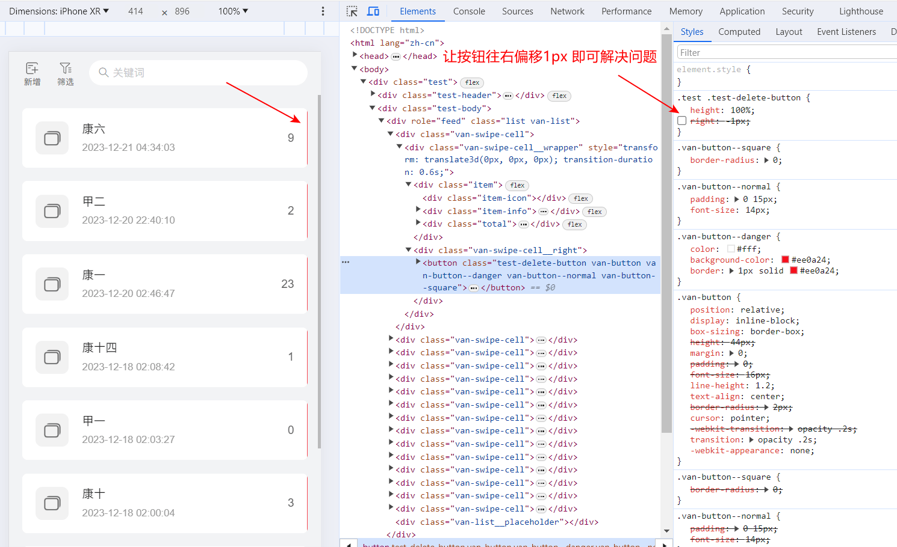

<!--#region
@author 吴钦飞
@email wuqinfei@qq.com
@create date 2024-01-29 15:04:26
@modify date 2024-01-29 15:04:28
@desc [description]
#endregion-->


# vant2 的使用

## 1. 介绍

官网： [https://vant-ui.github.io/vant/v2/#/zh-CN/home](https://vant-ui.github.io/vant/v2/#/zh-CN/home)

## 2. 问题

### 2.1. swipe-cell 右侧按钮显示了 1px

问题：

* 

解决：

* 让按钮往右偏移 1px 即可

示例：

```scss
.van-swipe-cell__right {
  .van-button--danger {
    right: -1px;
  }
}
```