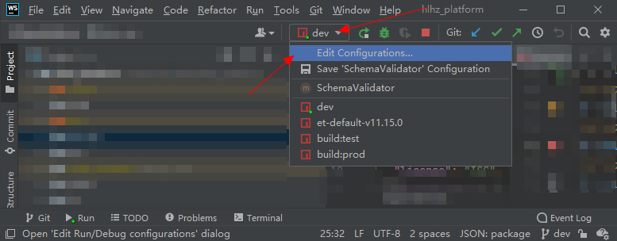

# 镜像源管理 —— nrm

## 1. 安装

```shell
npm install -g nrm
```

## 2. 命令

新增华为镜像源：

```shell
nrm add huawei https://repo.huaweicloud.com/repository/npm/
```

应用镜像源：

```shell
nrm use huawei
```

查看所有镜像源：

```shell
nrm ls

  npm ---------- https://registry.npmjs.org/
  yarn --------- https://registry.yarnpkg.com/
  tencent ------ https://mirrors.cloud.tencent.com/npm/
  cnpm --------- https://r.cnpmjs.org/
  taobao ------- https://registry.npmmirror.com/
  npmMirror ---- https://skimdb.npmjs.com/registry/
* huawei ------- https://repo.huaweicloud.com/repository/npm/
```

其他：

```shell
# 查看 npm registry 配置
npm config get registry
  
  https://repo.huaweicloud.com/repository/npm/

# （win10）查看 home 目录下的 .npmrc 文件
type C:\Users\wuqinfei\.npmrc

  registry=https://repo.huaweicloud.com/repository/npm/
```


## 3. 参考

* [https://github.com/Pana/nrm](https://github.com/Pana/nrm)

# 3. 在 webstorm 中的应用

## 3.1. 设置项目默认的 node.js 版本


## 3.2. 对不同的命令设置不同的 node.js 版本

打开配置：



设置：


