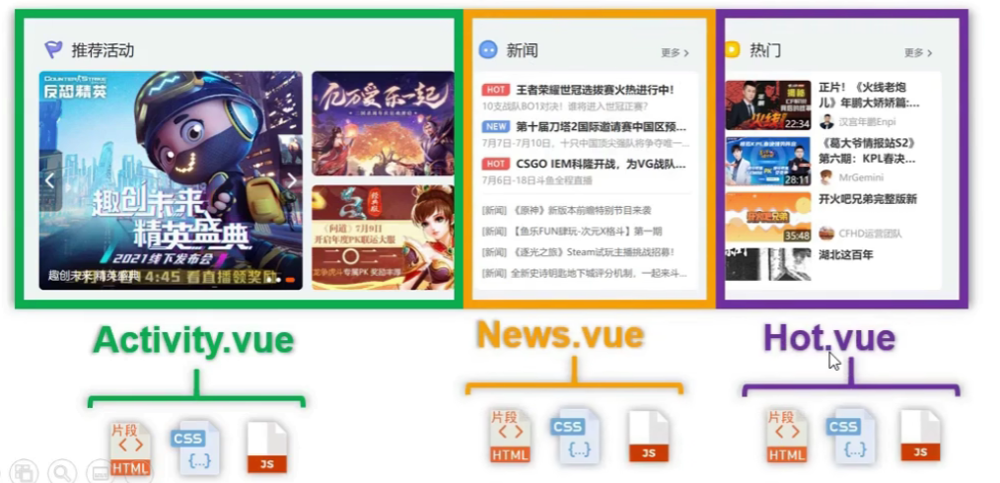

# 简介

## Vue 是什么

一套用于构建用户界面的渐进式 JavaScript 框架

渐进式：

* Vue 可以自底向上逐层的应用
* 简单应用，只需要核心库
* 复杂应用，可以引入各种 Vue 插件

## 谁开发的

尤雨溪：

* 2013 年，发布 0.6.0
* 2014 年，发布 0.8.0
* 2015 年，发布 1.0.0
* 2016 年，发布 2.0.0
* 2020 年，发布 3.0.0

## Vue 的特点

### 组件化

采用组件化模式，提高代码复用率、且让代码更好维护。



### 声明式

声明式编码，让编码人员无需直接操作DOM，提高开发效率。

比如要实现一个新闻列表，有一个列表和容器：

```html
<!--
const list = [
  { id: 1, title: '新闻1' },
  { id: 2, title: '新闻2' },
  { id: 3, title: '新闻3' },
];
-->
<ul id="news">
</ul>
```

命令式编码：

```javascript
let html = '';

list.forEach((item) => {
  html += `<li>${item.title}</li>`
});

const newsElt = document.querySelector('#news');
// 修改内容（亲自操作DOM）
newsElt.innerHTML = html;
```

声明式编码：

```html
<ul id="news">
  <li v-for="item in list">{{ item.title }}</li>
</ul>
```

### 虚拟DOM + diff算法

复用 DOM 节点。

如果数据 `list` 数据频繁变化，不需要频繁创建销毁DOM节点。