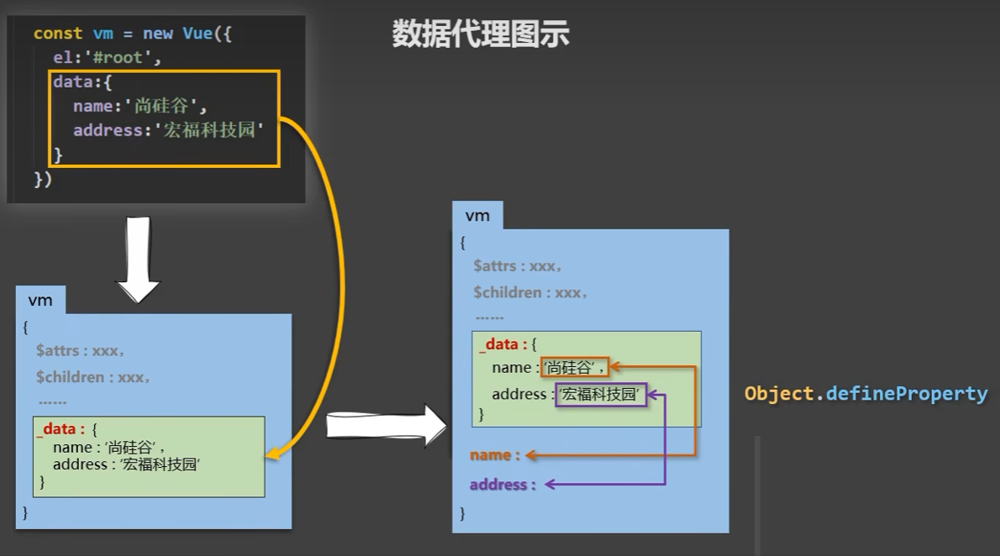

# 数据代理

## 1. Object.defineProperty()

将 `number` 与 `person.age` 关联起来。

```javascript
let number = 18;

let person = {
  name: '张三',
};

Object.defineProperty(person, 'age', {
  // value: 18,
  // enumerable: true,  // 可枚举: false(default); true
  // writable: true,    // 可修改：false(default); true
  // configurable: true,// 可删除：false(default); true

  get() {
    return number;
  },

  set(value) {
    number = value;
  }
});

console.log(person.age);

number = 20;

console.log(person.age);
```

<iframe height="299.99998474121094" style="width: 100%;" scrolling="no" title="Untitled" src="https://codepen.io/forwardNow/embed/YzaWoRQ?default-tab=js%2Cresult" frameborder="no" loading="lazy" allowtransparency="true" allowfullscreen="true">
  See the Pen <a href="https://codepen.io/forwardNow/pen/YzaWoRQ">
  Untitled</a> by forwardNow (<a href="https://codepen.io/forwardNow">@forwardNow</a>)
  on <a href="https://codepen.io">CodePen</a>.
</iframe>

## 2. 什么是数据代理

定义：

* 通过**一个对象**代理**对另一个对象中属性**的操作（读/写）

示例：

```javascript
const person = { age: 18 };
const proxy = { /* age: 18 */ };

Object.defineProperty(proxy, 'age', {
  get() {
    return person.age;
  },
  
  set(value) {
    person.age = value;
  }
});

console.log('before', proxy.age, person.age); // 18 18

proxy.age = 20;

console.log('after', proxy.age, person.age); // 20 20
```

<iframe height="300" style="width: 100%;" scrolling="no" title="Untitled" src="https://codepen.io/forwardNow/embed/zYWBVVr?default-tab=js%2Cresult" frameborder="no" loading="lazy" allowtransparency="true" allowfullscreen="true">
  See the Pen <a href="https://codepen.io/forwardNow/pen/zYWBVVr">
  Untitled</a> by forwardNow (<a href="https://codepen.io/forwardNow">@forwardNow</a>)
  on <a href="https://codepen.io">CodePen</a>.
</iframe>

## 3. Vue中的数据代理



```javascript
const options = {
  data: {
    age: 18,
  },
};
const vm = new Vue(options);
```

1. 收集数据
   * `vm._data === options.data;`
   * 模板： `{{ _data.age }}`

2. 代理数据
   
   ```javascript
   Object.defineProperty(vm, 'age', {
      get() {
        return vm._data.age;
      },
      set(value) {
        vm._data.age = value;
      }    
   })
   ```
